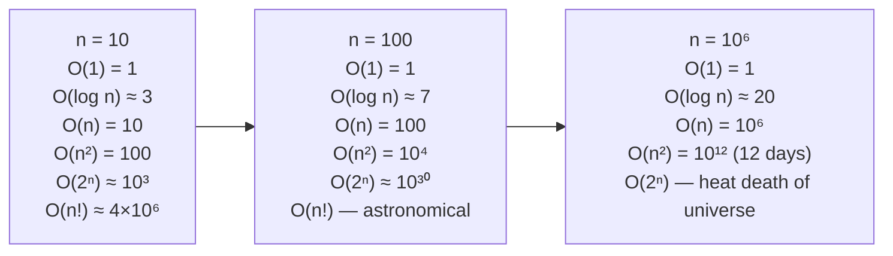

# Computational complexity and Big-O

A candidate stares at the constraint line. `n <= 10^9`. Sixty seconds in, they propose a single pass through the array. The interviewer waits. The candidate doesn't catch why.

A billion items at one nanosecond each is a full second of CPU time before any work happens, and that estimate assumes free memory and a perfect cache. A real linear scan over `10^9` items takes ten to thirty seconds on production hardware. The interviewer wasn't being coy. The constraint was the entire question. When `n` reaches a billion, you cannot read the input in linear time, which means the algorithm has to be `O(log n)`, a closed-form formula, or a precomputed lookup. There is no scan that fits.

Every later chapter assumes you can do this calculation in your head. Sliding window at `n = 10^5`, segment tree at `n = 10^6`, dynamic programming at `n = 5000` — each constraint implies a complexity ceiling, and the algorithm has to fit underneath. The whole book hangs on this page.

## What "complexity" actually means

Engineers use asymptotic notation in three places. Before writing code, given an input bound, they estimate whether a candidate algorithm fits the implicit time budget. Compiled C++, Java, and Go run roughly `10^8` simple operations per second on most online judges; Python runs about `10^7`. The decision *"is `O(n^2)` going to time out at `n = 10^5`?"* is made before any code is typed. (Yes, it will: `10^{10}` operations is two minutes, not one second.) During interviews, Big-O is the most-asked concept by a wide margin, both as a stand-alone question and as the implicit framing of every algorithmic problem. In production, the same notation gates real choices: hashmap or tree, recursion or iteration, eager or lazy, in-memory or streaming.

You aren't deriving theorems. You're reading and writing `O(...)` expressions as a shared dialect across libraries, papers, code reviews, and design docs. What follows is that dialect.

## How to read a complexity bound

Five Bachmann-Landau notations carry the load. Big-O and Big-Theta do most of the day-to-day work; the others appear in proofs and lower-bound statements.

**Big-O (asymptotic upper bound).** `f(n) = O(g(n))` if there exist positive constants `c` and `n_0` such that `0 <= f(n) <= c · g(n)` for all `n >= n_0`.[^1] Read aloud: `f` is bounded above by some constant multiple of `g`, eventually. The set-membership phrasing `f(n) ∈ O(g(n))` is mathematically cleaner, but the equality form is what CLRS uses[^1] and what every paper, textbook, and code review writes for the next ten years.

The `=` is one-way. `n = O(n^2)` is true. `O(n^2) = n` is nonsense. Knuth's catch: *"Aristotle is a man, but a man is not necessarily Aristotle."*[^2] Read the equality as "is."

**Big-Omega (asymptotic lower bound).** `f(n) = Ω(g(n))` if `0 <= c · g(n) <= f(n)` for all `n >= n_0`. Knuth introduced this definition in 1976 because he argued the prior Hardy-Littlewood Omega from analytic number theory was the wrong tool for algorithm analysis.[^2] CLRS, Sedgewick, and Erickson all use Knuth's version. So should you.

**Big-Theta (asymptotic tight bound).** `f(n) = Θ(g(n))` if and only if `f(n) = O(g(n))` and `f(n) = Ω(g(n))`.[^1] When you say an algorithm is `Θ(n log n)`, both bounds are matched and there is no slack. Use Theta when both bounds are known. Use O when only the upper bound is established or when the upper bound is what the listener needs. Interviews almost always ask for the upper bound.

**Little-o.** `f(n) = o(g(n))` if `lim f(n)/g(n) = 0`. The crucial difference from O: in big-O the constant `c` is fixed once and exists, while in little-o the inequality holds for *every* `c`, no matter how small. So `n = o(n^2)` is true (`n` grows strictly slower) but `n = o(n)` is false (`n` is the same order, not strictly smaller).

You will see little-o in lower-bound proofs and in derivations like `T(n) = n^2 + o(n^2)` meaning *the dominant term is `n^2` with smaller corrections*. Little-omega is its mirror and shows up almost never.

The whole formal apparatus exists to support one operational habit. When you write `O(n log n)`, you mean *this algorithm's running time grows at most as fast as some constant times `n log n`, for inputs large enough that the constants stop mattering*. Three rules drop out:

1. **Drop the constants.** `7n + 100 = O(n)`. A constant prefix doesn't change asymptotic behaviour.
2. **Drop the lower-order terms.** `n^2 + n log n + 50 = O(n^2)`. The dominant term wins.
3. **Take the worst case.** Unless the problem explicitly asks for average or expected time, "complexity" means worst-case complexity.

These three rules handle 95% of analysis you'll do.

## What "constant factor" actually means

The constant in `O(n)` matters in practice and is invisible in notation. CLRS Chapter 3 makes this explicit: an `O(n)` algorithm with a constant of `1000` is slower at `n = 100` than an `O(n^2)` algorithm with a constant of `1`.[^1] The crossover happens around `n = 1000`. Asymptotic notation correctly predicts which one wins eventually, and is silent about everything before "eventually."

Insertion sort versus merge sort makes the trade concrete. Insertion sort runs in `Θ(n^2)` worst case with a small constant, typically two or three array accesses per inner-loop iteration. Merge sort runs in `Θ(n log n)` with a much larger constant: an allocation per merge, two reads and one write per element per level, recursion overhead. At `n = 50` insertion sort beats merge sort on real hardware. At `n = 5,000` it doesn't, by roughly a factor of thirty.

Production sort routines exploit this directly. Java's `Arrays.sort` and Python's TimSort both use insertion sort for runs shorter than ~32 and switch to a divide-and-conquer strategy above that. The Big-O of the combined algorithm is still `Θ(n log n)`; the production code is fastest because it picks the better constant for each input size.

The lesson is short. Big-O is a planning tool. When the constraint says `n <= 50`, you can use the asymptotically worse algorithm if its constant is tiny. When the constraint says `n <= 10^5`, you can't.

## The hierarchy you'll meet

The set of complexity classes that show up in interviews is small. Memorise it.

| Class | Notation | Where you meet it |
|---|---|---|
| Constant | `O(1)` | Array indexing, hash-map average lookup, fixed-size lookup table |
| Inverse Ackermann | `O(α(n))` | Union-Find amortised per operation (Tarjan 1975) |
| Logarithmic | `O(log n)` | Binary search, balanced BST, binomial heap |
| Square-root | `O(√n)` | Trial-division primality, Mo's algorithm |
| Linear | `O(n)` | Single-pass scan, BFS/DFS in `O(V + E)`, KMP matching |
| Linearithmic | `O(n log n)` | Merge sort, heapsort, FFT; the comparison-sort lower bound |
| Quadratic | `O(n^2)` | Nested-loop pairwise scan, naive 3SUM |
| Cubic | `O(n^3)` | Floyd-Warshall, naive matrix multiply |
| Exponential | `O(2^n)` | Subset enumeration, bitmask DP without pruning |
| Factorial | `O(n!)` | Permutation enumeration, brute-force TSP |

The growth gap between these classes is dramatic, and the dramatic part hides inside the log axis:



*At `n = 100`, an `O(2^n)` algorithm needs more operations than there are atoms in the observable universe. Lower-order terms stop mattering long before the higher-order ones become catastrophic.*

The practical question is "what fits in one second." Given the standard one-second budget on a compiled-language judge, the input-size table is a more useful weapon than the formal definition:

| Input size | Algorithms that fit |
|---|---|
| `n <= 10` | `O(n!)`, `O(2^n)` — anything goes |
| `n <= 20` | `O(2^n)` (~`10^6` ops), bitmask DP |
| `n <= 500` | `O(n^3)` (~`10^8`) |
| `n <= 5,000` | `O(n^2)` (~`2.5 × 10^7`) |
| `n <= 10^5` | `O(n log n)` and `O(n)` |
| `n <= 10^6` | `O(n log n)`, `O(n)` |
| `n <= 10^9` | `O(log n)` and `O(1)` only |

The bottom row is the one to internalise. When a problem hands you `n = 10^9`, the answer involves binary search on the answer, a closed-form formula, or a precomputed structure. Everything else times out before it finishes reading the input.

## The master theorem

Divide-and-conquer algorithms produce recurrences of the form

```text
T(n) = a · T(n/b) + f(n)
```

where `a >= 1`, `b > 1`, and `f(n)` is the work done at the top level to split and recombine. The master theorem solves recurrences of this shape in three cases, keyed on a critical exponent `c_crit = log_b(a)`.[^3]

**Case 1 — subproblems dominate.** If `f(n) = O(n^c)` with `c < c_crit`, then `T(n) = Θ(n^{c_{crit}})`.

**Case 2 — balanced.** If `f(n) = Θ(n^{c_{crit}} · (log n)^k)` for `k >= 0`, then `T(n) = Θ(n^{c_{crit}} · (log n)^{k+1})`.

**Case 3 — split work dominates.** If `f(n) = Ω(n^c)` with `c > c_crit`, and the regularity condition `a · f(n/b) <= k · f(n)` holds for some `k < 1`, then `T(n) = Θ(f(n))`.

Three applications you'll see repeatedly:

| Algorithm | Recurrence | Master case | Result |
|---|---|---|---|
| Binary search | `T(n) = T(n/2) + O(1)` | Case 2, k=0 | `O(log n)` |
| Merge sort | `T(n) = 2T(n/2) + O(n)` | Case 2, k=0 | `O(n log n)` |
| Karatsuba multiply | `T(n) = 3T(n/2) + O(n)` | Case 1 (`log_2 3 ≈ 1.585`) | `O(n^{1.585})` |

The theorem has gaps. Recurrences with non-polynomial gap between `f(n)` and `n^{c_{crit}}` (like `T(n) = 2T(n/2) + n/log n`) don't fit any case and need the Akra-Bazzi method. The handbook flags Akra-Bazzi when it surfaces and otherwise stays with the master theorem.

## Amortised analysis

Worst-case-per-operation analysis fails when a data structure has cheap operations punctuated by occasional expensive ones. A dynamic array's push is usually `O(1)`. Once in a while the buffer fills and the array doubles, which is `O(n)` work in that single push. Asking *what's the worst case?* gives `O(n)`. Asking *what's the worst case averaged across a long sequence?* gives `O(1)`. The second answer is the useful one for capacity planning, and the technique that produces it is amortised analysis.

Tarjan's 1985 paper formalised the framework.[^4] His framing: *"By averaging the running time per operation over a worst-case sequence of operations, we can sometimes obtain an overall time bound much smaller than the worst-case time per operation multiplied by the number of operations."*

Three methods, all introduced in CLRS Chapter 16.[^1]

**Aggregate.** Bound the total cost `T(n)` of any sequence of `n` operations, then divide. For dynamic-array push: `n` pushes cost `T(n) = O(n)` total, because the resize work forms the geometric series `1 + 2 + 4 + ... + n/2 + n = 2n - 1`. Amortised cost per push is `O(1)`.

**Banker's (accounting).** Charge each operation an artificial amortised cost which may differ from its actual cost. Cheap operations are charged extra; the surplus accumulates as "credit" stored in the data structure. Expensive operations spend the credit. For dynamic-array push, charge 3 per push: one unit pays for the immediate insertion, one unit pre-pays for moving this element when the array doubles next, and one unit pre-pays for moving the partner element that came in earlier. When doubling fires, the credit on every previously-inserted element exactly covers its move.

**Potential.** Define a non-negative function `Φ` of the data structure's state. The amortised cost of an operation is its actual cost plus `Φ_after - Φ_before`. For dynamic array, take `Φ = 2 · num_elements - capacity`. When push doesn't trigger resize, Φ rises by 2 and amortised cost is `actual + 2 = 3`. When push triggers a resize from `k` to `2k`, actual cost is `k + 1` and Φ drops from `k` to `2`, so amortised is `(k + 1) + (2 - k) = 3`. Same answer, derived two ways.

The crucial caveat: amortised `O(1)` does not mean every operation is `O(1)`. The push that triggers the resize is genuinely `O(n)` in that moment. Hard real-time systems — game audio buffers, embedded controllers, low-latency trading — care about worst-case-per-operation and may use a deamortised data structure or a fixed-capacity ring buffer for exactly this reason.

You'll meet amortised bounds again in [Dynamic array internals](../part-1-linear-data-structures/01-dynamic-array-internals.md) (the doubling proof gets the full step-by-step treatment), Union-Find with path compression at `O(α(n))` per operation, and splay trees at `O(log n)` amortised despite `O(n)` worst case.

## Space–time tradeoffs

Time and space are not independent budgets. Memoising a recursive Fibonacci pays `O(n)` space to drop the time from `O(2^n)` to `O(n)`, an exponential reduction at a linear cost. The principle has been recognised since Knuth's TAOCP Volume 1 §1.2.11, and Bentley's *Programming Pearls* names it as a design principle. Anytime a system caches a derived value rather than recomputing, it pays space to save time. Anytime it streams rather than buffers, it pays time to save space.

A November 2025 arXiv survey of 800-plus algorithms across 118 problems found that for an increasing fraction of problems, getting better asymptotic time complexity requires worse asymptotic space complexity, and vice versa.[^5] The problems lie on Pareto frontiers. You trade along them. You don't optimise both at once.

You'll meet this trade in dynamic programming repeatedly. An `O(n · m)` DP that only consults the previous row compresses to `O(min(n, m))` space without changing time, at the cost of losing backtracking ability. The value survives; the path doesn't. A hash-based set gives `O(1)` average lookup at `2-4n` words of space; a sorted array gives `O(log n)` lookup in `O(n)` space. Bloom filters give approximate set membership at constant bits per element, trading false positives for an order-of-magnitude space saving.

The mental model to walk into Part 9 with: time and space are two axes of a Pareto frontier. Most algorithm design is picking a point on it.

## What this chapter doesn't cover

Average-case analysis surfaces in Part 5, where quicksort's `O(n log n)` average versus `O(n^2)` worst case gets the full proof. Randomised algorithms — expected time, Las Vegas versus Monte Carlo — appear with universal hashing in Part 1 and with random pivoting in Part 5. Lower-bound proofs (the `Ω(n log n)` decision-tree argument for comparison sorting, adversary arguments) live with sorting in Part 5. The Akra-Bazzi method shows up only when a divide-and-conquer recurrence breaks the master theorem. P, NP, and the rest of complexity theory wait for the interview-meta chapters in Part 14.

The chapter's posture is narrow on purpose. Big-O is the dialect. The proofs that exotic complexities require live in the chapters that need them.

The bounds get used immediately. [Two pointers, opposite ends](../part-3-pointers-window-prefix/00-two-pointers-opposite.md) is your first `O(n)` versus `O(n^2)` choice. [Sliding window: variable size](../part-3-pointers-window-prefix/03-sliding-window-variable.md) is the `O(n)` algorithm where the constant matters and the implementation knows it. [The prefix-sum + hash-map combo](../part-3-pointers-window-prefix/05-prefix-sum-hash.md) is where space-for-time pays explicitly. By the time you reach Part 9 dynamic programming, the `O(n^2 · m)` versus `O(n · m)` distinctions will be reflexes.

## References

[^1]: Cormen, Leiserson, Rivest, Stein, *Introduction to Algorithms*, 4th ed., MIT Press, 2022, ISBN 978-0-262-04630-5.

[^2]: Knuth, D.E., "Big Omicron and Big Omega and Big Theta", *SIGACT News*, 8(2), 18–24, April–June 1976, [doi:10.1145/1008328.1008329](https://dl.acm.org/doi/10.1145/1008328.1008329).

[^3]: Bentley, Haken, Saxe, "A general method for solving divide-and-conquer recurrences", *ACM SIGACT News*, 12(3), 36–44, September 1980, [doi:10.1145/1008861.1008865](https://dl.acm.org/doi/10.1145/1008861.1008865).

[^4]: Tarjan, R.E., "Amortized Computational Complexity", *SIAM Journal on Algebraic and Discrete Methods*, 6(2), 306–318, April 1985, [doi:10.1137/0606031](https://epubs.siam.org/doi/10.1137/0606031).

[^5]: Sherry, Y. and Thompson, N., "How fast are algorithms reducing the demands on memory? A survey of progress in space complexity", arXiv:2511.22084, November 2025, [arxiv.org/abs/2511.22084](https://arxiv.org/abs/2511.22084).
