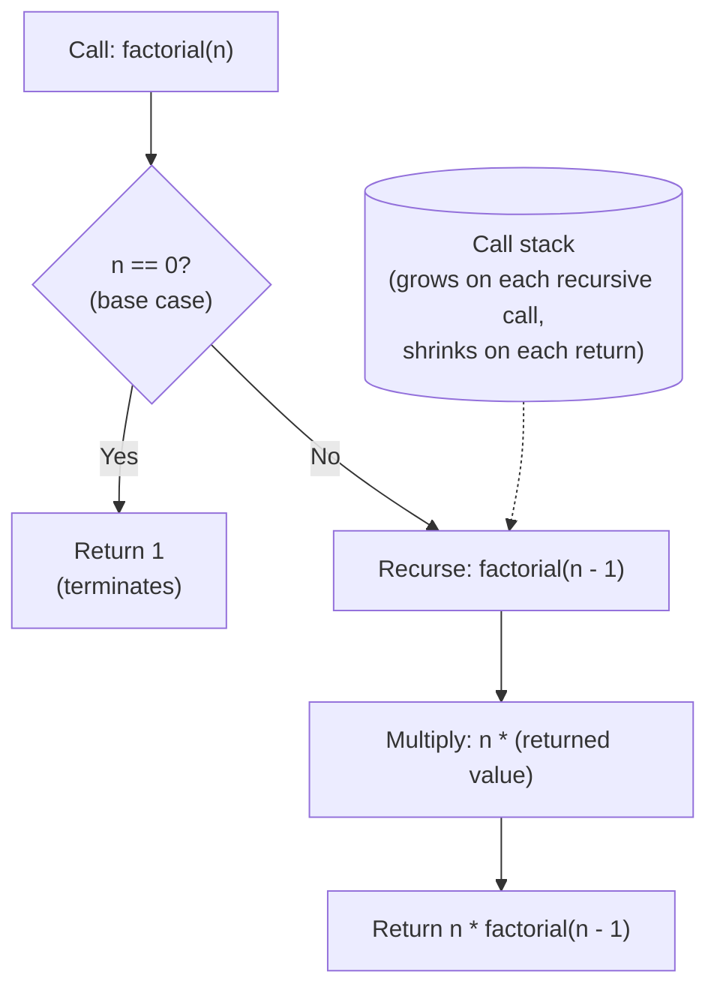
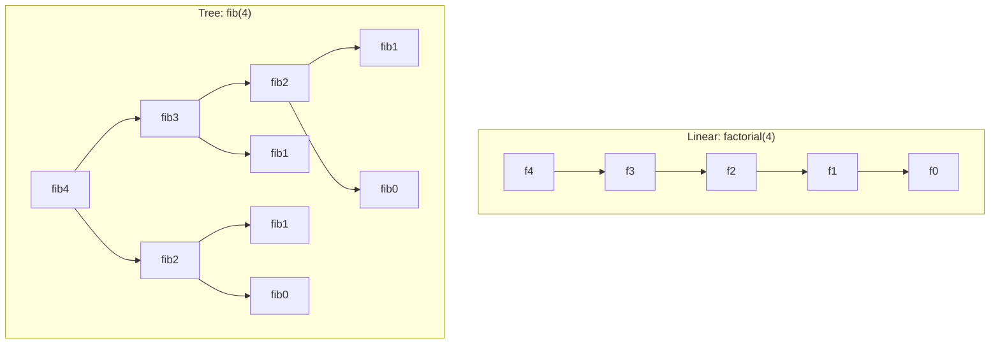

# The recursion mental model

A candidate writes `def fib(n): return fib(n-1) + fib(n-2)`, hits Run, and watches Python crash on `fib(35)` with `RecursionError: maximum recursion depth exceeded`. They read the error, reach for `sys.setrecursionlimit(10**6)`, run again, and now Python takes thirty seconds to return a number. The bug isn't the depth limit. The bug isn't even the missing base case (it's missing two). The bug is that the candidate cannot see what the runtime is doing. They wrote three lines that look like math, the runtime turned them into a tree of two-and-a-half-billion calls, and nothing on the screen explains the gap.

This is the chapter that closes the gap. Every later chapter that builds on recursion — tree DFS in [Binary tree fundamentals](../part-6-trees-heaps/00-binary-tree-fundamentals.md), the recurse-and-undo pattern in [Backtracking fundamentals](../part-7-recursion-backtracking/01-backtracking-template.md), the cache-the-recursion trick in [DP recursion to memoisation](../part-9-dynamic-programming/00-dp-recursion-to-memo.md) — assumes you can read a recursive function and pick out the base case, the recursive case, and the implicit call stack as three separate things. Until that reading is reflex, recursion will keep producing exceptions you don't know how to debug.

## Why factorial is a trap

Most recursion tutorials open with factorial. So does this one, with a warning attached: factorial is the worst possible vehicle for *introducing* the mental model and the best possible vehicle for *demonstrating* it. The function is so familiar that beginners pattern-match on the syntax and miss the structural point.

Here is the obvious wrong answer:

```python
def factorial(n):
    return n * factorial(n - 1)
```

It compiles. It runs. It crashes on `factorial(5)` with `RecursionError`, and a beginner who was told *"recursion is when a function calls itself"* reads the error as *"I exceeded a depth limit, so I should raise the limit."* The real bug is that there is no base case. The function recurses through `5 -> 4 -> 3 -> 2 -> 1 -> 0 -> -1 -> -2 -> ...` forever, because nothing ever stops it.

Add the base case:

```python
def factorial(n):
    if n == 0:
        return 1
    return n * factorial(n - 1)
```

Now it works. The structure of *why* it works is the rest of this chapter.

## The three parts

Every terminating recursive function has exactly three components. If any one is missing, the function is wrong.

**A base case.** The smallest input the function answers without recursing. For factorial, `n == 0` returns `1` because the empty product is the multiplicative identity. The base case is what terminates the recursion; without it, you have an infinite loop with extra steps.

**A recursive case.** A strictly smaller subproblem plus a constant amount of combining work. For factorial, `n * factorial(n - 1)` reduces by one and combines the answer with one multiplication. Knuth's *The Art of Computer Programming* §1.1 grounds the termination argument: every recursive procedure that terminates does so because each recursive call moves the input strictly closer to the base case under some well-founded ordering on the input space.[^1] If the reduction step doesn't strictly progress, the function loops forever.

**An implicit call stack.** The runtime maintains a stack of pending frames behind your back. Every recursive call pushes a frame; every return pops one. The chain of pending frames holds onto the multiplications you deferred — `5 *`, `4 *`, `3 *` — until the base case finally hands back a value to multiply against.

The third part is the one beginners haven't seen explicitly. Abelson and Sussman's *Structure and Interpretation of Computer Programs* §1.2.1 names this the substitution model and emphasises that the *procedure* (the syntax of the function calling itself) and the *process* (the chain of deferred operations the interpreter actually executes) are not the same thing.[^2] Understanding the call stack as a physical artifact — frames being pushed, frames being popped, frames carrying state — is what lets you reason about recursive functions you haven't written yet.



*The three load-bearing components: the base case terminates, the recursive case delegates to a smaller subproblem, and the call stack is the runtime's bookkeeping for everything in flight.*

## Trust the recursion

The hardest move in writing a recursive function is the one that feels like cheating. You write the recursive call, and then you keep going as if it already worked.

Jeff Erickson's *Algorithms* names this move the *Recursion Fairy*: simplify the original problem, hand the smaller version to a magical helper, and combine the helper's answer with the work you kept for yourself.[^3] Erickson's framing, exactly: *"your only task is to simplify the original problem ... the Recursion Fairy will magically take care of all the simpler subproblems for you."*

In code, this means writing `factorial(n - 1)` and assuming, without proof, without unrolling, without stepping through, that it returns `(n - 1)!`. Then you multiply by `n`. Done.

It feels wrong. The function isn't finished. How can you call it before it works?

The answer is induction. The base case is the inductive base: `factorial(0)` returns `1`, by inspection. The recursive case is the inductive step: *if* `factorial(n - 1)` correctly returns `(n - 1)!`, *then* `n * factorial(n - 1)` correctly returns `n!`. Combine the two and the function is correct for every non-negative `n`. You don't have to trace the call tree to convince yourself. The induction does it.

This is the reduce-and-delegate move that every later chapter forward-references. Tree DFS works because if you can search the left subtree and the right subtree, you can search the whole tree. Backtracking works because if you can place queens in `n - 1` rows, you can place queens in `n`. Top-down DP works because if you can solve subproblems of length `< n`, you can solve length `n`. Trust the recursion is the verb. Reduce and delegate is what the verb means.

## The pattern

Pseudocode for any single-recursion function:

```text
function recurse(input):
    if input is at the base:
        return base answer
    smaller = reduce(input)
    sub_answer = recurse(smaller)
    return combine(input, sub_answer)
```

Three of those four lines are constant work. The recursive call is the only one that branches into another frame. For factorial: `reduce` is `n - 1`, `combine` is `n * sub_answer`, the base is `n == 0` returning `1`.

```python
def factorial(n: int) -> int:
    if n < 0:
        raise ValueError("factorial is undefined for negative integers")
    # Base case: 0! = 1 by definition. The recursion terminates here.
    if n == 0:
        return 1
    # Recursive case: n! = n * (n-1)!
    return n * factorial(n - 1)
```

**Solution** — Python ([Java](./02-recursion-mental-model/sol.java) · [C++](./02-recursion-mental-model/sol.cpp) · [Go](./02-recursion-mental-model/sol.go))

```python
# Chapter 0.2 — The recursion mental model
# Worked example: factorial(n) by direct recursion.
import sys

sys.setrecursionlimit(10**6)  # CPython default 1000 is too low for chapter exercises.


def factorial(n: int) -> int:
    """Return n! computed by direct recursion. Requires n >= 0."""
    if n < 0:
        raise ValueError("factorial is undefined for negative integers")
    # Base case: 0! = 1 by definition. The recursion terminates here.
    if n == 0:
        return 1
    # Recursive case: n! = n * (n-1)!
    return n * factorial(n - 1)
```

The shape across all four languages is identical: validate, base-case branch, recursive call, combine-and-return. The differences are the gotchas. Java, C++, and Go widen the result to 64-bit because `13! = 6,227,020,800` overflows a 32-bit int. C++ promotes *before* the multiply, not after, because signed overflow on int is undefined behaviour. Python sets `sys.setrecursionlimit(10**6)` at module load because CPython's default of 1000 is too low for any real recursive workload.[^4] Go panics on negative input because there's no exception model and no `Optional` to return.

## Worked example: tracing factorial(4)

The call stack lives in the runtime's bookkeeping, not on the page. Reading the code doesn't show it; you have to watch it run. Step through the widget twice, deliberately, before reading on. Pay attention to steps 5 through 7 — the moment the stack is full, the moment the base case fires, the moment the first deferred multiplication runs.

> **Interactive widget:** [Recursion call stack (factorial; three-shapes comparison)](../widgets/w-01-recursion-call-stack.yml) — rendered on the website; the YAML spec describes the keyframes.

*Static fallback: a five-frame stack builds up as `factorial(4)` recurses through `factorial(3)`, `factorial(2)`, `factorial(1)`, and `factorial(0)`. The base case at `factorial(0)` returns 1 directly. Then the stack unwinds: each frame computes `n * (returned value)` and returns, in reverse order of the calls.*

The trace, in twelve steps:

1. Call `factorial(4)` with the stack empty.
2. Push frame `f(4)`. Not the base case; recurse on `n - 1 = 3`.
3. Push `f(3)`. Recurse.
4. Push `f(2)`. Recurse.
5. Push `f(1)`. Recurse.
6. Push `f(0)`. The stack now holds five frames; four are pending multiplications waiting for an answer, one is about to fire the base case.
7. Base case: `factorial(0)` returns `1` directly. The stack starts unwinding.
8. Pop `f(0)`. `f(1)` resumes, computes `1 * 1 = 1`, returns `1`.
9. Pop `f(1)`. `f(2)` resumes, computes `2 * 1 = 2`, returns `2`.
10. Pop `f(2)`. `f(3)` resumes, computes `3 * 2 = 6`, returns `6`.
11. Pop `f(3)`. `f(4)` resumes, computes `4 * 6 = 24`, returns `24`.
12. Pop `f(4)`. Final answer: `24`.

The deferred multiplications happen in *reverse order* of the calls. The call stack is what holds them in suspended animation while the recursion descends. The Recursion Fairy delivers, but only because every frame on the stack was waiting for her.

## What it actually costs

The recurrence for linear-recursive factorial is `T(n) = T(n-1) + Theta(1)`. Each call does one multiplication on top of the cost of the smaller subproblem. Telescoping (CLRS 4th ed. §4.3, substitution method)[^5] gives `T(n) = T(0) + n * Theta(1) = Theta(n)` time. Space matches: each pending recursive call deposits one frame on the call stack and no frame is freed until its child returns, so the chain of deferred multiplications has the same length as the number of recursive calls.

Three things follow.

**Stack space, not heap space.** The function does not allocate on the heap. Auxiliary cost is *call-stack* space. `RecursionError` (Python) and `StackOverflowError` (Java) signal stack exhaustion, not memory exhaustion.

**The constant matters in practice.** Each Python frame is roughly 500 to 1000 bytes; PEP 651's analysis quotes the implementation needing roughly 1000 frames per megabyte.[^4] At Python's default `setrecursionlimit(1000)`, that's roughly 1 MB of stack, fine for `factorial(900)`, not for `factorial(10**5)`. Java's default thread stack is 512 KB to 1 MB on Linux x86-64. C++ depends on the compiler and OS; the typical main-thread default is 1 MB on Windows, 8 MB on Linux. Go is the outlier: goroutine stacks grow segmentedly from the heap, so the limit isn't stack size but available memory.

**Time grows with calls; space grows with depth.** For factorial these are the same number, because the recursion is linear (one call per frame). For tree recursions they diverge, and the divergence is large.

## Variants you'll meet

**Linear recursion.** One recursive call per frame. Factorial, list-length, list-reverse, binary search. The call stack grows linearly with input size; the recursion *tree* degenerates to a path.

**Tail recursion.** The recursive call is the very last action, returned directly with no surrounding work: `return f(...)` rather than `return n * f(...)`. A tail-call-optimising compiler can reuse the current frame instead of pushing a new one, dropping space from `Theta(n)` to `Theta(1)`. Python, Java, and Go do not perform tail-call elimination as a language guarantee. C++ may, depending on the compiler and optimisation flags. **Treat tail recursion as expressive sugar, not a portable space optimisation** — see the warning below.

**Tree recursion.** Multiple recursive calls per frame. Naive Fibonacci, merge sort, tree DFS, the count-change problem in SICP §1.2.2.[^2] The recursion tree branches, so node count (which dominates time) and tree depth (which dominates space) diverge. Naive Fibonacci is `Theta(phi^n)` time but only `Theta(n)` space, because time counts every node in the tree (which fans out exponentially) and space counts the longest path from root to leaf (which is just `n`).

**Mutual recursion.** Function `A` calls `B`, `B` calls `A`, both have base cases. Common in recursive-descent parsers (`parseExpr` calls `parseTerm` calls `parseExpr`) and in even/odd predicates defined in terms of each other. Correctness proofs require simultaneous induction over both functions.



*Linear recursion (left) collapses to a path of depth n. Tree recursion (right) fans out: `fib(2)` is computed twice, `fib(1)` three times. That redundancy is what memoisation in [DP recursion to memoisation](../part-9-dynamic-programming/00-dp-recursion-to-memo.md) eliminates by caching each subproblem's answer the first time it's computed.*

## When iteration is the better tool

Recursion is expressive. It's also slow, stack-bounded, and harder to debug than the equivalent loop. Reach for iteration when:

- **Depth might exceed a few thousand.** No mainstream language guarantees TCO. A tail-recursive `factorial(10**5)` blows the stack in Python, Java, and Go even though the algorithm is constant-space in principle.
- **The recursion is purely linear.** Iterative factorial, `for i in range(1, n+1): result *= i`, is `O(1)` space and faster than the recursive version. Recursion buys you nothing if the call tree is a path.
- **The problem doesn't naturally decompose into a smaller version of itself.** Forcing recursion onto a parallel scan, an in-place reversal, or a pointer-chasing loop adds frames and noise without insight.

Recursion earns its place when the problem's structure is itself recursive: trees, paths, decision sequences, divide-and-conquer splits. For the rest, write the loop.

## Common pitfalls

> [!WARNING]
> **Forgetting the base case (or writing one that never fires).** The classic failure mode. The fix is structural: the base case must satisfy *every* legal input that would otherwise force a non-progressing recursive call. For factorial, `n == 0` covers the smallest legal input; defensive `n <= 0` adds a guard for negative inputs that would otherwise recurse through `0 -> -1 -> -2 -> ...` forever. In review, draw the recursion tree for the smallest input and check that every non-leaf node has a child with strictly smaller `n`.

> [!WARNING]
> **Treating tail-call elimination as portable.** A tail-recursive accumulator factorial blows the stack at `n = 10000` in Python, Java, and Go because none of them eliminate the tail call. Guido van Rossum rejected TCO in CPython explicitly: *"TRE is incompatible with nice stack traces."*[^6] Java's HotSpot team rejected it because security-sensitive APIs walk the stack to identify callers. Go's team prefers complete stack traces and considers segmented goroutine stacks the right answer to depth. C++ does it as a compiler best-effort under `-O2`, not as a language guarantee. If recursion depth might exceed a few thousand, rewrite as an iterative loop. The recursion buys you nothing if the stack overflows.

> [!WARNING]
> **Off-by-one in the reduction step.** Writing `return n * factorial(n)` (recurses on the same `n`) loops forever; writing `return n * factorial(n - 2)` skips the base case at zero and recurses through `0 -> -2 -> -4 -> ...` into the negatives. Every recursive call must reduce the input under a strictly decreasing well-ordering. The widget makes a non-progressing call visible immediately: the stack keeps growing while `n` stays the same.

> [!WARNING]
> **Mutating shared state inside recursive frames.** A backtracking search that uses an outer-scope `path = []` and appends to it inside the recursive call returns wrong answers because mutable defaults and module-level lists are shared by reference. Local names rebind per frame; the underlying mutable object does not. Pass mutable accumulators *as arguments*, and copy on append (`result.append(path[:])` rather than `result.append(path)`). Factorial passes only an integer, so it doesn't trigger this; [Backtracking fundamentals](../part-7-recursion-backtracking/01-backtracking-template.md) does, and most LC Discuss threads on Subsets, Permutations, and N-Queens trace back to exactly this bug.

## Practice problems

This chapter is foundation/framework-exempt: no Easy/Medium/Hard span requirement, no formal CORE ladder. The two problems below exist as first-recursion practice. Solve each by writing the base case first, then the recursive case, then tracing the stack on the smallest non-trivial input by hand.

### CORE

- [LC 509 — Fibonacci Number](https://leetcode.com/problems/fibonacci-number/) [Easy] • recursion-linear ★

### STRETCH

- [LC 344 — Reverse String](https://leetcode.com/problems/reverse-string/) [Easy] • recursion-linear

LC 509 is the canonical first-recursion problem: the prompt's specification (`F(n) = F(n-1) + F(n-2)`) is itself recursive, the strongest possible signal to reach for the pattern. Write it the naive way first, watch it slow down at `n = 35`, and notice that the recursion tree of `fib(35)` has roughly `phi^35` nodes — about 30 million — while the call stack only holds 35 frames at a time. Time and depth diverge. That divergence is the whole point of [DP recursion to memoisation](../part-9-dynamic-programming/00-dp-recursion-to-memo.md).

LC 344 is recursion as accumulation: swap `s[l]` and `s[r]`, then recurse on `(l + 1, r - 1)` with base case `l >= r`. The iterative two-pointer version is the canonical answer in [Strings](../part-1-linear-data-structures/02-strings.md); doing it recursively here is a deliberate exercise in trusting the recursion.

For divide-and-conquer recursion that halves the input each frame, see [LC 50 — Pow(x, n)](https://leetcode.com/problems/powx-n/) in [Math for interviews](./04-math-for-interviews.md), where `pow(x, n) = pow(x*x, n/2)` for even `n` drops the recurrence from `T(n) = T(n-1) + O(1)` to `T(n) = T(n/2) + O(1) = O(log n)`.

## Where this leads

Recursion is not a pattern. It's a tool used by many patterns. [Binary tree fundamentals](../part-6-trees-heaps/00-binary-tree-fundamentals.md) is recursion over a tree. [Backtracking fundamentals](../part-7-recursion-backtracking/01-backtracking-template.md) is recursion plus an undo step. [DP recursion to memoisation](../part-9-dynamic-programming/00-dp-recursion-to-memo.md) is recursion plus a cache. All three rest on the mental model installed here.

The widget is the chapter. When a recursive function in a later chapter confuses you, step through this one again. The pushes, the base case, the unwinding pops. That's the whole story.

[Bit-manipulation primer](./03-bit-manipulation-primer.md) is next.

## References

[^1]: Knuth, D.E., *The Art of Computer Programming, Volume 1: Fundamental Algorithms*, 3rd ed., Addison-Wesley, 1997.

[^2]: Abelson, H., Sussman, G.J., with Sussman, J., *Structure and Interpretation of Computer Programs*, 2nd ed., MIT Press, 1996. §1.2.1 *Linear Recursion and Iteration* (the substitution model and the *chain of deferred operations* characterisation); §1.2.2 *Tree Recursion*. Online edition: [sarabander.github.io/sicp/html/1_002e2.xhtml](https://sarabander.github.io/sicp/html/1_002e2.xhtml).

[^3]: Erickson, J., *Algorithms*, 1st ed., 2019, Chapter 1 ("Recursion"), [jeffe.cs.illinois.edu/teaching/algorithms](https://jeffe.cs.illinois.edu/teaching/algorithms/).

[^4]: Shannon, M., "PEP 651 — Robust Stack Overflow Handling," Python Enhancement Proposal, January 2021 (rejected). <https://peps.python.org/pep-0651/>

[^5]: Cormen, T.H., Leiserson, C.E., Rivest, R.L., Stein, C., *Introduction to Algorithms*, 4th ed., MIT Press, 2022, Chapter 4 (§4.3 substitution method, §4.4 recursion-tree method, §4.5 master method).

[^6]: van Rossum, G., "Tail Recursion Elimination", *Neopythonic* blog, April 2009. Key claim: *"TRE is incompatible with nice stack traces."* [gvanrossum.github.io/neopythonic/tail-recursion-elimination.html](https://gvanrossum.github.io/neopythonic/tail-recursion-elimination.html).
