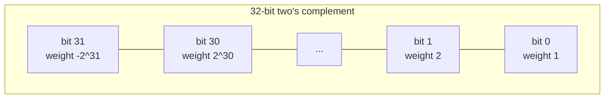

# Bit manipulation primer

The reason this chapter exists is one line: `n &= n - 1` clears the lowest set bit of `n`. That trick alone reduces popcount from a 32-iteration loop to a `popcount(n)`-iteration loop, gives you the canonical "is power of 2?" check, and underwrites every Fenwick-tree index walk you'll meet later in the book. If you walk away with that one idiom and the operator-precedence reflex (`(x & 1) == 0`, never `x & 1 == 0`), the chapter has done its job.

The rest is a cookbook. Twelve idioms, one example each. Two's complement at the end, because every bit-manipulation bug eventually traces back to it.

## When to reach for bits

Four signals fire from the problem statement.

The prompt says "Hamming weight," "set bits," "1 bits," "bits differ," "parity," "XOR sum," "without using arithmetic operators," or "in O(1) extra memory."[^1]

The state space is small (`n <= 32`) and the problem asks for *every subset*. The integer `0..2^n - 1` enumerates all subsets in one for-loop, and bitmask DP becomes natural.

The constraints emphasise non-negative 32-bit integers, and the natural representation is binary, not decimal.

The desired transformation has a known closed-form bitwise expression: lowest set bit (`x & -x`), swap (`a ^= b; b ^= a; a ^= b`), multiply or divide by `2^k` (`<<k` or `>>k`), set bit (`x |= (1 << k)`), clear bit (`x &= ~(1 << k)`), toggle bit (`x ^= (1 << k)`), test bit (`(x >> k) & 1`).

This chapter is the primer. The deeper applications — bitwise truth tables for Single Number II, group-by-bit XOR partitions for Single Number III, MSB-alignment tricks for range AND, parallel-SWAR popcount — live in the bit-manipulation deep-dive part of the book. Here you get the vocabulary.

## The single-bit operations

Four primitives, each one line of code. Memorise them. Bitmask state representation, Unix file permissions, sparse subset enumeration, bitmask DP transitions all live on these four lines.[^2]

| Operation | Idiom | Example |
|---|---|---|
| Test bit `i` | `(x >> i) & 1` | `(0b1011 >> 2) & 1 == 0` (bit 2 unset) |
| Set bit `i` | `x \| (1 << i)` | `0b1011 \| (1 << 2) == 0b1111` |
| Clear bit `i` | `x & ~(1 << i)` | `0b1011 & ~(1 << 0) == 0b1010` |
| Toggle bit `i` | `x ^ (1 << i)` | `0b1011 ^ (1 << 1) == 0b1001` |

## The lowest-set-bit isolation: `x & -x`

```python
# Returns the lowest set bit of x as a power-of-two value (0 if x == 0).
lowest_bit = x & -x
# 0b10110 & -0b10110 == 0b00010 == 2
```

In two's complement, `-x = ~x + 1`: flip every bit and add one. The carry from the `+1` propagates through trailing zeros and stops at the lowest set bit, which becomes the only bit shared with the original `x`. The result is the *value* of that bit (a power of two), not the position.[^3]

This is the workhorse for Fenwick-tree index walks: `i += (i & -i)` jumps to the next responsible-range index in `O(log n)` per query.

## The Hamming-weight idiom: Brian Kernighan's loop

The canonical bit-counting algorithm, and the chapter's worked example. Subtract 1 from `n`: every trailing zero flips to one, the lowest set bit flips to zero. AND with the original: every bit below the lowest set bit zeros out, the lowest set bit zeros out, every bit above it stays. Net effect: one fewer set bit.

```python
def hamming_weight(n: int) -> int:
    """LC 191: count the number of set bits (Hamming weight) of n."""
    count = 0
    while n:
        n &= n - 1   # clears the lowest set bit
        count += 1
    return count
```

**Solution** — Python ([Java](./03-bit-manipulation-primer/lc-191/sol.java) · [C++](./03-bit-manipulation-primer/lc-191/sol.cpp) · [Go](./03-bit-manipulation-primer/lc-191/sol.go))

```python
# LC 191. Number of 1 Bits


def hamming_weight(n: int) -> int:
    """Count set bits via Brian Kernighan's loop. O(popcount(n)) time, O(1) space."""
    count = 0
    while n:
        n &= n - 1  # clear the lowest set bit
        count += 1
    return count
```

The loop runs `popcount(n)` iterations exactly. On `n = 0xFFFFFFFF` (all 32 bits set), it runs 32 times. On `n = 1` (one bit set), it runs once. The naive `for k in range(32): count += (n >> k) & 1` always runs 32 times regardless. Brian Kernighan wins by a factor of up to 32 on sparse inputs and ties on dense ones.

Hand-trace on `n = 11 = 0b1011`:

| Iteration | `n` (before) | `n - 1` | `n & (n - 1)` | bit cleared | count |
|---|---|---|---|---|---|
| 1 | `1011` | `1010` | `1010` | bit 0 | 1 |
| 2 | `1010` | `1001` | `1000` | bit 1 | 2 |
| 3 | `1000` | `0111` | `0000` | bit 3 | 3 |

Loop exits, returns 3.

The algorithm was first published by Peter Wegner in *CACM* Vol 3 (1960), p. 322, and rediscovered independently by Derrick Lehmer in 1964. Brian Kernighan and Dennis Ritchie included it as exercise 2-9 in *The C Programming Language* 2nd edition (1988), which is why the algorithm carries Kernighan's name. Henry Warren's *Hacker's Delight* §5-1 contains the full proof.[^4]

The corollary is the canonical "is power of two?" check. **`n & (n - 1) == 0` is true iff `n` is a power of two**, assuming `n > 0`. A power of two has exactly one set bit; clearing it leaves zero. Anything else has at least two set bits, and clearing the lowest leaves something nonzero.

In production, don't write Kernighan's loop. Hardware POPCNT runs in three cycles on x86 SSE4.2 and ARMv8. Use `std::popcount` (C++20), `Integer.bitCount` (Java), `math/bits.OnesCount32` (Go), or `int.bit_count()` (Python 3.10+). The loop is for teaching.

## Hamming distance

The Hamming distance between two integers is the number of bit positions at which they differ. The closed form:

```text
hamming_distance(x, y) = popcount(x ^ y)
```

XOR sets a bit exactly where `x` and `y` differ; counting set bits gives the distance.[^5] LC 461 is a one-liner: `Integer.bitCount(x ^ y)` in Java; `bin(x ^ y).count('1')` in Python.

## Multiply and divide by powers of two

```python
x * (1 << k)   # equivalent to x << k
x // (1 << k)  # for non-negative x, equivalent to x >> k
```

Signed right shift is the trap. Behaviour diverges by language.

| Language | Signed right shift on negative input |
|---|---|
| Java | `>>` is arithmetic (sign-extending). `>>>` is logical (zero-fill). |
| C++17 | Implementation-defined for negative values; treat as unspecified. Use unsigned types for bit work. |
| Python | Rounds toward negative infinity: `-5 >> 1 == -3`, not `-2`. |
| Go | Arithmetic for signed types; logical for unsigned. The behaviour depends on the *static type* of the left operand. |

For bit-twiddling on signed values, the safest reflex is to convert to unsigned (or use `>>>` in Java) before shifting. For LC problems whose constraints guarantee non-negative input, the issue rarely surfaces, but it bites in Number of 1 Bits if you write the naive loop without thinking about the sign bit.

## XOR swap without a temporary

```python
a ^= b
b ^= a
a ^= b
```

Swaps `a` and `b` using only XOR, no temp variable. The proof is bit-by-bit. After the first XOR, `a` holds `a ^ b`; after the second, `b` holds `(a ^ b) ^ b = a`; after the third, `a` holds `(a ^ b) ^ a = b`. Done.

> [!WARNING]
> If `a` and `b` *alias* the same memory location (`SWAP(arr[i], arr[j])` with `i == j`), the idiom zeroes that location instead of being a no-op. Defensive form: `if (&a != &b) { a ^= b; b ^= a; a ^= b; }`. Modern compilers usually recognise the idiom and emit a register-allocated swap; the trick is more interesting as a brain-teaser than as a performance pattern.

## Two's complement, briefly

The single fact that explains every bit-manipulation bug you'll ever write: an N-bit two's-complement integer represents values in `[-2^(N-1), 2^(N-1) - 1]`.[^6] The range is asymmetric. There are `2^31` negative values and `2^31 - 1` positive values in 32-bit signed `int`.

Three consequences that bite in real code.

**`-INT_MIN` overflows back to `INT_MIN`.** The mathematical negation of the smallest representable integer is not representable. `Math.abs(Integer.MIN_VALUE)` returns `Integer.MIN_VALUE` (negative) in Java. C++ leaves it undefined.

**`INT_MIN / -1` traps on x86.** The quotient is `+2^31`, which doesn't fit in a signed 32-bit register. Linux raises `SIGFPE`. C++ declares it undefined.

**Negation is "flip all bits, then add 1": `-x == ~x + 1`.** Equivalently, `~x == -x - 1`. This is why `x & -x` works to isolate the lowest set bit, and why Python's `~5 == -6`.

The most-significant bit is the sign bit, with weight `-2^(N-1)`, not `+2^(N-1)`. Every "why is my Hamming-distance count off when the input is negative?" bug eventually reduces to forgetting this.



*The same bit pattern represents different integers depending on whether you read bit 31 with weight `-2^31` (signed) or `+2^31` (unsigned). Conversions between signed and unsigned types are bit-pattern-preserving in C, C++, and Go; the integer value changes only because the interpretation changes.*

## Common pitfalls

> [!WARNING]
> **Operator precedence: `&` is *lower* than `==`.** `if (x & 1 == 0)` parses as `if (x & (1 == 0))` = `if (x & 0)` = `if (false)`. The condition is never true. Parenthesise: `if ((x & 1) == 0)`. This is the single most common bit-manipulation bug in beginner code; gcc's `-Wparentheses` was added specifically for this antipattern.

> [!WARNING]
> **Java's `>>` versus `>>>` on negative input.** A naive popcount `for (int k = 0; k < 32; k++) count += (n >> k) & 1;` returns garbage when `n` has the sign bit set, because `>>` sign-extends and every iteration ANDs against a `1` from the sign-extended fill. Use `>>>` (unsigned right shift) or the sign-agnostic `n &= n - 1` idiom.

> [!WARNING]
> **C++ signed overflow is undefined behaviour.** Left-shifting a signed value past the sign bit, negating `INT_MIN`, or relying on `int` overflow wrapping is UB under C++17. The compiler is permitted to assume overflow doesn't occur and may emit code that visibly contradicts wrap-around semantics. Reach for `uint32_t` and `uint64_t` whenever the work is genuinely bit-level.

> [!WARNING]
> **Python's `~` on a positive value returns a negative.** `~5 == -6`, not `0xFFFFFFFA`. Python's `int` is arbitrary-precision two's-complement, and `~x` is defined as `-(x + 1)`. For fixed-width 32-bit work in Python, mask after every operation that could go negative: `(~x) & 0xFFFFFFFF`.

## Practice

This chapter is foundation/framework-exempt: no Easy/Medium/Hard span requirement, no formal CORE three-rung ladder. Two Easy problems anchor the two idioms that recur most often in later chapters.

### CORE

- [LC 191 — Number of 1 Bits](https://leetcode.com/problems/number-of-1-bits/) [Easy] • bit-count-popcount ★
- [LC 461 — Hamming Distance](https://leetcode.com/problems/hamming-distance/) [Easy] • bit-xor-distance

The deep-dive chapters in the bit-manipulation part of the book pick up Single Number II, Single Number III, Bitwise AND of Numbers Range, Total Hamming Distance, and the rest of the canonical Medium/Hard bit problems. They're owned there, not here, because the primer's job is to install the vocabulary, not to compete for the headline problems.

## Where this leads

The bit-manipulation deep dives take the idioms here and build the harder constructions: the bitwise truth-table approach for "every element appears `k` times except one," group-by-bit XOR partitioning, the MSB-alignment trick for range AND, and the parallel-SWAR popcount that beats Kernighan on dense inputs. Fenwick trees use `x & -x` for the index walk on every update and query.

When you next see `n & (n - 1)` or `x & -x` in a chapter, you'll already know what they do. That's the entire point of this primer.

[Math for interviews](./04-math-for-interviews.md) is next.

## References

[^1]: LeetCode problem 191 (Number of 1 Bits), [leetcode.com/problems/number-of-1-bits](https://leetcode.com/problems/number-of-1-bits/).

[^2]: Anderson, S.E., "Bit Twiddling Hacks", Stanford Computer Graphics Laboratory, [graphics.stanford.edu/~seander/bithacks.html](https://graphics.stanford.edu/~seander/bithacks.html).

[^3]: Wikipedia, "Two's complement" §"Why it works", [en.wikipedia.org/wiki/Two%27s_complement](https://en.wikipedia.org/wiki/Two%27s_complement). The carry-propagation argument for `x & -x`.

[^4]: Warren, H.S., *Hacker's Delight*, 2nd ed., Addison-Wesley Professional, 2013, ISBN 978-0-321-84268-8.

[^5]: Wikipedia, "Hamming distance", [en.wikipedia.org/wiki/Hamming_distance](https://en.wikipedia.org/wiki/Hamming_distance). `popcount(x XOR y)` formula.

[^6]: Wikipedia, "Two's complement", §"Most negative number", [en.wikipedia.org/wiki/Two%27s_complement](https://en.wikipedia.org/wiki/Two%27s_complement). The asymmetric range: `[-2^(N-1), 2^(N-1) - 1]`.
