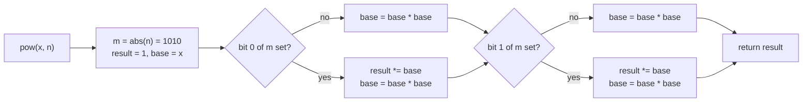
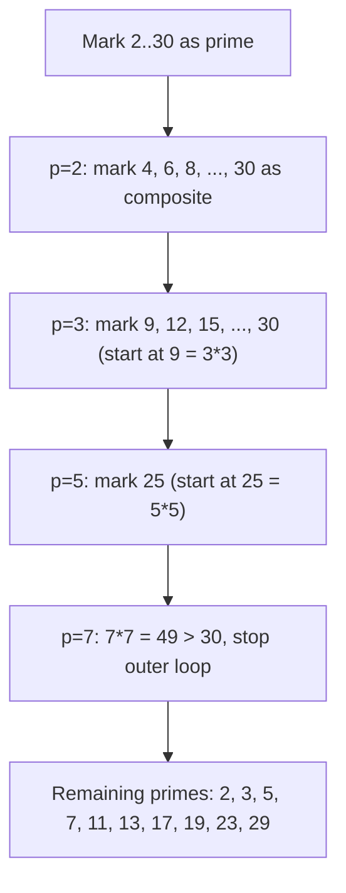

# Math for interviews

A candidate types `pow(2, 100) % (10**9 + 7)` into the Python REPL, watches it think for a perceptible beat, then types the same expression as `pow(2, 100, 10**9 + 7)` and gets the answer instantly. The two expressions look the same. They aren't. The first computes the full `2^100` as an arbitrary-precision integer (a 31-digit number) and then takes the modulus. The second does modular exponentiation by repeated squaring and never builds the giant intermediate. At `2^100` the cost difference is microseconds. At `2^(10^18)` the first call never returns and the second finishes in 60 multiplications.

The whole chapter is in that one detail. Interview math is not number theory; it's the small set of tools that prevent solutions from breaking on adversarial inputs and that produce answers in time when the obvious arithmetic doesn't. Six tools, each one a one-screen idiom: binary exponentiation, modular arithmetic, integer overflow rules, Euclidean GCD, the Sieve of Eratosthenes, digit-by-digit problems. Every one shows up in interviews. Every one has a sharp edge that turns a working algorithm into a failing submission.

## Binary exponentiation

The signature problem is *Pow(x, n)* (LC 50). Given `x = 2.1, n = 3`, return `9.261`. The naive `for _ in range(n): result *= x` runs in `O(n)`. With LC 50's constraint `-2^31 <= n <= 2^31 - 1`, the worst-case loop is `2 * 10^9` iterations. Hopeless.

Binary exponentiation cuts that to `O(log n)`, about 31 iterations on the worst case. The recurrence is `x^n = (x^{n/2})^2` for even `n`, and `x · (x^{(n-1)/2})^2` for odd `n`. Each iteration halves the exponent. The loop runs `floor(log2 n) + 1` times.[^1]

```python
def my_pow(x: float, n: int) -> float:
    if n < 0:
        x = 1.0 / x
        n = -n
    result = 1.0
    base = x
    while n > 0:
        if n & 1:
            result *= base
        base *= base
        n >>= 1
    return result
```

**Solution** — Python ([Java](./04-math-for-interviews/lc-50/sol.java) · [C++](./04-math-for-interviews/lc-50/sol.cpp) · [Go](./04-math-for-interviews/lc-50/sol.go))

```python
# LC 50. Pow(x, n)


def my_pow(x: float, n: int) -> float:
    """Binary exponentiation. O(log |n|) time, O(1) space."""
    if n < 0:
        x = 1.0 / x
        n = -n

    result = 1.0
    base = x
    while n > 0:
        if n & 1:
            result *= base
        base *= base
        n >>= 1
    return result
```

The Python version reads cleanly because Python's `int` is arbitrary precision; PEP 237 unified `int` and `long` so arithmetic widens transparently.[^2] Java, C++, and Go each carry one extra line at the top of the function: `long m = n;` (Java), `long long m = n;` (C++), `m := int64(n)` (Go). The reason is two's-complement asymmetry. `Integer.MIN_VALUE = -2^31 = -2147483648`. There is no `+2147483648` in a signed 32-bit `int`, so `-INT_MIN` wraps back to `INT_MIN` (Java, Go) or invokes undefined behaviour (C++).[^3] If you negate `n` in 32-bit space and then test `m > 0`, the loop never enters and the function returns `1.0` for every negative input near `INT_MIN`.

Trace on `n = 10 = 1010` in binary:

| Iteration | `m` (binary) | `m & 1` | `base` after | `result` after |
|---|---|---|---|---|
| 1 | `1010` | 0 | `4.0` (= `x^2`) | `1.0` (unchanged) |
| 2 | `0101` | 1 | `16.0` | `4.0` |
| 3 | `0010` | 0 | `256.0` | `4.0` (unchanged) |
| 4 | `0001` | 1 | (loop exits next) | `1024.0` |

The exponent decomposes into its binary representation: `n = sum_i b_i · 2^i`. Each iteration squares `base` to walk the sequence `x, x^2, x^4, x^8, ...`; iterations where the corresponding bit of `n` is set multiply the running `result`. Total: `floor(log2 n) + 1` rounds, exactly the number of bits in `n`.



*The loop multiplies the running result only on iterations where the corresponding bit of `n` is set; it squares the base on every iteration regardless.*

The same algorithm runs as **modular exponentiation** if you reduce mod `m` at every multiply: `result = (result * base) % m; base = (base * base) % m`. That's how cryptographic libraries compute `g^x mod p` for Diffie-Hellman, and it's what the 3-argument `pow(a, b, m)` from the opening paragraph is doing under the hood.

## Modular arithmetic

The signal: the problem says "return the answer modulo `10^9 + 7`" (or `998244353`), or asks for a count that demonstrably exceeds 64-bit storage in unmodded form. `10^9 + 7` is the canonical interview modulus because it's prime and `(10^9 + 7)^2` fits in `int64`.

Three identities carry the load:

| Identity | What it says |
|---|---|
| `(a + b) mod m = ((a mod m) + (b mod m)) mod m` | Reduce summands. Sums stay below `2m`. |
| `(a * b) mod m = ((a mod m) * (b mod m)) mod m` | Reduce factors. The product is below `m^2`, which fits in `int64` whenever `m < 2^32`. |
| `a^b mod m = binary exponentiation with each multiply mod m` | The fast-exp recurrence still works; just mod every step. |

The multiply identity is what makes long products tractable. If `a` and `b` are both already reduced into `[0, m)`, their product is at most `(m-1)^2`. For `m = 10^9 + 7`, that's about `10^18`, which fits comfortably in `long` / `long long` / `int64`. In Python the question doesn't arise.

Modular exponentiation by repeated squaring is the same `O(log n)` algorithm as binary exponentiation above, with each multiply followed by `% m`. Use it whenever `n` is huge (`10^18`, or the Fibonacci index in matrix exponentiation) and you only need the answer mod something.

Deeper modular machinery (Fermat's little theorem `a^(p-1) ≡ 1 mod p` for prime `p`, modular inverse via that theorem, the Chinese Remainder Theorem) is deferred to a competitive-programming chapter. For interview prep, the three identities above plus modular exponentiation cover roughly every problem you'll meet.

## Integer overflow, four ways

The single biggest source of hidden bugs in interview math. The same `result = result * 10 + digit` line behaves differently in each of the four target languages, and three of those behaviours are silent failures.

| Language | What signed integer overflow does |
|---|---|
| Python | Nothing. `int` is unbounded by language guarantee.[^2] |
| Java | Wraps silently. JLS §4.2.2: "The integer operators do not indicate overflow or underflow in any way."[^4] Use `Math.addExact` / `Math.multiplyExact` / `Math.divideExact` (the last is Java 18+) to throw on overflow.[^5] |
| C++ | Undefined behaviour. The compiler is permitted to assume overflow doesn't happen and may emit code that contradicts wrap-around semantics under `-O2`.[^3] Reach for `int64_t` or guard pre-condition. |
| Go | Wraps silently, deterministically two's-complement. The spec calls out one special case: `INT_MIN / -1` overflows to `INT_MIN` rather than panicking.[^6] |

The canonical case is *Reverse Integer* (LC 7). Constraint: `-2^31 <= x <= 2^31 - 1`, with the additional twist that "the environment does not allow you to store 64-bit integers." The trap reflex is to compute the reversal in 32-bit space and check the bound afterwards:

```python
# WRONG — the multiply already overflowed by the time the check runs.
result = result * 10 + digit
if result > INT_MAX or result < INT_MIN:
    return 0
```

By the time the comparison fires, the overflow has already happened silently in Java and Go, or invoked UB in C++. The fix is to check the bound *before* the multiply:

```python
INT_MAX = 2**31 - 1   # 2147483647

# Continue only if result stays in range after the next multiply-and-add.
if result > INT_MAX // 10:
    return 0
if result == INT_MAX // 10 and digit > 7:
    return 0
result = result * 10 + digit
```

The `digit > 7` check catches the boundary where `result == 214748364` and we're about to add the trailing digit of `INT_MAX = 2147483647`. The proof: the input itself was bounded by `INT_MAX`, so its leading decimal digit is at most `2`; therefore the final reversed digit `y` is at most `2`. So `result * 10 + y <= 2147483640 + 2 < INT_MAX` whenever `result <= INT_MAX / 10`.[^7]

In Python none of this matters; the `int` widens transparently. Every other code tab in the book carries the overflow guard in Java/C++/Go and skips it in Python, for exactly this reason.

## GCD and LCM

The signal: the problem mentions "common divisor," "common multiple," "fraction in lowest terms," or any divisibility relationship between two values. Euclid's algorithm in three lines:

```python
def gcd(a, b):
    while b:
        a, b = b, a % b
    return a
```

Recursion: `gcd(a, b) = gcd(b, a mod b)`, base case `gcd(a, 0) = a`. Associativity extends naturally: `gcd(a, b, c) = gcd(a, gcd(b, c))`.[^8]

The complexity is `O(log min(a, b))` by Lamé's theorem (1844): if `a > b >= 1` and `b < F_n` for the n-th Fibonacci number, then `gcd(a, b)` performs at most `n - 2` recursive calls. Consecutive Fibonacci numbers are the worst case, and Fibonacci grows exponentially, so depth is logarithmic.[^8] Even on `int64` inputs the algorithm runs in microseconds.

LCM via the identity `lcm(a, b) = (a · b) / gcd(a, b)`:

> [!IMPORTANT]
> Compute it as `lcm(a, b) = a / gcd(a, b) * b`, **not** `(a * b) / gcd(a, b)`. The first form keeps the intermediate product bounded by `lcm(a, b)` itself. The second can overflow `int64` on inputs near `sqrt(2^63)` even when the true LCM fits comfortably.

Standard library availability is uneven. Python has `math.gcd` (3.5+) and `math.lcm` (3.9+). C++17 ships `std::gcd` in `<numeric>`. Java has `BigInteger.gcd` but no native-`int` `Math.gcd`; write the three-line loop. Go has `big.Int.GCD` for big integers and nothing built in for native `int`; write the loop. Most libraries return `gcd(0, 0) = 0` to preserve associativity, even though the GCD of two zeros is mathematically undefined.[^8]

## Sieve of Eratosthenes

For "count primes up to `n`" or "enumerate primes," trial division is `O(n · sqrt(n))` and falls over near `n = 10^6`. The Sieve does it in `O(n log log n)`.

```python
def sieve(n):
    is_prime = [True] * (n + 1)
    is_prime[0] = is_prime[1] = False
    for i in range(2, int(n**0.5) + 1):
        if is_prime[i]:
            for j in range(i * i, n + 1, i):
                is_prime[j] = False
    return [i for i in range(n + 1) if is_prime[i]]
```

Two optimisations earn their place. The outer loop stops at `sqrt(n)` because every composite at most `n` has a prime factor at most `sqrt(n)`; primes between `sqrt(n)` and `n` are whatever cells remain unmarked when the outer loop exits.[^9] The inner loop starts at `i * i`, not `2 * i`, because every smaller multiple of `i` shares a smaller prime factor and was already marked when that smaller prime sieved.[^9]

The `O(n log log n)` bound is Mertens' theorem in action: the inner mark-loop runs `n/p` times per prime `p`, and `sum_{p <= n} 1/p ~ ln ln n`.[^9] For `n = 10^6`, the total work is roughly `n · 4` operations, which finishes in tens of milliseconds.



*The outer loop terminates at `p · p > n`. The inner loop starts at `p · p` because all smaller multiples of `p` already share a smaller prime factor.*

> [!WARNING]
> The inner-loop starting index `i * i` overflows 32-bit `int` when `i > sqrt(INT_MAX) ≈ 46340`, which only matters for very large `n`. Guard with `(long long) i * i <= n` in C++/Java, or terminate the outer loop when `i * i > n`.[^9]

Memory is the sieve's other constraint. A `vector<bool>` of one bit per index handles `n` up to about `8 · 10^6` per megabyte. At `n = 10^9` the naive form needs over a gigabyte; the production answer is the segmented sieve at `O(sqrt(n))` memory, but that's out of scope here. LC 204 caps `n` at `5 · 10^6`, which the naive form fits.

## Digit-by-digit problems

Three operations on the decimal representation of an integer, no string conversion needed:

```python
last_digit = x % 10
x = x // 10                                    # strip the last digit
reversed_so_far = reversed_so_far * 10 + last_digit   # build up
```

LC 9 *Palindrome Number* explicitly forbids string conversion in its follow-up. The clever solution reverses *only half* the digits: loop while `reversed < x`, with one `// 10` adjustment when the digit count is odd. When the loop exits, equality of the two halves decides palindromicity. Roughly twice as fast as fully reversing, and dodges the overflow that fully reversing might trigger.

LC 7 *Reverse Integer* is the overflow-guard masterclass from the previous section. LC 233 *Number of Digit One* counts occurrences of digit `1` across all integers from `0` to `n`; the optimal solution is digit DP, which decomposes the count by place value (ones contributed by units place, by tens place, by hundreds place...) and runs in `O(log10 n)`. The full digit-DP framework lives in [Part 9 — dynamic programming](../part-9-dynamic-programming/00-dp-recursion-to-memo.md); here the chapter just points at the structure.

> [!CAUTION]
> Negative numbers in palindrome questions are always `false`: the leading `-` has no matching trailing `-`. Numbers ending in `0` (other than `0` itself) are also always `false`: leading `0` cannot match trailing non-zero. Both edge cases save the half-reverse algorithm from doing unnecessary work.

## Combinatorics, briefly

The signal: "how many ways" to do something, with input small enough that exhaustive enumeration is unnecessary. Three identities cover most interview combinatorics:

- **Permutations** of `n` distinct items: `n!`. Precompute for `n <= 20` to avoid overflow; `21!` exceeds `int64`.
- **Combinations**: `C(n, k) = n! / (k! · (n - k)!)`. For exact arithmetic with `n <= 60`, the multiplicative form `C(n, k) = product_{i=1..k} (n - i + 1) / i` avoids the giant intermediate factorial.
- **`C(n, k) mod p`** for prime `p`: precompute factorials mod `p`, and modular inverses via Fermat's little theorem (`a^(p-2) mod p` is the inverse). The whole table builds in `O(n + log p)` per inverse.

Catalan numbers, Stirling numbers, and inclusion-exclusion belong in DP chapters where they earn their keep. The chapter mentions them only so the vocabulary isn't a surprise when it shows up.

## Floating-point pow

`pow(2.0, 10)` returns `1024.0` exactly because the intermediate squarings happen to be exactly representable in IEEE 754. `pow(2.1, 3)` returns `9.261000000000001`, a tiny error in the last bits, because `2.1` is not exactly representable in binary floating point and each multiplication compounds the rounding. LC's grader tolerates `1e-5` absolute error, so the canonical test cases pass.

> [!WARNING]
> Compare floating-point results against expected output with an epsilon (`abs(got - want) < 1e-5`), never with `==`. When precision matters more than this, the chapter is the wrong tool. Reach for `Decimal` (Python), `BigDecimal` (Java), or `boost::multiprecision::cpp_dec_float` (C++).

## Practice

This chapter's three CORE problems span Easy/Medium/Hard. The signature is LC 50: short, exercises the `INT_MIN` negation footgun in three of four languages, and gives you the binary-exponentiation idiom you'll reuse in modular form for the rest of the book.

### CORE (solve all to claim chapter mastery)

- [LC 9 — Palindrome Number](https://leetcode.com/problems/palindrome-number/) [Easy] • digit-manipulation
- [LC 50 — Pow(x, n)](https://leetcode.com/problems/powx-n/) [Medium] • binary-exponentiation ★
- [LC 233 — Number of Digit One](https://leetcode.com/problems/number-of-digit-one/) [Hard] • digit-manipulation

### STRETCH (optional)

- [LC 7 — Reverse Integer](https://leetcode.com/problems/reverse-integer/) [Medium] • overflow-guard
- [LC 204 — Count Primes](https://leetcode.com/problems/count-primes/) [Medium] • sieve-of-eratosthenes

LC 233 reads Hard but flattens once you see it as digit DP. The pattern is "extract digit-by-digit, count contributions per place." Don't try to write digit DP from scratch on first encounter; read LC's editorial, then come back to the chapter and the place-value decomposition makes sense.

## Cross-language pitfalls

> [!WARNING]
> **Negating `INT_MIN` silently fails in Java/C++/Go.** `-(-2^31) = 2^31`, which doesn't fit in 32-bit signed `int`. Java and Go wrap back to `INT_MIN`; C++ invokes undefined behaviour. The fix is always the same: widen to 64-bit *before* negating. `(long) n`, `(long long) n`, `int64(n)`. Python doesn't need this.

> [!WARNING]
> **Overflow checks placed *after* the offending multiply.** In LC 7, `result * 10 + digit` overflows before any post-multiply comparison can fire. The guard must check `result > INT_MAX / 10` before doing the multiply, not after.

> [!WARNING]
> **`INT_MIN / -1` overflows in C++ and Go; Java's `int /` returns `INT_MIN` silently.** The mathematical quotient is `+2^31`, which doesn't fit. C++ declares it undefined behaviour. Go specifically calls it out in the integer-operators section of the spec.[^6] Java 18+ added `Math.divideExact` which throws on this exact case.[^5]

## Where this leads

[Part 9 — dynamic programming](../part-9-dynamic-programming/00-dp-recursion-to-memo.md) is where modular arithmetic and digit DP scale up: counting subarray sums modulo a prime, counting strings without certain substrings, the digit DP that LC 233 hints at. [Bit manipulation primer](./03-bit-manipulation-primer.md) and binary exponentiation share the bit-walk structure; once you've internalised that exponents decompose into binary, the same idea reappears in Fenwick-tree index walks. [Language idioms across Python, Java, C++, Go](./05-language-idioms.md) is next, and pulls the four-language overflow taxonomy into a tabular reference you can come back to without rereading prose.

The math here is small. What's hard is the discipline of remembering that `n * 10 + digit` can overflow, every time, in every language that isn't Python.

## References

[^1]: CP-Algorithms, "Binary Exponentiation," [cp-algorithms.com/algebra/binary-exp.html](https://cp-algorithms.com/algebra/binary-exp.html).

[^2]: Zadka, M. and van Rossum, G., "PEP 237 — Unifying Long Integers and Integers," [peps.python.org/pep-0237](https://peps.python.org/pep-0237/).

[^3]: cppreference.com, "Arithmetic operators" §"Overflows," [en.cppreference.com/w/cpp/language/operator_arithmetic](https://en.cppreference.com/w/cpp/language/operator_arithmetic)

[^4]: Java Language Specification, JLS 21, §4.2.2 "Integer Operations," [docs.oracle.com/javase/specs/jls/se21/html/jls-4.html](https://docs.oracle.com/javase/specs/jls/se21/html/jls-4.html)

[^5]: Oracle, "Class Math (Java SE 21)," [docs.oracle.com/en/java/javase/21/docs/api/java.base/java/lang/Math.html](https://docs.oracle.com/en/java/javase/21/docs/api/java.base/java/lang/Math.html).

[^6]: The Go Programming Language Specification, "Integer overflow," [go.dev/ref/spec](https://go.dev/ref/spec)

[^7]: doocs/leetcode mirror, "0007. Reverse Integer," [github.com/doocs/leetcode](https://github.com/doocs/leetcode/blob/main/solution/0000-0099/0007.Reverse%20Integer/README_EN.md).

[^8]: CP-Algorithms, "Euclidean algorithm for computing the greatest common divisor," [cp-algorithms.com/algebra/euclid-algorithm.html](https://cp-algorithms.com/algebra/euclid-algorithm.html).

[^9]: CP-Algorithms, "Sieve of Eratosthenes," [cp-algorithms.com/algebra/sieve-of-eratosthenes.html](https://cp-algorithms.com/algebra/sieve-of-eratosthenes.html).
