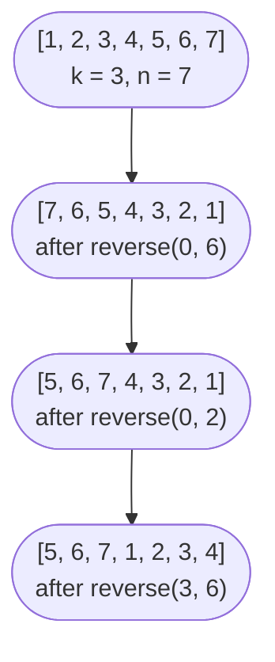

# Arrays: static, dynamic, multi-dimensional

A row of seven integers and an instruction: rotate it three positions to the right, in place, without allocating a single extra slot. Most readers reach for a temporary buffer of size three, copy the tail, shift the head, write the buffer back. That works, and it costs O(n) extra memory. Jon Bentley's 1986 *Programming Pearls* shows a different answer in three lines, with no extra buffer, no auxiliary structure, and a moment of "you can do that?" that's the whole point of the chapter.

The contiguous-memory model is what makes the trick possible. Once the runtime knows the address of element zero, the address of element `i` is `base + i × sizeof(elem)`, computed by the CPU in a single instruction with scale-and-offset addressing. Every other claim about arrays in the next twelve chapters depends on that one fact.

## What an array actually is

A static array is a fixed-length contiguous buffer of equal-sized elements. Java spells it `int[] a = new int[10]`; C++ spells it `int a[10]`; Go spells it `var a [4]int`. The length is part of the type and cannot change at runtime.[^1] That's restrictive, but it's also what gives you O(1) random access, O(1) length lookup, and an iteration order the cache prefetcher loves.

A dynamic array carries the same primitive plus a resize policy: a `length` you can read, a `capacity` you usually cannot, and an `append` operation that grows the underlying buffer on overflow. Python `list`, Java `ArrayList`, C++ `std::vector`, and Go slices all share this shape. The cost story is amortized O(1) per append and the proof lives in [Dynamic array internals](./01-dynamic-array-internals.md).[^2] For now: trust the bound and move on.

A multi-dimensional array is the same idea in two dimensions. In row-major layout (C, Java, Python list-of-lists), element `(i, j)` of an `m × n` matrix lives at `base + i × n + j`. Iterating the rightmost index in the inner loop walks memory sequentially; iterating the outer index in the inner loop strides by `n` and trashes the cache. When you reach LC 48 in [Matrix manipulation](./07-matrix-manipulation.md), this is what makes the difference between fast and slow code.

The decision boundary between arrays and linked lists is sharper than most beginners realize. If the workload is "look up index `i`, swap two indices, scan left to right," arrays win on every axis: cache locality, branch-free indexing, lower per-element overhead. If the workload is "splice a 100-node sublist into the middle of another list without moving anything," linked lists win. This chapter stays on the array side; linked lists are their own part of the book.

## The cost model you can quote in an interview

Three operations dominate the chapter, and three more set the price for the dynamic-array variant. They share the contiguous-memory invariant; the bounds fall out of it.

| Operation | Time | Extra space | Why |
|---|---|---|---|
| Random access `a[i]` | O(1) | O(1) | Address arithmetic is one instruction. |
| Length `len(a)` | O(1) | O(1) | Stored alongside the buffer header.[^2] |
| LC 88 back-merge (m + n) | O(m + n) | O(1) | Each destination slot is written once. |
| LC 27 read/write compaction | O(n) | O(1) | One pass with two indices.[^3] |
| LC 189 three-reverse rotation | O(n) | O(1) | 2n swaps across three reverses.[^3] |
| Append to dynamic array (amortized) | O(1) | O(1) | Aggregate analysis on the doubling table.[^2] |
| Append to dynamic array (worst case) | O(n) | O(n) | The reallocation step. |
| Insert or delete near the front | O(n) | O(1) | Every following element shifts.[^2] |

The lower bound for the three in-place algorithms is straightforward. Any cell that changes value must be touched at least once, so any in-place rearrangement of `n` values is Ω(n). All three hit the bound; you can't beat them by a constant factor without breaking the in-place constraint.

## Three problems, three techniques

The rest of the chapter is three LeetCode problems that distill the chapter's three signature techniques: back-merge, two-pointer compaction, three-reverse rotation. Each is in-place. Each is O(n). Each is the reflex you should reach for whenever the problem says "in-place" or "O(1) extra space."

### LC 88 — Merge Sorted Array, the back-merge

You have two sorted arrays. The first, `nums1`, has length `m + n` but only the first `m` slots are valid; the trailing `n` slots are filled with sentinel zeros. The second, `nums2`, has length `n`. Merge `nums2` into `nums1` in place, keeping the result sorted.

The wrong answer is to walk forward from the start of `nums1`, comparing and inserting. Forward iteration overwrites positions of `nums1` that haven't been compared yet, or it forces an O(m + n) auxiliary buffer to dodge the overwrite. Neither is acceptable when the problem says O(1) extra space.

The right answer is to walk backward. Place three pointers: `i` at the last valid slot of `nums1`, `j` at the end of `nums2`, `k` at the end of the destination buffer. At each step, write the larger of `nums1[i]` and `nums2[j]` into position `k`, decrement the chosen source pointer, decrement `k`. The trailing slots are guaranteed empty, so writing into them never destroys live data. By the time `k` reaches a position that holds a live value, every value to the right of `k` has already been compared and placed.

```python
def merge(nums1, m, nums2, n):
    i, j, k = m - 1, n - 1, m + n - 1
    while j >= 0:
        if i >= 0 and nums1[i] > nums2[j]:
            nums1[k] = nums1[i]
            i -= 1
        else:
            nums1[k] = nums2[j]
            j -= 1
        k -= 1
```

**Solution** — Python ([Java](./00-arrays/lc-88/sol.java) · [C++](./00-arrays/lc-88/sol.cpp) · [Go](./00-arrays/lc-88/sol.go))

```python
# LC 88. Merge Sorted Array
# Merge nums2 (length n) into nums1 (capacity m+n, first m valid) in place.
# Walk back-to-front so writes never overwrite an unread value. O(m+n), O(1).
from typing import List


def merge(nums1: List[int], m: int, nums2: List[int], n: int) -> None:
    i, j, k = m - 1, n - 1, m + n - 1
    while j >= 0:
        # Short-circuit on i >= 0 handles the m == 0 case implicitly.
        if i >= 0 and nums1[i] > nums2[j]:
            nums1[k] = nums1[i]
            i -= 1
        else:
            nums1[k] = nums2[j]
            j -= 1
        k -= 1
```

The whole algorithm is six lines. Each position is written once. Total work: O(m + n). Extra space: O(1). The loop's exit condition is `j < 0`, which means `nums2` is exhausted; whatever is left in `nums1[0..i]` is already in the right place because it was sorted to begin with.

### LC 27 — Remove Element, the two-pointer compaction

Given `nums` and a value `val`, remove every occurrence of `val` from `nums` in place. Return the new logical length `k`; the first `k` entries of `nums` should hold the kept values. Whatever sits in `nums[k:]` is irrelevant; the grader doesn't inspect it.

This is the canonical read-write split. One pointer `i` advances through every position; another pointer `k` advances only when `nums[i] != val`. The kept elements compact toward the front; the discarded ones get overwritten on the next survivor.

```python
def remove_element(nums, val):
    k = 0
    for i in range(len(nums)):
        if nums[i] != val:
            nums[k] = nums[i]
            k += 1
    return k
```

**Solution** — Python ([Java](./00-arrays/lc-27/sol.java) · [C++](./00-arrays/lc-27/sol.cpp) · [Go](./00-arrays/lc-27/sol.go))

```python
# LC 27. Remove Element
# Two-pointer compaction: read pointer i scans every slot, write pointer k
# advances only on keepers. Returns the new logical length. O(n), O(1).
from typing import List


def remove_element(nums: List[int], val: int) -> int:
    k = 0
    for i in range(len(nums)):
        if nums[i] != val:
            nums[k] = nums[i]
            k += 1
    return k
```

`k` is both the next write index and the final length, which is the cleanest version of the contract: returning `k` returns both pieces of information at once. The pattern is more general than this single problem suggests. LC 26 (Remove Duplicates from Sorted Array) keeps `nums[i]` when it differs from `nums[k-1]`. LC 283 (Move Zeroes) keeps the non-zero values. LC 75 (Sort Colors) extends to three pointers. The full template lives in [Two pointers, same direction](../part-3-pointers-window-prefix/01-two-pointers-same-direction.md).

### LC 189 — Rotate Array, the three-reverse trick

Rotate `nums` right by `k` steps, in place, in O(1) extra space. Constraints: `1 ≤ n ≤ 10^5`, `0 ≤ k ≤ 10^5`, so `k` may exceed `n`.

The naive answer is to shift every element one position right, `k` times. That's O(n × k), and at the worst case it's 10^10 operations. It times out in every language.

The Bentley trick, attributed in *Programming Pearls* Column 2 to a graduate student who "had the aha and never forgot it":[^3]

```text
reverse(nums, 0, n - 1)   # reverse the whole array
reverse(nums, 0, k - 1)   # reverse the first k
reverse(nums, k, n - 1)   # reverse the last n - k
```

That's the rotation. Total swaps: 2n. Extra space: O(1). The proof is one paragraph: after the first reverse, position `i` holds the original value at `n - 1 - i`. After the second reverse, the first `k` positions are in their final rotated order. After the third reverse, the last `n - k` positions are too. Done.

```python
def rotate(nums, k):
    n = len(nums)
    if n == 0:
        return
    k %= n

    def _reverse(lo, hi):
        while lo < hi:
            nums[lo], nums[hi] = nums[hi], nums[lo]
            lo += 1
            hi -= 1

    _reverse(0, n - 1)
    _reverse(0, k - 1)
    _reverse(k, n - 1)
```

**Solution** — Python ([Java](./00-arrays/lc-189/sol.java) · [C++](./00-arrays/lc-189/sol.cpp) · [Go](./00-arrays/lc-189/sol.go))

```python
# LC 189. Rotate Array
# Three-reverse trick: reverse the whole array, then reverse the first k,
# then reverse the rest. Avoids the O(n*k) naive shift. O(n), O(1).
from typing import List


def rotate(nums: List[int], k: int) -> None:
    n = len(nums)
    if n == 0:
        return
    k %= n  # Tolerate k > n; rotating n is a no-op.

    def _reverse(lo: int, hi: int) -> None:
        while lo < hi:
            nums[lo], nums[hi] = nums[hi], nums[lo]
            lo += 1
            hi -= 1

    _reverse(0, n - 1)
    _reverse(0, k - 1)
    _reverse(k, n - 1)
```

The visual trace on `nums = [1, 2, 3, 4, 5, 6, 7]`, `k = 3`:



*Three reverses applied in order rotate the array right by k. Each reverse is itself a two-pointer swap, so the total swap count is exactly 2n.*

The first executable line after the `n == 0` guard is `k %= n`, and that line is mandatory. Without it, `reverse(0, k - 1)` indexes out of bounds whenever `k ≥ n`. Python silently produces an empty slice and a wrong answer; C++ is undefined behavior; Java throws `ArrayIndexOutOfBoundsException`. The constraint `k ≤ 10^5` on a possibly-shorter array makes this a real failure mode, not a hypothetical one.

## Where readers go wrong

Five failure modes show up in practice, one per problem cluster. Each has the same shape: the bug is a one-liner, the fix is a one-liner, and the cost of the bug is somewhere between "wrong answer" and "out-of-bounds at runtime."

> [!WARNING]
> **Reassigning the parameter instead of mutating in place.** The Python one-liner `nums = nums[-k:] + nums[:-k]` looks correct on a printed example, but it rebinds the local name. LC's grader inspects the caller's array and sees no change. Use `nums[:] = nums[-k:] + nums[:-k]` for slice assignment, or use the three-reverse algorithm where every modification is `nums[i] = ...`. The same bug exists in Go, where `nums = append(...)` rebinds the local slice header, and in any language where parameter rebinding doesn't propagate to the caller.

> [!WARNING]
> **Forward iteration on LC 88.** Walking left-to-right means the destination overlaps with live source data. You either overwrite an unread value of `nums1`, or you allocate an O(m + n) auxiliary buffer. The fix is one line: iterate from the back, where the trailing slots are guaranteed empty.

> [!WARNING]
> **Returning the wrong thing on LC 27.** The contract is "modify in place and return the new length `k`." Submissions that return `nums` itself, or return `len(nums)` (the original length), fail the grader. The canonical pattern `k = 0; for i: if nums[i] != val: nums[k++] = nums[i]; return k` makes `k` both the write index and the final length, so there's nothing else to return.

> [!WARNING]
> **Forgetting `k %= n` on LC 189.** The constraint allows `k` up to 10^5 on an array of up to 10^5. When `k ≥ n`, the second reverse walks out of bounds. Modulo first; everything that follows depends on it.

> [!WARNING]
> **Go slice aliasing on rotation.** Constructing `append(nums[len(nums)-k:], nums[:len(nums)-k]...)` reuses the same backing array; writes through one slice header corrupt the values seen through the other. Andrew Gerrand's 2011 Go blog post warns about this in the "A possible gotcha" section.[^4] The three-reverse algorithm is aliasing-free by construction because the only mutation is `a[i], a[j] = a[j], a[i]`, which writes only to indices `i` and `j` of one slice. Where copying is genuinely needed, `slices.Clone(nums)` (Go 1.21+) returns a fresh backing array.

## Problem ladder

### CORE (solve all three to claim chapter mastery)

- [LC 88 — Merge Sorted Array](https://leetcode.com/problems/merge-sorted-array/) [Easy] • back-merge ★
- [LC 27 — Remove Element](https://leetcode.com/problems/remove-element/) [Easy] • two-pointer-compaction
- [LC 189 — Rotate Array](https://leetcode.com/problems/rotate-array/) [Medium] • three-reverse-rotation

### STRETCH (optional)

- [LC 4 — Median of Two Sorted Arrays](https://leetcode.com/problems/median-of-two-sorted-arrays/) [Hard] • binary-search-on-partition

LC 4 is owned in [Binary search variants](../part-2-search-sort/02-binary-search-variants.md); the deep treatment lives there. It's listed here as the chapter's only Hard so the CORE+STRETCH set spans Easy/Medium/Hard.

## Where this leads

The read/write compaction generalizes the moment you meet a related "remove duplicates" or "move zeros" problem; [Two pointers, same direction](../part-3-pointers-window-prefix/01-two-pointers-same-direction.md) catalogs the family. The opposite-ends two-pointer technique opens [Two pointers, opposite ends](../part-3-pointers-window-prefix/00-two-pointers-opposite.md). When the operation on a contiguous range can be reduced to subtractions of cumulative values, you reach for [Prefix sums, prefix XOR, and difference arrays](../part-3-pointers-window-prefix/04-prefix-sums.md). And the resize policy that makes `append` amortized O(1) on a Python list, a Java ArrayList, and a Go slice is [Dynamic array internals](./01-dynamic-array-internals.md), which is the next chapter.

## References

[^1]: Java SE 21 Language Specification, §10 "Arrays." [docs.oracle.com/javase/specs/jls/se21/html/jls-10.html](https://docs.oracle.com/javase/specs/jls/se21/html/jls-10.html).

[^2]: Python Software Foundation, "TimeComplexity" (CPython operation costs). [wiki.python.org/moin/TimeComplexity](https://wiki.python.org/moin/TimeComplexity).

[^3]: Jon Bentley, *Programming Pearls*, 2nd ed., Addison-Wesley, 2000.

[^4]: Andrew Gerrand, "Go Slices: usage and internals," The Go Blog, 5 January 2011. [go.dev/blog/slices-intro](https://go.dev/blog/slices-intro).
