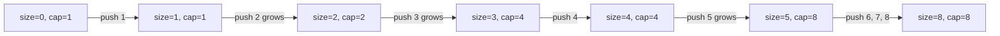

# Dynamic array internals

A loop that appends one million integers to a Python list ends up doing roughly nine million element-moves before the loop exits. Switch the language to Java and the same loop costs three million. Switch to C++ libstdc++ and it costs two million. Switch to a hypothetical "grow by one slot at a time" library and it costs five hundred billion.

All four are correct. Three are amortized O(1). One is amortized O(n). The chapter is the difference between those two outcomes, and the proof of why three different libraries, measuring the same operation, landed on three different constants.

## The proof in one paragraph

Take a fresh dynamic array with starting capacity 1 and growth factor `b > 1`. Push `n` items. Each push either writes into an empty slot (cheap) or triggers a reallocation that copies every existing element into a fresh, larger buffer (expensive). The expensive case fires whenever `size == cap`, which happens when capacity has just doubled, tripled, or whatever-tupled to `b^k` for `b^k ≥ n`. Each reallocation copies the size at that moment: the i-th grow moves `b^(i-1)` elements. Sum the moves across all reallocations:

```text
total_copies = b^0 + b^1 + b^2 + ... + b^(k-1)
             = (b^k - 1) / (b - 1)
             ≤ n / (b - 1)
```

Add the `n` writes-into-an-empty-slot, divide by `n`, and the amortized cost per push is at most `b / (b - 1)`. For `b = 2` that's two element-moves per push. For `b = 1.5` it's three. For `b = 1.125` (CPython's effective factor) it's nine.[^1][^2] Every value is a constant in `n`. The total work for `n` pushes is `Θ(n)` regardless of which growth factor you pick, as long as `b > 1`.

Drop the `b > 1` precondition and the proof collapses. With arithmetic growth, where reallocation adds a constant `c` slots, the i-th grow copies `(i × c)` elements, the sum is `Θ(n^2/c)`, and the per-push amortized cost becomes `Θ(n)`. A million-element loop pays half a trillion element-moves. This is why no production library uses arithmetic growth.[^3]

CLRS §16.4 proves the same `b = 2` bound via the potential method. Define `Φ(D) = 2 × num_elements - capacity`. A push that doesn't grow leaves capacity alone and increases `num` by one, so `ΔΦ = 2` and amortized cost = actual + ΔΦ = 1 + 2 = 3. A push that grows from capacity `k` to `2k` does `k + 1` actual work but drops Φ from `k` (the previously full table) to `2` (the just-doubled one), so amortized cost = (k + 1) + (2 - k) = 3. Two derivations, same number.[^3]

## How fast capacity actually grows

The Mermaid below traces a reference dynamic array from `cap = 1` with `b = 2`, pushing eight items:



*Three reallocations across eight pushes; capacity doubles each time it fills. The first ten doublings cover capacities 1, 2, 4, 8, 16, 32, 64, 128, 256, 512, 1024, so a 1024-push loop triggers ten grows.*

The reference implementation parameterizes the growth factor as a rational `growth_num / growth_den` so you can plug in 2/1, 3/2, or 9/8 and watch the same template produce the four production policies. Python is the canonical text:

```python
class DynArr:
    def __init__(self, initial_cap=1, growth_num=2, growth_den=1):
        self._cap = initial_cap
        self._size = 0
        self._growth_num = growth_num
        self._growth_den = growth_den
        self._buf = [None] * initial_cap

    def push(self, x):
        if self._size == self._cap:
            self._grow()
        self._buf[self._size] = x
        self._size += 1

    def _grow(self):
        new_cap = (self._cap * self._growth_num + self._growth_den - 1) // self._growth_den
        if new_cap <= self._cap:
            new_cap = self._cap + 1
        new_buf = [None] * new_cap
        for i in range(self._size):
            new_buf[i] = self._buf[i]
        self._buf = new_buf
        self._cap = new_cap
```

**Solution** — Python ([Java](./01-dynamic-array-internals/dynarr/sol.java) · [C++](./01-dynamic-array-internals/dynarr/sol.cpp) · [Go](./01-dynamic-array-internals/dynarr/sol.go))

```python
# DynArr — geometric-resize dynamic array reference template.
# Parameterized growth factor (growth_num / growth_den) for studying the
# amortized-O(1) push proof; tracks reallocation count to make the
# geometric pattern observable. Not an LC problem.
from __future__ import annotations
from typing import Any, Optional


class DynArr:
    def __init__(self, initial_cap: int = 1, growth_num: int = 2, growth_den: int = 1) -> None:
        if initial_cap < 1:
            raise ValueError("initial_cap must be >= 1")
        if growth_num <= growth_den:
            raise ValueError("growth_num must be > growth_den (factor > 1)")
        self._cap: int = initial_cap
        self._size: int = 0
        self._growth_num: int = growth_num
        self._growth_den: int = growth_den
        self._buf: list[Optional[Any]] = [None] * initial_cap
        self._reallocs: int = 0

    def size(self) -> int:
        return self._size

    def capacity(self) -> int:
        return self._cap

    def reallocations(self) -> int:
        return self._reallocs

    def get(self, i: int) -> Any:
        if i < 0 or i >= self._size:
            raise IndexError("get index out of range")
        return self._buf[i]

    def push(self, x: Any) -> None:
        if self._size == self._cap:
            self._grow()
        self._buf[self._size] = x
        self._size += 1

    def _grow(self) -> None:
        # Ceiling division so factors like 9/8 still grow on small caps.
        new_cap = (self._cap * self._growth_num + self._growth_den - 1) // self._growth_den
        # Guard against rounding to a no-op (would loop forever on next push).
        if new_cap <= self._cap:
            new_cap = self._cap + 1
        new_buf: list[Optional[Any]] = [None] * new_cap
        for i in range(self._size):
            new_buf[i] = self._buf[i]
        self._buf = new_buf
        self._cap = new_cap
        self._reallocs += 1


def simulate(initial_cap: int, growth_num: int, growth_den: int, n_push: int) -> tuple[int, int, int]:
    """Push n_push items into a fresh DynArr; return (size, capacity, reallocations)."""
    a = DynArr(initial_cap=initial_cap, growth_num=growth_num, growth_den=growth_den)
    for i in range(n_push):
        a.push(i)
    return a.size(), a.capacity(), a.reallocations()
```

The `if new_cap <= self._cap` guard catches a real bug. Apply factor 1.125 to capacity 1 and the integer-arithmetic formula returns 1; no growth, and the next push loops forever. Real libraries handle this with a separate small-list policy (CPython jumps from 0 to 4 to 8 before the asymptotic 1.125 takes over). The reference implementation just ratchets up by one when the factor would round to a no-op.

A loop that pushes 1000 elements through this template with `b = 2` triggers ten reallocations and copies 1023 elements total. Run the same loop with `b = 1.125` and you get about 80 reallocations copying ~9000 elements. Both are O(n). The constants differ by 9x, and that 9x is the entire reason different libraries pick different factors.

## Five libraries, five different answers

Every standard library that ships a dynamic array picks `b > 1`. Each picked something different.

| Implementation | Growth factor | Default initial cap | Source |
|---|---|---|---|
| Java OpenJDK `ArrayList` | 1.5x via `oldCapacity >> 1` | 10 (lazy) | OpenJDK `ArrayList.java`[^4] |
| CPython `list` | ~1.125x via `(newsize + (newsize >> 3) + 6) & ~3` | 0 | CPython `Objects/listobject.c`[^1] |
| C++ libstdc++ `std::vector` | 2x ("Grow by (at least) doubling") | 0 | GCC `bits/stl_vector.h`[^5] |
| C++ libc++ `std::vector` | 2x via `max(2 × cap, new_size)` | 0 | LLVM `__vector/vector.h`[^6] |
| C++ MSVC `std::vector` | 1.5x via `oldCap + oldCap/2` | 0 | Microsoft STL `inc/vector`[^7] |
| Folly `FBVector` | 1.5x | configurable | Facebook Folly `FBVector.md`[^8] |
| Go slice (1.18+) | 2x below 256, smoothing toward 1.25x above | varies | Go `runtime/slice.go`[^9] |

*Same primitive operation, seven different constants. The C++ standard mandates only "amortized constant time" for `push_back`; it does not specify a factor.[^10] All conformant. None portable.*

CPython picked the smallest factor of any major language, by an enormous margin. The published growth pattern from the source comment in `listobject.c` is `0, 4, 8, 16, 24, 32, 40, 52, 64, 76, ...`. From 64 to 76 is a 19% step; from 88 to 100 is 14%; the asymptote is 1.125x. The python-dev `discuss.python.org` thread spells out the history: Python doubled in the early 2000s, was reduced to 1.5 because "too many large lists in real life prematurely ran out of RAM," and was reduced again to 1.125 for the same reason.[^2] Per-push amortized cost is roughly nine element-moves, the highest in the table, and the python-dev maintainers consider that a feature, because it bounds peak RAM tighter than any of the alternatives.

Go's policy changed in March 2022. Commit `2dda92ff` lowered the threshold from 1024 to 256 and replaced an abrupt 2x-to-1.25x cliff with a smoothing formula: above the threshold, `newcap += (newcap + 3*256) >> 2`. The commit message explains the threshold was chosen to roughly match the total reallocation count of the prior policy when appending into a very large slice. The goal was to migrate without breaking the constant factor anyone had benchmarked.[^9] Tutorials from before 2022 still say "Go doubles below 1024, then 1.25x." That was true once.

### Why 1.5x is the engineering compromise

Folly's `FBVector` argues for 1.5x with a math claim, not a benchmark. With doubling, the cumulative size of all freed buffers is `1 + 2 + 4 + ... + 2^(k-1) = 2^k - 1`, which is strictly less than the next allocation of `2^k`. The freed region never coalesces into something large enough for the next grow, even in principle. With `b < (1 + √5) / 2 ≈ 1.618` (the golden ratio), the cumulative freed sum eventually overtakes the next allocation, so an allocator that coalesces freed blocks can in principle reuse the same physical memory region for the buffer's growth.[^8] MSVC STL and Folly both picked 1.5x for this reason; libstdc++ and libc++ kept 2x for the lower amortized constant.

How much of that benefit is real depends on the allocator. Modern size-class allocators (jemalloc, tcmalloc) use bucket boundaries that don't always coalesce the way a textbook free list does. The math holds; the in-practice memory recovery varies by workload.

## A cost table to quote in interviews

| Operation | Worst-case time | Amortized time | Space | Notes |
|---|---|---|---|---|
| `get(i)` random access | O(1) | O(1) | O(1) | Address arithmetic.[^11] |
| `push(x)` no-grow case | O(1) | O(1) | O(1) | One write. |
| `push(x)` grow-triggering case | O(n) | — | O(n) transient | The single push copies everything. |
| `push(x)` over a sequence of n | — | O(1) per push | O(n) peak | The proof above.[^3] |
| `pop()` no-shrink | O(1) | O(1) | O(1) | One write to `size`. |
| Insert or delete near the front | O(n) | O(n) | O(1) | Every following element shifts. |

The "amortized O(1) but worst-case O(n)" distinction is the chapter's one shot at saving you from a hard-real-time bug. A flight-control loop that needs to finish each push in under a microsecond cannot use a regular `ArrayList`, because every once in a long while a single push triggers a reallocation that copies every element so far. The fix in those settings is a *deamortized* dynamic array: split the copy across multiple subsequent pushes, with a worst-case-per-operation bound at the cost of more bookkeeping. CLRS calls this technique table-doubling with the lazy-rehash pattern; in practice it shows up in real-time game engines and in the heap rebalancing covered in [Heaps](../part-6-trees-heaps/04-heaps-priority-queues.md).[^3]

### What happens on the way down

Shrinking is harder than growing, and most production libraries don't bother. CPython's `list` never shrinks unless you call `list_resize` explicitly with a smaller target. Java's `ArrayList` exposes `trimToSize()` for the same reason: shrinking is opt-in. Go slices never shrink the backing array. Slicing produces a new header with smaller `len`, but `cap` and the underlying memory stay put.

The reason is amortization, again. The naive shrink policy, halving capacity whenever `size ≤ cap / 2`, breaks the amortized bound on alternating push/pop sequences. Push past the boundary triggers a grow; pop just past it triggers a shrink; push triggers grow; pop triggers shrink. Each operation costs O(n), the amortization buffer never accumulates, and `n` operations cost `Θ(n^2)` total. CLRS §16.4.2 fixes this with a hysteresis policy: shrink only when `size ≤ cap / 4`. The amortized bound returns; the cost is up to 75% wasted capacity at the trough.[^3] Most standard libraries skip the policy entirely and let the user call `trim` or `clone` if memory pressure matters.

## Where readers go wrong

> [!WARNING]
> **`reserve(n)` does not set size; the size-n constructor does.** In C++, `vector<int> v(n);` creates a length-`n` vector of zeros. `vector<int> v; v.reserve(n);` creates an empty vector with capacity `n`. Java's `new ArrayList<>(n)` behaves like `reserve` (capacity-only); to pre-fill in Java use `new ArrayList<>(Collections.nCopies(n, default))`. Mixing up the two semantics writes data to position 0 of an `n`-element zero buffer instead of appending.

> [!WARNING]
> **Front insertion is O(n) per call, with no amortization to rescue it.** `list.insert(0, x)` in Python, `vector::insert(vector.begin(), x)` in C++, and any "shift everything right by one" operation cost O(n) per call. A loop that does this `n` times runs in `Θ(n^2)`. Geometric resize amortizes growth at the *end*; nothing amortizes work at the *front*. Match access pattern to data structure: append-only is a dynamic array; front-and-back is a deque (`collections.deque` in Python, `ArrayDeque` in Java, `std::deque` in C++, the ring-buffer pattern in [Queues and deques](./06-queues-deques.md)).

> [!WARNING]
> **Cross-platform C++ benchmarks measure growth policy, not speed.** A 10-million-int push loop runs about 23 reallocations on libstdc++ and libc++ (2x) and about 58 on MSVC STL (1.5x). The MSVC numbers look 1.4-2x worse, but the algorithm and the standard-library implementation are doing exactly what was asked. The growth factor is unspecified by the C++ standard, so identical code measures different things on different toolchains. Either call `reserve(n)` upfront with the known final size, or report per-toolchain numbers.[^10]

> [!WARNING]
> **"Python doubles its list" is wrong, and has been for over twenty years.** Tutorials and forum posts still cite "2x" by analogy with `std::vector`. Anyone who reads `Objects/listobject.c` sees the actual formula `new_allocated = (newsize + (newsize >> 3) + 6) & ~3`: a 1.125 factor with a +6 constant and a 4-element rounding floor. If the growth factor matters for an answer, cite the source. The python-dev thread on increasing the factor opens with the historical record: Python doubled in the early 2000s, dropped to 1.5, and currently sits at 1.125.[^2]

> [!WARNING]
> **Confusing capacity with size in a hot path.** `for i in range(len(arr))` in Python is correct; the C++ port `for (size_t i = 0; i < arr.capacity(); ++i)` iterates past the end of valid data into uninitialized slots. Always iterate over size; capacity is for `reserve`, instrumentation, and benchmarks. Go's idiom captures this directly: `s[:len(s)]` is the valid data, `s[:cap(s)]` exposes uninitialized trailing slots, the same backing array seen through two different views.[^9]

## Problem ladder

This chapter is depth-on-mechanics, not a pattern chapter. The canonical Easy and Medium "in-place array manipulation" problems are owned by [Arrays: static, dynamic, multi-dimensional](./00-arrays.md). The remaining canonical-fit problems, explicit data structures where capacity-vs-length is the design surface, cluster at Medium difficulty, so the three CORE problems below are all Medium. The `foundation_framework_exempt` ladder flag applies: the proof in this chapter is the load-bearing artifact, and the ladder is supplemental practice.

### CORE (solve all to claim chapter mastery)

- [LC 1146 — Snapshot Array](https://leetcode.com/problems/snapshot-array/) [Medium] • array-design-per-cell-version-list ★
- [LC 919 — Complete Binary Tree Inserter](https://leetcode.com/problems/complete-binary-tree-inserter/) [Medium] • array-backed-tree-with-index-arithmetic
- [LC 622 — Design Circular Queue](https://leetcode.com/problems/design-circular-queue/) [Medium] • array-buffer-bounded-with-modular-indexing

## Where this leads

Every chapter from here on quietly cites this one whenever it claims `append`, `add`, `push_back`, or `append(slice, x)` runs in O(1). The most direct downstream user is [Hash maps](./03-hash-maps.md), which reuses the geometric-resize argument for the table-resize-on-load-factor-breach contract: same proof, different precondition. Real-time systems that need worst-case bounds rather than amortized ones reach for deamortized variants, which show up first in [Heaps](../part-6-trees-heaps/04-heaps-priority-queues.md) once you've met priority queues.

## References

[^1]: CPython source, `Objects/listobject.c`, function `list_resize`. [github.com/python/cpython/.../listobject.c](https://github.com/python/cpython/blob/main/Objects/listobject.c).

[^2]: discuss.python.org thread "Consider increasing the growth factor of list objects" (March 2026). <https://discuss.python.org/t/consider-increasing-the-growth-factor-of-list-objects/106622>

[^3]: Cormen, Leiserson, Rivest, Stein, *Introduction to Algorithms*, 4th ed., MIT Press, 2022. The general `b/(b-1)` bound is presented in Jeff Erickson, *Algorithms*, Chapter 13 §13.3 "Doubling Tables." [jeffe.cs.illinois.edu/teaching/algorithms](https://jeffe.cs.illinois.edu/teaching/algorithms/).

[^4]: OpenJDK source, `src/java.base/share/classes/java/util/ArrayList.java`, method `grow(int minCapacity)`. [github.com/openjdk/jdk/.../ArrayList.java](https://github.com/openjdk/jdk/blob/master/src/java.base/share/classes/java/util/ArrayList.java).

[^5]: GCC libstdc++-v3, `bits/stl_vector.h`, member `_M_check_len(size_type, const char*)` returns `size() + max(__n, size())`, with the inline comment "Grow by (at least) doubling." [github.com/gcc-mirror/gcc/.../stl_vector.h](https://github.com/gcc-mirror/gcc/blob/master/libstdc%2B%2B-v3/include/bits/stl_vector.h).

[^6]: LLVM libc++, `libcxx/include/__vector/vector.h`, member `vector::__recommend(size_type)` returns `std::max(2 * __cap, __new_size)`, capped at `max_size()`. [github.com/llvm/llvm-project/.../vector.h](https://github.com/llvm/llvm-project/blob/main/libcxx/include/__vector/vector.h).

[^7]: Microsoft STL, `stl/inc/vector`, member `vector::_Calculate_growth(const size_type)` returns `_Oldcapacity + _Oldcapacity / 2` — that is, 1.5x — falling back to the requested size when geometric growth is insufficient. [github.com/microsoft/STL/.../vector](https://github.com/microsoft/STL/blob/main/stl/inc/vector).

[^8]: Facebook Folly, `folly/docs/FBVector.md`, section on memory-allocation strategy: "It can be mathematically proven that a growth factor of 2 is rigorously the worst possible because it never allows the vector to reuse any of its previously-allocated memory." Folly's chosen factor is 1.5x. [github.com/facebook/folly/.../FBVector.md](https://github.com/facebook/folly/blob/main/folly/docs/FBVector.md).

[^9]: Go runtime, `src/runtime/slice.go`, function `growslice` and helper `nextslicecap`. Threshold change documented in commit `2dda92ff6f9f07eeb110ecbf0fc2d7a0ddd27f9d` (March 2022): "256 was chosen as the threshold to roughly match the total number of reallocations when appending to eventually make a very large slice." [github.com/golang/go/.../slice.go](https://github.com/golang/go/blob/master/src/runtime/slice.go).

[^10]: ISO/IEC 14882:2020 (C++20), [vector.modifiers]/3: `push_back` is amortized constant time; the standard does not specify a growth factor.

[^11]: Python Software Foundation, "TimeComplexity" (CPython operation costs). [wiki.python.org/moin/TimeComplexity](https://wiki.python.org/moin/TimeComplexity).
