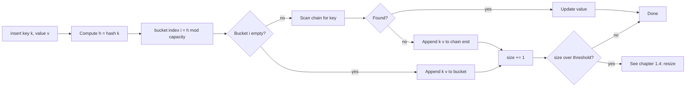

# Hash maps and hash sets

OpenJDK's `HashMap` resizes when the table is 75% full. CPython's `dict` resizes at 67%. Go's pre-Swiss `runtime.map` ran at 81% before the 2024 redesign. Three production implementations of the same abstract data type, three different constants, all of them claiming O(1) average lookup and insertion. None of them are wrong. The constant *is* the chapter; understanding why three different teams picked three different numbers is what separates "I can use a HashMap" from "I can explain why a HashMap holds its bound."

The bound, in one sentence: a hash map is an array of buckets, indexed by `hash(key) mod capacity`, with a small per-bucket scan to disambiguate collisions, kept under a load-factor threshold by doubling the array on overflow. Lookup, insert, and delete are all `Θ(1 + α)` average, where `α = n / m` is the load factor and the threshold pins it to a constant. CLRS calls this Theorem 11.1; the proof is one paragraph and we'll write it once.[^1]

The reason it earns a chapter is the leverage. Whenever the inner `for j > i` loop of an O(n²) brute force is hunting for a key (a complement, a duplicate, a same-equivalence-class member), the hash map collapses that hunt to O(1) average and the algorithm becomes O(n). LC 1 Two Sum is the canonical instance: given `[2, 7, 11, 15]` and `target = 9`, walk the array once, ask the hash map "have I seen `9 - nums[i]` already?", and return the indices on the first hit. Four lines. O(n) average time. The brute force was 250 million operations on the largest LC input; the hash-map version is 10,000.[^4]

This chapter teaches the mechanics first, then three signature applications. The cost-side companion lives in [Hash collisions and the load factor](./04-hash-collisions.md): what happens when collisions pile up, when the table resizes mid-loop, when an attacker chooses adversarial keys. Both chapters share one widget that animates the happy path on the left and the cost path on the right. We're on the left.

## What invariant the average-case bound depends on

CLRS Chapter 11 frames the chained hash table as: an array of `m` buckets, each holding a linked list of `(key, value)` entries.[^1] Insert hashes the key, mods by `m` to pick a bucket, scans the chain for an existing entry with the matching key (and updates if found), or appends a new entry at the chain's end. Lookup does the same hash-and-mod, scans the chain, returns the value or `NotFound`. Delete is the same scan, with a list-remove on hit.



*Average-case insert; the resize branch is where [Hash collisions and the load factor](./04-hash-collisions.md) picks up the cost story.*

The load factor `α = n / m` is the average chain length. Theorem 11.1 establishes that under the simple-uniform-hashing assumption (each key independently maps to a slot uniformly at random), the expected length of any chain is exactly `α`.[^1] So expected lookup, insert, and delete cost is `Θ(1 + α)`. Bound `α` above by a constant and the expression collapses to `Θ(1)`.

Bounding `α` is what the load-factor threshold is for. When `size > threshold * capacity`, the table doubles its capacity and rehashes every existing entry into the new buckets. That single resize event is `Θ(n)`; the dynamic-table argument from [Dynamic array internals](./01-dynamic-array-internals.md) amortizes it to `Θ(1)` per insert, exactly the way it amortizes `ArrayList.add`.[^1]

The threshold is a real number, hardcoded in source. Three production implementations picked three different ones:

| Implementation | Strategy | Threshold | Per-insert amortized cost |
|---|---|---|---|
| Java OpenJDK `HashMap` | Chaining, treeified at chain length 8 | `DEFAULT_LOAD_FACTOR = 0.75` | ~3 chain operations |
| CPython `dict` | Open addressing with perturbation probing | `USABLE_FRACTION = 2/3` | ~2 probes |
| C++ libstdc++ `unordered_map` | Chaining (forward_list per bucket) | `max_load_factor = 1.0` | ~2-3 chain operations |
| Go `runtime.map` (pre-Swiss) | Bucketed open addressing | `loadFactor = 6.5/8 ≈ 0.81` | ~5 probes |

*Source-coded constants from OpenJDK `HashMap.java`, CPython `Objects/dictobject.c`, libstdc++ docs, and Go `runtime/map.go`.[^1][^2][^3][^5]*

The chaining implementations (Java, C++) tolerate higher thresholds because chain traversal is cheaper than open-addressing probing under contention. The open-addressing implementations (Python, Go) pick lower thresholds because Theorem 11.6 says the expected probe count under uniform hashing is `1 / (1 - α)`: at `α = 0.5` that's two probes, at `α = 0.75` it's four, at `α = 0.9` it's ten.[^1] The math makes the choice obvious in retrospect; that's why no major library ships with `α = 0.95`.

The chapter widget animates a clean sequence with no collisions and no resize. Four inserts and two lookups on a 4-bucket chained table, with a hash function `hash(s) = ord(s[0])` chosen so the first three keys land in distinct buckets:

> **Interactive widget:** [Hash table (chained insert + lookup)](../widgets/w-02-hash-table.yml) (panel `panel-a`) — rendered on the website; the YAML spec describes the keyframes.

*Static fallback: a 4-bucket table starts empty; three inserts (apple, banana, cherry) land in buckets 1, 2, 3; a fourth insert of apple finds the existing entry and updates in place; a lookup of banana hits bucket 2 and returns 1; a lookup of grape probes bucket 3, scans past cherry, and returns NotFound.*

The lookup-of-grape step is the one to watch. Bucket 3 is non-empty (cherry lives there), but cherry's key doesn't match grape, so the scan walks to the end of the chain and reports NotFound. A non-empty bucket isn't a hit; you still pay the per-entry comparison.

The next chapter's panel reuses the same widget shell to drive a collision storm into a resize. Watching them step in lockstep is the cleanest way to feel both halves of the contract.

## LC 1: value-to-index map

Given an array `nums` and an integer `target`, return the indices of the two elements that sum to `target`. Each input has exactly one valid answer; you may not use the same element twice.[^4]

The brute force is the obvious nested loop: try every `(i, j)` with `j > i`, return the first pair that sums to target. O(n²) time, O(1) space. At LC's max input size of 10⁴ that's 10⁸ comparisons in the worst case, which times out in C++ at the boundary and times out everywhere else with margin to spare.

The hash-map version asks a different question. Instead of *"for this `nums[i]`, is there a `nums[j]` later in the array that completes the pair?"*, ask *"for this `nums[i]`, has the partner `target - nums[i]` already been seen?"* The hash map turns "already seen" into an O(1)-average answer. One pass, no inner loop:

```python
def two_sum(nums, target):
    seen = {}                              # value -> first index where it appeared
    for i, x in enumerate(nums):
        complement = target - x
        if complement in seen:
            return [seen[complement], i]
        seen[x] = i                        # store AFTER the lookup
    return []
```

**Solution** — Python ([Java](./03-hash-maps/lc-1/sol.java) · [C++](./03-hash-maps/lc-1/sol.cpp) · [Go](./03-hash-maps/lc-1/sol.go))

```python
# LC 1. Two Sum
# One pass with a value -> first-seen-index map. For each x, look up the
# complement (target - x) BEFORE inserting x; the lookup-then-insert order
# is what prevents matching an element against itself on inputs like [3,3].
# O(n) time, O(n) space.
from typing import Dict, List


def two_sum(nums: List[int], target: int) -> List[int]:
    seen: Dict[int, int] = {}
    for i, x in enumerate(nums):
        complement = target - x
        if complement in seen:
            return [seen[complement], i]
        seen[x] = i
    return []
```

The order of operations is load-bearing. For each `nums[i]`, the function looks up `target - nums[i]` *first*, and stores `nums[i] -> i` *second*. Reverse the order and the test case `nums = [3, 3], target = 6` returns `[0, 0]`, the same index matched against itself, violating the "may not use the same element twice" constraint. Sedgewick & Wayne foreground this exact reduction in *Algorithms* §3.4 as the textbook application of hashing: replace the inner search loop with a single hash-map probe.[^6]

The editorial widget animates the LC-1-specific trace at full fidelity, with a deliberately small input (`nums = [3, 3]`, `target = 6`) chosen because it surfaces the lookup-before-store invariant on step 4:

> **Interactive widget:** [Two Sum (LC 1) — optimal one-pass hash map](../widgets/e-LC001-two-sum.yml) (panel `default`) — rendered on the website; the YAML spec describes the keyframes.

*Static fallback: the value-to-index hash map starts empty; on `i = 0` the lookup for complement 3 misses, then 3 → 0 is stored; on `i = 1` the lookup for complement 3 hits at index 0, the function returns `[0, 1]`. Two lookups, one insert.*

The `[3, 3]` input is the one most candidates get wrong on the whiteboard. The bigger inputs (LC's `[2, 7, 11, 15]`, `[3, 2, 4]`) are correct on either ordering of operations; only the duplicate-value case exposes the bug.

## LC 49: signature-to-list map

Group an array of strings by anagram class. Two strings belong to the same class if and only if they're permutations of each other.[^7]

The hash map's value column changes shape. Instead of a single index or a count, the value is a *list* of strings that share an equivalence class. The key is a canonical form derived from each string: either the sorted version of the string, or the 26-int character-count vector encoded as a delimited string so `1,11` doesn't collide with `11,1`.

```python
def group_anagrams(strs):
    groups = defaultdict(list)
    for s in strs:
        counts = [0] * 26
        for ch in s:
            counts[ord(ch) - ord("a")] += 1
        groups[tuple(counts)].append(s)
    return list(groups.values())
```

**Solution** — Python ([Java](./03-hash-maps/lc-49/sol.java) · [C++](./03-hash-maps/lc-49/sol.cpp) · [Go](./03-hash-maps/lc-49/sol.go))

```python
# LC 49. Group Anagrams
# Bucket by canonical form. The 26-int character-count tuple is O(k) per
# string vs O(k log k) for sorted-string keys, where k is string length.
# defaultdict(list) handles the "create-then-append" idiom in one line.
# O(N * k) time, O(N * k) space, for N strings of average length k.
from typing import Dict, List
from collections import defaultdict


def group_anagrams(strs: List[str]) -> List[List[str]]:
    groups: Dict[tuple, List[str]] = defaultdict(list)
    for s in strs:
        counts = [0] * 26
        for ch in s:
            counts[ord(ch) - ord("a")] += 1
        groups[tuple(counts)].append(s)
    return list(groups.values())
```

Each language reaches for its idiomatic version of "if no list yet, create one; then append." Java spells it `computeIfAbsent(key, k -> new ArrayList<>())`. Python uses `defaultdict(list)`. Go writes the bare `m[k] = append(m[k], element)` and relies on nil-slice-extends-to-singleton. C++ uses `groups[key].push_back(s)` because `operator[]` default-constructs the missing value. Same pattern, four surface idioms.

The character-count signature beats the sorted-string signature in production. Sorting is `O(k log k)` per string; counting is `O(k)`. For LC 49's constraints (strings up to 100 characters, up to 10⁴ strings) the difference is small; on a longer-string variant it's the whole point. The count-vector idiom generalizes immediately to any fixed-size alphabet, which is why every LC editorial that visits a similar pattern reaches for it.[^7]

## LC 242: per-character counter

Given two strings `s` and `t`, decide whether `t` is an anagram of `s`. Same multiset of characters, possibly different order.[^8]

The cleanest version is the increment-then-decrement-and-check pattern. Build the counter from `s`; walk `t` and decrement; the moment any count goes negative, return false:

```python
def is_anagram(s, t):
    if len(s) != len(t):
        return False
    counts = {}
    for ch in s:
        counts[ch] = counts.get(ch, 0) + 1
    for ch in t:
        if counts.get(ch, 0) == 0:
            return False
        counts[ch] -= 1
    return True
```

**Solution** — Python ([Java](./03-hash-maps/lc-242/sol.java) · [C++](./03-hash-maps/lc-242/sol.cpp) · [Go](./03-hash-maps/lc-242/sol.go))

```python
# LC 242. Valid Anagram
# Increment-decrement-and-check: build a counter from s, then walk t
# decrementing; any underflow means t is not a permutation of s.
# Length short-circuit avoids building the counter when sizes differ.
# O(n), O(k) where k is the alphabet size.
from typing import Dict


def is_anagram(s: str, t: str) -> bool:
    if len(s) != len(t):
        return False
    counts: Dict[str, int] = {}
    for ch in s:
        counts[ch] = counts.get(ch, 0) + 1
    for ch in t:
        if counts.get(ch, 0) == 0:
            return False
        counts[ch] -= 1
    return True
```

The length short-circuit is mandatory and the most common omission. Skip it and you spend O(n) building a counter only to discover the strings disagree on length, which the comparison would have caught at zero cost.

The reference here uses `HashMap<Character, Integer>` (Java) and `dict` (Python) to mirror the chapter's pseudocode and to handle the LC 242 follow-up question about Unicode. For ASCII-only input at LC 242's max constraints (50,000 lowercase letters), an `int[26]` indexed by `ch - 'a'` is 3-5x faster in Java because it skips hashing, autoboxing, and the per-bucket pointer chase. Both versions are correct; the array specialization is the Java-on-LeetCode performance reflex worth knowing.[^9] The same array idiom shows up in LC 567 Permutation in String and LC 438 Find All Anagrams, and we'll come back to it whenever a fixed alphabet meets a tight loop.

## LC 149: composite-key hashing

Given `n` points in the plane, find the maximum number that lie on a single straight line. The brute force is O(n³): pick three points, check collinearity, repeat.[^10]

The hash map's key has to be richer. Instead of a value or a string, the key is a *reduced fraction*: for each anchor point, every other point defines a slope `(dy, dx)` reduced by GCD; collect those slopes in a `Map<(dx, dy), int>`; the largest count is the answer for that anchor. Total cost: O(n²) average with the hash map, versus O(n³) without.

The signature problem in this chapter is LC 1, not LC 149, but LC 149 earns its CORE seat for one reason: it forces the reader to confront the *language-specific* part of hashing. Python tuples are hashable when their elements are. Java records (Java 14+) auto-generate `equals` and `hashCode`. C++17 ships no `std::hash` for `std::pair`, so you either build a string key or you write a custom hash specialization. Go struct types are auto-comparable as map keys when all fields are comparable.[^11] Four languages, four different surfaces for the same idea. The full reference for this problem lives in [the chapter's Python solution file](./03-hash-maps/sol.py) (Python only at this rung; the four-language code in this chapter covers LC 1 / 49 / 242).

## What it actually costs

| Operation | Time average | Time worst | Space | Notes |
|---|---|---|---|---|
| `insert(k, v)` chaining | `Θ(1 + α)` amortized | `O(n)` | `O(n + m)` | Worst case fires on collision pile-up or a resize event.[^1] |
| `lookup(k)` chaining | `Θ(1 + α)` | `O(n)` | `O(n + m)` | Walk the chain; constant under bounded `α`.[^1] |
| `delete(k)` chaining | `Θ(1 + α)` | `O(n)` | `O(n + m)` | Same scan as lookup, plus a list remove. |
| `insert(k, v)` open addressing | `O(1 / (1 - α))` | `O(n)` | `O(m)` | Probe count grows steeply as `α → 1`.[^1] |
| Resize (rehash all entries) | (event) | `O(n)` per event | `O(n)` peak | Amortized `O(1)` per insert via geometric doubling. |
| LC 1 Two Sum | `O(n)` | `O(n²)` | `O(n)` | Worst case only on adversarial collisions; expected `O(n)`.[^4] |
| LC 49 Group Anagrams | `O(n · k)` | `O(n · k)` | `O(n · k)` | `k` = max string length; counting + bucketing.[^7] |
| LC 242 Valid Anagram | `O(n)` | `O(n)` | `O(C)` | `C` = alphabet size, 26 for lowercase ASCII.[^8] |

Two of the bounds above need a one-line explanation. The amortized `Θ(1)` per insert ignoring the worst case is correct *because* the worst case is rare; the dynamic-table argument from CLRS §17.4 spreads each `O(n)` resize over the `n` inserts that triggered it. The `O(n)` worst case for a single insert isn't a hypothetical: Java's HashMap added red-black-tree treeification at chain length 8 in Java 8 specifically to bound it, because production traffic with a poor `hashCode` can drive every key into the same bucket.[^2] The full collision-pile-up story is [the next chapter's lesson](./04-hash-collisions.md).

## Where readers go wrong

> [!WARNING]
> **Storing the value before checking the complement in LC 1.** The wrong order, `seen[nums[i]] = i; if target - nums[i] in seen: ...`, returns `[0, 0]` on `nums = [3, 3], target = 6`, matching index 0 against itself. Lookup, then store. The reference implementation is structured this way deliberately.[^4]

> [!WARNING]
> **`HashMap<Character, Integer>` in a tight Java loop.** Every `counts.merge(ch, 1, Integer::sum)` autoboxes a `char` to `Character` and an `int` to `Integer`, allocating heap objects in the inner loop. At LC 242's max input (50,000 chars × 2), that's >100,000 boxed objects per submission. Switch to `int[26]` indexed by `ch - 'a'`: same algorithm, no boxing, 3-5x faster on the LC judge.[^9]

> [!WARNING]
> **Assuming `unordered_map` iteration is in insertion order in C++.** The C++17 standard explicitly disclaims any iteration order, and a rehash event reshuffles the apparent order. Python `dict` and Java `LinkedHashMap` preserve insertion order; muscle memory carries over. If iteration order matters in C++, use `std::map` (red-black tree, sorted by key) or maintain a parallel `std::vector<Key>`.[^5]

> [!WARNING]
> **`Map.of` for an iteration-order-dependent Java map.** `Map.of("a", 1, "b", 2)` returns an immutable map whose iteration order is deliberately randomized across JVM runs to discourage code that relies on it. LRU-style code that reads back in declared order silently breaks across JVM restarts. Use `LinkedHashMap` whenever iteration order is observable; reserve `Map.of` for tests and read-mostly literals where order is irrelevant.[^2]

> [!WARNING]
> **Inserting `int[]` as a Java `HashMap` key.** Arrays use *identity-based* `hashCode` and `equals`, not content-based. Two arrays with the same contents hash differently and never collide; the map appears to "lose" entries. Convert to `Arrays.toString(arr)` (cheap), use `List<Integer>` (boxes but is content-keyed via `AbstractList`), or build a delimited string key. The LC 49 reference in `groupAnagrams` builds a delimited count-vector key precisely to avoid this trap.[^2]

## Problem ladder

### CORE (solve all to claim chapter mastery)

- [LC 1 — Two Sum](https://leetcode.com/problems/two-sum/) [Easy] • hash-map-complement-lookup ★
- [LC 242 — Valid Anagram](https://leetcode.com/problems/valid-anagram/) [Easy] • hash-map-character-counts
- [LC 49 — Group Anagrams](https://leetcode.com/problems/group-anagrams/) [Medium] • hash-map-keyed-by-sorted-or-counted
- [LC 149 — Max Points on a Line](https://leetcode.com/problems/max-points-on-a-line/) [Hard] • hash-map-keyed-by-reduced-slope *(reference: Python only)*

### STRETCH (optional)

- [LC 347 — Top K Frequent Elements](https://leetcode.com/problems/top-k-frequent-elements/) [Medium] • hash-map-counts-plus-heap
- [LC 217 — Contains Duplicate](https://leetcode.com/problems/contains-duplicate/) [Easy] • hash-set-membership

LC 347 is owned by [Heaps](../part-6-trees-heaps/04-heaps-priority-queues.md); the deep treatment of "hash counter + min-heap of size k" lives there. It earns a STRETCH seat here because the hash-counter half is the chapter's pattern, and seeing it composed with a second data structure is worth one read.

## Where this leads

The cost-side companion is [Hash collisions and the load factor](./04-hash-collisions.md), which is the deep dive on what the threshold actually buys, what happens when collisions stack up, and why Java 8 added red-black-tree treeification. That chapter's widget panel is the right side of the same dual-panel widget you've been watching here. Past that, the highest-leverage application of the hash map is [Prefix sums and the hash-map twist](../part-3-pointers-window-prefix/05-prefix-sum-hash.md), which combines today's pattern with the cumulative-sum trick to find subarrays with arbitrary sums in O(n).

## References

[^1]: Cormen, Leiserson, Rivest, Stein, *Introduction to Algorithms*, 4th ed., MIT Press, 2022.

[^2]: OpenJDK source, `src/java.base/share/classes/java/util/HashMap.java`. [github.com/openjdk/jdk](https://github.com/openjdk/jdk/blob/master/src/java.base/share/classes/java/util/HashMap.java).

[^3]: CPython source, `Objects/dictobject.c`. [github.com/python/cpython](https://github.com/python/cpython/blob/main/Objects/dictobject.c).

[^4]: LeetCode 1, "Two Sum." Constraints: `2 <= nums.length <= 10^4`, `-10^9 <= nums[i], target <= 10^9`, exactly one valid answer exists. Follow-up: "Can you come up with an algorithm that is less than O(n²) time complexity?" [leetcode.com/problems/two-sum](https://leetcode.com/problems/two-sum/).

[^5]: ISO/IEC 14882:2017, §22.5.4 "Class template `unordered_map`": `max_load_factor()` defaults to 1.0; iteration order is unspecified and may change after a rehash.

[^6]: Sedgewick & Wayne, *Algorithms*, 4th ed., Addison-Wesley, 2011, §3.4 "Hash Tables." Proposition K (chaining performance under simple uniform hashing) and the framing of hashing as the canonical reduction of an O(n²) inner-loop search to an O(n) hash-map probe. [algs4.cs.princeton.edu/34hash](https://algs4.cs.princeton.edu/34hash/).

[^7]: LeetCode 49, "Group Anagrams." Constraints: `1 <= strs.length <= 10^4`, `0 <= strs[i].length <= 100`, lowercase English letters. [leetcode.com/problems/group-anagrams](https://leetcode.com/problems/group-anagrams/).

[^8]: LeetCode 242, "Valid Anagram." Constraints: `1 <= s.length, t.length <= 5 * 10^4`, lowercase English letters. Follow-up: "What if the inputs contain Unicode characters?" [leetcode.com/problems/valid-anagram](https://leetcode.com/problems/valid-anagram/).

[^9]: doocs/leetcode editorial for LC 242 documents the `int[26]` array specialization explicitly as the standard performance refinement over `HashMap<Character, Integer>` for the bounded-alphabet case. [github.com/doocs/leetcode](https://github.com/doocs/leetcode/blob/main/solution/0200-0299/0242.Valid%20Anagram/README_EN.md).

[^10]: LeetCode 149, "Max Points on a Line." Constraints: `1 <= points.length <= 300`, `-10^4 <= x_i, y_i <= 10^4`, all points unique. [leetcode.com/problems/max-points-on-a-line](https://leetcode.com/problems/max-points-on-a-line/).

[^11]: Composite-key hashing rules across the four reference languages: Python tuple hashing is content-based when elements are hashable (CPython `tupleobject.c`); Java records (JEP 395, Java 16) auto-generate content-based `equals`/`hashCode`; C++17 has no `std::hash` for `std::pair`, see [stackoverflow.com/questions/32685540](https://stackoverflow.com/questions/32685540)
