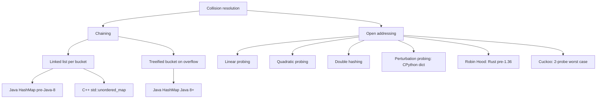

# Hash collisions and the load factor

Java's `HashMap` resizes when the table is 75% full. CPython's `dict` resizes at 67%. C++ `std::unordered_map` ships with a max load factor of 1.0. Go's pre-Swiss `runtime.map` ran at 81%, and Go 1.24's Swiss redesign moved that around again. Same data structure, four production teams, four different numbers, and not because anyone made a mistake. The number is a knob, the knob has a math derivation, and the four teams sit in different places on the curve because they picked different collision-resolution strategies. Understanding why a percent-and-a-half difference matters is the entire reason this chapter exists.

The stakes are not academic. In December 2011, two German researchers stood up at the 28th Chaos Communication Congress and showed that a single 1 MB POST request could pin a server's CPU at 100% for hours, with no botnet, no zero-day, no application bug. The exploit worked against PHP 5, Java, ASP.NET, V8, Python (pre-3.4), and Ruby, all of them at once. Crosby and Wallach had published the underlying class of attacks at USENIX Security in 2003;[^1] the 28C3 talk turned that paper into a working exploit against most of the web in one afternoon. What broke was not a buffer overflow. It was the average-case complexity of `Map.put` after a load factor that nobody was watching.

[Hash maps and hash sets](./03-hash-maps.md) taught the happy path: average O(1) lookup, average O(1) insert, geometric resize that amortizes to O(1) per operation. This chapter is the cost path. Two strategies share the contract, their numbers diverge for a reason, and one canonical algorithm (LC 128 Longest Consecutive Sequence) falls apart the instant the contract breaks.

## Two strategies, one contract

A hash table maps each key to a slot via `hash(key) mod capacity`. Two keys can land at the same slot. What happens next is the strategy.

**Chaining** keeps a per-slot linked list. On collision the new entry appends to the chain. Lookup hashes, picks the slot, walks the chain. CLRS Theorem 11.1 nails the cost: under simple uniform hashing, the expected length of any chain is exactly the load factor `α = n/m`, so search and insert are `Θ(1 + α)`.[^2] Pin `α` below a constant and the bound collapses to `Θ(1)`.

**Open addressing** keeps every entry inside the bucket array itself. On collision, the algorithm probes a sequence of alternative slots until it finds an empty one. Linear probing walks slot by slot. Quadratic probing steps by squares. Double hashing uses a second hash function. CPython's variant, perturbation probing, uses the recurrence `j = (5*j + 1 + perturb) mod 2^i` with `perturb` initialized from the high-order hash bits and right-shifted on each step.[^3] CLRS Theorem 11.6 nails this cost too: expected probes for unsuccessful search under uniform hashing is at most `1 / (1 - α)`. At `α = 0.5` that's 2 probes. At 0.75 it's 4. At 0.9 it's 10.[^2]



*The family tree of collision resolution. Each branch carries its own load-factor threshold, and the gap between those thresholds traces back to the cost formula for each strategy.*

The two formulas explain the four numbers. Chaining is `Θ(1 + α)`, a linear function with a soft slope. Pushing `α` from 0.75 to 1.0 raises expected chain length from 0.75 to 1.0, a 33% bump. Open addressing is `1 / (1 - α)`, a hyperbola that goes to infinity at `α = 1`. Pushing `α` from 0.5 to 0.67 raises expected probe count from 2 to roughly 3, a 50% bump; pushing from 0.67 to 0.9 takes you from 3 probes to 10. Open-addressing implementations *cannot* sit at chaining's thresholds; the math forbids it.

| Implementation | Strategy | Threshold | Source |
|---|---|---|---|
| Java OpenJDK `HashMap` | Chaining (treeified at length 8) | `DEFAULT_LOAD_FACTOR = 0.75` | `HashMap.java`[^4] |
| C++ libstdc++ `unordered_map` | Chaining (forward_list per bucket) | `max_load_factor = 1.0` (default) | C++17 §22.5.4[^5] |
| CPython `dict` | Open addressing (perturbation probing) | `USABLE_FRACTION = 2/3` | `Objects/dictobject.c`[^3] |
| Go `runtime.map` (pre-Swiss, Go ≤ 1.23) | Bucketed open addressing (8 slots/bucket + chained overflow) | `loadFactor = 6.5 / 8 ≈ 0.81` | `runtime/map.go`[^6] |

The chaining libraries (Java, C++) sit between 0.75 and 1.0. The open-addressing libraries (Python, Go) sit between 0.67 and 0.81. Nobody picks 0.95. Nobody picks 0.5. The Theorems pin the corridor.

A subtler point: the same Theorem says *why* chaining handles adversarial input more gracefully than open addressing. When all `n` keys collide on one chain, chaining's worst case is `O(n)` per operation and the table still functions. Open addressing's worst case under the same attack is `O(n)` per operation *plus* the table effectively stops working. Every probe tour ends up scanning a long run, primary clustering compounds the damage, and the only fix is a full rebuild. This is why Java picked chaining; this is why CPython invests heavily in randomized hashing instead.

## What it costs to grow

The threshold isn't checked on lookup. It's checked on insert. When `size > threshold * capacity`, the table doubles its capacity, allocates a new bucket array, and rehashes every entry from old to new. That single insert pays `Θ(n)`. The dynamic-table argument from [Dynamic array internals](./01-dynamic-array-internals.md) amortizes the cost across the n inserts that filled the table since the last resize, so the per-insert amortized cost stays `O(1)`. Geometric doubling is what makes this work; arithmetic growth would give amortized `Θ(n)` per insert and the whole hash-table abstraction unravels.[^2]

The widget below is panel-b of the dual-panel `w-02-hash-table` widget shared with [Hash maps and hash sets](./03-hash-maps.md). Five keys (5, 1, 9, 13, 17) are tuned so every one of them hashes to bucket 1 at capacity 4. The third insert sits the table exactly at threshold. The fourth crosses it and triggers the doubling.

> **Interactive widget:** [Hash table (chained insert + lookup)](../widgets/w-02-hash-table.yml) (panel `panel-b`) — rendered on the website; the YAML spec describes the keyframes.

*Static fallback: a 4-bucket chained table starts empty; inserts of 5, 1, 9, 13 all land in bucket 1, growing the chain to length 4 and pushing load factor to 1.0; the threshold-cross fires; capacity doubles to 8; rehashing redistributes the four keys (5 and 13 → bucket 5, 1 and 9 → bucket 1); the final insert of 17 lands in bucket 1 next to 1 and 9 with the table at load factor 0.625 and chain lengths well-bounded.*

The single moment to watch is step 4 → step 6. Before the resize, the chain at bucket 1 holds four keys; every lookup against any of them costs four comparisons. After the resize, the longest chain is two. The lookup work per operation has been *halved* by one O(n) burst of work. That trade is the core of the contract: pay an occasional `n` to keep the per-operation cost a small constant.

## When the contract breaks: LC 128 in two complexities

The chapter's signature problem is LC 128 Longest Consecutive Sequence. Given an unsorted array of integers, return the length of the longest run of consecutive integers. For `[100, 4, 200, 1, 3, 2]` the answer is 4 (the run 1, 2, 3, 4). The required complexity is `O(n)`.[^7]

The brute-force approach feels free and is a trap. *"For each x in nums, walk forward through x+1, x+2, ... while they're in the set; track the longest run."* Let that sit on a single run of length k and the inner walk runs k times for k different starting points. Total work: `O(k²)`, which generalizes to `O(n²)` on adversarial input. On LC 128's max input (`n = 10⁵`, single run), that's 10¹⁰ operations. It times out in every language.

```python
# Brute force: O(n^2) on a single long run
def longest_consecutive_brute(nums):
    s = set(nums)
    best = 0
    for x in nums:
        y = x
        while y in s:        # walks the entire run for every element of it
            y += 1
        best = max(best, y - x)
    return best
```

The fix is one line of branch logic: only start the inner walk when `x` is the *minimum* of its run.

```python
def longest_consecutive(nums):
    s = set(nums)
    best = 0
    for x in s:
        if (x - 1) not in s:        # skip every non-minimum
            y = x + 1
            while y in s:
                y += 1
            best = max(best, y - x)
    return best
```

**Solution** — Python ([Java](./04-hash-collisions/lc-128/sol.java) · [C++](./04-hash-collisions/lc-128/sol.cpp) · [Go](./04-hash-collisions/lc-128/sol.go))

```python
# LC 128. Longest Consecutive Sequence
# Build a hash set, then for each value, only start an inner walk when
# (x - 1) is absent — i.e., x is the minimum of its run. Each element is
# touched at most twice, giving O(n) total work assuming O(1) average
# set membership. O(n) time, O(n) space.
from typing import List


def longest_consecutive(nums: List[int]) -> int:
    s = set(nums)
    best = 0
    for x in s:
        if (x - 1) not in s:
            y = x + 1
            while y in s:
                y += 1
            best = max(best, y - x)
    return best
```

The correctness argument is the chapter's pedagogical payload. Each integer in the input gets touched at most twice across the algorithm: once when the outer loop visits it (and either skips because `x - 1` is present, or starts a walk), and once when the inner walk passes through it on behalf of its run minimum. Total work in set operations: 2n. Bound from above: `O(n)`.[^8]

Now reread that bound. Two `n`s and a constant. The constant is what flips on the load factor. Each set operation costs `O(1)` *only if `set.contains` is `O(1)` average*, which it is only if collisions are bounded by the threshold, which they are only if the hash function distributes adversarially-chosen keys uniformly. Stack the assumption violations and watch the bound shift:

| Scenario | `set.contains` cost | LC 128 total |
|---|---|---|
| Normal input, randomized hash | `O(1)` | `O(n)` |
| Chained set held at α = 5 (no resize ever fired) | `O(5)` | `O(5n)`, still linear, just slower |
| Adversarial keys, deterministic hash, chaining | `O(n)` per probe (one chain) | `O(n²)`, times out |
| Adversarial keys, deterministic hash, open addressing | `O(n)` per probe (full table scanned) | `O(n²)`, same wall, different reason |

The naive reading of "average O(1)" loses sight of how strong the assumption is. PEP 456's randomized hashing[^9] and Java 8's bucket treeification[^4] are the two mechanisms that keep the assumption true under attack; remove them and LC 128 is no longer an `O(n)` algorithm.

## How the 28C3 attack worked, and what fixed it

The attack vector in 2011 was small. Most web frameworks parse a POST body's form fields into a hash map keyed by the field name. Java's `String.hashCode` was a public, deterministic function; an attacker could precompute thousands of strings whose hash values collided on one bucket. A single POST with 100,000 such keys forced the framework to scan a chain of length 100,000 on every insert, totaling 10¹⁰ operations to parse one request. Frameworks limit the body size, not the chain length, so the attack slipped under the rate limiter.

Two fixes shipped, in the order the math demands.

**Randomize the hash function so an attacker can't precompute the collision set.** PEP 456 introduced SipHash-2-4 as Python 3.4's default for `str` and `bytes`, with a per-interpreter randomized seed.[^9] Two interpreter runs that hash the same string return different values; an attacker who lacks access to the running process's seed cannot precompute keys that all collide. Every other major language followed: Java 7 added a hash-randomization patch that Java 8 replaced with bucket treeification, Ruby randomized its `String#hash`, V8 reseeded `String::hashCode` per process, ASP.NET shipped MS11-100. The class of attack closed against unauthenticated remote attackers within about 18 months.

**Harden the chain itself so successful collision attacks degrade gracefully.** Java 8 added bucket treeification: when a chain reaches length 8 and the underlying table capacity is at least 64, the chain converts to a red-black tree. Lookups in that bucket fall to `O(log n)` instead of `O(n)`. The threshold of 8 is not arbitrary; the OpenJDK source comment computes it. Under simple uniform hashing with load factor 0.75, chain lengths follow a Poisson distribution with parameter 0.5, and the probability of any chain reaching length 8 is below 10⁻⁸.[^4] Treeification activates only on adversarial input or genuinely awful `hashCode` overrides; on normal data, the chain-only fast path stays.

C++ `std::unordered_map` has neither defense. The C++17 standard does not specify a hash function; libstdc++ uses identity hashing for `int` keys (`std::hash<int>(x) = x`).[^5] On Codeforces and other judges that publish their stdlib, an attacker constructs all-colliding keys in seconds. The competitive-programming workaround is well-known: wrap the map with a custom hash that XORs in `chrono::high_resolution_clock::now()` entropy. In production code with non-adversarial inputs, the default is fine; on contest judges, it's a foot-cannon.

## When chaining wins, when open addressing wins

| Axis | Chaining wins when | Open addressing wins when |
|---|---|---|
| Memory locality | (loses) | Cache lines hold several entries at once; one CPU read covers several probes |
| Memory overhead | (loses) | No per-entry pointer cost; the bucket array *is* the storage |
| Tolerance for high `α` | Above 0.85; chain length scales linearly | (loses) |
| Adversarial input | Treeification can rescue worst-case to `O(log n)` | Worst-case stays `O(n)` per op; primary clustering compounds it |
| Deletion semantics | Easy: unlink from chain | Hard: tombstones, periodic compaction; CPython gets it right, many implementations don't |
| Predictable per-op cost | (loses) | Lower variance under bounded `α`; Robin Hood specifically targets this |

The decision the four implementations made is legible from this table. Java needs to tolerate user-supplied `hashCode` overrides that may be terrible; chaining-with-treeification gives it a graceful degradation path. CPython controls the hash function (`object.__hash__`), can guarantee SipHash for built-ins, and has no need for a fallback structure; open addressing's cache locality is pure win. C++ inherits the C ABI and the user-supplied hash; chaining is the conservative default, and the implementer hands you the rope (`max_load_factor`, custom hash) if you need it. Go's pre-Swiss design picked bucketed open addressing, with eight key/value pairs per cache-line-friendly bucket, explicitly to optimize the common no-collision case while keeping the fallback path simple.

The lesson is not "open addressing is faster." It's that the strategy choice is downstream of two questions: *do I control the hash function?* and *what does my failure mode look like?* Two different answers, two different correct designs.

## A second example: LC 380's pointer-redirection trick

LC 380 Insert Delete GetRandom O(1) is the chapter's secondary problem and the cleanest demonstration of how the hash table's primitives compose with another structure to do something neither can do alone.[^10] The contract: support `insert`, `remove`, and `getRandom`, all in `O(1)`, on a set that disallows duplicates (LC 381 adds duplicates).

A hash set alone gets `insert` and `remove` but not `getRandom`: hash sets don't expose an array-style index. A dynamic array alone gets `getRandom` (pick a random index) but not `O(1) remove` (removing an arbitrary value scans the array). The combination wins. Maintain a `Map<Value, int>` whose value column is the value's index in a parallel `List<Value>`; `getRandom` picks `list[rand(0, list.size())]`; `remove(v)` swaps `list[map[v]]` with `list[list.size() - 1]`, pops the back, and updates the map for the swapped element.

```python
class RandomizedSet:
    def __init__(self):
        self.idx = {}      # value -> position in self.arr
        self.arr = []

    def insert(self, val):
        if val in self.idx:
            return False
        self.idx[val] = len(self.arr)
        self.arr.append(val)
        return True

    def remove(self, val):
        if val not in self.idx:
            return False
        i = self.idx[val]
        last = self.arr[-1]
        self.arr[i] = last           # overwrite the removed slot with the back
        self.idx[last] = i           # back-element's index now points here
        self.arr.pop()
        del self.idx[val]
        return True

    def getRandom(self):
        return self.arr[random.randrange(len(self.arr))]
```

The non-obvious move is `self.arr[i] = last; self.idx[last] = i` *before* the `arr.pop()` and the `del`. Reverse the order and the corner case `val == last` quietly self-destructs: the `arr.pop()` removes the slot you just wrote into, and `self.idx[last] = i` leaves a dangling index. The lesson generalizes. Whenever a hash table holds indices into a parallel array, every mutation that reorders the array must update the hash table for the *moved* element, not just the *changed* one.[^10]

## Where readers go wrong

> [!WARNING]
> **Starting LC 128 from every element instead of run minima.** Without `if (x - 1) not in s`, the inner walk runs for every element of every run, giving `O(k²)` per run-of-length-k. With the guard, each integer is touched at most twice. The guard is one line and the test for it is whether you can articulate the "touched at most twice" argument in an interview. If you can, you understand the algorithm. If you skip it, the brute-force version times out on a single long run.

> [!WARNING]
> **Java boxing in `HashSet<Integer>` hot loops.** Every `s.contains(y)` boxes `y` into a fresh `Integer` if `y` falls outside the integer cache (-128 to 127). Under tight loops on adversarial inputs, this can dominate wall-clock time. For performance-sensitive code, reach for Eclipse Collections `IntHashSet` or fastutil `IntOpenHashSet`. The chapter's reference uses `HashSet<Integer>` because it's the LC-canonical idiom; the swap is the production reflex worth knowing.

> [!WARNING]
> **Ignoring hash randomization on competitive-programming judges.** `std::unordered_map<int, int>` on Codeforces uses identity hashing; a tester who knows the stdlib can craft inputs whose keys all collide. The fix is a custom hash that XORs in `chrono::high_resolution_clock::now()` entropy.[^5] In production code with non-adversarial inputs, this is overkill. On contest judges, it's the difference between Accepted and Time Limit Exceeded.

> [!WARNING]
> **Resizing on every insert instead of on threshold crossing.** A naive "implement a hash table" that resizes whenever the new size hits a multiple of 16 (or any non-geometric trigger) gives amortized `Θ(n)` per insert, not `O(1)`. Geometric doubling, where capacity goes 4, 8, 16, 32, 64, is what makes the amortized bound work. The dynamic-table argument from [Dynamic array internals](./01-dynamic-array-internals.md) is what justifies the geometric requirement.[^2]

> [!WARNING]
> **Reordering the swap-and-pop on LC 380.** Doing `self.arr.pop()` before updating `self.idx[last] = i` quietly corrupts the index map when the removed value happens to be the last element. Always: write the back element into the freed slot, update the map for the back element, then pop. The corner case shows up on every input where `random.randrange` picks the end of the array.

## Problem ladder

### CORE (solve all three to claim chapter mastery)

- [LC 128: Longest Consecutive Sequence](https://leetcode.com/problems/longest-consecutive-sequence/) [Medium] • hash-set-only-start-runs-from-min ★
- [LC 36: Valid Sudoku](https://leetcode.com/problems/valid-sudoku/) [Medium] • hash-set-row-col-box-uniqueness
- [LC 380: Insert Delete GetRandom O(1)](https://leetcode.com/problems/insert-delete-getrandom-o1/) [Medium] • hash-map-plus-dynamic-array

### STRETCH (optional)

- [LC 705: Design HashSet](https://leetcode.com/problems/design-hashset/) [Easy] • design-hash-data-structure
- [LC 432: All O\`one Data Structure](https://leetcode.com/problems/all-oone-data-structure/) [Hard] • hash-map-plus-doubly-linked-list-buckets

LC 705 carries the chapter's only Easy CORE-eligible candidate; held in STRETCH because reimplementing the hash-table mechanics end-to-end is a worthwhile exercise but redundant with the chapter's algorithmic core. LC 432 is the Hard span anchor: it generalizes the LC 380 hash-plus-secondary-structure idea to "hash + ordered bucket of equal-frequency keys", and surfaces what a hash table genuinely cannot do alone, namely expose an ordered min/max in `O(1)`.

## Where this leads

The hash-map-plus-something-else pattern that LC 380 introduces is the through-line of [Part 13 — Designing data structures](../part-13-design-data-structures), where the question shifts from "use a hash map" to "compose a hash map with the structure that supplies what hashing can't." The highest-leverage *algorithmic* application of hash maps is [Prefix sums and the hash-map twist](../part-3-pointers-window-prefix/05-prefix-sum-hash.md), which uses today's `O(1)`-average set membership to find subarrays with arbitrary sums in `O(n)`, and which (like LC 128) depends on a load factor that nobody is checking and a hash function that nobody picked. When the workload genuinely needs ordered traversal, the alternatives are [Binary search trees](../part-6-trees-heaps/05-binary-search-trees.md) (sorted, `O(log n)` per op) and [Heaps](../part-6-trees-heaps/04-heaps-priority-queues.md) (priority access, partially ordered).

## References

[^1]: Scott A. [usenix.org/conference/12th-usenix-security-symposium/denial-service-algorithmic-complexity-attacks](https://www.usenix.org/conference/12th-usenix-security-symposium/denial-service-algorithmic-complexity-attacks).

[^2]: Cormen, Leiserson, Rivest, Stein, *Introduction to Algorithms*, 4th ed., MIT Press, 2022.

[^3]: CPython source, `Objects/dictobject.c`. [github.com/python/cpython](https://github.com/python/cpython/blob/main/Objects/dictobject.c).

[^4]: OpenJDK source, `src/java.base/share/classes/java/util/HashMap.java`. [github.com/openjdk/jdk](https://github.com/openjdk/jdk/blob/master/src/java.base/share/classes/java/util/HashMap.java).

[^5]: ISO/IEC 14882:2017, §22.5.4 "Class template `unordered_map`": `max_load_factor()` defaults to 1.0; iteration order is unspecified and may change after a rehash; the standard does not specify a hash function for any built-in type.

[^6]: Go runtime source, `src/runtime/map.go`. Go 1.24 ships a Swiss-table redesign; the legacy constants `loadFactorNum = 7`, `loadFactorDen = 8` (= 0.875) appear in the master tree marked "used by tests but not the actual map." [github.com/golang/go/blob/master/src/runtime/map.go](https://github.com/golang/go/blob/master/src/runtime/map.go).

[^7]: LeetCode 128, "Longest Consecutive Sequence." Constraints: `0 <= nums.length <= 10^5`, `-10^9 <= nums[i] <= 10^9`; required time complexity `O(n)`. [leetcode.com/problems/longest-consecutive-sequence](https://leetcode.com/problems/longest-consecutive-sequence/).

[^8]: doocs/leetcode editorial for LC 128, "Solution 2: Hash Table (Optimization)" section: the only-start-runs-from-min variant. [github.com/doocs/leetcode](https://github.com/doocs/leetcode/blob/main/solution/0100-0199/0128.Longest%20Consecutive%20Sequence/README_EN.md).

[^9]: Christian Heimes, "PEP 456: Secure and interchangeable hash algorithm," Python Enhancement Proposals, accepted 2014, implemented in Python 3.4. [peps.python.org/pep-0456](https://peps.python.org/pep-0456/).

[^10]: LeetCode 380, "Insert Delete GetRandom O(1)." Constraints: `-2^31 <= val <= 2^31 - 1`; at most 2 × 10⁵ calls; `getRandom` is only called when there is at least one element. [leetcode.com/problems/insert-delete-getrandom-o1](https://leetcode.com/problems/insert-delete-getrandom-o1/).
