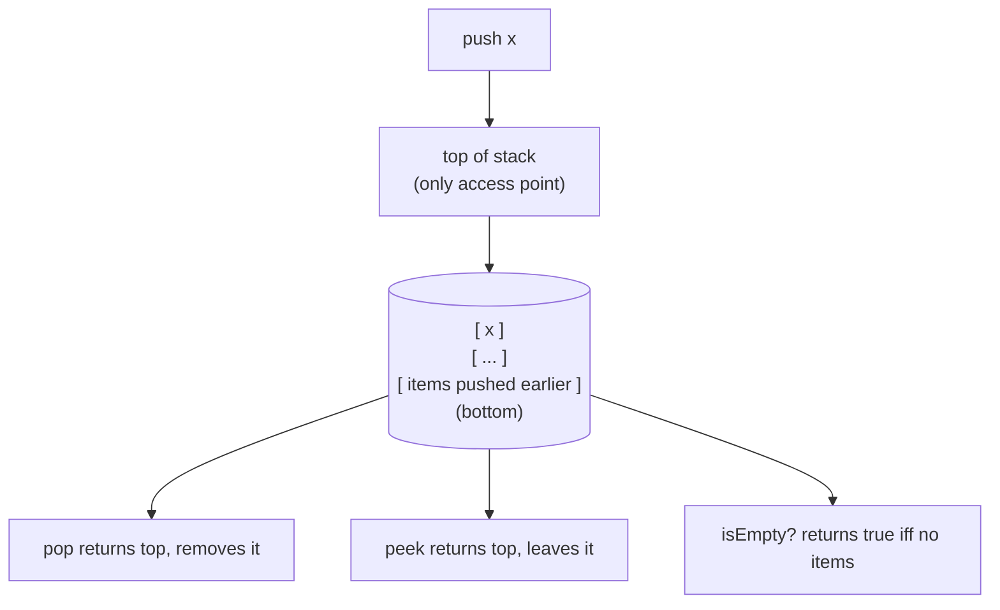
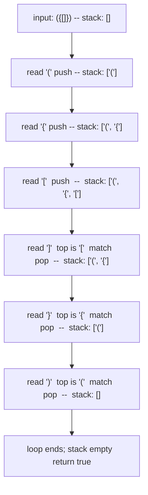

# Stacks and the call stack analogy

Open any debugger, hit a breakpoint, and look at the panel labeled *Call Stack*. It shows the chain of functions that got you there: `main` called `parseRequest`, which called `validateHeaders`, which called `checkContentType`, which is where you stopped. Each row is a frame the runtime pushed when a function was entered, and the runtime will pop those frames one by one as the calls return. That panel is not a metaphor. The stack data structure this chapter teaches is the same one your CPU manipulates every time you call a function, the same one that overflows when recursion goes too deep, the same one Knuth introduced in *The Art of Computer Programming* as the foundational motivation for studying linear data structures at all.

The application-level version is three operations and one rule. Push adds an item to the top. Pop removes the most recently pushed item. Peek reads the top without removing it. The rule is *last in, first out*: the only item you can see, modify, or remove is the one most recently added. When a recursive function call happens at runtime, the language's implementation is doing the same thing your code does when you write `stack.push(x)`. The frame that holds the local variables of the calling function, the return address, the saved registers: that's the item being pushed.[^1]

The signature problem here is LC 20 Valid Parentheses. Three more applications matter (augmented stacks for O(1) auxiliary queries, postfix expression evaluation, monotonic stacks for next-greater-element), and all three have outgrown a single chapter. The augmented case lives in [Min and max stacks](../part-4-stack-queue-patterns/02-min-max-stack.md). Postfix evaluation lives in [Expression evaluation](../part-4-stack-queue-patterns/03-expression-evaluation.md). The monotonic discipline, where the stack maintains a strict ordering invariant, lives in [Monotonic stack and deque](../part-4-stack-queue-patterns/01-monotonic-deque.md). This chapter is the primitive itself, plus the one application (deferred-match validation) that teaches the contract cleanly.

## What the LIFO contract actually is

A stack is an array (or a linked list) with two extra rules: writes only happen at one end, and reads only happen at that same end. Sedgewick & Wayne's algs4 §1.3 defines it as "a collection based on the last-in-first-out (LIFO) policy."[^3] The choice to surface only one end is what makes the structure a stack instead of a list. Your code cannot reach into the middle. Cannot index the third item from the bottom. Cannot iterate. The only items you can see are the ones at the top, in the reverse order they were pushed.



*Four operations, all O(1), all touching only the top. The narrowness of the interface is the point: the LIFO discipline is enforced by the type, not by convention.*

The narrow interface is what makes the structure useful. When prose says *"the runtime pushes a frame on call,"* the reader can predict precisely what happens on return: the most recently pushed frame is popped, and only that one. No frame in the middle vanishes; no frame at the bottom resurfaces; no out-of-order anything. That predictability is why the call stack works. It's also why deferred-match validators work, why postfix evaluators work, why iterative DFS works, why every undo-stack you've ever pressed Ctrl+Z against works. Same mechanic, six different applications.

Every implementation gives you the same four operations:

| Operation | What it does | Cost |
|---|---|---|
| `push(x)` | Adds x to the top | O(1) |
| `pop()` | Removes and returns the top | O(1) |
| `peek()` (or `top()`) | Returns the top without removing | O(1) |
| `isEmpty()` | Returns true iff no items | O(1) |

CLRS §10.1 gives the array implementation directly: a single `S.top` integer indexes the most recently inserted slot. Push writes at `S[S.top + 1]` and increments. Pop reads `S[S.top]` and decrements. No pointer chasing. No region-copy.[^2] The resizing-array variant doubles the underlying array on overflow; the dynamic-table argument from [Dynamic array internals](./01-dynamic-array-internals.md) amortizes the doubling cost across all the pushes since the last resize, and the per-push amortized cost stays O(1).[^2]

There are two common implementations and the choice between them rarely matters in practice:

- **Array-backed.** Push and pop are array writes at the tail. Cache-friendly. Resize cost is the doubling event, amortized O(1). What your standard library ships in 9 cases out of 10.
- **Linked-list-backed.** Push prepends a node; pop unlinks the head. Each operation is O(1) worst-case, no amortization. Pays a per-node pointer cost; cache-unfriendly because nodes scatter across the heap.

You reach for linked-list-backed only when the workload genuinely needs worst-case-per-operation bounds (real-time systems, hard latency floors). Otherwise, the array version wins on memory locality and simplicity.

## The call stack is the same data structure

When the runtime executes `f()` calling `g()`, it pushes a record onto a region of memory the operating system reserved for this purpose at process start. That record holds `f`'s local variables, the address inside `f` to resume at, and (depending on calling convention) saved register values. When `g` returns, the runtime pops that record and resumes `f` at the saved address. Knuth introduces this as the foundational motivation for the data structure in TAOCP §2.2.1.[^1] CLRS §10.1's exposition reaches the same connection in its opening paragraph: a stack's PUSH and POP are exactly the operations a procedure-call stack performs.[^2]

This is the part that makes recursion work. A recursive function does not have any special machinery. It pushes a frame onto the same call stack any other call would use, runs its body, and pops that frame when it returns. The reason `factorial(5)` produces `120` and not, say, the most recent intermediate value, is that each recursive call has its own frame holding its own copy of `n`, and the LIFO discipline of the call stack guarantees that frames are dismantled in the reverse order they were created. [Recursion's mental model](../part-0-foundations/02-recursion-mental-model.md) develops this connection from the recursion side; we're approaching it from the data-structure side, and arriving at the same point.

This is also why "stack overflow" happens. The OS reserves a fixed-size region for the call stack, typically 1 to 8 MB on Linux, configurable via `ulimit -s`. Every function call consumes some of that region. Deep recursion exhausts it. Python sets a soft limit (`sys.setrecursionlimit`, default 1000) below the OS hard limit so it can throw `RecursionError` cleanly before the OS kills the process. Java's `-Xss` flag controls the size; the default of 512KB to 1MB lets you nest perhaps 10,000 deep before `StackOverflowError`. When you read those error messages, the data structure is not a metaphor — it is literally the data structure.

The conversion from recursive to iterative code is the same observation in reverse. If your recursive solution exceeds the language's recursion limit, you allocate an explicit stack in your application code, push what would have been an activation record (current state + the place to come back to), and walk it manually. Iterative DFS over a tree is the canonical example: where the recursive version uses the call stack, the iterative version uses a `Deque<Node>` or `list[Node]`, and the algorithm is the same modulo who manages the stack. [Backtracking](../part-7-recursion-backtracking) and [graph traversal](../part-8-graphs) chapters both rely on this conversion without re-teaching it.

## LC 20: the deferred-match validator

The chapter's signature problem is LC 20 Valid Parentheses. Given a string of parentheses, brackets, and braces, return whether every closer matches the most recent unmatched opener. The empty string is valid. Examples: `"()"` true, `"()[]{}"` true, `"(]"` false, `"([)]"` false, `"{[]}"` true.

The pattern signal is the phrase "most recent unmatched". Whenever the input is a sequence of openers and closers, and each closer must pair with the most recently opened token of the matching type, the stack is the substrate. Sedgewick algs4 §1.3 Exercise 4 names balanced parentheses as the chapter's first non-trivial stack client.[^3] XML-style tags, function-call argument lists, JSON braces, and balanced text editors all have this shape.

The first instinct most readers reach for is a counter: increment on opener, decrement on closer, check it ends at zero. That works for one bracket type. It immediately fails for multiple types because a counter cannot distinguish `"([)]"` from `"()[]"`; both have equal opener and closer counts of each type. A counter loses ordering information. The stack keeps it.

The full algorithm is one piece of state: a stack of unmatched openers. For each character, push if it's an opener; for a closer, peek the top, check it matches the expected opener, and pop on success. Two failure modes get caught by two distinct emptiness checks:

```text
- closer with no opener →  empty-stack check at peek time fires
- opener with no closer →  terminal empty-stack check fails
```

```python
def is_valid(s: str) -> bool:
    pair = {")": "(", "]": "[", "}": "{"}
    stack = []
    for c in s:
        if c in "([{":
            stack.append(c)
        else:
            if not stack or stack[-1] != pair[c]:
                return False
            stack.pop()
    return not stack
```

**Solution** — Python ([Java](./05-stacks/lc-20/sol.java) · [C++](./05-stacks/lc-20/sol.cpp) · [Go](./05-stacks/lc-20/sol.go))

```python
# LC 20. Valid Parentheses
# Push openers; on a closer, peek the top opener and pop iff it matches.
# Keying the pair table by closer ('(' is the value, ')' is the key) keeps
# the lookup branch-free. The terminal stack-empty check rejects unmatched
# openers. O(n), O(n).
from typing import List


def is_valid(s: str) -> bool:
    pair = {")": "(", "]": "[", "}": "{"}
    stack: List[str] = []
    for c in s:
        if c in "([{":
            stack.append(c)
        else:
            if not stack or stack[-1] != pair[c]:
                return False
            stack.pop()
    return not stack
```

The `pair` table is keyed by *closer*, not opener. That looks stylistic; it's structural. When the loop reads `pair[c]` with `c` a closer, the lookup gives the expected opener directly. Key the table the other way (`{"(": ")", ...}`) and the loop has to discriminate openers from closers some other way, because both halves of the table would now be valid input characters. The reverse-keyed version is shorter, branch-cleaner, and harder to write a wrong-but-passing-LC-tests version of.

A trace on `"({[]})"`:



*Each opener pushes; each closer peeks against the expected match (looked up by closer) and pops on success. The terminal stack-empty check distinguishes "every opener was matched" from "loop ended with leftover openers" like `"((("`.*

Total work is O(n) time and O(n) space: each character contributes at most one push and at most one peek-and-pop, and the worst-case stack depth is n (the all-openers string `"((..("`).

## How the four languages spell "stack"

Every language has a canonical idiom and a wrong-but-tempting alternative. Three of the four involve the wrong default still being part of the standard library:

| Language | Right idiom | Wrong-but-tempting alternative |
|---|---|---|
| Python | `list` (`append`, `pop()`, `[-1]`) | `collections.deque` — works, but over-engineered |
| Java | `Deque<T> stack = new ArrayDeque<>()` | `java.util.Stack` — synchronized, slow |
| C++ | `std::stack<T>` | `std::vector<T>` — works, but doesn't enforce LIFO at the type level |
| Go | `[]T` slice with `append` and `s[:len(s)-1]` | `container/list` — pointer-heavy, slower |

The Java case is the one worth ink. `java.util.Stack` is a 1996 class that extends `Vector`, the original synchronized dynamic array. Every `push` and `pop` on it acquires the intrinsic lock on `this`, even in single-threaded code. Sedgewick & Wayne are unambiguous in algs4: "Java has a built in library called Stack, but you should avoid using it."[^3] Oracle's own JDK 21 Javadoc on `ArrayDeque` says: "This class is likely to be faster than `Stack` when used as a stack."[^4] *Effective Java* covers the broader principle, that legacy synchronized collections are not the right primitive for single-threaded code.[^5] Beginner Java tutorials still default to `new Stack<>()`. The standard code-review fix is `Deque<Integer> stack = new ArrayDeque<>()` and the `Deque` interface methods `push`, `pop`, `peek`.

C++ `std::stack<T>` is a container adapter on `std::deque<T>` by default. The interface is intentionally narrower than `std::deque` itself (no iteration, no random access), which is what enforces the LIFO contract at the type level. You could use a `std::vector<T>` and call `push_back` / `pop_back`, and the program would be correct, but the type would no longer encode the LIFO promise. Reviewers have to read the body to check the discipline. The adapter does that work for them.

Python's `list` is the canonical stack idiom, and it deserves the same defense Java's `ArrayDeque` got. `list.append` and `list.pop()` (with no argument) are both amortized O(1) at the tail. `list.pop(0)` and `list.insert(0, x)` are O(n) because they shift every remaining element by one slot. The Python docs put it directly: "list objects... are optimized for fast fixed-length operations and incur O(n) memory movement costs for `pop(0)` and `insert(0, v)` operations."[^6] A "stack" built from `list.pop(0)` is O(n²) total work over n operations. Reach for `collections.deque` only when you need O(1) operations at the *front* (BFS frontier, sliding-window deque); using it as a stack is over-engineering.

Go has no native stack type. The slice idiom is the right answer: `append(s, x)` to push, `s = s[:len(s)-1]` to pop, `s[len(s)-1]` to peek. Both push and pop are amortized O(1). Unlike the slice-as-queue pattern, where `s[1:]` advances the slice header without freeing the backing array's prefix, the slice-as-stack pattern is footgun-free: both operations work at the tail and shrink the underlying length.

## What it actually costs

Every implementation hits the same numbers:

| Operation | Time | Source |
|---|---|---|
| `push(x)` (resizing array, amortized) | O(1) | Sedgewick §1.3[^3] |
| `pop()` | O(1) | CLRS §10.1[^2] |
| `peek()` / `top()` | O(1) | CLRS §10.1[^2] |
| `isEmpty()` | O(1) | CLRS §10.1[^2] |
| LC 20 over n characters | O(n) time, O(n) space | Sedgewick §1.3 Ex 4[^3] |

The amortized bound on push is the same one [Dynamic array internals](./01-dynamic-array-internals.md) proves for `ArrayList.add`. The resizing-array stack doubles its backing array on overflow; CLRS §17.4 amortizes the cost of doubling across all pushes since the last resize, giving O(1) per push on average even though one in every `log n` pushes pays Θ(n) for the copy. Linked-list-backed stacks skip the amortization argument because they're worst-case O(1) at the cost of pointer overhead.

## Where readers go wrong

> [!WARNING]
> **Using `java.util.Stack` instead of `ArrayDeque`.** The program is correct but pays a synchronization tax on every operation, and any code review at a Tier-1 company will flag it. Sedgewick is unambiguous, Oracle is unambiguous, *Effective Java* is unambiguous: `Deque<T> stack = new ArrayDeque<>()` is the single right answer.[^3][^4]

> [!WARNING]
> **Keying the bracket-pair table by opener.** `{"(": ")", "[": "]", "{": "}"}` reads naturally ("when I see `(`, I expect `)`"), but the loop reads the table from the closer side. Opener-keyed tables force the loop to discriminate openers from closers another way. Closer-keyed (`{")": "(", ...}`) keeps the branch on `c in "([{"` for push and `else` for pop. Shorter, harder to write incorrectly.

> [!WARNING]
> **Using `list.pop(0)` or `list.insert(0, x)` in Python.** Both are O(n) because they shift every remaining element. A stack built from `pop(0)` is O(n²) total over n operations and times out on any LC problem with `n ≥ 10⁴`. The right Python idiom is `list.append` and `list.pop()` (no argument) at the *end* of the list. Reach for `collections.deque` only when you need O(1) operations at the *front*.[^6]

> [!WARNING]
> **Forgetting the call-stack analogy when recursion limits hit.** Python's default recursion limit is 1000; Java's is roughly 10,000 depending on `-Xss`. When the recursive solution exceeds the limit, the iterative conversion uses an explicit stack to do manually what the runtime was doing automatically. Push the equivalent of an activation record (current state + the place to come back to) and inspect the top frame each iteration. The recipe is universal across languages.

> [!WARNING]
> **Crash semantics on empty-stack peek.** `s.top()` on an empty `std::stack` is undefined behavior; `s.peek()` on an empty `ArrayDeque` returns null (and `pop()` throws `NoSuchElementException`); Python `s[-1]` raises `IndexError`. Always check `isEmpty` before peek, even when the LC harness guarantees well-formed input. Production code rarely shares LC's narrower contract.

## Problem ladder

### CORE (solve both to claim chapter mastery)

- [LC 20 — Valid Parentheses](https://leetcode.com/problems/valid-parentheses/) [Easy] • stack-balanced-paren-matching ★
- [LC 71 — Simplify Path](https://leetcode.com/problems/simplify-path/) [Medium] • stack-track-most-recent-context

### STRETCH (optional)

- [LC 224 — Basic Calculator](https://leetcode.com/problems/basic-calculator/) [Hard] • stack-iterative-recursion-simulation

LC 71 demonstrates that the stack is not exclusively a "validator or evaluator" pattern but more broadly a "track most-recent-context" primitive: split a Unix-style path on `/`, push directory names, on `..` pop, on `.` skip. LC 224 is the chapter's Hard span anchor and the bridge to Part 4: it parses an infix expression with parentheses and unary minus using a single stack of running sums and signs, iteratively simulating the recursion the runtime would otherwise perform.

The patterns deferred to Part 4 own the rest of the family. LC 155 Min Stack (the augmented-stack pattern with O(1) auxiliary queries) lives in [Min and max stacks](../part-4-stack-queue-patterns/02-min-max-stack.md). LC 150 Evaluate Reverse Polish Notation (the canonical postfix evaluator) lives in [Expression evaluation](../part-4-stack-queue-patterns/03-expression-evaluation.md). LC 232 and LC 225 (the implement-queue-with-stacks pair) live in [Queue from stacks](../part-4-stack-queue-patterns/04-queue-from-stacks.md). The next-greater-element family (LC 496, LC 503, LC 739, LC 84, LC 85, LC 239) uses the stack with a stricter monotonicity invariant and lives in [Monotonic stack and deque](../part-4-stack-queue-patterns/01-monotonic-deque.md). Same data structure, different disciplines.

## Where this leads

[Queues, deques, and circular buffers](./06-queues-deques.md) is the FIFO sibling: same one-end-or-the-other discipline, different end. The four stack-pattern chapters in [Part 4](../part-4-stack-queue-patterns/01-monotonic-deque.md) develop the augmented, evaluator, queue-from-stack, and monotonic disciplines that grew out of this primitive. And every chapter on [recursion and backtracking](../part-7-recursion-backtracking) and [graph traversal](../part-8-graphs) inherits the call-stack analogy from this one. When the runtime's stack runs out, you allocate your own.

## References

[^1]: Donald E. Knuth, *The Art of Computer Programming*, Volume 1: Fundamental Algorithms, 3rd ed., Addison-Wesley, 1997.

[^2]: Cormen, Leiserson, Rivest, Stein, *Introduction to Algorithms*, 4th ed., MIT Press, 2022.

[^3]: Robert Sedgewick and Kevin Wayne, *Algorithms*, 4th ed., Addison-Wesley, 2011. §1.3 "Bags, Queues, and Stacks." Online at [algs4.cs.princeton.edu/13stacks](https://algs4.cs.princeton.edu/13stacks/).

[^4]: Oracle Java SE 21 API documentation, `java.util.ArrayDeque<E>`. [docs.oracle.com/en/java/javase/21/docs/api/java.base/java/util/ArrayDeque.html](https://docs.oracle.com/en/java/javase/21/docs/api/java.base/java/util/ArrayDeque.html).

[^5]: Joshua Bloch, *Effective Java*, 3rd ed., Addison-Wesley, 2017.

[^6]: Python Software Foundation, `collections.deque` documentation: "Though list objects support similar operations, they are optimized for fast fixed-length operations and incur O(n) memory movement costs for `pop(0)` and `insert(0, v)` operations." [docs.python.org/3/library/collections.html#collections.deque](https://docs.python.org/3/library/collections.html#collections.deque).
