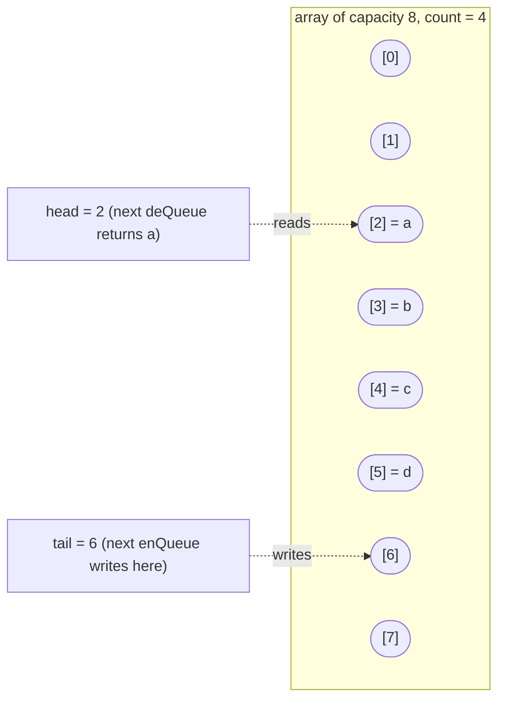
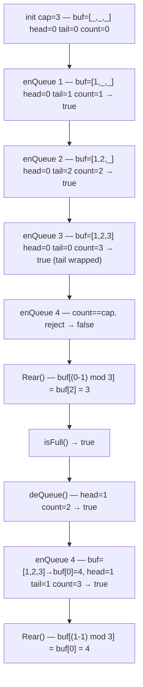

# Queues, deques, and circular buffers

Three abstractions that look the same at a distance and behave differently the moment a workload hits them. All three are an ordered sequence with cheap end access. The distinctions are which ends are cheap, whether the capacity is fixed, and what happens when an operation runs into the wall.

| Abstraction | Push at | Pop at | Capacity | Canonical use |
|---|---|---|---|---|
| Queue (FIFO) | rear | front | grows | scheduler runs, BFS frontier, [the call-stack analogy from stacks](./05-stacks.md) flipped |
| Deque | rear and front | rear and front | grows | sliding-window aggregates, two-pointer palindrome checks, work-stealing schedulers |
| Circular buffer | rear (until full) | front | fixed at construction | UART driver buffers, Linux kernel `kfifo`, `journald` log ring, LMAX Disruptor |

The row that breaks is the third one. A queue and a deque grow on demand; a circular buffer doesn't. That single decision is where the empty-versus-full ambiguity comes from, why the Linux kernel's `kfifo` ships with two different empty-versus-full disambiguation strategies depending on era, and why the canonical interview problem in the chapter (LC 641 Design Circular Deque) exercises modular arithmetic the other two abstractions never need.

This chapter teaches the three data structures themselves. The patterns that exercise them belong elsewhere: [Queue from stacks](../part-4-stack-queue-patterns/04-queue-from-stacks.md) develops the LC 232 / LC 225 amortization argument, [Monotonic stack and deque](../part-4-stack-queue-patterns/01-monotonic-deque.md) develops LC 239 sliding-window-maximum, and [BFS and DFS](../part-8-graphs/01-bfs.md) is where the queue-as-graph-frontier pattern earns its keep.

## The FIFO contract

A queue is two indices chasing each other through a buffer. Enqueue writes at the rear and advances the rear pointer. Dequeue reads at the front and advances the front pointer. CLRS §10.1 gives the textbook implementation: a circular array with `head` and `tail` indices that wrap modulo the buffer length.[^1] Both operations are O(1) with no amortization argument needed; the buffer grows the same way [Dynamic array internals](./01-dynamic-array-internals.md) describes when the elements run out of room.

The narrowness of the interface is the contract. Your code cannot reach into the middle of the queue. It can't peek at the third item. It can't iterate. The only items you observe are at the front, in the order they arrived. That predictability is what makes a queue the right substrate for arrival-ordered work: scheduler queues, BFS frontiers, level-order tree traversal, event simulation, request pipelines.

The Python case is the one most readers trip on. Python's `list` looks like a queue and isn't. `list.append(x)` is O(1), but `list.pop(0)` shifts every remaining element left by one slot and costs O(n). A "queue" built from `list.pop(0)` is O(n²) total work over n operations. Python's docs are explicit: "list objects... are optimized for fast fixed-length operations and incur O(n) memory movement costs for `pop(0)` and `insert(0, v)` operations."[^2] The fix is `collections.deque`, where both `appendleft` and `popleft` are O(1). Switching from `list` to `deque` is the single most common Python performance fix on BFS-shaped LC problems; on `n = 10^5` it converts a TLE into a 100ms accepted submission.

Each of the four canonical languages has a right answer and a wrong-but-tempting alternative.

| Language | Right idiom | Wrong-but-tempting | Why the alternative loses |
|---|---|---|---|
| Python | `collections.deque` | `list.pop(0)` | O(n) per pop |
| Java | `Deque<T> q = new ArrayDeque<>()` | `LinkedList`, `Stack` | per-node pointer overhead; legacy `Vector` synchronization |
| C++ | `std::queue<T>` (adapter) | `std::vector` with manual head | wastes space, doesn't enforce FIFO at the type level |
| Go | slice (short) or ring buffer (long) | slice (long) | `s[1:]` retains backing memory across millions of dequeues |

The Java case deserves the same defense [Stacks and the call stack analogy](./05-stacks.md) gave for `ArrayDeque` over `Stack`. Oracle's JDK 21 Javadoc on `ArrayDeque`: "This class is likely to be faster than Stack when used as a stack, and faster than LinkedList when used as a queue. Most ArrayDeque operations run in amortized constant time."[^3] `LinkedList` is technically a `Deque`, but doubly-linked-list nodes carry an object header plus two pointers, roughly 24 to 48 bytes per element on 64-bit JVMs. `ArrayDeque`'s circular array doesn't pay that. For both stack and queue use, the answer is the same class.

The Go case is where the slice idiom bends. For short-lived deques bounded by a small constant (sliding-window state where the deque length never exceeds k), `q = q[1:]` works fine. The slice header advances; the backing array's used prefix is small. For long-running queues (a BFS that walks 10⁷ nodes), the same idiom retains the entire prefix, because reslicing doesn't release memory the GC could collect. The fix for long-running queues is a ring buffer with explicit head and tail indices into a fixed-capacity slice. The chapter's canonical Go reference shows the ring-buffer shape; the slice idiom is correct for the Part 4 monotonic-deque chapter where the deque is bounded by k.

## The deque adds the back end

A deque is a queue that loosened a constraint: pushes and pops are cheap at *both* ends. CLRS Exercise 10.1-5 defines four primitives — `HEAD-ENQUEUE`, `TAIL-ENQUEUE`, `HEAD-DEQUEUE`, `TAIL-DEQUEUE` — each O(1) on a circular-array implementation.[^4] The name (pronounced "deck") comes from Knuth's TAOCP Volume 1 §2.2.1 as a contraction of "double-ended queue."[^5]

The reason the deque earns its own chapter is that several patterns that feel like sliding windows actually need both ends hot. The canonical case is the monotonic deque used by [Sliding window maximum and the monotonic deque](../part-4-stack-queue-patterns/01-monotonic-deque.md): store indices in a deque maintaining a strict monotone invariant, evict expired indices from the front, evict dominated indices from the back, achieve O(n) total. A queue can't do this; a stack can't do this; a deque is exactly what the algorithm needs.

The four-language implementation map for a deque is the same as for a queue, with one substitution: C++'s `std::queue` adapter becomes `std::deque<T>` directly. cppreference documents `std::deque` as O(1) random access plus O(1) push and pop at both ends, with the implementation typically being "a sequence of individually allocated fixed-size arrays."[^6] That chunked-array structure has one quirk worth flagging: a one-element `std::deque` allocates a full chunk, typically 8 times the object size on 64-bit libstdc++ or 4096 bytes on 64-bit libc++. For tight-memory systems handling many short-lived deques, the per-instance baseline matters; for everything else, it doesn't.

## The circular buffer fixes the capacity

A queue and a deque grow on demand. A circular buffer doesn't: the capacity is set at construction, and writes either reject or overwrite the oldest element. The implementation is the same circular array CLRS describes, minus the resize. Two indices, both modulo a fixed capacity, both advancing on every operation.



*The buffer is a fixed-length array; the producer advances `tail` modulo capacity and the consumer advances `head` modulo capacity. Empty and full both reduce to `head == tail`, which is why the disambiguation strategy matters.*

The interview problem the chapter centers on is LC 641 Design Circular Deque: insert and delete at both front and back, fixed capacity, every operation O(1). The pure modular indexing — `head` and `tail` advance modulo `cap` — is correct for *positioning* but ambiguous for *state*. When `head == tail`, the buffer is either empty (just constructed, nothing in it) or full (every slot written, both indices have lapped). Two canonical fixes:

1. **Keep an explicit `count` field.** Empty is `count == 0`; full is `count == cap`. One extra integer of state, self-documenting, no edge cases.
2. **Reserve one slot.** Empty is `head == tail`; full is `(tail + 1) % cap == head`. Costs one usable slot per buffer, but means the indices alone tell the truth.

Linux kernel ring buffers (`kfifo`) historically chose the reserved-slot approach because power-of-two capacities allow `& (cap - 1)` instead of `% cap`, a real speedup on hot paths in the early-2000s era. Modern `kfifo` uses unsigned arithmetic with implicit wrap-around and dodges the disambiguation entirely. That third strategy is worth knowing exists, though it's specific to fixed-width integer wrap-around semantics that LC harnesses don't replicate.

LC 622 Design Circular Queue is the one-ended version; LC 641 adds the symmetric front operations. The reference implementation uses the explicit-count approach because clarity beats microoptimization on a teaching example.

```python
class MyCircularQueue:
    def __init__(self, k: int):
        self._buf = [0] * k
        self._cap = k
        self._head = 0
        self._tail = 0
        self._count = 0

    def enQueue(self, value: int) -> bool:
        if self._count == self._cap:
            return False
        self._buf[self._tail] = value
        self._tail = (self._tail + 1) % self._cap
        self._count += 1
        return True

    def deQueue(self) -> bool:
        if self._count == 0:
            return False
        self._head = (self._head + 1) % self._cap
        self._count -= 1
        return True

    def Front(self) -> int:
        return -1 if self._count == 0 else self._buf[self._head]

    def Rear(self) -> int:
        return -1 if self._count == 0 else self._buf[(self._tail - 1) % self._cap]

    def isEmpty(self) -> bool:
        return self._count == 0

    def isFull(self) -> bool:
        return self._count == self._cap
```

**Solution** — Python ([Java](./06-queues-deques/lc-622/sol.java) · [C++](./06-queues-deques/lc-622/sol.cpp) · [Go](./06-queues-deques/lc-622/sol.go))

```python
# LC 622. Design Circular Queue
# Fixed-capacity ring buffer. head and tail advance modulo cap; an explicit
# count distinguishes empty (count == 0) from full (count == cap), which
# pure modular indexing alone cannot. All operations O(1), O(k) space.
class MyCircularQueue:
    def __init__(self, k: int):
        self._buf = [0] * k
        self._cap = k
        self._head = 0
        self._tail = 0
        self._count = 0

    def enQueue(self, value: int) -> bool:
        if self._count == self._cap:
            return False
        self._buf[self._tail] = value
        self._tail = (self._tail + 1) % self._cap
        self._count += 1
        return True

    def deQueue(self) -> bool:
        if self._count == 0:
            return False
        self._head = (self._head + 1) % self._cap
        self._count -= 1
        return True

    def Front(self) -> int:
        if self._count == 0:
            return -1
        return self._buf[self._head]

    def Rear(self) -> int:
        if self._count == 0:
            return -1
        # Python's % is non-negative for positive cap, so (tail - 1) % cap
        # wraps correctly when tail == 0.
        return self._buf[(self._tail - 1) % self._cap]

    def isEmpty(self) -> bool:
        return self._count == 0

    def isFull(self) -> bool:
        return self._count == self._cap
```

A trace on `cap = 3`, then `enQueue(1)`, `enQueue(2)`, `enQueue(3)`, `enQueue(4)`, `Rear()`, `isFull()`, `deQueue()`, `enQueue(4)`, `Rear()`:



*The third enQueue lands at `buf[2]` and wraps `tail` to 0; the fourth is rejected; after one deQueue advances `head` to 1, the wrapped slot accepts the next value at `buf[0]`. Empty and full both report `head == tail` here — the `count` field is what disambiguates.*

The `Rear()` call has one bracket worth flagging. `(self._tail - 1) % self._cap` works in Python because Python's `%` returns a non-negative result for negative dividends; in Java, C++, and Go it doesn't. The Java and C++ references write `(tail - 1 + cap) % cap` for that reason. Same algorithm, different defensive arithmetic per language. That's the kind of inline bug that costs you ten minutes in an interview if you don't see it in advance.

## Why the patterns chapters teach the rest

Three patterns extend the data structures into the algorithm chapters that own them.

The **two-stack queue** (LC 232) is the introduction to amortized analysis through interview-shaped code. Push to an inbox stack; pop drains the inbox to an outbox only when the outbox is empty, then pops from the outbox. Each element transits inbox-to-outbox at most once across its lifetime, so amortized cost per operation is O(1) despite the worst-case O(n) drain. CLRS Chapter 17 §17.2's accounting method gives the formal proof: assign each element a credit of 2 on enqueue, paying for one push and one shift. The full development is in [Queue from stacks](../part-4-stack-queue-patterns/04-queue-from-stacks.md).

The **monotonic deque** (LC 239 Sliding Window Maximum) stores indices in a deque maintaining a strict monotone invariant. For each new element, evict expired indices from the front (those outside the window) and evict dominated indices from the back (those whose value is strictly less than the new element's). Each index is appended once and popped once: total deque operations 2n, total work O(n), beating both the brute-force O(n × k) and the heap-based O(n log n). Worked end-to-end in [Monotonic stack and deque](../part-4-stack-queue-patterns/01-monotonic-deque.md).

The **BFS frontier queue** (LC 200, 994, 542) is the application that motivates most queue use in interviews. Dequeue the oldest unvisited node; enqueue its unvisited neighbors; repeat. Level-order traversal of a tree is the same shape with the input being a tree's children, not a graph's neighbors. Worked in [BFS and DFS](../part-8-graphs/01-bfs.md). The Go memory-retention warning above is load-bearing here: a long-running BFS using `q = q[1:]` retains every visited node's slot in the backing array, and the GC can't reclaim any of it until `q` itself is replaced.

## What it actually costs

| Operation | Time | Source |
|---|---|---|
| Queue circular-array enqueue / dequeue | O(1) | CLRS §10.1[^1] |
| Deque circular-array four primitives | O(1) | CLRS Ex 10.1-5[^4] |
| Circular buffer enQueue / deQueue (LC 622, 641) | O(1) | leetcode.ca[^7] |
| Python `list.pop(0)` (the wrong tool) | O(n) | Python docs[^2] |
| Python `collections.deque` `appendleft` / `popleft` | O(1) | Python docs[^2] |
| Java `ArrayDeque` push / pop / peek | O(1) amortized | Oracle JDK 21[^3] |
| C++ `std::deque` random access + end ops | O(1) | cppreference[^6] |

The amortized bound on growable variants (queue, deque) inherits from [Dynamic array internals](./01-dynamic-array-internals.md): the underlying buffer doubles on overflow, and the cost amortizes to O(1) per operation. Circular buffers skip the amortization argument entirely; the capacity is fixed, the cost is genuinely O(1) per operation, no "average case" caveat needed.

## Where readers go wrong

> [!WARNING]
> **Using `list.pop(0)` or `list.insert(0, x)` in Python.** Both are O(n) per call; an n-operation queue built from `list` is O(n²). The fix is `collections.deque` everywhere a FIFO is needed. The Python docs are explicit; the speedup on BFS-shaped LC problems with `n = 10^5` is consistently order-of-magnitude.[^2]

> [!WARNING]
> **Using `LinkedList` as a `Deque` in Java.** It works, but it pays a 24-to-48-byte node overhead per element and trashes cache locality. `Deque<T> q = new ArrayDeque<>()` is the right answer for both stack and queue use, per Oracle's own documentation.[^3]

> [!WARNING]
> **Empty-versus-full ambiguity in a circular buffer.** Pure modular indexing collapses both states to `head == tail`. Either keep an explicit `count` field, or reserve one slot so full means `(tail + 1) % cap == head`. Pure modular indexing without disambiguation silently overwrites or returns garbage. That's the canonical bug on LC 622 and LC 641.

> [!WARNING]
> **Negative-modulo in `Rear()` outside Python.** `(tail - 1) % cap` returns a non-negative result in Python; in Java, C++, and Go it can return a negative index. Write `(tail - 1 + cap) % cap` instead. Same expression, different language semantics; same one-line bug.

> [!WARNING]
> **Memory-retention footgun on Go slice-as-queue.** `q = q[1:]` doesn't release the prefix; the GC can't collect those elements until `q` itself is replaced. For short-lived deques bounded by small `k`, the slice idiom is fine. For long-running queues (BFS over millions of nodes), use a ring buffer with explicit indices into a fixed-capacity backing slice.

## Problem ladder

This chapter's CORE picks center on the data structures themselves. The pattern problems that historically lived here (LC 232, 225, 239) moved to Part 4 chapters where the algorithm is the lesson; LC 622, the foundational dynamic-array design problem, is owned by [Dynamic array internals](./01-dynamic-array-internals.md) where capacity-versus-length is the central abstraction. This chapter has no Hard CORE because the canonical Hard pattern problems for queues and deques (LC 239, LC 862) are owned by the algorithm chapters that teach them.

### CORE (solve both to claim chapter mastery)

- [LC 933 — Number of Recent Calls](https://leetcode.com/problems/number-of-recent-calls/) [Easy] • queue-on-stream
- [LC 641 — Design Circular Deque](https://leetcode.com/problems/design-circular-deque/) [Medium] • ring-buffer-deque ★

### STRETCH (optional)

- [LC 622 — Design Circular Queue](https://leetcode.com/problems/design-circular-queue/) [Medium] • ring-buffer
- [LC 1670 — Design Front Middle Back Queue](https://leetcode.com/problems/design-front-middle-back-queue/) [Medium] • two-deque

LC 933 demonstrates the queue's role as a sliding window over a stream: maintain a queue of recent timestamps, evict from the front when the oldest falls out of the 3000ms window, return the queue's length. It's the simplest possible application of the FIFO contract on a streaming input. LC 641 is the chapter's signature problem and the reason the four-primitive deque exists: the wrap-around arithmetic must be symmetric at both ends, and `head` decrement wraps to `cap - 1`, which is the canonical interview-style off-by-one. LC 622 is the one-ended sibling and lives here as STRETCH because [Dynamic array internals](./01-dynamic-array-internals.md) teaches it as the capacity-versus-length design exercise; readers who reach this chapter for ring-buffer mechanics specifically benefit from a second pass on LC 622 with the deque framing in hand. LC 1670 extends the contract to three insertion points (front, middle, back) and is solved cleanly by two deques whose lengths differ by at most one, a small problem with a surprisingly elegant invariant.

## Where this leads

[Queue from stacks](../part-4-stack-queue-patterns/04-queue-from-stacks.md) develops LC 232 and LC 225 with the amortization argument worked end-to-end. [Monotonic stack and deque](../part-4-stack-queue-patterns/01-monotonic-deque.md) is where LC 239 lives — the sliding-window maximum with the deque internals taught here. [BFS and DFS](../part-8-graphs/01-bfs.md) is where the queue-as-graph-frontier pattern cashes in for the LC 200, 994, 542 family. [Heaps](../part-6-trees-heaps/04-heaps-priority-queues.md) is the priority-queue alternative — same FIFO contract bent so that the dequeue order is by priority rather than by arrival.

## References

[^1]: Cormen, Leiserson, Rivest, Stein, *Introduction to Algorithms*, 4th ed., MIT Press, 2022.

[^2]: Python Software Foundation, `collections.deque` documentation. <https://docs.python.org/3/library/collections.html#collections.deque>

[^3]: Oracle Java SE 21 API documentation, `java.util.ArrayDeque<E>`. [docs.oracle.com/en/java/javase/21/docs/api/java.base/java/util/ArrayDeque.html](https://docs.oracle.com/en/java/javase/21/docs/api/java.base/java/util/ArrayDeque.html).

[^4]: Cormen et al., *Introduction to Algorithms*, 4th ed., Chapter 10, Exercise 10.1-5: deque (double-ended queue) with four O(1)-time procedures for inserting and deleting elements at both ends of an arra

[^5]: Donald E. Knuth, *The Art of Computer Programming*, Volume 1: Fundamental Algorithms, 3rd ed., Addison-Wesley, 1997.

[^6]: cppreference.com, `std::deque`. [en.cppreference.com/w/cpp/container/deque](https://en.cppreference.com/w/cpp/container/deque).

[^7]: leetcode.ca editorial for LC 622 Design Circular Queue. [leetcode.ca/2017-08-13-622-Design-Circular-Queue](https://leetcode.ca/2017-08-13-622-Design-Circular-Queue/).
