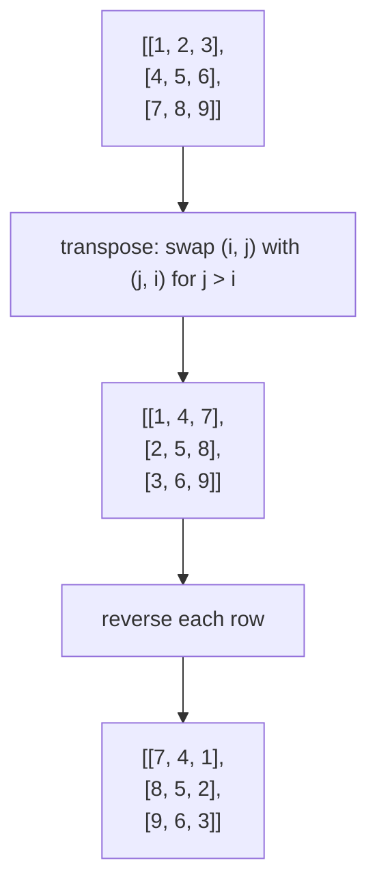
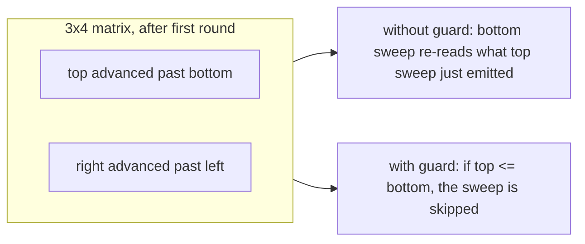

# Matrix manipulation

A matrix is a 2D coordinate system, and three signature interview problems test the same skill: rewriting every cell as a function of cells at *transformed* coordinates, in place, with no auxiliary 2D buffer. Rotate 90 degrees clockwise sends `(i, j)` to `(j, n - 1 - i)`. Transpose sends `(i, j)` to `(j, i)`. Spiral traversal walks the cells in the order their coordinates trace a contracting rectangle. Conditional zeroing rewrites cells based on coordinate predicates over their row and column.

The trigger phrase in the prompt is **"in-place"** or **"do not allocate another 2D matrix."** [^1] LC 48 spells that out word for word; LC 73's follow-up explicitly asks for O(1) extra space; LC 54 returns a flat list and expects the input matrix to remain untouched. All three reduce to coordinate arithmetic. None of them are graph problems; the cells are not nodes, the adjacency is not an edge set. When the matrix becomes a graph or a state space, you reach for the algorithms in [BFS and DFS](../part-8-graphs/01-bfs.md) or [Grid DP](../part-9-dynamic-programming/12-grid-dp.md). Here the matrix is a transformable object, and the chapter is the three reflexes for transforming it.

| Operation | Coordinate map | Constraint | Reflex |
|---|---|---|---|
| Rotate 90 deg CW | `(i, j) -> (j, n - 1 - i)` | square `n x n`, in place | transpose then reverse rows, or layered 4-cycle |
| Spiral traversal | `(top, bottom, left, right)` shrink | `m x n`, output is the path | four monotone boundaries |
| Conditional row/column zero | per-row bit + per-col bit | `m x n`, O(1) extra space | reuse row 0 and col 0 as marker arrays |

The shapes look unrelated. They share a substrate. Each one extracts the rule that maps input coordinates to output coordinates, then walks the input under that rule using only the matrix itself plus a constant amount of bookkeeping.

## LC 48: rotate via transpose then reverse

Rotate an `n x n` matrix 90 degrees clockwise, in place, with O(1) extra space.[^1] The naive answer allocates a second matrix, writes `dst[j][n - 1 - i] = src[i][j]`, and copies back. That's correct, that's clean, and that's the wrong answer when the prompt says no second matrix.

The clever answer is two textbook one-line operations:

```text
1. Transpose along the main diagonal: for i in 0..n, for j in i+1..n, swap(m[i][j], m[j][i])
2. Reverse each row.
```

The proof is one line of coordinate algebra. After the transpose, position `(i, j)` of the new matrix holds the original value at `(j, i)`. After reversing row `i`, that same position `(i, j)` holds the original value at `(j, n - 1 - i)`, which is exactly the 90-degree clockwise rotation.[^2] Column `j` of the input becomes row `n - 1 - j` of the output, read top to bottom.



*Transpose-then-reverse on the canonical 3x3 example. The transpose mirrors across the main diagonal; the row-reverse mirrors across the vertical axis. Their composition is the 90-degree clockwise rotation.*

```python
def rotate(matrix):
    n = len(matrix)
    for i in range(n):
        for j in range(i + 1, n):
            matrix[i][j], matrix[j][i] = matrix[j][i], matrix[i][j]
    for row in matrix:
        row.reverse()
```

**Solution** — Python ([Java](./07-matrix-manipulation/lc-48/sol.java) · [C++](./07-matrix-manipulation/lc-48/sol.cpp) · [Go](./07-matrix-manipulation/lc-48/sol.go))

```python
# LC 48. Rotate Image
# Rotate an n x n matrix 90 degrees clockwise in place via two passes:
# transpose along the main diagonal, then reverse each row. The transpose
# inner loop must start at j = i + 1 (not j = 0) or each off-diagonal
# pair gets swapped twice, returning the matrix to its original state.
# O(n^2) time, O(1) space.
from typing import List


def rotate(matrix: List[List[int]]) -> None:
    n = len(matrix)
    for i in range(n):
        for j in range(i + 1, n):
            matrix[i][j], matrix[j][i] = matrix[j][i], matrix[i][j]
    for row in matrix:
        row.reverse()
```

The transpose loop must start at `j = i + 1`. Starting at `j = 0` swaps each off-diagonal pair twice (once when the outer index is `i`, once when the outer index is `j`) and returns the matrix to its original state.[^2] Starting at `j = i` swaps the diagonal cell with itself, which is a harmless no-op and also fine. Starting at `j = 0` is the canonical bug and the most-flagged mistake on LC 48's editorial pitfall list.

The widget animates a different decomposition because animation has a different goal than memorization. Process the matrix in concentric rings (outer first, then inner). Within each ring, a 4-cell cycle relates corners by 4-fold rotational symmetry: `(i, j) -> (j, n - 1 - i) -> (n - 1 - i, n - 1 - j) -> (n - 1 - j, i)`. Save one corner in a temporary, rotate the other three around the cycle, write the saved value into the last slot. For an `n x n` matrix, the outer ring has `n - 1` cycles, the next ring `n - 3`, and so on inward.

> **Interactive widget:** [Matrix rotation (layered 4-cycle)](../widgets/w-03-matrix-rotation.yml) — rendered on the website; the YAML spec describes the keyframes.

*Static fallback: a 4x4 matrix with the four cells of one corner cycle highlighted; the next keyframe shows them after one rotation step, and the matrix one ring closer to its final orientation.*

Both decompositions run in O(n^2) time and O(1) extra space. Transpose-then-reverse is easier to memorize and easier to prove. The layered 4-cycle is easier to *see*, because it makes the in-place permutation visible as concentric rings rather than two unrelated full-matrix passes. Either gets the right answer; the widget shows you why the answer works.

## LC 54: spiral via four shrinking boundaries

Walk an `m x n` matrix in clockwise spiral order: top row left to right, right column top to bottom, bottom row right to left, left column bottom to top, then repeat on the inner sub-matrix until exhausted.[^3]

The state is four monotone indices: `top`, `bottom`, `left`, `right`. Each directional sweep walks one boundary, then advances that boundary inward (`top++`, `right--`, `bottom--`, `left++`). Termination is monotone in `(bottom - top) + (right - left)`; the loop ends when one of those distances goes negative.

```python
def spiral_order(matrix):
    if not matrix or not matrix[0]:
        return []
    out = []
    top, bottom = 0, len(matrix) - 1
    left, right = 0, len(matrix[0]) - 1
    while top <= bottom and left <= right:
        for j in range(left, right + 1):
            out.append(matrix[top][j])
        top += 1
        for i in range(top, bottom + 1):
            out.append(matrix[i][right])
        right -= 1
        if top <= bottom:
            for j in range(right, left - 1, -1):
                out.append(matrix[bottom][j])
            bottom -= 1
        if left <= right:
            for i in range(bottom, top - 1, -1):
                out.append(matrix[i][left])
            left += 1
    return out
```

**Solution** — Python ([Java](./07-matrix-manipulation/lc-54/sol.java) · [C++](./07-matrix-manipulation/lc-54/sol.cpp) · [Go](./07-matrix-manipulation/lc-54/sol.go))

```python
# LC 54. Spiral Matrix
# Walk an m x n matrix in clockwise spiral order using four shrinking
# boundaries. The two `if top <= bottom` and `if left <= right` guards
# inside the loop are mandatory: without them, odd-shaped rectangles
# re-emit the bottom row or right column. Square matrices accidentally
# work without the guards, hiding the bug. O(m*n), O(1) extra.
from typing import List


def spiral_order(matrix: List[List[int]]) -> List[int]:
    if not matrix or not matrix[0]:
        return []
    out: List[int] = []
    top, bottom = 0, len(matrix) - 1
    left, right = 0, len(matrix[0]) - 1
    while top <= bottom and left <= right:
        for j in range(left, right + 1):
            out.append(matrix[top][j])
        top += 1
        for i in range(top, bottom + 1):
            out.append(matrix[i][right])
        right -= 1
        if top <= bottom:
            for j in range(right, left - 1, -1):
                out.append(matrix[bottom][j])
            bottom -= 1
        if left <= right:
            for i in range(bottom, top - 1, -1):
                out.append(matrix[i][left])
            left += 1
    return out
```

The two `if top <= bottom` and `if left <= right` guards inside the loop are the load-bearing line of the algorithm.[^3] Without them, an odd-height matrix re-emits the bottom row as the top row (because after the first two sweeps, `top` has advanced past `bottom` while `bottom` still indexes the same single remaining row), and an odd-width matrix re-emits the right column as the left column. The square case `m == n` accidentally works without the guards, which is precisely why this bug ships in interviews. Candidates test on a 3x3, get the right answer, and miss the failure on a 1x4 or a 3x4.



*The boundary guards prevent re-emission once a boundary has crossed its opposite. The square case never triggers a crossing, so the bug only surfaces on rectangular inputs.*

LC 59 Spiral Matrix II uses the same four-boundary structure but writes the values `1, 2, ..., n^2` into the cells instead of reading them. Same control flow, dual operation. Once you have one, you have both.

## LC 73: reuse row 0 and column 0 as marker arrays

If any cell of an `m x n` matrix is zero, set its entire row and column to zero. In place, O(1) extra space.[^4]

The natural solutions sit on a complexity Pareto frontier:

| Strategy | Time | Extra space |
|---|---|---|
| Copy matrix, write zeros into the copy | O(mn) | O(mn) |
| Two HashSets of dirty rows and columns | O(mn) | O(m + n) |
| First-row-and-col markers + 2 booleans | O(mn) | O(1) |

The third row is what LC's follow-up asks for. There are `m + n - 1` distinct (row, column) marker bits to maintain (one per row, one per column, minus the row-0/col-0 overlap), and the matrix already has `m + n - 1` cells in row 0 and column 0 to spare. The trick is to use those cells as the marker storage. When `matrix[i][j] == 0` for `i, j > 0`, set `matrix[i][0] = 0` (mark row `i` dirty) and `matrix[0][j] = 0` (mark column `j` dirty). Then walk the inner region a second time and zero any cell whose row marker or column marker is set.

The catch is at cell `(0, 0)`. It's the unique overlap of the row-0 and column-0 marker arrays. A write that says "row 0 has an inner zero somewhere" lands at `(0, 0)`. A write that says "column 0 has an inner zero somewhere" also lands at `(0, 0)`. Once the marker pass runs, you can't tell those writes apart, and you can't tell either of them apart from the original-zero-at-(0, 0) state. Two boolean flags taken **before** the marker pass capture exactly the missing bit.[^4]

```python
def set_zeroes(matrix):
    if not matrix or not matrix[0]:
        return
    m, n = len(matrix), len(matrix[0])
    first_row_has_zero = any(matrix[0][j] == 0 for j in range(n))
    first_col_has_zero = any(matrix[i][0] == 0 for i in range(m))
    for i in range(1, m):
        for j in range(1, n):
            if matrix[i][j] == 0:
                matrix[i][0] = 0
                matrix[0][j] = 0
    for i in range(1, m):
        for j in range(1, n):
            if matrix[i][0] == 0 or matrix[0][j] == 0:
                matrix[i][j] = 0
    if first_row_has_zero:
        for j in range(n):
            matrix[0][j] = 0
    if first_col_has_zero:
        for i in range(m):
            matrix[i][0] = 0
```

**Solution** — Python ([Java](./07-matrix-manipulation/lc-73/sol.java) · [C++](./07-matrix-manipulation/lc-73/sol.cpp) · [Go](./07-matrix-manipulation/lc-73/sol.go))

```python
# LC 73. Set Matrix Zeroes
# In place, O(1) extra space. Use row 0 and column 0 as the marker arrays;
# two booleans capture whether row 0 or column 0 originally contained a
# zero (the marker pass overwrites cell (0, 0) and loses that information).
# Read the flags BEFORE the marker pass — that ordering is the bug fix.
# O(m*n) time, O(1) extra space.
from typing import List


def set_zeroes(matrix: List[List[int]]) -> None:
    if not matrix or not matrix[0]:
        return
    m, n = len(matrix), len(matrix[0])
    first_row_has_zero = any(matrix[0][j] == 0 for j in range(n))
    first_col_has_zero = any(matrix[i][0] == 0 for i in range(m))
    # Pass 1: mark dirty rows and columns using the first row/col as flags.
    for i in range(1, m):
        for j in range(1, n):
            if matrix[i][j] == 0:
                matrix[i][0] = 0
                matrix[0][j] = 0
    # Pass 2: apply marks to the inner region.
    for i in range(1, m):
        for j in range(1, n):
            if matrix[i][0] == 0 or matrix[0][j] == 0:
                matrix[i][j] = 0
    # Pass 3: zero row 0 and column 0 themselves if they were originally dirty.
    if first_row_has_zero:
        for j in range(n):
            matrix[0][j] = 0
    if first_col_has_zero:
        for i in range(m):
            matrix[i][0] = 0
```

Read `first_row_has_zero` and `first_col_has_zero` once at the start, before any marker writes. Mark the inner region; apply markers to the inner region; then use the flags to decide whether to zero out row 0 and column 0 themselves. The order matters; reading the flags after the marker pass is the canonical wrong answer.

The pattern generalizes one dimension down. LC 41 First Missing Positive applies the same idea in 1D: use the slots of the input array itself as a hash table by sign-flipping (`nums[k - 1] = -|nums[k - 1]|` to mark "value `k` seen") or cyclic placement (swap `nums[i]` toward index `nums[i] - 1` until each slot `k` holds value `k + 1` or is unrelated).[^5] Same in-place-marker pedagogy at the hardest-rung expression. The full development is in [Two pointers, same direction](../part-3-pointers-window-prefix/01-two-pointers-same-direction.md) under the cyclic-sort sub-pattern.

## What it actually costs

| Algorithm | Time | Extra space |
|---|---|---|
| LC 48 transpose-then-reverse | O(n^2) | O(1) |
| LC 48 layered 4-cycle | O(n^2) | O(1) |
| LC 54 four-boundary spiral | O(m x n) | O(1) extra (output is O(m x n) by definition) |
| LC 73 first-row-col markers | O(m x n) | O(1) |

Each cell changes value (or is read) a constant number of times. The lower bounds are tight. For LC 48, `Omega(n^2)` is unavoidable because each of `n^2` cells changes value; both decompositions hit it. For LC 54, the output has exactly `m x n` entries by construction, so `Omega(m x n)` is necessary, and the four-boundary algorithm performs exactly that much work because each boundary monotonically shrinks until at least one of `top > bottom` or `left > right` holds.[^3] For LC 73, every cell that ends up zero must be examined or written, and the algorithm visits each cell at most three times (once for the row-0/col-0 scan, once to mark, once to apply).

## Where readers go wrong

> [!WARNING]
> **Transposing the entire matrix instead of the upper triangle.** Running `for i in 0..n, for j in 0..n: swap(m[i][j], m[j][i])` swaps each off-diagonal pair twice and returns the matrix to its original state. Start the inner loop at `j = i + 1`. Some authors prefer `j = i` (which swaps the diagonal with itself, harmless); both work as long as `j` doesn't iterate over the lower triangle.[^2]

> [!WARNING]
> **Confusing clockwise and counter-clockwise.** Transpose-then-reverse-rows is clockwise. Transpose-then-reverse-columns is counter-clockwise (equivalently, reverse-rows-then-transpose). On the canonical 3x3 example `[[1, 2, 3], [4, 5, 6], [7, 8, 9]]`, clockwise gives `[[7, 4, 1], [8, 5, 2], [9, 6, 3]]`; counter-clockwise gives `[[3, 6, 9], [2, 5, 8], [1, 4, 7]]`. Memorize the clockwise version concretely on this 3x3; don't try to derive direction from index gymnastics under interview pressure.[^2]

> [!WARNING]
> **Forgetting LC 54's two boundary guards.** For non-square matrices, the bottom row of an odd-height matrix or the leftmost column of an odd-width matrix gets emitted twice without the `if top <= bottom` and `if left <= right` guards. The square case accidentally works; the bug only surfaces on rectangular inputs. Always test on a 1xN and an Mx1 case before claiming the algorithm works.[^3]

> [!WARNING]
> **Marking cell (0, 0) destroys row-0 and column-0 information.** Without the two-boolean guard taken before the marker pass, the algorithm cannot distinguish "row 0 originally had a zero" from "row 0 was marked because some inner cell was zero." Read `first_row_has_zero` and `first_col_has_zero` once at the start, before any marker writes; use them at the end to decide whether to zero out row 0 and column 0 themselves.[^4]

> [!WARNING]
> **Treating Java `int[][]` as a contiguous 2D block.** Java's `int[][]` is an array of references to independent `int[]` heap objects, not a flat block.[^6] Reassigning `matrix[i] = matrix[j]` makes both indices alias the same row; subsequent writes through `matrix[i]` visibly mutate `matrix[j]`. The same trap applies to Go's `[][]int` and C++'s `std::vector<std::vector<int>>`. C-style `int matrix[N][M]` is contiguous, but no other language in this stack matches that layout. Swap individual elements; only swap whole rows when you intend reference-level aliasing.

## Problem ladder

### CORE (solve all three to claim chapter mastery)

- [LC 48 — Rotate Image](https://leetcode.com/problems/rotate-image/) [Medium] • matrix-in-place ★
- [LC 54 — Spiral Matrix](https://leetcode.com/problems/spiral-matrix/) [Medium] • matrix-traversal
- [LC 73 — Set Matrix Zeroes](https://leetcode.com/problems/set-matrix-zeroes/) [Medium] • matrix-in-place

### STRETCH (optional)

- [LC 867 — Transpose Matrix](https://leetcode.com/problems/transpose-matrix/) [Easy] • matrix-traversal
- [LC 41 — First Missing Positive](https://leetcode.com/problems/first-missing-positive/) [Hard] • in-place-array-as-hash

The CORE three are all officially Medium because no canonical Hard exists for pure 2D matrix manipulation without bleeding into backtracking, DP, or graphs (LC 37 Sudoku Solver, LC 64 Min Path Sum, LC 200 Number of Islands all live elsewhere). LC 867 isolates the transpose half of LC 48's identity for a non-square matrix; LC 41 is the 1D analogue of LC 73's row-and-column-marker reuse. Together, CORE plus STRETCH spans Easy, Medium, and Hard.

## Where this leads

Once the cells of the matrix become *nodes* and adjacency between cells becomes the algorithm's primary structure, you're in [BFS and DFS](../part-8-graphs/01-bfs.md) territory: LC 200 Number of Islands, LC 994 Rotting Oranges, LC 542 01 Matrix all use the matrix as a graph's implicit adjacency list. When the matrix is a state space and the operation is recurrence over those states, you're in [Grid DP](../part-9-dynamic-programming/12-grid-dp.md): LC 64 Minimum Path Sum, LC 174 Dungeon Game, LC 62/63 Unique Paths. This chapter handed you the index arithmetic; those chapters reuse the same `(i, j)` substrate under different operational semantics. The 2D row-major substrate itself was the subject of [Arrays: static, dynamic, multi-dimensional](./00-arrays.md), where the cache-locality story for row-major access was first set up.

## References

[^1]: LeetCode 48 *Rotate Image* problem statement, hint, and constraint text. [leetcode.com/problems/rotate-image](https://leetcode.com/problems/rotate-image/).

[^2]: NeetCode editorial for LC 48 *Rotate Image*. [neetcode.io/solutions/rotate-image](https://neetcode.io/solutions/rotate-image).

[^3]: LeetCode 54 *Spiral Matrix* problem statement plus the algomap walkthrough at [algomap.io/problems/spiral-matrix](https://www.algomap.io/problems/spiral-matrix).

[^4]: hellointerview *Set Matrix Zeroes* walkthrough at [hellointerview.com/learn/code/matrices/set-matrix-zeroes](https://hellointerview.com/learn/code/matrices/set-matrix-zeroes)

[^5]: LC 41 *First Missing Positive*. [leetcode.com/problems/first-missing-positive](https://leetcode.com/problems/first-missing-positive/).

[^6]: Stack Overflow, "How is a two-dimensional array represented in memory in Java?" <https://stackoverflow.com/questions/27465449>
