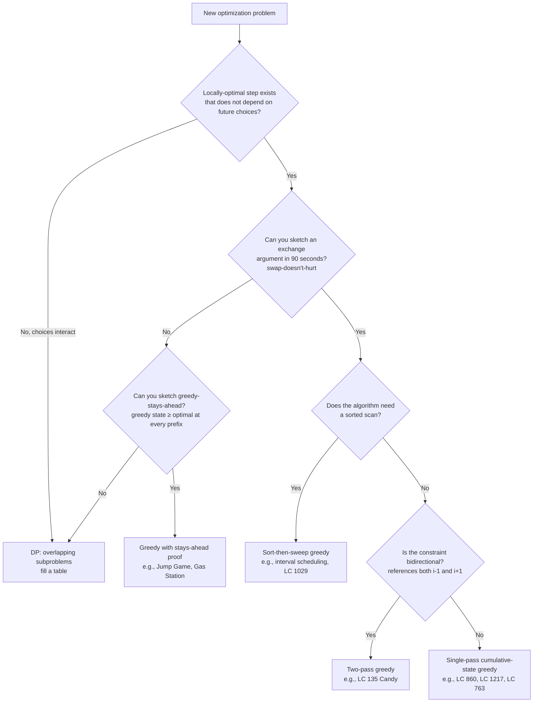

# Greedy thinking: when local choices win, and when they don't

Hand a greedy solver the coin-change problem with denominations `[1, 3, 4]` and a target of `6`. It picks the largest coin that fits, then the next, then the next: `4 + 1 + 1 = 6`. Three coins. The optimal answer is `3 + 3`. Two coins. The greedy algorithm is wrong by exactly one coin, and it has no way of knowing.

That single mistake is the most useful idea in this chapter.[^1] Greedy algorithms (pick the locally best move at each step, never look back) run faster than dynamic programming, fit in a few lines of code, and feel obviously correct when they happen to work. They are also wrong on a wide class of problems where they look right, fail no example LeetCode hands you, and break on the hidden test case the interviewer is waiting for. The whole job of Part 10 is teaching you which is which. This chapter is the part's mental model: when greedy is provably optimal, when it isn't, and the proof techniques that tell the two apart.

The chapters that follow specialise. [Interval scheduling and merging](./01-interval-scheduling.md) walks the sort-then-sweep family. [Activity selection](./02-activity-selection.md) handles the earliest-finish-time pattern in depth. The widget chapter for Part 10 is [Huffman coding](./03-huffman-encoding.md), where a greedy build of an optimal prefix code carries an explicit exchange-argument proof. [Jump games and gas station](./04-jump-games-gas-station.md) covers single-pass cumulative-state greedy. Each of those four lands easier once you can recognise the pattern's signal in advance and sketch the proof in two lines.

## What greedy buys you when it works

The greedy meta-algorithm has four moving parts.[^1] Pick a **greedy key** to sort or prioritise by. At each step take the **greedy choice** the key dictates. Maintain an **invariant** the choice preserves. Discharge the **proof obligation** that the locally optimal step is also part of some globally optimal solution. The first three are mechanics; the fourth is the only one that distinguishes a working algorithm from a broken one.

```text
function greedy(input):
    sort or order input by some key            # greedy key
    state <- initial
    for each item in order:
        choice <- locally-optimal move(state)  # greedy choice
        commit choice; never revisit           # no backtracking
        state <- update(state, choice)
    return solution-from(state)
```

The cost saving over dynamic programming is structural. DP fills an `n`-dimensional table where `n` is the dimension count of the state vector, so the work is `O(n · m)` or `O(n²)` for the typical sequence problem. Greedy commits each decision once, so the per-element work is `O(1)`. The whole algorithm is `O(n)` if no sort is needed, `O(n log n)` if one is. Jump Game is the cleanest demonstration: the DP solution walks every reachable jump from each index in `O(n²)`, while the greedy max-reach scan finishes in `O(n)` with `O(1)` extra space.[^2] Cubic versus linear, on the same problem.

That speed comes with a string attached. A greedy algorithm without a correctness proof is a guess that looks like an algorithm. It will compile, pass the example LeetCode hands you, and break on the hidden test. The proof obligation is real, and the only way to discharge it during an interview is to know the catalogue of techniques.

## When greedy is provably correct

Two proof techniques cover almost every greedy problem in the textbooks.[^3] Both are short. Both can be sketched out loud in under ninety seconds. If neither applies in that time, the problem is dynamic programming.

### The exchange argument

The exchange argument is the workhorse. The shape: assume some optimal solution `O` differs from your greedy solution `G` at the first index where they disagree. Show that swapping the greedy choice into `O` at that index produces a new solution `O'` that is still valid and still optimal. Induction on the position finishes the job. `O'` agrees with `G` one step further on, repeat the swap, and at the end `O'` is `G`. So `G` was optimal.

```mermaid
sequenceDiagram
    participant G as Greedy G
    participant O as Optimal O
    Note over G,O: assume O ≠ G; find first index k where g_k ≠ o_k
    G->>O: swap o_k for g_k in O, producing O'
    O-->>G: O' is still valid (no constraint broken)
    O-->>G: |O'| = |O| (size preserved; O' still optimal)
    Note over G,O: induction: O' agrees with G at index k; repeat at k+1
    G->>O: continue exchanges until O' = G
    Note over G,O: therefore G is optimal
```

*The exchange argument as a transformation between two candidate solutions. Each swap preserves validity and optimality; the induction terminates when no more disagreements remain.*

The key word is **swap**. Whatever quantity makes the swap step easy to verify is the right thing to sort by. For Two City Scheduling (LC 1029), that quantity is `cost_a − cost_b` per candidate: if the optimal solution sends person `i` to city A and person `j` to city B, but `cost_a[i] − cost_b[i] > cost_a[j] − cost_b[j]`, swapping their assignments lowers the total cost (or leaves it equal). So sort by `cost_a − cost_b`, send the first `n/2` to A, send the rest to B. The proof writes itself the moment you choose the right key.[^4]

For interval scheduling, the quantity is `end[i]`. Sort intervals by earliest finish time. If the optimum picks some interval ending later than the greedy first choice, swap them: the greedy choice ends sooner, leaves more room for the rest, and the swap can only help. That's the activity-selection proof in two sentences, and it's what [Activity selection](./02-activity-selection.md) develops in detail.

### Greedy stays ahead

The second technique is greedy-stays-ahead. It applies when the greedy choice doesn't swap cleanly with an optimal alternative, usually because the algorithm builds a single running state rather than picking from a sorted list. The shape: at every prefix of the input, prove that the greedy state is no worse than any feasible alternative's state. Once that invariant survives the inductive step, the whole-input claim follows.

Jump Game is the canonical case. Walk the array left to right, keeping `max_reach` as the farthest index reachable so far. After processing position `i`, the greedy `max_reach` is at least as large as any other algorithm's reach at that point, because the greedy considered every position up through `i` and took the max. If `i > max_reach` the answer is false; otherwise update and continue. The whole algorithm is one for-loop and one max.[^2]

The pitfall in this technique is making the induction hypothesis too weak.[^5] Jump Game II, the variant that counts the *minimum* number of jumps rather than just deciding reachability, needs an IH stronger than "the greedy max reach beats the optimal max reach at index `k`", because that doesn't compose. The correct IH quantifies over all indices `m ≤ g_k`, not just `g_k` itself. The chapter covering that variant lives at [Jump games and gas station](./04-jump-games-gas-station.md); the lesson here is that greedy-stays-ahead proofs reward picking the strongest natural invariant up front, even when a weaker one suffices for the example you're staring at.

## A working example: Partition Labels

LC 763 Partition Labels is the chapter's worked example because it shows greedy decision-making with a one-line correctness justification. Given a string like `"ababcbacadefegdehijhklij"`, partition it into the longest possible substrings such that each letter appears in at most one part. The expected answer is `[9, 7, 8]`.

```python
def partition_labels(s):
    last = {c: i for i, c in enumerate(s)}
    parts = []
    start = 0
    end = 0
    for i, c in enumerate(s):
        if last[c] > end:
            end = last[c]
        if i == end:
            parts.append(end - start + 1)
            start = i + 1
    return parts
```

**Solution** — Python ([Java](./00-greedy-thinking/lc-763/sol.java) · [C++](./00-greedy-thinking/lc-763/sol.cpp) · [Go](./00-greedy-thinking/lc-763/sol.go))

```python
# LC 763. Partition Labels
def partition_labels(s: str) -> list[int]:
    """LC 763: greedy boundary extension to last-occurrence index.

    One pre-pass to record the last index of each character; one
    main pass that extends the current partition's right boundary
    to the rightmost last-index of any character seen so far.
    Whenever the cursor reaches that boundary, the partition is
    closed. Time O(n), space O(1) (alphabet bound 26).
    """
    last = {c: i for i, c in enumerate(s)}
    parts: list[int] = []
    start = 0
    end = 0
    for i, c in enumerate(s):
        if last[c] > end:
            end = last[c]
        if i == end:
            parts.append(end - start + 1)
            start = i + 1
    return parts
```

The algorithm runs in two phases. A pre-pass builds `last[c]`, the rightmost index at which each character appears. The main pass walks the string once, extending the current partition's right boundary `end` to the maximum `last[c]` for any character seen since the partition began. When the cursor `i` catches up to `end`, the partition closes and a new one starts.

The greedy choice is the boundary extension. At each step the algorithm asks: of the characters I've already committed to this partition, which one's last occurrence is farthest right? Extend the boundary that far and no further. The exchange argument is one sentence: if any optimal partition closes earlier than the greedy boundary, then some character in the partition has a later occurrence outside it, which violates the constraint that each letter appears in at most one part. So the greedy boundary is the earliest legal close, which means it produces the smallest possible partition starting at `start`, which means starting the next partition there is at least as good as starting later. The proof obligation is discharged in one inequality.

The runtime is `O(n)` for both passes. Space is `O(1)` because the alphabet is bounded at 26.

## Where greedy fails

Coin Change with arbitrary denominations is the case to keep in your head. Pick the largest coin that fits, repeat. With `coins = [1, 5, 10, 25]` (US currency) and any target, greedy is optimal. With `coins = [1, 3, 4]` and target `6`, greedy returns `4 + 1 + 1`, three coins, and the optimal `3 + 3` is two.[^1] One coin's difference, which on a problem rated Medium is enough to fail every hidden test case.

The structural reason greedy breaks here is that the choice at one step *changes which subproblem you face next* in a way greedy can't see. Picking the `4` leaves `2`, which can only be made from two `1`s. Picking the `3` leaves `3`, which is a single coin. The greedy choice of `4` is locally best (it's the largest fitting coin) but it forfeits a future option that the smaller coin would have preserved. The exchange argument fails: swapping a `3` into the optimum at the first position produces a solution that's *better*, not equal, so the induction has nothing to stand on.

> [!IMPORTANT]
> Run the small-input counterexample test before submitting any greedy. If a candidate algorithm gives a different answer than DP on a 5-to-10-element input, the algorithm is wrong, regardless of how many large random inputs it happens to clear. The fastest way to catch this is to spend ninety seconds writing the DP version on paper and comparing both on `[1, 3, 4]` against target `6`. If they disagree, ship the DP. Coin Change itself lives at [Unbounded knapsack](../part-9-dynamic-programming/05-knapsack-unbounded.md) for exactly this reason.

The decision rule that drops out: the moment your candidate greedy's choice at step `k` *forecloses* a future possibility that some other choice would have left open, you don't have a greedy problem. You have a DP problem dressed as a greedy problem, and the only safe response is to enumerate the alternatives the way DP does.

## A formal characterization: matroids

The reason exchange arguments work on some problems and fail on others is not coincidence. There's a structural theory underneath. A **matroid** is a set system with two properties: a hereditary property (subsets of independent sets are independent) and an exchange property (given two independent sets of different sizes, you can always extend the smaller by an element from the larger). Edmonds proved in 1971 that the greedy algorithm produces an optimal solution on any matroid, and only on a matroid does the greedy algorithm always work.[^6]

Useful caveats. Most LeetCode greedy problems don't have an obvious matroid hiding inside them. The matroid structure shows up cleanly for spanning trees (graphic matroid), for transversals, and for a handful of scheduling variants, but Partition Labels and Lemonade Change don't reduce to matroids in any teaching-useful way. The exchange-argument framework is the practical descendant of the matroid result for problems where the formal structure isn't obvious. Treat the matroid theorem as a guarantee that the technique you're using has a name and a paper behind it, not as a substitute for the technique itself. CLRS Chapter 16 develops the matroid connection in detail for readers who want the rigour;[^7] for everyone else, the exchange argument is the mechanical tool, and matroids are the explanation for why it ever works.

## A decision rule

The whole chapter compresses into one tree.



*The decision tree the chapter teaches. Every leaf names a sub-pattern with a canonical LC example; chapters 10.1 through 10.4 develop each leaf in depth.*

The leaves correspond to four sub-patterns Part 10 specialises one chapter at a time. Sort-then-sweep (10.1, 10.2) needs an exchange-argument proof and a global sort. Single-pass cumulative-state greedy (LC 860 Lemonade Change, LC 1217 Min Cost Moving Chips, LC 763 itself) updates a small running state and commits per element: no sort, just a scan, with proofs that are usually one inequality. Two-pass greedy (LC 135 Candy) handles bidirectional constraints by running once forward and once backward, combining with `max`. Frontier-tracking greedy (10.4 jump games) is BFS-as-greedy on a one-dimensional index axis, executing in `O(n)` because the frontier is contiguous.

## Pitfalls

> [!WARNING]
> **Picking greedy without proving it.** A submission compiles, runs, passes the example LC gives, and fails on a hidden test. The candidate has no diagnostic because they never had a correctness argument. The fix is structural: before coding, sketch the exchange argument out loud. If the swap step doesn't work in two lines, the algorithm is wrong, so switch to DP or backtracking.[^3]

> [!WARNING]
> **Wrong sort key.** For interval scheduling, sorting by start time, by length, or by start-time-plus-length all "work" on small examples and fail on the canonical counterexample where one long activity blocks many short ones. Only earliest-finish-time has a proof.[^8] The fix is to tie the sort key to the exchange argument: sort by whatever quantity makes the swap step easy to verify. For LC 1029 that's `cost_a − cost_b`; for activity selection it's `end[i]`. If a sort key feels arbitrary, the algorithm probably is.

> [!WARNING]
> **Greedy assumed where DP is needed.** Several greedy problems (LC 860, LC 1217, LC 763) feel like Coin Change. The structural difference is that in Coin Change, choosing a large coin *changes* the optimal subproblem in ways the greedy cannot undo. In the working examples, the local choice has no downstream effect on the optimal subproblem.[^1] The diagnostic is the small-input counterexample: if `[1, 3, 4]` against target `6` returns a different answer from greedy than from DP, the problem is DP. The check takes ninety seconds and saves the submission.

> [!WARNING]
> **Forgetting the second pass.** LC 135 Candy with a single forward pass returns the correct answer for `[1, 2, 3]` (by coincidence) and the wrong answer for `[1, 0, 2]`. The constraint references both `i-1` and `i+1`; a single pass cannot enforce both halves. Whenever a constraint is bidirectional, default to two passes: one direction enforces the left rule, the other enforces the right, and the answers combine with `max` (or `+`, depending on the accumulation rule).

> [!WARNING]
> **Inventing a custom proof technique.** A candidate writes a proof in interview that "feels right" but isn't a recognised technique. The interviewer pushes on the gap and the candidate cannot defend. Naming the technique explicitly removes the ambiguity: say "exchange argument" or "greedy-stays-ahead" out loud. It signals you know the standard catalogue and turns the proof from hand-waving into a structured claim with a known shape.

## Problem ladder

### CORE (solve all three to claim chapter mastery)

- [LC 860 — Lemonade Change](https://leetcode.com/problems/lemonade-change/) [Easy] • greedy-state-tracking *(reference: Python only)*
- [LC 1217 — Minimum Cost to Move Chips to The Same Position](https://leetcode.com/problems/minimum-cost-to-move-chips-to-the-same-position/) [Easy] • greedy-parity-classification *(reference: Python only)*
- [LC 763 — Partition Labels](https://leetcode.com/problems/partition-labels/) [Medium] • greedy-interval-merge ★

### STRETCH (optional)

- [LC 1029 — Two City Scheduling](https://leetcode.com/problems/two-city-scheduling/) [Medium] • greedy-exchange-argument *(reference: Python only)*
- [LC 135 — Candy](https://leetcode.com/problems/candy/) [Hard] • greedy-two-pass *(reference: Python only)*

The CORE three span Easy and Medium natively; the Hard slot is filled via STRETCH (LC 135), keeping the canonical interval-scheduling and jump-game Hards reserved for chapters 10.1 through 10.4 where they belong.

## Where this leads

[Interval scheduling and merging](./01-interval-scheduling.md) opens the sort-then-sweep family with the earliest-finish-time proof developed in full. [Activity selection](./02-activity-selection.md) treats the same family from the textbook angle, including the matroid framing for readers who want the formal grounding. [Huffman coding](./03-huffman-encoding.md) is the part's widget chapter and contains the cleanest exchange-argument proof in the curriculum. [Jump games and gas station](./04-jump-games-gas-station.md) covers single-pass cumulative-state greedy where the proof is greedy-stays-ahead rather than exchange. The decision tree above is the map for choosing among them.

## References

[^1]: LeetCopilot Team, *Why Greedy Fails on Coin Change (And When You Need Dynamic Programming Instead)*, 2025, [leetcopilot.dev/leetcode-pattern/greedy/coin-change-greedy-fails](https://leetcopilot.dev/leetcode-pattern/greedy/coin-change-greedy-fails).

[^2]: LeetCopilot Team, *Jump Game: Why Greedy Beats DP (Proof and Complexity Comparison)*, 2025, [leetcopilot.dev/leetcode-pattern/greedy/jump-game-greedy-vs-dp](https://leetcopilot.dev/leetcode-pattern/greedy/jump-game-greedy-vs-dp).

[^3]: LeetCopilot Team, *Exchange Argument: The Most Powerful Greedy Proof Technique (With Examples)*, 2025, [leetcopilot.dev/leetcode-pattern/greedy/exchange-argument-explained](https://leetcopilot.dev/leetcode-pattern/greedy/exchange-argument-explained).

[^4]: walkccc, *LeetCode Solutions, 1029. Two City Scheduling*, [walkccc.me/LeetCode/problems/1029](https://walkccc.me/LeetCode/problems/1029/)

[^5]: Computer Science Stack Exchange, *Greedy Stays Ahead proof of "Jump Game"*, question 146619, 2021. <https://cs.stackexchange.com/questions/146619/greedy-stays-ahead-proof-of-jump-game>

[^6]: Edmonds, J., *Matroids and the greedy algorithm*, Mathematical Programming 1, 127–136, 1971. Cited via the survey in Wikipedia, *Greedy algorithm*, [en.wikipedia.org/wiki/Greedy_algorithm](https://en.wikipedia.org/wiki/Greedy_algorithm)

[^7]: Cormen, Leiserson, Rivest, Stein, *Introduction to Algorithms*, 4th ed., MIT Press, 2022, Chapter 15 "Greedy Algorithms" (note: greedy is Chapter 16 in older editions).

[^8]: LeetCopilot Team, *Wrong Sorting Criterion: The #1 Greedy Mistake (And How to Fix It)*, 2025, [leetcopilot.dev/leetcode-pattern/greedy/wrong-sorting-criterion](https://leetcopilot.dev/leetcode-pattern/greedy/wrong-sorting-criterion).
