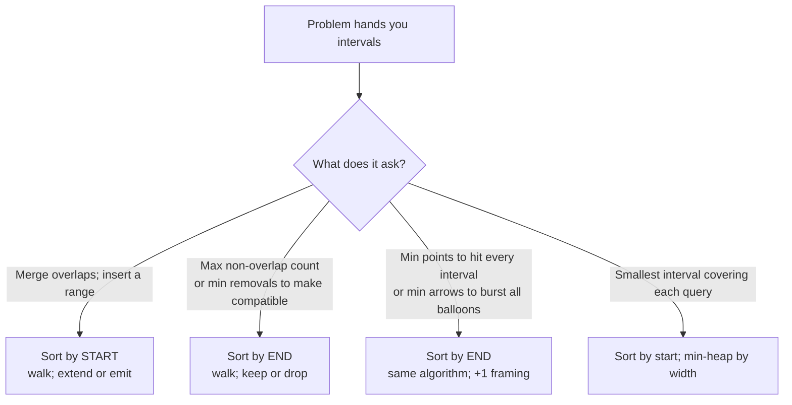

# Interval scheduling: the comparator is the algorithm

You are scheduling a conference room. Forty meeting requests are sitting in a queue, each one a `[start, end]` pair, many of them overlapping. The room can host one meeting at a time. You want to keep as many requests as you can; the rest will be told to find another room. Drop one too many and your boss notices. Skip a real conflict and the algorithm crashes the room. Which meeting do you drop first?

The instinct most readers reach for is *the longest one*, or *the one that starts latest*, or *the one with the most conflicts* — every plausible-sounding rule that takes a paragraph to refute. The correct rule is one character long. Sort by `end`, not by `start`. The whole chapter lives inside that swap.

## Locating this pattern

Interval problems split cleanly into four families based on what the question asks. The split is decided by a single read of the prompt; it is not a matter of taste.



*Caption: the four interval-toolkit branches. This chapter teaches branches D and E; branch C is the LC 56 / LC 57 family that you reach for in the same chapter as a foil. Branch F is a heap problem dressed as an interval problem and shows up only in the STRETCH ladder.*

[Greedy thinking and exchange arguments](./00-greedy-thinking.md) introduced the technique. Interval scheduling is its strictest test, because every other family member (Huffman codes, Dijkstra's algorithm, Kruskal's MST) inherits the proof structure from this one. If you can argue why sort-by-end works, you can argue why every other classical greedy works.

## Why the obvious approach finds the wrong answer

The canonical problem is LC 435, *Non-overlapping Intervals*. Given a list of intervals, return the minimum number you must remove so that the rest are pairwise non-overlapping. Touching at an endpoint is allowed; `[1,2]` and `[2,3]` do not overlap.

Most readers, fresh from LC 56's merge-intervals, reach for the same comparator. Sort by start. Walk left to right. On overlap, drop the *current* interval; otherwise keep it.

```python
# Wrong answer: sort by start, drop the current one on overlap.
def erase_overlap_brute(intervals):
    if not intervals:
        return 0
    intervals.sort(key=lambda x: x[0])  # sort by START
    removed = 0
    current_end = intervals[0][1]
    for start, end in intervals[1:]:
        if start < current_end:
            removed += 1                # drop this one
        else:
            current_end = end
    return removed
```

Run it on `[[1, 100], [2, 3], [3, 4]]`. Sorted by start, the order is unchanged. The walk keeps `[1, 100]`, then sees `[2, 3]` (conflict, drop it), then `[3, 4]` (still conflicts with the kept `[1, 100]` because `3 < 100`, drop it). Two drops. The algorithm reports `2`.

The correct answer is `1`. Drop `[1, 100]` and the remaining two intervals fit fine. The greedy made a worse decision on every step it looked at, because it kept an interval that ate the rest of the timeline.

The bug is not in the loop. It is in the comparator. By sorting on start, the algorithm anchors itself to whichever interval *began* earliest, with no information about how much of the remaining timeline that interval will consume. An interval that starts at 1 and ends at 100 looks identical to one that starts at 1 and ends at 2 until the second number is read.

## The pattern

Sort by end instead. Walk left to right. Keep the first interval; for each subsequent interval, drop it if it overlaps the running cursor, otherwise keep it and advance the cursor.

```python
import math
from typing import List

def erase_overlap_intervals(intervals: List[List[int]]) -> int:
    """LC 435: minimum number of intervals to remove so the rest are non-overlapping."""
    if not intervals:
        return 0
    intervals.sort(key=lambda x: x[1])           # sort by END
    removed = 0
    current_end = -math.inf
    for start, end in intervals:
        if start < current_end:
            removed += 1                          # overlap; drop this one
        else:
            current_end = end                     # no overlap; adopt it
    return removed
```

**Solution** — Python ([Java](./01-interval-scheduling/lc-435/sol.java) · [C++](./01-interval-scheduling/lc-435/sol.cpp) · [Go](./01-interval-scheduling/lc-435/sol.go))

```python
# LC 435. Non-overlapping Intervals
#
# Sort by END ascending. Walk left to right. Keep the first interval; for
# each subsequent interval, drop it if it overlaps the last kept end,
# otherwise keep it and update the cursor. Return the drop count.
#
# Why sort-by-end and not sort-by-start: see the chapter's exchange-argument
# section. Sort-by-start fails on inputs like [[1,100],[2,3],[3,4]] — it
# greedily keeps [1,100], drops both shorter intervals, returns 2; the
# optimum is to keep [2,3] and [3,4], drop [1,100], for a count of 1.
from typing import List
import math


def erase_overlap_intervals(intervals: List[List[int]]) -> int:
    """LC 435: minimum number of intervals to remove so the rest are non-overlapping."""
    if not intervals:
        return 0
    intervals.sort(key=lambda x: x[1])  # sort by END
    removed = 0
    current_end = -math.inf
    for start, end in intervals:
        if start < current_end:
            # Overlap: drop this interval (keep the earlier-ending one we already chose).
            removed += 1
        else:
            # No overlap: extend the schedule by adopting this interval.
            current_end = end
    return removed
```

Same loop. Same number of lines. One character changed in the comparator: `x[0]` became `x[1]`. On the input that broke the brute force, the new sort produces `[[2, 3], [3, 4], [1, 100]]`. The walk keeps `[2, 3]`, keeps `[3, 4]` (no conflict; the touch at 3 is allowed), drops `[1, 100]` (start 1 is less than the cursor at 4). One drop. Correct.

The strict `<` in `start < current_end` is doing real work. LC 435 treats touching endpoints as non-overlap. Use `<=` and `[1, 2]` followed by `[2, 3]` would register as a conflict, returning `1` on an input whose answer is `0`. Read the problem before locking the operator.

## Why sort-by-end is optimal

The greedy algorithm being correct is a stronger claim than the brute force being wrong. Showing one algorithm fails on one input does not prove a different algorithm always succeeds. Here is the proof, which is one of the cleanest exchange arguments in algorithms.[^1]

Let `G` be the set of intervals the greedy keeps. Let `OPT` be any optimal set — there may be several. The claim is `|G| = |OPT|`.

Order the intervals of `G` and `OPT` by their end times. Compare them position by position:

- The first interval the greedy keeps is, by construction, the one with the earliest end time in the entire input. Call it `g_1`. Suppose `OPT` keeps a different interval at position 1, call it `o_1`. Then `o_1` ends no earlier than `g_1` does (because `g_1` is the global earliest). Replace `o_1` with `g_1` in `OPT`. The replacement ends no later than `o_1`, so any interval that was compatible with `o_1` (started after `o_1.end`) is also compatible with `g_1`. After the swap, `OPT` is still valid and still the same size.

- Inductively, suppose `G` and `OPT` agree on the first `k` intervals. The greedy's choice at position `k+1` is the earliest-ending interval whose start is at or after `g_k.end`. `OPT`'s `(k+1)`-th interval must also start at or after `g_k.end` (because `OPT` is non-overlapping and the first `k` agree), so `o_{k+1}.end >= g_{k+1}.end` by the greedy's choice. Same swap argument; same conclusion.

The greedy never falls behind. If `G` were strictly smaller than `OPT`, there would be a position where `OPT` had an interval and `G` did not — but the swap argument shows the greedy could have taken that interval, so it would have. `|G| = |OPT|`.

What does this mean for LC 435? The maximum number you can *keep* without overlap is `|G|`, so the minimum number you must *remove* is `n - |G|`. The two questions are duals; the same algorithm answers both.

The argument generalizes immediately to LC 452 *Minimum Number of Arrows to Burst Balloons*. There the question is "minimum points that hit every interval"; the answer is the number of non-overlapping groups, which is what the greedy keeps. Same loop, different return value. The activity-selection result behind both was first formalized in CLRS §16.1 and gets a textbook-length treatment in Kleinberg-Tardos §4.1.[^2]

## Worked example: LC 435 on `[[1,2], [2,3], [3,4], [1,3]]`

Sort by end: `[[1,2], [1,3], [2,3], [3,4]]`. The order of `[1,3]` and `[2,3]` is a tie at end-time 3; the algorithm is correct under either tie-break. Initialize `current_end = -∞`, `removed = 0`. The walk hits its only drop on the second iteration when `[1,3]` overlaps the kept `[1,2]`. Two more keeps follow at `[2,3]` and `[3,4]` because the touches at 2 and 3 are not strict overlaps. Final answer: `1`.

> **Interactive widget:** [Interval scheduling: non-overlap and min-arrows](../widgets/w-36-interval-scheduling.yml) (panel `panel-non-overlap`) — rendered on the website; the YAML spec describes the keyframes.

*Static fallback: four intervals enter sorted by end. The first kept interval `[1,2]` pins the cursor at 2. `[1,3]` arrives next and is dropped because its start 1 is left of the cursor — the exchange argument rendered as a single visible event. `[2,3]` and `[3,4]` are kept; the cursor finishes at 4. One drop, three kept.*

## What it actually costs

| Variant | Time | Space | Notes |
|---|---|---|---|
| LC 435 sort-by-end greedy | O(n log n) | O(1) auxiliary, O(log n) sort stack | the chapter's algorithm |
| LC 56 merge (sort-by-start) | O(n log n) | O(n) for output | the sibling pattern |
| LC 57 insert (input pre-sorted) | O(n) | O(n) | the specialization that drops the sort |
| Brute force: try all subsets | O(2^n · n) | O(n) | only viable for `n <= 20` |

The O(n log n) bound is set by the sort. The walk is a single linear pass with constant work per element, so the asymptotic cost of the algorithm is the asymptotic cost of `sorted()`. There is no algorithm that beats this in the comparison model: any algorithm that returns the *order* of intervals end-to-end can be used to sort them, so a sub-`n log n` interval-scheduling algorithm would imply a sub-`n log n` sorting algorithm.

The constant-space claim for the walk is exact. Inside the loop the algorithm tracks two integers (`current_end` and `removed`) and one loop variable. Python's `sorted` uses TimSort, whose stack space is `O(log n)`; if you must report total space including the sort, that's the floor. C++ `std::sort` and Go `sort.Slice` use introsort, also `O(log n)` worst case.

## When the pattern bends

### Sort-by-start, fold while overlapping (LC 56)

The merge-intervals problem is the structural twin in the other direction. You are given a list of intervals; return the minimal set of non-overlapping intervals whose union equals the input's union. The comparator flips back to start; the loop body extends `last.end` instead of counting drops.

```python
def merge(intervals):
    if not intervals:
        return []
    intervals.sort(key=lambda x: x[0])           # sort by START
    merged = [intervals[0][:]]
    for start, end in intervals[1:]:
        last = merged[-1]
        if start <= last[1]:                     # touch or overlap: extend
            last[1] = max(last[1], end)
        else:
            merged.append([start, end])
    return merged
```

Two details matter. The comparator is `<=` not `<`, because LC 56's prompt is explicit that `[1,4]` and `[4,5]` are considered overlapping for the merge.[^3] LC 435 inverts this convention; LC 56 follows it. The other detail is `last[1] = max(last[1], end)` rather than `last[1] = end`. On a fully-contained interval like `[2, 3]` arriving after `[1, 10]`, the unconditional assignment would shrink `last` from 10 to 3, which is wrong. The `max` is what makes "fold" mean fold.

### Pre-sorted input drops the sort (LC 57)

LC 57 *Insert Interval* is LC 56's input-already-sorted specialization. The existing intervals are guaranteed to be sorted and non-overlapping; the task is to insert one new range and return the result. Sorting again would add an unnecessary `O(n log n)` factor on a problem that admits `O(n)`. Walk in three phases: copy intervals that end before the new one starts, merge with anything that overlaps, copy the rest. The classification is read off the constraints. If the prompt says "intervals were initially sorted according to their start times", do not re-sort.

### The reframing for points and arrows (LC 452)

LC 452 *Minimum Number of Arrows* hides the same algorithm under different language. You have balloons drawn on the x-axis as intervals; an arrow shot at coordinate `x` bursts every balloon whose interval contains `x`. Find the minimum number of arrows to burst all balloons. Same sort-by-end loop. The answer is the count of intervals the greedy *keeps* (each keep is the interval that anchors a fresh arrow), which is `n - removed` from the LC 435 algorithm. Two LeetCode problems, one algorithm, two different return values.

> **Interactive widget:** [Interval scheduling: non-overlap and min-arrows](../widgets/w-36-interval-scheduling.yml) (panel `panel-min-arrows`) — rendered on the website; the YAML spec describes the keyframes.

*Static fallback: four balloons sort by end into `[[1,6], [2,8], [7,12], [10,16]]`; the greedy shoots arrow #1 at x = 6 (bursting [1,6] and [2,8]); arrow #2 at x = 12 (bursting [7,12] and [10,16]). Answer: 2 arrows. Same partition as LC 435 reports as `dropped = 2`.*

## Pitfalls that bite

> [!WARNING]
> **Sorting by the wrong endpoint.** LC 435 attempted with sort-by-start gives wrong answers on every input where a long interval shadows several short ones. The reflex test before writing the comparator: am I asked to *fold* or am I asked to *count*? Folding is start; counting is end. Print the rule on a sticky note if you have to.

> [!WARNING]
> **Subtraction comparator overflow in Java and Go.** The shorthand `(a, b) -> a[1] - b[1]` looks fine and works on every input the LC examples test. On adversarial inputs near `Integer.MAX_VALUE`, the subtraction wraps, the comparator returns the wrong sign, and `Arrays.sort` throws *Comparison method violates its general contract*. Use `Integer.compare(a[1], b[1])` in Java and `cmp.Compare(a[1], b[1])` in Go. The reference files in this chapter all use the safe form.

A third pitfall worth a single sentence: in Go, `merged := [][]int{intervals[0]}` aliases the input slice, so a later assignment to `last[1]` mutates the caller's data. Copy element-wise on append, every time.

## Problem ladder

### CORE (solve all three to claim chapter mastery)

- [LC 435 — Non-overlapping Intervals](https://leetcode.com/problems/non-overlapping-intervals/) [Medium] • sort-by-end-greedy-max-compatible ★
- [LC 56 — Merge Intervals](https://leetcode.com/problems/merge-intervals/) [Medium] • sort-by-start-merge-overlapping
- [LC 57 — Insert Interval](https://leetcode.com/problems/insert-interval/) [Medium] • sorted-intervals-three-phase-splice

### STRETCH (optional)

- [LC 1851 — Minimum Interval to Include Each Query](https://leetcode.com/problems/minimum-interval-to-include-each-query/) [Hard] • sort-and-heap-for-coverage-query
- [LC 252 — Meeting Rooms](https://leetcode.com/problems/meeting-rooms/) [Easy] • overlap-detection-on-sorted-pairs *(Premium; free alternative is LC 56)*

The CORE three force the reader to switch comparators inside one chapter: LC 435 trains the sort-by-end reflex, LC 56 trains the sort-by-start mirror, and LC 57 strips the sort entirely. Anyone who can write all three from scratch has internalized the toolkit's split. LC 1851 lifts to a heap-keyed-by-width reframing; the heap mechanics are owned by [Heaps and priority queues](../part-6-trees-heaps/04-heaps-priority-queues.md) and the chapter cross-links rather than re-deriving. LC 252 is Premium but every paid LeetCode mirror confirms the algorithm reduces to LC 56's first-conflict check.[^4]

## Where this leads

The sort-by-end greedy is a one-pattern that solves several. Apply it again with a different return value and you have the points-and-arrows family — *minimum points to hit every interval* is the same loop reporting `kept` instead of `dropped`. Capacity tracking on intervals (LC 253 *Meeting Rooms II*, LC 1094 *Car Pooling*) sits one branch over: when the answer is "how many overlapping intervals at any moment", you decompose each interval into a `+1` event at start and a `-1` event at end, sort the events, sweep. That family is taught in [Prefix sums and difference arrays](../part-3-pointers-window-prefix/04-prefix-sums.md) because the sweep state is a running counter, not an interval object.

Two patterns away, the sort-by-end greedy generalizes to *weighted* interval scheduling, where each interval carries a value and the goal is the maximum total value of a non-overlapping subset. The greedy stops working at the moment a weight is attached; the problem becomes a dynamic-programming exercise over the sorted intervals. That story is in [Interval DP](../part-9-dynamic-programming/11-interval-dp.md).

## References

[^1]: Wikipedia, "Interval scheduling," <https://en.wikipedia.org/wiki/Interval_scheduling>

[^2]: Cormen, Leiserson, Rivest, Stein, *Introduction to Algorithms*, 4th ed., MIT Press, 2022, §16.1 "An activity-selection problem"; and Kleinberg & Tardos, *Algorithm Design*, Pearson/Addison-Wesley, 2006, §4.1.

[^3]: walkccc/LeetCode, "56. Merge Intervals," <https://walkccc.me/LeetCode/problems/56/>

[^4]: walkccc/LeetCode, "435. Non-overlapping Intervals," <https://walkccc.me/LeetCode/problems/435/>
