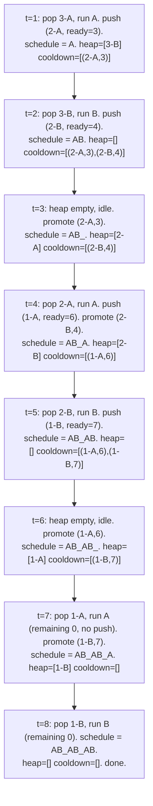

# Activity selection and the task-scheduler family

A CPU has six tasks queued: `["A", "A", "A", "B", "B", "B"]`. The catch is a cooldown rule: the same task can't run twice within two ticks of itself. Run an `A`, and `A` is locked out for the next two ticks. The CPU can sit idle if it has to. What is the shortest schedule that finishes everything?

Try it on paper before reading on. Eight ticks is achievable; seven is not. The schedule that hits eight is `A B _ A B _ A B`, with two forced idle slots. This is LeetCode 621, the cleanest specimen of a family of problems that all share a single algorithmic spine: a max-heap of "what's left to do" coupled with a queue of "what just ran and is in cooldown." The same skeleton handles task scheduling with cooldowns, no-adjacent-letter rearrangements, single-CPU job ordering, and seating-on-a-shared-bench simulation. Six LeetCode problems, one shape.

## Why the obvious schedule fails

The instinct most readers reach for is round-robin: cycle through task types in order, repeating until everything is done. On `["A", "A", "A", "B", "B", "B"]` with cooldown `n = 2`, round-robin produces `A B A B A B` of length 6. Wrong: the second `A` runs at tick 3, only two ticks after the first `A` at tick 1, which violates the cooldown of `n = 2` (the same task needs to wait *at least* `n` ticks, so the next `A` can't run until tick 4).

A second instinct is to drain the most-frequent task first: `A A A B B B`. The first three `A`s collapse to a single legal slot per three ticks, ballooning the schedule to twelve.

The right answer comes from a reduction worth naming explicitly: **at every tick, schedule the most-frequent task that is currently ready.** If two tasks are tied on remaining count, either one works. If no task is ready, the CPU sits idle. That sentence is the entire algorithm. The mechanics below are bookkeeping that makes the sentence runnable.

The reason "most-frequent ready" wins is the same exchange argument that powers [Interval scheduling: the comparator is the algorithm](./01-interval-scheduling.md). Suppose some optimal schedule defers the most-frequent task to a later tick than necessary. Swap that deferred occurrence with whatever ran in its place; the swap is legal (both tasks are ready at both ticks) and the resulting schedule is no longer than the original, so the greedy choice is safe. CLRS Chapter 16 §16.1 spells out the same template for the textbook activity-selection problem, where the priority key is finish time rather than frequency.[^1]

## The spine

Two data structures cooperate. A max-heap holds the remaining counts of every task that is currently ready to run. A FIFO queue holds tasks that just ran, paired with the tick they become eligible again. Every tick, three things happen in order: pop the heap's most-frequent task and run it, push it onto the cooldown queue if it has runs left, and finally promote any cooldown entry whose ready time has arrived. That cycle, repeated until both structures are empty, builds the schedule.

```python
def least_interval(tasks, n):
    if n == 0:
        return len(tasks)
    counts = Counter(tasks)
    heap = [-c for c in counts.values()]
    heapq.heapify(heap)
    cooldown = deque()
    time = 0
    while heap or cooldown:
        time += 1
        if heap:
            neg_c = heapq.heappop(heap)
            remaining = -neg_c - 1
            if remaining > 0:
                cooldown.append((-remaining, time + n))
        if cooldown and cooldown[0][1] == time:
            ready_neg, _ = cooldown.popleft()
            heapq.heappush(heap, ready_neg)
    return time
```

**Solution** — Python ([Java](./02-activity-selection/lc-621/sol.java) · [C++](./02-activity-selection/lc-621/sol.cpp) · [Go](./02-activity-selection/lc-621/sol.go))

```python
# LC 621. Task Scheduler
from collections import Counter, deque
import heapq


def least_interval(tasks, n):
    """LC 621 Task Scheduler: minimum CPU intervals to finish all tasks
    with cooldown n between identical tasks."""
    if n == 0:
        return len(tasks)
    counts = Counter(tasks)
    # Python heapq is a min-heap; negate counts for max-heap behavior.
    heap = [-c for c in counts.values()]
    heapq.heapify(heap)
    cooldown = deque()  # (negated_count_remaining, ready_time)
    time = 0
    while heap or cooldown:
        time += 1
        if heap:
            neg_c = heapq.heappop(heap)
            remaining = -neg_c - 1
            if remaining > 0:
                cooldown.append((-remaining, time + n))
        if cooldown and cooldown[0][1] == time:
            ready_neg, _ = cooldown.popleft()
            heapq.heappush(heap, ready_neg)
    return time
```

Three things in this code do real work; the rest is mechanical.

The negation `[-c for c in counts.values()]` exists because Python's `heapq` is a min-heap. Negating turns it into a max-heap on the absolute value. C++ wins this round with `std::priority_queue<int>` defaulting to max-heap. Java needs `Comparator.reverseOrder()`. Go needs the `Less` method on the heap interface to flip the inequality. All four languages reach the same shape; only Python's negation trick is non-obvious.

The cooldown queue is FIFO because tasks that entered earlier become eligible earlier. New entries always go to the back; the front is always the next-to-be-promoted. A plain deque does the job; no priority queue is needed for this side of the algorithm.

The "promote first, run next" ordering matters when `n = 1`. With cooldown `n`, a task that ran at tick `t` becomes eligible again at tick `t + n + 1`. The check `cooldown[0][1] == time` runs *after* the heap pop, so a task that just ran cannot accidentally promote itself in the same tick. Reverse the order and a task with `n = 1` would re-execute back-to-back, breaking the cooldown.

## Walking the canonical input

Run the spine on `tasks = ["A", "A", "A", "B", "B", "B"]`, `n = 2`. Initial state: `heap = [3-A, 3-B]`, `cooldown = []`, `time = 0`. The loop increments time, runs the heap top if any, then promotes any cooldown entry whose ready time matches the new tick.



*Eight ticks of the heap-cooldown spine on `AAABBB` with `n = 2`. Two ticks (3 and 6) are forced idle because cooldown holds the only ready candidates back. The schedule that emerges, `A B _ A B _ A B`, is what the formula in the next section predicts.*

The eight-tick total is exactly what the formula `(f_max - 1) × (n + 1) + max_count = (3 - 1) × 3 + 2 = 8` predicts.[^2] That formula is the next section.

## The closed-form alternative

LC 621 admits a one-line answer when the question is *only* "how many ticks total" and not the schedule itself.[^2]

```python
def least_interval_formula(tasks, n):
    counts = Counter(tasks).values()
    f_max = max(counts)
    max_count = sum(1 for c in counts if c == f_max)
    return max((f_max - 1) * (n + 1) + max_count, len(tasks))
```

The derivation is short. The most-frequent task appears `f_max` times, separated by at least `n` other ticks each, which uses `(f_max - 1) × (n + 1)` ticks for the first `f_max - 1` blocks of `(task + n cooldown slots)`. The last copy of the most-frequent task adds one more tick, plus one tick for every other task tied at the maximum. That gives `(f_max - 1) × (n + 1) + max_count`. The `max(..., len(tasks))` clamp catches the case where there are enough non-most-frequent tasks to fill every cooldown slot and overflow into a partial cycle, in which case the answer is just the total task count. Without the clamp, inputs like `["A", "C", "A", "B", "D", "B"]` with `n = 1` return 5 instead of the correct 6.[^2]

The formula is elegant but the heap spine is what the chapter teaches, because the formula does not produce the *schedule*, only its length, and the four cousins below all need the schedule itself or a more complex objective. The formula is a closed-form for one specific question; the spine is a tool that scales.

## When the pattern bends

Five LeetCode problems share the heap-plus-queue spine, with the priority key and the queue's role swapping by problem.

### Same spine, cooldown of one (LC 767)

LC 767 *Reorganize String* asks: rearrange a string so no two adjacent characters are equal. Cooldown `n = 1`, with one extra wrinkle: a feasibility check that fails-fast on infeasible inputs.

A string of length `len` has at most `ceil(len / 2)` even-indexed positions. The most-frequent character has to fit there to avoid adjacency. If `f_max > (len + 1) / 2`, no rearrangement works, and the algorithm returns `""` immediately.[^3] The check is one line of arithmetic and runs before the heap loop. Skip it and the heap construction either loops forever (the heap drains while the held-back character cannot return) or emits a string with adjacent duplicates.

```python
def reorganize_string(s):
    counts = Counter(s)
    if max(counts.values()) > (len(s) + 1) // 2:
        return ""
    heap = [(-c, ch) for ch, c in counts.items()]
    heapq.heapify(heap)
    out = []
    prev = (0, "")
    while heap:
        neg_c, ch = heapq.heappop(heap)
        out.append(ch)
        if prev[0] < 0:
            heapq.heappush(heap, prev)
        prev = (neg_c + 1, ch)
    return "".join(out)
```

Three changes from the LC 621 spine. The cooldown queue collapses to a single `prev` slot because `n = 1` means exactly one tick of separation, which is one held-back entry. The heap stores `(count, char)` because the character identity matters in the output. The pigeonhole check at the top is the load-bearing precondition.

### Same spine, priority key swapped (LC 1834)

LC 1834 *Single-Threaded CPU* asks: jobs arrive at known times, each with a duration; schedule them on one CPU so that at every decision point, the CPU runs the shortest-duration job among those that have already arrived. The priority key flips from frequency to `(duration, original_index)`. The cooldown queue becomes an arrival-time event queue. Same heap plus queue, different roles.

The shape of the loop: sort jobs by arrival time. Sweep simulated time forward. Push into a min-heap every job whose arrival time has passed. Pop the heap's smallest-duration job, run it (advancing time by its duration), and append the original index to the answer. Idle time is the gap between the heap going empty and the next arrival; bridge it by jumping time to the next arrival.

A real bug to flag: the time accumulator overflows a 32-bit integer.[^4] LC 1834's constraints allow up to 10^5 jobs with processing time up to 10^9, so cumulative time can reach 10^14. Java needs `long`; C++ needs `long long`; Go needs `int64`. Python is fine because integers grow on demand.

### Same spine, dual heap (LC 1942)

LC 1942 *The Number of the Smallest Unoccupied Chair* asks: friends arrive at a meeting with arrival and leave times, and the lowest-numbered free chair is assigned on every arrival. What chair does friend `k` get?

The spine forks into two heaps. One min-heap holds free chair numbers (popped on every arrival to find the smallest free chair). A second min-heap holds `(leave_time, chair)` pairs for occupied chairs (drained on every arrival to release any chair whose leave time has passed). The two heaps cooperate: leaves move chairs from "occupied" to "free", arrivals do the reverse. The single-heap mistake of incrementing a `next_unsat_chair` counter without recycling vacated chairs returns wrong answers as soon as a low-numbered chair becomes free during a later event.[^4]

### The textbook ancestor (CLRS 16.1)

The classical activity-selection problem from CLRS 16.1 is the family's degenerate `n = 0` case with finish time as the priority key. Given activities each described by `(start, finish)`, select the maximum subset of mutually compatible activities. Sort by finish time; scan left to right; pick every activity whose start is no earlier than the last selected finish. The chapter [Interval scheduling: the comparator is the algorithm](./01-interval-scheduling.md) covers this spine in depth, including LC 435 *Non-overlapping Intervals* as the canonical LeetCode mapping. CLRS 16.1 Theorem 16.1 proves the greedy choice safe via the same exchange argument that justifies "most-frequent-ready wins" here.[^1]

The spine in this chapter is what happens to the textbook activity-selection algorithm when the cooldown gap goes from zero to positive and the priority key swaps from finish time to frequency. The proof technique survives the swap; the mechanics adapt.

## What it actually costs

| Variant | Time | Space | Notes |
|---|---|---|---|
| LC 621 heap spine (this chapter) | O(T log k), k ≤ 26 | O(k) | T is total schedule length |
| LC 621 closed-form formula | O(n) | O(k), k = 26 | length only, no schedule |
| LC 767 Reorganize String | O(n log k), k ≤ 26 | O(k) | with O(n) feasibility precheck |
| LC 1834 Single-Threaded CPU | O(n log n) | O(n) | sort dominates |
| LC 1942 Smallest Unoccupied Chair | O(n log n) | O(n) | dual heap |
| LC 358 Rearrange k Distance Apart | O(26n) = O(n) | O(26) = O(1) | bounded-alphabet trick |
| CLRS 16.1 activity-selection | O(n log n) | O(1) auxiliary | sort by finish time |

The heap-spine bound deserves one sentence of justification. The heap holds at most `k` distinct keys, where `k` is 26 for letter problems and `n` for arbitrary task IDs. Each tick performs at most one push and one pop, each O(log k). Total work is O(T log k) where T is the schedule length, bounded above by `(f_max - 1) × (n + 1) + max_count`. With `k = 26`, `log k` is a constant and the bound collapses to O(T).[^2] The closed-form formula skips the per-tick work entirely and runs in O(n) for the count alone, which is why it exists as an alternative.

## Two pitfalls that bite

> [!WARNING]
> **Re-pushing the just-popped task before its cooldown expires.** New readers conflate "pop, decrement, push back" (which is correct without cooldown) with the cooldown-respecting version. The visible symptom is a schedule with adjacent duplicates and a total time that is too small. The fix is to route every popped task through the cooldown queue (or the `prev` slot for `n = 1`) and let the promote step return it to the heap only when its ready time arrives. The check `cooldown[0][1] == time` runs after the run-step on the same tick, which is exactly why a task that ran at tick `t` cannot accidentally promote itself in the same tick.

> [!WARNING]
> **Skipping the LC 767 pigeonhole check.** A string of length `len` admits at most `ceil(len / 2)` even-indexed positions. If the most-frequent character's count exceeds `(len + 1) / 2`, no rearrangement avoids adjacency, and the algorithm must return `""` before the heap loop starts. Skip the check and the heap construction either loops forever (the held-back character cannot return because the heap is empty) or emits a string with an adjacent duplicate that the LC test catches. The bound `f_max ≤ (len + 1) / 2` is the precondition that makes the rest of the algorithm safe.[^3]

A third trap worth flagging in passing: the `long` accumulator in LC 1834. With cumulative time reaching 10^14, a 32-bit integer silently overflows in Java and C++. Python is immune; the other three languages are not. Production code that ignores this returns garbage on the larger LeetCode tests and crashes nothing visible.

## Problem ladder

### CORE (solve all three to claim chapter mastery)

- [LC 621 — Task Scheduler](https://leetcode.com/problems/task-scheduler/) [Medium] • heap-greedy-cooldown ★
- [LC 767 — Reorganize String](https://leetcode.com/problems/reorganize-string/) [Medium] • heap-greedy-cooldown *(reference: Python only)*
- [LC 1834 — Single-Threaded CPU](https://leetcode.com/problems/single-threaded-cpu/) [Medium] • heap-priority-by-key *(reference: Python only)*

### STRETCH (optional)

- [LC 1405 — Longest Happy String](https://leetcode.com/problems/longest-happy-string/) [Medium] • heap-greedy-cooldown *(reference: Python only)*
- [LC 1942 — The Number of the Smallest Unoccupied Chair](https://leetcode.com/problems/the-number-of-the-smallest-unoccupied-chair/) [Medium] • heap-greedy-event-driven *(reference: Python only)*
- [LC 358 — Rearrange String k Distance Apart](https://leetcode.com/problems/rearrange-string-k-distance-apart/) [Hard] • heap-greedy-cooldown *(reference: Python only)*

LC 621 is the chapter's signature problem (★) and the cleanest demonstration of the heap+cooldown spine. The CORE three exercise the spine's three load-bearing variations: identity (LC 621, frequency-keyed cooldown), no-adjacent (LC 767, single-slot held-back), and CPU scheduling (LC 1834, key-flip from frequency to duration). The pattern admits no canonical Easy LC problem in interview rotation; the algorithmic minimum (heap + cooldown queue + frequency table) is already a Medium-tier composition. The chapter's ladder carries a `core-emh-via-stretch` curation flag in the problem registry: the Hard band is filled by LC 358 (Premium), with LC 767 in CORE as the free Medium equivalent.

## Where this leads

Two threads pick up from here.

The heap-greedy proof technique generalizes to any "decide locally, prove globally" greedy algorithm where an exchange argument supports the local choice. [Huffman encoding](./03-huffman-encoding.md) is the next chapter and the immediate sibling: a different objective (build an optimal prefix code), the same heap-driven algorithm (extract two minimums, merge, push the merged node), the same exchange-argument proof template. The heap is no longer key on remaining count or duration; it's keyed on subtree weight. Same shape, different priority.

The cooldown-queue half of the spine reappears in [Dijkstra's shortest path](../part-8-graphs/09-dijkstra.md) under a different name. Dijkstra's relaxation routes a vertex through a priority queue keyed on tentative distance; vertices already finalized cannot re-enter, which is the same "just-popped goes to cooldown" rule with the cooldown set to infinity. The exchange-argument proof technique that justifies both algorithms gets its formal treatment later in Part 10, in the chapter on greedy correctness; for now, the trace through `AAABBB` is the working intuition.

## References

[^1]: Cormen, Leiserson, Rivest, Stein, *Introduction to Algorithms*, 4th ed., MIT Press, 2022, Chapter 16 §16.1 "An activity-selection problem," Theorem 16.1 (greedy choice yields optimal activity-selection).

[^2]: walkccc, "621. Task Scheduler" LeetCode solutions mirror, accessed 2026-05-20. <https://walkccc.me/LeetCode/problems/0621/>.

[^3]: AlgoMaster, "Reorganize String" tutorial, accessed 2026-05-20. <https://algomaster.io/learn/dsa/reorganize-string>.

[^4]: walkccc, "1834. Single-Threaded CPU" LeetCode solutions mirror, accessed 2026-05-20. <https://walkccc.me/LeetCode/problems/1834/>
