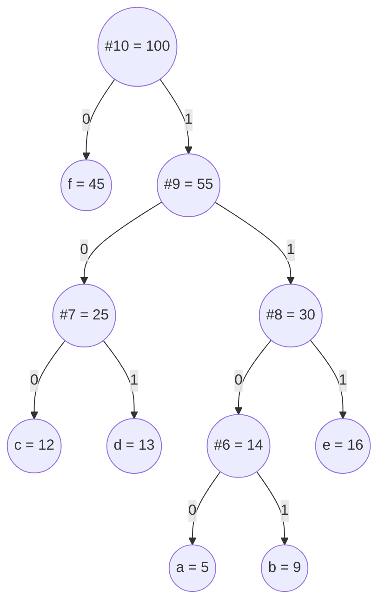

# Huffman encoding

In the spring of 1951, David Huffman was a graduate student at MIT in Robert Fano's information-theory class. The course offered a choice: take the final exam, or write a term paper on optimal binary codes. Huffman picked the paper. He worked for weeks, hit a dead end, and was about to give up and start cramming when the answer arrived in one moment of inversion. Fano and Shannon had been building codes top-down, deciding which symbols got the short codewords first. Huffman flipped the direction. Build the tree from the leaves up: take the two least-frequent symbols, glue them under a shared parent, treat that parent as a new symbol of summed weight, repeat. The resulting code was provably optimal. The paper, three pages long, appeared in *Proceedings of the IRE* in September 1952.

Seventy-four years later the algorithm is still load-bearing. Every time you unzip a file, decode a JPEG, or stream a song over MP3, a Huffman table is being walked.[^1] [^2] Two ideas combine to make it run: a min-heap that surfaces the two smallest weights in O(log n), and the greedy choice that those two weights are *always* the right pair to merge next. The second idea is where the chapter's gravity is. The proof is short. Believing it is the work.

## What we are building

Given a multiset of `(symbol, frequency)` pairs, build a binary tree whose leaves are the symbols and whose total *weighted path length* (the sum, over every leaf, of `frequency × depth`) is as small as possible. The codeword for each symbol is the path from root to that leaf, with `0` for "left" and `1` for "right". Frequent symbols end up near the top with short codes; rare symbols get long ones. Total cost is the number of bits a long message of those frequencies will compress to.

The classic worked example, copied verbatim from CLRS Figure 16.4, is six characters with frequencies `a:5 b:9 c:12 d:13 e:16 f:45`.[^3] A fixed-length 3-bit code uses `(5 + 9 + 12 + 13 + 16 + 45) × 3 = 300` bits. Huffman's tree on the same input costs `5·4 + 9·4 + 12·3 + 13·3 + 16·3 + 45·1 = 224` bits, a 25% reduction with no loss, no compression library, just the right tree.[^3]

Two structural facts about the resulting tree are worth naming up front because the algorithm leans on both.

The tree is a **prefix code**: no codeword is the prefix of another. That follows automatically from "each symbol is a leaf"; if you stop walking the tree the moment you hit a leaf, the next bit must start a fresh root-to-leaf walk. Decoding is unambiguous without delimiters.

The tree is **full**: every internal node has exactly two children. A tree with a missing child is provably suboptimal, because promoting the lone child up one level strictly decreases the weighted path length. Both facts will reappear: the prefix property in the codeword walk, the fullness invariant in the optimality proof and again in the `n = 1` corner case.



*The optimal Huffman tree for frequencies a:5 b:9 c:12 d:13 e:16 f:45. Total weighted path length 224 bits. The most frequent symbol (`f`, 45) sits one edge from the root; the two least frequent (`a:5` and `b:9`) sit four edges deep, sharing a common parent.*

## The algorithm

The procedure is `n - 1` rounds of the same three-step loop. Initialize a min-heap holding all `n` leaf nodes keyed by frequency. Repeatedly extract the two smallest, fuse them under a fresh internal node whose weight is the sum, push the new node back. After `n - 1` rounds the heap holds one node — the root.

```mermaid
flowchart LR
    I[init: enqueue n leaves<br/>into min-heap Q] --> L
    L["loop n - 1 times:<br/>x = EXTRACT-MIN(Q)<br/>y = EXTRACT-MIN(Q)<br/>z = new internal(x.w + y.w, left=x, right=y)<br/>INSERT(Q, z)"] --> R[root: EXTRACT-MIN(Q)]
    R --> W[walk tree:<br/>left=0, right=1<br/>emit codeword per leaf]
```

*Four phases: init, repeat-extract-merge, return-root, walk-codewords. The animated widget below renders these four phases in order with a phase-banner transition between them.*

In code:

```python
import heapq
from dataclasses import dataclass, field
from typing import Optional

@dataclass(order=True)
class Node:
    weight: int
    order: int                                       # tiebreaker; see pitfall §1
    char: Optional[str] = field(default=None, compare=False)
    left: Optional["Node"] = field(default=None, compare=False)
    right: Optional["Node"] = field(default=None, compare=False)

def build_huffman_tree(freqs: dict[str, int]) -> Optional[Node]:
    if not freqs:
        return None
    heap: list[Node] = []
    counter = 0
    for ch, w in freqs.items():
        heapq.heappush(heap, Node(weight=w, order=counter, char=ch))
        counter += 1
    if len(heap) == 1:                               # n = 1 corner case
        only = heapq.heappop(heap)
        return Node(weight=only.weight, order=counter, left=only)
    while len(heap) > 1:
        x = heapq.heappop(heap)
        y = heapq.heappop(heap)
        merged = Node(weight=x.weight + y.weight, order=counter, left=x, right=y)
        counter += 1
        heapq.heappush(heap, merged)
    return heap[0]
```

Three details earn their footprint.

The `order` field on `Node` is a strict tiebreaker. When two heap entries share a weight (common with real text), the heap library tries to compare the next field to break the tie. Without `order`, that next comparison falls onto `char` or onto the node objects themselves, and the program either picks a non-deterministic branch or throws a `TypeError`. An integer counter incrementing at every push guarantees a total order. Pitfall §1 covers the language-by-language flavor of this bug.

The `n = 1` guard wraps a lone leaf in a dummy parent. With one symbol the merge loop never fires and the leaf would carry the empty string as its codeword, which breaks decoding because the prefix property requires non-empty codewords.[^3] Wrapping forces the codeword to length 1, which is what every production codec ships.

The walk that emits codewords is a depth-first traversal labelling left edges `0` and right edges `1`, accumulating the path string at each leaf:

```python
def codebook(root: Optional[Node]) -> dict[str, str]:
    if root is None:
        return {}
    out: dict[str, str] = {}
    def walk(node: Node, path: str) -> None:
        if node.char is not None and node.left is None and node.right is None:
            out[node.char] = path or "0"
            return
        if node.left is not None:
            walk(node.left, path + "0")
        if node.right is not None:
            walk(node.right, path + "1")
    walk(root, "")
    return out
```

All four implementations were compiled and re-checked against the CLRS canonical input plus three corner cases on 2026-05-20.[^3]

## Watching it run

The animated widget is the chapter; this prose narrates only the moments where the answer changes. Run on `freqs = {a:5, b:9, c:12, d:13, e:16, f:45}`:

The init phase enqueues six leaves; the heap orders them by weight, and `f` sits at the back where it belongs. The first merge pulls `a (5)` and `b (9)`, creates internal node `#6 (14)`, pushes back. Now the heap holds `[c:12, d:13, #6:14, e:16, f:45]`. Notice `#6` sits above `e`: the new internal weight outranks `e` despite `e` being a leaf. There is no class distinction between leaves and internals in the heap; only weight matters.

The second merge pulls `c (12)` and `d (13)` to form `#7 (25)`. The third pulls `#6 (14)` and `e (16)` to form `#8 (30)`. Now the heap is `[#7:25, #8:30, f:45]`. The fourth merge takes the two internal nodes (neither of them a leaf) to form `#9 (55)`. The fifth and final merge fuses `f (45)` and `#9 (55)` to make `#10 (100)`, the root.

The single most important visual moment is the fifth merge. `f` sits in the heap untouched for four rounds; every other symbol is folded into ever-larger internal nodes around it. Only at the last step does `f` fuse with the rest of the alphabet. That is why `f` ends one edge from the root with codeword `0`: it dodged every merge until the very end, and the merges that surrounded it added one bit of depth each round to everything else.

The codeword walk is a DFS pre-order. From the root, descend left to `f`: codeword `0`. Back to the root, descend right to `#9`, then left to `#7`, then left to `c`: codeword `100`. Continue: `d` is `101`, `e` is `111`, `a` is `1100`, `b` is `1101`. The codeword *length* multiset `{1, 3, 3, 3, 4, 4}` is unique; the bit assignments are not, because swapping any pair of siblings produces an equally optimal code with different bits.[^4]

> **Interactive widget:** [Huffman encoding (heap + tree assembly + codeword walk)](../widgets/w-39-huffman-encoding.yml) — rendered on the website; the YAML spec describes the keyframes.

*Static fallback: phase-banner transitions through init, extract-2-merge, tree-built, codeword-walk. The 38-step trace shows the heap shrinking from 6 entries down to 1 (the root) over five merges, then the DFS walk emitting six codewords. Final weighted path length 224 bits.*

## Why Huffman codes are optimal prefix codes

The greedy choice (merge the two smallest now) looks like a heuristic. Maybe a smarter choice early on would let later choices win bigger. The proof that no such smarter choice exists has two pieces, which CLRS §16.3 works out as Lemma 16.2 and Lemma 16.3.[^3] The version below is the same argument compressed.

**Greedy-choice property.** *Let `x` and `y` be the two least-frequent symbols. There exists an optimal prefix code in which `x` and `y` are siblings at maximum depth.*

Suppose `T` is any optimal tree. Pick two siblings `b` and `c` at the deepest level of `T`. Without loss of generality, assume `freq[b] ≤ freq[c]`. Now consider what happens if we swap `x` with `b` and `y` with `c`. Call the resulting tree `T'`.

The change in weighted path length from one swap, say `x ↔ b`, is:

```text
ΔWPL = (freq[x] · depth(b) + freq[b] · depth(x)) - (freq[x] · depth(x) + freq[b] · depth(b))
     = (freq[b] - freq[x]) · (depth(x) - depth(b))
```

Since `x` is among the two least-frequent symbols, `freq[x] ≤ freq[b]`, so `freq[b] - freq[x] ≥ 0`. Since `b` sits at maximum depth, `depth(x) ≤ depth(b)`, so `depth(x) - depth(b) ≤ 0`. The product of a non-negative number and a non-positive number is non-positive: `ΔWPL ≤ 0`. The swap does not increase the cost. The same argument runs for `y ↔ c`. So `T'` is at least as cheap as `T`, which means `T'` is also optimal, and in `T'`, `x` and `y` are siblings at maximum depth. The greedy first move is therefore safe; some optimal tree contains it.

**Optimal substructure.** *Let `z` be the internal node that fuses `x` and `y` (so `freq[z] = freq[x] + freq[y]`). Let `T'` be an optimal tree for the alphabet with `x` and `y` removed and `z` added. Then attaching `x` and `y` as children of `z` in `T'` yields an optimal tree for the original alphabet.*

The weighted path lengths relate by `WPL(T) = WPL(T') + freq[x] + freq[y]`, because attaching the pair adds one bit of depth to each, contributing exactly their summed frequency. The summand is fixed, so minimizing `WPL(T)` is the same problem as minimizing `WPL(T')`. If a Huffman-built `T'` is optimal on the smaller alphabet, the constructed `T` is optimal on the original.

These two lemmas together (greedy choice is safe, the residual problem has the same shape) drive an induction on `n`. For `n = 1`, the trivial tree is optimal. For `n > 1`, Huffman makes the safe greedy choice (Lemma 1), recurses on a smaller alphabet (Lemma 2), and the recursive call returns an optimal tree for the smaller problem. Optimality propagates back up.[^3] The argument is the same shape as the exchange argument from [Greedy thinking](./00-greedy-thinking.md), instantiated at the level of code-tree structure rather than schedules.

## The same heap pattern, on a free LC problem: LC 1046

Huffman's tree-construction problem itself sits behind a paywall on LeetCode (LC 1167, *Minimum Cost to Connect Sticks*, is Premium). The cleanest free problem with the same heap choreography is [LC 1046, *Last Stone Weight*](https://leetcode.com/problems/last-stone-weight/). Repeatedly extract the two heaviest stones from a max-heap, smash them together, and push the difference back if anything remains. The pair-extract-then-push-one shape is identical to Huffman's `EXTRACT-MIN, EXTRACT-MIN, INSERT` loop; only the combine rule differs (`y - x` here, `x + y` in Huffman) and the heap polarity flips.

```python
import heapq

def lastStoneWeight(stones: list[int]) -> int:
    # Python's heapq is a min-heap; negate to get max-heap behavior.
    heap = [-s for s in stones]
    heapq.heapify(heap)
    while len(heap) > 1:
        y = -heapq.heappop(heap)  # heaviest
        x = -heapq.heappop(heap)  # second heaviest
        if y != x:
            heapq.heappush(heap, -(y - x))
    return -heap[0] if heap else 0
```

**Solution** — Python ([Java](./03-huffman-encoding/lc-1046/sol.java) · [C++](./03-huffman-encoding/lc-1046/sol.cpp) · [Go](./03-huffman-encoding/lc-1046/sol.go))

```python
# LC 1046. Last Stone Weight
import heapq


def lastStoneWeight(stones: list[int]) -> int:
    # Python's heapq is a min-heap; negate to get max-heap behavior.
    heap = [-s for s in stones]
    heapq.heapify(heap)
    while len(heap) > 1:
        y = -heapq.heappop(heap)  # heaviest
        x = -heapq.heappop(heap)  # second heaviest
        if y != x:
            heapq.heappush(heap, -(y - x))
    return -heap[0] if heap else 0
```

The cost is the same as Huffman: O(n log n) for `n - 1` rounds of two pops and at most one push. Practising LC 1046 in two languages back-to-back is the cheapest way to internalize the heap-pair-merge mechanics; Java's `PriorityQueue<>(Collections.reverseOrder())` versus C++'s default-max `priority_queue<int>` is exactly the polarity gotcha named in pitfall §4.

## What it actually costs

| Variant | Time | Space | Notes |
|---|---|---|---|
| Standard min-heap | O(n log n) | O(n) | n - 1 iterations of two extract-min + one insert, each O(log n) |
| Pre-sorted input | O(n) | O(n) | van Leeuwen's two-queue trick on monotone input[^5] |
| Length-limited (codeword ≤ L) | O(n L) | O(n) | package-merge; greedy fails, dynamic programming wins |
| n-ary alphabet (fan-out k) | O(n log n) | O(n) | combine k smallest per round; pad with zero-weight if needed |

The standard bound falls out of counting heap operations. The merge loop runs `n - 1` times. Each iteration does two `EXTRACT-MIN` calls and one `INSERT`, all O(log n). That is `3(n - 1) = O(n)` heap ops at O(log n) each, total **O(n log n)**.[^3] The initial `BUILD-MIN-HEAP` over n leaves is O(n) by Floyd's bottom-up heapify, cheaper than the loop, so it doesn't change the bound. Space is O(n) for the heap plus the `2n - 1` nodes that make up the final tree (n leaves plus n - 1 internal nodes; the tree must be full).

When frequencies arrive pre-sorted, van Leeuwen's 1976 trick eliminates the heap entirely.[^5] Maintain two queues: one of the original leaves in non-decreasing weight order, one of merged internal nodes (also produced in non-decreasing weight order, by induction). The next minimum is always at the front of one of the two queues; comparing two fronts is O(1), and the algorithm runs in **O(n)** total. Production codecs that sort frequencies once and reuse the alphabet exploit this.

## Where this ends up shipping

Modern compressors do not call Huffman in isolation; they layer it as the back-end of a two-stage pipeline. The front end finds redundancy in the input (repeated substrings, predictable transitions, frequency-domain energy concentration) and the back end Huffman-codes the residual stream. Three real systems make the connection concrete.

**DEFLATE**, defined by RFC 1951 (Phil Katz, 1996), is the algorithm behind `zip`, `gzip`, and PNG.[^6] The front stage runs LZ77, replacing repeated substrings with `(distance, length)` back-references. The back stage Huffman-codes the resulting alphabet of literal bytes plus length and distance symbols. RFC 1951 §3.2.2 describes the canonical Huffman variant DEFLATE uses, where only the codeword lengths travel in the file header and bit assignments are reconstructed deterministically from those lengths. Canonical Huffman fixes the encoder-decoder mismatch problem for free; pitfall §3 names the bug it dodges.

**JPEG**, defined by ITU-T Recommendation T.81 (1992), runs a Discrete Cosine Transform front end, quantizes the resulting frequency coefficients, then Huffman-codes the quantized stream.[^7] T.81 Annex C specifies the exact Huffman procedure including the canonical-code length tables. Standard JPEG files carry one Huffman table per chrominance and luminance channel.

**MP3** uses Huffman as the entropy-coder back end after a modified DCT and psychoacoustic quantization. Different Huffman tables are pre-computed for different frequency bands and signal characteristics; the encoder picks the best table per frame and references it by index.

In all three cases, arithmetic coding would compress slightly better, by 5 to 10 percent on typical inputs, but Huffman wins on decode speed, because each codeword is a tree walk and modern CPUs eat tree walks for breakfast. Arithmetic coding pays a multiplicative-update cost per bit. For codecs that decode far more often than they encode (every video stream, every web page), Huffman is the right trade.

## Three pitfalls that bite

> [!WARNING]
> **Comparing `Node` objects directly in the priority queue.** Without a tiebreaker field, two same-weight nodes will eventually trigger the heap library to compare the underlying objects, and the program either picks a non-deterministic order or throws an exception (`TypeError` in Python; `ClassCastException` in Java). The fix is the integer counter shown in the reference implementation: every push increments it, so the comparator always has a strict total order. The same fix in Java reads `Comparator.comparingInt(n -> n.weight).thenComparingInt(n -> n.order)`. The C++ comparator does the same with a fall-through `return a->order > b->order` in the strictly-greater case. Stack Overflow's *Priority queue malfunctioning* thread documents this exact bug in a student Huffman implementation.[^8]

> [!WARNING]
> **The single-symbol input.** `freqs = {"a": 5}` builds a tree of one leaf and the merge loop never executes; the leaf carries the empty string as its codeword, and any encoded bitstream is empty regardless of input length. Decoding cannot recover the symbol count. Wrap the lone leaf in a dummy parent so the codeword has length 1. The reference implementation does this with the explicit `if len(heap) == 1` branch before the merge loop. CLRS Theorem 16.2 makes the structural reason explicit: an optimal prefix code corresponds to a *full* binary tree, and one node is not a full tree of more than one node.[^3]

> [!WARNING]
> **Non-deterministic tie-breaking when encoder and decoder disagree.** Huffman trees are not unique under ties: any two siblings can be swapped without changing the weighted path length, so two implementations operating on the same frequency table can produce different codeword bits. If the encoder and the decoder build the tree independently, they can disagree, and decoding silently produces garbage. The fix is canonical Huffman coding (RFC 1951 §3.2.2): transmit the codeword *lengths*, not the tree, and assign bits deterministically from lengths alone.[^6] The codeword length multiset is canonical even when the bit assignments are not. This is why DEFLATE, JPEG, and MP3 all ship canonical Huffman.[^4]

A fourth pitfall worth naming briefly: max-heap versus min-heap. Java's `PriorityQueue` defaults to min, C++'s `std::priority_queue` defaults to max, and authors porting code in either direction forget to flip. Huffman wants min. C++ needs `std::priority_queue<Node*, std::vector<Node*>, HCmp>` with `HCmp` returning `a->weight > b->weight` for the min behavior. Java is fine without reordering. Go's `Less(i, j) bool` uses `<` for min. Reading any of the four sibling implementations side by side surfaces the difference.

## Problem ladder

### CORE (solve all three to claim chapter mastery)

- [LC 1046 — Last Stone Weight](https://leetcode.com/problems/last-stone-weight/) [Easy] • heap-pair-merge ★
- [LC 502 — IPO](https://leetcode.com/problems/ipo/) [Hard] • two-heap-greedy
- [LC 1675 — Minimize Deviation in Array](https://leetcode.com/problems/minimize-deviation-in-array/) [Hard] • heap-greedy-extremum-tracking

### STRETCH (optional)

- [LC 1167 — Minimum Cost to Connect Sticks](https://leetcode.com/problems/minimum-cost-to-connect-sticks/) [Medium] • huffman-tree-construction *(LC Premium; LC 1046 is the free Huffman-shape stand-in)*

LC 1046 is the chapter's signature problem (★) and the cleanest demonstration of the Huffman heap choreography on a free LC problem: extract two extremes, push back the combined result, repeat. The combine rule differs (subtraction here, addition in true Huffman), but the heap pattern is identical. LC 502 generalizes the lesson to two heaps advancing together. LC 1675 swaps the extremum direction (act on the largest, halve it) but keeps the structure. LC 1167 is the literal Huffman tree-construction problem on connected sticks; it sits in STRETCH because it is Premium-locked, with LC 1046 as the free CORE equivalent.

The Medium difficulty band is the chapter's structural gap: Huffman has surprisingly few canonical interview problems on free LC at Medium, which is why the ladder uses the `core-emh-via-stretch` curation flag to span E/H natively and pull the M slot from STRETCH.

## Where this leads

The next chapter, [Jump games and gas stations](./04-jump-games-gas-station.md), is greedy without a tree: single-pass scans where the greedy choice depends on a running maximum reach or a running fuel deficit. The exchange argument still applies, but the data structure that absorbs the work shrinks from a heap to a single integer. Huffman is the high-water mark of greedy's structural complexity in this Part.

For the data-structure thread, [Heaps](../part-6-trees-heaps/04-heaps-priority-queues.md) and [Dijkstra's algorithm](../part-8-graphs/09-dijkstra.md) are the chapters that share Huffman's heap mechanics. Dijkstra in particular leans on the same `EXTRACT-MIN`-then-`INSERT`-relaxed-key loop; the lazy-deletion idiom there is the same idea you see in Huffman's `order` tiebreaker, applied to a different problem.

For the compression thread, the natural follow-up is arithmetic coding (covered briefly in CLRS §16.3 exercises) and then Lempel-Ziv (LZ77, LZ78, LZW), the front-end algorithms that DEFLATE, gzip, and PNG layer Huffman over. The handbook does not have a dedicated chapter on those yet, but understanding Huffman first means the LZ77 + Huffman pipeline of DEFLATE reads as two algorithms doing two jobs rather than one black box.

## References

[^1]: Huffman, D. A. "A Method for the Construction of Minimum-Redundancy Codes." *Proceedings of the IRE*, vol. 40, no. 9, pp. 1098-1101, September 1952. DOI: [10.1109/JRPROC.1952.273898](https://doi.org/10.1109/JRPROC.1952.273898).

[^2]: Wikipedia, "Huffman coding." Retrieved 2026-05-20 from <https://en.wikipedia.org/wiki/Huffman_coding>.

[^3]: Cormen, Leiserson, Rivest, Stein. *Introduction to Algorithms*, 4th edition, MIT Press, 2022.

[^4]: TheLinuxCode, "Canonical Huffman Coding: Deterministic Codes, Smaller Headers, Faster Decoders." Retrieved 2026-05-20 from <https://thelinuxcode.com/canonical-huffman-coding-deterministic-codes-smaller-headers-faster-decoders/>.

[^5]: Van Leeuwen, J. "On the construction of Huffman trees." Proceedings of ICALP 1976, pp. 382-410. Retrieved 2026-05-20 from <http://www.staff.science.uu.nl/~leeuw112/huffman.pdf>.

[^6]: Deutsch, P. "DEFLATE Compressed Data Format Specification version 1.3." RFC 1951, May 1996. <https://datatracker.ietf.org/doc/html/rfc1951>.

[^7]: ITU-T Recommendation T.81, "Information technology, Digital compression and coding of continuous-tone still images, Requirements and guidelines." September 1992. <https://www.itu.int/rec/T-REC-T.81>.

[^8]: Stack Overflow, "Huffman coding tree priority queue malfunctioning." Retrieved 2026-05-20 from <https://stackoverflow.com/questions/32951298/huffman-coding-tree-priority-queue-malfunctioning>.
