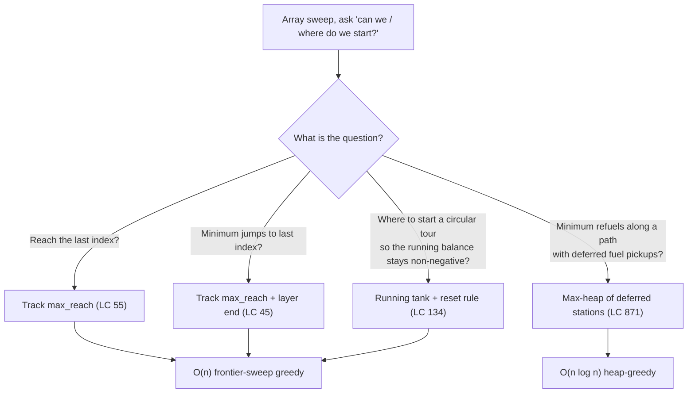
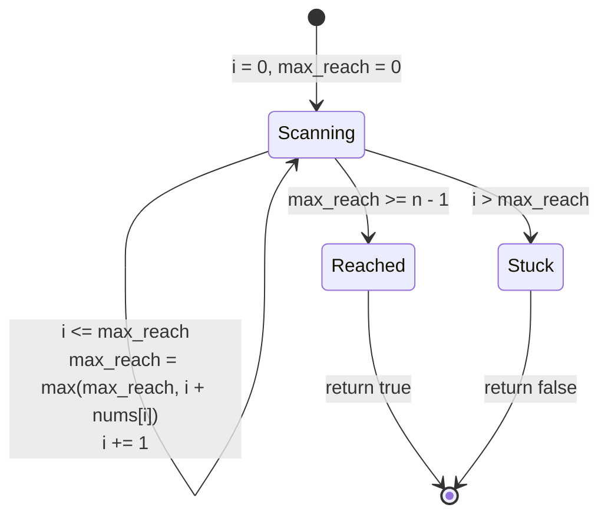
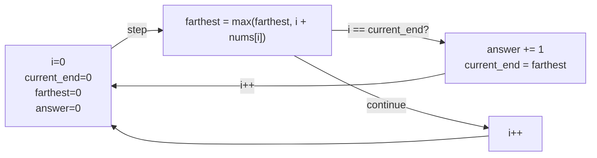
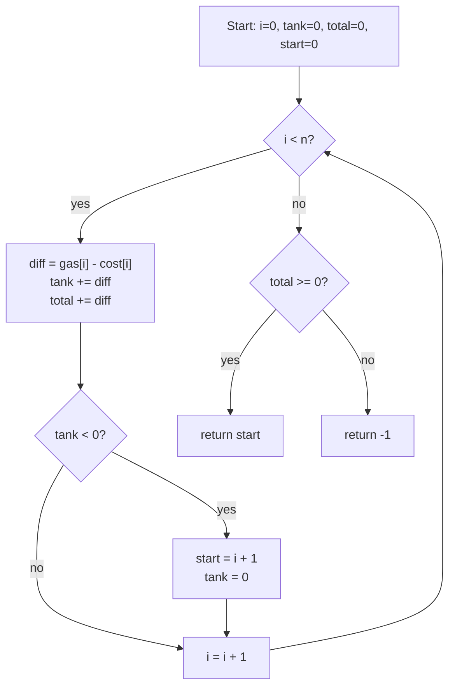

# Jump games and gas station

Two array problems, two answers that look like they should cost `O(n²)`, two greedy passes that finish in `O(n)`. The trick is the same shape both times: walk the array once, keep a single running quantity, and let that one number do all the bookkeeping a brute-force search would have done by enumerating every choice. The trick lands twice in this chapter because the two problems disguise it differently. *Jump Game* (LeetCode 55) hides it inside reachability. *Gas Station* (LeetCode 134) hides it inside a circular-tour validity check whose correctness is non-obvious enough that most candidates rederive the brute force on the whiteboard before they accept the linear answer.

This chapter is the chapter where greedy stops being a slogan and starts being a proof. Each of the two problems comes with an exchange argument, a one-paragraph reason why the eager local choice never closes off a globally better outcome. The Gas Station argument in particular is the one a strong interviewer pushes you on. Be ready to draw it.

## Locating this pattern



*Four greedy variants on a single array sweep. Three are pure frontier-sweep and run in linear time; the fourth swaps in a max-heap when the resource is deferred rather than spent immediately.*

The pattern signal is short. If the input is a non-negative array of jump lengths and the question is reachability or jump-count, you want a one-pass scan that maintains the farthest-reachable index. If the input is a circular array of gain-minus-cost pairs and the question is "where do I start", you want a one-pass scan that maintains a running tank and resets the candidate start whenever the tank dips below zero. Both belong to a family the textbook calls *frontier-sweep greedy*: the running quantity *is* the algorithm's frontier, and the proof of correctness is always the same exchange argument from [Greedy thinking and the exchange argument](./00-greedy-thinking.md).

## Why the obvious approach burns

The first problem is LC 55, *Jump Game*. You are given a non-negative integer array `nums` where `nums[i]` is the maximum forward jump from index `i`. Starting at index 0, can you reach the last index? Sample: `nums = [2, 3, 1, 1, 4]`, expected answer `True`. One valid path is `0 → 1 → 4`: from index 0 jump 1 step (within the budget of 2), from index 1 jump 3 steps (within 3), land at index 4 which is the last. Counter-sample: `nums = [3, 2, 1, 0, 4]`, expected `False`. Every path lands on index 3, where the budget is 0, and the gap before index 4 is unbridgeable.

The honest first attempt asks: from each index, which jump length should I pick? Without a hint, the only safe bet is to try them all. The brute force is a recursive explosion: from each position, try every jump length up to `nums[i]`, recurse, and OR the results.

```python
# Brute force: O(2^n) in the worst case. The wall we are replacing.
def can_jump_brute(nums):
    n = len(nums)

    def reachable(i):
        if i >= n - 1:
            return True
        for step in range(1, nums[i] + 1):
            if reachable(i + step):
                return True
        return False

    return reachable(0)
```

Correct on every input. On `nums = [25, 25, 25, ..., 25]` with `n = 50`, the recursion fans out by 25 at every level for tens of levels and the branching never collapses; the call tree is exponential. Memoizing the recursion brings it down to `O(n²)` because each index `i` does up to `n` work probing destinations, much better, still quadratic.

The second problem hides the same waste behind different prose. LC 134, *Gas Station*: you are given two non-negative integer arrays `gas` and `cost`, each of length `n`, arranged in a circle. Station `i` offers `gas[i]` units of fuel; the road from `i` to the next station consumes `cost[i]`. With an empty tank, find a starting station that lets you complete a full lap, or return `-1` if no such station exists. The brute force tries every start.

```python
# Brute force: O(n^2). Try every start, simulate a full lap each time.
def can_complete_circuit_brute(gas, cost):
    n = len(gas)
    for start in range(n):
        tank = 0
        for k in range(n):
            i = (start + k) % n
            tank += gas[i] - cost[i]
            if tank < 0:
                break
        else:
            return start
    return -1
```

Correct, and at LC 134's bound `n ≤ 10⁵` it does roughly 10¹⁰ operations, well past any time limit. The fix is to notice that simulating from a fresh start is throwing away everything the previous simulation just learned. When a lap from station `s` fails at index `i`, every station between `s` and `i` is also a doomed start. The next candidate is `i + 1`. That single observation is the chapter.

## The pattern

Both problems collapse to a one-pass scan that maintains a single running scalar. For LC 55 the scalar is `max_reach`, the farthest index any prefix of decisions could reach. The loop invariant is: at the top of iteration `i`, every index `0..i-1` is reachable, and `max_reach` is at least `i`. If that invariant ever fails, meaning `i` itself exceeds `max_reach`, the destination is unreachable and the scan stops. Otherwise the scan absorbs `nums[i]` into `max_reach` and moves on.

```python
def can_jump(nums):
    max_reach = 0
    n = len(nums)
    for i in range(n):
        if i > max_reach:
            return False
        if i + nums[i] > max_reach:
            max_reach = i + nums[i]
        if max_reach >= n - 1:
            return True
    return True
```

**Solution** — Python ([Java](./04-jump-games-gas-station/lc-55/sol.java) · [C++](./04-jump-games-gas-station/lc-55/sol.cpp) · [Go](./04-jump-games-gas-station/lc-55/sol.go))

```python
# LC 55. Jump Game
# [(2,3,1,1,4)->True, (3,2,1,0,4)->False, [0]->True, [1]->True, [2,0,0]->True].
# Greedy max-reach frontier sweep. O(n) time, O(1) space.
from typing import List


def can_jump(nums: List[int]) -> bool:
    """LC 55. Can we reach the last index with the given jump-length budget?"""
    max_reach = 0
    n = len(nums)
    for i in range(n):
        if i > max_reach:
            return False
        if i + nums[i] > max_reach:
            max_reach = i + nums[i]
        if max_reach >= n - 1:
            return True
    return True
```

Two lines deserve attention before the worked example.

The reachability test is `if i > max_reach`, not `if i >= max_reach`. Equality is fine: `max_reach == i` means the sweep just barely arrived, and the current index is reachable. Strict inequality is the failure condition because it's the case where every path stalled before `i` and no later index can recover. Off-by-one in the other direction (`>=`) would falsely fail the input `nums = [0]`, where the loop sees `i == 0`, `max_reach == 0`, and the answer is trivially `True`.

The early termination `max_reach >= n - 1` is a constant-factor optimization, not a correctness requirement. The loop would terminate correctly without it: eventually `i` would walk past every index and the function would return `True`. With it, the scan exits the first time the frontier covers the destination, which on inputs like `nums = [10000, ...]` is step zero. The exit also makes the `i > max_reach` check redundant for any future iteration, since once `max_reach >= n - 1` the invariant `i ≤ max_reach` holds for every remaining `i`.

The exchange argument that makes the greedy correct is short. Suppose some non-greedy schedule reaches an index `j` that the greedy schedule cannot. At every step before reaching `j`, the greedy's `max_reach` was at least as large as any alternative schedule's reachable set, because both schedules had access to the same `nums[i]` values and `max_reach` is taken to be the maximum. The reachable set is monotone: any index reachable from a smaller frontier is reachable from a larger one. So the greedy's reachable set always contains the alternative schedule's, and `j` is reachable by the greedy too, contradicting the supposition. The greedy choice doesn't sacrifice anything, so it can't lose.[^1]

## Worked example: LC 55 on `nums = [2, 3, 1, 1, 4]`

Seed: `max_reach = 0`, `n = 5`, target index `n - 1 = 4`.

**Index 0, `nums[0] = 2`.** `i = 0`, not greater than `max_reach = 0`. Update `max_reach = max(0, 0 + 2) = 2`. Termination check: `2 >= 4`? No. Continue.

**Index 1, `nums[1] = 3`.** `i = 1`, not greater than `max_reach = 2`. Update `max_reach = max(2, 1 + 3) = 4`. Termination check: `4 >= 4`? Yes. Return `True`.

Two iterations, done. The same scan on the failing input `nums = [3, 2, 1, 0, 4]` runs four iterations, each updating `max_reach` to 3 (which is the largest reach the prefix of decisions can achieve) before stalling. At iteration 4, `i = 4 > max_reach = 3`, the invariant breaks, return `False`.

The state machine for the scan is a single forward pointer with two terminating transitions:



*The frontier-sweep state machine: a single forward pointer i advances under the invariant i ≤ max_reach, expanding the frontier each step until either the last index is covered or the frontier is overtaken.*

## Counting jumps without revisiting: BFS layers in O(n)

LC 45, *Jump Game II*, replaces the boolean question with a count: how many jumps does it take to reach the last index, assuming reachability is given? The reachable set still grows the same way, but now you have to count the layer transitions explicitly.

The clean way to see this is BFS over the implicit graph where each index has edges to `i + 1, i + 2, ..., i + nums[i]`. BFS explores nodes layer by layer and each layer's depth is one more jump than the previous. On this graph BFS would normally cost `O(n²)` because each layer enumerates up to `n` neighbors. But there's no need to enumerate neighbors one by one. The current BFS layer occupies a contiguous interval `[layer_start, layer_end]` of indices, and the next layer's right edge is `max(i + nums[i])` over every `i` in the current interval, exactly the `farthest` value we already know how to maintain.

```python
def jump(nums):
    answer = 0
    current_end = 0
    farthest = 0
    for i in range(len(nums) - 1):
        if i + nums[i] > farthest:
            farthest = i + nums[i]
        if i == current_end:
            answer += 1
            current_end = farthest
    return answer
```

The off-by-one to internalize: `answer` increments only at the layer boundary `i == current_end`, not every time `farthest` moves. Incrementing on every `farthest` update is the canonical wrong answer; it counts every reach extension as a separate jump even when the same physical jump from index `i` could have produced multiple frontier advances along the way. The correct invariant is: `answer` is the number of jumps used to reach `current_end`, and the new layer starts the moment `i` exits the previous one.[^2]



*The implicit-BFS skeleton for Jump Game II: farthest is the next layer's right edge, current_end is the previous layer's edge, and answer increments only when i exits the current layer.*

## Gas Station: the second archetype

The second problem of the chapter — LC 134 — is the cleanest demonstration of the exchange argument in the book. The greedy is short. The proof is the chapter.

```python
def can_complete_circuit(gas, cost):
    total = 0
    tank = 0
    start = 0
    for i in range(len(gas)):
        diff = gas[i] - cost[i]
        total += diff
        tank += diff
        if tank < 0:
            start = i + 1
            tank = 0
    return start if total >= 0 else -1
```

```python
# LC 134. Gas Station
# Single-pass exchange-argument greedy: maintain running tank from a candidate
# start, reset to i+1 whenever the tank dips below zero, and use the
# unconditional total as the existence guard.
# O(n) time, O(1) space. Reference: Python only at this rung; Java/C++/Go
# four-language coverage deferred per research's verification log.
from typing import List


def can_complete_circuit(gas: List[int], cost: List[int]) -> int:
    """LC 134. Find a start from which the circular tour completes, or -1."""
    total = 0
    tank = 0
    start = 0
    for i in range(len(gas)):
        diff = gas[i] - cost[i]
        total += diff
        tank += diff
        if tank < 0:
            start = i + 1
            tank = 0
    return start if total >= 0 else -1
```

Two scalars do the work of the brute-force's outer loop. The `tank` is the running fuel from the current candidate start; the moment it dips below zero, every station from the candidate start through `i` is provably invalid, so the candidate jumps to `i + 1` and the tank resets. The `total` is the unconditional running sum across the whole array, used as the existence guard at the end.

The line `return start if total >= 0 else -1` is the load-bearing one and the easiest to omit. Without it, the algorithm returns whatever `start` happens to land on, which on a no-solution input is some index, not `-1`. On `gas = [2], cost = [3]` the reset rule advances `start` to 1 (= `n`), but the function would still return 1 if you forgot the existence guard. The guard catches this.

### Gas Station's invariant: total ≥ 0 implies a valid start exists

The greedy's correctness rests on two claims, both worth proving on paper before the next interview where this problem comes up.

**Claim 1.** The circular tour is feasible if and only if `total = Σ (gas[i] - cost[i]) ≥ 0`.

The forward direction is immediate: if a valid start `s` exists, then a complete lap from `s` accumulates a non-negative running balance at every step, including the final step, so the total balance is `≥ 0`. The reverse direction is what the algorithm relies on. Suppose `total ≥ 0`. Define the cumulative net gain `surplus[k] = Σ_{j=0..k} (gas[j] - cost[j])` for `k = 0, 1, ..., n - 1`. Let `min_i` be the index where `surplus[]` attains its minimum (any index, ties broken arbitrarily). The claim is that starting from `min_i + 1` works. To see why, walk the lap from `min_i + 1`. The running tank at any later index `k > min_i` is `surplus[k] - surplus[min_i] ≥ 0` because `min_i` is the minimum. The running tank at any earlier index `k ≤ min_i` (which the lap reaches after wrapping around) is `(total - surplus[min_i]) + surplus[k] = total + (surplus[k] - surplus[min_i]) ≥ total ≥ 0`. Every partial sum is non-negative, so the lap completes.[^3]

**Claim 2.** If during a single forward pass the running tank from candidate start `s` first goes negative at index `i`, then no index in `[s, i]` is a valid start, and the next viable candidate is `i + 1`.

Let `tank(s, j)` denote the running tank from start `s` at the moment we arrive at index `j`. By hypothesis, `tank(s, k) ≥ 0` for every `k` in `[s, i - 1]` (this is what made `s` the still-alive candidate up to `i`), and `tank(s, i) < 0`. Now consider any alternative start `s' ∈ (s, i]`. The relationship between the two is `tank(s, i) = tank(s, s' - 1) + tank(s', i)`. Rearranging: `tank(s', i) = tank(s, i) - tank(s, s' - 1)`. By the candidacy of `s` we have `tank(s, s' - 1) ≥ 0`, and by the failure at `i` we have `tank(s, i) < 0`. Subtracting a non-negative from a negative gives a negative. So `tank(s', i) < 0`, meaning the lap from `s'` also fails by index `i`. Every interior candidate is doomed, and the algorithm correctly skips ahead to `i + 1`.[^4]

Combining the two claims: the algorithm's single forward pass identifies a candidate start `start` such that no station in `[0, start - 1]` is valid, and the existence guard `total ≥ 0` then certifies that `start` itself is valid. The two-claim structure is the exchange argument applied to a circular sweep, and it's the reason the algorithm runs in `O(n)` instead of `O(n²)`.



*Two invariants, one pass: tank tracks the running balance from the current candidate start, total tracks the unconditional balance used as the existence guard at the end. The reset rule is the exchange argument's algorithmic form.*

## Worked example: LC 134 on `gas = [1,2,3,4,5], cost = [3,4,5,1,2]`

Seed: `total = 0`, `tank = 0`, `start = 0`.

| `i` | `gas[i] - cost[i]` | `tank` after | `total` after | `tank < 0`? | `start` after |
|---:|---:|---:|---:|:--:|---:|
| 0 | -2 | -2 | -2 | yes | 1 (reset, tank = 0) |
| 1 | -2 | -2 | -4 | yes | 2 (reset, tank = 0) |
| 2 | -2 | -2 | -6 | yes | 3 (reset, tank = 0) |
| 3 |  3 |  3 | -3 | no  | 3 |
| 4 |  3 |  6 |  0 | no  | 3 |

End of loop: `total = 0 ≥ 0`, so the answer is `start = 3`. A quick sanity check confirms: starting at station 3, tank goes `0 → 4 - 1 = 3 → 3 + 5 - 2 = 6 → 6 + 1 - 3 = 4 → 4 + 2 - 4 = 2 → 2 + 3 - 5 = 0`. Non-negative throughout, lap completes.

The first three steps are the reset rule firing on every index. Each one is an instance of Claim 2: starting at 0, 1, or 2 fails by step 0, 1, 2 respectively, so the candidate skips forward each time. Step 3 is where the candidate finally survives a step without going negative, and step 4 ratifies it. The cumulative-surplus picture from Claim 1 is also visible: `surplus[]` values across the array are `[-2, -4, -6, -3, 0]`, minimum at index 2, so the answer is `min_i + 1 = 3`. Same answer, two equivalent derivations.[^4]

## What it actually costs

| Variant | Time | Space | Notes |
|---|---|---|---|
| LC 55 max-reach | O(n) | O(1) | one pass; the loop is unconditional |
| LC 55 brute force | O(2ⁿ) worst, O(n²) memoized | O(n) | what we replaced |
| LC 45 BFS-layer | O(n) | O(1) | implicit BFS over a layered DAG |
| LC 134 single-pass | O(n) | O(1) | exchange-argument greedy |
| LC 134 brute force | O(n²) | O(1) | TLE at the LC `n ≤ 10⁵` cap |
| LC 871 heap-greedy | O(n log n) | O(n) | deferred-resource greedy[^5] |

The `O(n)` wall is fundamental for the three frontier-sweep variants: each index is examined exactly once and does `O(1)` work. There is no improvement available, because the algorithm's input itself is `n` numbers and any correct algorithm must read them all. CLRS's greedy-paradigm template (Chapter 15, *Greedy Algorithms*, in the 4th edition) gives the proof template that LC 55 and LC 134 both fit: the *greedy-choice property* (a globally optimal decision can be made without reconsidering subproblems already decided) plus *optimal substructure* (an optimal solution to the remainder of the problem still extends the early choices).[^6] Erickson's *Algorithms* Chapter 4 develops the same exchange-argument scaffold on different examples; the arguments in this chapter are instances of his template.[^7]

## When the pattern bends

### Min refuels with deferred fuel: max-heap greedy (LC 871)

LC 871, *Minimum Number of Refueling Stops*, is the closest extension of the gas-station archetype that doesn't fit a pure single-pass scan. You drive from 0 to `target` along a 1D path; stations along the way each offer a one-time fuel pickup, but you don't have to consume the fuel the moment you pass. You can defer the decision and "take" the pickup retroactively when the tank actually runs out. Minimize the count of stops.

The greedy is to defer everything as long as possible. As the car advances, push every station you pass onto a max-heap keyed by fuel volume. When the tank can no longer reach the next station (or the target), pop the largest pickup off the heap and pretend you took it back when you passed. If the heap is empty when you stall, return -1. The exchange argument: if any optimal schedule exists, swapping its earliest stop for the largest-yet-unused station never increases the count and never breaks reachability. That's the staying-ahead form of the proof.[^5]

The pattern's place in this chapter is to mark where pure linear-scan greedy ends. The moment a problem allows deferred resource use, you trade the `O(1)`-state scan for an `O(n log n)` heap-augmented one. The mechanics of the max-heap belong to [Heaps](../part-6-trees-heaps/04-heaps-priority-queues.md); the chapter's role here is naming the pattern signal, *deferred resource greedy*, and pointing at the next chapter that owns the data structure.

## Two pitfalls that bite

> [!WARNING]
> **LC 134 without the existence guard.** The reset rule alone is necessary but not sufficient. Code that returns `start` directly will return a non-negative integer even when no valid start exists, because the reset rule is happy to advance `start` past the last index. On `gas = [1, 2], cost = [2, 3]` the reset rule lands `start = 2 = n`, which is out of range; the canonical pattern `return start if total >= 0 else -1` catches this. Authors who mention the reset rule without the guard ship a wrong algorithm. The Medium write-up by Harshit Raj (2024) calls this the most common bug on LC 134.[^4]

> [!WARNING]
> **LC 45 incrementing on every `farthest` update.** It feels right to add a jump every time the frontier moves. It isn't right. The frontier moves continuously within a single BFS layer; only the *exit* of the layer corresponds to a physical jump. The correct invariant is `answer` increments only when `i == current_end`. AlgoMonster's walkthrough of LC 45 flags this as the canonical Jump Game II off-by-one.[^2]

A third pitfall worth a one-liner: LC 871 with a min-heap. Python's `heapq` is a min-heap by default, so `heappush(heap, fuel)` followed by `heappop(heap)` returns the *smallest* deferred station, exactly the wrong choice. The fix is to push `-fuel` and pop with sign-flip, or in C++/Java to use `priority_queue<int>` / `PriorityQueue<>(Collections.reverseOrder())`.[^5]

## Problem ladder

### CORE (solve all three to claim chapter mastery)

- [LC 55 — Jump Game](https://leetcode.com/problems/jump-game/) [Medium] • greedy-frontier-sweep ★
- [LC 45 — Jump Game II](https://leetcode.com/problems/jump-game-ii/) [Medium] • greedy-bfs-layer
- [LC 134 — Gas Station](https://leetcode.com/problems/gas-station/) [Medium] • greedy-circular-tour-reset *(reference: Python only)*

### STRETCH (optional)

- [LC 871 — Minimum Number of Refueling Stops](https://leetcode.com/problems/minimum-number-of-refueling-stops/) [Hard] • greedy-heap-deferred

The CORE three are all Medium per LeetCode's tagging, and the chapter's `core-emh-via-stretch` curation flag in the problem registry records the structural reason: the jump-game-greedy pattern has no canonical Easy in interview rotation. Patterns that arguably resemble this one at the Easy band, such as placing flowers (LC 605) or deleting columns to make sorted (LC 944), sit under different sub-patterns and would dilute the chapter signal. STRETCH supplies the Hard via LC 871, so combined CORE+STRETCH spans Medium plus Hard.

## Where this leads

The interval-scheduling chapter ([Interval scheduling and merging](./01-interval-scheduling.md), once it lands) carries the same exchange-argument template forward, but the greedy operates on sorted intervals rather than a forward sweep. The proof shape is identical; the data preparation is what changes.

Held-Karp's weighted-TSP generalization is the natural follow-up to LC 845's frontier sweep when edge weights stop being uniform. The bitmask-DP machinery for that lives in [Bitmask DP](../part-9-dynamic-programming/14-bitmask-dp.md); LC 134's circular structure is one constraint tweak away from a TSP variant where the candidate-start logic interacts with subset-coverage state. The chapters connect at the proof technique even when the algorithm shapes diverge.

## References

[^1]: Cormen, Leiserson, Rivest, Stein, *Introduction to Algorithms*, 4th ed., MIT Press, 2022.

[^2]: AlgoMonster, "45. Jump Game II — In-Depth Explanation," <https://algo.monster/liteproblems/45>.

[^3]: Cumulative-surplus formulation. Define `surplus[k] = Σ_{j=0..k} (gas[j] - cost[j])`. The argument that starting from `min_i + 1` works whenever `total = surplus[n - 1] ≥ 0` is folklore — it appears in interview prep materials and on the LC editorial — and is reconstructible from prefix-sum reasoning in two lines. The cnblogs treatment by Shepherd Gai (2020) restates the same identity in the algorithmic-loop form.

[^4]: Shepherd Gai, "A detailed explanation of leetcode 134: Gas Station," cnblogs.com, 2020-09-01, <https://www.cnblogs.com/shepherdgai/p/13599262.html>.

[^5]: walkccc, "871. Minimum Number of Refueling Stops," <https://walkccc.me/LeetCode/problems/871/>

[^6]: CLRS 4th ed., §15 (*Greedy Algorithms*), p. 417 onward. The two-property template — greedy-choice plus optimal-substructure — is the standard reference for proving that an exchange argument suffices.

[^7]: Jeff Erickson, *Algorithms*, 1st ed., self-published, jeffe.cs.illinois.edu, Chapter 4 (*Greedy Algorithms*), <https://jeffe.cs.illinois.edu/teaching/algorithms/book/04-greedy.pdf>.
