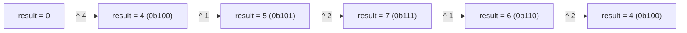
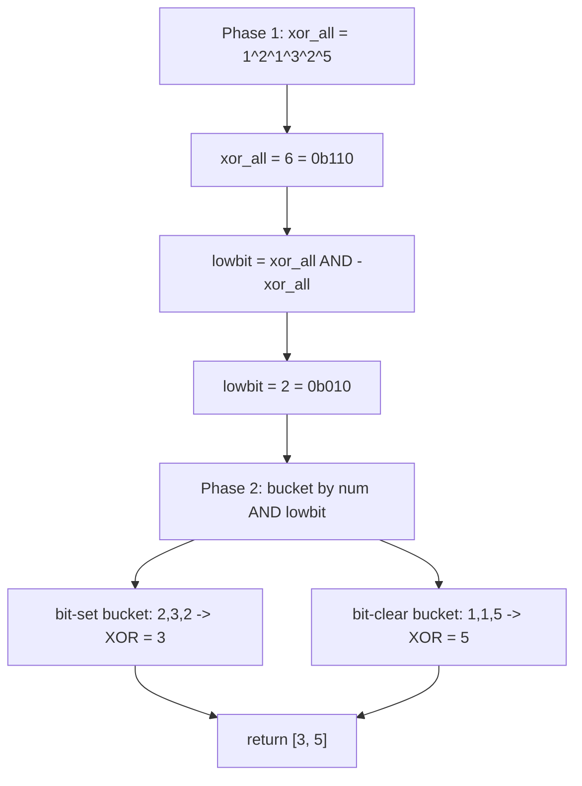

# XOR patterns

LC 136 (Single Number): an array where every value appears twice except one, return the lone value. Sample input `[4, 1, 2, 1, 2]`, expected answer `4`. The first reflex is a hash set: scan once, count, return the key with count 1. That works in O(n) time but O(n) space, and the prompt says O(1) space. The second reflex is to sort and scan adjacent pairs: O(n log n) time, O(1) space if you sort in place. Also rejected, because the prompt says O(n) time.

The accepted answer is one line. XOR every element into an accumulator, return the accumulator. It runs in O(n) time, O(1) space, and works on negatives, on `INT_MIN`, on a single-element array, on every pathological case the grader throws at it. There are no special cases. The reason is one identity: XOR is its own inverse — `a ^ a = 0` and `a ^ 0 = a` — so pairs cancel, single elements survive, and that single property is the entire chapter.

The rest of the chapter is what falls out of that one identity when you bend the problem. Three variants and one warning.

## Why hashing burns its space budget

The hash-set answer is the loop you'd write if the bit-manipulation chapter wasn't open in front of you:

```python
def single_number_hashset(nums):
    seen = set()
    for x in nums:
        if x in seen:
            seen.remove(x)
        else:
            seen.add(x)
    # exactly one element remains
    return next(iter(seen))
```

Correct. Also disqualified. The prompt's `O(1) extra space` constraint exists precisely to rule this out, because every interviewer has seen the hash answer and the question they're asking is whether you've seen the better one. The same is true of `Counter` in Python, `HashMap<Integer, Integer>` in Java, and `unordered_map<int, int>` in C++. They all carry O(n) state proportional to the number of distinct values.

The arithmetic trick `2 * sum(set(nums)) - sum(nums)` is closer in spirit but brings its own problem: the multiplication overflows `int` in Java and C++ when the inputs are anywhere near `2^30`, and the prompt's value range is `[-2^31, 2^31 - 1]`. XOR cannot overflow. The result of `a ^ b` always fits in the same width as `a` and `b`, because XOR is bit-by-bit: no carry, no propagation, no wider intermediate.[^1]

## The pattern

`XOR` over `w`-bit integers forms an abelian group `(Z_2^w, ^)` with identity `0`, and every element is its own inverse.[^2] Four identities fall out, and the chapter rests on all four:

| Identity | What it gives you |
|---|---|
| `x ^ 0 = x` | Initialize the accumulator to `0` and the first element passes through unchanged. |
| `x ^ x = 0` | Two copies of the same value cancel. |
| `(x ^ y) ^ z = x ^ (y ^ z)` | Associativity: parenthesize however you want. |
| `x ^ y = y ^ x` | Commutativity: visit the array in any order. |

The first two collapse pairs to zero. The last two say it doesn't matter what order the pairs arrive in. Put the four together and the LC 136 algorithm writes itself: scan the array, XOR each element into a running accumulator, return the accumulator. After the scan, every twice-appearing value has been XORed in twice and contributes `0`; the unique value has been XORed in once and contributes itself.

```python
def single_number(nums):
    result = 0
    for x in nums:
        result ^= x
    return result
```

**Solution** — Python ([Java](./01-xor-patterns/lc-136/sol.java) · [C++](./01-xor-patterns/lc-136/sol.cpp) · [Go](./01-xor-patterns/lc-136/sol.go))

```python
# LC 136. Single Number
from typing import List


def single_number(nums: List[int]) -> int:
    """LC 136 — element appearing once when every other element appears twice.
    O(n) time, O(1) space."""
    result = 0
    for x in nums:
        result ^= x
    return result
```

The accumulator state on `[4, 1, 2, 1, 2]` traces out cleanly:



*The intermediate values mean nothing on their own. Only the final state matters: pairs `(1, 1)` and `(2, 2)` self-cancel, and `4` is what remains.*

> [!IMPORTANT]
> **The XOR-uniqueness invariant.** At every point in the scan, `result` equals the XOR of every element seen so far, equivalently the XOR of every value with odd multiplicity in the prefix. By assumption every value except the unique one has total multiplicity 2 (even), so when the scan completes only the unique value remains.[^3]

## When pairs become triples: LC 137

Change the constraint. *Every element appears three times except one.* The hash-set instinct still works in O(n) space; the XOR instinct does not. XOR's pair-cancellation comes from `x ^ x = 0`, which is a fact about doubling. It says nothing about tripling. Three copies of the same value XORed together give back the value itself, not zero, and the algorithm dies on input `[3, 3, 3, 7]`.

The fix is to drop one bit-position at a time and count. Each input value contributes 0 or 1 to each of 32 bit positions; the unique value's bit `i` is set if and only if the column-sum at position `i` is `1 mod 3`. Reconstruct the answer one bit at a time.[^4]

```python
def single_number_137(nums):
    result = 0
    for i in range(32):
        bit_sum = sum((x >> i) & 1 for x in nums)
        if bit_sum % 3:
            if i == 31:
                result -= 1 << 31  # sign bit on a negative input
            else:
                result |= 1 << i
    return result
```

**Solution** — Python ([Java](./01-xor-patterns/lc-137/sol.java) · [C++](./01-xor-patterns/lc-137/sol.cpp) · [Go](./01-xor-patterns/lc-137/sol.go))

```python
# LC 137. Single Number II
#
# Per-bit count modulo 3: every other element contributes 0 (mod 3) to each
# bit position; only the unique element's bits survive. O(32n) = O(n) time,
# O(1) space. The three-state ones/twos accumulator is the same answer in
# fewer instructions and is harder to derive under interview pressure.
from typing import List


def single_number(nums: List[int]) -> int:
    """LC 137 — element appearing once when every other element appears three times."""
    result = 0
    for i in range(32):
        bit_sum = 0
        for x in nums:
            bit_sum += (x >> i) & 1
        if bit_sum % 3:
            # Bit i is set in the unique element. Mind the sign bit on i == 31.
            if i == 31:
                result -= 1 << 31
            else:
                result |= 1 << i
    return result
```

The two nested loops are O(32 n), which is O(n) with a constant factor that doesn't show up in the asymptotic bound but does show up on the wall clock. There is a tighter solution: a two-bit finite-state machine that cycles `00 → 10 → 01 → 00` per bit position as inputs arrive in triples, running in true O(n) with no 32-factor.[^4] It's also the trick most candidates do not derive in an interview. Lead with the count-mod-3 voice; mention the state machine as the optimization, not as the answer.

The same shape generalizes. *Every element appears `k` times except one* uses the same per-bit count modulo `k`, and runs in O(32 n) for any `k`. The state-machine generalization exists for small `k` and gets opaque past `k = 3`.

## When two elements survive: LC 260

Change the constraint again. *Every element appears twice except two distinct unique values.* XOR the array now produces `xor_all = a ^ b`, where `a` and `b` are the two answers. That residue is non-zero (since `a ≠ b`), and any bit where it is set is a bit where `a` and `b` *differ*. Pick one such bit, partition the array by it, and each half is now a separate LC 136 instance.

The convention is to pick the lowest set bit, because there's a one-line idiom for it:

```python
def single_number_260(nums):
    xor_all = 0
    for x in nums:
        xor_all ^= x
    diff_bit = xor_all & -xor_all      # isolate the lowest set bit
    a = b = 0
    for x in nums:
        if x & diff_bit:
            a ^= x
        else:
            b ^= x
    return [a, b]
```

**Solution** — Python ([Java](./01-xor-patterns/lc-260/sol.java) · [C++](./01-xor-patterns/lc-260/sol.cpp) · [Go](./01-xor-patterns/lc-260/sol.go))

```python
# LC 260. Single Number III
#
# Phase 1: XOR all -> xor_all = a ^ b (the two unique values).
# Phase 2: isolate any bit where a and b differ (lowbit = xor_all & -xor_all),
# bucket by that bit, XOR each bucket. Each bucket is now an LC-136 instance.
from typing import List


def single_number(nums: List[int]) -> List[int]:
    """LC 260 — two elements appear once; all others appear twice."""
    xor_all = 0
    for x in nums:
        xor_all ^= x
    diff_bit = xor_all & -xor_all  # isolate the lowest bit where a and b differ
    a = b = 0
    for x in nums:
        if x & diff_bit:
            a ^= x
        else:
            b ^= x
    return [a, b]
```

Trace on `[1, 2, 1, 3, 2, 5]`:



*Phase 1 collapses paired elements; only `3 ^ 5 = 6` survives. The lowest set bit of `6` is bit 1, on which `3` and `5` disagree, so they fall into different buckets. Each bucket then resolves as an LC 136 instance.*

### Why `x & -x` extracts the lowest set bit

The idiom is worth two sentences because it's the bit-manipulation tell most candidates miss. In two's complement, `-x` is `~x + 1`: flip every bit of `x`, then add one. Below the lowest set bit of `x`, the bits of `~x` are 1 and the carry from `+1` propagates straight through them. At the lowest set bit, `~x` has a 0, the carry stops, and the result has a 1 in that position. Above the lowest set bit, the bits of `~x` are the complement of `x`. So `x & -x` matches `x` only at the lowest set bit, and that's the value the AND returns.[^5]

The dual idiom is `x & (x - 1)`, which *clears* the lowest set bit and powers Kernighan's popcount loop in [Bit manipulation primer](../part-0-foundations/03-bit-manipulation-primer.md). Mixing them up is the most reliable way to write a wrong LC 260 that passes some test cases. They are duals; the partition algorithm needs the extractor.

## Two pitfalls that bite

> [!WARNING]
> **Confusing `x & -x` with `x & (x - 1)`.** The first extracts the lowest set bit; the second clears it. Use the wrong one in LC 260 and the algorithm partitions on the *next-lowest* set bit (or higher), which is a bit on which `a` and `b` may or may not differ. The wrong answer passes some tests and fails others. Memorize the pair: extractor is `& -x`, clearer is `& (x - 1)`.

> [!WARNING]
> **Reaching for XOR when the answer is a comparison, not an identity.** LC 421 (Maximum XOR of Two Numbers in an Array) tempts a one-liner: XOR everything together, return the result. That returns the XOR of every value, not the XOR of the maximizing pair. The right answer is a greedy bit-trie that walks each value's bits most-significant-first and prefers the complementary bit at each level, covered in [Tries](../part-6-trees-heaps/08-tries.md). The shortcut is: if the question asks "max" or "min", XOR-as-reduction is the wrong tool.

There are more, and the research notes for this chapter catalog all six. The two above are the ones every candidate fails on first contact.

## What it actually costs

| Variant | Time | Space | Comment |
|---|---|---|---|
| LC 136 (Single Number) | O(n) | O(1) | One pass, one accumulator. |
| LC 137 (Single Number II) | O(32 n) = O(n) | O(1) | 32 outer bit-position passes, each O(n).[^4] |
| LC 137 (state-machine variant) | O(n) | O(1) | One pass, two-bit state per position. |
| LC 260 (Single Number III) | O(n) | O(1) | Two passes, two accumulators.[^6] |
| LC 268 (Missing Number, XOR variant) | O(n) | O(1) | XOR `0..n` and `nums[0..n-1]`; the missing index survives. |
| LC 421 (Maximum XOR pair) | O(n log V) | O(n log V) | Bit-trie of depth `log V = 32`, `n` insertions. |

The constant factors hide behind big-O on LC 137. Bit-position counting is 32 passes through the array; the state-machine is one. On `n = 30,000` (the LC grader's typical upper bound) the difference is real but not decisive. Pick the count-mod-3 voice in an interview unless you've drilled the state machine to muscle memory.[^4]

## Adjacent uses worth knowing

LC 268 (Missing Number) is the same trick on a different shape. You're given `n` distinct integers from `0..n` with one missing; XOR every index `0..n` against every array value. Pairs (index `i`, value `i`) cancel except for the missing index, which XORs in once and survives. The arithmetic answer (`n*(n+1)/2 - sum(nums)`) also works but overflows `int` in Java and C++ once `n` crosses `2^15`. XOR doesn't overflow.

LC 389 (Find the Difference) is the same trick on strings: XOR every character of the input against every character of the answer; the added character survives. Same algebra, different domain.

The XOR-prefix construction (`prefix[i] = nums[0] ^ ... ^ nums[i-1]`, with range XOR `prefix[r+1] ^ prefix[l]`) is the bit-vector analogue of prefix-sum. Self-inverse plays the role that subtraction plays in prefix-sum: the shared prefix cancels.[^2] LC 1442 (Count Triplets That Can Form Two Arrays of Equal XOR) is the canonical use, and properly belongs to the bitmask-techniques chapter that follows this one.

## Problem ladder

### CORE (solve all three to claim chapter mastery)

- [LC 136 — Single Number](https://leetcode.com/problems/single-number/) [Easy] • bit-xor-uniqueness ★
- [LC 137 — Single Number II](https://leetcode.com/problems/single-number-ii/) [Medium] • bit-position-counting
- [LC 260 — Single Number III](https://leetcode.com/problems/single-number-iii/) [Medium] • bit-xor-partition

### STRETCH (optional)

- [LC 421 — Maximum XOR of Two Numbers in an Array](https://leetcode.com/problems/maximum-xor-of-two-numbers-in-an-array/) [Medium] • bit-xor-trie-prefix *(reference: Python only)*
- [LC 1707 — Maximum XOR With an Element From Array](https://leetcode.com/problems/maximum-xor-with-an-element-from-array/) [Hard] • bit-xor-trie-offline *(reference: Python only)*

LC 268 (Missing Number) and LC 389 (Find the Difference) are strong honorary entries; they're omitted from CORE only to keep the ladder focused on the Single Number family. LC 191 and LC 461 live in [Bit manipulation primer](../part-0-foundations/03-bit-manipulation-primer.md), where they belong.

## Where this leads

[Bitmask techniques](./02-bitmask-techniques.md) is next, and picks up where this chapter stops: subset enumeration, bitmask DP, and the XOR-prefix construction that powers LC 1442. [Tries](../part-6-trees-heaps/08-tries.md) is the data-structure home for the LC 421 / 1707 family, which uses XOR as a maximization objective rather than a cancellation device. The two chapters trade the same problems back and forth; the pattern tag tells you which framing wins.

## References

[^1]: Henry S. Warren Jr., *Hacker's Delight*, 2nd ed., Addison-Wesley, 2012, §2-1 ("Manipulating Rightmost Bits").

[^2]: Wikipedia, "Exclusive or", §"Relation to modern algebra". `(Z_2^n, ^)` is an abelian group with identity `0`; every element is its own inverse. [en.wikipedia.org/wiki/Exclusive_or](https://en.wikipedia.org/wiki/Exclusive_or).

[^3]: Donald E. Knuth, *The Art of Computer Programming, Volume 4A: Combinatorial Algorithms, Part 1*, Addison-Wesley, 2011, §7.1.3 ("Bitwise tricks and techniques").

[^4]: walkccc.me LeetCode mirror, "137. Single Number II", verified 2026-05-20. Approach 1: per-bit count-mod-3, O(32 n). Approach 2: three-state ones/twos accumulator, O(n). [walkccc.me/LeetCode/problems/0137/](https://walkccc.me/LeetCode/problems/0137/).

[^5]: Wikipedia, "Two's complement", §"Why it works". The carry-propagation argument for `-x = ~x + 1` and the resulting `x & -x` idiom. [en.wikipedia.org/wiki/Two%27s_complement](https://en.wikipedia.org/wiki/Two%27s_complement).

[^6]: walkccc.me LeetCode mirror, "260. Single Number III", verified 2026-05-20. XOR-of-all + lowest-set-bit partition into two LC-136-shaped buckets. [walkccc.me/LeetCode/problems/0260/](https://walkccc.me/LeetCode/problems/0260/).
