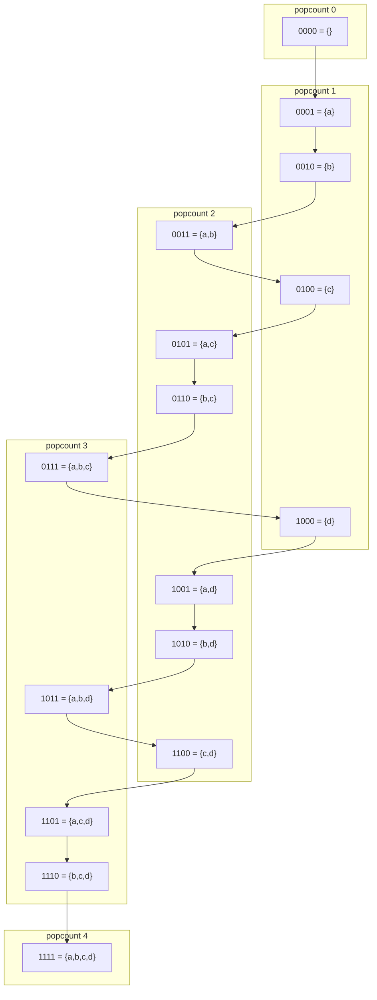
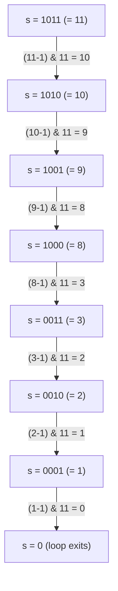

# Bitmask techniques

A 10-letter slice of DNA is four characters wide. A, C, G, T, and that's the whole alphabet. Two bits encode one base. Twenty bits hold the full slice. The integer that comes out fits in a single CPU register, and equality between two slices is one machine instruction.

That is the chapter. A small set is an integer. Every operation that follows is a consequence of taking that idea seriously: encoding, iterating, enumerating subsets.

This chapter is the substrate, not the application. [Bitmask DP](../part-9-dynamic-programming/14-bitmask-dp.md) takes the same iteration and adds a time dimension to it; the canonical "visited-set as a mask" DP problems live there. Here, the only state is the mask itself.

## When the alphabet is small enough to fit in a word

Three signals fire the pattern.

The input has a fixed alphabet at most 32 characters wide, and you need to ask "does this set equal that set?" or "is X a subset of Y?". Both reduce to a single AND or compare on a 32-bit integer. LC 187 *Repeated DNA Sequences* and LC 1178 *Number of Valid Words for Each Puzzle* are the canonical applications.

The element count `n` is at most 22, and the algorithm needs to enumerate every subset of `[0..n-1]`. A bitmask iteration `for mask in range(1 << n)` replaces a recursive backtrack and shrinks each subset to one register-sized integer.

The problem asks for triples or pairs satisfying a bitwise predicate over an array whose values fit in 16 bits, like LC 982 *Triples with Bitwise AND Equal To Zero*. A `2^16`-entry frequency table indexed by mask is the move.

If none of those fire, you don't want a bitmask. Bitmask iteration is `O(2^n)`; treating it as polynomial because the loop has one variable is the most common bitmask bug, and we'll come back to it.

## Why scanning each window from scratch wastes most of its work

Take LC 187. The problem hands you a DNA string `s` and asks for every 10-letter substring that appears more than once. Constraints: `1 ≤ s.length ≤ 10^5`.

The natural first pass:

```python
# Brute force: O(n*k) — what we're replacing.
def find_repeated_dna_brute(s):
    seen, answer = {}, set()
    for i in range(len(s) - 9):
        sub = s[i:i + 10]               # rebuild the 10-char window
        if sub in seen:
            answer.add(sub)
        seen[sub] = True
    return list(answer)
```

This works. It also rebuilds a 10-character substring at every position, hashes it, and stores it. For `n = 10^5` that is roughly `10^6` byte-level operations and a hash table whose keys are 10-byte strings. Python survives. Tight C++ on Codeforces does not.

The real cost is structural. Each window shares nine characters with the previous one. The brute-force scan ignores that and re-reads them. We need an encoding that slides instead of rebuilds.

## The pattern: a small set is an integer

Two bits cover one base. Shift the running mask left by two, OR in the new base's code, AND with `(1 << 20) - 1` to drop the base that just fell off the back. The window has now slid by one position in three arithmetic operations.

```python
def find_repeated_dna_sequences(s):
    if len(s) < 10:
        return []
    code = {"A": 0, "C": 1, "G": 2, "T": 3}
    mask = 0
    MASK20 = (1 << 20) - 1               # keep low 20 bits == 10 bases
    seen, answer = {}, []
    for i, c in enumerate(s):
        mask = ((mask << 2) | code[c]) & MASK20
        if i >= 9:                       # full 10-letter window in mask
            seen[mask] = seen.get(mask, 0) + 1
            if seen[mask] == 2:
                answer.append(s[i - 9 : i + 1])
    return answer
```

**Solution** — Python ([Java](./02-bitmask-techniques/lc-187/sol.java) · [C++](./02-bitmask-techniques/lc-187/sol.cpp) · [Go](./02-bitmask-techniques/lc-187/sol.go))

```python
# LC 187. Repeated DNA Sequences
from typing import List


def find_repeated_dna_sequences(s: str) -> List[str]:
    """LC 187: 10-letter substrings that repeat, encoded 2 bits per base."""
    if len(s) < 10:
        return []
    code = {"A": 0, "C": 1, "G": 2, "T": 3}
    mask = 0
    MASK20 = (1 << 20) - 1               # keep low 20 bits == 10 bases
    seen: dict = {}
    answer: List[str] = []
    for i, c in enumerate(s):
        mask = ((mask << 2) | code[c]) & MASK20
        if i >= 9:                       # full 10-letter window in mask
            seen[mask] = seen.get(mask, 0) + 1
            if seen[mask] == 2:
                answer.append(s[i - 9 : i + 1])
    return answer
```

The whole pass is `O(n)` with one integer comparison per step. The mask is a hash whose collisions are physically impossible. Two different 10-letter strings produce different 20-bit codes by construction, so equality of masks is equality of windows. The hash map is keyed on a 20-bit integer, not a 10-byte string, and Python's `dict` becomes roughly twice as fast for the same reason.

The same idea generalises. With a 26-letter alphabet, one bit per letter encodes "which letters appear in this word" in a 32-bit integer. *Maximum Product of Word Lengths* (LC 318) uses this to check disjointness with `mask_a & mask_b == 0` in a single instruction, replacing the `O(L_a + L_b)` set-intersection that a naive solution writes.

## Iterating every subset of `[0..n-1]`

Once the encoding is in your hands, the next move is to iterate over masks themselves rather than over elements. For `n = 4`, every subset of `{a, b, c, d}` is one of the integers `0..15`, and bit `i` says "is element `i` in the subset?".

```python
for mask in range(1 << n):
    # bit i of mask == 1 iff element i is in this subset
    ...
```

Sixteen iterations cover every possible subset of four elements. No recursion, no stack. The loop variable *is* the subset.



*Bitmask iteration visits all 16 subsets of a four-element universe in numeric order; the popcount layers show that visit order skips around the Boolean lattice rather than walking it level by level.*

This is what [Subsets and combinations](../part-7-recursion-backtracking/02-subsets-combinations-permutations.md) replaces when `n` is small enough. The recursive backtrack produces the same `2^n` subsets, but each one as a list with allocation overhead. The bitmask version produces them as integers, one register each. For `n ≤ 22` and a per-subset cost of `O(1)`, bitmask iteration is roughly an order of magnitude faster on the same hardware.

### Submask enumeration: walking the subsets of one specific mask in `O(2^k)`

The third operation is the one that's not obvious on first read. Antti Laaksonen's *Competitive Programmer's Handbook* calls it out as one of the few bitmask idioms you have to see twice; Knuth gives it an exercise in *TAOCP* Volume 4A §7.1.3.[^1]

You have a parent mask `m` with `k` bits set, and you want to iterate over exactly the `2^k` subsets that fit inside `m`, not over the full `2^n`. For LC 1178, `m` is a puzzle's letter set and the subsets are candidate word-letter sets that the puzzle could legally form. Brute-forcing every mask in `0..(1<<26)-1` is `2^26 ≈ 6.7·10^7` per puzzle; with `10^4` puzzles, that's `6.7·10^{11}` and you're done.

The trick:

```python
s = m
while s > 0:
    process(s)
    s = (s - 1) & m
```

Subtracting 1 from `s` flips its lowest set bit and turns every bit below it on. ANDing with `m` discards every bit that isn't in the parent mask. The result is the next-lower subset of `m` in lexicographic order. Trace it on `m = 0b1011`:



*The `s = (s-1) & m` recurrence walks every submask of `m` exactly once in lex-decreasing order; the `s > 0` guard halts the loop before the wraparound at zero would restart the cycle.*

Eight steps, eight submasks: `1011, 1010, 1001, 1000, 0011, 0010, 0001, 0000`. The loop body runs seven times (omitting the empty subset), which is exactly `2^popcount(m) - 1`. Process the empty subset outside the loop if your problem needs it.

The total work across every mask `m` and every submask of `m` is `sum_{m=0}^{2^n - 1} 2^popcount(m) = (1 + 2)^n = 3^n`. The binomial-theorem identity falls out cleanly. Each of the `n` bits is in one of three states across the `(m, submask)` pair: out of `m` entirely, in `m` but not in submask, or in both. So the total count is `3^n`. CP-Algorithms[^2] reproduces the proof. For `n = 16` that's about `4.3·10^7` iterations, which fits comfortably in a one-second time limit; for `n = 20` it's `3.5·10^9` and you need a different approach.

This is the optimisation. Without the trick, "iterate every subset of every mask" is `O(2^n · 2^n) = O(4^n)`. The recurrence cuts that to `3^n`, a factor of `(4/3)^n`. For `n = 16`, that's `100×` faster. The improvement is what makes LC 1178 tractable at all.

> [!WARNING]
> **Do not start the submask loop at `s = 0`.** Writing `for s = 0; ; s = (s-1) & m` enters an infinite loop: `(0 - 1) & m` is `(-1) & m`, which equals `m`, restarting the cycle. Start at `s = m` and use `while s > 0` as the guard. CP-Algorithms calls this out as the single most common implementation bug for this idiom.[^2]

## What it actually costs

| Operation | Time | Space | Notes |
|---|---|---|---|
| Encode a length-`L` word into a mask | `O(L)` | `O(1)` | one shift-OR per character |
| Full-space iteration over `[0..n-1]` | `O(2^n)` | `O(1)` | sound up to `n ≈ 22` in typical limits |
| Submask enumeration of one mask `m` with popcount `k` | `O(2^k)` | `O(1)` | the `(s-1) & m` recurrence |
| Mask × all its submasks across `n` bits | `O(3^n)` | `O(1)` | binomial-theorem identity[^2] |
| LC 187 (rolling 20-bit mask, length `n`) | `O(n)` | `O(n)` | hash map keyed on 20-bit int |
| LC 1178 (`W` words, `Q` puzzles of length 7) | `O(W·L + Q·128)` | `O(W)` | 128 = `2^7` submasks per puzzle |

The `3^n` bound is the centerpiece; the rest follows.

## What bites in practice

### Java's shift-by-32 silently returns one, not zero

Java's `<<` masks the shift distance by `0x1F` for `int` operands per JLS §15.19, so `1 << 32` evaluates to `1`, not zero, and a 33-bit mask written as `(1 << 32) - 1` evaluates to `0`.[^3] A bitmask intended to clear the top bit instead wipes the whole integer.

```java
// ⚠️ Java: this is 0, not 2^32 - 1.
final int BAD = (1 << 32) - 1;
// Use long for bitmasks wider than 31 bits:
final long GOOD = (1L << 32) - 1L;
```

C++ is worse. `1 << 32` for a signed `int` is undefined behavior per `[expr.shift]/2`, which means the compiler may assume it never happens and emit code that contradicts wraparound semantics. Promote to `long long` or `uint64_t` whenever the shift could touch the top of an `int`.

Go has the cleanest contract: `int` is 64 bits on every supported 64-bit target, and a non-constant shift past the type's width is well-defined as zero.[^4] Python, of course, doesn't care; its ints are arbitrary precision.

The cross-language rule of thumb: if `n ≤ 30`, plain `int` is fine in every language. Above that, promote, and add an inline comment at the shift site naming the bound.

### Bitmask iteration is exponential, not linear

The loop has one variable, but the iteration count is `2^n`. For `n = 30` that's roughly `10^9` and you're well past a one-second budget. The mental rule: bitmask full-space iteration fits inside a typical LeetCode time limit for `n ≤ 22`, stretches to `n ≈ 25` with constant-factor work, and beyond that you need [Bitmask DP](../part-9-dynamic-programming/14-bitmask-dp.md) or a polynomial-time algorithm with a different shape.

### Confusing full-space with submask enumeration

Both idioms iterate masks. Both involve `& m` somewhere. They are not the same. Full-space iteration walks `2^n` masks regardless of what `m` is; submask enumeration walks `2^popcount(m)` masks of one specific `m`. Naming the variables is the cheapest fix: write `for full_mask in range(1 << n):` for the first, `s = m; while s > 0: ...` for the second. Don't reuse the name `mask` for both inside the same function.

## Problem ladder

The bitmask-iteration pattern is structurally Medium-and-Hard. LC's Easy bitmask problems (LC 191 *Number of 1 Bits*, LC 461 *Hamming Distance*, LC 136 *Single Number*) teach popcount and XOR identities, not the encode-iterate-enumerate substrate this chapter owns; they live in [Bit manipulation primer](../part-0-foundations/03-bit-manipulation-primer.md) and the XOR-patterns chapter that precedes this one.

### CORE (solve all three to claim chapter mastery)

- [LC 187 — Repeated DNA Sequences](https://leetcode.com/problems/repeated-dna-sequences/) [Medium] • bitmask-encode-alphabet
- [LC 1178 — Number of Valid Words for Each Puzzle](https://leetcode.com/problems/number-of-valid-words-for-each-puzzle/) [Hard] • bitmask-submask-enumeration ★
- [LC 982 — Triples with Bitwise AND Equal To Zero](https://leetcode.com/problems/triples-with-bitwise-and-equal-to-zero/) [Hard] • bitmask-multiset-aggregation

### STRETCH (optional)

- [LC 320 — Generalized Abbreviation](https://leetcode.com/problems/generalized-abbreviation/) [Medium] • bitmask-encode-pick-skip *(Premium; LC 187 covers the same shape free)*

## Where this leads

The bitmask iteration here is the substrate. [Bitmask DP](../part-9-dynamic-programming/14-bitmask-dp.md) takes the same `for mask in range(1 << n):` and adds a time dimension to it. The state is "which subset of jobs have been visited so far", the transition picks the next job, and the recurrence stitches the masks together. The canonical TSP-style problems and the assignment LCs (LC 943 *Find the Shortest Superstring*, LC 526 *Beautiful Arrangement*, LC 698 *Partition to K Equal Sum Subsets*) all run on this engine.

The `(s-1) & m` idiom shows up again in subset-sum DP optimizations and in any problem where the outer loop ranges over masks. Keep the trace of `m = 0b1011` in your head; the day you need it, the seven-step descent will surface from memory faster than the algebraic derivation.

## References

[^1]: Donald E. Knuth, *The Art of Computer Programming*, Volume 4A: *Combinatorial Algorithms, Part 1* (Addison-Wesley, 2011), §7.1.3 "Bitwise tricks and techniques", exercise 7.1.3-26. Catalog page: <https://www-cs-faculty.stanford.edu/~knuth/taocp.html>.

[^2]: cp-algorithms.com contributors, "Submask Enumeration", <https://cp-algorithms.com/algebra/all-submasks.html>.

[^3]: James Gosling, Bill Joy, Guy Steele, Gilad Bracha, Alex Buckley, Daniel Smith, *The Java Language Specification, Java SE 21 Edition*, §15.19 "Shift Operators" (Oracle, 2023), <https://docs.oracle.com/javase/specs/jls/se21/html/jls-15.html>.

[^4]: The Go Authors, *The Go Programming Language Specification*, sections "Numeric types" and "Operators", <https://go.dev/ref/spec>.
