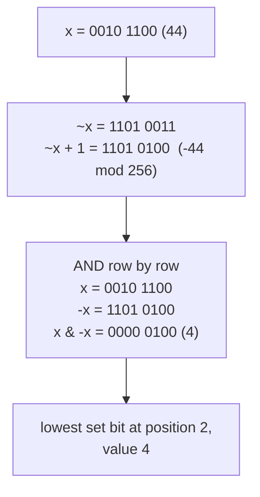
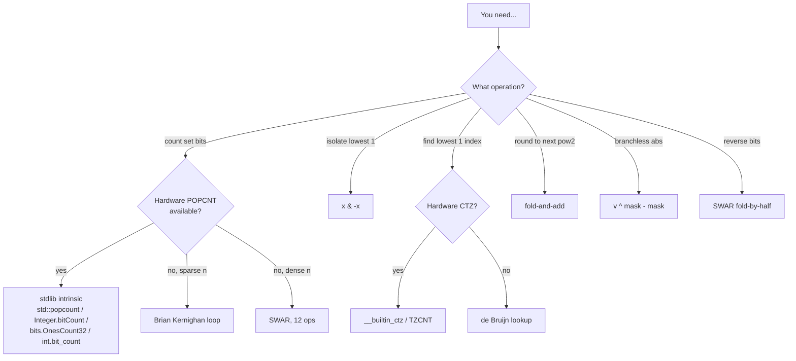

# Bit tricks for performance

Most production code does not need this chapter. On any x86-64 server built since 2008 and any ARMv8 phone built since 2013, `std::popcount`, `Integer.bitCount`, `bits.OnesCount32`, and `int.bit_count()` lower to a single hardware instruction: three cycles of latency, one per cycle of throughput, no branch. The cleverest software popcount in the surveyed catalog is twelve operations long. The hardware version is one. Reach for the toolkit when the intrinsic is missing, when the inner loop has to run on a Cortex-M0 or in a WebAssembly module without `i32x4.popcnt`, or when an interview problem forbids arithmetic operators and you need to reach for the bit-pattern identity instead.

The reason to read this chapter even if your CPU has POPCNT is that the intrinsics didn't appear out of nowhere. SSE4.2 added POPCNT in 2008 because Henry Warren's *Hacker's Delight* §5-1 had spent twenty years showing that "sideways addition" was the right kernel; when Intel finally cast the algorithm in silicon, it was still the same divide-and-conquer fold the textbook taught.[^1] Read the toolkit, recognise the shape, then let the compiler do the work.

## Where these tricks actually run

A short tour of the production code that still uses them.

**Fenwick (binary indexed) trees.** Every update walks parents via `i += i & -i`; every prefix query walks ancestors via `i -= i & -i`. The trick replaces a logarithmic ancestor search with one ALU op. Fenwick trees are the standard data structure for "rangewise sum with point updates" inside competitive programming, financial tick aggregators, and the indexing layer of multi-version databases. Without `x & -x`, the structure is unimplementable in `O(log n)` per operation.[^2]

**Stockfish chess engine.** Magic bitboards represent the 64 squares of a chess board as a single `uint64_t`; legal-move generation reduces to AND, OR, XOR over those words. Since 2014 Stockfish has used Intel's BMI2 PEXT instruction (Haswell, 2013) to extract relevant occupancy bits from a board state in one cycle.[^3] The PEXT path made Stockfish roughly 10% faster on AMD Zen 3 and Intel Skylake-X, enough to matter for a chess engine that searches 100 million positions per second.

**Hash-table sizing.** Java's `HashMap`, Go's `runtime.map`, and Rust's `HashMap` all round capacity up to the next power of two so that bucket selection becomes `hash & (capacity - 1)` instead of `hash % capacity`. Masking is one cycle; modulo is twenty-plus on most CPUs. The "round to next power of two" routine inside those allocators is the fold-and-add identity from §"MSB isolation" below.[^4]

**SIMD popcount on long arrays.** When the input is a buffer of millions of 64-bit words, the per-instruction POPCNT runs at one per cycle but stalls on cross-register dependencies. Mula and Lemire's 2017 algorithm uses AVX2 shuffle and PSHUFB-based nibble lookup to count bits over 32-byte vectors at twice the throughput of scalar POPCNT.[^5] glibc's `memrchr`, jq's set-membership tests, and several columnar database engines (DuckDB, ClickHouse) link against `libpopcnt`, which dispatches to either the scalar or AVX2 path based on `cpuid`.

The pattern across all four examples: the trick is the algorithm, the intrinsic is the optimisation, the chapter is what the intrinsic does under the hood.

## The two foundational identities

Two single-op tricks that come back in nearly every later identity.

**`x & -x` isolates the lowest set bit.** Two's-complement negation flips every bit and adds one; the carry from the `+1` propagates through the trailing zeros of `x`, flipping the lowest 1-bit but stopping there. AND-ing back with `x` keeps only the bit that survived in both representations, which is exactly the lowest 1.



*The AND drops every position where `x` and `-x` disagree; by construction, that leaves only `x`'s lowest 1.*

**`x & (x - 1)` clears the lowest set bit.** Subtracting one from a positive `x` flips every bit from the lowest 1 downward; the lowest 1 becomes 0, the trailing zeros become 1. AND-ing with `x` keeps only the bits *above* the lowest 1. The two identities are the workhorses for Fenwick-tree traversal, set iteration over bitmasked subsets, and Brian Kernighan's popcount below. Both are proved in *Hacker's Delight* §2-1.[^1]

## Brian Kernighan's popcount

The canonical bit-counting algorithm, published by Peter Wegner in *CACM* 3:5 (1960) and popularised by Kernighan and Ritchie's *The C Programming Language* exercise 2-9.[^1]

```python
def popcount_kernighan(n: int) -> int:
    count = 0
    while n:
        n &= n - 1   # clears the lowest set bit
        count += 1
    return count
```

The loop runs `popcount(n)` iterations, not `WORD_BITS`. On a 64-bit word with three set bits, the loop terminates in three iterations regardless of where those bits live. The naive shift-and-count `for k in range(64): count += (n >> k) & 1` always runs 64 times. Kernighan wins by a factor of up to `WORD_BITS / popcount(n)` on sparse inputs and ties on dense ones.

For the writer who's seen this in the [Bit manipulation primer](../part-0-foundations/03-bit-manipulation-primer.md): yes, this is the same loop. The reason it appears again is that everything else in this chapter composes against it.

## SWAR popcount: twelve ops, no branches

The "best method" in *Hacker's Delight* §5-1, originally credited to Beeler, Gosper, and Schroeppel in MIT AI Memo 239 (HAKMEM, 1972).[^1]

```python
def popcount_swar(v: int) -> int:
    # 32-bit unsigned input; mask to 32 bits at the top.
    v &= 0xFFFFFFFF
    v = v - ((v >> 1) & 0x55555555)
    v = (v & 0x33333333) + ((v >> 2) & 0x33333333)
    v = (v + (v >> 4)) & 0x0F0F0F0F
    return ((v * 0x01010101) & 0xFFFFFFFF) >> 24
```

Twelve ALU ops, no branches, no memory loads. The algorithm is sideways addition by halving. After line one, every 2-bit group holds the count of 1-bits in that pair (0, 1, or 2, encoded in 2 bits). After line two, every nibble holds the count for that nibble (0..4). After line three, every byte holds its byte-count (0..8). The final multiply broadcasts the four byte-counts into the high byte via `0x01010101`, and the right-shift by 24 extracts the answer.

This is the algorithm `std::popcount` falls back to when POPCNT is unavailable. The C++20 standard explicitly permits the implementation to choose between the hardware instruction and a software fallback per call site. AMD's *Software Optimization Guide for Athlon 64 and Opteron* documents the same form on pages 187–188.[^1]

## De Bruijn bit-scan

For the lowest-set-bit *index* (not just its value), the portable software answer is a multiply and a table lookup.

```text
const int DEBRUIJN[32] = { ... };  // permutation of 0..31
int trailing_zeros(uint32_t v) {
    return DEBRUIJN[((v & -v) * 0x077CB531U) >> 27];
}
```

The constant `0x077CB531` is a B(2, 5) de Bruijn sequence: every 5-bit window of its 32-bit binary expansion is unique. Multiplying by `2^k` (which is what `v & -v` produces for a non-zero `v`) shifts the sequence left by `k` bits, so the top 5 bits after the multiply identify `k`. The 32-entry table maps those 5 bits back to `k`. Leiserson, Prokop, and Randall published this construction at MIT in 1998 and proved its `O(1)` worst case independent of word size.[^6]

Modern x86-64 has BSF (since 8086) and the BMI1 instructions TZCNT and LZCNT (since Haswell, 2013). ARMv8 has CLZ. The de Bruijn lookup is what `__builtin_ctz`, `Integer.numberOfTrailingZeros`, and `bits.TrailingZeros32` fall back to on platforms that don't expose the hardware instruction.

## The rest of the toolkit

Five identities the chapter catalogs but doesn't dwell on. Each one is one or two lines; what matters is recognising the pattern when it appears.

**MSB isolation and round-to-next-power-of-two.** Fold the high 1-bit into all lower positions, then subtract or add:

```python
v |= v >> 1
v |= v >> 2
v |= v >> 4
v |= v >> 8
v |= v >> 16
v -= v >> 1     # round down to power of two; or `+ 1` to round up
```

Six ops; used by hash-table sizing and buddy allocators. Hardware fallback: BSR (x86) or CLZ (ARM); `floor(log2(v)) = 31 - __builtin_clz(v)` for non-zero 32-bit `v`.

**Branchless absolute value.** `mask = v >> 31; abs_v = (v ^ mask) - mask`. Three ops, no branch. When `v` is negative, the arithmetic right-shift produces all-ones, the XOR inverts `v`, and the subtract-of-`-1` adds one, which is the textbook formula for negation. When `v` is non-negative, mask is zero and the value passes through. Most modern compilers emit a CMOV for plain `abs(v)` that runs as fast; the branchless form's value is in deep-pipeline cores and SIMD lanes that don't have CMOV.[^1]

**Sign extension from `b` bits.** `m = 1U << (b - 1); r = (x ^ m) - m`. Used to recover signed values from packed bit-fields in network protocols (12-bit and 20-bit fields are common) and from CPU instruction immediates.

**SWAR bit reversal.** Five fold-and-swap rounds, each operating on a power-of-two block size: bits, then pairs, then nibbles, then bytes, then halves. Total `5 · log₂(N)` ops to reverse `N` bits in parallel. Used by hardware FFT implementations to reorder samples before the butterfly stage. Byte reversal (the more common interview ask) is a one-instruction `bswap` on x86 and `rev` on ARM.

**`(x & (x - 1)) == 0` as a power-of-two test.** Subtracting one from a positive `x` flips every bit from the lowest 1 down. If `x` is a power of two it has exactly one set bit; clearing it leaves zero. Anything else has at least two set bits, and clearing one leaves something nonzero.

## The decision tree

The chapter's lookup. Read it once; come back when an inner loop calls.



*Each trigger maps to one identity; the hardware path beats the software path whenever it exists.*

## What it actually costs

Per-trick numbers on a 32-bit unsigned word, single-cycle ALU. Substitute 64 for 32 to get 64-bit costs.

| Trick | Software | Hardware fallback | Modern stdlib call |
|---|---|---|---|
| `x & -x` lowest bit | 1 ALU op | direct | n/a (the trick is the primitive) |
| `x & (x - 1)` clear lowest | 1 ALU op | direct | n/a |
| Kernighan popcount | `popcount(n)` iters | POPCNT, 1 op | `std::popcount`, `Integer.bitCount` |
| SWAR popcount | 12 ops, no branch | POPCNT, 1 op | (lowering-time choice) |
| De Bruijn ctz | 3 ops + table | BSF / TZCNT, 1 op | `__builtin_ctz`, `Integer.numberOfTrailingZeros` |
| MSB isolation | 6 ops (5 folds + sub) | BSR / LZCNT, 1 op | `Integer.numberOfLeadingZeros` |
| Branchless abs | 3 ops | CMOV, 1 op | `std::abs` (compiler choice) |
| Bit reversal | 5 · log₂(N) ops | RBIT (ARM only) | `Integer.reverse`, `bits.Reverse32` |

POPCNT runs at three-cycle latency and one-per-cycle throughput on Skylake; one-cycle latency and 0.25-per-cycle throughput on Zen 2.[^7] On dense workloads, the intrinsic beats the Kernighan loop by orders of magnitude on buffers of mostly-non-zero 64-bit words. On sparse workloads the gap is smaller; Kernighan's output-sensitivity matters when the average popcount per word is below `log₂(WORD_BITS)`.

## Two pitfalls

> [!WARNING]
> **C++17 right-shift of a negative signed integer is implementation-defined.** `int v = -1; v >> 1;` is allowed to be `0x7FFFFFFF` (logical shift) instead of `-1` (arithmetic shift) under the C++17 spec, even though every mainstream compiler in practice did arithmetic shift. C++20 [basic.fundamental]/3 mandates two's-complement and arithmetic shift; pre-C++20 code that relies on the behaviour for branchless absolute value or sign extension is non-portable. Use `uint32_t` and the explicit `(x ^ mask) - mask` form, or upgrade the standard.

> [!WARNING]
> **Java's `>>` versus `>>>`.** Java is the only mainstream language with separate operators for arithmetic and logical right-shift. `>>` sign-extends; `>>>` zero-fills. Code copied from C++ that uses `>>` to mean "shift the 1s out of the high bits" silently produces all-ones high bits when the input has the sign bit set. The canonical Java implementation of LC 191 uses `n >>> 1` precisely so the loop terminates when fed a negative `int` (`0xFFFFFFFF` interpreted as `-1`).

## Don't write the trick when the intrinsic exists

The chapter's strongest opinion. A developer who writes a Kernighan loop, profiles it, and finds it slower than `std::popcount` has not falsified the algorithm; they have rediscovered that POPCNT is one cycle and Kernighan is `popcount(n)` cycles. Production code calls `int.bit_count()` (Python 3.10+, October 2021), `Integer.bitCount` (Java since JDK 7, JIT-intrinsified to POPCNT on supporting CPUs), `bits.OnesCount32` (Go, lowered to POPCNT on amd64 with SSE4.2), or `std::popcount` (C++20). The chapter teaches what those calls do under the hood and what to do when the platform lacks the instruction. The two are not in conflict; pedagogy and deployment have different optima.[^8]

## Problem ladder

This chapter is foundation/framework-exempt: a toolkit catalog, not a problem-solving pattern. The two problems below illustrate the toolkit in use. There is no Easy/Medium/Hard span requirement.

### CORE

- [LC 868 — Binary Gap](https://leetcode.com/problems/binary-gap/) [Easy] • bit-shift-scan
- [LC 371 — Sum of Two Integers](https://leetcode.com/problems/sum-of-two-integers/) [Medium] • bit-parallel-arithmetic ★

LC 371 is the chapter's signature: it forbids `+` and `-`, forcing the candidate to compose `^` (sum without carry) and `& << 1` (carry) into a full adder. Full four-language code lives in `lc-371/`.

```python
def get_sum(a: int, b: int) -> int:
    MASK = 0xFFFFFFFF
    SIGN_BIT = 0x80000000
    while b & MASK:
        carry = ((a & b) << 1) & MASK
        a = (a ^ b) & MASK
        b = carry
    return a if a < SIGN_BIT else a - (SIGN_BIT << 1)
```

**Solution** — Python ([Java](./03-bit-tricks-performance/lc-371/sol.java) · [C++](./03-bit-tricks-performance/lc-371/sol.cpp) · [Go](./03-bit-tricks-performance/lc-371/sol.go))

```python
# LC 371. Sum of Two Integers

def get_sum(a: int, b: int) -> int:
    """Return a + b without using + or -.

    Implements full-adder logic with bit-parallel composition:
      sum-without-carry: a XOR b
      carry:             (a AND b) << 1
    Iterate until carry is zero.

    Python ints are arbitrary-precision, so we mask to 32 bits each step
    and reinterpret the sign at the end. LeetCode's constraint is
    -1000 <= a, b <= 1000, well within 32-bit two's complement.
    """
    MASK = 0xFFFFFFFF
    SIGN_BIT = 0x80000000

    while b & MASK:
        carry = ((a & b) << 1) & MASK
        a = (a ^ b) & MASK
        b = carry

    # If the high bit is set, interpret as a negative 32-bit int.
    return a if a < SIGN_BIT else a - (SIGN_BIT << 1)
```

## Where this leads

[Bitmask techniques](./02-bitmask-techniques.md) uses `x & -x` for set iteration over subset-DP states and `x & (x - 1)` for "for each subset of `x`" enumeration. [Fenwick trees](../part-6-trees-heaps/10-segment-tree.md) (when written) is `i & -i` applied at scale: every prefix query and every point update is one ancestor walk per ALU op.

## References

[^1]: Henry S. Warren Jr., *Hacker's Delight*, 2nd ed., Addison-Wesley, 2013, ISBN 978-0-321-84268-8.

[^2]: Peter M. Fenwick, "A New Data Structure for Cumulative Frequency Tables," *Software: Practice and Experience* 24:3 (1994), pp.

[^3]: Pradyumna Kannan, "Magic Bitboards Explained," *Stockfish Wiki*, [stockfishchess.org](https://stockfishchess.org/).

[^4]: Doug Lea, "ConcurrentHashMap" implementation notes, Java Community Process JSR-166.

[^5]: Wojciech Muła, Nathan Kurz, and Daniel Lemire, "Faster Population Counts Using AVX2 Instructions," *The Computer Journal* 61:1 (2018), pp. 111–120, DOI 10.1093/comjnl/bxx046. Source code at [github.com/CountOnes/hamming_weight](https://github.com/CountOnes/hamming_weight)

[^6]: Charles E. Leiserson, Harald Prokop, and Keith H. Randall, "Using de Bruijn Sequences to Index a 1 in a Computer Word," MIT Lab for Computer Science technical report, July 1998, [supertech.csail.mit.edu/papers/debruijn.pdf](https://supertech.csail.mit.edu/papers/debruijn.pdf).

[^7]: Agner Fog, *Instruction Tables: Latencies, Throughputs and Micro-operation Breakdowns for Intel, AMD, and VIA CPUs*, Technical University of Denmark, latest revision, [agner.org/optimize/instruction_tables.pdf](https://www.agner.org/optimize/instruction_tables.pdf).

[^8]: Charlie Arehart, "Intrinsically fast: more JVM performance tinkering," Rapid7 blog, May 2016, [rapid7.com/blog/post/2016/05/24/intrinsically-fast-more-jvm-performance-tinkering](https://www.rapid7.com/blog/post/2016/05/24/intrinsically-fast-more-jvm-performance-tinkering/).
