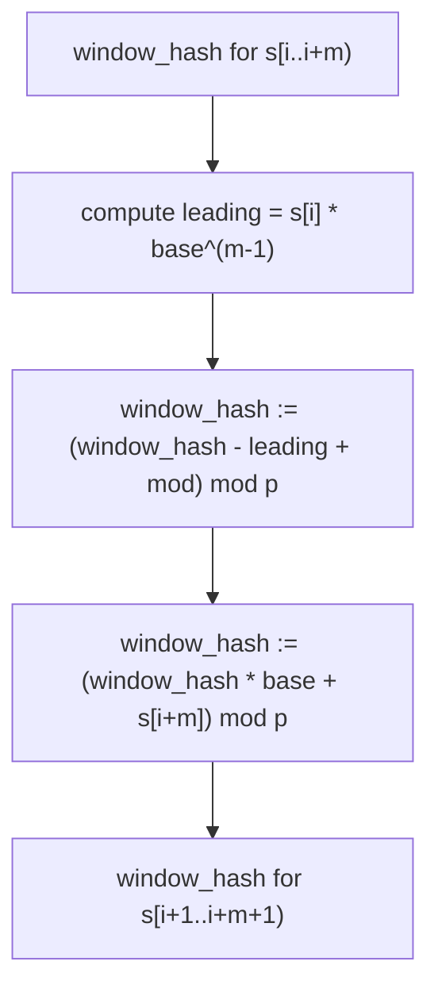
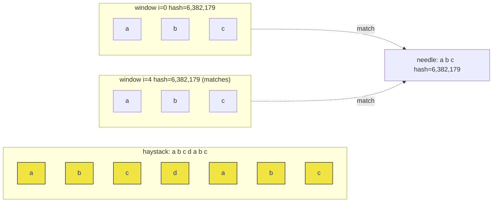

# Rabin-Karp and rolling hashes

A length-30,000 string of lowercase letters. The question is whether any substring of any length appears twice. The honest first attempt picks a length, scans every length-`L` window, sticks each one into a hash set, and asks if it ever collides. That works. It's also doing about 30,000 × 30,000 character comparisons inside the hash function in the worst case, plus another factor of `log n` if you binary-search the length, and the whole thing runs for the better part of a minute on a problem the judge wants in two seconds.

This chapter is the trick that takes the hash-of-a-window from O(`L`) per slide to O(1) per slide, and the small piece of paranoia that keeps the algorithm correct after you do. Karp and Rabin published it in 1987 as a randomized algorithm with two faces: fast but potentially wrong if you trust the hash, fast and always right if you verify.[^1] The verify is what makes it a real algorithm.

## What it computes

A polynomial hash of a length-`m` string `s`, treating each character as a digit and the whole string as a base-`b` integer:

```text
H(s) = (s[0] * b^(m-1) + s[1] * b^(m-2) + ... + s[m-1]) mod p
```

`b` is at least the alphabet size (256 for ASCII). `p` is a prime around 2^30 so that the multiplication `(p - 1) * b` stays inside a 64-bit register. `H` is a fingerprint: equal strings always hash equal; different strings *almost* always hash unequal, with the gap closed by an explicit verification step.

The point of doing it this way and not with a generic string-hash function is the second property below.

## The slide is one line

Given the hash of `s[i..i+m)`, the hash of the *next* window `s[i+1..i+m+1)` is computable in three multiplications and one subtraction. No re-scan. No re-multiply across the whole window. Just:

```text
H_next = (H_prev - s[i] * b^(m-1)) * b + s[i+m]   (mod p)
```

Read it left to right. Subtract the leading-digit contribution (the character that's leaving on the left). Multiply the rest by `b` to shift everything one position higher. Add the new trailing digit (the character entering on the right). This is the same arithmetic you would use to slide a base-10 number's digits. `H("abr")` to `H("bra")` is "subtract `a`'s contribution, shift, add `b`'s contribution," and it's the entire reason the algorithm is linear in expectation.



*Each slide is four integer operations regardless of m. That is the algorithm; everything else is bookkeeping.*

The `+ mod` in step C is not optional in any signed-integer language. Java's and C++'s `%` operators return a non-positive remainder when the dividend goes negative, so `(window_hash - leading) % mod` can land in the range `(-mod, 0)` and silently corrupt every subsequent hash. The fix is the canonical `((x - leading) % mod + mod) % mod`, or `Math.floorMod` in Java, or `uint64_t` arithmetic in C++ that wraps around cleanly. Section §3.2 of the [Wikipedia article](https://en.wikipedia.org/wiki/Rabin%E2%80%93Karp_algorithm) calls this an "underflow avoider" and it is one of the two single-letter bugs that cause every Java Rabin-Karp submission that fails to fail.[^2]

## Hash equality is not string equality

The whole edifice rests on a fact that makes new readers nervous: two different strings can hash to the same value. The probability is small. For `m` a few thousand and `p ≈ 10^9`, the chance of a single collision is bounded by `m / p` by a polynomial-roots counting argument, which gives something like 10^-6 per window comparison. Multiplied across `n - m + 1` windows on a length-`n` haystack, the expected number of false matches across the whole scan stays comfortably below one. Below one is not zero.

So Rabin-Karp uses hash equality as a *filter*, not a match. Whenever the window's hash agrees with the needle's hash, the algorithm runs a char-by-char comparison to confirm. The original 1987 paper named these two modes: skip the verify and you get *Monte Carlo* (fast, occasionally wrong); keep the verify and you get *Las Vegas* (always right, expected linear).[^1] In any code anyone writes for an interview or a production search engine, keep the verify. The textbook line is

```text
if (window_hash == needle_hash && substring_equals(...)) { matched = true; }
```

Treat the hash compare as a 30-line speedup over the naive matcher, not as a substitute for character comparison. Treat the verify as a contract.

## The full algorithm, on LC 28

LeetCode 28 wants the first index where `needle` occurs in `haystack`, or -1. The naive answer compares the needle against the haystack at every starting position, doing O(n × m) character compares in the worst case. Rabin-Karp does the same scan and replaces the inner comparison with a hash check followed by a verify on hash match.

```python
def str_str(haystack, needle):
    n, m = len(haystack), len(needle)
    if m == 0:
        return 0
    if m > n:
        return -1

    base = 256
    mod = 1_000_000_007
    high_power = pow(base, m - 1, mod)

    needle_hash = 0
    window_hash = 0
    for i in range(m):
        needle_hash = (needle_hash * base + ord(needle[i])) % mod
        window_hash = (window_hash * base + ord(haystack[i])) % mod

    for i in range(n - m + 1):
        if window_hash == needle_hash:
            if haystack[i:i + m] == needle:        # verify on hash match
                return i
        if i < n - m:
            leading = ord(haystack[i]) * high_power
            window_hash = (window_hash - leading) % mod
            window_hash = (window_hash * base + ord(haystack[i + m])) % mod

    return -1
```

**Solution** — Python ([Java](./01-rabin-karp/lc-28/sol.java) · [C++](./01-rabin-karp/lc-28/sol.cpp) · [Go](./01-rabin-karp/lc-28/sol.go))

```python
# LC 28. Find the Index of the First Occurrence in a String


def str_str(haystack: str, needle: str) -> int:
    """LC 28. First index of needle in haystack via Rabin-Karp, or -1.

    Slide a length-m window across the haystack; compare each window's
    polynomial hash against the precomputed needle hash; on hash match,
    verify char-by-char to defeat collisions. Expected O(n + m); worst
    case O(n * m) when every window collides.
    """
    n, m = len(haystack), len(needle)
    if m == 0:
        return 0
    if m > n:
        return -1

    base = 256
    mod = 1_000_000_007
    high_power = pow(base, m - 1, mod)

    needle_hash = 0
    window_hash = 0
    for i in range(m):
        needle_hash = (needle_hash * base + ord(needle[i])) % mod
        window_hash = (window_hash * base + ord(haystack[i])) % mod

    for i in range(n - m + 1):
        if window_hash == needle_hash:
            if haystack[i:i + m] == needle:        # verify on hash match
                return i
        if i < n - m:
            leading = ord(haystack[i]) * high_power
            window_hash = (window_hash - leading) % mod
            window_hash = (window_hash * base + ord(haystack[i + m])) % mod

    return -1
```

Three things happen in order. The build phase computes `needle_hash` and the first `window_hash` in O(m), one Horner step per character. The slide loop runs n − m + 1 times; each iteration costs four integer ops plus an O(m) verify only on the rare windows where the hashes agree. The early returns guard against `m == 0` and `m > n`, both of which the LC 28 test set actually checks.

`high_power` is the only term in the build phase that surprises people. It's `base^(m-1) mod p`, computed once before the loop with `pow(base, m - 1, mod)` in Python or a small for-loop in Java/C++/Go. You need it to weight the leaving character's contribution at every slide; precomputing it once is what keeps the slide O(1).

## Walking the slide on a tiny input

Set `haystack = "abcdabc"`, `needle = "abc"`. Use `base = 256`, `mod = 10^9 + 7`. Then `high_power = 256^2 = 65,536`.

The build phase is two Horner accumulations. For the needle:

- After 'a': `0 × 256 + 97 = 97`
- After 'b': `97 × 256 + 98 = 24,930`
- After 'c': `24,930 × 256 + 99 = 6,382,179`

So `needle_hash = 6,382,179`. The first window of the haystack is also `"abc"`, so `window_hash = 6,382,179` after the same three Horner steps. The hashes agree at index 0. Verify: `haystack[0..3] == "abc"`. They match. Return 0.

For the find-all variant of the same problem (which is what makes the slide visible), keep going. Drop the leading `'a'`, multiply by 256, add `'d'`. `(6,382,179 − 97 × 65,536) × 256 + 100 = 6,447,972`. Hashes don't match; skip the verify. Drop the `'b'`, add `'a'`: `6,513,761`. No match. Drop the `'c'`, add `'b'`: `6,578,530`. No match. Drop the `'d'`, add `'c'`: back to `6,382,179`. Match. Verify: `haystack[4..7] == "abc"`. Confirmed. The full scan reports matches at indices 0 and 4 after eleven multiplications, six subtractions, and two three-character verifies, a total of about sixty arithmetic ops on a 7-character string, where the naive matcher would have done up to twenty-one character comparisons.



*The two windows whose hash agrees with the needle's hash both pass verify; the three between them are skipped after a single integer comparison.*

The savings look small at this scale because the scale is small. On a length-10,000 haystack and a length-50 needle, the naive matcher does up to 500,000 character comparisons; Rabin-Karp does about 40,000 integer operations plus a handful of verifies, which on real hardware is roughly an order of magnitude faster.

## What it costs

| Variant | Time | Space | Notes |
|---|---|---|---|
| Single pattern, average | O(n + m) | O(1) | Three integers of state: `window_hash`, `needle_hash`, `high_power`. The bound the algorithm advertises. |
| Single pattern, worst case | O(n × m) | O(1) | Every window's hash equals the needle hash; verify fires every time and does m character compares. Only adversarial inputs hit this. |
| Multi-pattern, k patterns of equal length | O(n + k × m) | O(k) | Hash the k patterns once; probe a hash-set of pattern hashes per window. Aho-Corasick is asymptotically tighter for very large k but is roughly ten times the code. |
| Naive baseline | O(n × m) | O(1) | What you replace. |

The expected-linear claim follows from a polynomial-roots argument. Two distinct length-`m` strings can be viewed as two polynomials in the variable `b`, each with coefficients in `[0, σ)`. They agree mod `p` only when `b` is a root of their difference; a degree-`m` polynomial has at most `m` roots in `Z / pZ`. So picking `p` randomly large gives a per-comparison collision probability of at most `m / p`, and summing across `n − m + 1` windows gives an expected verification cost of `O(n × m / p)`, which for `p ≈ 10^9` and inputs at LC scale rounds to dominated-by-the-slide.[^3] Karp and Rabin's 1987 paper proves the linear-expected bound formally; CLRS §32.2 carries the same proof in textbook form.[^1][^4]

The worst case is real but rare. The inputs that hit it are constructed: the Thue-Morse sequence, for example, can be used to generate haystacks that collide systematically against a fixed (`base`, `mod`) hash. Section "When the input is hostile" below covers what to do.

## When the input is hostile

The single-modulus implementation above passes every LC test case and is what you should write in an interview. For a Codeforces submission against adversarial test data, or any production search engine where the input is user-controlled, the standard hardening is **double hashing**: pair the rolling hash with a second one using a different `(base, mod)` pair, and treat a window as a candidate match only when *both* hashes agree.

Why two hashes are enough: a single mod-`p` hash has collision probability ~`m/p`. Two independent hashes mod `p_1` and `p_2` have joint collision probability ~`m^2 / (p_1 × p_2)`, which for two 30-bit primes is on the order of 10^-15. The verify step still runs because two simultaneous collisions are not impossible, only astronomically unlikely; the runtime stays expected-linear. CP-Algorithms and the dacin21 Codeforces blog walk through both the attack (Thue-Morse against `mod 2^64`) and the defense (real prime modulus + randomized base) in detail.[^5]

Three pieces of advice that fall out of that:

- Pick a real prime modulus. `10^9 + 7`, `2^31 − 1`, and `(2^61) − 1` are all fine. Do not use `mod = 2^64` (that is, unsigned overflow as an implicit modulus): the Thue-Morse construction produces equal-hash strings for any base under that modulus.
- Randomize the base at program start when the input is adversarial. A high-resolution clock seed plus a `base` chosen uniformly from primes in `[256, 2^30)` is the standard recipe.
- Two hashes, not three. Three doesn't buy enough collision-probability headroom over two to justify the extra arithmetic, and any input that defeats two carefully chosen hashes will defeat three with the same construction.

For LC, none of this matters. Single hash, fixed prime, fixed base, verify on hash match. For Codeforces, all three matter.

## When the pattern bends — binary-search-on-length

The chapter's signature problem is LC 1044, Longest Duplicate Substring, and it's where Rabin-Karp earns its place in the curriculum. The problem: given a string `s`, find the longest substring that appears at least twice. Naive solutions enumerate every substring (`O(n^2)` of them) and bucket them by content (`O(n)` to compare each) for `O(n^3)` total, which times out around `n = 200`.

The trick is a reduction that turns the problem into a feasibility question. *Does any duplicate substring of length `L` exist?* If yes, slide a length-`L` window across `s`, hash each window, dump hashes into a dictionary keyed by hash with values being starting indices, and on hash collision verify by slicing. If a verify confirms equality, length `L` is feasible. Because feasibility is monotone (a duplicate of length `L+1` contains one of length `L`), binary-search the answer: the largest feasible `L` is the answer length, and any matching pair gives the substring itself.

```python
# LC 1044 sketch — full implementation in lc-1044/sol.py
def longest_dup_substring(s):
    n = len(s)
    # ... precompute prefix hashes h[] and powers pow_b[] over s ...

    def find_dup(length):
        seen = {}
        for i in range(n - length + 1):
            wh = window_hash(i, length)
            if wh in seen:
                for j in seen[wh]:
                    if s[j:j+length] == s[i:i+length]:   # verify
                        return j
                seen[wh].append(i)
            else:
                seen[wh] = [i]
        return None

    lo, hi, best_start, best_len = 1, n - 1, 0, 0
    while lo <= hi:
        mid = (lo + hi) // 2
        start = find_dup(mid)
        if start is not None:
            best_start, best_len = start, mid
            lo = mid + 1
        else:
            hi = mid - 1
    return s[best_start:best_start + best_len]
```

```python
# LC 1044. Longest Duplicate Substring
# Note: this chapter ships LC 1044 in Python only (reference: Python only).
from typing import Optional


def longest_dup_substring(s: str) -> str:
    """LC 1044. Find any longest substring that appears at least twice.

    Binary-search the answer length L in [1, n - 1]. At each L, run a
    Rabin-Karp scan over s using a precomputed prefix-hash array;
    insert each window's hash into a dict keyed by hash, value = first
    starting index. On collision (same hash already present) verify
    by string slice; if equal, L is feasible. The binary search is
    monotone because a duplicate of length L+1 contains a duplicate of
    length L.
    """
    n = len(s)
    if n < 2:
        return ""

    # Precompute prefix hashes over s with the same (base, mod) used in
    # the chapter's str_str. h[i] = hash(s[0..i-1]); pow_b[i] = base^i.
    base = 256
    mod = (1 << 61) - 1                # 2^61 - 1, a Mersenne prime
    h = [0] * (n + 1)
    pow_b = [1] * (n + 1)
    for i in range(n):
        h[i + 1] = (h[i] * base + ord(s[i])) % mod
        pow_b[i + 1] = (pow_b[i] * base) % mod

    def window_hash(left: int, length: int) -> int:
        # hash(s[left..left+length-1]) via prefix-hash subtraction.
        return (h[left + length] - h[left] * pow_b[length]) % mod

    def find_dup(length: int) -> Optional[int]:
        seen: dict[int, list[int]] = {}
        for i in range(n - length + 1):
            wh = window_hash(i, length)
            if wh in seen:
                for j in seen[wh]:
                    if s[j:j + length] == s[i:i + length]:   # verify
                        return j
                seen[wh].append(i)
            else:
                seen[wh] = [i]
        return None

    lo, hi = 1, n - 1
    best_start, best_len = 0, 0
    while lo <= hi:
        mid = (lo + hi) // 2
        start = find_dup(mid)
        if start is not None:
            best_start, best_len = start, mid
            lo = mid + 1
        else:
            hi = mid - 1

    return s[best_start:best_start + best_len]
```

Two things are different from the LC 28 version. First, the inner hash isn't a sliding window — it's a *substring hash from a prefix-hash table*. Precompute `h[i] = hash(s[0..i])` once in `O(n)`, then any `hash(s[left..left+length))` is computable in O(1) via `(h[left+length] - h[left] * pow_b[length]) mod p`. Second, the data structure on the inside is a hash *map* keyed by window-hash, not a single needle's hash. The verify still runs on collision; the key insight is that the binary search costs an extra `log n` factor but each feasibility test is genuinely linear, so the total is `O(n log n)` expected — fast enough for `n = 30,000`.[^5]

The same shape recurs in LC 1316 (Distinct Echo Substrings: count substrings of even length whose first half hashes equal to its second half) and in any problem where the question is "is there a substring with property X", X is monotone in length, and the inner predicate reduces to hash-set membership. The substrate is the rolling hash; the binary search and the hash-set are wrapping decisions.

## Two pitfalls that bite

> [!WARNING]
> **Skipping the verify step.** The first time a reader implements Rabin-Karp, the temptation is to write `if window_hash == needle_hash: return i` and call it done. The collision probability looks vanishingly small on paper. The verify feels like paranoia. It isn't; it's the difference between a Monte Carlo algorithm that may report false matches and a Las Vegas algorithm that is always correct. Even with a 30-bit prime, the LC 28 test set contains constructed inputs where a hash collision happens at index 0 and the un-verified version returns 0 on a haystack that doesn't contain the needle at all. The textbook line is `if window_hash == needle_hash and haystack[i:i+m] == needle: return i`. Hash equality is a filter; the verify is the match.

> [!WARNING]
> **Negative remainders in Java and signed C++.** The slide does `window_hash = (window_hash - leading) % mod` and then `window_hash = (window_hash * base + char) % mod`. In Java, `%` returns a non-positive remainder when the left operand is non-positive, so the intermediate value can land in `(-mod, 0)` and the next multiplication propagates a negative-and-wrong hash through the rest of the scan. The bug is invisible: the hash diverges from the needle hash silently, and every subsequent window is reported as not matching. Two fixes: write `(window_hash - leading + mod) % mod` (or `Math.floorMod(window_hash - leading, mod)` in Java), or use unsigned arithmetic (`uint64_t` in C++, `uint64` in Go) which wraps cleanly. The Java reference at [`lc-28/sol.java`](./01-rabin-karp/lc-28/sol.java) uses the `+ mod` idiom; the C++ and Go references use unsigned types.

A third one worth naming briefly: forgetting to cast to a 64-bit type before the multiplication. Java's `int` is 32-bit signed, and `(p − 1) × base` with `p ≈ 10^9` and `base = 256` overflows to a deterministic-but-wrong value. The fix is `final long base = 256L` so every multiplication promotes; the reference code does this on line one for exactly this reason.

## Where to use this and where not

A single-pattern search where the pattern is fixed and the haystack is small to medium: write KMP (next chapter) instead. KMP is deterministic linear time, has no hash bookkeeping, and beats Rabin-Karp on consistency.

A single-pattern search where the haystack is enormous and you don't mind the expected-time bound: Rabin-Karp is fine and is what `git diff` uses internally.

A multi-pattern search with `k` patterns of equal length: Rabin-Karp lets you precompute `k` pattern hashes once and then probe a hash-set per window in `O(1)` amortized, finishing in `O(n + k × m)` expected. [Aho-Corasick](./04-aho-corasick.md) is asymptotically tighter for very large `k` (and for unequal pattern lengths), but the implementation is an order of magnitude longer; in a 45-minute interview, Rabin-Karp wins.

A "longest substring with property X" problem where X is monotone in length: binary-search the length, run Rabin-Karp at each candidate length to test feasibility. This is the LC 1044 family and the chapter's signature application.

Anywhere the input is adversarial: double hashing, real prime modulus, randomized base. Anywhere it isn't (every LC test case): single hash, fixed prime, verify on collision.

## Problem ladder

### CORE (solve all three to claim chapter mastery)

- [LC 1044 — Longest Duplicate Substring](https://leetcode.com/problems/longest-duplicate-substring/) [Hard] • rabin-karp + binary-search-on-length ★ *(reference: Python only)*
- [LC 187 — Repeated DNA Sequences](https://leetcode.com/problems/repeated-dna-sequences/) [Medium] • rabin-karp + small-alphabet-base
- [LC 1316 — Distinct Echo Substrings](https://leetcode.com/problems/distinct-echo-substrings/) [Hard] • rabin-karp on substring hash sets

### STRETCH (optional)

- [LC 1062 — Longest Repeating Substring](https://leetcode.com/problems/longest-repeating-substring/) [Medium, Premium — free alternative is LC 1044] • rabin-karp + binary-search-on-length

LC 1044 is the chapter's signature problem (★) and the one the worked example walks through. LC 187 is the gentlest second pass: a 4-letter DNA alphabet means `base = 4` works and the 100,000-character constraint plays naturally with a fixed window size of 10. LC 1316 is the reframing where instead of comparing window hashes against a target, you bucket window hashes into a set and count distinct echoes; the `pow_b` and prefix-hash machinery from LC 1044 transfers verbatim.

The pattern admits no canonical Easy LC variant — the rolling-hash setup costs more lines than the naive O(n × m) baseline returns at small input sizes, so Easy problems on LC's "rolling hash" tag tend to be either owned by the sliding-window chapter (LC 187 sits on the boundary) or absent. The CORE three above sit at M / H / H by LC's labels, and the chapter's curation flag `core-emh-via-stretch` documents the absence honestly rather than pretending an Easy exists.

## Where this leads

For the deterministic linear-time alternative on single-pattern search, see the next chapter, [KMP and the failure function](./02-kmp.md), which trades the rolling hash for a precomputed automaton over the needle and gets `O(n + m)` worst case rather than expected. For the asymptotic upgrade on multi-pattern search, see [Aho-Corasick](./04-aho-corasick.md) later in this part. For offline distinct-substring counting at scales where rolling-hash collisions become likely, see [Suffix arrays](./05-suffix-array.md).

## References

[^1]: Karp, R. M.; Rabin, M. O., "Efficient randomized pattern-matching algorithms," *IBM Journal of Research and Development*, Vol. 31, No. 2, March 1987, pp.

[^2]: Wikipedia, "Rabin-Karp algorithm," English revision dated 2025-11-09. <https://en.wikipedia.org/wiki/Rabin%E2%80%93Karp_algorithm>.

[^3]: dacin21 (Codeforces user), "On the mathematics behind rolling hashes and anti-hash tests," Codeforces blog entry 60442, 2018. <https://codeforces.com/blog/entry/60442>.

[^4]: Cormen, Leiserson, Rivest, Stein, *Introduction to Algorithms*, 4th ed., MIT Press 2022, Chapter 32 "String Matching," §32.

[^5]: AlgoMaster, "Longest Duplicate Substring." <https://algomaster.io/learn/dsa/longest-duplicate-substring>.
