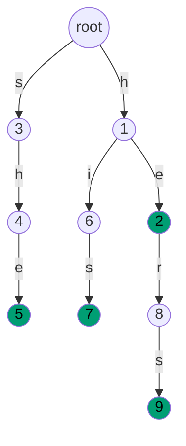
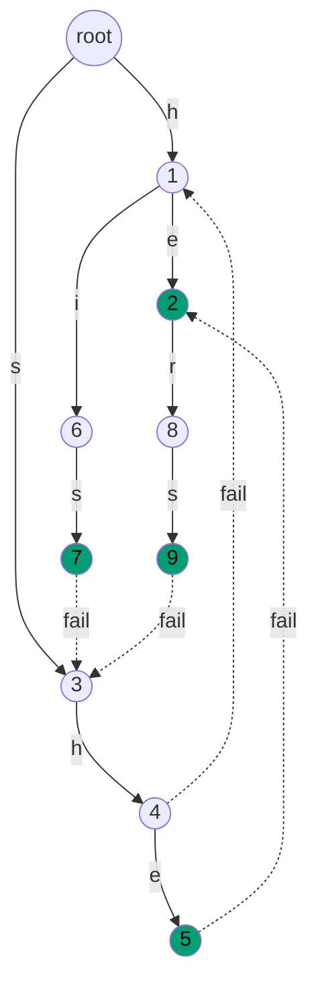

# Aho-Corasick: many patterns, one pass

Patterns `{he, she, his, hers}`. Text `ushers`. The text contains three matches: `she` ending at index 3, `he` ending at index 3, and `hers` ending at index 5. An honest first attempt runs the substring search from earlier in the part four times, once per pattern, and walks the six-character text six characters per run. That is a generous baseline. The algorithm Alfred Aho and Margaret Corasick published in *Communications of the ACM* in June 1975 walks the text exactly once, reports all three matches, and never visits any character twice.

This chapter is that algorithm. The shape is a trie with two extra ideas bolted on, and the bolting is most of the difficulty. Tries from [Tries](../part-6-trees-heaps/08-tries.md) handle the prefix structure of the pattern dictionary; the new pieces are *failure links* (where the matcher jumps when the trie path runs out) and *output inheritance* (how the matcher reports every pattern that ends at the current state without re-scanning anything). With both, the total cost is `O(n + m + z)` where `n` is the text length, `m` is the sum of pattern lengths, and `z` is the number of matches the matcher emits.

## Why running KMP k times is the wrong answer

The cleanest naive solve: for each pattern, run the linear-time single-pattern matcher (Knuth-Morris-Pratt) from earlier in the part against the text. That is `k` independent scans:

```python
# Naive: O(k * n + m) — what we're replacing
def find_all_naive(patterns, text):
    matches = {}
    for pat in patterns:
        matches[pat] = kmp_find_all(text, pat)   # one KMP run per pattern
    return matches
```

Two things are wrong with it. The first is the obvious one: `k` passes over an `n`-character text is `O(k*n)`, and the production use case (intrusion detection, antivirus scanning) ships with `k` in the thousands and `n` in the gigabytes. The second is more subtle. Each KMP run preprocesses one pattern's failure function and forgets it. When two patterns share a prefix (`he` and `hers`, `his` and `history`, all the variants of `password` in a dictionary attack), the redundant work is exactly the redundant work a trie collapses. Every dollar spent re-walking the shared prefix is a dollar Aho and Corasick reclaim by sharing the trie path once and gluing the per-pattern failure functions into one structure that handles all `k` patterns at once.[^1]

The structural signal that tells you to reach for AC instead of KMP-per-pattern: the dictionary is **fixed** (or rarely changes) and the texts streaming through are **many**. Preprocessing the automaton is a one-time cost amortised across every text the matcher sees afterward. If the dictionary changes per query, AC's preprocessing cost dominates and you want hashing instead.[^1] If you have one pattern, KMP is simpler and ships earlier in the part.

## What the automaton holds

Three structures, all sitting at every trie node.

**The goto function** is the trie of patterns. From each node, one labelled edge per character extends the prefix the path from root spells. Walking root → `h` → `e` lands you on the node that represents the prefix `he`. This is the data structure from [Tries](../part-6-trees-heaps/08-tries.md), nothing more.

**The failure link** is the new piece. From each node `v`, one back-edge to the node whose path-from-root spells the longest proper suffix of `v`'s path that is also a prefix of some pattern in the trie. The failure link from node `she` points to node `he` because `he` is the longest proper suffix of `she` that is itself a trie prefix. The failure link from node `sh` points to node `h` because `h` is the longest proper suffix of `sh` that is itself a trie prefix. Failure links from depth-1 nodes (direct children of root) all point to root, by definition.

**The output set** at each node lists which patterns end there. Node `he` has output `{he}`, node `hers` has output `{hers}`, node `she` has output `{she, he}` after output inheritance. More on that below.

The matcher's loop: given a text character, follow `goto` if it exists; otherwise, follow `failure` until a `goto` works or the matcher reaches root; emit every pattern in the current node's output set; advance.[^2] One character of text consumed per iteration. Failure walks are the only thing in the loop that look slow, and the amortisation argument in §"What it costs" bounds them.

## Building the trie

The first phase. Insert each pattern as a path from root, allocating nodes wherever the path doesn't exist yet, marking the terminal node with the pattern's id in its output set. Same as [Tries](../part-6-trees-heaps/08-tries.md), no surprises.

```python
# Phase 1: build the trie. children[v] is a dict {char: child_node}.
children = [{}]
fail = [0]                          # failure links; filled in Phase 2
out = [[]]                          # pattern ids whose match ends at this node

for pid, pat in enumerate(patterns):
    node = 0
    for ch in pat:
        nxt = children[node].get(ch)
        if nxt is None:
            nxt = len(children)
            children.append({})
            fail.append(0)
            out.append([])
            children[node][ch] = nxt
        node = nxt
    out[node].append(pid)
```

After running this on `{he, she, his, hers}`, the trie has ten nodes: root plus one per distinct prefix. Two patterns share the `h` edge from root, so `he` and `his` both descend through node 1. Node 2 (the `he` terminal) has child `r` because `hers` extends it; nodes 7 and 9 are the terminals for `his` and `hers`.



*The trie after inserting `{he, she, his, hers}`. Green nodes are output nodes; a pattern terminates there.*

## Adding the failure links

The hard piece. Failure links are computed by BFS over the trie, level by level, because `fail[v]` depends on `fail[parent(v)]` and BFS is the cheapest order that guarantees parents are visited before children.

The construction rule, for every non-root node `v` reached on edge labelled `ch` from parent `u`: walk up the failure chain from `u` until either you find an ancestor `f` where `goto[f][ch]` exists (set `fail[v] = goto[f][ch]`, unless that lands back on `v` itself), or you reach root (set `fail[v] = root`). That walk is short on average and amortises to linear in the trie size across the whole BFS.[^2]

```python
# Phase 2: BFS to fill fail[v]. Direct children of root all point to root.
queue = deque()
for child in children[0].values():
    fail[child] = 0
    queue.append(child)

while queue:
    u = queue.popleft()
    for ch, v in children[u].items():
        queue.append(v)
        f = fail[u]
        while f != 0 and ch not in children[f]:
            f = fail[f]
        fv = children[f].get(ch, 0)
        if fv == v:           # self-loop guard for depth-1 children
            fv = 0
        fail[v] = fv
        # Output inheritance; see next section.
        out[v].extend(out[fail[v]])
```

For the `{he, she, his, hers}` trie, six failure links are interesting. Depth-1 nodes (`h`, `s`) point to root. Node `he` (path `he`) falls back to root because no proper suffix of `he` is a trie prefix. Path `sh` falls back to `h` (the longest proper suffix of `sh` that is in the trie). For `she`, the failure target is `he`. And nodes `his` and `hers` both fall back to `s`.



*The same trie with failure links overlaid as dotted edges. Node `she` (5) fails to node `he` (2). When the matcher lands on node `she`, output inheritance ensures both `she` and `he` are reported.*

> [!IMPORTANT]
> The failure link from node `v` is **not** the link followed during the text scan when there is no `goto`. It is *one step* of that walk. A scan-time failure walk follows the failure chain `v → fail[v] → fail[fail[v]] → ...` until either a `goto[f][ch]` exists or `f == root`. Authors who conflate the two get the construction right and the scan wrong.

## Output inheritance: why every match is O(1)

Phase 2 above ends with one extra line: `out[v].extend(out[fail[v]])`. That line is doing the work that makes the scan emit every match in `O(1)` per match. Removing it is the single most common AC bug, because the bug is invisible on dictionaries where no pattern is a proper suffix of another.[^2]

The reason it matters: when the matcher reaches state `she` after consuming `ushe`, the trie says one pattern ends here (`she`). But `he` also ends at this position in the text. The path that proves it is `she → fail → he`, and the matcher would have to walk that chain at scan time, every step, every character, just in case some pattern's endpoint is sitting up the chain. That walk is amortised `O(1)` per scan position only because we *pre-merged* the chain at construction time. By the time the BFS finishes processing node `she`, its output set has been extended with everything `out[fail[she]] = out[he]` contains, so `out[she] = {she, he}`. The scan looks at exactly one set per position.[^2]

The asymptotic claim, made precise: the matcher emits each match in amortised `O(1)` time, total scan work is `O(n + z)` where `z` is the total number of matches. Without inheritance, the worst case is `O(n * L)` where `L` is the longest pattern length, because the matcher walks up the failure chain on every character on adversarial inputs.[^2] Two-or-three constant lines of construction work, asymptotic improvement, no caveats.

## Running the matcher

Phase 3 is the loop the chapter exists for. One state pointer (`node`), starting at root. For each text character: walk the failure chain until `goto` works or you hit root; take the `goto`; report every match in `out[node]`.

```python
# Phase 3: scan the text.
result = {}
node = 0
for i, ch in enumerate(text):
    while node != 0 and ch not in children[node]:
        node = fail[node]
    node = children[node].get(ch, 0)
    for pid in out[node]:
        start = i - len(patterns[pid]) + 1
        result.setdefault(patterns[pid], []).append(start)
return result
```

**Solution** — Python ([Java](./04-aho-corasick/lc-1032/sol.java) · [C++](./04-aho-corasick/lc-1032/sol.cpp) · [Go](./04-aho-corasick/lc-1032/sol.go))

```python
# LC 1032. Stream of Characters

from collections import deque
from typing import List


class StreamChecker:
    """Aho-Corasick streaming matcher: query(c) returns True iff some pattern
    in the dictionary is a suffix of the characters streamed so far.

    The chapter teaches the offline matcher
        aho_corasick(patterns, text) -> {pattern: [start, ...]}
    LC 1032 is the same automaton with one character per call: the
    automaton state persists across calls, and query() returns True
    whenever the current state has any output.
    """

    def __init__(self, words: List[str]):
        # children[node][ch] -> child node id
        self.children: List[dict] = [{}]
        # failure link; root's fail is itself (0)
        self.fail: List[int] = [0]
        # whether any pattern's match ends at this node (after output inheritance)
        self.has_output: List[bool] = [False]

        # 1) Build the trie.
        for pat in words:
            node = 0
            for ch in pat:
                nxt = self.children[node].get(ch)
                if nxt is None:
                    nxt = len(self.children)
                    self.children.append({})
                    self.fail.append(0)
                    self.has_output.append(False)
                    self.children[node][ch] = nxt
                node = nxt
            self.has_output[node] = True

        # 2) Build failure links via BFS. BFS guarantees fail[parent] is
        #    computed before fail[child].
        queue = deque()
        for child in self.children[0].values():
            self.fail[child] = 0
            queue.append(child)
        while queue:
            u = queue.popleft()
            for ch, v in self.children[u].items():
                queue.append(v)
                f = self.fail[u]
                while f != 0 and ch not in self.children[f]:
                    f = self.fail[f]
                fv = self.children[f].get(ch, 0)
                if fv == v:
                    fv = 0
                self.fail[v] = fv
                # Output inheritance: any pattern ending on the failure
                # chain also ends here. Without this, the matcher misses
                # suffix-of-suffix matches (he inside she).
                if self.has_output[self.fail[v]]:
                    self.has_output[v] = True

        self.node = 0  # current automaton state, persisted across queries

    def query(self, letter: str) -> bool:
        # Advance one character: walk failure links until goto is defined,
        # then take the goto edge. Same shape as the offline scan.
        while self.node != 0 and letter not in self.children[self.node]:
            self.node = self.fail[self.node]
        self.node = self.children[self.node].get(letter, 0)
        return self.has_output[self.node]
```

The companion implementations adapt the offline matcher into a `StreamChecker` class for LC 1032: the automaton state persists across `query(c)` calls, the per-character work is identical, and the only change is that the loop body is invoked one character at a time instead of inside a `for` over the text.

## Worked example: `{he, she, his, hers}` against `ushers`

Six characters, six iterations, exactly one failure walk in the entire run. The trace is in the table below.[^1]

| `i` | `text[i]` | state at start | failure walks | landing node | matches emitted |
|---|---|---|---|---|---|
| 0 | `u` | 0 (root) | none | 0 (root); `u` is unknown, stay at root | (none) |
| 1 | `s` | 0 | none | 3 (`s`) | (none) |
| 2 | `h` | 3 | none; `goto[3][h] = 4` (the trie has `sh` for `she`) | 4 (`sh`) | (none) |
| 3 | `e` | 4 | none; `goto[4][e] = 5` | 5 (`she`) | `she @ start 1`, `he @ start 2` (inherited from `out[5] = {she, he}`) |
| 4 | `r` | 5 | one walk: `5 → fail[5] = 2` (now at node `he`); `goto[2][r] = 8` exists | 8 (`her`) | (none) |
| 5 | `s` | 8 | none; `goto[8][s] = 9` | 9 (`hers`) | `hers @ start 2` |

The whole trace turns on what happens at `i = 3` and `i = 4`. At `i = 3` the matcher lands on node `she`, and output inheritance gives it both matches at once (`she` ending at index 3 and `he` ending at index 3) without re-walking anything. One step later, at `i = 4`, the matcher hits its only failure walk in the trace: from `she` there's no `r` edge, so it follows `fail[5] = 2` to land on node `he`, where `goto[2][r] = 8` does exist. From there, one more `goto` on `s` reaches node `hers`, and the third match emits.

Three matches reported, six characters consumed, exactly one failure walk. Pattern `his` doesn't occur in the text and never fires. The full result is `{she: [1], he: [2], hers: [2]}`, matching the trace in the original 1975 paper on this exact input.[^1]

## What it costs

| Phase | Time | Space | Notes |
|---|---|---|---|
| Build trie | `O(m)` | `O(m * σ)` array-of-children, `O(m)` map-of-children | One node per distinct prefix; `m` is sum of pattern lengths |
| Build failure links (BFS) | `O(m * σ)` array, `O(m * log σ)` map | `O(m)` aux | Amortisation argument below |
| Scan text | `O(n + z)` | `O(1)` per character beyond automaton state | Output inheritance is doing the work |
| **Total (one text)** | **`O(n + m + z)`** | `O(m * σ)` | Aho-Corasick 1975 Theorem 3 [^1] |

The bound is information-theoretic in `z`: the matcher has to emit each match, and there can be `Θ(n*k)` matches in the worst case (text `aaaa...a` against patterns `{a, aa, aaa, ...}`), so `z` cannot be folded into `O(n + m)`.[^1]

The amortisation argument for the BFS construction is the standard one and worth seeing once. Inside the BFS, the `while f != 0 and ch not in children[f]: f = fail[f]` loop looks expensive, but a potential function bounds the total work. Define the potential of node `u` as the depth of `u` in the trie. Depth strictly decreases on every iteration of the inner `while` (the failure chain goes shallower), and increases by at most 1 each time the BFS descends to a child. Summing across the whole BFS, the total number of inner-loop iterations is bounded by the total depth descents, which is bounded by `m` (one descent per trie edge). Total construction work: `O(m)` amortised inner iterations plus `O(m)` BFS visits = `O(m)`.[^3] The same argument applies to the scan-time failure walks: depth drops on a failure follow, depth rises by one on a `goto`, total scan work is `O(n)` plus `O(z)` for emission.[^2]

> [!NOTE]
> The space coefficient `σ` (alphabet size) shows up because the array-of-children layout reserves one slot per alphabet symbol per node. For lowercase Latin (`σ = 26`), that's roughly `26m` integers, which is fine. For ASCII (`σ = 128`), four times that, still fine. For full Unicode (`σ > 100,000`), it's catastrophic; production implementations switch to hash-map children (slower constant factor, much smaller memory) or to compressed double-array tries (the trick YARA's malware-rules engine uses, since it scans gigabytes of memory and arrays-of-256-per-node would explode).[^5]

## When the patterns bend

The construction above is the textbook AC. Two variants come up often enough to name.

### DFA precomputation: from amortised O(1) to worst-case O(1) per scan step

The scan loop's `while node != 0 and ch not in children[node]: node = fail[node]` is amortised `O(1)` per step but worst-case `O(L)` for a single step. In a hot loop where every microsecond matters (Snort scanning every packet at line rate, an antivirus scanner sweeping a multi-gigabyte memory image), the worst case shows up.[^4] The fix: at construction time, precompute `go[v][c]` for every `(v, c)` pair using `go[v][c] = go[fail[v]][c]` whenever `goto[v][c]` is undefined. This converts the failure-link automaton into a deterministic finite automaton (DFA) where each scan step is one array lookup, no inner loop. Aho and Corasick give this construction in §4 of the original paper.[^1] Memory grows by a factor of `σ` (now every node has a fully populated transition table), but the scan step is one lookup, period.

### Streaming AC: persist the state across calls

The chapter's signature problem (LC 1032 Stream of Characters) is AC with one twist: the text arrives one character at a time, and after each character the matcher must answer "does any pattern end here?". What changes is purely the API. The automaton state pointer `node` becomes a class field that survives across `query` calls; each call runs one iteration of the scan loop. Per-call work is the same `O(1)` amortised. Companion `StreamChecker` implementations on this chapter use exactly this shape.

A frequent variant on LC 1032 reverses each pattern, builds a trie of the reversed patterns, and walks the *latest character of the stream first*. That is the same algorithm on the reversed dictionary, equivalent in matching power and slightly different in the direction the trie is traversed; both formulations show up in solution archives. Forward AC matches the algorithm Snort and YARA actually run; the reverse-trie variant is the framing that makes LC 1032 click without naming AC.

## Three pitfalls that bite

> [!WARNING]
> **Forgetting output inheritance.** Drop the `out[v].extend(out[fail[v]])` line and the matcher silently misses every match where the pattern ends "via the failure chain" (`he` inside `she`, `ers` inside `hers`). The bug is invisible on dictionaries where no pattern is a proper suffix of another, because the inherited set is empty and there's nothing to merge. So the unit tests pass, the code review passes, and the matcher ships into production silently dropping matches. The fix is one line at the end of the BFS body. Add it and never remove it.

> [!WARNING]
> **Recursive failure-link computation overflows the stack.** Some textbook presentations show a memoised recursive `compute_fail(v) { if not computed: compute_fail(parent(v)); ... }` form. It's correct on small inputs and explodes on adversarial ones (long single patterns, deep trie chains, the kinds of inputs competitive-programming judges love). BFS is not just an implementation choice; it's a correctness guarantee that `fail[parent]` is computed before `fail[child]` because parents are at strictly smaller BFS levels. Use BFS.

> [!WARNING]
> **The self-loop on root's children.** When computing `fail[v]` for a depth-1 node `v` (a direct child of root) whose label happens to coincide with what the lookup returns, a careless implementation produces `fail[v] = v` (a self-loop). The scan-time `while node != 0 and ch not in children[node]: node = fail[node]` then never terminates. The fix is the `if fv == v: fv = 0` guard in the construction code above, plus initialising depth-1 nodes' failure pointers to root explicitly before the BFS starts. Both safeguards together; either one alone has a corner case the other catches.

## Where it ships in production

AC has unusually clean production lineage. Three named systems run it.

**Snort**, the open-source intrusion-detection system originally from Sourcefire (now Cisco), uses Aho-Corasick as the core of its multi-pattern signature matcher: every packet that flows through a Snort sensor is scanned against thousands of attack-string signatures in one AC pass, and the deterministic-finite-automaton variant from the previous section is the one that earns its place in the hot loop.[^4]

**YARA**, the malware-rules engine that anchors most modern antivirus and threat-hunting workflows, uses a byte-level (`σ = 256`) AC matcher under a cap of four-byte "atom" patterns; the engine extracts atoms from each rule, compiles them into a shared automaton, and scans every byte of the target file or memory image once. The compressed-trie variant is the answer to the alphabet-explosion problem; the matcher itself is unchanged from the 1975 algorithm.[^5]

**fgrep**, the Unix utility that GNU `grep -F` later replaced, was the workhorse Aho and Corasick wrote the algorithm to power: locate any of a finite list of fixed strings in a text in time proportional to the text length, regardless of list size. The 1975 paper's subtitle calls the use case "an aid to bibliographic search," which was the original IBM library application; `fgrep` generalised it to every Unix shell that ever needed to find a list of words in a file.[^6]

The line connecting these three (the IDS, the antivirus engine, the Unix utility) is what justifies the chapter's complexity. Most readers will never implement AC. They will use it daily through one of the systems above.

## Problem ladder

### CORE (solve all three to claim chapter mastery)

- [LC 1032 — Stream of Characters](https://leetcode.com/problems/stream-of-characters/) [Hard] • trie-with-failure-link-streaming ★
- [LC 745 — Prefix and Suffix Search](https://leetcode.com/problems/prefix-and-suffix-search/) [Hard] • bidirectional-trie-multi-key
- [LC 648 — Replace Words](https://leetcode.com/problems/replace-words/) [Medium] • trie-shortest-prefix-match

### STRETCH (optional)

- [LC 720 — Longest Word in Dictionary](https://leetcode.com/problems/longest-word-in-dictionary/) [Easy] • trie-membership-scan

LC 1032 is the chapter's signature problem (★) and the one whose AC formulation appears in the companion `StreamChecker` files. LC 648 is the gentler entry point: a trie scan against a stream of word starts, no failure links needed, but the same "preprocess once, scan many" mental model that AC extends. LC 745 generalises the preprocessing trick to bidirectional matching. LC 720 is the adjacent-pattern Easy: a single-trie problem with no failure links, filling the Easy band that multi-pattern matching has no canonical entry for on LC.

The Word Search II problem (LC 212) is a relative (trie + DFS-on-grid, with the failure machinery replaced by null-child pruning), but its primary lesson is the trie acceleration of an outer search, and [Tries](../part-6-trees-heaps/08-tries.md) owns it as CORE.

## Where this leads

The next chapter, on suffix arrays, takes a different angle on the same "preprocess once, query many" idea: instead of preprocessing the patterns and streaming the text past, preprocess the text into a sorted index of all its suffixes, and answer arbitrary pattern queries against that. AC and suffix arrays are duals: one indexes the patterns, the other indexes the text, and the right pick depends on which side is fixed. AC wins when the dictionary is fixed and the texts are many; suffix arrays win when the text is fixed and the queries are many.

[Tries](../part-6-trees-heaps/08-tries.md) is the prerequisite to re-read if any of the trie mechanics above felt fast. AC is a trie with two extra ideas; the trie itself is the same R-way structure that chapter teaches.

## References

[^1]: Alfred V. Aho and Margaret J. Corasick, "Efficient string matching: an aid to bibliographic search," *Communications of the ACM* 18(6):333-340, June 1975. DOI: [10.1145/360825.360855](https://doi.org/10.1145/360825.360855).

[^2]: cp-algorithms.com, "Aho-Corasick algorithm," accessed May 2026. <https://cp-algorithms.com/string/aho_corasick.html>.

[^3]: Maxime Crochemore, Christophe Hancart, and Thierry Lecroq, *Algorithms on Strings*, Cambridge University Press 2007.

[^4]: University of Edinburgh, Research Explorer, "Hardware/Software Mechanisms for Protecting an IDS against Algorithmic Complexity Attacks," 2012. <https://www.research.ed.ac.uk/en/publications/hardwaresoftware-mechanisms-for-protecting-an-ids-against-algorit>.

[^5]: HackMag, "YARA to the maximum: writing effective YARA rules by examples." <https://hackmag.com/security/effective-yara>.

[^6]: GeeksforGeeks, "Aho-Corasick Algorithm for Pattern Searching," updated 2025. <https://www.geeksforgeeks.org/aho-corasick-algorithm-pattern-searching/>.
