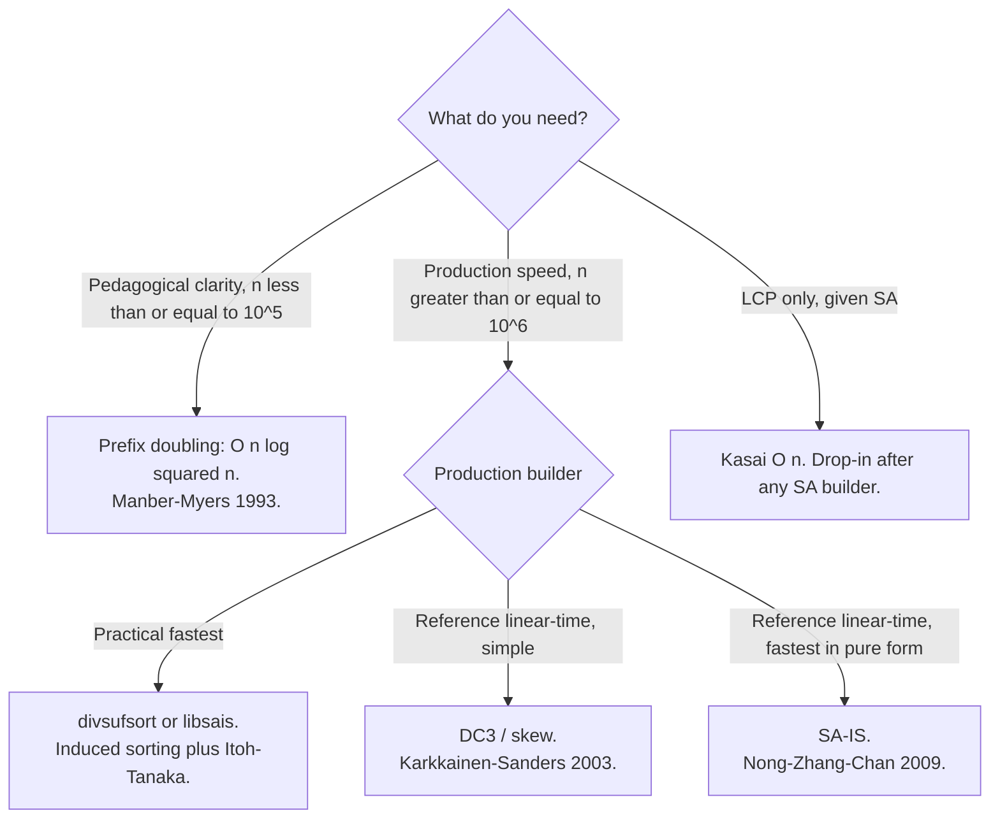

# Suffix arrays: a sorted index of every suffix

Udi Manber and Gene Myers published *Suffix Arrays: A New Method for On-Line String Searches* at SODA in 1990, and the journal version landed in *SIAM Journal on Computing* in 1993. The pitch was a structure that does almost everything a suffix tree does, in a fraction of the space: roughly **4n bytes for the suffix array versus 20n bytes for an equivalent suffix tree** on a typical implementation. Twenty years later, every serious bioinformatics pipeline, every Burrows-Wheeler-Transform compressor, and every offline string indexer in Go's standard library is built on the descendants of that paper.

The structure itself is one line: **the suffix array of a string is a sorted list of the starting positions of every suffix.** For `s = "banana"`, the six suffixes are `banana`, `anana`, `nana`, `ana`, `na`, `a`. Sort them lexicographically and write down the starting position of each: `a` came from index 5, `ana` from index 3, `anana` from index 1, `banana` from index 0, `na` from index 4, `nana` from index 2. The array `[5, 3, 1, 0, 4, 2]` is the suffix array. That's it. No tree, no pointers, no per-node header. Six integers for a six-character string.

This chapter is a primer, not an interview workhorse. Suffix-array problems are scarce on LeetCode. They live on Codeforces, in `index/suffixarray`, in the FM-index that powers BWA and Bowtie. The reason to learn the structure here is to recognise the shape of problems that want it, to understand the LCP-array partner that does most of the actual work, and to read a paper or library reference without tripping over the vocabulary.

## What the array gives you, and what it doesn't

Two facts carry the chapter, and a third earns the section after this one.

**Fact one: sorted suffixes group lexicographically.** Suffixes that share a prefix sit next to each other in the suffix array. For `"banana"`, the suffixes `ana` and `anana` both start with `an` and land at adjacent ranks 1 and 2. Any pattern that occurs in the text is the prefix of *some* suffix, and all the suffixes starting with that pattern form a contiguous slice. That is the entire reason binary search works on this structure.

**Fact two: the array is integers, not strings.** The suffix array stores starting positions, never the suffix text. A suffix is named by its index; its content is recovered by slicing `s` from that index to the end whenever you actually need to compare. For most operations you don't need to: the array's order is the answer.

```mermaid
flowchart LR
    subgraph Input["Input string"]
        S["s = banana"]
    end
    subgraph SA["Suffix array (sorted suffix starts)"]
        SA0["SA[0] = 5  -- a"]
        SA1["SA[1] = 3  -- ana"]
        SA2["SA[2] = 1  -- anana"]
        SA3["SA[3] = 0  -- banana"]
        SA4["SA[4] = 4  -- na"]
        SA5["SA[5] = 2  -- nana"]
    end
    subgraph LCP["LCP array (Kasai)"]
        L0["LCP[0] = 0"]
        L1["LCP[1] = 1   a vs ana"]
        L2["LCP[2] = 3   ana vs anana"]
        L3["LCP[3] = 0   anana vs banana"]
        L4["LCP[4] = 0   banana vs na"]
        L5["LCP[5] = 2   na vs nana"]
    end
    S --> SA
    SA --> LCP
```



*The suffix array `[5, 3, 1, 0, 4, 2]` lists suffix starting positions in sorted order; the LCP array `[0, 1, 3, 0, 0, 2]` records the longest common prefix between each suffix and its predecessor in sorted order.*

What the array does not give you, on its own, is any information about prefix overlap between two suffixes. The first suffix at rank 1 is `ana` and the next at rank 2 is `anana`; they share a 3-character prefix. The suffix array knows the order; it does not know the 3. That number lives in a sibling structure called the LCP array, and most of the useful applications of suffix arrays are really applications of the SA-and-LCP pair. The LCP gets its own section below.

## Building the array: prefix doubling

The naive build is "sort the n suffixes by string comparison". Each comparison takes up to O(n) time and there are O(n log n) comparisons, so the total is O(n² log n).[^4] On `n = 10⁵` that runs for hours. The paper that introduced suffix arrays also introduced a faster build, and it is the build worth learning first.

Prefix doubling rests on a single invariant: **after pass `k` of the loop, two suffixes have the same rank if and only if their first `2^k` characters are identical.** Pass 0 ranks every suffix by its first character. Pass 1 ranks them by the first two characters, by sorting on the pair `(rank[i], rank[i+1])` from pass 0. Pass 2 ranks by the first four characters, pair `(rank[i], rank[i+2])`. Pass 3 by eight, and so on. After `ceil(log_2 n)` passes, `2^k >= n`, every suffix has a unique rank, and the sorted order falls out for free.

Each pass dominates by sorting `n` integer pairs. A comparison sort gives O(n log n) per pass and O(n log² n) overall.[^4] Manber and Myers's original paper substitutes radix sort over the bounded ranks for O(n) per pass and O(n log n) overall;[^1] the comparison-sort form is what fits in a chapter:

```python
def build_suffix_array(s):
    n = len(s)
    sa = list(range(n))
    rank = [ord(c) for c in s]
    k = 1
    while True:
        sa.sort(key=lambda i: (rank[i], rank[i + k] if i + k < n else -1))
        tmp = [0] * n
        for j in range(1, n):
            same = (rank[sa[j]], rank[sa[j] + k] if sa[j] + k < n else -1) \
                == (rank[sa[j - 1]], rank[sa[j - 1] + k] if sa[j - 1] + k < n else -1)
            tmp[sa[j]] = tmp[sa[j - 1]] + (0 if same else 1)
        rank = tmp
        if rank[sa[n - 1]] == n - 1:
            break
        k *= 2
    return sa
```

**Solution** — Python ([Java](./05-suffix-array/build-suffix-array/sol.java) · [C++](./05-suffix-array/build-suffix-array/sol.cpp) · [Go](./05-suffix-array/build-suffix-array/sol.go))

```python
# Suffix array via prefix doubling, plus Kasai LCP. O(n log^2 n) build, O(n) LCP.
from typing import List


def build_suffix_array(s: str) -> List[int]:
    """Suffix array of s via prefix doubling. O(n log^2 n) time."""
    n = len(s)
    if n == 0:
        return []
    sa = list(range(n))
    rank = [ord(c) for c in s]

    def key(i: int, k: int) -> tuple:
        return (rank[i], rank[i + k] if i + k < n else -1)

    k = 1
    while True:
        sa.sort(key=lambda i: key(i, k))
        tmp = [0] * n
        for j in range(1, n):
            same = key(sa[j], k) == key(sa[j - 1], k)
            tmp[sa[j]] = tmp[sa[j - 1]] + (0 if same else 1)
        rank = tmp
        if rank[sa[n - 1]] == n - 1:
            break
        k *= 2
    return sa


def build_lcp_kasai(s: str, sa: List[int]) -> List[int]:
    """Kasai O(n). lcp[i] = lcp(sa[i-1], sa[i]); lcp[0] = 0."""
    n = len(s)
    if n == 0:
        return []
    inv = [0] * n
    for i, p in enumerate(sa):
        inv[p] = i
    lcp = [0] * n
    h = 0
    for i in range(n):
        if inv[i] > 0:
            j = sa[inv[i] - 1]
            while i + h < n and j + h < n and s[i + h] == s[j + h]:
                h += 1
            lcp[inv[i]] = h
            if h > 0:
                h -= 1
    return lcp
```

The termination check `rank[sa[n - 1]] == n - 1` reads as "the last suffix in sorted order has the maximum possible rank, which means every rank is distinct". When that fires, no further passes can change the order, and the loop exits.

Two cells in the algorithm are footguns. Both are explicit warnings later in the chapter; their teaching cut belongs here.

The first is in the re-rank loop. The temporary array has to be indexed by `sa[j]`, not by `j`. A suffix's rank is keyed by its starting position in the text, not by its position in the sorted order. Writing `tmp[j] = ...` instead silently swaps the roles of the suffix array and the inverse suffix array, and every downstream operation gets wrong answers without crashing. CP-Algorithms walks through this confusion explicitly.[^4]

The second is in the comparator's reads. In Java and Go and any language where `sort` calls a closure that captures `rank` by reference, mutating `rank` mid-pass corrupts the sort. The reference Java implementation clones `rank` once at the top of each pass and passes the clone to the comparator. The Python implementation rebuilds `rank` only after the sort completes. Either pattern works; reading and writing the same array during the sort does not.

## The LCP array, and Kasai's linear pass

A suffix array alone answers questions about *order*: what's the smallest rotation, what's the k-th lexicographically smallest substring, where in this ranked list does my pattern appear. Plenty of useful questions, but most of the famous applications, longest repeating substring, count of distinct substrings, fast pattern search, want a different question answered first: **how much do adjacent suffixes in the sorted order overlap?**

The LCP array makes that question constant-time per index. `LCP[i]` is the length of the longest common prefix between the suffix at sorted rank `i` and the suffix at rank `i - 1`. By convention `LCP[0] = 0` because there is no predecessor at rank 0. For `"banana"`, the array is `[0, 1, 3, 0, 0, 2]`: rank 1's `ana` shares 1 character (`a`) with rank 0's `a`; rank 2's `anana` shares 3 characters (`ana`) with rank 1's `ana`; rank 3's `banana` shares nothing with `anana`; and so on.

You can compute the LCP naively in O(n²) by comparing each adjacent pair in the suffix array character by character. Kasai's 2001 algorithm does it in O(n) by walking the text in original index order rather than in rank order, and reusing comparison work between consecutive iterations:[^5]

```python
def build_lcp_kasai(s, sa):
    n = len(s)
    inv = [0] * n
    for i, p in enumerate(sa):
        inv[p] = i
    lcp = [0] * n
    h = 0
    for i in range(n):
        if inv[i] > 0:
            j = sa[inv[i] - 1]
            while i + h < n and j + h < n and s[i + h] == s[j + h]:
                h += 1
            lcp[inv[i]] = h
            if h > 0:
                h -= 1
    return lcp
```

The trick that delivers the O(n) bound is the variable `h`. Each outer iteration extends `h` by zero or more characters, then decrements it by exactly one before moving to the next text position. `h` therefore increments at most `n` times across all iterations and decrements at most `n` times, so the total work in the inner `while` loop is O(n).[^4] The amortisation argument is one of the prettier results in stringology; it is also the reason every textbook treatment of suffix arrays teaches Kasai immediately after the build.

Three applications fall out of the SA-plus-LCP pair without further machinery:

- **Longest repeating substring.** Walk the LCP array; the answer's length is `max(LCP)` and one occurrence starts at `s[SA[i] : SA[i] + LCP[i]]` where `i` is the argmax.[^6]
- **Number of distinct substrings.** Every substring is a prefix of exactly one suffix. The total prefix count is `n(n+1)/2`; subtract the duplicates counted by `sum(LCP)`. Answer: `n(n+1)/2 - sum(LCP)`.[^4]
- **Pattern search in O(\|P\| log n).** Binary-search the suffix array for the first suffix whose prefix matches `P`; binary-search again for the first suffix lexicographically larger than `P`'s upper bound; the count of occurrences is the difference of the two ranks. Adding an LCP-LR augmentation drops the per-query cost to O(\|P\| + log n).[^1]

The third application is what makes suffix arrays interview-relevant on the rare occasion they appear: the chapter on [Binary search: the canonical version](../part-2-search-sort/01-binary-search-canonical.md) gives you the lower-bound template, and the suffix array is the structure you feed it. Pattern search on a fixed text, with patterns arriving online, becomes O(\|P\| log n) per query after a one-time build.

## Linear-time construction: cited, not implemented

Prefix doubling with comparison sort is O(n log² n). With radix sort it is O(n log n). For most inputs that's enough. For `n = 10⁶` and above, the log factor starts to matter, and the literature has answered with two well-known linear-time algorithms.

Kärkkäinen and Sanders's **DC3** (also called the *skew algorithm*) at ICALP 2003 sorts the suffixes whose starting position satisfies `i mod 3 != 0` recursively, then merges them with the remaining `i mod 3 == 0` suffixes in two stable-sort passes.[^7] Linear time, conceptually clean, fits in about a page of pseudocode.

Nong, Zhang, and Chan's **SA-IS** at DCC 2009 takes a different route. Every text position is classified as L-type, S-type, or LMS (leftmost-S), based on whether the suffix at that position is lexicographically larger or smaller than its successor. The algorithm sorts the LMS substrings recursively, then *induces* the sort of every other suffix from the LMS sort in two linear scans.[^8] Linear time, denser to read, and the fastest known suffix-array builder in practice. Go's `index/suffixarray` package ships SA-IS.[^3] The de-facto fastest open-source builders, Yuta Mori's `divsufsort` and Ilya Grebnov's `libsais`, are induced-sorting variants in the same family.[^2]

Both algorithms deserve their own chapter. Neither gets one here. The reasoning is honest: a primer on the structure, the LCP partner, and the prefix-doubling build is enough surface area for a reader to recognise suffix-array problems, read a library reference, and decide whether they want to go deeper. A chapter that derives SA-IS from first principles is a multi-day reading project that competes with the rest of the book for shelf space.



*Prefix doubling is this chapter's reference for clarity; for any production application, pull from a vetted library that implements SA-IS or one of its descendants.*

## What it actually costs

| Operation | Time | Space | Notes |
|---|---|---|---|
| Naive build (sort suffixes by string compare) | O(n² log n) | O(n²) for substring storage | The baseline this chapter is replacing. |
| Prefix doubling, comparison sort | O(n log² n) | O(n) | What the chapter teaches. |
| Prefix doubling, radix sort (Manber-Myers 1993) | O(n log n) | O(n) | Original paper.[^1] |
| DC3 / skew (Kärkkäinen-Sanders 2003) | O(n) | O(n) | Cited; not implemented.[^7] |
| SA-IS (Nong-Zhang-Chan 2009) | O(n) | O(n) | Cited; not implemented. Production standard.[^8] |
| Kasai LCP, given SA | O(n) | O(n) | Linear by amortised analysis on `h`.[^5] |
| Pattern search, SA only | O(\|P\| log n) | O(n) | Binary search the suffix array.[^1] |
| Pattern search, SA + LCP-LR | O(\|P\| + log n) | O(n) | Augmented binary search.[^1] |

Constants matter at this scale. The 4n-byte SA versus 20n-byte suffix tree gap is what made suffix arrays viable for 1990s genome data, and the gap has widened since: divsufsort and libsais routinely build SAs on the human genome, three billion characters, in under a minute on a single core.[^2] If you ever find yourself rolling a suffix array for a real production workload, do not type the build from a chapter; pull a vetted library.

## Five places this bites

> [!WARNING]
> **The re-rank step indexes by `sa[j]`, not by `j`.** The new rank for the suffix at sorted-order position `j` has to be written into the cell named by that suffix's text-starting-position, which is `sa[j]`. Writing `tmp[j] = ...` swaps the suffix array and its inverse, and every downstream operation produces wrong answers without crashing. The verified reference implementations in all four languages share this exact pattern; deviation breaks the canonical test on the very first input.[^4]

> [!WARNING]
> **Without a sentinel, prefix doubling sorts cyclic shifts, not suffixes.** The textbook formulation sorts cyclic substrings of the input. To recover true suffix sorting, append a character lexicographically smaller than every alphabet character (commonly `$` or `\0`), build on the augmented string, and drop the sentinel position from the result. The reference in this chapter terminates on the rank-distinct check, which is equivalent to the sentinel approach for the inputs it handles, but copying a CP-Algorithms snippet without the sentinel-and-strip step is the most common LeetCode-Discuss bug in suffix-array threads.[^4]

> [!WARNING]
> **A Java comparator that captures `rank` will see corrupted values mid-sort.** `Arrays.sort` calls the comparator many times during a single sort. If the captured array mutates between calls, the comparison contract's transitivity fails and the result is undefined. Clone `rank` once at the top of each pass; pass the clone to the lambda. The reference implementation does this with `final int[] r = rank.clone();` and the comment that pins down why.

> [!WARNING]
> **The LCP array's index 0 is a convention, not a value.** `LCP[0]` is zero because the suffix at rank 0 has no predecessor; some references define it as 1-indexed and start from `LCP[1]`. Mixing the two conventions silently shifts every later application, and the bug only surfaces on edge cases like the all-equal string `"aaaa"` where the LCP carries every distinguishing answer.[^9]

> [!WARNING]
> **The suffix array alone does not answer substring questions.** "Longest repeating substring", "count of distinct substrings", "longest common prefix between two arbitrary suffixes", all of these are SA-plus-LCP questions, and the SA without the LCP gets you about a third of the way. Build the LCP every time you build the SA; the additional cost is one linear scan and the application surface widens by an order of magnitude.

## Where this fits

Three structures answer "find a substring" with three different trade-offs, and the choice between them is largely about what's known up front. A [trie](../part-6-trees-heaps/08-tries.md) is the right structure when the dictionary is fixed and the queries are arbitrary text; a suffix array inverts the role, fixing the *text* and accepting arbitrary queries. The KMP automaton from [Naive string matching: the O(nm) baseline](./00-naive-string-matching.md) and its successors are online: text and pattern are both presented at query time, no preprocessing of either is reusable across queries. Suffix arrays are the offline-indexing slot in this taxonomy, and they shine when the same fixed text answers many pattern queries.

Outside interviews, the suffix array is often the front end of something else: the FM-index that powers BWA and Bowtie in genome alignment uses a suffix array as the basis for its rank operations, the Burrows-Wheeler-Transform compressor uses it to find the BWT in O(n), and LZ77 factorisation drops to O(n) when an SA is available.[^2] None of those applications is on LeetCode, but they are why the data structure has survived since 1990 and why every standard library that does serious string work ships an SA-IS implementation under the hood.

## Problem ladder

This chapter is foundation/framework-exempt: the LeetCode catalogue under-emphasises suffix-array problems, and the two anchor problems below are listed for connection rather than as graded core practice. Both can be solved without ever building a suffix array; the SA framing is the conceptually clean approach the chapter primes for.

### Anchor problems (illustrative; not graded as CORE)

- [LC 1163 — Last Substring in Lexicographical Order](https://leetcode.com/problems/last-substring-in-lexicographical-order/) [Hard] • suffix-array-conceptual
- [LC 1062 — Longest Repeating Substring](https://leetcode.com/problems/longest-repeating-substring/) [Medium, Premium] • suffix-array + LCP *(reference: Python only)*

LC 1163 asks for the lexicographically largest suffix; the textbook solve builds the SA and returns `s[SA[n - 1]:]`. The accepted O(n) editorial uses two pointers without an SA, but the SA framing is the version this chapter prepares you to write. LC 1062's textbook solve is `max(LCP)` after Kasai; the published editorial leans on binary-search-on-length plus rolling hashes because the Premium tier was not optimised for SA exposition. The free alternative LC 1044 *Longest Duplicate Substring* admits the same SA + LCP solution.

## References

[^1]: Udi Manber and Gene Myers, "Suffix Arrays: A New Method for On-Line String Searches," *SIAM Journal on Computing* 22(5):935-948, 1993; conference version SODA 1990, pp. 319-327. <https://epubs.siam.org/doi/10.1137/0222058>.

[^2]: Wikipedia, "Suffix array," accessed 2026-05-25. <https://en.wikipedia.org/wiki/Suffix_array>.

[^3]: Go standard library, `index/suffixarray` package, file `sais.go`. <https://golang.org/src/index/suffixarray/sais.go>.

[^4]: CP-Algorithms, "Suffix Array," last updated August 2024. <https://cp-algorithms.com/string/suffix-array.html>.

[^5]: Toru Kasai, Gunho Lee, Hiroki Arimura, Setsuo Arikawa, and Kunsoo Park, "Linear-Time Longest-Common-Prefix Computation in Suffix Arrays and Its Applications," *Combinatorial Pattern Matching (CPM 2001)*, LNCS 2089, pp. 181-192. <https://doi.org/10.1007/3-540-48194-X_17>.

[^6]: Wikipedia, "LCP array," accessed 2026-05-25. <https://en.wikipedia.org/wiki/LCP_array>.

[^7]: Juha Kärkkäinen and Peter Sanders, "Simple Linear Work Suffix Array Construction," *ICALP 2003*, LNCS 2719, pp. 943-955. <https://doi.org/10.1007/3-540-45061-0_73>.

[^8]: Ge Nong, Sen Zhang, and Wai Hong Chan, "Linear Suffix Array Construction by Almost Pure Induced-Sorting," *Data Compression Conference (DCC 2009)*, p. 193. <https://doi.org/10.1109/DCC.2009.42>.

[^9]: Maxime Crochemore, Christophe Hancart, and Thierry Lecroq, *Algorithms on Strings*, Cambridge University Press, 2007, Chapter 4 ("Suffix arrays").
