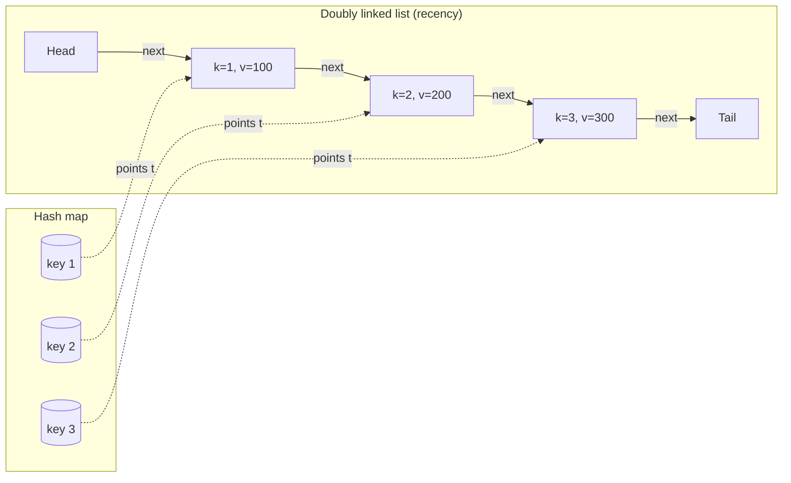

# LRU cache: design framing, concurrency, and multi-tier deployment

The LRU cache scares interview candidates twice. First when the prompt says `O(1) get and put with eviction` and they have to compose two data structures. Then again when the interviewer says `now make it thread-safe and tell me how you'd run it across three tiers of memory`. Caffeine, the JVM cache library that backs Spring, Kafka Streams, and most of the Java ecosystem since around 2014, ships [~30,000 lines of Java](https://github.com/ben-manes/caffeine) for exactly this second question. The first question is a 30-line warm-up; the second is the chapter.

[The pointer-rewiring half of LC 146](../part-5-linked-lists/05-lru-cache.md) is the prerequisite. That chapter taught the doubly linked list and the four-pointer splice that puts a node at the head in O(1). This chapter assumes the reader can already write that code from memory, and asks the next question: what does an interviewer actually want to hear when they say "design an LRU cache"? The answer is rarely the algorithm — that they took for granted the moment they wrote the words "O(1) get and put". The answer is the API contract, the policy choices around it, the concurrency story, and the tier of memory the cache lives in.

## What the API has to deliver

Drop the prompt into the senior-engineer reduction:

- `get(key) -> value or sentinel`. Hit refreshes recency. Miss returns `-1` (or `None`, or `Optional.empty()`, or whatever the language idiom names absence).
- `put(key, value) -> void`. Insert or update. If the cache is at capacity and the key is new, evict the least-recently-touched entry first. Update on an existing key never evicts, but it does refresh recency.
- `LRUCache(capacity)`. Bounded size, declared up front.

Three subtleties live inside this API and surface as bugs almost every time. The first: an update is a touch. `put(k, v)` on an existing key writes the value AND moves the entry to most-recently-used; miss the second half and the next `put` evicts the wrong entry.[^1] The second: a hit on `get(k)` mutates the structure even though it looks like a read; the recency-order write is part of the contract. The third: eviction picks `tail.prev` of the recency list, never the entry the caller just touched, even when the call was `put` on an existing key.

Six clarifying questions belong in the first 60 seconds of the interview, before any code:

1. What's the capacity bound? (LC 146 says `1 ≤ capacity ≤ 3000`.[^1])
2. Does `get` count as a touch? (Yes, by the LC contract; some real caches separate read-touch from write-touch.)
3. Does `put` on an existing key count as a touch? (Yes. This is the highest-leverage trap.)
4. What's the key/value type? (LC says int/int; production caches generalize.)
5. Is the cache thread-safe? (LC says single-threaded; production says no.)
6. Tiebreak on equal recency? (Cannot happen with strict ordering; the question is how strict the ordering is.)

Most candidates skip step 3 and crash into a failing test on capacity 1. The interviewer is not testing knowledge of doubly linked lists; they're testing whether you know what a contract is.

## The dual structure, treated as a primitive

The "two cooperating containers" pattern is the chapter's argument: a hash map keyed by `key` to a node, and a doubly linked list whose front is the most-recently-used node and whose back is the least-recently-used. The hash map gives O(1) lookup. The doubly linked list gives O(1) splice-to-front and O(1) tail-eviction. Each node carries `(key, value)` because eviction needs the key to delete its hash-map entry, and forgetting to carry the key is the second most common bug.[^1]



*Hash map gives O(1) key-to-node lookup; doubly linked list gives O(1) move-to-front and O(1) tail-eviction. Sentinel head and tail eliminate the empty-list and single-element edge cases.*

The Python reference holds the contract in 30 lines. Pointer-rewiring details (`_unlink`, `_insert_at_front`) live in the [Part 5 mechanics chapter](../part-5-linked-lists/05-lru-cache.md); this chapter treats them as primitives:

```python
class LRUCache:
    def __init__(self, capacity):
        if capacity <= 0:
            raise ValueError("capacity must be positive")
        self.capacity = capacity
        self.cache = {}
        self.head = _Node(0, 0)         # sentinel; head.next is MRU
        self.tail = _Node(0, 0)         # sentinel; tail.prev is LRU
        self.head.next = self.tail
        self.tail.prev = self.head

    def get(self, key):
        node = self.cache.get(key)
        if node is None:
            return -1
        self._move_to_front(node)
        return node.value

    def put(self, key, value):
        node = self.cache.get(key)
        if node is not None:
            node.value = value
            self._move_to_front(node)   # <- the update-is-a-touch line
            return
        if len(self.cache) == self.capacity:
            lru = self.tail.prev
            self._unlink(lru)
            del self.cache[lru.key]     # <- both containers stay in sync
        new_node = _Node(key, value)
        self.cache[key] = new_node
        self._insert_at_front(new_node)
```

> **Interactive widget:** [LRU cache (hash map + doubly linked list)](../widgets/w-15-lru-cache.yml) (panel `design_framing`) — rendered on the website; the YAML spec describes the keyframes.

*Static fallback: capacity 3 over a 9-op sequence. After three fills the cache holds [3,2,1]; `get(1)` promotes 1 to the front and key 2 falls to LRU; `put(4)` evicts 2; `get(2)` returns -1; `put(1, 999)` updates and refreshes (no eviction; key 4 falls to LRU); `put(5)` evicts 3; `get(3)` returns -1.*

The widget's design_framing panel and the [Part 5 chapter's panel](../part-5-linked-lists/05-lru-cache.md) animate the same algorithm with different framing. Pointer mechanics on one side; API contract, capacity counter, and eviction events on the other. The reader who has internalized 5.5 lands here ready to argue about policy.

## Stdlib shortcuts the interviewer permits

There are interview rooms where the prompt allows `OrderedDict` or `LinkedHashMap`, and there are rooms that explicitly forbid them. Know both rooms.

```python
from collections import OrderedDict

class LRUCache:
    def __init__(self, capacity):
        self.capacity = capacity
        self.cache = OrderedDict()

    def get(self, key):
        if key not in self.cache:
            return -1
        self.cache.move_to_end(key)         # O(1) — internally a DLL splice
        return self.cache[key]

    def put(self, key, value):
        if key in self.cache:
            self.cache.move_to_end(key)
        elif len(self.cache) == self.capacity:
            self.cache.popitem(last=False)  # FIFO end = LRU
        self.cache[key] = value
```

`OrderedDict` is exactly the dual structure with the bookkeeping hidden inside CPython's `Objects/odictobject.c`.[^2] Same for Java's `LinkedHashMap` with `accessOrder=true` and an override of `removeEldestEntry`:[^3] twelve lines of idiomatic Java that shadow what Caffeine does at scale, except without the locking. The C++ and Go references in the [Part 5 chapter](../part-5-linked-lists/05-lru-cache.md) lean on `std::list::splice` and `container/list.MoveToFront` for the same reason. Different syntax, identical algorithm.

The interviewer who allows the shortcut is testing language fluency; the interviewer who bans it is testing whether you know the invariant the stdlib container is maintaining. State the invariant out loud either way:

> Every node in the list is in the map and every key in the map points to a node. List order is recency order, MRU at front. After every public call, `len(cache) ≤ capacity`.

If you can name that on the whiteboard, the rest is typing.

## What it costs

| Operation | Time expected | Time worst | Space |
|---|---|---|---|
| `get(key)` hit | O(1) | O(n) | O(1) |
| `get(key)` miss | O(1) | O(n) | O(1) |
| `put(key, value)` insert | O(1) | O(n) | O(1) |
| `put(key, value)` update | O(1) | O(n) | O(1) |
| `put(key, value)` with eviction | O(1) | O(n) | O(1) |
| Total memory | n/a | n/a | O(capacity) |

The "expected" qualifier is the standard hashing caveat. Under the simple-uniform-hashing assumption, [hash maps](../part-1-linear-data-structures/03-hash-maps.md) deliver expected O(1) probes per operation; chained-hashing degenerates to O(n) under adversarial keys, which is why Java's `HashMap` since version 8 escalates colliding bins to red-black trees, bounding the worst case at O(log k) per access.[^4] The doubly linked list contributes nothing to either bound; splice and pop-back are unconditionally O(1). The expected-O(1) story belongs entirely to the hash map.

## The dual structure stripped down: LC 1396

The chapter's argument is that the LRU pattern is one specific instance of a broader design idiom: pick two cooperating containers so the operation you care about is O(1). [LC 1396 Design Underground System](https://leetcode.com/problems/design-underground-system/) is the cleanest place to see the same skeleton without the linked-list bookkeeping.

The problem: model a subway turnstile. `checkIn(id, station, t)` records that passenger `id` entered at `station` at time `t`. `checkOut(id, station, t)` closes the trip. `getAverageTime(start, end)` returns the mean travel time between two stations across all completed trips. Every operation has to be O(1) average.

The instinct that fails is "store the whole trip log and average on demand"; the average is an O(n) scan. The instinct that works is two cooperating hash maps. One keyed by passenger id holds the open trip; one keyed by `(start, end)` route holds a running `(sum, count)` so the average is one division on read.

```python
from collections import defaultdict


class UndergroundSystem:
    def __init__(self):
        self.check_ins = {}                      # id -> (start_station, t)
        self.check_outs = defaultdict(           # (start, end) -> (sum, count)
            lambda: (0, 0)
        )

    def checkIn(self, id, stationName, t):
        self.check_ins[id] = (stationName, t)

    def checkOut(self, id, stationName, t):
        start, t0 = self.check_ins.pop(id)
        total, n = self.check_outs[(start, stationName)]
        self.check_outs[(start, stationName)] = (total + (t - t0), n + 1)

    def getAverageTime(self, startStation, endStation):
        total, n = self.check_outs[(startStation, endStation)]
        return total / n
```

**Solution** — Python ([Java](./00-lru-cache/lc-1396/sol.java) · [C++](./00-lru-cache/lc-1396/sol.cpp) · [Go](./00-lru-cache/lc-1396/sol.go))

```python
# LC 1396. Design Underground System
# Two cooperating hash maps — the same skeleton as LRU's index_+order_,
# stripped to its essence. checkIns is keyed by passenger id (lookup
# the open trip); checkOuts is keyed by (start, end) station pair
# (aggregate completed trips for an average).
from collections import defaultdict


class UndergroundSystem:
    def __init__(self) -> None:
        # passenger id -> (start_station, t)
        self.check_ins: dict[int, tuple[str, int]] = {}
        # (start, end) -> (sum_of_durations, num_trips)
        self.check_outs: dict[tuple[str, str], tuple[int, int]] = defaultdict(
            lambda: (0, 0)
        )

    def checkIn(self, id: int, stationName: str, t: int) -> None:
        self.check_ins[id] = (stationName, t)

    def checkOut(self, id: int, stationName: str, t: int) -> None:
        start, t0 = self.check_ins.pop(id)
        total, n = self.check_outs[(start, stationName)]
        self.check_outs[(start, stationName)] = (total + (t - t0), n + 1)

    def getAverageTime(self, startStation: str, endStation: str) -> float:
        total, n = self.check_outs[(startStation, endStation)]
        return total / n
```

Lay LC 1396 next to the LRU cache and the same skeleton appears. LRU has `cache` (key to node) and `order` (recency). LC 1396 has `check_ins` (id to open trip) and `check_outs` (route to running average). One container indexes; the other aggregates. Eviction in LRU is "the oldest entry in the recency container"; here there is no eviction, but the running-sum container plays the same structural role: the auxiliary structure holds the answer to the headline question, ready to be read out in O(1). Carry this skeleton to LC 535 (encode/decode TinyURL: `urlToCode` + `codeToUrl`), to LC 1352 (a stream of numbers + a prefix-product array), to LC 588 (a tree of hash maps for paths). Same idea every time.

The space bound is the cleaner half. One node + one map entry per key, capacity-bounded by construction.

## Concurrency: where the 30-line answer breaks

The 30-line LRU is single-threaded by spec. Drop it into a service that takes 50,000 requests per second from concurrent threads, and three things go wrong, in order: the hash map and the linked list desynchronize because a `put` can interleave a `get`'s `move_to_front`, the linked list's pointer rewires race with each other and corrupt the structure, and your service crashes inside a node that has the wrong `prev` field. Single-threaded LRU is not safe to share. It does not even degrade gracefully. It corrupts.

The cheap fix is a global lock around `get` and `put`:

```java
public synchronized int get(int key) { /* ... */ }
public synchronized void put(int key, int value) { /* ... */ }
```

This works. It is also the answer Caffeine specifically does not give. With a global lock, throughput collapses to one thread's worth of work no matter how many cores you have; on a hot key, every core blocks on the same monitor. Caffeine measured this: on a 16-core machine, a globally synchronized LRU peaked at around the throughput of a single-thread LRU.[^5]

The production answer has three layers, in order of how often you'd reach for each:

**Read-write lock.** `ReentrantReadWriteLock` allows multiple `get` calls to hold the read lock concurrently, while a `put` takes the write lock and blocks everyone. This sounds correct and is wrong: in LRU, every `get` writes the recency order. There is no "read" path; reads ARE writes. A read-write lock helps a hit-rate-tracking cache where get is genuinely read-only, not LRU.[^5]

**Sharded locks (per-bucket sharding).** Partition the keyspace into `K` independent caches keyed by `hash(key) mod K`, each with its own lock. Two threads with keys hashing to different shards never block each other; only same-shard contention serializes. Caffeine and Guava both ship this pattern. With `K=64` shards, contention drops by roughly the same factor as long as the workload doesn't pile onto a single hot key.[^5]

**Window TinyLFU plus per-segment locks.** Caffeine's actual answer. The eviction policy is no longer LRU but a sketch-based admission filter (W-TinyLFU, by Einziger, Friedman, and Manes), the paper that turned a research idea into the JVM's default cache library.[^6] The data structure is still a hash map plus per-segment doubly linked lists; the lock pattern is still per-segment; but the eviction decision uses a count-min sketch over the recent access history, which catches one-hit wonders that LRU otherwise admits and immediately evicts. The result is higher hit rates than LRU on real web workloads at the same memory cost.[^6]

Most interviews stop at the sharded-locks answer. If the interviewer keeps pushing, asking "what's better than LRU at scale, and why", name W-TinyLFU and Caffeine. The point is to show you know LRU is a starting line, not a finish line.

> [!IMPORTANT]
> **Lock-free LRU is an open problem.** There are research papers and prototype implementations, but no widely-deployed production library ships a lock-free LRU. The recency-order write on every read makes the synchronization story genuinely hard. If an interviewer claims they want a lock-free LRU, push back: a SIEVE or W-TinyLFU cache with per-segment locks is the production answer that exists.

## Multi-tier caches: where LRU lives in real systems

A request for a user's profile arrives at your service. The data is in three places at once:


*Hierarchy: L1 is the in-process per-instance cache (Caffeine, ~10 ns access), L2 is the shared in-memory cache across the service fleet (Redis, ~1 ms over the network), L3 is the origin or a CDN. Each tier has its own eviction policy.*

The chapter is about LRU because LRU is the per-tier eviction policy on every level of this hierarchy:

- **L1 (in-process).** Caffeine, default config: W-TinyLFU. Capacity is roughly the JVM heap fraction the operator allocated. Evictions are local to the process; another instance of the same service has its own L1. Hit ratio depends on the per-instance request distribution.[^5]
- **L2 (Redis).** Redis ships eight eviction policies; the LRU-flavored ones are `allkeys-lru` (evict any key by approximate LRU when memory is full) and `volatile-lru` (only evict keys with a TTL set).[^7] Redis's LRU is approximate; it samples 5 keys per eviction round and evicts the oldest of the sample, trading exactness for the constant-time bound at scale. Tune the `maxmemory-samples` config to spend more CPU per eviction in exchange for closer-to-true-LRU behavior.[^7]
- **L3 (CDN).** Cloudflare, Fastly, and Akamai run their own per-edge LRU-or-LFU eviction over the CDN cache; the developer doesn't pick the policy directly, but the cache-control headers shape the TTL distribution that the CDN's eviction sees.

The architecture is what the interviewer means when they say "you'd never run a real service with just an in-process cache." Each tier absorbs traffic the next tier would otherwise carry, and each tier's hit ratio compounds against the next. A 95% L1 hit rate means L2 only sees 5% of the traffic; a 95% L2 hit rate on top of that means L3 sees 0.25%. The chapter's algorithm runs at every level; the design problem is choosing the capacities, the consistency rules across levels, and the invalidation protocol when the underlying data changes.

## Cache stampede: when a hot key expires and a thousand threads converge

Run the L1+L2+L3 stack at 50,000 requests per second with a popular key. The key has a 60-second TTL and is recomputed on miss by querying the database. The TTL fires.

Within milliseconds, every thread that wanted that key sees an L1 miss and an L2 miss simultaneously, and every thread launches its own database query to refill the cache. The database, designed for the steady-state hit rate, takes a thousand identical queries and either falls over, returns errors, or simply runs slow enough that more threads pile up behind the original thousand. This is the cache stampede, also called the thundering herd, and it is the single most common production incident shape that comes from an otherwise-correct cache.

Three mitigations, used in combination:

**Jittered TTL.** Instead of every entry expiring at exactly its computed TTL, expire at `TTL ± rand(0, jitter)`. Cache fills bunched at the same wall-clock instant spread out over the jitter window, and the expirations stagger naturally. A 60-second TTL with 6 seconds of jitter means the dogpile of identical-time fills becomes a 6-second sweep instead of a 1-millisecond convergence. Cheap, almost free, prevents the synchronized-expiration shape of stampede entirely.

**Request coalescing.** When the cache misses, the first thread to discover the miss takes a per-key lock and recomputes; every other thread that misses on the same key waits on the same lock and reads the recomputed value when it lands. The lock is held for the duration of the expensive operation; the database sees one query, not a thousand. This is what Go's `singleflight` package is, and what every production service mesh's "request coalescing" feature is.[^8] Slightly more expensive than jitter (you pay the per-key lock acquisition on every miss); strictly necessary on workloads with no jitter.

**Background refresh ahead of expiration.** Instead of letting the entry expire and discovering the miss, schedule a refresh at `0.9 * TTL`: refill the cache while the old value is still serving traffic, atomically swap. Stampedes are impossible by construction because no thread ever sees a miss on a hot key. The cost is double work for hot keys (you refresh entries that nothing reads after the refresh) and the engineering complexity of a background scheduler. Production caches like Caffeine ship this as a `refreshAfterWrite` knob; reach for it on the hottest 0.1% of your keyspace, not the whole cache.[^5]

> [!WARNING]
> **A naive "if miss, recompute" cache plus a viral key is a self-inflicted DDoS.** This is not hypothetical; it's the failure mode behind multiple public outages where a celebrity's profile or a popular product page expired its cache and the service melted. Audit any caching layer that touches user-facing traffic for at least one of the three mitigations above. Jitter is the cheapest; coalescing is the most effective; background refresh is for the rare hot key that earns the engineering.

## When you'd swap LRU for something else

LRU is the design-interview canonical and the right starting answer. It is rarely the right ending answer in production. Five competitors and when each wins:

| Policy | What it does | When it beats LRU |
|---|---|---|
| **LFU** | Evicts the least-frequently-used entry, breaking ties by recency. | Workloads where frequency is a stronger signal than recency: hot product pages, top news articles. Forward-link to [LFU cache](./01-lfu-cache.md) for the O(1) bucketed-DLL implementation. |
| **ARC** | Adaptive replacement: four lists, two for recency-favoring entries and two for frequency-favoring, online auto-tuning between them. | Workloads where the recency-vs-frequency mix shifts over time and you can't afford to pick wrong. Used in ZFS and PostgreSQL's buffer cache.[^9] |
| **W-TinyLFU** | LRU for the recently-active set + a count-min-sketch admission filter that rejects one-hit wonders. | Web workloads with a long tail of single-access keys. Caffeine's default; outperforms LRU at the same memory.[^6] |
| **SIEVE** | Single FIFO queue with a moving "hand"; hits set a `visited` bit; eviction sweeps for the first unvisited entry. | Web workloads with high one-hit-wonder ratios. Newer (HOTOS 2023, NSDI 2024); not yet design-interview canonical, but cite when the interviewer asks "what's after LRU?"[^10] |
| **PLRU / CLOCK-Pro** | Approximate LRU with one bit per entry. | Hardware caches where true LRU's per-line bookkeeping is too expensive. CPU L1/L2 caches and the Linux page cache run variants of this.[^9] |

The chapter's argument lands here: LRU is the simplest member of a family, the one with the cleanest dual-structure proof, and the right thing to teach first because every more sophisticated policy is a refinement of the same underlying machinery — a hash map plus an ordering structure that the policy interrogates on eviction. ARC has four lists where LRU has one. LFU has a doubly linked list of frequency buckets where each bucket is a doubly linked list of entries. W-TinyLFU has a sketch on top of an LRU. The chapter teaches the chassis; the family extends it.

## Two pitfalls that bite

> [!WARNING]
> **Forgetting that update is a touch.** The line `if key in cache: cache[key].value = value; return` looks complete and is incomplete. Every public-API call refreshes recency, including update on an existing key. Miss this and the next `put` evicts the wrong entry: the stale-recency entry that just got updated is treated as the LRU candidate. The Python reference's `self._move_to_front(node)` after `node.value = value` is the line that fixes it.[^1]

> [!WARNING]
> **Hash map and linked list desynchronizing on eviction.** When eviction removes the LRU node from the list, the hash map entry must go in the same step. Carry the key inside each node (`Node {key, value, prev, next}`, never `Node {value, prev, next}`) so eviction has the key in hand to delete from the map. Lose this and the hash map holds dangling pointers, the next `get` on the evicted key returns the old value, and the next `put` reuses the dangling pointer to corrupt the list.[^1]

## Problem ladder

### CORE (solve all to claim chapter mastery)

- [LC 1396 — Design Underground System](https://leetcode.com/problems/design-underground-system/) [Medium] • hash-map-keyed-pair-aggregation ★
- [LC 588 — Design In-Memory File System](https://leetcode.com/problems/design-in-memory-file-system/) [Hard] • trie-with-file-vs-dir-flag

### STRETCH (optional)

- [LC 535 — Encode and Decode TinyURL](https://leetcode.com/problems/encode-and-decode-tinyurl/) [Medium] • hash-map-bidirectional *(reference: Python only)*
- [LC 1352 — Product of the Last K Numbers](https://leetcode.com/problems/product-of-the-last-k-numbers/) [Medium] • data-stream-with-prefix-product *(reference: Python only)*

[LC 146 — LRU Cache](https://leetcode.com/problems/lru-cache/) is owned by [the Part 5 mechanics chapter](../part-5-linked-lists/05-lru-cache.md); the worked-example anchor for this chapter's API and concurrency framing, but not a CORE seat. The Easy band is structurally absent: design-interview problems with the multi-container framing canonicalize at Medium and above, and the patterns library carries this as the `core-emh-via-stretch` curation flag rather than padding the ladder with a single-container Easy that doesn't teach the chapter's pattern.

## Where this leads

The frequency-axis generalization is [LFU cache](./01-lfu-cache.md) — same dual-structure chassis, doubly linked list of frequency buckets where each bucket is itself a doubly linked list of entries. Past that, [the hit-counter and rate-limiter chapter](./03-hit-counter-rate-limiter.md) takes the same "design with two cooperating containers" idea into stream-processing problems where the auxiliary structure is a bucket array rather than a linked list. The pattern is the same; the eviction question is what changes.

## References

[^1]: Hello Interview Community, "Leetcode 146. LRU Cache — Common Mistakes and Constraints," `hellointerview.com/community/questions/lru-cache/cm5eh7nrh04r2838os7lk8nwf` (fetched 2026-05-20).

[^2]: Python documentation, [`collections.OrderedDict`](https://docs.python.org/3/library/collections.html#collections.OrderedDict).

[^3]: Java Platform SE documentation, [`LinkedHashMap`](https://docs.oracle.com/en/java/javase/21/docs/api/java.base/java/util/LinkedHashMap.html).

[^4]: OpenJDK source, `src/java.base/share/classes/java/util/HashMap.java`.

[^5]: ben-manes/caffeine GitHub repository, [README.md](https://github.com/ben-manes/caffeine).

[^6]: G. Einziger, R. Friedman, B. Manes, "TinyLFU: A Highly Efficient Cache Admission Policy," *ACM Transactions on Storage* 13(4), Article 35, November 2017. DOI: [10.1145/3149371](https://doi.org/10.1145/3149371).

[^7]: Redis documentation, [Key eviction](https://redis.io/docs/latest/develop/reference/eviction/).

[^8]: golang.org/x/sync, [`singleflight`](https://pkg.go.dev/golang.org/x/sync/singleflight).

[^9]: Wikipedia, [Cache replacement policies](https://en.wikipedia.org/wiki/Cache_replacement_policies).

[^10]: J. Yang, Z. Qiu, Y. Zhang, Y. Yue, K. V. Rashmi, "FIFO can be Better than LRU: The Power of Lazy Promotion and Quick Demotion," *Proceedings of the 19th Workshop on Hot Topics in Operating Systems (HOTOS '23)*, ACM, June 2023. DOI: [10.1145/3593856.3595887](https://doi.org/10.1145/3593856.3595887).
