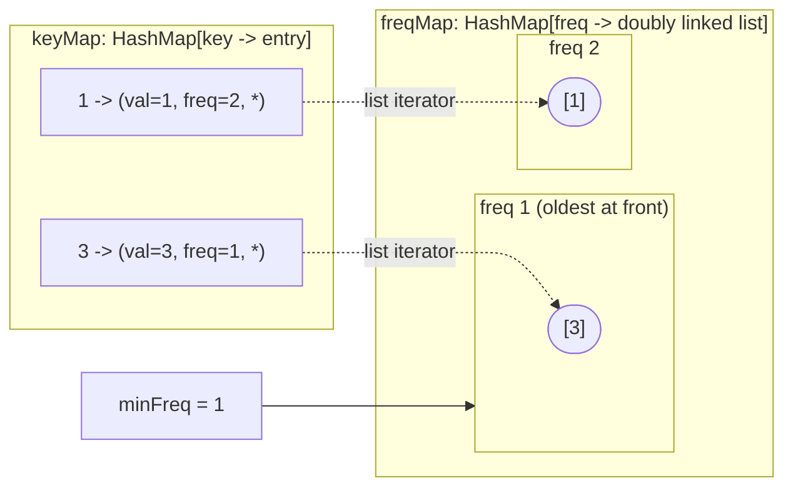
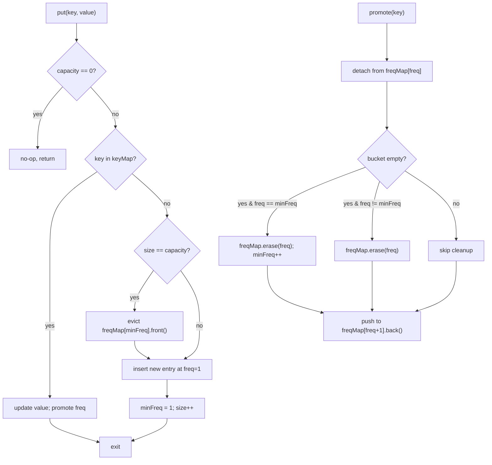

# LFU cache: hash map plus frequency-bucketed doubly linked lists

The naive LFU implementation pays O(n) on every `put` that hits capacity. Scan every entry, find the one with the smallest access count, evict it. At a cache holding 100,000 items that is 100,000 comparisons on every miss, and a real cache misses millions of times an hour. In 2010, Dhruv Matani, Ketan Shah, and Anirban Mitra published a paper showing the same operation can be done in O(1) by adding one more hash map and a stack of doubly linked lists. Their construction is small enough to fit on a whiteboard and tricky enough that LeetCode rates problem 460 as Hard, the only Hard the cache-design family produces. The whole chapter is the construction.

The contract from LC 460 is unforgiving.[^1] Both `get(key)` and `put(key, value)` must run in O(1) average time. A miss returns `-1` and changes nothing. A hit returns the value and increments the key's frequency counter by 1. A `put` on an existing key updates the value and also increments the counter. Read that twice, because the natural reading of "least frequently *used*" suggests "used means read", and the spec defines used as either operation. When `put` overflows the cache, eviction targets the entry with the smallest frequency, breaking ties by removing the *least recently* touched entry within that frequency band. So eviction needs two pieces of information at constant cost: the smallest frequency in use, and the oldest entry inside that frequency's bucket.

> [!IMPORTANT]
> [LRU cache: hash map plus doubly linked list](../part-5-linked-lists/05-lru-cache.md) is a hard prerequisite. The structure here is the LRU dual structure with a frequency axis added on top, and the LRU mechanics (hash map keyed on node pointers, sentinel-bounded doubly linked list, paired insert and delete on both halves) are assumed throughout. Read it first if the splice-on-hit reflex is not already automatic.

## What "least frequently used" actually evicts

LRU evicts by recency. LFU evicts by frequency, with recency as the tie-breaker. The two policies disagree on a workload that LRU silently mishandles: a single big scan of cold keys interleaved with steady traffic to a small hot working set. Picture a database query that sweeps a billion-row table once a day, and a hot key that gets read a million times an hour. LRU loads the scan keys into the cache and pushes the million-times-an-hour key out, because the scan keys are the *most* recently touched. The next hot read is a miss, and the cache thrashes. Cache replacement theory calls this scan-resistance, and a bare LRU does not have it.[^4]

LFU resists scans by anchoring eviction to the access counter. The scan keys arrive with frequency 1; the hot key sits at frequency 1,000,000; the scan keys evict each other and never touch the hot key. Production caches that lean LFU (Memcached's `lfu` mode, Redis's `allkeys-lfu`, the W-TinyLFU policy behind Caffeine) are designed for exactly this regime.[^4]

The LC 460 contract narrows the design space. Three numbers have to be reachable in constant time:

- the value for a key,
- the smallest frequency currently in the cache (so eviction knows which bucket to look in),
- the oldest entry inside that smallest-frequency bucket (so eviction knows which entry to remove).

A single hash map gives the first. A second hash map keyed by frequency gives the third, if its values are doubly linked lists ordered by recency. The second number, the smallest frequency, is the trick. You cannot scan `freqMap.keys()` for the minimum on every eviction; that would put scaling back to O(n). The fix is a single integer named `minFreq` that the algorithm keeps correct through one carefully placed update.

## The three-piece structure

Three fields, and one rule that ties them together.



*Cache state after `put(1,1) put(2,2) get(1) put(3,3)`. Solid edges are owned references; dotted edges are saved iterators that make in-place detach O(1). The `minFreq` field points at the LFU bucket; the next eviction takes the front of that bucket.*

`keyMap` is a hash map from each key to its entry. The entry holds the value, the current frequency, and a pointer back into the doubly linked list that contains it. That back-pointer is the load-bearing detail. Without it, a `get` would have to walk the freq-bucket list to find which node holds the key, costing O(n) per call.

`freqMap` is a hash map from each frequency to a doubly linked list of keys at that frequency. The list is ordered by insertion, so the front is the least recently inserted (the LRU within this frequency band) and the back is the most recently inserted. When LC 460's tie-break asks "evict the oldest entry at frequency 1", that entry is `freqMap[1].front()`. One pointer dereference, no scan.

`minFreq` is a scalar holding the smallest frequency currently used. Eviction looks at `freqMap[minFreq]`, takes the front, and is done. The whole game is keeping `minFreq` correct without scanning the keys of `freqMap`.

## How the operations work

Three operations, all pinned to O(1).

### `get(key)`

The miss case is one hash lookup and an early return of `-1`.

The hit case has three phases: read, promote, finish.

1. Read the entry through `keyMap[key]`. The value will be the return; the frequency tells which bucket the entry currently lives in.
2. Promote the entry by detaching it from `freqMap[freq]` and reattaching at the back of `freqMap[freq + 1]`. The detach is O(1) because the entry stores its own list iterator; no walk required. Update the entry's stored frequency to `freq + 1`.
3. If the bucket the entry just left is now empty, delete it from `freqMap`. If that empty bucket happened to be at `minFreq`, advance `minFreq` by 1.

Step 3's last clause is the algorithm's hardest line. It is also the only place `minFreq` ever increases on a hit. We come back to why in a moment.

### `put(key, value)`

Three branches, in order.

1. **Capacity guard.** If the cache was constructed with `capacity == 0`, return immediately. LC 460 permits this constructor argument and the test suite includes it; without the guard, the next branch dereferences a nonexistent freq bucket.[^2]
2. **Update path.** If the key already exists, write the new value into the entry and run the same promotion logic that `get` uses. The reference implementations do this by calling `get(key)` directly after the value swap, sharing the code path. A `put` that updates is structurally a hit, not a miss.
3. **Insert path.** If the key is new and the cache is full, evict the front of `freqMap[minFreq]` (the LFU among the ties is the one inserted earliest) and delete the corresponding `keyMap` entry. Then create a new entry with `freq = 1`, push it onto `freqMap[1]`, and set `minFreq = 1`. The reset is correct: the new entry has frequency 1, which is by definition the new minimum.

The order matters in the insert path. Eviction runs *before* the new entry is constructed and inserted. Insert-then-evict on a cache of capacity 1 selects the just-inserted entry as the LRU at `minFreq`, evicts it, and leaves the cache empty. The capacity-1 thrash test is exactly why LC includes that case.



*The three control-flow arcs. The branch labelled "yes & freq == minFreq" is the chapter's single most error-prone step; the next section is exactly that.*

### `O(1) per get and put`

Why all of this collapses to constant time per operation is the chapter's hardest insight. Two independent O(1) tricks combine.

**Trick one: the per-frequency doubly linked list.** Each freq bucket is a doubly linked list of keys, ordered by insertion. `push_back` is O(1) (the implementation holds a tail pointer). `pop_front` is O(1) (the head sentinel hands over the LRU within this band immediately). Detaching an arbitrary entry from anywhere in the list is O(1) *given a pointer to the node*, which the entry stores in `keyMap`. CLRS Chapter 10 §10.2 establishes the bound.[^3] So promotion (detach old, push to new bucket) is the sum of three O(1) steps, total O(1).

**Trick two: the `minFreq` invariant.** `minFreq` advances by exactly one inside the promotion path, on the line that fires when the bucket the entry just left becomes empty *and* that bucket was at `minFreq`. That single update is enough. Matani, Shah, and Mitra prove the claim by induction.[^1] A successful access on an entry with frequency `f` either keeps the bucket at `f` non-empty (in which case `minFreq` is still valid) or empties it (in which case the next-smallest frequency in use is `f + 1`, exactly what `minFreq++` records). A miss that triggers an insert resets `minFreq` to 1 unconditionally, because the new entry has frequency 1, which is by definition the new minimum. `minFreq` never needs to *decrease* on a hit; the algorithm never has to scan `freqMap.keys()` for the new minimum.

The result: both `get` and `put` decompose into a fixed number of hash-map operations (each O(1) average under simple uniform hashing, by CLRS Theorem 11.1) plus a fixed number of doubly-linked-list operations (each O(1) worst-case, by CLRS §10.2).[^3] No loop, no scan, no log factor. The construction is the whole reason LC 460 has a clean answer.

## The Python reference

The cleanest implementation pairs Python's `dict` (for `keyMap`) with `collections.OrderedDict` (for each freq bucket). `OrderedDict.popitem(last=False)` pops the oldest insertion in O(1), which is exactly the LRU-within-bucket primitive the LC 460 tie-break asks for.[^5] Plain `dict` preserves insertion order from CPython 3.7 onward, but `popitem(last=False)` is `OrderedDict`-only; do not silently substitute.

```python
from collections import defaultdict, OrderedDict


class LFUCache:
    def __init__(self, capacity: int):
        self.cap = capacity
        self.size = 0
        self.min_freq = 0
        self.kvf = {}                              # key -> [val, freq]
        self.fk = defaultdict(OrderedDict)         # freq -> OrderedDict[key] = None

    def get(self, key: int) -> int:
        if key not in self.kvf:
            return -1
        val, freq = self.kvf[key]
        del self.fk[freq][key]
        if not self.fk[freq]:
            del self.fk[freq]
            if self.min_freq == freq:
                self.min_freq += 1                 # the Matani invariant
        self.fk[freq + 1][key] = None
        self.kvf[key] = [val, freq + 1]
        return val

    def put(self, key: int, value: int) -> None:
        if self.cap <= 0:
            return
        if key in self.kvf:
            self.kvf[key][0] = value
            self.get(key)                          # reuse the promotion path
            return
        if self.size == self.cap:
            evict_key, _ = self.fk[self.min_freq].popitem(last=False)
            if not self.fk[self.min_freq]:
                del self.fk[self.min_freq]
            del self.kvf[evict_key]
            self.size -= 1
        self.kvf[key] = [value, 1]
        self.fk[1][key] = None
        self.min_freq = 1
        self.size += 1
```

**Solution** — Python ([Java](./01-lfu-cache/lc-460/sol.java) · [C++](./01-lfu-cache/lc-460/sol.cpp) · [Go](./01-lfu-cache/lc-460/sol.go))

```python
# LC 460. LFU Cache
from collections import defaultdict, OrderedDict


class LFUCache:
    """LFU cache with O(1) get/put using a freq-bucket of OrderedDicts.
    Tie-break inside a freq bucket = LRU (oldest insertion wins eviction)."""

    def __init__(self, capacity: int):
        self.cap = capacity
        self.size = 0
        self.min_freq = 0
        # key -> [val, freq]; list (mutable) so we can update freq in place.
        self.kvf = {}
        # freq -> OrderedDict[key] = None; insertion order = LRU within bucket.
        self.fk = defaultdict(OrderedDict)

    def get(self, key: int) -> int:
        if key not in self.kvf:
            return -1
        val, freq = self.kvf[key]
        del self.fk[freq][key]
        if not self.fk[freq]:
            del self.fk[freq]
            if self.min_freq == freq:
                self.min_freq += 1
        self.fk[freq + 1][key] = None
        self.kvf[key] = [val, freq + 1]
        return val

    def put(self, key: int, value: int) -> None:
        if self.cap <= 0:
            return
        if key in self.kvf:
            self.kvf[key][0] = value
            self.get(key)  # reuse promotion logic
            return
        if self.size == self.cap:
            evict_key, _ = self.fk[self.min_freq].popitem(last=False)
            if not self.fk[self.min_freq]:
                del self.fk[self.min_freq]
            del self.kvf[evict_key]
            self.size -= 1
        self.kvf[key] = [value, 1]
        self.fk[1][key] = None
        self.min_freq = 1
        self.size += 1
```

Each language reaches for its own LRU-within-bucket primitive. Java uses `LinkedHashSet<Integer>`: O(1) add, O(1) remove-by-element, and `iterator().next()` returns the oldest insertion in O(1).[^6] C++ pairs `std::list<int>` (whose iterators stay valid across insertion and other-element erasure, which is what makes the saved-iterator pattern safe) with `std::unordered_map` keyed on the entry tuple. Go uses `container/list`, storing `*list.Element` on the entry struct so detach is O(1) from anywhere. Same algorithm, four idioms.

Two language-specific traps worth flagging here. In C++, an `auto& [val, freq, listIt] = it->second;` followed by an `unordered_map` operation that may rehash invalidates the binding; the implementation copies values out before re-inserting through `std::make_tuple`. In Java, `kvf.get(key)[0] = value` mutates the `int[]` held by the map; the rebind through `kvf.put` is unnecessary because the array is shared by reference. The references chain explicit, the bug surface shrinks.

## Walking the canonical sequence

Take capacity 2 and the official LC 460 sequence: `put(1,1) put(2,2) get(1) put(3,3) get(2) get(3) put(4,4) get(1) get(3) get(4)`. Expected returns: `[null, null, null, 1, null, 3, null, -1, 3, 4]`.[^2]

The build is uneventful. After `put(1,1) put(2,2)`, `freqMap[1]` holds `[1, 2]` with key 1 at the front, `minFreq` is 1, and both keys sit at frequency 1.

The first interesting moment is `get(1)`. Key 1 detaches from `freqMap[1]`, the bucket is not empty (key 2 still lives there), so `minFreq` stays at 1. Key 1 lands in `freqMap[2]` with frequency 2. `freqMap[1]` now holds `[2]`, `freqMap[2]` holds `[1]`.

The next `put(3,3)` finds the cache full. Eviction targets `freqMap[minFreq=1].front()`, which is key 2 (the only remaining freq-1 entry, also the LRU in its band). Key 2 is removed from both maps. Key 3 inserts at frequency 1, `minFreq` resets to 1.

The clean expression of the Matani invariant is `get(3)`. Key 3 detaches from `freqMap[1]`. The bucket is now empty. `freqMap[1]` is deleted. The bucket that just emptied was at `minFreq`, so `minFreq` advances to 2. State after this op: `freqMap[2]` holds `[1, 3]`, `minFreq = 2`. The next eviction would correctly look for freq 2, not the now-deleted freq 1. That single line of code did the work the naive implementation would have spent O(n) scanning to do.

`put(4,4)` evicts the front of `freqMap[2]`, which is key 1, and inserts key 4 at frequency 1. `minFreq` resets to 1 again. The trace finishes mechanically: misses on the evicted keys, hits on the live keys, each hit promoting through the same path.

| Op | Returns | `keyMap` summary | `freqMap` | `minFreq` |
|---|---|---|---|---|
| `put(1,1)` | — | `{1:(1,1)}` | `{1:[1]}` | 1 |
| `put(2,2)` | — | `{1:(1,1), 2:(2,1)}` | `{1:[1,2]}` | 1 |
| `get(1)` | 1 | `{1:(1,2), 2:(2,1)}` | `{1:[2], 2:[1]}` | 1 |
| `put(3,3)` | — | `{1:(1,2), 3:(3,1)}` | `{1:[3], 2:[1]}` | 1 |
| `get(2)` | -1 | unchanged | unchanged | 1 |
| `get(3)` | 3 | `{1:(1,2), 3:(3,2)}` | `{2:[1,3]}` | **2** |
| `put(4,4)` | — | `{3:(3,2), 4:(4,1)}` | `{1:[4], 2:[3]}` | 1 |
| `get(1)` | -1 | unchanged | unchanged | 1 |
| `get(3)` | 3 | `{3:(3,3), 4:(4,1)}` | `{1:[4], 3:[3]}` | 1 |
| `get(4)` | 4 | `{3:(3,3), 4:(4,2)}` | `{2:[4], 3:[3]}` | **2** |

*Bold `minFreq` values fire the invariant: the bucket at the old `minFreq` emptied, so the field advances by one.*

## What it actually costs

| Operation | Time | Space | Source |
|---|---|---|---|
| `get(key)` (hit) | O(1) average | O(1) per op | CLRS §10.2 (DLL O(1) detach with saved pointer) + §11.2 Theorem 11.1 (chained-hash O(1) average)[^3] |
| `get(key)` (miss) | O(1) average | O(1) per op | One hash lookup, no list work |
| `put(key, value)` (insert, no evict) | O(1) average | O(1) per op | One hash insert + one DLL push |
| `put(key, value)` (insert, with evict) | O(1) average | O(1) per op | One DLL pop_front + two hash deletes + one hash insert + one DLL push |
| `put(key, value)` (update existing) | O(1) average | O(1) per op | Same shape as `get` |
| Total cache space for n items | — | O(n) | One `keyMap` entry + one list node per item; bucket count ≤ n[^1] |

The hash-map operations are O(1) **expected** under simple uniform hashing per CLRS Theorem 11.1.[^3] The doubly-linked-list operations are O(1) **worst-case** per CLRS §10.2. The Matani contribution is the data layout that pins the *eviction* step to O(1): without the freq-bucket structure, finding the LFU key requires scanning either the entire `keyMap` (O(n)) or a sorted heap (O(log n)).[^1] That is the brute-force baseline NeetCode's editorial walks first, before introducing the freq-bucket layout.[^7]

> [!NOTE]
> **Single-Hard ladder.** LFU is structurally Hard-only on LeetCode. The closest Medium analogues either reduce to LRU (LC 146, locked at chapter 5.5) or are Premium-only without a free same-pattern equivalent (LC 1756). The Easy analogues (LC 705, LC 706) drop the frequency axis entirely and become pure hash-map design. This chapter ships LC 460 as the sole CORE problem and carries the `single-difficulty-band` curation flag; STRETCH adds two free design problems for breadth, not for difficulty span.

## Five places this breaks in interviews

> [!WARNING]
> **Forgetting that `put` on an existing key bumps frequency.** The natural reading of "least frequently *used*" suggests "used means read". LC 460's spec defines used as either operation, including updates that don't change the value.[^2] The fix is the one line at the top of the insert branch that reroutes existing-key puts through the same promotion path as `get`. Skip it and keys that are repeatedly written but never read accumulate an artificially low frequency and evict before keys read once.[^7]

> [!WARNING]
> **Not advancing `minFreq` when its bucket empties.** The Matani invariant fires inside the promotion path: when the bucket the entry just left becomes empty *and* that bucket was at `minFreq`, advance `minFreq` by one. labuladong calls this "the most error-prone step in the LFU algorithm".[^8] Skip it and the next eviction reads `freqMap[stale_minFreq]`, which is either an empty list (KeyError, NPE, segfault) or, worse with `defaultdict`-style auto-vivification, a freshly recreated empty list that masks the bug as silent corruption.

> [!WARNING]
> **Using a regular set or unordered map per freq bucket.** Ties within the same frequency must be broken by recency, which means insertion order. A plain `HashSet` in Java or `unordered_set` in C++ has no order; eviction picks an arbitrary entry, violating LC 460's tie-break rule. The fix is `OrderedDict` (Python), `LinkedHashSet` (Java), `std::list` with the iterator stored on the entry (C++), or `container/list` with `*list.Element` on the entry (Go).[^7]

> [!WARNING]
> **Skipping the `capacity == 0` guard.** LC 460's constructor permits a capacity of zero. Without the early return at the top of `put`, the first call enters the eviction branch on an empty cache, dereferences `freqMap[minFreq=0]`, and crashes (segfault in C++, KeyError in Python, NPE in Java).[^7]

> [!WARNING]
> **Failing to remove the entry from its old freq bucket on promotion.** When the algorithm is translated to a non-list bucket structure (a counter map, an array indexed by frequency), the writer remembers to bump the frequency value and add the entry to the new bucket but forgets the explicit remove from the old one. The same key now appears in two buckets; the next eviction may target the stale entry; the cache silently corrupts. The reference implementations always erase from the old bucket before any other structural change.[^7]

## Variants worth knowing about

The textbook construction above is the LC 460 answer. Production caches add three refinements that are out of scope to implement but worth recognizing.

**LFUDA (LFU with Dynamic Aging)** carries a single integer `cacheAge` that bumps to the evicted entry's frequency on every eviction; new inserts get `freq = 1 + cacheAge`. The effect is a slowly rising frequency floor that lets entries from yesterday's working set fall behind today's, even if their absolute counters are still high. Squid's HTTP cache and Memcached's LFU mode use LFUDA.[^4]

**TinyLFU and W-TinyLFU** drop the per-key frequency counter entirely. A small Count-Min Sketch tracks frequency estimates with constant memory per entry; an LRU window admits new entries; the sketch decides whether the candidate beats the incumbent on each admission. Caffeine, the JVM cache library, ships W-TinyLFU as its default. Empirical hit rates beat both LRU and LFU on Zipf-distributed workloads.[^4]

**Frequency capping** bounds the per-key counter so it cannot overflow over months of uptime. Redis caps its `LFU` mode at 8 bits with logarithmic increments; the layout is unchanged.[^4]

LC 460 does not ask for any of these. Mention them only if the interviewer pushes on production realism.

## Problem ladder

### CORE (solve to claim chapter mastery)

- [LC 460 — LFU Cache](https://leetcode.com/problems/lfu-cache/) [Hard] • hash-map-plus-frequency-bucketed-dll ★

### STRETCH (optional)

- [LC 1472 — Design Browser History](https://leetcode.com/problems/design-browser-history/) [Medium] • doubly-linked-list-with-cursor
- [LC 2227 — Encrypt and Decrypt Strings](https://leetcode.com/problems/encrypt-and-decrypt-strings/) [Hard] • hash-table-bidirectional-with-precompute *(reference: Python only)*

LC 1472 isolates the doubly-linked-list-with-cursor half of the dual-structure pattern from the hash-map half: same composition discipline, different secondary axis. LC 2227 tests the same "amortize the work into the constructor" mental shape that LFU uses to amortize frequency tracking into every operation.

[LC 432 (All O\`one Data Structure)](https://leetcode.com/problems/all-oone-data-structure/) is the structurally closest sibling, same hash-map plus frequency-bucketed-doubly-linked-list shape, but registry-locked to [Hash collisions and the load factor](../part-1-linear-data-structures/04-hash-collisions.md). Solve it there for a second pass at the freq-bucket mechanic.

## Where this leads

The dual-structure pattern (one hash map for key access, one auxiliary structure for the order statistic) outlives LFU. [Min stack and max-frequency stack](./02-min-stack-maxfreq.md) reuses the same shape for "track the running min over a primary stack". [Hit counter and rate limiter](./03-hit-counter-rate-limiter.md) applies it to time-windowed eviction. The pattern is "augment a primary structure with an auxiliary structure that maintains the order statistic the primary structure cannot answer in O(1)". Once that frame clicks, every cache-design question on the FAANG loop starts to look like a variation on the same theme.

For readers who want the production-grade modern variant of this chapter, Caffeine's wiki on the W-TinyLFU policy is the next read.[^4] For the original O(1) construction in its own voice, the eight-page Matani paper is short and worth the time.[^1]

## References

[^1]: Matani, Dhruv; Shah, Ketan; Mitra, Anirban. Establishes the hash-map plus frequency-bucketed-doubly-linked-list layout and the `minFreq` invariant that makes both `get` and `put` O(1) average. <https://arxiv.org/abs/2110.11602>.

[^2]: LeetCode, "460. LFU Cache" problem. <https://leetcode.com/problems/lfu-cache/>

[^3]: Cormen, Leiserson, Rivest, Stein, *Introduction to Algorithms*, 4th ed., MIT Press, 2022.

[^4]: Manes, Ben (creator of Caffeine). "Efficiency · ben-manes/caffeine Wiki." <https://github.com/ben-manes/caffeine/wiki/Efficiency>.

[^5]: Python Software Foundation, `collections.OrderedDict`. `popitem(last=False)` pops the oldest insertion in O(1); the canonical LRU-within-bucket primitive in CPython. Plain `dict` preserves insertion order from CPython 3.7 onward but does not expose `popitem(last=False)`. <https://docs.python.org/3/library/collections.html#collections.OrderedDict>.

[^6]: Oracle, Java SE 21 documentation, `LinkedHashSet`. The Java analogue of Python's `OrderedDict` for the freq-bucket role. <https://docs.oracle.com/en/java/javase/21/docs/api/java.base/java/util/LinkedHashSet.html>.

[^7]: NeetCode, "460. LFU Cache — Explanation." Walks the brute-force O(n)-per-`put` baseline and the doubly-linked-list O(1) construction; lists the five canonical bugs that the warning callouts above mirror. <https://neetcode.io/solutions/lfu-cache>.

[^8]: labuladong, "Implementing LFU Cache like Building a Lego." Top-down build of the LFU layout in seven sub-steps; calls out the `minFreq` update as the single most error-prone step in the algorithm. <https://labuladong.online/algo/en/frequency-interview/lfu/>.
