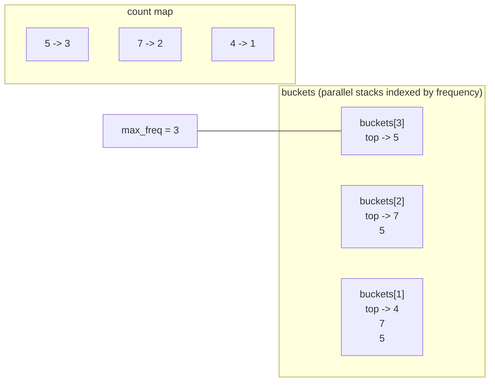
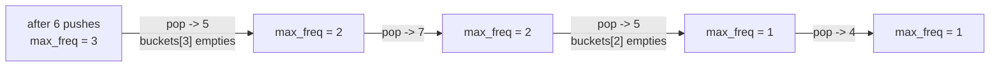
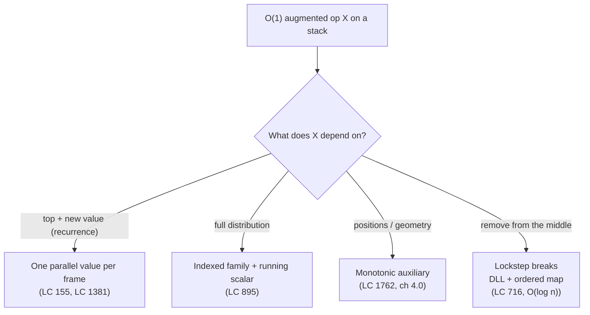

# Min stack and max-frequency stack

Part 4 chapter [Min and max stacks](../part-4-stack-queue-patterns/02-min-max-stack.md) taught the algorithm: pin a parallel auxiliary to the values stack and `getMin` reduces to a peek. The shape of the auxiliary tracked the aggregate. One parallel int stack for the running min. Two hash maps plus a counter for the most-frequent element. Three problems, one technique.

Now look at the same surface from a different angle. Part 13 is about *designing* data structures, and the design decision a real interviewer makes when asked for an O(1)-augmented stack is not "what algorithm". It is "what auxiliary, sized and shaped against this contract." The algorithm chapter taught the answer; the question is what gets you there from a cold start. Two pieces of state map to two contract clauses, and the discipline of mapping them is what generalises beyond the specific problems.

## What "design a stack" actually means

The interviewer hands you a contract. Four operations, all O(1), and one of them is something a vanilla stack cannot do.

| LC 155 contract | LC 895 contract |
|---|---|
| `push(val)` — O(1) | `push(val)` — O(1) |
| `pop()` — O(1) | `pop()` returns *and removes* the most-frequent element, ties broken by recency — O(1) |
| `top()` — O(1) | (no `top`) |
| `getMin()` returns the smallest currently on the stack — O(1) | |

The question is not "implement a stack." A stack is one line of code in any of the four reference languages. The question is "what extra state do I carry on push and pop so that the augmented operation does not have to scan?"

That framing has two halves. The augmented operation tells you what aggregate you owe. The vanilla operations tell you when the aggregate has to be updated, and how cheaply. A design that nails the first and not the second produces O(1) reads and O(n) writes, which fails the contract just as hard.

## Two operations, two pieces of state

The technique: every push records something on an auxiliary; every pop unwinds it; the augmented operation reads the auxiliary's current state. The auxiliary has to satisfy three properties.

> [!IMPORTANT]
> **The pinning invariant.** After every operation, the auxiliary's exposed value equals the aggregate over the current contents of the values stack. The push step preserves it by recording the new state. The pop step preserves it by unrecording exactly the state the matching push added. Designs that fail break one of these two halves.

Pinning is the part beginners skip. They write a push that records the right thing, then write a pop that does not unrecord it, and the auxiliary drifts. Or they write the pop in lockstep, then the push misses a state transition (a duplicate minimum, a frequency tier crossed) and the auxiliary undercounts. The pop is in lockstep with the push, or the design is wrong.

The shape of the auxiliary scales with the aggregate. A running minimum is one integer per stack frame; a parallel int stack of the same height holds it. A running most-frequent-element is not one integer at all. It is a function of the current frequency distribution, and capturing it needs richer state.

## LC 155: one parallel int stack

The aggregate is a number. The auxiliary is a stack of numbers. On `push(val)`, the new running minimum is `min(prev_min, val)`, a one-line recurrence. The auxiliary records that. On `pop()`, the values stack shrinks by one and the auxiliary shrinks by one. `getMin()` is the auxiliary's top.

```python
class MinStack:
    def __init__(self):
        self.values = []
        self.mins = []

    def push(self, val):
        self.values.append(val)
        new_min = val if not self.mins else min(self.mins[-1], val)
        self.mins.append(new_min)

    def pop(self):
        self.values.pop()
        self.mins.pop()

    def top(self):
        return self.values[-1]

    def get_min(self):
        return self.mins[-1]
```

The full four-language reference for LC 155 lives in [Min and max stacks](../part-4-stack-queue-patterns/02-min-max-stack.md), where the chapter walks the recurrence, the conditional-push variant, the duplicate-minima trap, and the single-stack-with-diffs overflow bug. The Part 4 chapter is the right place to read it once carefully.

The design move worth keeping in mind here is this: the auxiliary is the same height as the values stack, every entry holds a constant number of bits, and the state transition on push depends only on the current top and the new value. Three properties, all of them load-bearing. Drop the third (state depends on more than top + new) and a parallel int stack stops being enough.

## LC 895: two hash maps and a running max

LC 895 drops the third property. The aggregate "most-frequent element" depends on the entire current frequency distribution, not just the most recent push. A parallel int stack cannot hold that.

The contract:

> Design a stack-like structure with `push(val)` and `pop()`, where `pop()` returns the value with the highest current frequency. If multiple values tie at that frequency, return the most recently pushed.

The naive design tries a heap keyed on frequency. Push increments a count, pushes a `(freq, timestamp, val)` triple onto the heap, and pop reads the heap top. That works, but the frequency a heap entry carries is *stale* the moment another push of the same value increments its true count. Either the heap reads a stale entry and re-checks against the true count (O(log n) push, O(log n) pop with retries), or you eagerly invalidate, which costs more than it saves. The heap delivers `O(log n)` per op, which fails the chapter's contract.

The design that works pivots on a second piece of state.

> [!IMPORTANT]
> **The frequency-bucket invariant.** For every frequency level `f` from 1 up to the current maximum, `buckets[f]` is a stack holding, in original push order, every value that has ever reached count `f`. After a `push(v)` raises `v`'s count to `f`, the push appends `v` to `buckets[f]` only. Earlier pushes already placed `v` into `buckets[1]` through `buckets[f-1]`. The invariant is cumulative across pushes; each push touches exactly one bucket.

That single insight is the chapter's payload. Two pieces of state: `count[v]` is `v`'s current frequency, and `buckets[f]` is the stack of values that have ever reached frequency `f`. A scalar `max_freq` tracks the largest non-empty bucket. Pop reads `buckets[max_freq]`, which delivers the most-frequent value and (because the bucket is itself a stack) the most-recent insertion at that frequency. Both contract clauses, in one pop.

```python
def push(self, val):
    self.count[val] += 1
    f = self.count[val]
    self.buckets[f].append(val)
    if f > self.max_freq:
        self.max_freq = f

def pop(self):
    val = self.buckets[self.max_freq].pop()
    self.count[val] -= 1
    if not self.buckets[self.max_freq]:
        self.max_freq -= 1
    return val
```

**Solution** — Python ([Java](./02-min-stack-maxfreq/lc-895/sol.java) · [C++](./02-min-stack-maxfreq/lc-895/sol.cpp) · [Go](./02-min-stack-maxfreq/lc-895/sol.go))

```python
# LC 895. Maximum Frequency Stack
# A pop returns the most-frequent element pushed so far, breaking ties by
# recency. Carry two parallel structures: count[v] tracks v's current count;
# buckets[f] is a stack of every value that has ever reached count f. A
# push of v at new count f appends v to buckets[f] alone — earlier pushes
# placed v into buckets[1..f-1]. A pop reads buckets[max_freq], which
# returns the most-frequent value and (by stack LIFO inside the bucket)
# the most-recent among ties. O(1) per push, O(1) per pop.
from collections import defaultdict


class FreqStack:
    def __init__(self) -> None:
        self.count: dict[int, int] = defaultdict(int)
        self.buckets: dict[int, list[int]] = defaultdict(list)
        self.max_freq: int = 0

    def push(self, val: int) -> None:
        self.count[val] += 1
        f = self.count[val]
        self.buckets[f].append(val)
        if f > self.max_freq:
            self.max_freq = f

    def pop(self) -> int:
        val = self.buckets[self.max_freq].pop()
        self.count[val] -= 1
        if not self.buckets[self.max_freq]:
            self.max_freq -= 1
        return val
```

The non-obvious step is the `max_freq -= 1` after a bucket empties. Why does a single decrement suffice? Why doesn't the next pop have to scan for the next non-empty bucket? Because every value still in the structure with current count `c` was placed by a push that touched `buckets[1]` through `buckets[c]`. The moment `buckets[max_freq]` empties, every other surviving value has count strictly less than `max_freq`, and at least one of them sits at count `max_freq - 1`. The next non-empty bucket is exactly one level down.[^1]



*State after pushing `[5, 7, 5, 7, 4, 5]`. Three parallel stacks, one per frequency level reached so far; the next pop reads buckets[max_freq] and returns 5.*

The pop sequence on this state is `5, 7, 5, 4`. The first pop drains `buckets[3]`, decrements `max_freq` to 2, and returns 5. The second pop reads `buckets[2]` and returns 7; the recency tie-break falls out of the bucket's own LIFO order, because 7 was pushed into `buckets[2]` after 5. No extra timestamp, no auxiliary sort. The bucket's stack discipline does the work.



*max_freq decreases by exactly one whenever a pop empties the current bucket; never by more, never by less.*

Two hash-map operations and one scalar update per push, the same per pop. Every operation is O(1) under the standard amortised hash-map assumptions ([Hash maps and hash sets](../part-1-linear-data-structures/03-hash-maps.md) covers the assumption set).[^2] The heap baseline ran O(log n); this design lands O(1) by trading a single comparison-based tree for two flat hash structures and a careful invariant.

## Picking the auxiliary's shape

The two designs sit on a shared spine. Both pin an auxiliary to the values stack; both maintain the auxiliary in lockstep with push and pop; both reduce the augmented operation to a peek. The difference is that LC 155's aggregate has a one-line recurrence and fits in a parallel int stack, while LC 895's aggregate is a function of the whole distribution and needs a structured family of stacks indexed by a derived quantity (the count).

The discriminator is the same one that scales the technique to harder problems: **what does the aggregate depend on?**

| Aggregate depends on... | Auxiliary shape | Examples |
|---|---|---|
| Only top + new value (one-line recurrence) | One parallel value per stack frame | LC 155 running min; LC 716 running max (modulo `popMax`); LC 1381 lazy-increment |
| The full distribution (count, frequency, ranking) | Indexed family of structures + a running summary scalar | LC 895 frequency stack; sliding-window most-common with a counter map |
| The full geometry (a position requires neighbours) | Auxiliary that records *positions*, not values | Monotonic stacks (LC 1762, LC 901, LC 84) |

The first row is the chapter 4.2 territory: one auxiliary number per stack frame, and the recurrence does the work. The second row is this chapter's payload: when the recurrence breaks because the aggregate is not local, the auxiliary becomes a *parameterised* structure, keyed by the derived quantity that the aggregate ranks over. The third row is the monotonic-stack family from [Monotonic stack and deque](../part-4-stack-queue-patterns/00-monotonic-stack.md), where the auxiliary itself becomes the data structure (no separate values stack), because positions dominated by a later push will never be answered against again and can be popped.

The point of the lens is not the rows. It is that "design a stack with O(1) augmented operation X" is one question with three plausible answers depending on what X reads, and the design choice is where the interview is actually tested. The algorithms in chapter 4.2 are the implementation; the dispatch above is the design.



*The decision is local to the augmented operation. Pick the auxiliary against the aggregate's dependency, not against the algorithm's name.*

## Where the technique stops working

`popMax` on LC 716 is the boundary. The contract asks for "remove the maximum, regardless of position." The lockstep auxiliary tracks the max correctly, but the values stack still has to splice out the maximum from somewhere in the middle, and an array-backed stack does not splice in O(1). The auxiliary cannot fix that, because the auxiliary's job is to *know* the answer, not to *change* the values stack's representation.

The fix is a different data structure entirely. Drop the values-stack-plus-auxiliary frame; pick a doubly linked list (O(1) push and pop at the tail, O(1) splice given a node) plus an ordered multimap from value to the list nodes carrying it. Push appends to the list and inserts a node into the multimap; `popMax` reads the multimap's last key, removes the most recent matching node from the list and the multimap. All five operations land at O(log n), the cost of the ordered multimap.[^3] The technique generalises only as far as the values stack stays append-only on the relevant end.

Watch for the signal at design time. *Reads* the augmented value or *removes the top* under it: lockstep auxiliary works. *Removes a non-top element* under it: the lockstep breaks and the design moves to a different data structure. The chapter 4.2 treatment of LC 716 walks the alternative in full.

## Two pitfalls that bite

> [!WARNING]
> **Pushing `val` into every bucket from 1 to `count[val]` on every push.** A common over-correction once the invariant clicks: the reader sees "buckets[f] holds every value that has reached count `f`" and concludes the push must populate all of them. Each push appends to one bucket only. The earlier pushes of the same value already populated the lower buckets; the cumulative invariant is maintained incrementally. The over-correction blows the push to O(count) and times out at LC 895's largest test case.[^4]

> [!WARNING]
> **Forgetting the `max_freq -= 1` after the bucket empties.** The next pop reads from `buckets[max_freq]` directly. If the previous pop drained that bucket and `max_freq` was not decremented, the read crashes (Python `IndexError`, Java `NoSuchElementException`, C++ undefined behaviour). The proof above shows a single decrement suffices; a stale `max_freq` is the issue, not a deep cascade.

## Problem ladder

### CORE (solve to claim chapter mastery)

- [LC 1762 — Buildings With an Ocean View](https://leetcode.com/problems/buildings-with-an-ocean-view/) [Medium] • design-monotonic-stack-as-aggregate ★

### STRETCH (optional, primary treatment lives in chapter 4.2)

- [LC 155 — Min Stack](https://leetcode.com/problems/min-stack/) [Medium] • design-stack-with-aux-min-stack *(primary: [Min and max stacks](../part-4-stack-queue-patterns/02-min-max-stack.md))*
- [LC 895 — Maximum Frequency Stack](https://leetcode.com/problems/maximum-frequency-stack/) [Hard] • design-stack-with-frequency-buckets *(primary: [Min and max stacks](../part-4-stack-queue-patterns/02-min-max-stack.md); four-language reference here)*

The pattern admits no canonical Easy that this chapter owns natively. LC 155 (Medium per LC) and LC 895 (Hard) cover the design-spectrum span at the cost of a difficulty cluster on the chapter's PRIMARY claim; the registry flag is `no-easy-canonical`, the same flag chapter 4.2 carries for the algorithmic family.

## Where this leads

The next design chapter, [Hit counter and rate limiter](./03-hit-counter-rate-limiter.md), takes the same lens to a stream-over-time contract: when the augmented operation is "give me the count over a sliding window", the auxiliary becomes a deque keyed by timestamp. Different aggregate, same discipline. For the algorithmic groundwork on the augmented-stack family, [Min and max stacks](../part-4-stack-queue-patterns/02-min-max-stack.md) is the algorithm chapter; [Monotonic stack and deque](../part-4-stack-queue-patterns/00-monotonic-stack.md) is the third row of the dispatch table above.

## References

[^1]: doocs/leetcode community solution and approach narrative for LC 895, README_EN.md at <https://github.com/doocs/leetcode/blob/main/solution/0800-0899/0895.Maximum%20Frequency%20Stack/README_EN.md>.

[^2]: Cormen, Leiserson, Rivest, Stein, *Introduction to Algorithms*, 4th ed., MIT Press, 2022.

[^3]: leetcode.ca community mirror of LC 716 *Max Stack* solution discussion, <https://leetcode.ca/2017-11-15-716-Max-Stack>.

[^4]: StackOverflow thread "LeetCode Problem 895 (Python), can't finish last test", <https://stackoverflow.com/questions/71543237/leetcode-problem-895-python-cant-finish-last-test>.
