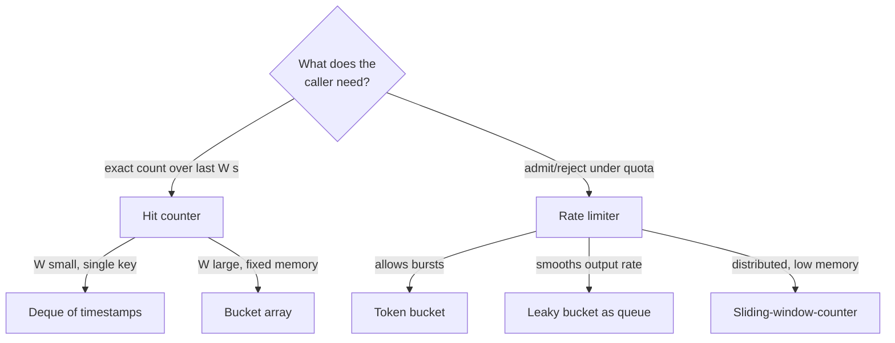
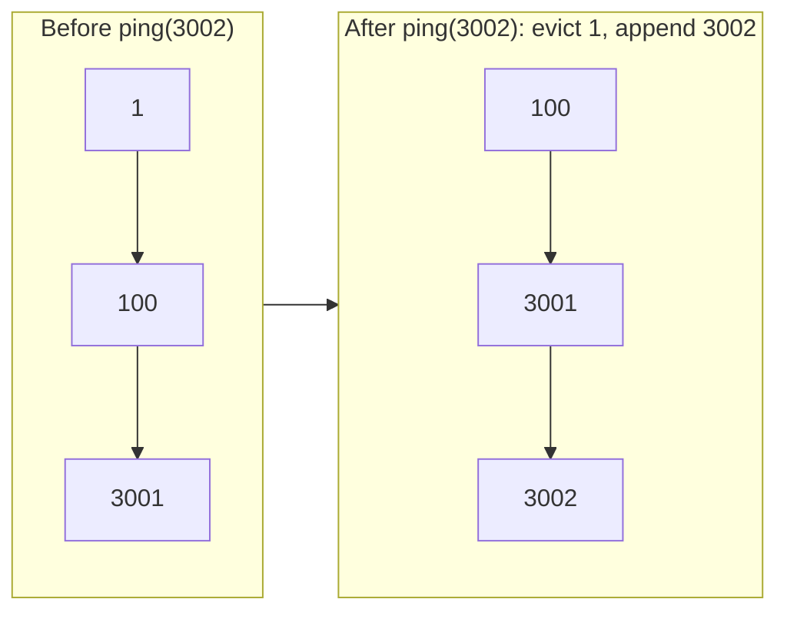
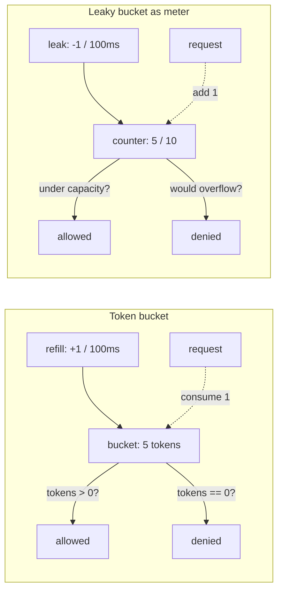
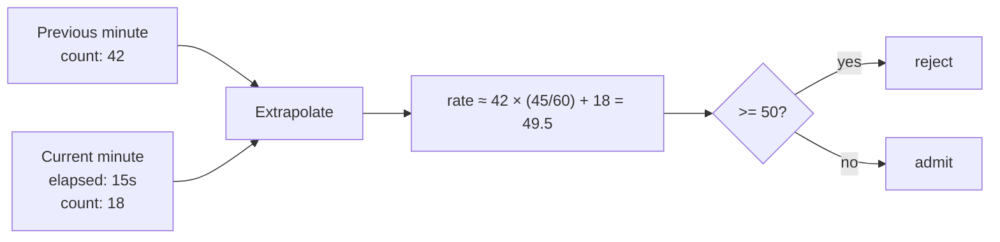

# Hit counter and rate limiter

Cloudflare's edge runs a rate limiter that drops the wrong request 0.003% of the time. They measured that number on 400 million production requests, and they earned it by abandoning the textbook fixed-window counter for a two-bucket approximation that costs sixteen bytes per key. Stripe's API runs a token bucket against Redis to soak up bursts. AWS API Gateway runs a token bucket per key to do the same job at a different scale. Three production systems, three subtly different algorithms, and one shared interview question: design a class that, given a stream of timestamped events, answers a question about the last `W` seconds.

The interview-grade canonical is LeetCode 362 *Design Hit Counter*. You implement `hit(t)` and `getHits(t)` for a sliding 5-minute window. The reflex answer (a list of timestamps that you scan on every `getHits`) is `O(n)` per call. The graceful answer (300 one-second buckets, indexed by `t % 300`) is `O(1)` for `hit` and `O(W)` for `getHits`, with constant memory regardless of how hard the burst hits. That graceful answer is also where production rate limiters start; once you've seen the bucket trick once, the leap to Cloudflare's two-bucket extrapolation and Stripe's Redis-backed token bucket is short.

This chapter teaches both halves. First the deque-of-timestamps that LC 933 *Number of Recent Calls* tests for free. Next the bucket-array that LC 362 tests for Premium credits. Last, the four production rate-limiter algorithms that interviewers ask about when they want to know whether you've read past the LeetCode editorial: token bucket, leaky bucket, fixed window, sliding-window-counter.

## What we're designing

Two abstract data types share the same scaffolding. A **hit counter** records timestamped events and answers *"how many landed in the last `W` seconds?"* on demand. A **rate limiter** records the same events and answers *"may this one in?"* under a quota. The hit counter reports state; the rate limiter enforces it. Both eat a stream where timestamps are non-decreasing, so `t` only ever moves forward, and both maintain enough state to forget anything older than `W`.

The data-structure question is which scaffolding to use under which load. The trade is exact-count fidelity against memory and per-call cost:

| Variant | `add` cost | `query` cost | Space per key | When to reach for it |
|---|---|---|---|---|
| Deque of timestamps | O(1) amortized | O(1) amortized | O(W) entries | Small `W`, single key, exact count required (LC 933 baseline)[^1] |
| Bucket array, 1-sec granularity | O(1) | O(W / granularity) | O(W / granularity) | Large `W`, single key, fixed memory mandatory (LC 362)[^2] |
| Token bucket | O(1) | O(1) | 16 bytes per key | Per-key rate limiting that allows bursts (Stripe, AWS API Gateway)[^3][^4] |
| Sliding-log (full timestamp list) | O(log n) | O(n) | O(n) per key | Never in production; the strawman the next two improve on[^2] |
| Sliding-window-counter | O(1) | O(1) | 16 bytes per key | Distributed rate limiting where exact sliding-log is too expensive (Cloudflare)[^2] |

The middle three rows are the lesson. The deque is the warm-up; the sliding-log is the cautionary tale; everything in between is what production picks.



*Five algorithms, two questions. The path from the question to the algorithm is what an interviewer wants to hear.*

## The deque-of-timestamps baseline

LC 933 *Number of Recent Calls* is the cleanest possible hit counter. `ping(t)` records `t` (strictly increasing per the contract) and returns the count of pings in the inclusive window `[t - 3000, t]`. The data structure is a FIFO queue of timestamps. On every `ping`, append at the tail, then evict from the head while the front is outside the window:

```python
from collections import deque

class RecentCounter:
    def __init__(self):
        self.q = deque()

    def ping(self, t):
        self.q.append(t)
        # Strict `<`: q[0] == t - 3000 is INSIDE the window.
        while self.q and self.q[0] < t - 3000:
            self.q.popleft()
        return len(self.q)
```

**Solution** — Python ([Java](./03-hit-counter-rate-limiter/lc-933/sol.java) · [C++](./03-hit-counter-rate-limiter/lc-933/sol.cpp) · [Go](./03-hit-counter-rate-limiter/lc-933/sol.go))

```python
# LC 933. Number of Recent Calls
from collections import deque


class RecentCounter:
    """LC 933 — sliding-window-on-stream, deque of timestamps.

    ping(t) records timestamp t (strictly increasing) and returns the
    count of pings inside the inclusive window [t - 3000, t]. Every
    timestamp is enqueued once and dequeued at most once across all
    calls, so the amortized cost per ping is O(1).
    """

    def __init__(self) -> None:
        self.q: deque[int] = deque()

    def ping(self, t: int) -> int:
        self.q.append(t)
        # Strict `<`: q[0] == t - 3000 is INSIDE the inclusive window.
        while self.q and self.q[0] < t - 3000:
            self.q.popleft()
        return len(self.q)
```

The eviction predicate is the load-bearing detail. LC 933's contract is the inclusive `[t - 3000, t]` range, so the timestamp `t - 3000` is *inside* the window; eviction must use `<`, not `<=`. Test case: after `ping(1)`, calling `ping(3001)` should return `2`. Use `<=` and you get `1`. The same off-by-one bites every team that re-derives the eviction predicate from a paragraph instead of a worked input.

Trace LC 933 on the canonical input `1, 100, 3001, 3002`:

| Call | Window `[t-3000, t]` | Deque after eviction | Return |
|---|---|---|---|
| `ping(1)` | `[-2999, 1]` | `[1]` | `1` |
| `ping(100)` | `[-2900, 100]` | `[1, 100]` | `2` |
| `ping(3001)` | `[1, 3001]` | `[1, 100, 3001]` | `3` |
| `ping(3002)` | `[2, 3002]` | `[100, 3001, 3002]` | `3` |

At step 4, `1` is evicted because `1 < 3002 - 3000 = 2`. The deque keeps `100` because `100 >= 2`.

The amortized cost is the standard CLRS argument from §17.1.[^5] Every timestamp is appended exactly once and popped at most once across any sequence of `n` calls; total work is bounded by `2n`; per-call amortized cost is `O(1)`. The worst case for a single `ping` is `O(W)` when one call evicts every entry stored, but Cloudflare measured on 400M requests that the worst case rarely fires in practice.[^2]

The deque is the right answer when `W` is small and you have one counter. It's the wrong answer the moment either condition slips.

## What breaks at the bucket-array threshold

LC 362 changes one parameter: `W = 300 seconds` instead of three. That sounds harmless. It isn't. A burst of one hit per millisecond inside a 300-second window stores 300,000 timestamps in the deque, and the second the caller wants per-key rate limiting at scale, you multiply that by the number of keys. The deque scales with burst size, and burst size is the thing you have no control over.

The reframe is to stop storing every timestamp and start storing every *second*. The window is 300 seconds. Pre-allocate 300 slots. Each slot owns one second's worth of hits, identified by a `(bucket_timestamp, count)` pair. On `hit(t)`, look at slot `t % 300`. If its stamp matches `t`, increment the count. If its stamp is older, meaning the slot dates from a previous trip around the ring, overwrite it with `(t, 1)`. On `getHits(t)`, walk all 300 slots and sum the counts whose stamps are inside the window.

### Bucketing for O(1) hit and getHits

This is the design move the chapter exists to teach. The 300-slot ring is a sliding window of *counts*, not of timestamps, and the trade is exact-resolution for fixed memory. A slot can hold any number of hits within its one-second range and still cost the same `(int, int)` pair; a million hits in second 7 are stored as `(7, 1_000_000)`, not as a million entries.

```python
class HitCounter:
    def __init__(self):
        self.W = 300
        self.times = [0] * self.W
        self.counts = [0] * self.W

    def hit(self, t):
        idx = t % self.W
        if self.times[idx] == t:
            self.counts[idx] += 1
        else:
            # Slot's old stamp is outside the current window; reset.
            self.times[idx] = t
            self.counts[idx] = 1

    def getHits(self, t):
        cutoff = t - self.W
        total = 0
        for i in range(self.W):
            if self.times[i] > cutoff:
                total += self.counts[i]
        return total
```

```python
# LC 362. Design Hit Counter (Premium)
# Note: LC 362 is Premium and was NOT directly fetched during research; the
# design below mirrors the standard 300-bucket array solution per research
# §3.2 and §5.2, which was cross-referenced via the Premium-equivalent map.


class HitCounter:
    """LC 362 — bucket-array hit counter, fixed memory.

    The window is W = 300 seconds. We pre-allocate 300 slots indexed by
    `t % 300`; each slot stores (bucket_timestamp, count). On hit(t), if
    the slot's stamp is `t`, increment; otherwise overwrite with (t, 1).
    On getHits(t), sum every slot whose stamp is within the last 300s.

    hit:     O(1)
    getHits: O(W) = O(300), constant in W.
    space:   O(W) = O(300).
    """

    def __init__(self) -> None:
        self.W = 300
        self.times = [0] * self.W
        self.counts = [0] * self.W

    def hit(self, t: int) -> None:
        idx = t % self.W
        if self.times[idx] == t:
            self.counts[idx] += 1
        else:
            # The slot's old stamp is outside the current window; reset.
            self.times[idx] = t
            self.counts[idx] = 1

    def getHits(self, t: int) -> int:
        cutoff = t - self.W
        total = 0
        for i in range(self.W):
            # Strict `>`: a bucket stamped exactly at `cutoff` is OUTSIDE
            # the inclusive [cutoff + 1, t] window LC 362 uses.
            if self.times[i] > cutoff:
                total += self.counts[i]
        return total
```

The cost columns flip cleanly. `hit` does one mod and one comparison; that's `O(1)` worst case, no amortization needed. `getHits` walks all 300 slots; that's `O(W / granularity) = O(300)`, which is the chapter's only honest answer to the question of how this complexity reads.[^2] The space cost is fixed at 600 integers per counter, regardless of throughput. Where the deque grew with burst size, the bucket array doesn't grow at all.

The follow-up question every interviewer asks here is *"what if hits arrive at millisecond resolution?"* Two answers, depending on whether the interviewer wants to hear about memory or about resolution. Increase the slot count to `W * 1000 = 300,000` to keep millisecond resolution, paying memory. Or keep 300 slots and accept that hits inside the same second collapse to one count, paying resolution. Both are correct; the interviewer wants you to name the trade.



*The deque holds timestamps in arrival order; on each ping, append at the tail and evict from the head while front < t - W. The bucket-array variant collapses the same logic to a 300-slot ring.*

### Why a hash map is not enough

The reflex on the rate-limiter side of the chapter is a hash map keyed by message text, with a value that's the last-emit timestamp. LC 359 *Logger Rate Limiter* tests exactly that: admit a message iff it hasn't been printed in the last 10 seconds. Two lines of code, beautifully simple, and broken in a way the interview likes to surface.

The breakage is memory. A hash map with no eviction stores every distinct key it ever saw. A logger that ran for two years sees two years of distinct messages, every one of them still pinned in memory because the table has no notion of *expired*. The fix on the LC variant is to pair the hash map with a deque of `(timestamp, key)` pairs and lazy-evict from the head. The fix in production is to put the table in Redis and let TTL on each key do the eviction for free, which is exactly what Stripe's published rate limiter does.[^3]

The two-data-structure pattern (hash map for `O(1)` lookup + auxiliary structure for ordered eviction) generalizes. [The LRU cache chapter](../part-5-linked-lists/05-lru-cache.md) is the same idea with a doubly-linked list instead of a deque, and the same trap: a hash map alone cannot bound its own memory.

## The rate-limiter family

A hit counter reports state. A rate limiter enforces it. The four algorithms below are what production picks; every one of them has a paper trail you can name in the interview.

### Token bucket: what Stripe ships

Stripe's API rate limiter is a token bucket on top of Redis. Their published design says it directly: *"We use the token bucket algorithm to do rate limiting. This algorithm has a centralized bucket host where you take tokens on each request, and slowly drip more tokens into the bucket. If the bucket is empty, reject the request."*[^3] Two parameters control the policy. The refill rate `r` (tokens per second) sets the steady-state allowed throughput. The bucket capacity `b` sets the burst tolerance: a client that's been quiet can spend up to `b` tokens at once.[^6]

The state per key is small enough to read in one breath: a token count and a last-refill timestamp. On each request, compute how many tokens dripped in since the last refill (`r * (now - last_refill)`, capped at `b`), then either consume one token or reject. AWS API Gateway runs the same algorithm per API key for its per-method rate limits, with `r` and `b` as the customer-tunable knobs.[^4]

The win over storing every event is total. The token bucket holds 16 bytes per key, no matter the throughput, and inherits the burst semantics for free. The loss is information: once a request is rejected, you can't reconstruct exactly when the next admit will be possible without knowing `r`. For most APIs, that's fine. For APIs that need to tell the client *exactly* when to retry, the token bucket pairs with a `Retry-After` header derived from the missing-tokens count.[^3]

### Leaky bucket: the mirror

Wikipedia is blunt about the source of confusion: *"Two different methods of applying this leaky bucket analogy are described in the literature... This has resulted in confusion about what the leaky bucket algorithm is and what its properties are."*[^7] Here's the clean version.

The **leaky-bucket-as-meter** is the mirror image of the token bucket. Where token bucket *removes* tokens on each request and drips refills back in, leaky bucket *adds* water on each request and leaks it out at fixed rate. Given equivalent parameters, the two algorithms classify the same packets identically.[^7] If you understand one, you understand both; the choice is mostly stylistic.

The **leaky-bucket-as-queue** is a different algorithm with the same name. Requests enter a FIFO; the queue drains at a fixed rate; output traffic is rigidly smoothed. NGINX's `ngx_http_limit_req` module uses this version for traffic shaping. Tanenbaum's *Computer Networks* spells out the cost: *"The leaky bucket algorithm enforces a rigid output pattern at the average rate, no matter how bursty the input traffic is."*[^7] That property is exactly what you want when downstream cannot tolerate bursts, and exactly the wrong thing if your goal was to allow bursts up to capacity.

In the interview, name which leaky bucket you mean. Confusing the two reads as a tell that you've learned the term but not the algorithm.



*Token bucket and leaky-bucket-as-meter are mirror images: tokens-removed in one corresponds to water-added in the other. Given equivalent parameters they classify the same traffic identically.*

### Fixed window: the bug everyone ships first

The simplest rate limiter is a counter per key per minute. Every request increments; the counter resets at the top of each minute; you reject above the quota. It's two lines of code. It also ships with a published bug: the edge-burst.

A 60-req/min fixed-window limiter accepts 60 requests at second 59 of minute 0 *and* 60 requests at second 0 of minute 1. That's 120 requests in a one-second span, exactly double the policy. Cloudflare's blog motivates the next algorithm with this exact pathology: *"this is not terribly accurate as the counter will be arbitrarily reset at regular intervals, allowing regular traffic spikes to go through the rate limiter."*[^2] If your downstream service falls over at 1.5x the policy rate, fixed-window is the rate limiter that hands the downstream a 2x burst on every minute boundary.

### Sliding-window-counter: what Cloudflare measured

Cloudflare's fix is to keep two counters per key, the current minute and the previous minute, and extrapolate a smoothed rate by linear interpolation. *"I did 18 requests during the current minute, which started 15 seconds ago, and 42 requests during the entire previous minute... `rate = 42 * (45/60) + 18 = 49.5 requests`."*[^2] If the smoothed rate exceeds the threshold, reject.

Two integers per key, no per-event storage, hard `O(1)` worst case, and the published miss rate on production traffic is 0.003% with a worst-case false-negative rate of less than 15% above threshold.[^2] That's strictly less accurate than full sliding-log. It's also what Cloudflare runs at the edge in front of millions of customer domains, because sliding-log's memory cost grows with throughput and sliding-window-counter's doesn't.



*Sliding-window-counter stores two integers per key and extrapolates a smoothed rate; measured 0.003% misclassification on 400 million Cloudflare requests.*

### Distributed coordination

Every algorithm above lives in memory on one machine. The moment a customer's traffic hits more than one machine, the per-key state has to live somewhere shared. Stripe puts the bucket in Redis and uses Lua scripts to make the decrement-and-check atomic; the Lua step matters because the *check* and the *decrement* must be one operation, otherwise two parallel requests can both read 1 token, both decide to consume, and both succeed when only one should.[^3] Cloudflare's edge sidesteps the coordination problem with anycast. A single source IP almost always lands on the same point of presence, so per-PoP counters are correct enough that no global aggregation is required.[^2] The general lesson: distributed rate limiting trades one kind of state machine (atomic per-machine counter) for another (atomic per-shard counter under contention), and the algorithm doesn't change. Only the place it runs does.

## What it actually costs

| Operation | Time | Space | Notes |
|---|---|---|---|
| Deque `ping(t)` | `O(1)` amortized | `O(W)` peak per key | Worst-case `O(W)` on a single call when one ping evicts everything stored.[^5] |
| Bucket-array `hit(t)` | `O(1)` worst case | `O(W / granularity)` per key | Constant memory regardless of throughput.[^2] |
| Bucket-array `getHits(t)` | `O(W / granularity)` | — | The honest answer; calling it `O(1)` is wrong because the slot count is the chapter's calibration knob.[^2] |
| Token bucket | `O(1)` per request | `O(1)` per key | 16 bytes per key in production; refill computed lazily on each request.[^6] |
| Sliding-log per request | `O(log n)` evict, `O(n)` cleanup | `O(n)` per key over `W` | Never in production; cited by Cloudflare as the strawman they replaced.[^2] |
| Sliding-window-counter | `O(1)` per request | `O(1)` per key | Two integers per key; 0.003% misclassification on 400M requests.[^2] |

Two of the bounds need a sentence. The deque's amortized `O(1)` is the standard CLRS aggregate-method proof: `n` calls do at most `2n` units of total work because every timestamp enters the deque once and leaves once.[^5] The bucket-array's `O(1)` is genuine worst-case, no amortization, because `hit` is one mod and one comparison and `getHits` is a fixed walk over a constant-size ring. The deque's `W` is dynamic and burst-driven; the bucket array's `W / granularity` is a knob you set at construction.

## Where readers go wrong

> [!WARNING]
> **Off-by-one on the eviction predicate.** Using `<=` instead of `<` in the deque's eviction loop drops the boundary timestamp. LC 933's contract is the inclusive `[t - 3000, t]` range, so `t - 3000` is inside the window. After `ping(1)`, calling `ping(3001)` must return `2`. Use `<=` and you get `1`. The fix is a one-character edit; the test case is the discipline that catches it.[^1]

> [!WARNING]
> **Confusing the two leaky buckets.** Leaky-bucket-as-meter is the mirror of the token bucket and *does* allow bursts up to capacity. Leaky-bucket-as-queue is a FIFO that drains at fixed rate and *forbids* output bursts. NGINX's `limit_req` ships the queue version; Wikipedia is direct that the two are different algorithms with the same name.[^7] In the interview, say which one. Confusing them reads as memorized vocabulary, not understood mechanics.

> [!WARNING]
> **A hash map with no eviction.** LC 359's `Logger` stores `(message, last_print_time)`; the canonical solution leaks every distinct message ever seen. The fix is the dual-data-structure pattern: a hash map for `O(1)` lookup paired with a deque (or a doubly-linked list) for ordered eviction. Stripe sidesteps the leak in production by storing the same state in Redis and letting TTL on each key do the eviction.[^3] The trap is the same one [the LRU cache chapter](../part-5-linked-lists/05-lru-cache.md) walks at length.

> [!WARNING]
> **Reporting bucket-array `getHits` as `O(1)`.** The slot count `W / granularity` is a *fixed constant*, but it is not 1. Calling the bound `O(1)` makes the chapter's whole calibration story collapse: the entire reason for the algorithm is that you set `W / granularity` to choose a memory-vs-resolution point. Report `O(W / granularity)` honestly and the trade-off becomes legible.[^2]

> [!WARNING]
> **Fixed-window edge-burst on a 60-req/min limiter.** A naive minute-bucket counter accepts 60 requests at second 59 of minute 0 and 60 more at second 0 of minute 1, that's 120 requests in roughly one second, double the policy. Cloudflare's published analysis cites this as the reason they moved to sliding-window-counter at the edge.[^2] If you ship fixed-window, ship it knowing the downstream sees 2x the policy on every boundary.

## Problem ladder

### CORE (solve all three to claim chapter mastery)

- [LC 933 — Number of Recent Calls](https://leetcode.com/problems/number-of-recent-calls/) [Easy] • sliding-window-on-stream
- [LC 362 — Design Hit Counter](https://leetcode.com/problems/design-hit-counter/) [Medium] • bucket-array-on-stream ★ *(Premium; reference: Python only)*
- [LC 1488 — Avoid Flood in The City](https://leetcode.com/problems/avoid-flood-in-the-city/) [Hard] • hashmap-plus-sorted-set-of-free-slots

### STRETCH (optional)

- [LC 359 — Logger Rate Limiter](https://leetcode.com/problems/logger-rate-limiter/) [Easy] • hashmap-last-emit-timestamp *(Premium; free equivalent: [LC 1396 Design Underground System](https://leetcode.com/problems/design-underground-system/))*

## Where this leads

The dual-data-structure pattern that LC 359's hash map *should* have used (an `O(1)` lookup paired with ordered eviction) is the same scaffolding [the LRU cache chapter](../part-5-linked-lists/05-lru-cache.md) builds at full fidelity, with a doubly-linked list instead of a deque. The HLD handbook's chapter on rate limiting picks up the systems half: how to make a token bucket distributed, how Redis Lua scripts make the decrement-and-check atomic, how anycast lets Cloudflare avoid global aggregation altogether.

## References

[^1]: LeetCode 933, *Number of Recent Calls*. [leetcode.com/problems/number-of-recent-calls](https://leetcode.com/problems/number-of-recent-calls/).

[^2]: Julien Desgats, *How we built rate limiting capable of scaling to millions of domains*, Cloudflare Blog, 2017-06-07. [blog.cloudflare.com/counting-things-a-lot-of-different-things](https://blog.cloudflare.com/counting-things-a-lot-of-different-things/).

[^3]: Paul Tarjan, *Scaling your API with rate limiters*, Stripe Blog, 2017-03-30. [stripe.com/blog/rate-limiters](https://stripe.com/blog/rate-limiters).

[^4]: AWS, *Throttle API requests for better throughput*, Amazon API Gateway Developer Guide. [docs.aws.amazon.com/apigateway/latest/developerguide/api-gateway-request-throttling.html](https://docs.aws.amazon.com/apigateway/latest/developerguide/api-gateway-request-throttling.html).

[^5]: Cormen, Leiserson, Rivest, Stein, *Introduction to Algorithms*, 4th ed., MIT Press, 2022, Chapter 17 *Amortized Analysis*, §17.1 *Aggregate analysis*.

[^6]: Wikipedia, *Token bucket*. [en.wikipedia.org/wiki/Token_bucket](https://en.wikipedia.org/wiki/Token_bucket).

[^7]: Wikipedia, *Leaky bucket*. [en.wikipedia.org/wiki/Leaky_bucket](https://en.wikipedia.org/wiki/Leaky_bucket).
