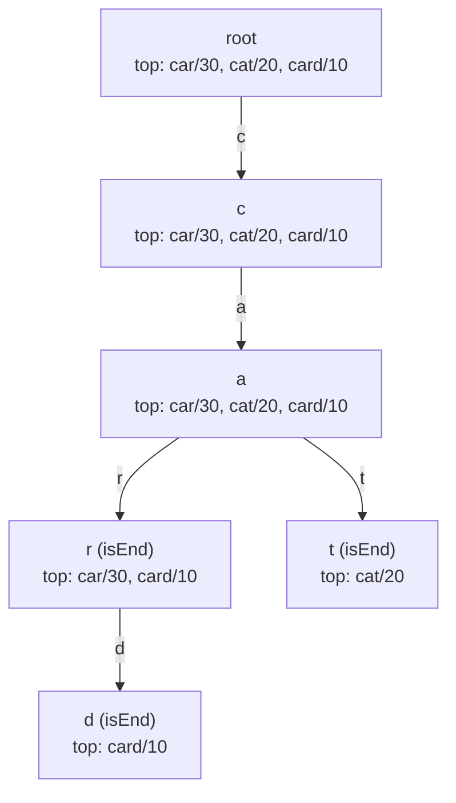

# Trie autocomplete

Elasticsearch's completion suggester answers a typeahead query in single-digit microseconds against a million-key dictionary, and it does so without scanning the dictionary, without ranking at query time, and without any data structure modern enough to have a Wikipedia page distinct from its 1960 ancestor. The substrate is a trie. The trick is what the production version does at every node.

A vanilla trie answers *"is `cat` a word?"* and *"what words start with `ca`?"* in time proportional to the query length. That much you already have from [Tries](../part-6-trees-heaps/08-tries.md): each node holds a children map and a single `is_end` flag, and a prefix walk is exactly `len(prefix)` array indexes. What it does not do is rank. A production autocomplete is asked, on every keystroke, *"of the words that start with `ca`, give me the three most popular, lexicographic tie-break, in under a millisecond."* The naive answer scans the subtree rooted at the prefix node, gathers every completion, sorts by hot degree, returns the head. On the prefix `i`, that subtree is the entire English-shaped portion of the dictionary; the latency is gone before the user finishes typing the next letter.[^1]

The fix is one structural change to the trie node: each node carries its own pre-sorted list of the top-K words that pass through it. The query becomes a walk-then-read; the work moves to insert time, where it amortizes naturally because keystrokes vastly outnumber commits. LeetCode 642 *Design Search Autocomplete System* hard-codes K = 3 and an end-of-query sentinel `'#'`; the rest of the contract is the same shape Elasticsearch ships.[^2] This chapter teaches the structure and the two operations that justify it.

## What changes in the node

The trie from [Tries](../part-6-trees-heaps/08-tries.md) had three fields per node: a children map, an `is_end` boolean, and nothing else. The autocomplete extension adds a fourth: a list named `top`, sorted by score descending with lex-ascending tie-break, capped at a constant `K_CAP`. Three small choices, each load-bearing.

The children map switches from a 26-element array to a hash map keyed by character. Production autocomplete sees Unicode, spaces, apostrophes, and digits; the R-way array's bounded-alphabet assumption breaks the moment the dictionary holds `i love you` (LC 642's example) or *café*. The hash-map node costs `O(R_v)` where `R_v` is the alphabet realized at that specific node, which is typically a tiny constant.[^5]

The cap `K_CAP` exists because the per-node list grows unboundedly otherwise. Production deployments pick `K_CAP` once, at the maximum top-K any caller might ever ask for, and the math is cheap. With `K_CAP = 10`, the per-node overhead is ten `(score, word)` tuples plus their string storage, typically 80 to 200 bytes, often dwarfed by the children map.

The sort order is the chapter's most fragile invariant: **score descending, ties broken by word ascending**. LC 642's spec is explicit: when two sentences have the same hot degree, the one that's smaller in ASCII order wins.[^2] Reverse the order or omit the tie-break and the canonical test fails on the input `["i love you", "island", "i love leetcode", "ironman"]` with hot degrees `[5, 3, 2, 2]`: the prefix `i` should return `["i love you", "island", "i love leetcode"]` because `" "` (ASCII 32) sorts before `"r"` (ASCII 114), but a wrong tie-break swaps `i love leetcode` for `ironman`.



*The trie after `input("car", 30)`, `input("cat", 20)`, `input("card", 10)`. Each node carries the top-K words that pass through it; `topk("ca", 2)` reads `n_ca.top[:2]` directly without descending.*

The two operations that maintain and consume this structure are `input` and `topk`. They are short, they are mirror images of each other, and they are the chapter.

## The two operations

### input(word, freq)

`input` walks the path the word's characters dictate, allocating nodes wherever the path ends, and refreshes the per-node `top` list at every node along the way. The refresh is the only step that's new compared to the vanilla trie's insert. Everything else, the node creation, the `is_end` flip at the terminal node, the descent, comes straight from [Tries](../part-6-trees-heaps/08-tries.md).

The refresh has a subtle requirement. If the word already lived in the dictionary at a different score, the old `(old_score, word)` entry must come out of the cache before the new one goes in. Skip this and the cache holds two entries for the same word, and `topk` returns duplicates. The §2 reference does the dedup in the first loop of `_insert_top`.

```python
class TrieNode:
    __slots__ = ("children", "is_end", "top")
    def __init__(self):
        self.children = {}
        self.is_end = False
        self.top = []                        # DESC score, ASC word, capped at K_CAP


K_CAP = 10


def _insert_top(top, score, word):
    for i, (_s, w) in enumerate(top):        # remove prior entry for this word
        if w == word:
            top.pop(i)
            break
    placed = False
    for i, (s, w) in enumerate(top):         # insert at the sorted position
        if score > s or (score == s and word < w):
            top.insert(i, (score, word))
            placed = True
            break
    if not placed:
        top.append((score, word))
    if len(top) > K_CAP:                     # evict tail past the cap
        top.pop()


class AutocompleteTrie:
    def __init__(self):
        self.root = TrieNode()

    def input(self, word, freq):
        node = self.root
        _insert_top(node.top, freq, word)    # global top via root cache
        for ch in word:
            if ch not in node.children:
                node.children[ch] = TrieNode()
            node = node.children[ch]
            _insert_top(node.top, freq, word)
        node.is_end = True

    def topk(self, prefix, k):
        if k <= 0:
            return []
        node = self.root
        for ch in prefix:
            if ch not in node.children:
                return []
            node = node.children[ch]
        return [w for (_s, w) in node.top[:k]]
```

**Solution** — Python ([Java](./04-trie-autocomplete/lc-642/sol.java) · [C++](./04-trie-autocomplete/lc-642/sol.cpp) · [Go](./04-trie-autocomplete/lc-642/sol.go))

```python
# LC 642. Design Search Autocomplete System (Premium)
# Frequency-extended trie. Each node caches the top-K (score DESC, word ASC)
# words that pass through it; `input(word, freq)` refreshes the cache on
# every node along the insert path; `topk(prefix, k)` walks to the prefix
# node and reads the cache directly. O(L * K) per insert; O(L + k) per
# query. The same code answers the LC 1268 free contract by reading the
# top-3 lex-smallest words (set freq = -ord-string for lex order).
from typing import Dict, List, Tuple


class TrieNode:
    __slots__ = ("children", "is_end", "top")

    def __init__(self) -> None:
        self.children: Dict[str, "TrieNode"] = {}
        self.is_end: bool = False
        # Sorted DESC by score, ties ASC by word; capped at K_CAP.
        self.top: List[Tuple[int, str]] = []


K_CAP = 10  # per-node cap; supports any k <= K_CAP at lookup time


def _insert_top(top: List[Tuple[int, str]], score: int, word: str) -> None:
    for i, (_s, w) in enumerate(top):
        if w == word:
            top.pop(i)
            break
    placed = False
    for i, (s, w) in enumerate(top):
        if score > s or (score == s and word < w):
            top.insert(i, (score, word))
            placed = True
            break
    if not placed:
        top.append((score, word))
    if len(top) > K_CAP:
        top.pop()


class AutocompleteTrie:
    def __init__(self) -> None:
        self.root = TrieNode()
        self.scores: Dict[str, int] = {}

    def input(self, word: str, freq: int) -> None:
        """Insert or refresh `word` with score `freq`. New freq REPLACES prior."""
        self.scores[word] = freq
        node = self.root
        _insert_top(node.top, freq, word)
        for ch in word:
            if ch not in node.children:
                node.children[ch] = TrieNode()
            node = node.children[ch]
            _insert_top(node.top, freq, word)
        node.is_end = True

    def topk(self, prefix: str, k: int) -> List[str]:
        if k <= 0:
            return []
        node = self.root
        for ch in prefix:
            if ch not in node.children:
                return []
            node = node.children[ch]
        return [w for (_s, w) in node.top[:k]]
```

Three things are worth pointing out about the order of work inside `input`. The root cache is refreshed *first*, before any descent — that's why `topk("", k)` (empty prefix, global top-K) is correct without a special case. The refresh runs *after* descending to each child, so the cache at every node summarizes the prefix terminating at that node. And the `is_end` flip happens *last*, only on the terminal node; it's orthogonal to whether that node has children, a point the trie chapter made and the autocomplete extension inherits unchanged.[^4]

The widget animates the full `input` cycle on three commits, then the matching `topk`. Watch the cache at `n_ca` fill from `[(30, car)]` to `[(30, car), (20, cat)]` to `[(30, car), (20, cat), (10, card)]` as the three inserts complete:

> **Interactive widget:** [Trie — insert + prefix walk + frequency autocomplete](../widgets/w-20-trie.yml) (panel `panel-b`) — rendered on the website; the YAML spec describes the keyframes.

*Static fallback: the trie starts empty. Inserting (car, 30) creates the chain root → c → a → r and refreshes the cache `[(30, car)]` at every node on the path; inserting (cat, 20) reuses c and a, creates t-branch, and updates the c-cache and a-cache to `[(30, car), (20, cat)]`; inserting (card, 10) reuses c, a, and r, creates a d-child of r, and the cache at n_ca becomes `[(30, car), (20, cat), (10, card)]`. The terminal `topk("ca", 2)` walks two edges to n_ca and returns `n_ca.top[:2] = ["car", "cat"]`. No DFS, no heap.*

### topk(prefix, k)

`topk` is the easy half. Walk the prefix; if any character has no child, return empty; otherwise read the cache at the prefix's terminal node and slice off the requested K. The whole function is two short loops and a return.

The cost is `O(L + k)` where `L` is the prefix length, exactly the bound the vanilla trie's `startsWith` hits, with one extra `O(k)` slice at the end. The cache makes the entire ranking subtree invisible at query time. Without the cache, the same answer requires a DFS over the prefix's subtree maintaining a min-heap of size K; that costs `O(L + S log K)` where `S` is the size of the prefix's subtree, easily 10⁴ to 10⁶ in production. Heap-on-walk is correct, and the LC 642 official editorial leads with it because it reads cleanly. It is also why a naive autocomplete shipped to production blows its latency SLO on single-letter prefixes.[^2]

The widget's terminal step shows the read-side mechanic: the walk ends at `n_ca`, and the answer is already there.

## Cost

| Operation | Time | Space (additional) |
|---|---|---|
| `input(word, freq)` on a word of length L | `O(L * K)` | `O(L)` new nodes worst case |
| `topk(prefix, k)` for prefix length L, request k ≤ K | `O(L + k)` | `O(k)` for the returned list |
| Build (n words, total chars m) | `O(m * K)` | `O(m + n_nodes * K)` |
| Refresh existing word at new score | `O(L * K)` | `O(0)` |

The `O(L * K)` insert cost is the price of moving the work off the read path. With `K = 10` and `L = 30` for the longest production sentence, every commit pays roughly 300 cache-update operations. A write-heavy dictionary at a million inserts per second hits this wall hard; a typeahead system where keystrokes outnumber commits by 50 to 1 buys back the cost on the first read and pays nothing on the rest. The trade is universal in production search: amortize work onto inserts so reads are cheap.[^1]

The space cost is real. Every node carries a list of up to `K` `(score, word)` tuples plus the string storage; with `K = 10` and a one-million-word dictionary, the cache typically dominates the per-node memory. Production deployments at this scale stop using a plain trie and switch to a finite-state transducer (FST), the data structure Lucene's completion suggester compiles the trie into at index time. The FST shares both prefixes *and* suffixes, compressing the structure 5x to 10x.[^1] The trade-off is that the FST is read-only between segment merges; the in-memory trie this chapter teaches is the right answer for incrementally updated dictionaries up to a few million keys.

For ordered iteration over completions or wildcard matching, an alternative substrate is the ternary search tree, introduced by Bentley and Sedgewick in 1997.[^3] The TST replaces the children map with three pointers per node (less-than, equal, greater-than), descends in `O(L log R)` instead of `O(L)`, and uses `O(m)` memory instead of `O(m * R)` for the array variant. Its `keysWithPrefix` method does autocomplete natively; its `keysThatMatch` handles wildcards. For the frequency-extended case this chapter teaches, the TST loses to the hash-map trie because the per-node cache pattern is awkward to maintain across the three children, but for unweighted prefix iteration it's the cleaner structure.

## Where the pattern bends

### Lazy heap-on-walk for write-heavy dictionaries

The per-node cache is a strict win when reads dominate. When writes dominate, on burst-loaded dictionaries or high-churn corpora, the `O(L * K)` insert cost stops paying for itself, and the `O(L)` insert cost of a vanilla trie plus an `O(L + S log K)` query at read time wins on aggregate. The query implementation is a DFS from the prefix node maintaining a min-heap of size K keyed on `(score, word)` with the chapter's tie-break comparator; the LC 642 editorial's first approach is the textbook reference.[^2] Pick this variant when most committed words never get queried, or when the dictionary mutates faster than it answers.

### Spell-corrected suggestions

Production autocomplete tolerates one-character typos. The walk extends naturally: a budgeted DFS from the prefix node, where each step either follows the matching child (no edit consumed) or branches to any child that doesn't match (one edit consumed). When the walk reaches an `is_end` node with budget left, harvest that node's cache rather than the single word, and the spell-corrected query answers in `O(L² R K)` for a single-edit budget. That's fine when the prefix is short, which it always is on the first few keystrokes of a query. The trie-DFS-with-edit-budget shape is exactly what LC 676 *Implement Magic Dictionary* asks for, scaled down to a single-word answer.

### Joint prefix-suffix queries

When the query is *"words starting with `ap` AND ending with `le`"*, the per-node top-K cache generalizes to a per-node max-index cache. Insert every `(suffix, '#', word)` rotation into the trie so a single trie answers `(prefix, suffix)` lookups in `O(P + S)` where P and S are the query's prefix and suffix lengths. Each node carries the maximum word index that passes through it; the answer reads the cache directly. LC 745 *Prefix and Suffix Search* is the canonical instance, and the per-node cache is the same chapter pattern with `K = 1`.

## Three pitfalls that bite

> [!WARNING]
> **Re-inserting a word without deduping the cache.** Calling `input("cat", 100)` after `input("cat", 20)` should overwrite the score, not add a second cache entry. The `_insert_top` reference scans for an existing entry by word identity *before* inserting the new `(score, word)` pair; skip the dedup loop and `topk` returns "cat" twice. The bug is invisible until the score changes and the dictionary suddenly has two ranks for the same word.

> [!WARNING]
> **Wrong tie-break breaks LC 642 silently.** The comparator is `(score DESC, word ASC)`, end to end. A max-heap keyed by score alone, or `heapq.nlargest(k, items, key=lambda x: -x.score)` accepting Python's stable-but-unspecified tie-break, fails the canonical case `["i love you", "island", "iroman", "i love leetcode"]` with weights `[5, 3, 2, 2]`. Expected on prefix `i`: `["i love you", "island", "i love leetcode"]`. Wrong tie-break swaps in `iroman`. The §2 reference encodes the comparator as `if score > s or (score == s and word < w):` and both halves are required.[^2]

> [!WARNING]
> **Sizing K_CAP to the canonical use case and forgetting the admin endpoints.** A typeahead service ships with `K_CAP = 3` because the UI shows three suggestions. Two months later, a debugging endpoint asks for top-20 and the trie returns 3, padded with nothing. Pick `K_CAP` for the maximum K any caller might ever request; the per-node memory cost is `O(K)` words plus their strings, so `K_CAP = 50` adds at most a few KB per node. Elasticsearch's completion suggester applies the same discipline at index time: the per-segment `max_input_length` bounds the query-time `size`.[^1]

A fourth pitfall worth one sentence: **`is_end` is not "this node is a leaf."** A node can be `is_end` AND have children, the way `n_car` is `is_end` for `car` AND has a `d`-child for `card`. The trie chapter teaches this; the autocomplete extension inherits it; the bug surfaces when the cache logic is layered over insufficient trie literacy. Re-read [Tries](../part-6-trees-heaps/08-tries.md) §7 if a topk query "loses" sibling completions.

## Problem ladder

### CORE (solve all to claim chapter mastery)

- [LC 1023 — Camelcase Matching](https://leetcode.com/problems/camelcase-matching/) [Medium] • trie-conditional-walk-with-skip *(reference: Python only)*
- [LC 676 — Implement Magic Dictionary](https://leetcode.com/problems/implement-magic-dictionary/) [Medium] • trie-fuzzy-deviation-dfs ★ *(reference: Python only)*
- [LC 745 — Prefix and Suffix Search](https://leetcode.com/problems/prefix-and-suffix-search/) [Hard] • trie-dual-key-prefix-suffix *(reference: Python only)*

### STRETCH (optional)

- [LC 720 — Longest Word in Dictionary](https://leetcode.com/problems/longest-word-in-dictionary/) [Easy] • trie-build-incremental-bfs
- [LC 642 — Design Search Autocomplete System](https://leetcode.com/problems/design-search-autocomplete-system/) [Hard] • trie-with-frequency-topk-cache *(LeetCode Premium; the AutocompleteTrie reference in `04-trie-autocomplete/lc-642/sol.{py,java,cpp,go}` satisfies this contract verbatim. The free alternative is [LC 1268 — Search Suggestions System](https://leetcode.com/problems/search-suggestions-system/), owned by [Tries](../part-6-trees-heaps/08-tries.md) as STRETCH; layer the per-node frequency cache from this chapter to recover the LC 642 contract.)*

LC 745 is PRIMARY-locked to [Aho-Corasick string matching](../part-12-strings-pattern-matching/04-aho-corasick.md), which uses it to teach bidirectional multi-key indexing. It earns a CORE seat here because the per-node max-index cache it builds is structurally the chapter's per-node top-K cache with `K = 1`.

## Where this leads

The natural next step is [Twitter feed (in-memory timeline design)](./05-twitter-feed.md), which lifts the same eager-amortization pattern, materialize a top-K answer at insert time and read it cheaply at query time, to a per-user feed cache. Past that, [Aho-Corasick string matching](../part-12-strings-pattern-matching/04-aho-corasick.md) is what happens when the trie's children map gets failure-link annotations and turns into an automaton that matches all dictionary patterns against a streaming input in linear time. The chapter you just read is the productionization step between the structure and the substrate; both follow-ups extend it in opposite directions.

## References

[^1]: Adrien Grand and the Elastic team, "You Complete Me," Elastic.co, on the completion suggester's finite-state-transducer substrate, microsecond-level prefix lookups, and the FST's 5-10x compression over a plain trie. <https://www.elastic.co/blog/you-complete-me>.

[^2]: leetcode.ca, "642 - Design Search Autocomplete System," posted 2017-09-02. <https://leetcode.ca/2017-09-02-642-Design-Search-Autocomplete-System/>.

[^3]: Jon Bentley and Robert Sedgewick, "Fast Algorithms for Sorting and Searching Strings," *Proc. 8th Annual ACM-SIAM Symposium on Discrete Algorithms* (SODA 1997), pp. 360-369. <http://www.cs.princeton.edu/~rs/strings/paper.pdf>.

[^4]: Wikipedia contributors, "Trie," last edited 27 March 2026, <https://en.wikipedia.org/wiki/Trie>.

[^5]: cp-algorithms.com, "Aho-Corasick algorithm," last updated 2025-04-18, <https://cp-algorithms.com/string/aho_corasick.html>.
