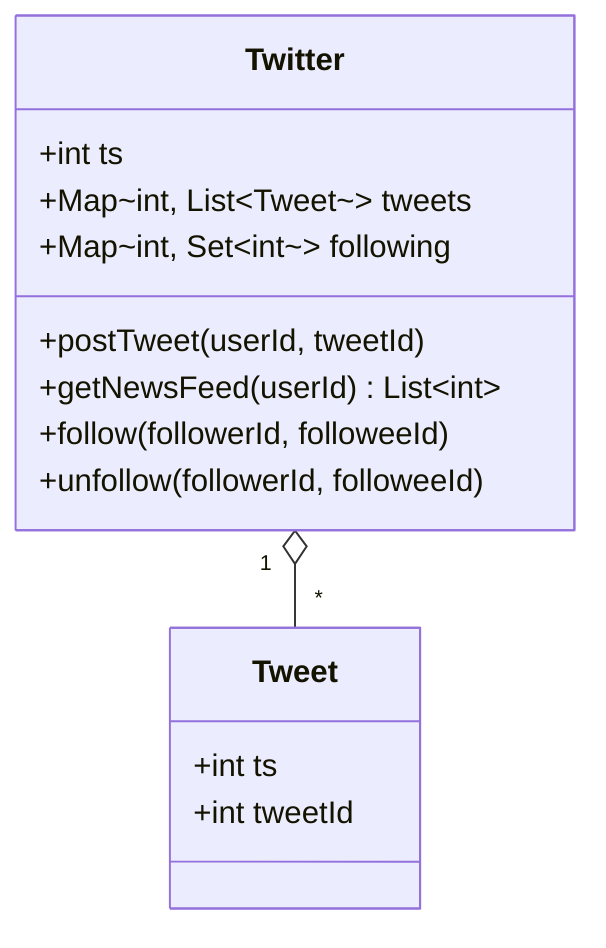
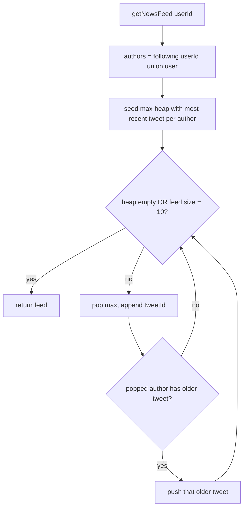
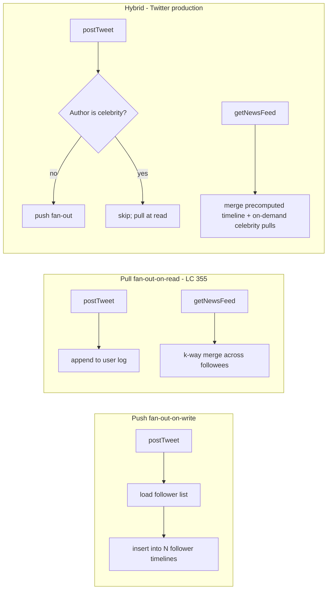

# Twitter feed design

Twitter ran 6,000 writes per second and 300,000 reads per second when Raffi Krikorian gave the architecture talk in 2013. The fifty-to-one ratio is the only number that matters for picking a timeline strategy. Read-side merging from scratch on every request would melt the read tier; pre-computing every follower's timeline at write time would melt the write tier for accounts like Lady Gaga (31 million followers in 2013, 31 million Redis inserts per tweet). The production answer is a hybrid that splits the workload by celebrity threshold. The LC 355 answer is the *read-side merge core* of that hybrid, raised to a class boundary, with the production scale removed so the algorithm is what's left.

The four-method contract is fixed: `postTweet`, `follow`, `unfollow`, `getNewsFeed`. Three of those are one-line operations on a hash map. The fourth is the chapter. `getNewsFeed(u)` returns the ten most recent tweets across `u` and everyone `u` follows, ordered most-recent first, and that's a k-way merge of `|followees| + 1` time-sorted lists with a hard cap on the output size. The shape is the same as [LC 23 Merge k Sorted Lists](https://leetcode.com/problems/merge-k-sorted-lists/), and we already taught the merge in [Heaps and priority queues](../part-6-trees-heaps/04-heaps-priority-queues.md). What's new here is wrapping that merge inside a class with state, making the timestamps monotonic so the order is unambiguous, and noticing that the feed cap of 10 turns the asymptotic envelope from `O(n log k)` into `O(k log k)` regardless of how many tweets exist.

## The four methods, in plain terms

A user can do four things. They can post a tweet, which adds the tweet to their personal log. They can follow another user, which adds that user to their follow set. They can unfollow, which removes one. And they can ask for their news feed, which returns up to ten of the most recent tweets across themselves and everyone they follow, newest first.[^2]

Three pieces of state cover all four operations: a per-user list of tweets, a per-user follow set, and one global counter that ticks up on every post.

| Field | Type | Purpose |
|---|---|---|
| `ts` | int | Monotonic global counter, incremented on every `postTweet` |
| `tweets[user]` | append-only list of `(ts, tweetId)` | Per-user tweet log, time-sorted by construction |
| `following[user]` | hash set of user IDs | Direct followees of `user` (does not include `user`) |

The global counter is what makes ordering across users unambiguous. Real Twitter uses Snowflake IDs that embed a 41-bit millisecond timestamp; the LC harness gives us a single integer that increments once per call, which is the same idea minus the wall-clock.[^1] Two posts from two different users in two different `postTweet` calls receive distinct, comparable `ts` values, so "newest first" has one definition across the whole class.



*Each instance owns a per-user tweet log (append-only) and a per-user follow set; `ts` is the monotonic global counter that orders tweets across all users.*

## postTweet, follow, unfollow

Three of the four methods are hash-map updates. They earn one paragraph total.

`postTweet(userId, tweetId)` increments the global timestamp, then appends `(ts, tweetId)` to that user's log. The append is amortized `O(1)` per call by the standard dynamic-array argument we proved in [Hash maps and hash sets](../part-1-linear-data-structures/03-hash-maps.md), and the log is time-sorted by construction because every new entry carries a `ts` strictly greater than every previous entry. `follow(followerId, followeeId)` short-circuits the self-follow case (a user following themselves is a no-op; their own tweets already reach their feed through a different path) and otherwise inserts `followeeId` into the follower's set. `unfollow(followerId, followeeId)` calls the set's discard primitive (Python's `set.discard`, Java's `Set.remove`, C++'s `unordered_set::erase`, Go's `delete`); all four are silent on missing keys, which matches the LC contract that unfollowing someone you don't follow is not an error.[^2] All three operations are expected `O(1)` under the chained-hash-table bound from CLRS Theorem 11.1.[^3]

The teaching content of this chapter starts at the fourth method.

## getNewsFeed: the k-way merge

The naive reading is the wrong reading. "Return the ten most recent tweets across the user and everyone they follow" sounds like *collect every tweet, sort by timestamp, take the first ten.* That works. It also wastes most of its work.

```python
# Wrong instinct: O(N log N) where N = total tweets across all followees
def get_news_feed_wrong(self, userId):
    authors = self.following[userId] | {userId}
    all_tweets = []
    for a in authors:
        all_tweets.extend(self.tweets[a])
    all_tweets.sort(key=lambda t: -t[0])
    return [tid for _, tid in all_tweets[:10]]
```

Two things are wrong with that. First, the sort is doing far more work than the answer needs. We want ten items; the sort produces a fully-ordered sequence of all `N` items and throws `N - 10` of them away. Second, `N` is unbounded: a user following 1,000 people who each posted 1,000 times has a million tweets to sort on every news-feed call. The correct shape is **partial merge with early stop**.

The reduction is the chapter's hardest insight: each followee's tweet log is *already sorted* by timestamp, in descending order if we read it from the back. So `getNewsFeed` is not "sort across followees", it's "merge across followees and stop after ten." That's [LC 23 Merge k Sorted Lists](https://leetcode.com/problems/merge-k-sorted-lists/) with two adjustments: the lists are read from the back instead of the front, and the merge halts at ten outputs instead of running to exhaustion.

The k-way merge with a max-heap is the standard solution. Seed the heap with one entry per author (the most recent tweet of each followee, plus the user's own most recent), then pop ten times, pushing each popped author's next-older tweet back onto the heap before the next pop. Heap size never exceeds `k = |followees| + 1` because every pop is paired with at most one push from the same author.[^4]

```python
def getNewsFeed(self, userId):
    authors = self.following[userId] | {userId}
    heap = []                                        # max-heap on ts (negate for min-heap stdlib)
    for a in authors:                                # seed: one entry per author
        tw = self.tweets.get(a)
        if not tw:
            continue
        idx = len(tw) - 1
        ts, tid = tw[idx]
        heapq.heappush(heap, (-ts, tid, a, idx))

    feed = []
    while heap and len(feed) < self.FEED_CAP:
        _, tid, a, idx = heapq.heappop(heap)
        feed.append(tid)
        if idx > 0:                                  # advance THIS author one tweet older
            nts, ntid = self.tweets[a][idx - 1]
            heapq.heappush(heap, (-nts, ntid, a, idx - 1))
    return feed
```

**Solution** — Python ([Java](./05-twitter-feed/lc-355/sol.java) · [C++](./05-twitter-feed/lc-355/sol.cpp) · [Go](./05-twitter-feed/lc-355/sol.go))

```python
# LC 355. Design Twitter
# In-memory class with four operations. The non-trivial work is in
# getNewsFeed, which k-way-merges per-author tweet logs through a max-heap
# keyed on a monotonic timestamp. Heap size is bounded by the author count,
# not the total tweet count, because each author contributes one entry at a
# time. O(k log k) per call where k = |followees| + 1; O(1) for the others.
import heapq
from collections import defaultdict
from typing import Dict, List, Set, Tuple


class Twitter:
    """In-memory Twitter timeline supporting post/follow/unfollow/news-feed."""

    FEED_CAP = 10

    def __init__(self) -> None:
        self.tweets: Dict[int, List[Tuple[int, int]]] = defaultdict(list)
        self.following: Dict[int, Set[int]] = defaultdict(set)
        self.ts: int = 0

    def postTweet(self, userId: int, tweetId: int) -> None:
        self.ts += 1
        self.tweets[userId].append((self.ts, tweetId))

    def getNewsFeed(self, userId: int) -> List[int]:
        authors = self.following[userId] | {userId}
        # heapq is min-only; negate ts to simulate a max-heap.
        heap: List[Tuple[int, int, int, int]] = []
        for a in authors:
            tw = self.tweets.get(a)
            if not tw:
                continue
            idx = len(tw) - 1
            ts, tid = tw[idx]
            heapq.heappush(heap, (-ts, tid, a, idx))

        feed: List[int] = []
        while heap and len(feed) < self.FEED_CAP:
            _, tid, a, idx = heapq.heappop(heap)
            feed.append(tid)
            if idx > 0:
                next_idx = idx - 1
                nts, ntid = self.tweets[a][next_idx]
                heapq.heappush(heap, (-nts, ntid, a, next_idx))
        return feed

    def follow(self, followerId: int, followeeId: int) -> None:
        if followerId == followeeId:
            return
        self.following[followerId].add(followeeId)

    def unfollow(self, followerId: int, followeeId: int) -> None:
        self.following[followerId].discard(followeeId)
```

The four-language drift is exactly what [Heaps and priority queues](../part-6-trees-heaps/04-heaps-priority-queues.md) prepared us for. Python's `heapq` is min-only, so we negate the timestamp on push and on pop. C++'s `std::priority_queue` is max-by-default and tuples compare lexicographically, so the leading `ts` field drives the order with no comparator. Java's `PriorityQueue<int[]>` needs an explicit `Integer.compare(b[0], a[0])` to flip min into max, and the implementation allocates a fresh `int[]` on every push because mutating an array still inside the heap silently breaks the heap invariant. Go's `container/heap` requires the five-method `heap.Interface` and a `Less` returning `>` instead of `<`. Same algorithm, four languages of taxes.

### Why heap size stays at k

The lazy-push invariant is the part most candidates skip and the part the algorithm depends on. Seeding inserts exactly one entry per author. Every iteration of the main loop pops one entry and conditionally pushes one entry from the same author (the next-older tweet, if any). Net change per iteration: at most zero. So heap size is bounded by `k` for the whole life of the call.[^4]

The tempting alternative is to seed the heap with every tweet from every followee. Correctness still holds. But heap size becomes `O(N)` instead of `O(k)`, and every push and pop pays `log N` instead of `log k`. On a user following 1,000 people who each posted 1,000 tweets, the difference is 20 vs 10 per heap operation, and we do those operations a million times during seeding alone. The lazy seed is what makes the algorithm sublinear in `N`.

### A trace of the canonical input

The arithmetic gets concrete on a small instance. Eight calls, the last of which is the news feed:

```text
postTweet(1, 5)        # ts=1, tweets[1]=[(1,5)]
postTweet(1, 3)        # ts=2, tweets[1]=[(1,5),(2,3)]
follow(1, 2)
postTweet(2, 6)        # ts=3, tweets[2]=[(3,6)]
follow(1, 4)
postTweet(4, 9)        # ts=4, tweets[4]=[(4,9)]
postTweet(2, 7)        # ts=5, tweets[2]=[(3,6),(5,7)]
getNewsFeed(1)         # authors = {1, 2, 4}
```

| Step | Action | Heap (max on ts) | Feed |
|---|---|---|---|
| seed | push (ts=2, tid=3, a=1) | [(2,3,1)] | [] |
| seed | push (ts=5, tid=7, a=2) | [(5,7,2),(2,3,1)] | [] |
| seed | push (ts=4, tid=9, a=4) | [(5,7,2),(2,3,1),(4,9,4)] | [] |
| pop  | (5,7,2); a=2 has older → push (3,6,2) | [(4,9,4),(2,3,1),(3,6,2)] | [7] |
| pop  | (4,9,4); a=4 has no older | [(3,6,2),(2,3,1)] | [7,9] |
| pop  | (3,6,2); a=2 has no older | [(2,3,1)] | [7,9,6] |
| pop  | (2,3,1); a=1 has older → push (1,5,1) | [(1,5,1)] | [7,9,6,3] |
| pop  | (1,5,1); a=1 has no older | [] | [7,9,6,3,5] |

Five tweets total in the feed. The output `[7, 9, 6, 3, 5]` is in `ts`-descending order: 5, 4, 3, 2, 1. The heap never holds more than three entries (one per author), and the algorithm visits exactly five `postTweet` records. No more than the answer's worth.



*Every pop is paired with at most one push from the same author, keeping heap size bounded by `|authors|` for the duration of the call.*

## What it actually costs

`k = |followees(u)| + 1`, `F = 10` (the LC-fixed feed cap), `n` = total tweets stored across the class lifetime.

| Operation | Time | Space (per call) | Lifetime space |
|---|---|---|---|
| `postTweet` | `O(1)` amortized | `O(1)` | adds one tweet record |
| `follow` | `O(1)` expected | `O(1)` | adds one follow edge |
| `unfollow` | `O(1)` expected | `O(1)` | removes one follow edge |
| `getNewsFeed` | `O(k log k)` | `O(k)` heap + `O(F)` feed | no change |
| Whole class | n/a | n/a | `O(n)` tweets + `O(\|edges\|)` follows |

Two complexity claims need a one-line proof.

The `getNewsFeed` bound. Seeding scans `k` authors and pushes one entry each, costing `O(k log k)`. The main loop runs at most `F = 10` iterations; each iteration does one pop and at most one push, both `O(log k)` since the heap has at most `k` items. Total is `O(k log k + F log k)`, which simplifies to `O(k log k)` because `F` is a fixed constant. CLRS Theorem 6.5 gives the per-operation `O(log k)` bound, and Exercise 6.5-9 establishes the `O(n log k)` total cost of full k-way merge. We pay the same per-operation cost but only `F` operations instead of `n`.[^4]

The `postTweet` amortization. Each call appends to a dynamic array. The doubling-on-overflow strategy charges `O(1)` to most appends and `O(n)` to the rare doubling event; CLRS §17.4 spreads the cost evenly across calls. The same argument we made for hash-map insert applies verbatim.[^3]

## Where readers go wrong

> [!WARNING]
> **Sort-and-slice on every news feed.** The wrong instinct is to flatten every followee's log into one list, sort by timestamp descending, and take the first 10. Correctness holds; cost is `O(N log N)` where `N` is the total tweets across all followees. On a user following 1,000 people who have each posted 1,000 tweets, that's 20 million comparisons per news feed call. The heap version is `O(k log k)` for the same input, about 10,000 operations. The mental shift is "I only need 10, not the full sorted list."

> [!WARNING]
> **Seeding the heap with every tweet of every followee.** A correct but wasteful version pushes all `N` tweets into the heap during the seed pass. Heap size balloons to `O(N)`, and every push pays `log N` instead of `log k`. The lazy-push invariant is the optimization: seed with one entry per author, and on each pop, push *that author's* next-older tweet only. Heap size stays at `k`.[^4]

> [!WARNING]
> **Forgetting the user's own tweets.** The author set is `following[userId] | {userId}`, not `following[userId]`. The first symptom is the test case `postTweet(1, 5); getNewsFeed(1)` returning `[]` instead of `[5]`. The user is implicitly an author of their own feed; the LC spec's "tweets from this user" line is easy to miss when the rest of the spec is talking about followees.[^2]

> [!WARNING]
> **Mutating an `int[]` already in a Java `PriorityQueue`.** Java heaps hold references, not copies. Mutating an `int[]` whose pointer is currently inside the heap silently corrupts the heap invariant: a sift-down comparison can read the new field values mid-walk and pick the wrong child. The reference implementation allocates a fresh `int[]` on every push for exactly this reason. The discipline phrase: *polled is mine; allocate new for the push.*

> [!WARNING]
> **32-bit timestamp overflow on a long-running instance.** LC's harness caps operations well below 2³¹, so `int ts` works for the judge. In a production system that ran for a year, `ts` would wrap and the ordering invariant would invert. The production fix is a 64-bit timestamp (Java `long`, C++ `long long`, Go `int64`; Python ints are arbitrary precision); Twitter's actual production system uses Snowflake IDs that pack a 41-bit millisecond timestamp into a 64-bit field.[^1]

## What this looks like at scale

LC 355 is the read-merge core of Twitter's home-timeline service with the scale removed. The full production architecture isn't pull-only.

Krikorian's 2013 talk laid out the trade.[^1] Pure pull (the LC 355 model) makes `postTweet` cheap and `getNewsFeed` expensive, because every read does the k-way merge from scratch. Pure push, also called fan-out-on-write, inverts the trade. When a user posts, the system iterates their follower list and inserts the tweet into each follower's pre-computed home timeline. Reads become a single Redis range scan. The cost is write amplification proportional to follower count, which is fine for most users and catastrophic for celebrities. A Lady Gaga tweet at 31 million followers became 31 million Redis inserts.



*Pure pull (LC 355) trades cheap writes for expensive reads; pure push trades cheap reads for unbounded write amplification on celebrities; the hybrid splits the workload by follower-count threshold and merges the two paths at read time.*

The hybrid is what Twitter actually shipped. Non-celebrity tweets fan out at write time into per-follower Redis lists capped at 800 entries. Celebrity tweets skip fan-out and live in the author's own user-timeline list. `getNewsFeed` for any user merges their precomputed home timeline with on-demand reads of each followed celebrity's user-timeline, then sorts the combined result by timestamp and trims to the requested page size. The threshold is a tuning parameter, conventionally somewhere around 1 million followers.[^1]

Yao Yue's 2014 talk added the storage detail. Twitter's Timeline Service ran a forked Redis with two custom data types, Hybrid List (a linked list of fixed-size ziplists) and a custom BTree, sized to handle 30 million queries per second across roughly 6,000 instances and about 40 TB of allocated heap.[^5] The Hybrid List existed because vanilla Redis ziplists require an `O(timeline size)` memmove on every insert, which is fine at 50 entries and ruinous at 800; splitting the timeline into bounded ziplist nodes caps the memmove at the node size.

None of that scaling work changes the algorithm in `getNewsFeed`. The read-side merge is still a heap-based k-way merge of timestamp-sorted lists, just with two sources (precomputed timeline + celebrity pulls) instead of `k` sources, and with the heap living in a Redis-resident structure instead of a process-local one. The LC 355 algorithm is the algorithmic kernel that survives every scale-up.

## Problem ladder

### CORE (solve all to claim chapter mastery)

- [LC 355 — Design Twitter](https://leetcode.com/problems/design-twitter/) [Medium] • k-way-merge-design ★
- [LC 1797 — Design Authentication Manager](https://leetcode.com/problems/design-authentication-manager/) [Medium] • ttl-design
- [LC 1825 — Finding MK Average](https://leetcode.com/problems/finding-mk-average/) [Hard] • sliding-window-with-trimmed-mean

### STRETCH (optional)

- [LC 1603 — Design Parking System](https://leetcode.com/problems/design-parking-system/) [Easy] • counter-design
- [LC 1622 — Fancy Sequence](https://leetcode.com/problems/fancy-sequence/) [Hard] • lazy-evaluation-design *(LeetCode Premium)*

The Twitter pattern admits no canonical Easy from inside the merge family. Strip out any of the four moving parts (constructor state, monotonic timestamp, follow set, feed merge) and the problem either collapses into a trivial counter or loses the timeline-merge teaching point. LC 1603 fills the Easy slot from an adjacent design pattern: a constructor with state, a counter check, a boolean return. Different algorithm, same class-shape discipline.

## Where this leads

The merge subroutine is taught in [Heaps and priority queues](../part-6-trees-heaps/04-heaps-priority-queues.md), which has the full LC 23 walkthrough this chapter compresses into one section. The hash-map operations are taught in [Hash maps and hash sets](../part-1-linear-data-structures/03-hash-maps.md), which gives the chained-hash-table proof we relied on for the `O(1)` follow and unfollow bounds. For the production architecture itself (fan-out trade-offs, celebrity thresholds, multi-region replication of the timeline service), that's a system-design topic and lives outside this handbook's algorithmic core.

## References

[^1]: Todd Hoff (citing Raffi Krikorian), "The Architecture Twitter Uses to Deal with 150M Active Users, 300K QPS, a 22 MB/S Firehose, and Send Tweets in Under 5 Seconds," High Scalability blog, 2013-07-08, [https://highscalability.com/the-architecture-twitter-uses-to-deal-with-150m-active-users/](https://highscalability.com/the-architecture-twitter-uses-to-deal-with-150m-active-users/).

[^2]: LeetCode 355 Design Twitter, [https://leetcode.com/problems/design-twitter/](https://leetcode.com/problems/design-twitter/).

[^3]: Cormen, Leiserson, Rivest, Stein, *Introduction to Algorithms*, 4th ed., MIT Press, 2022.

[^4]: Cormen, Leiserson, Rivest, Stein, *Introduction to Algorithms*, 4th ed., MIT Press, 2022.

[^5]: Todd Hoff (citing Yao Yue), "How Twitter Uses Redis to Scale - 105TB RAM, 39MM QPS, 10,000+ Instances," High Scalability blog, 2014-09-08, [https://highscalability.com/how-twitter-uses-redis-to-scale-105tb-ram-39mm-qps-10000-ins/](https://highscalability.com/how-twitter-uses-redis-to-scale-105tb-ram-39mm-qps-10000-ins/).
