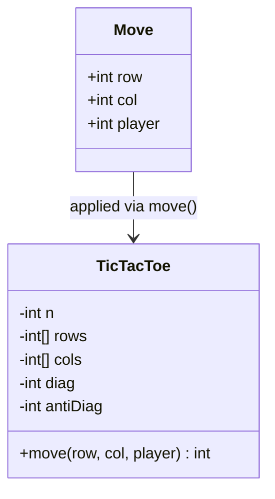
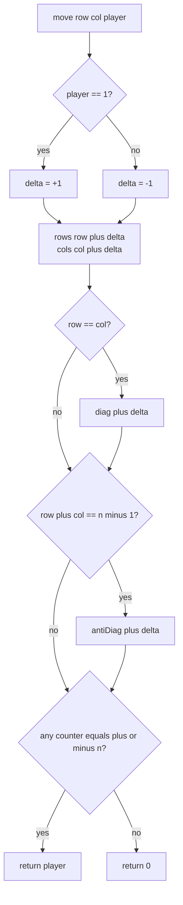

# Game state design

The interview question is *Design Tic-Tac-Toe* (LeetCode 348). Almost every first attempt looks the same: keep an `n × n` board of marks, and after every move walk the played row, the played column, and both diagonals to check for a winner. That's `O(n)` per move on an `n × n` grid. The right design is `O(1)` per move on the same grid, using `O(n)` memory total instead of `O(n²)`. Both numbers, the per-move cost and the total memory, improve at once with no sacrifice anywhere.

The trick that buys both is small enough to fit on one line: instead of storing the board, store *what the board would tell you when you scanned it*. Maintain four counters (one per row, one per column, one per diagonal, one per anti-diagonal) and update them in place as moves arrive. The board never gets materialized. The scan that the naive design runs after every move is replaced by four integer comparisons against `±n`. This chapter is what those four counters look like, why they're sufficient, and where the same idea (don't store the state, store the predicate) shows up at chess-engine scale.

## What "design" means here

A game-state design problem hands you two operations and asks for an API:

- A **mutator**: a player makes a move at `(row, col)`.
- A **predicate query**, "did that move just win?", which fires after every mutation.

The naive design materializes the board (the natural mental model) and re-derives the predicate by scanning. Every board cell is stored; every cell on the played lines is read. For a 100×100 grid (LC 348's max constraint), that's 10,000 cells of memory and roughly 400 reads per move.[^1]

The good design materializes the *predicate's inputs*, not the board. For tic-tac-toe the predicate is "does some line have all `n` marks from one player?" The inputs to that predicate are per-line aggregate counts. Track those directly; never store the cells.



*The class holds four aggregate counters, not a 2D board; a `Move` updates exactly the counters whose lines pass through `(row, col)`.*

The shift from "store the board, scan to query" to "store the query's answer, update on write" is the move. CLRS calls the technique *aggregate analysis*: maintain a small derived state alongside the primary data so each operation does `O(1)` work amortized.[^2] The same pattern shows up in [Hash maps and hash sets](../part-1-linear-data-structures/03-hash-maps.md) for size tracking, in difference arrays for range-update queries, and at the largest scale in chess-engine bitboards. The interview question is the smallest interesting instance of all of them.

## The four-counter algorithm

The state for an `n × n` board is four pieces:

- `rows[i]`: counter for row `i`, range `[-n, n]`.
- `cols[j]`: counter for column `j`, range `[-n, n]`.
- `diag`: counter for the main diagonal `(0,0)..(n-1, n-1)`.
- `antiDiag`: counter for the anti-diagonal `(0, n-1)..(n-1, 0)`.

Player 1 contributes `+1` to every counter that includes the played cell. Player 2 contributes `-1`. The sign trick collapses what would otherwise be eight counters (one per line per player) into four; each counter's value equals `(player-1 marks on the line) - (player-2 marks on the line)`, so the value is `+n` exactly when player 1 owns the line and `-n` exactly when player 2 does.[^1]

```python
class TicTacToe:
    def __init__(self, n: int):
        self.n = n
        self.rows = [0] * n
        self.cols = [0] * n
        self.diag = 0
        self.anti_diag = 0

    def move(self, row: int, col: int, player: int) -> int:
        delta = 1 if player == 1 else -1
        self.rows[row] += delta
        self.cols[col] += delta
        if row == col:
            self.diag += delta
        if row + col == self.n - 1:
            self.anti_diag += delta

        target = self.n if player == 1 else -self.n
        if (self.rows[row] == target or self.cols[col] == target
                or self.diag == target or self.anti_diag == target):
            return player
        return 0
```

**Solution** — Python ([Java](./06-game-state-design/lc-348/sol.java) · [C++](./06-game-state-design/lc-348/sol.cpp) · [Go](./06-game-state-design/lc-348/sol.go))

```python
# LC 348. Design Tic-Tac-Toe

class TicTacToe:
    def __init__(self, n: int):
        self.n = n
        self.rows = [0] * n
        self.cols = [0] * n
        self.diag = 0
        self.anti_diag = 0

    def move(self, row: int, col: int, player: int) -> int:
        """LC 348: place player's mark; return player if the move wins, else 0."""
        delta = 1 if player == 1 else -1
        self.rows[row] += delta
        self.cols[col] += delta
        if row == col:
            self.diag += delta
        if row + col == self.n - 1:
            self.anti_diag += delta

        target = self.n if player == 1 else -self.n
        if (self.rows[row] == target or self.cols[col] == target
                or self.diag == target or self.anti_diag == target):
            return player
        return 0
```

Two updates always fire (`rows[row]` and `cols[col]`), and zero, one, or two diagonal updates fire depending on the cell. The corners participate in three lines. Take `(0, 0)`: it's on the main diagonal because `0 == 0`, but not on the anti-diagonal unless `n = 1`. The center of an odd-sized board is the only cell on all four lines. Every other cell is on two or three. The predicate check is four constant-time comparisons regardless.



*Two unconditional counter updates plus zero, one, or two diagonal updates; the win-check tests four counters, never any cell.*

### Why the move can only complete a line through `(row, col)`

The win check looks at four counters and skips the rest. The reason it's allowed to is geometric: a move at `(row, col)` can only complete a line that *passes through* `(row, col)`. Lines that don't include the played cell didn't change on this move, so their counters didn't change, so they can't have just crossed the `±n` threshold.[^1]

On an `n × n` grid, exactly four lines pass through any given cell: its row, its column, the main diagonal (when `row == col`), and the anti-diagonal (when `row + col == n - 1`). The algorithm checks exactly those, and exactly those are the only lines the move could have just completed. The check is both necessary and sufficient.

This is the same `O(1)` per-operation reasoning that CLRS §17.1 develops as aggregate analysis: maintain just enough derived state alongside the primary data, and per-operation queries collapse to constant time.[^2] It's the design pattern, not just a tic-tac-toe trick.

### Why `+n` is the right target

A row of length `n` is owned by player 1 iff every cell in it is a player-1 mark. With `+1` per player-1 mark and `-1` per player-2 mark, the row counter equals the player-1 count minus the player-2 count. The maximum value is `n` (all player 1). Any value strictly less than `n` means at least one cell is empty or belongs to player 2, so the row isn't owned. The threshold `+n` is exactly the line-ownership predicate, with no slack.

The symmetric argument for `-n` and player 2 follows by sign. There's no edge case where the threshold misfires: counters move by exactly `±1` per move and can only land on `+n` or `-n` from the immediately prior `±(n-1)` value, which is reachable in one move only if every other cell on the line was already owned.

## Tracing one game

A short trace makes the algorithm concrete. Take `n = 3`, the canonical tic-tac-toe board. Player 1 plays `(0, 0)`; player 2 plays `(1, 0)`; player 1 plays `(0, 1)`; player 2 plays `(1, 1)`; player 1 plays `(0, 2)`.

| Move | Player | Cell | rows | cols | diag | antiDiag | Result |
|---|---|---|---|---|---|---|---|
| 1 | 1 | (0,0) | `[1, 0, 0]` | `[1, 0, 0]` | 1 | 0 | 0 |
| 2 | 2 | (1,0) | `[1, -1, 0]` | `[0, 0, 0]` | 1 | 0 | 0 |
| 3 | 1 | (0,1) | `[2, -1, 0]` | `[0, 1, 0]` | 1 | 0 | 0 |
| 4 | 2 | (1,1) | `[2, -2, 0]` | `[0, 0, 0]` | 0 | 0 | 0 |
| 5 | 1 | (0,2) | `[3, -2, 0]` | `[0, 0, 1]` | 0 | 1 | **1** |

On move 5, `rows[0]` reaches `+3 = +n`. Player 1 owns row 0. The function returns `1`. Note that `diag` swung `1 → 0` on move 4 (player 2 marked `(1,1)`, which is on the main diagonal); every line that *could* matter has its counter live at all times, and the algorithm doesn't have to remember which lines are "interesting" yet.

## What it actually costs

| Variant | Time per move | Space | Notes |
|---|---|---|---|
| Naive scan after every move | `O(n)` | `O(n²)` board | Re-reads up to `4n` cells; the obvious implementation. |
| Counter-based | **`O(1)`** | **`O(n)`** counters | Two array writes plus zero, one, or two diagonal writes; four comparisons. |
| Move-stream replay (LC 1275) | `O(m)` total, `O(1)` per move | `O(n)` with counters | Process a fixed list of `m` moves, report winner / draw / pending.[^3] |
| State-validity check (LC 794) | `O(n²)` one-shot | `O(1)` extra | Single board scan to validate parity invariants; not online.[^4] |
| Bitboard predicate (chess) | `O(1)` per query | `O(64-bit words)` per piece type | Bitwise AND of attack mask and king bitboard.[^6] |

The headline is the second row. `O(1)` per move with `O(n)` total memory is the textbook win; both axes improve at once. For `n = 100` (LC 348's max), the counter-based design uses 200 ints versus the naive design's 10,000, and runs zero board scans versus four per move.

The bitboard row at the bottom is the same idea on a 64-square chessboard. Crafty's bitboard architecture, formalized in Hyatt's 1999 *Rotated Bitmaps* paper, packs each piece type's occupancy into a single 64-bit unsigned integer.[^6] "Is the king attacked?" becomes one bitwise AND of the precomputed attack mask and the king's bitboard. Same shape: derive the predicate's input from incremental updates; the per-query cost collapses to `O(1)` regardless of board size.

## Generalizations beyond tic-tac-toe

### Position keys with Zobrist hashing

Chess engines reach the same position via different move orders. Searching the same position twice wastes work, so engines memoize evaluations in a *transposition table* keyed on a position hash. The hash needs to update incrementally as moves are made and unmade; recomputing it from scratch every move would defeat the cache.

Zobrist hashing solves this in 1970.[^5] Assign each `(piece, square, color)` triple a random 64-bit string at startup. The position's hash is the XOR of the bitstrings for every piece currently on the board, plus a side-to-move bitstring. Making a move updates the hash with two XORs (remove the piece from its old square, add it to the new square); unmaking re-applies the same two XORs because XOR is its own inverse.[^5]

The same pattern: don't store the position. Store the predicate's input (the hash) and update it locally.

### Snake as deque-with-membership-set

LC 353 *Design Snake Game* asks for a snake that moves on a grid, growing on food and dying on self-collision. The snake's body is naturally a queue: the head is the front, the tail is the back, and a move pushes a new head and pops the old tail. But the per-move predicate is "does the new head collide with any current body cell?", and walking the queue to check is `O(body length)` per move.

The fix is to maintain a hash set of occupied cells alongside the deque. Push the new head: add to deque, add to set. Pop the old tail: remove from deque, remove from set. The collision check is one set lookup. `O(1)` per move regardless of snake length.[^7]

The order-of-operations subtlety on this one: when the new head lands on the cell the old tail is about to vacate, the collision check fires falsely if the set still contains the tail. Remove the tail from the set *first*, test the new head, then add it. Same pattern as the LC 348 four-counter algorithm: the *invariant* is what's stored, not the literal grid.

## Where readers go wrong

> [!WARNING]
> **Re-scanning the board after every move.** The naive `O(n²)` solution sounds reasonable on a 3×3 grid (you can run the scan in your head). At LC 348's max `n = 100`, a thousand-move game does 40 million cell reads where the counter algorithm does a few thousand counter writes. The design doesn't change as `n` grows; the per-move cost does, by `n × n` against `1`.[^8]

> [!WARNING]
> **Forgetting the anti-diagonal formula.** Main-diagonal cells satisfy `row == col`, which is mnemonically clean. Anti-diagonal cells satisfy `row + col == n - 1`, which is one off from the natural guess `row + col == n`. The off-by-one breaks silently: anti-diagonal wins go undetected and the game continues past its legal end. Derive the formula from the corner: `(0, n-1)` is on the anti-diagonal, and `0 + (n-1) = n - 1`. Memorize the corner check, not the formula.[^8]

> [!WARNING]
> **Double-counting an already-occupied cell.** The chapter's reference doesn't bounds-check moves or check for re-plays; LC 348's problem statement guarantees both.[^1] In production code, replays would silently break the invariant: `rows[r]` would be incremented twice for the same player, and the predicate `rows[r] == n` could fire on `n - 1` actual marks plus one duplicate. Defensive code rejects re-plays explicitly; the chapter's didactic snippet skips the check to keep the algorithm visible.

> [!WARNING]
> **Mixing bitboard square conventions in chess code.** Two competing conventions exist: Hyatt's Crafty and DARK THOUGHT use `a8 = bit 63, h1 = bit 0`; many tutorial implementations use `a1 = bit 0`. Half a codebase using one and half using the other produces nonsense move generation and FEN parsing. Pick one at project start, document it in a header comment, and centralize the `square_to_bit(sq)` helper.[^6] The same hygiene rule applies to any encoding-heavy game-state design: name the convention once and use it everywhere.

## Problem ladder

### CORE (solve all to claim chapter mastery)

- [LC 1275 — Find Winner on a Tic Tac Toe Game](https://leetcode.com/problems/find-winner-on-a-tic-tac-toe-game/) [Easy] • game-state-incremental *(reference: Python only)*
- [LC 794 — Valid Tic-Tac-Toe State](https://leetcode.com/problems/valid-tic-tac-toe-state/) [Medium] • game-state-invariants ★ *(reference: Python only)*
- [LC 750 — Number Of Corner Rectangles](https://leetcode.com/problems/number-of-corner-rectangles/) [Medium] • game-board-enumeration *(reference: Python only)*

### STRETCH (optional)

- [LC 348 — Design Tic-Tac-Toe](https://leetcode.com/problems/design-tic-tac-toe/) [Medium] • game-state-incremental *(Premium; full four-language code at [`lc-348/sol.py`](./06-game-state-design/lc-348/sol.py))*
- [LC 1496 — Path Crossing](https://leetcode.com/problems/path-crossing/) [Easy] • board-state-hashing *(reference: Python only)*

> [!NOTE]
> **No canonical Hard.** Pure game-state design has no Hard LC problem in the public catalog: the depth of the pattern lives in chess-engine literature (bitboards, Zobrist) rather than in LC's interview set. Readers wanting a Hard at this pattern should attempt the chess-engine extensions (write a Zobrist key for a half-board), or work the backtracking Hards LC 51 *N-Queens* and LC 37 *Sudoku* in [Backtracking templates](../part-7-recursion-backtracking/01-backtracking-template.md), which exercise board-state with branching.

## Where this leads

The closest sibling is [LRU cache](./00-lru-cache.md), which uses the same "maintain a derived view alongside the primary data" pattern (a doubly linked list ordered by recency, alongside the hash map keyed by user). [Union-Find](../part-8-graphs/08-union-find.md) is the next pattern to reach for when the per-move predicate is "are these two cells in the same connected region?", the natural successor for board-state problems beyond tic-tac-toe (LC 305 *Number of Islands II* is the canonical instance). The chess-engine generalization in §"Generalizations beyond tic-tac-toe" connects to backtracking-based game-tree search; AIMA Chapter 5 is the standard reference and Knuth's *Dancing Links* is the canonical write-up of the data structure that makes such searches fast.

## References

[^1]: LeetCode 348, *Design Tic-Tac-Toe* (Premium). Problem statement and constraints (`1 <= n <= 100`, "a move is guaranteed to be valid and is placed on an empty block"), mirrored at [leetcode.ca/2016-11-12-348-Design-Tic-Tac-Toe](https://leetcode.ca/2016-11-12-348-Design-Tic-Tac-Toe/).

[^2]: Cormen, Leiserson, Rivest, Stein, *Introduction to Algorithms*, 4th ed., MIT Press, 2022, §17.1 *Aggregate analysis*.

[^3]: LeetCode 1275, *Find Winner on a Tic Tac Toe Game*. Process a fixed `moves` array and report `A` / `B` / `Draw` / `Pending`. [leetcode.com/problems/find-winner-on-a-tic-tac-toe-game](https://leetcode.com/problems/find-winner-on-a-tic-tac-toe-game/).

[^4]: LeetCode 794, *Valid Tic-Tac-Toe State*. [leetcode.com/problems/valid-tic-tac-toe-state](https://leetcode.com/problems/valid-tic-tac-toe-state/).

[^5]: Albert L. The original paper introducing Zobrist hashing; PDF at [cs.wisc.edu/techreports/1970/TR88.pdf](https://www.cs.wisc.edu/techreports/1970/TR88.pdf).

[^6]: Robert Hyatt, *Rotated Bitmaps, a New Twist on an Old Idea*, ICCA Journal Vol. 22 No. 4, 1999. See also the Chessprogramming wiki's [*Bitboards*](https://www.chessprogramming.org/Bitboards)

[^7]: walkccc.me LeetCode reference for problem 353 *Design Snake Game*, with the deque-body + hash-set-lookup canonical solution in C++ / Java / Python. [walkccc.me/LeetCode/problems/353](https://walkccc.me/LeetCode/problems/353/).

[^8]: walkccc.me LeetCode reference for problem 348 *Design Tic-Tac-Toe*, including the canonical four-counter solution with explicit `O(1)` time / `O(n)` space complexity claims and the verified C++ / Java / Python implementations. [walkccc.me/LeetCode/problems/348](https://walkccc.me/LeetCode/problems/348/).
