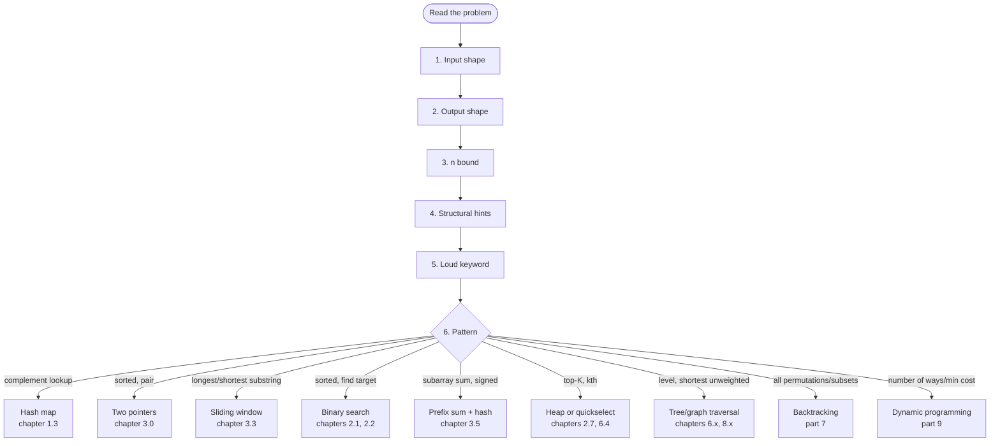

# Pattern recognition: the fastest skill to develop

Twenty patterns cover roughly 95% of new-grad FAANG coding-loop problems, and the top five alone cover about half. That number is the most useful thing you will read this week. It says the body of "interview problems" is finite, the work is bounded, and the candidate who can name the pattern in the first 90 seconds is solving a different problem than the one who can't.

Most candidates lose the loop in those 90 seconds. Ian Douglas, who has logged over 600 interviews on interviewing.io, reports that "jumping into code too soon" is the single most common failure mode he sees, and he prescribes the inverse rhythm: about five minutes on a high-level approach, about five on a mid-level design, then code.[^2] A candidate who burns half of that talking budget failing to map the problem to a known pattern has materially less time to write, debug, and explain. Pattern recognition is not the only interview skill. It is the one with the highest leverage per hour of preparation. The 95% coverage figure comes from a 2026 four-tier frequency ranking compiled across FAANG new-grad loops.[^1]

## How do I tell which pattern this is?

Run a six-step walk. Every problem. Out loud. The walk takes 30 to 60 seconds once it is internalized, and it is the same routine for Two Sum and for Median From Data Stream.

| Step | Question | Write down |
|------|----------|------------|
| 1 | What does the input look like? | array, sorted array, string, linked list, tree, graph, matrix, single integer, stream |
| 2 | What does the output ask for? | yes/no, count, min/max, index, an actual subset or sequence |
| 3 | What is `n` in the constraints? | `n ≤ 20`, `n ≤ 1000`, `n ≤ 10^5`, `n ≤ 10^6` |
| 4 | Are there structural hints? | sorted, unique, non-negative, contiguous, bounded value range |
| 5 | What single keyword in the prompt is loud? | "longest", "shortest", "all permutations", "next greater", "kth", "shortest path" |
| 6 | Which pattern matches the keyword + input + `n` combination? | one entry from the catalog |

*The 90-second walk. Steps 1 to 5 are reads; step 6 is a lookup against the catalog you carry in your head.*

## What does the 90-second walk actually look like?

Three problems. Same six steps. Three different patterns.

**A. Unsorted array of integers, target, return any two indices whose values sum to the target.** Input is an unsorted array. Output is a pair of indices. `n` lands around `10^4`. Not sorted; values may be negative. The loud phrase is "sum to a target" with "two." Two-pointers is wrong because the array is not sorted. Brute force is allowed by the bound but wasteful. Pattern: **hash-map complement lookup**. See [Hash maps](../part-1-linear-data-structures/03-hash-maps.md). Reference problem: [LC 1 — Two Sum](https://leetcode.com/problems/two-sum/).

**B. String `s`, return the length of the longest substring with no repeated character.** Input is a string. Output is a count. `n` up to `5 × 10^4`. The substring is contiguous; the alphabet is bounded. Loud keywords: "longest", "substring", and a *dynamic* constraint ("no repeating"). Pattern: **variable-size sliding window** with a hash map of seen counts. See [Sliding window: variable size](../part-3-pointers-window-prefix/03-sliding-window-variable.md). Reference: [LC 3 — Longest Substring Without Repeating Characters](https://leetcode.com/problems/longest-substring-without-repeating-characters/).

**C. Integer array, integer `k`, return the count of contiguous subarrays whose sum equals `k`.** Input is an integer array. Output is a count. `n` up to `2 × 10^4`. **Values can be negative.** Loud keywords: "contiguous subarrays" and "sum equals k."

Sliding window is the obvious wrong answer. The pattern only works when the running sum is monotone in window length, and negatives break that property: extending the window can shrink the sum below `k` mid-stride. Pattern: **prefix sum + hash**. See [Prefix sum + hash](../part-3-pointers-window-prefix/05-prefix-sum-hash.md). Reference: [LC 560 — Subarray Sum Equals K](https://leetcode.com/problems/subarray-sum-equals-k/).

C is the highest-value example here. Steps 1, 2, and 5 all point at sliding window. Step 4 is the override: *the values can be negative*. The candidate who skips step 4 ships a sliding-window solution that fails on the first negative-number test case.

## When does the loud keyword lie to me?

Whenever step 4 disagrees with step 5. The loud keyword is necessary; a secondary structural hint is what disambiguates. The eight cases below are the ones that bite hardest.

| The signal says | The candidate reaches for | The right answer is | Why |
|---|---|---|---|
| "Contiguous subarray with sum equal to `k`," values may be negative | Sliding window | Prefix sum + hash | Window expansion is no longer monotone in length |
| "Sorted array, find a target," but the array is rotated | Canonical binary search | Binary search variant | The `lo <= hi` template assumes a globally sorted array |
| "Top-K elements," very small `k` | Heap of size `k`, `O(n log k)` | Quickselect, `O(n)` average | Quickselect wins when `k` is small and worst-case latency does not |
| "Cycle in a linked list" | Hash set of visited nodes | Floyd's tortoise-and-hare | Hash set works; two-pointer is `O(1)` space and is what gets asked for |
| "Kth smallest in a BST" | Sort the BST and index | Inorder traversal with a counter | Sorting throws away the BST property |
| "Shortest path, weights all equal to 1" | Dijkstra | BFS | BFS is `O(V + E)` here; Dijkstra is overkill at `O((V + E) log V)` |
| "Range sum query," array mutated between queries | Static prefix sum | Fenwick tree or segment tree | Prefix sum requires `O(n)` rebuild on every update |
| "All subsets / all permutations," `n ≤ 8` | Iterative bit enumeration | Backtracking | Both work; backtracking generalizes to constraint problems with pruning |

> [!IMPORTANT]
> Step 4 is non-skippable. The override almost always lives in the structural hint, not the keyword.

## Why does interleaving beat grinding?

Most candidates practice the wrong way. They solve fifty sliding-window problems in a row, then fifty two-pointer problems, then fifty graph problems. Within-pattern fluency goes up. Pattern-identification reflex barely moves, because every problem in the block tells the candidate the answer in advance. The cognitive science term is *blocked practice*, and Rohrer and Taylor's 2007 study showed it produces worse transfer than mixed practice even though it feels easier in the moment.[^3]

Switch to **interleaved practice** after the first 50 problems. Every session, mix patterns in random order: sliding window, then BFS, then DP, then heap, then prefix sum. Force yourself to identify the pattern out loud before solving. Track first-60-second classifier accuracy as the metric, not problem volume. A 500-problem retrospective on LeetCode Discuss documents the inflection: returns flatten past about 300 problems, and the candidates who got offers credit pattern recognition, not problem count.[^4]

The honest timeline: about 8 to 12 weeks of deliberate practice to internalize the classifier to interview-grade reflex. There is no 90-second fix that does not require the practice underneath it.

## What do I actually do in the interview?

Four habits, in priority order.

**Verbalize the pattern before you type.** Within the first 90 seconds, say: "this is a [pattern name] problem because [signal]." The interviewer either nods (you're right and now you have buy-in) or asks a clarifying question (you're wrong and now you have a steer). Both outcomes beat silence. Douglas's #2 problem area is "communicating half-thoughts" — starting a sentence, finishing it silently, changing course.[^2] Naming the pattern out loud is the cheapest way to fix it.

**Run all six steps before committing.** Anchoring on the first pattern that "sort of fits" is the third most common failure mode: the candidate sees "contiguous subarray" and commits to sliding window in 10 seconds, then watches it produce wrong answers on negative inputs. The fix is mechanical. Steps 1 through 6, in order, every time, even when the answer feels obvious.

**Budget the talk time.** Five minutes on the high-level approach. Five on a mid-level design pass — pseudocode, invariants, `n` bound to expected complexity. Then code. Douglas's data on 600+ interviews shows the candidates who skip the first ten minutes are the ones who refactor under pressure and lose the round on problem-solving, not on syntax.[^2]

**Treat the 5 to 10% you cannot classify honestly.** The catalog targets the 90 to 95% case. The residue is design problems (LRU cache, median from a stream), mathematical reasoning (`pow(x, n)`, prime counting), and multi-pattern compositions (largest rectangle in a histogram is a monotonic stack inside a sliding-window-style pass). When step 6 returns nothing, say so, and ask the interviewer for a hint. "Not asking for help sooner" is Douglas's fifth-most-common failure mode; the candidates who ask early get unstuck and the candidates who don't run out the clock.[^2]

The cheat sheet is short enough to memorize. Sorted input, reach for binary search or two-pointers. `O(1)` lookup, reach for a hash table. Max or min over a substring, reach for sliding window or DP. Range sum or frequency, reach for prefix sum, BIT, or segment tree. Tree, reach for DFS or BFS. Graph, reach for DFS, BFS, or Union-Find. Top-K, reach for a heap or quickselect. Stream, reach for a heap or a custom design. All permutations, reach for backtracking.[^5]

[The first 5 minutes: clarifying questions](./01-clarifying-questions.md) is what runs immediately after the 90-second walk. Get the walk to reflex first. The rest of Part 14 builds on top of it.

## References

[^1]: Rafay Abbasi, *20 LeetCode Patterns Every New Grad Must Know Before Interviewing at FAANG (2026)*, Cracking the Tech Interview, May 2026. [dglearning.substack.com/p/20-leetcode-patterns-every-new-grad](https://dglearning.substack.com/p/20-leetcode-patterns-every-new-grad).

[^2]: Ian Douglas, *I've conducted over 600 technical interviews on interviewing.io. [interviewing.io/blog/ive-conducted-over-600-technical-interviews-on-interviewing-io-here-are-5-common-problem-areas-ive-seen](https://www.interviewing.io/blog/ive-conducted-over-600-technical-interviews-on-interviewing-io-here-are-5-common-problem-areas-ive-seen).

[^3]: Rohrer, D. and Taylor, K., "The shuffling of mathematics problems improves learning," *Instructional Science*, 35, 481-498, 2007.

[^4]: Kunal Sonawane, *I Solved 500+ LeetCode Problems, Was It Worth It?*, LeetCode Discuss, March 2025. [leetcode.com/discuss/post/6549966/](https://leetcode.com/discuss/post/6549966/).

[^5]: Sean Prashad, *Leetcode Patterns* (178 problems, 48 patterns), [seanprashad.com/leetcode-patterns/](https://seanprashad.com/leetcode-patterns/).
