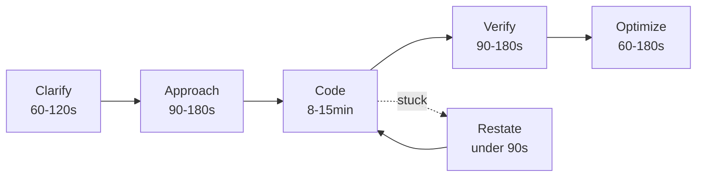
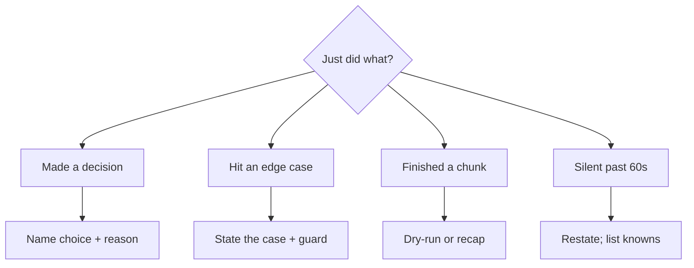

# Communicating during the interview

interviewing.io graded a hundred thousand mock interviews on three axes: communication, problem-solving, and code. They expected communication to round out the score. The data said the opposite. Candidates rated 4 on code, 4 on solving, and 2 on communication still advanced 96% of the time. Candidates rated 3 on code, 3 on solving, and 4 on communication were rejected roughly three times as often as the 4-4-2 group.[^1]

The lesson is sharp. Communication does not substitute for solving the problem. It corrects the signal so the interviewer can score what you are actually doing. If you stop doing the work, eloquent narration cannot rescue the round. If you do the work in silence, the interviewer has nothing to score.

## What does silence actually cost you?

Sixty seconds of silence in front of a blinking editor is the moment your interviewer's mental model goes dark. They cannot tell whether you are thinking, confused, or have gone blank. Hello Interview's published guidance to its interviewers, updated for the 2026 cycle, names this directly: a quick framing sentence "resolves the ambiguity" between those three states, and silence past about a minute is when the read drops.[^2] Logfetch's 2022 operating rule is the candidate-side restatement of the same point: during the interview, you should be either writing code or speaking.[^3]

Most readers go silent at the worst possible moment. They are reading the prompt, working through a corner case, or recovering from a wrong turn, and the cognitive load makes them stop talking. The interviewer reads that pause as "stuck." The candidate reads it as "thinking." Both are right, and only one of them is scoring you.

*The five-phase shape every coding round bends toward; the dotted return loop is the structured stuck-recovery path, capped near 90 seconds.*

## What do I say while I'm thinking?

Talk in chunks at decision points, not at every keystroke. The calibration Hello Interview recommends is one statement every 30 to 60 seconds during active coding, covering what you are doing and why.[^2] "I am going to type the word `function` now" is below the bar. "I am scanning left to right with a hash map keyed by character, because I need O(1) lookups for the duplicate check" is the bar.

Three moments do most of the work.

**State the brute force first, even if you already see the optimal.** Naming `O(n²) check all pairs, then a hash-map version at O(n) one pass` gives the interviewer the trade-off reasoning they are scoring. Skipping straight to the optimal looks like memorization. The Google L5 candidate write-up on LeetCode Discuss flags exactly this: share the brute force, explain why you are not using it, then move on.[^4]

**Commit to a direction before you write code.** "I am going with the hash map because n can be up to 10⁵, which makes the quadratic version too slow." That sentence buys you a green light from the interviewer and stops you from drifting between approaches mid-implementation. Tech Interview Handbook frames the same beat as stating the *Best Theoretical Time Complexity* out loud, which is a positive signal in its own right.[^5]

**Name the invariant before you write the loop.** "The window between left and right always contains only unique characters; expanding right preserves the invariant unless it hits a duplicate, at which point I advance left." This single sentence is the difference between "I memorized two pointers" and "I can prove this is correct." Code Intuition's 2025 stuck-recovery write-up calls the invariant the place where most freezes happen and the rung that reconnects the problem to a pattern.[^6]

## What if I genuinely go blank?

Bound the silence with one sentence and then diagnose, do not panic. The four-step recovery Code Intuition documents takes under 90 seconds: restate the problem, list what you know, name the transformation you need, find the invariant.[^6]

Out loud, that sounds like: "Let me restate. The input is an unsorted array. I need a pair of indices that maximizes some function of distance and minimum height. Brute force is all pairs, O(n²). I am looking for an invariant that lets me skip pairs without checking them."

The candidate who walks visibly through three steps before asking for a nudge looks fundamentally different from one who asks for a hint after two minutes of silence. Same question; opposite signal. The interviewer is scoring whether you noticed you were stuck and how fast you recovered, which is the same skill they want to see on the job.[^2]

## When do I shut up?

Over-narration is the mirror failure mode. The candidate who reads aloud what they are typing, "now I am writing for i in range, now I am incrementing left," has confused transparency with transcription. AlgoCademy lists rambling and speaking-too-fast as paired pitfalls, both for the same root reason: the candidate has interpreted "think out loud" as "say everything you think."[^7]

Two adjustments fix it. First, replace syntax narration with intent narration. "I am writing a for loop" gets cut; "I am scanning left to right to count occurrences" stays. Second, give yourself permission to be quiet for a bounded chunk. A single sentence, "I am going to implement the core loop in silence for about a minute, then come back to test it," turns potentially awkward silence into a reasonable pause. The interviewer now knows the silence is intentional, not stuck.

## How do I take a hint without losing momentum?

The interviewer's silence during your narration is not endorsement. Their interjection is signal. If they correct you, the worst possible move is to argue.

Pause. Look at the interviewer. Restate what they said in your own words: "So you are saying the array is not sorted, which breaks my binary search idea. Let me re-examine." Then incorporate it. Hint-taking that looks like collaboration scores higher than hint-taking that looks like surrender, and both score higher than ignoring the hint and burning ten minutes tuning around the underlying problem.[^2]

The pattern when your own example exposes a bug is the same. "Let me re-examine my assumption that the array is sorted. Going back to the prompt, it does not say sorted. That breaks the binary-search plan; I need a hash map." Self-correction without prompting is one of the strongest signals in the rubric.

## Does any of this change for AI-assisted rounds?

Meta and a growing number of companies now run coding rounds where the candidate uses an AI assistant in the editor. Hello Interview's 2026 guide for the format names the inflection: the interviewer can see your prompts and the AI's output, but they cannot see your decision-making unless you show it to them out loud.[^2] The rhythm shifts to "state your intent, prompt the AI, review the output out loud, then move on." The five phases above still hold; the talk-track just lands at "before each prompt" and "right after each AI response" instead of every 30 to 60 seconds of typing.

*A pocket decision tree for what to say next; every branch lands at one short sentence, never a paragraph.*

## What to do this week

Pick two of the five inflection points above — restate, brute-then-optimize, invariant, quiet-chunk announcement, dry-run — and force them into every problem you solve this week, talking out loud to an empty room. Record one or two reps a day on your phone and listen back the next morning. The first listen is uncomfortable. By rep ten the templates compress to two or three words and stop sounding scripted.

[Time and space complexity discussions](./03-complexity-discussions.md) is the deep dive into the optimize phase and the natural follow-up to this chapter.

## References

[^1]: Korolev, D. for interviewing.io (2022, last updated 2023), "Does communication matter in technical interviewing? We looked at 100K interviews to find out," [interviewing.io/blog/does-communication-matter-in-technical-interviewing-we-looked-at-100k-interviews-to-find-out](https://interviewing.io/blog/does-communication-matter-in-technical-interviewing-we-looked-at-100k-interviews-to-find-out).

[^2]: Hello Interview (2026), "Communication During AI-Enabled Interviews," [hellointerview.com/learn/ai-coding/fundamentals/communication](https://www.hellointerview.com/learn/ai-coding/fundamentals/communication).

[^3]: Logfetch (2022), "How to Talk During the Coding Interview: A Step-by-Step Guide," [logfetch.com/talking-during-coding-interview](https://logfetch.com/talking-during-coding-interview/).

[^4]: Anonymous candidate write-up on LeetCode Discuss (December 2024), "Lessons from My Google L5 Interview Experience," [leetcode.com/discuss/post/6147892/Lessons-from-My-Google-L5-Interview-Experience](https://leetcode.com/discuss/post/6147892/Lessons-from-My-Google-L5-Interview-Experience-Tips-and-suggestion/).

[^5]: Tay, Y., *Tech Interview Handbook*, "Top techniques to approach and solve coding interview questions" (last updated April 2026), [techinterviewhandbook.org/coding-interview-techniques](https://www.techinterviewhandbook.org/coding-interview-techniques/).

[^6]: Code Intuition (2025), "When You're Stuck in a Coding Interview," [codeintuition.io/blogs/stuck-in-coding-interview](https://www.codeintuition.io/blogs/stuck-in-coding-interview).

[^7]: AlgoCademy Blog, "How to Think Aloud Effectively During an Interview," [algocademy.com/blog/how-to-think-aloud-effectively-during-an-interview](https://algocademy.com/blog/how-to-think-aloud-effectively-during-an-interview/).
