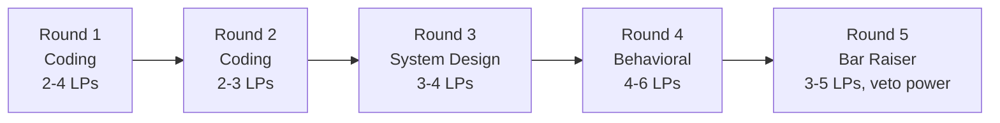

# Amazon Leadership Principles, briefly

At every other big-tech loop, the coding round is a coding round. The Amazon interviewer in your coding round is expected to write down two to four specific Leadership Principles, the evidence that surfaced for each, and a direct quote from you, before voting hire or no-hire. The chat at minute 5 and minute 50 of that round is part of the rubric. Arrive treating it as polite small talk and you fail a round you thought you passed.

This chapter is the primer: what the LPs are, where they came from, which surface most in coding rounds, and why "I'll just be excellent at the algorithm" misses the rubric Amazon is actually scoring. The deeper STAR-format narration patterns live in [Narrating Amazon LPs in interviews](./07-amazon-lps-narration.md). This page sets up the playing field; that one teaches you how to play.

## What is the LP round?

There is no "LP round" at Amazon. That's the trap.

The 16 Leadership Principles are scored inside every round of the loop, including the two coding rounds.[^1] Amazon's official candidate guidance is unambiguous on this: the LPs are "the foundation of every hiring decision," and technical roles "balance technical proficiency with Leadership Principles equally."[^2] A 2026 SDE coding slot looks roughly like this: 5 minutes of behavioral warm-up, 40 to 45 minutes on the technical problem with the interviewer scoring narration as it happens, then 10 minutes of behavioral follow-up and your questions. Every minute is graded.

*Per-round LP probe counts from candidate-reported 2026 loop feedback.[^1] Total LP coverage across the loop runs 10 to 12 of the 16 principles.*

## How many LPs come up per loop?

Roughly 10 to 12 of the 16, with overlap. A typical round probes 2 to 4 LPs, and the same LP often shows up in two or three different rounds because the rubric explicitly wants triangulated evidence rather than one anecdote.[^1]

The practical implication is the most common piece of bad advice in older prep: "prepare five Amazon stories." Five was right when the list had 14 LPs and rounds had less overlap. With 16 LPs and cross-round probing, a five-story bank runs out by Round 3, and the Bar Raiser, who reads the prior interviewers' debrief notes before walking in, will catch the reuse. Eight to ten stories tagged to two to four LPs each is the calibrated bank.

## Which LPs surface most in coding rounds?

Five, in this rough order: Customer Obsession, Earn Trust, Dive Deep, Insist on the Highest Standards, and Bias for Action.[^1]

These are the LPs that fit naturally inside the act of solving a coding problem. Customer Obsession surfaces when you ask a clarifying question framed by the user rather than the data structure. Earn Trust surfaces when you catch your own wrong complexity claim out loud instead of defending it. Dive Deep surfaces when the interviewer asks you to trace your code and you actually trace it value by value rather than saying "it should work." Insist on the Highest Standards surfaces when you run your own edge cases unprompted, not after being asked. Bias for Action surfaces when you name a calculated risk to optimize, with the fallback already on the board.

The other eleven LPs (Ownership, Have Backbone, the 2021 additions, and so on) are the territory of Round 4 and the Bar Raiser round, where you have 60 dedicated minutes for STAR-format storytelling. Don't try to perform Frugality during a sliding-window problem. There's nowhere for it to land.

One critical caveat: Bar Raisers in 2024 to 2026 have tightened on Customer Obsession and Ownership specifically.[^1] A candidate with brilliant Bias for Action stories but only generic Customer Obsession evidence is at higher rejection risk than they were three years ago, even with strong technicals.

## What are the 16 LPs?

The list, in Amazon's canonical order, with what each one tends to probe.[^3] The wording is paraphrased; the verbatim definitions live on Amazon's own page if you want them word-for-word.

1. **Customer Obsession.** Start with the customer and work backward. *Probed when:* clarifying questions, success-metric framing, edge cases that come from real user behavior.
2. **Ownership.** Long-term thinking; "that's not my job" is not in the vocabulary. *Probed when:* you describe a project where you fixed something outside your scope.
3. **Invent and Simplify.** Find new ideas, then strip them down. *Probed when:* you reduce a brute force to its essential idea instead of layering optimization on top.
4. **Are Right, A Lot.** Strong judgment; seeks disconfirming evidence. *Probed when:* you change your approach mid-round in response to a hint, without flailing.
5. **Learn and Be Curious.** Never done learning. *Probed when:* you bring up a recent thing you taught yourself unprompted in behavioral.
6. **Hire and Develop the Best.** Raise the bar with every hire. *Probed when:* manager-track and senior-IC loops; rare in coding rounds.
7. **Insist on the Highest Standards.** Defects don't get sent down the line. *Probed when:* you test your own code unprompted and refuse to declare done at "looks good."
8. **Think Big.** Thinking small is self-fulfilling. *Probed when:* system design, scope-of-impact stories.
9. **Bias for Action.** Speed matters; many decisions are reversible. *Probed when:* you take a calculated risk to optimize and name the fallback in the same breath.
10. **Frugality.** Constraints breed resourcefulness. *Probed when:* you avoided a heavyweight solution where a simple one worked.
11. **Earn Trust.** Listen, speak candidly, be vocally self-critical. *Probed when:* you correct your own mistake before the interviewer pushes on it.
12. **Dive Deep.** Stay connected to the details; audit frequently. *Probed when:* you trace your code value by value instead of asserting it works.
13. **Have Backbone; Disagree and Commit.** Challenge respectfully, then commit fully. *Probed when:* you push back on the interviewer's framing politely and stay coherent doing it.
14. **Deliver Results.** Right quality, on time, never settle. *Probed when:* you finish the problem with a working solution, even if it's not the optimal one.
15. **Strive to be Earth's Best Employer.** Safer, more productive, more diverse work. *Probed when:* manager-track loops; rarely in coding.
16. **Success and Scale Bring Broad Responsibility.** "We started in a garage, but we're not there anymore." *Probed when:* senior IC and above; ethical-tradeoff scenarios in design rounds.

If a prep source you're reading lists 14 LPs, it is older than mid-2021. Stop reading it.

## Why are there 16 and not 14?

Amazon added two principles on July 1, 2021, four days before Jeff Bezos handed the CEO role to Andy Jassy.[^4] The new ones were *Strive to be Earth's Best Employer* and *Success and Scale Bring Broad Responsibility*. The list had stood at 14 since 2015, when Amazon added *Learn and Be Curious*.[^5]

The 2021 additions were the only LPs that explicitly extend Amazon's accountability beyond customers and shareholders to employees and society. They were widely read as Bezos setting tone on the way out, after the Bessemer Alabama unionization vote in April of the same year.[^6] Whether you find that compelling or cynical is your business; what matters for the loop is that some prep content still references the 14-LP version. Treat any source older than July 2021 as out of date by default.

## Who's the Bar Raiser?

A trained interviewer, usually L6 or above, on a different team than the hiring manager, with explicit veto power over the panel.[^7] Amazon publicly confirmed in 2024 that there are over 10,000 active Bar Raisers and Bar-Raisers-In-Training across the company.[^7] The program was founded in 1999 by Rick Dalzell, then CIO, on the principle that every new hire should raise the bar of the team they join.

The Bar Raiser asks a different question than the rest of the panel. Other interviewers ask "would I want to hire this person." The Bar Raiser asks "would hiring this person raise or lower the engineering bar of Amazon as a whole."[^7] Their no-hire vote cannot be overridden. Four hire votes from technical interviewers will not save you if the Bar Raiser votes no.

You will almost never be told in advance which interviewer is the Bar Raiser. Community lore says it's often the most senior person on the loop and the one asking the most pointed follow-ups. The single worst thing you can do, the rubric is explicit on this, is calibrate your performance upward when you spot them. The Bar Raiser is trained to notice exactly that recalibration, and it reads as inauthentic.[^1]

The operational rule is short: treat every round identically. Narrate the same way in Round 1 as in Round 5. Tell stories with the same level of specificity. The Bar Raiser is not a separate test; they're the structured-rubric anchor of the same loop you've been in all morning.

## What to do this week

If your loop is more than a month out, pick eight to ten projects from the last three years and write a one-page STAR for each, tagging two to four LPs per story with at least two anchored to Customer Obsession and Ownership. Then read [Narrating Amazon LPs in interviews](./07-amazon-lps-narration.md) for the script templates and [Per-company tracks](./11-per-company-tracks-index.md) when it lands for the Amazon-specific problem distribution.

If your loop is this week, do one thing: pick five LPs (start with the coding-round five) and rehearse one story for each out loud, with a stopwatch. Two minutes of setup and action, 30 seconds of measurable result. If your "we" count is more than twice your "I" count in any story, the story will read as deflection to the Bar Raiser, and that gets noted in the debrief.[^1] Rewrite it as "I" until the ratio inverts.

The behavioral signal Amazon scores is judgment under pressure, not algorithm correctness alone. The candidates who get rejected with two optimal solutions are almost always the ones who solved silently. Narrate while you type. Speak while you trace. Leave 10 minutes for the follow-up. The interviewer cannot record evidence against an LP if you never gave them anything to quote.

## References

[^1]: Rafay Abbasi, "Inside the Amazon 2026 Loop: Rounds, Rubric, and What Each Interviewer Scores You On," *Cracking the Tech Interview* (Substack), May 7, 2026, [https://dglearning.substack.com/p/inside-the-amazon-2026-loop-rounds](https://dglearning.substack.com/p/inside-the-amazon-2026-loop-rounds).

[^2]: Brittany Bunch, "Your complete guide to the Amazon interview process," About Amazon (Workplace), April 8, 2025, [https://www.aboutamazon.com/news/workplace/amazon-interview-guide](https://www.aboutamazon.com/news/workplace/amazon-interview-guide).

[^3]: Amazon Jobs, "Leadership Principles" (canonical page), [https://www.amazon.jobs/content/en/our-workplace/leadership-principles](https://www.amazon.jobs/content/en/our-workplace/leadership-principles)

[^4]: Amazon Staff, "Amazon announces two new Leadership Principles," About Amazon Canada, July 1, 2021, [https://www.aboutamazon.ca/news/company-news/amazon-announces-two-new-leadership-principles](https://www.aboutamazon.ca/news/company-news/amazon-announces-two-new-leadership-principles)

[^5]: Annie Palmer, "Amazon sets a new tone as Jeff Bezos era comes to an end," CNBC, July 1, 2021. Documents the 2015 addition of *Learn and Be Curious* as the 14th LP.

[^6]: Eugene Kim, "Amazon updates leadership principles ahead of Jeff Bezos exit," Business Insider, July 1, 2021, [https://www.businessinsider.com/amazon-leadership-principles-updated-jeff-bezos-exit-2021-7](https://www.businessinsider.com/amazon-leadership-principles-updated-jeff-bezos-exit-2021-7).

[^7]: David Zapolsky, Russell Grandinetti, John Felton, Matt Garman, et al. (quoted), "Raising the bar: How Amazon hires for long-term growth and innovation," AWS Careers, 2024, [https://aws.amazon.com/careers/life-at-aws-amazons-bar-raiser-program-hiring-for-long-term-growth-and-innovation/](https://aws.amazon.com/careers/life-at-aws-amazons-bar-raiser-program-hiring-for-long-term-growth-and-innovation/).
