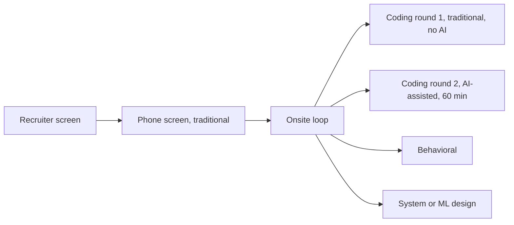
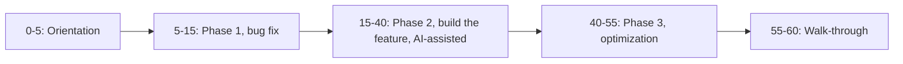

# Meta's AI round: the format

As of May 2026, Meta's onsite SWE loop replaces one of the two traditional coding rounds with a 60-minute round in which the candidate has an LLM open in the editor. The recruiter tells you which of your two coding rounds is the AI one a few days before the loop; you do not get to opt out. The format went from internal pilot to nearly every SWE candidate in roughly six months.

That speed is why this chapter has a date stamp at the top of every section. Pieces of what you are about to read will be wrong by next quarter. Treat the round's *shape* as durable and treat any specific name (a model, a problem, a duration in minutes) as recruiter-confirmable, not memorizable.

## What is the AI round?

It is a coding round where the AI is in the room as a tool, and the round is graded on how you use it. The official label, where Meta has used one publicly, is "AI-Enabled Coding Interview"; "AI round" is the candidate-side shorthand.[^3]

The round was first surfaced in a leaked internal Meta post in late July 2025 calling for mock candidates, framed two ways: that the future Meta engineer will work alongside an LLM, and that giving candidates an LLM makes Take-home-style cheating less effective.[^3] Pilot interviews ran in August 2025; the round entered active onsite use in October 2025. By April 2026 it was the default at most levels.[^1][^2] At E7 and above, candidates increasingly report only one coding round on the loop, and it is this one.[^2]

> [!IMPORTANT]
> The round is **not** a prompt-engineering test. Multiple guides converge on the same line: how well you prompt is barely scored. What is scored is meta-cognitive — when to delegate, when to verify, when to override the AI and write the line yourself.[^1][^4]

Where it sits on the loop, as of April 2026:

*Caption: as of April 2026, the loop pairs one traditional coding round with one AI round; the recruiter labels which is which ahead of time.*[^1][^2]

## How long is it, and what does the hour look like?

Sixty minutes, reported consistently across every named source between October 2025 and April 2026.[^1][^2][^4] That is fifteen minutes longer than the historical 45-minute coding round. The extra time pays for two things: an interviewer-led platform tour at the start (typically 5 to 6 minutes), and a larger codebase scope, because the problem is now multi-file rather than function-shaped.

Inside the 60 minutes, candidate reports converge on a three-phase structure:[^1][^4]

*Caption: the 60-minute window decomposes into orientation, debugging, primary implementation, optimization, and walkthrough; reaching phase 3 is reachable but not required for an offer.*[^1][^2][^4]

Phase 1 is a small bug planted in the existing codebase. Reported examples are not algorithmic: an int cast where a double was needed, an off-by-one, an inverted conditional. Some interviewers explicitly ban the AI on this phase; others leave it open. If the choice is yours, debug unaided. The early signal of independent debugging carries weight, and the time cost is low because the bug is small.[^1]

Phase 2 is the meat. You build a feature into the existing structure, or extend a partial implementation, or finish a debug that has more in it than phase 1's bug. Hello Interview's count is "120+ lines" for a passing implementation, and that line count is calibrated assuming you delegate mechanical work to the AI.[^1] Refusing to use the AI here is a recognised failure mode; you will run out of time.

Phase 3 is optimization on larger inputs. Test cases are tiered, and each tier exposes a different weakness in the phase 2 solution. Recognising what optimization the test data demands is the load-bearing skill. The AI helps with the implementation; it rarely supplies the insight.[^1] Multiple candidates have received offers without finishing phase 3.[^1][^2]

## What tools am I given?

The round runs in a specialized CoderPad environment with three panels: file explorer on the left, code editor in the middle, AI chat plus problem instructions on the right.[^1][^4] Code reruns on save; you pick the test runner from a dropdown. Meta sends candidates a CoderPad practice link before the loop, including a sample problem informally called "the puzzle". Multiple candidates report the puzzle is harder than the actual interview problem, which makes it useful for environment familiarisation rather than as a difficulty calibrator.[^1]

The AI chat panel can read every file in the project. It cannot edit your files. You type or paste every line yourself.[^1]

Supported languages, as of April 2026: Java, C++, C#, Python, Kotlin, TypeScript.[^1] Pilot-era reports from November 2025 noted a narrower list and one candidate having to fall back to Python because their preferred language was not supported.[^5] Confirm the list with your recruiter for your specific date.

## Which model do I get?

The model menu is the most volatile piece of the format. As of early 2026, candidates choose from a dropdown that has included GPT-5, GPT-4o mini, Claude Sonnet 4 and 4.5, Claude Haiku 4.5, Claude Opus 4, Gemini 2.5 Pro, and Llama 4 Maverick.[^1][^4][^6] Reports from January 2026 and April 2026 list overlapping but not identical menus.[^4][^7] Most recent candidate accounts default to Claude Sonnet 4.5; GPT-5 gets flagged as too slow under interview time pressure.[^1]

> [!WARNING]
> **The AI may be nerfed.** Multiple candidates have reported the assistant being noticeably worse in the live interview than in the practice environment — hallucinating on problems the same model handles cleanly outside, describing functionality without surfacing bugs, refusing to volunteer fixes.[^1][^5] The leading theory, corroborated across reports, is that Meta modifies behaviour through the system prompt: don't volunteer bug fixes, don't supply complete solutions unprompted, describe rather than diagnose. Plan accordingly. If you have practiced only against an unconstrained model, your live experience will feel slower and dumber, and you will lose minutes being surprised.

## How is it graded?

The same four competencies Meta uses to grade the traditional coding round, with one read against an AI-augmented surface:[^1][^7]

1. **Problem solving.** Do you understand the problem, pick the right algorithm, reason through edge cases?
2. **Code quality.** Is the code clean and maintainable, *and do you understand what the AI generated?*
3. **Verification.** Do you run code frequently, check AI output before moving on, test edge cases?
4. **Communication.** Are you narrating your process, explaining decisions, talking through what the AI provided?

Hello Interview surfaces an internal Meta line on this: candidates should use AI but must show they understand the code, explain its output, test before using it, and not prompt their way out of thinking.[^1] One recruiter quote, reported the same place: "you can be marked down if you use it as a crutch."[^1]

Two failure modes are penalized hard enough that every guide consulted names them as the fastest ways to fail. The first is pasting a block of AI code you cannot defend line by line; when the interviewer asks why a branch handles the empty case that way, you freeze.[^1][^8] The second is prompting the AI to solve the entire problem and then trying to operate the result like an oracle; the interviewer watches the chat panel and sees it.[^4][^7] Both are covered as patterns you can train against in [the prompting chapter](./09-meta-ai-round-prompting.md), and the failure modes themselves are catalogued in [Failures and red flags](./10-meta-ai-round-failures.md).

## When does this chapter expire?

Soon. Format volatility on this round is genuinely high, and five things change quarterly: the model menu, the active problem rotation (around nine problems as of April 2026), the senior-level structure, the degree of AI nerfing through the system prompt, and which roles the round applies to.[^1][^4]

What you should do with that. Treat the *shape* as durable: 60 minutes, three phases, AI in the editor, four-competency rubric. Treat every specific name as confirmable. When your recruiter sends the loop schedule, ask which model menu is current, which languages the platform supports, and whether phase 1 permits AI. None of those questions are awkward; recruiters expect them on this round and would rather answer in advance than watch the candidate burn five minutes orienting in the editor.

The companion chapters carry the operational play. [How to prompt inside the round](./09-meta-ai-round-prompting.md) is the workflow, including the pipelining trick that buys most of your time back. [Failures and red flags](./10-meta-ai-round-failures.md) is the catalogue of mistakes other candidates have already made.

## References

[^1]: Evan King (Hello Interview, ex-Meta Staff Engineer), "Meta's AI-Enabled Coding Interview: How to Prepare", April 2026, [hellointerview.com/blog/meta-ai-enabled-coding](https://www.hellointerview.com/blog/meta-ai-enabled-coding).

[^2]: Rafay Abbasi (Cracking the Tech Interview), "Meta's New Coding Round Uses AI, Here's Exactly How to Handle It", April 29, 2026, [dglearning.substack.com/p/how-to-prepare-for-the-meta-ai-assisted](https://dglearning.substack.com/p/how-to-prepare-for-the-meta-ai-assisted).

[^3]: Wired, "Meta Is Going to Let Job Candidates Use AI During Coding Tests", July 29, 2025, [wired.com/story/meta-ai-job-interview-coding](https://www.wired.com/story/meta-ai-job-interview-coding).

[^4]: Rafay Abbasi (Cracking the Tech Interview), "Inside Meta's New AI-Enabled Coding Round: What Changed and How to Prep", April 17, 2026, [dglearning.substack.com/p/inside-metas-new-ai-enabled-coding](https://dglearning.substack.com/p/inside-metas-new-ai-enabled-coding).

[^5]: InterviewDB, "My First-Hand Experience with Meta's New AI-Enabled Interview", November 18, 2025, [interviewdb.io/guides/meta-ai-enabled-interview](https://www.interviewdb.io/guides/meta-ai-enabled-interview).

[^6]: Coditioning, "Meta's AI-Enabled Coding Interview: Questions + Prep Guide", updated January 30, 2026, [coditioning.com/blog/13/meta-ai-enabled-coding-interview-guide](https://www.coditioning.com/blog/13/meta-ai-enabled-coding-interview-guide).

[^7]: Githire B. Wahome (interviewing.io, ex-Meta), "Using AI in Meta's AI-assisted coding interview (with real prompts and examples)", April 2026, [interviewing.io/blog/how-to-use-ai-in-meta-s-ai-assisted-coding-interview-with-real-prompts-and-examples](https://interviewing.io/blog/how-to-use-ai-in-meta-s-ai-assisted-coding-interview-with-real-prompts-and-examples).

[^8]: Isabel (Leetcode Wizard), "Meta's AI-Enabled Coding Interview: Everything You Need to Know to Prepare", April 30, 2026, [leetcodewizard.io/blog/metas-ai-enabled-coding-interview-everything-you-need-to-know-to-prepare](https://leetcodewizard.io/blog/metas-ai-enabled-coding-interview-everything-you-need-to-know-to-prepare).
