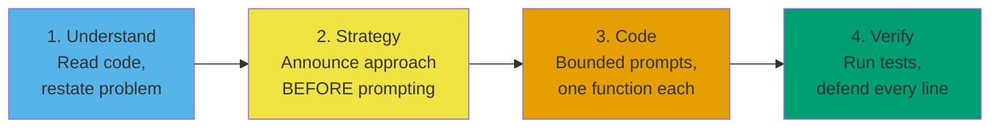

# Meta's AI round: prompting tactics

Coditioning publishes Meta's evaluation rubric verbatim. The first sentence is the line every candidate misses: "This is not an interview about how well you use AI. The AI is more of a tool to help you demonstrate your coding skills more efficiently. You're being evaluated on problem-solving, code quality, and verification, not prompt engineering." Meta rolled this round out to nearly every SWE candidate between October 2025 and Q1 2026, and the failure pattern is already stable: candidates who treat the assistant as a solver fail; candidates who treat it as a faster pair-programmer pass.

The chapter is the prompting hierarchy that produces the second behavior. It is not a list of prompts to memorize. It is the order you do things in.

## What's actually being graded?

Four competencies, the same four Meta uses in its traditional coding rounds: Problem Solving, Code Quality, Verification, Communication.[^1][^3] None of them is "prompt engineering." The rubric quoted above is the source of truth.[^1] What changes in the AI round is *how the rubric reads your prompts*: each prompt is a window into your reasoning, and the interviewer scores the reasoning, not the output. The round was introduced in October 2025 and reached nearly every SWE candidate by Q1 2026; at E7 and M2 levels, it is the only coding round.[^2]

The single most predictive hire signal across published candidate reports is **announcing your algorithm to the interviewer before prompting the AI**.[^3][^4] The candidate who said "I'll use a trie because the wordlist is large but each word is short" and *then* asked the AI for a trie skeleton scored well. The candidate who pasted the problem into the chat and asked "what algorithm should I use?" scored the rubric line "cannot think independently" and was rejected.[^3]

The hierarchy that lands the right signal has four phases, applied in order regardless of whether the scenario is build-a-feature, extend-partial-code, or debug-broken-implementation.[^5]

*The four-phase hierarchy. Phase order matters more than phase content; inverting it is the most common rejection pattern.[^3][^4]*

Minutes 0 to 10: Understand. Read the codebase, restate the problem, locate failing tests. AI usage minimal. Minutes 10 to 15: Strategy. Tell the interviewer your plan, then maybe ask the AI to compare it to one alternative. Minutes 15 to 40: Code. Prompt for one function at a time and read every line before pasting. Minutes 40 to 60: Verify. Tests after every change, edge cases by hand, defend the code aloud.

## What should I prompt before I prompt for code?

Two prompts buy you most of the round's value before you write a line.

The first is the **codebase walkthrough**. The round's defining feature is multi-file code you've never seen.[^4][^5] You have ten minutes to make sense of three to six files. Reading them top to bottom does not fit in that budget. Pasting one file into the chat with "Explain this step-by-step. Identify the class responsibilities and any edge cases the code already handles. Do not suggest changes" compresses fifteen minutes of reading into three minutes of guided reading.[^5] The asymmetric risk profile is the point: an explanation prompt cannot put broken code in your editor. A code prompt can.

The second is the **constraint surface**. Before you write a plan, ask: "Here is the problem statement. Here is the file structure. What constraints, edge cases, or assumptions in the existing data models am I likely missing?" The AI will list four to six items. Cross-reference each one against the actual code. Discard anything not grounded in the files; the AI hallucinates assumptions.[^4]

These two prompts share a structural property worth naming. They ask the AI to **describe**, not to **modify**. Description prompts are how you compress reading time. Modification prompts are how you write code. Mixing them up, by asking the AI to "fix" a file you haven't yet read, is how candidates lose Phase 1.

## When does the LLM make me look worse?

Four anti-patterns show up in every published candidate post-mortem.

**Asking the AI to solve the problem.** The recruiter-facing line is explicit: "you can be marked down if you use it as a crutch."[^3] "How should I solve this?" is the prompt logged as "cannot think independently."[^3] The interviewer at interviewdb.io told the candidate: "Try to figure it out yourself first. Follow the test failures."[^6] You propose; the AI validates. Never the inverse.

**Pasting unreviewed output.** The AI's output is fluent code that compiles. Plausibility is not correctness. A 2022 study found roughly 40% of AI-generated code had security vulnerabilities if accepted as-is;[^7] that ratio has not collapsed in the three years since. Coditioning's rhythm is "prompt, review, run, confirm, move forward," and skipping any step is a red flag.[^1] Treat the AI like a brilliant new hire whose PR you wouldn't merge without reading.[^8]

**The one-shot mega-prompt.** "Implement the entire word game with these ten requirements" returns 200 lines you cannot review under interview pressure. Compounded errors are worse: "if step 2 is wrong, steps 3 to 10 are wrong too."[^1] Three to five small prompts, each verified, beats one giant prompt every time. If the conversation drifts past prompt five, start a fresh prompt with the current state pasted in. Reset the context window to your ground truth.

**Vague prompts.** "Fix this." "Solve this problem." "Write a function to filter sessions." The AI returns 40 lines of generic code that takes longer to edit than to write yourself, or it returns code that doesn't match your codebase's classes.[^9] The strong-prompt fix is to name the function signature, the input/output types, the constraint, and the existing class to use.[^9] Specificity is the single biggest predictor of whether the AI helps you or sinks you.[^1][^9]

> [!IMPORTANT]
> The in-interview AI is often noticeably weaker than the model you practiced against. Multiple candidates have reported the live environment as "significantly less helpful": slower latency, more hallucinated method names, more confident wrong answers.[^3][^4] Build the habit of verifying everything in your practice sessions. Don't rely on a model that turns out to be running at half strength on the day.

## How do I show I understand the code it gave me?

Two techniques, both small, both visible to the interviewer.

The first is **pipelining**. While the AI generates, you do something else: review the previous chunk, narrate the next step to the interviewer, or pre-write the next prompt.[^4][^9] Coditioning calls it "AI drafts function X while you review function X-1."[^1] You are never idle, and the interviewer sees you reading and thinking on every turn. Idle time during AI generation is the silent killer of the Communication score.

The second is the **dry-run trace**. After an implementation lands in the editor, ask the AI: "Trace this function line by line with input `[concrete small example]`. State the value of every variable after each line." Then read the trace and mentally run the same input. Where the AI's trace diverges from your mental model, you have either a real bug or an AI hallucination — both are worth investigating before you run the test.[^5] The trace is a verification step that doubles as a teaching demo to the interviewer: you are explaining the code you didn't write, in your own words.

Defend every line. If you cannot say what a line does and why it's there, delete it. The E5 candidate who got an offer described her exact rule: "I would tell the AI, let's just create the core logic first. I would say, for now I want to start from a very basic single function so I can review it easily."[^3]

## What's the highest-leverage prompt nobody uses?

Once between strategy and implementation, ask the AI:

> "I plan to solve this with `[your approach in three sentences]`. List the four most likely failure modes: missed edge cases, performance traps, incorrect assumptions, or constraint violations. Do not propose a different approach."

This converts the AI from a code generator (where it is fallible) into an adversarial reviewer (where it is reliably useful). Its pattern library covers thousands of "approach X fails on input Y" examples; framing the question as "find the failure modes" taps that knowledge without inviting the AI to redesign your solution. It also produces an artifact the interviewer hears you respond to, like "the AI flagged off-by-one at the boundary; here's how I'm guarding it," which scores Communication explicitly.

Use it once, between strategy announcement and implementation. Twice maximum, if scale-related stress tests appear in Phase 3.

## What to do this week

Pick three problems that look like Meta's pool: one BFS-on-grid (LC 200 *Number of Islands*), one backtracking-on-grid (LC 79 *Word Search*), one hash-target (LC 1 *Two Sum*).[^10] Set a thirty-minute timer. Before any code, run four prompts in order: clarify constraints, compare two approaches, implement one function, dry-run with a small input. Narrate each prompt aloud as if the interviewer were watching. Run the LC tests last.

The goal is not to pass the tests. The goal is to feel the four-phase hierarchy with a real clock running, so that on the day, the order is automatic and the prompts are bounded.

[Pattern recognition: the fastest skill to develop](./00-pattern-recognition.md) is the prerequisite for the strategy phase — you cannot announce an algorithm you cannot name. The companion chapter on the round's failure modes catalogs the rejection patterns this hierarchy is designed to avoid.

## References

[^1]: Coditioning, "Meta's AI-Enabled Coding Interview: Questions + Prep Guide," 2026-01-30, [coditioning.com/blog/13/meta-ai-enabled-coding-interview-guide](https://www.coditioning.com/blog/13/meta-ai-enabled-coding-interview-guide).

[^2]: The round was introduced in October 2025 and rolled out to nearly every Meta SWE candidate by Q1 2026; at E7 and M2 levels it is the only coding round.

[^3]: Evan King (ex-Meta Staff Engineer), "Meta's AI-Enabled Coding Interview: How to Prepare," hellointerview.com, 2026, [hellointerview.com/blog/meta-ai-enabled-coding](https://hellointerview.com/blog/meta-ai-enabled-coding).

[^4]: Isabel, "Meta's AI-Enabled Coding Interview: Everything You Need to Know to Prepare," LeetCodeWizard blog, 2026-04-30, [leetcodewizard.io/blog/metas-ai-enabled-coding-interview-everything-you-need-to-know-to-prepare](https://leetcodewizard.io/blog/metas-ai-enabled-coding-interview-everything-you-need-to-know-to-prepare).

[^5]: Githire B. Wahome (ex-Meta), "Using AI in Meta's AI-assisted coding interview (with real prompts and examples)," interviewing.io blog, 2025-2026, [interviewing.io/blog/how-to-use-ai-in-meta-s-ai-assisted-coding-interview-with-real-prompts-and-examples](https://interviewing.io/blog/how-to-use-ai-in-meta-s-ai-assisted-coding-interview-with-real-prompts-and-examples).

[^6]: InterviewDB, "My First-Hand Experience with Meta's New AI-Enabled Interview," 2025-11-18, [interviewdb.io/guides/meta-ai-enabled-interview](https://www.interviewdb.io/guides/meta-ai-enabled-interview).

[^7]: Pearce et al., 2022 study cited in Wahome, op. cit. [^5], finding approximately 40% of AI-generated code samples contained security vulnerabilities when accepted without review.

[^8]: Anthropic, "Prompting best practices" (Claude 4.5 / 4.6 / Sonnet 4.6), Anthropic developer documentation, 2026, [docs.anthropic.com/en/docs/build-with-claude/prompt-engineering/claude-4-best-practices](https://docs.anthropic.com/en/docs/build-with-claude/prompt-engineering/claude-4-best-practices).

[^9]: Rafay Abbasi, "Meta's New Coding Round Uses AI — Here's Exactly How to Handle It," Cracking the Tech Interview (Substack), 2026-04-29, [dglearning.substack.com/p/how-to-prepare-for-the-meta-ai-assisted](https://dglearning.substack.com/p/how-to-prepare-for-the-meta-ai-assisted).

[^10]: Each problem is a Meta-pool staple confirmed via multiple secondary sources. Solo practice only; this chapter is foundation/framework-exempt and ships no chapter mastery ladder. [LC 200 — Number of Islands](https://leetcode.com/problems/number-of-islands/)
