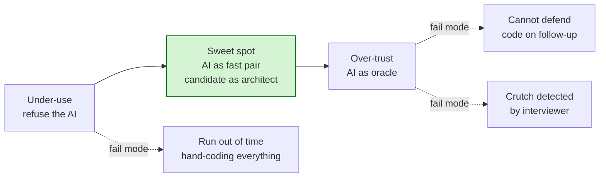

# Meta's AI round: common failures

An E7 candidate told Hello Interview in late 2025 that Claude Sonnet "worked brilliantly in practice but gave wrong answers repeatedly during the interview" on a maze problem the model had handled cleanly the day before. Same model, same candidate, same prompts. The difference was the interview itself: Meta is widely reported to harden the AI's behavior through a system prompt that suppresses direct bug-pointing and discourages unprompted full solutions. His prep had been "AI will catch the bug." When the AI stopped catching the bug, he had no fallback.

A different candidate, in the same source, froze when the interviewer asked why one branch handled the empty case the way it did. The code worked. The candidate could not defend the line. Indistinguishable, from the rubric's perspective, from cheating.

These are not the same failure. Both are this chapter.

## Why does this round fail differently?

In a classic Meta coding round, you fail by getting the algorithm wrong or by running out of time. Both still kill you here, but the AI panel introduces a class of failure that does not exist on a blank screen: **the AI makes you feel productive while you are failing**.[^3]

You paste the problem. You get two hundred lines back. The code compiles. Happy-path tests pass. The round looks fine right up until minute 50, when the interviewer asks why the priority queue is initialized with that comparator, and your honest answer is that you did not write that line.

The Meta-internal rule, quoted in Hello Interview's evaluation summary, is short: "should use AI, but need to show you understand the code. Explain the output. Test before using. Do not prompt your way out of it."[^1] Four sentences. Each one corresponds to a failure mode below.

## What's the most common failure mode?

Over-trust. By a wide margin.

Across the 2025-2026 candidate corpus that Hello Interview, interviewing.io, and CoderPad's rubric draw from, roughly 60 to 70 percent of the negative-feedback patterns cluster on the same axis: the candidate treats the AI as an oracle.[^1] [^3] [^9] They prompt for the whole solution. They paste without reading line by line. They run tests once, at the end. They cannot, when asked, walk through a specific branch as if they wrote it.

The named version of this in published feedback is blunt. A candidate at Rippling was told they "relied too heavily on AI even though their initial approach was correct."[^3] The plan was right. The execution path was the problem. The interviewer watched the AI drive while the candidate watched the AI. A Meta candidate received nearly identical feedback in 2025: "appeared to rely heavily on AI, which impacted the quality of their solution."[^1] The code may even have passed. The rubric flagged the pattern.

mathRules, an E5 Product candidate who posted on LeetCode Discuss in November 2025, lived the textbook case.[^5] Tight prompt. Claude Haiku produced working code in one or two shots. Unit tests passed. The interviewer asked for time complexity. Exponential, the candidate said correctly. Asked for a faster solution. Could not produce one. The interviewer told them, after, that the problem was NP-complete and "most candidates do not notice that apparently."[^5] AI delivered correct code. The candidate accepted it without grasping its asymptotic behavior. Rejection.

Note what mathRules did *not* do wrong: the prompt was good, the AI was directed, the tests ran. The failure was downstream, in the handoff: the candidate took the model's output as the answer, rather than as one option to evaluate against the constraints of the problem.

## How does a "cheating" signal get flagged?

Three patterns. None of them are the candidate copying answers.

**You cannot defend a specific line.** The interviewer points at branch four — the empty-case handler, the off-by-one guard, the dictionary fallback — and asks why it's written that way. You wrote the prompt that produced it; you did not write it. The freeze is the signal.[^7] An IGotAnOffer coach who has interviewed three thousand-plus candidates calls this the rubric red flag: "silently pasting AI output is a red flag and could get you a low score for technical communication."[^10]

**Long silent stretches while you're prompting.** At E4 a sixty-second pause reads as thinking. At E7 or M2 the same pause reads as "no working hypothesis," because the senior bar is graded on whether you direct the round, not on whether you eventually arrive somewhere.[^1] [^7] The cure is narration before the prompt. *"I'm going to ask the model to draft the parser, then I'll review the edge cases against our test set"* is the shape; narration after the fact is not.

**Architecture drift.** The AI suggests a data structure that doesn't fit the existing codebase. You take it. The follow-up — *"how would you do this without `OrderedDict`?"* — finds the gap immediately. The candidate let the model choose the shape of the solution, and the shape was wrong.[^3] [^8]

The shared mechanism is that interviewers grade on **control over the AI**, not on whether the AI was used. CoderPad's industry rubric scores candidates from 1 to 5 on this axis: "AI driving while the candidate reacts" is a 1 to 2; "deliberate, goal-directed use" is a 3 to 4; rejecting AI suggestions outright when they're wrong is the top band.[^9] A candidate who never rejects an AI suggestion in 60 minutes scores in the bottom band by definition, even if every suggestion happened to be correct.

## What if the LLM gives a wrong answer I don't catch?

This is the failure the V1 candidate ran into. The AI in the actual interview is, per multiple candidate reports, deliberately weakened.[^1] Suppressed bug-pointing. No unprompted full solutions. Hallucinated method names that don't exist in the codebase. Wrong direction-vector arrays on grid problems. The model that one-shotted your practice problem yesterday will not one-shot the same problem today.

Two failure modes follow from this. The first is the panic mode V1 fell into: the candidate had built no fallback, and when the AI stopped catching errors, the candidate started trying to write the solution by hand thirty minutes in, with no plan and no time. The second is quieter and more common: the candidate accepts a hallucination because they did not read what they pasted, and the hallucination compounds. By minute 50, several tests are failing in cascading ways that nobody can reconstruct, and there is no time to fix them.[^3]

Hello Interview's guidance for this is mechanical: prompt, review, run, confirm, move on.[^1] The "run" is the load-bearing word. Fewer than five test runs in a 60-minute round is itself a flagged signal in the evaluation rubric.[^3] If the AI drifts, you catch it on the next run, not at minute 50.

*The two-pole failure surface. Under-use is rarer but real at senior bar; over-trust accounts for roughly 60 to 70 percent of the negative-feedback corpus.[^1] [^3] [^9]*

## Why doesn't "I solved it" feel like solving it?

Process signal. The thing the candidate cannot see from inside the room.

An anonymous IIT Kanpur candidate posted their full Bangalore SWE Product loop on LeetCode Discuss in November 2025: friendly interviewer, helpful environment, partially-built game scenario, missing logic filled in, optimization landed.[^6] Self-verdict: leaning Hire to Hire. Rejection landed ten to twelve days later, no specific feedback.

The candidate's reconstruction is a useful artifact, because nothing in their write-up is obviously wrong. The code worked. The conversation went well. What they could not see was what the interviewer was scoring: how directed each AI prompt was, whether each output was reviewed before paste, how often the candidate verified, whether the candidate ever rejected a suggestion outright.[^9] Those are visible to the rubric and invisible to the candidate. You can pass on output and fail on process.

The diagnostic, which works on your last practice session as well as on a real round, is a five-question scan:

1. **Codebase first.** How many minutes did you spend reading the existing files before you opened the AI chat? Under five is the V2 / V3 pattern.[^1] [^4] Five minutes of reading saves fifteen minutes of debugging.[^1]

2. **Defendable lines.** Could you, right now, walk through every branch of your final solution as if you wrote it, with empty-case and large-input behavior named? If not, you have failed the inevitable follow-up in advance.[^7]

3. **Run cadence.** How many times did you click run between the start of phase 2 and the end of the session? Under five in a 60-minute round is a flagged signal.[^3] The rhythm interviewers want is prompt, review, run, confirm, move on.[^1]

4. **Rejection.** Did you ever discard an AI suggestion outright — not refine, not re-prompt, but throw it away and write something different yourself? Candidates who never reject an AI output score in the bottom band on the "critical evaluation" axis.[^9]

5. **No-AI fallback.** If the AI had been removed at minute 20, would you still have finished phase 2? If the answer is no, you are in the V1 pattern, and the AI nerf in the actual interview is the trap that springs.[^1]

Most candidates score badly on three of the five on first pass. The five questions are the chapter's payoff: name the failure modes specifically enough that you can self-correct in the next practice session, before the loop.

## What to do this week

Run the five questions against your last AI-assisted practice session. Pick the worst of the five. Fix that one in your next session.

Then practice with the AI deliberately weakened. Use a smaller model. Disable extended thinking. Set a 60-minute timer on a problem you have not seen, and write at least one core function by hand before you prompt for anything.[^7] The goal is not to refuse the AI. It is to find out whether you can still finish phase 2 without it, because the version of the AI that shows up to your interview is closer to the weakened one than to the one you've been practicing against.[^1]

This format is six months old at the time of writing.[^2] The rubric is still being calibrated. The published candidate corpus is small enough that one strong report shifts the consensus. Treat what's here as the best read of the 2025-2026 evidence, not as settled doctrine, and re-check the source community before your loop.

## References

[^1]: Evan King (former Meta staff engineer), "Meta's AI-Enabled Coding Interview: How to Prepare," Hello Interview, accessed 2026-05-20. Based on author conversations with E5 to E7 and M2 candidates after the round; multiple verbatim candidate quotes. <https://www.hellointerview.com/blog/meta-ai-enabled-coding>.

[^2]: Rafay Abbasi, "The Four FAANG Interview Rounds That Did Not Exist in 2023," Cracking the Tech Interview, April 2026. Cited for the October 2025 rollout date and the Q1 2026 broad-rollout claim. <https://dglearning.substack.com/p/the-four-faang-interview-rounds-that>.

[^3]: Hello Interview, "Introduction to AI-Enabled Coding Interviews" (cross-company evaluation guide covering Meta, Shopify, LinkedIn, Canva, Rippling), accessed 2026-05-20. Cited for the four-axis evaluation rubric, the "feels productive while failing" framing, and the Rippling negative-feedback vignette. <https://www.hellointerview.com/learn/ai-coding/overview/introduction>.

[^4]: "My First-Hand Experience with Meta's New AI-Enabled Interview," InterviewDB, 2025-11-18. Anonymous candidate first-hand report; the AI-first reflex pattern. <https://www.interviewdb.io/guides/meta-ai-enabled-interview>.

[^5]: mathRules, "[USA] Meta AI Coding Round," LeetCode Discuss post, 2025-11-08. E5 Product loop; the NP-complete vignette and the interviewer-side observation about LLM-as-crutch. <https://leetcode.com/discuss/post/7335102/usa-meta-ai-coding-round-by-mathrules-z3bd/>.

[^6]: Anonymous user, "My Full Meta Interview Experience (Sept-Oct 2025) - Rejected," LeetCode Discuss, 2025-11-18. Bangalore SWE Product loop; self-graded Hire, rejected with no specific feedback. <https://leetcode.com/discuss/post/7357112/my-full-meta-interview-experience-sept-o-6bik/>.

[^7]: Rafay Abbasi, "Meta's New Coding Round Uses AI: Here's Exactly How to Handle It," Cracking the Tech Interview, April 2026. The minute-by-minute walkthrough; the "candidate freezes" pattern; the senior-bar (E7 / M1) calibration. <https://dglearning.substack.com/p/how-to-prepare-for-the-meta-ai-assisted>.

[^8]: Githire B. The ten-rule playbook and the multi-file project framing. <https://interviewing.io/blog/how-to-use-ai-in-meta-s-ai-assisted-coding-interview-with-real-prompts-and-examples>.

[^9]: CoderPad, "5 Skills of the Future Developer: A Framework for Evaluating AI Fluency," 2026-04-02. The industry rubric (5 skills, 5-point scoring); the State of Tech Hiring 2026 finding that catching and fixing AI mistakes is the top recruiter signal. <https://coderpad.io/blog/interviewing/5-skills-of-the-future-developer-a-framework-for-evaluating-ai-fluency/>.

[^10]: Kannika Peña with Coach John (Meta engineering manager who has interviewed 3,000+ candidates), "Meta Coding Interview (questions, AI-enabled round, prep)," IGotAnOffer, last updated 2026-02-04. The official Meta AI-round structure (Part 1 explore/fix, Part 2 implement, Part 3 extend/improve); the "silently pasting AI output is a red flag" rubric language. <https://igotanoffer.com/en/advice/meta-coding-interviews>.
