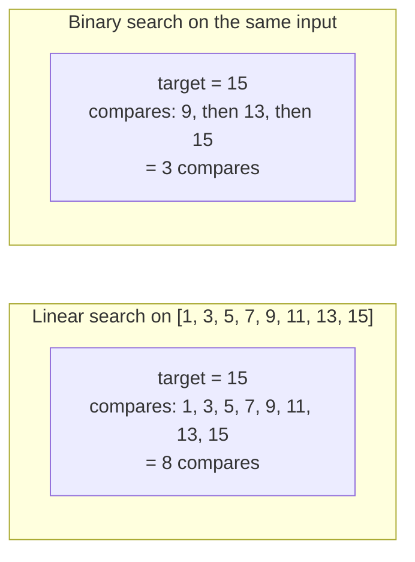

# Linear search and what it's good for

The cleanest first-pass interview question is six lines long: walk an array, return the index of the first element equal to a target, or `-1` if there isn't one. That is linear search. It is the algorithm you reach for whenever the input has no exploitable structure (no sortedness, no precomputed hash, no index) and you only need to ask "where is X?" once.

Two later chapters in this part will spend their breath earning a logarithmic factor over what you write here. Linear search is the baseline they have to beat. Skip past it as the dumb default and you will not understand what binary search and hash-table lookup actually buy you, because you will not have a number to compare against.

The chapter's spine fits in one sentence. **Linear search is always available, and it is never optimal when the input is sorted.** Its first half is the strength; the second half is the bridge to [Binary search: the canonical version](./01-binary-search-canonical.md).

## When linear search is the right answer

Three input shapes make linear search the correct choice rather than a placeholder for something better.

The first is an **unsorted input**. If `nums` has no exploitable structure, any algorithm that returns "absent" without inspecting some position `j` cannot rule out the case where the target is sitting at `j`. An adversary will plant the target there, and the algorithm will return the wrong answer. Theta(n) reads is the information-theoretic floor for membership testing on unstructured input. Every later algorithm in this part either pays preprocessing for that structure (sort, hash, build) or reaches into a different model entirely.

The second is a **one-shot query**. If you scan once and never again, the build cost of any indexing structure dominates the win. A hundred-million-element array searched a single time runs faster as a straight scan than as "build a hash set, query once, throw it away." Sedgewick and Wayne are explicit about the trade in *Algorithms* 4e §3.1: Proposition A bounds sequential search at N comparisons, Proposition B bounds binary search in an ordered array at lg N + 1 comparisons.[^1] The lg N + 1 wins only when amortised against the cost of getting the array sorted in the first place.

The third is **n is small**. Branch-prediction and cache locality both favour straight scans on tight data. The crossover where binary search starts winning sits around n = 30 to 50 on modern hardware; below that, the loop wins despite its asymptotic loss. Production sort routines exploit this directly. Java's dual-pivot quicksort, Go's `pdqsort`, and Rust's `slice::sort` all switch to insertion sort (a relative of linear scan) below a fixed threshold around 16 to 32 elements.

```mermaid
flowchart TD
    A[Need to find target in nums] --> B{Is nums sorted?}
    B -- Yes --> D[Binary search<br/>O(log n)<br/>chapter 2.1]
    B -- No --> C{Many queries against the same data?}
    C -- "No (one-shot)" --> E[Linear search<br/>O(n)<br/>this chapter]
    C -- "Yes (many)" --> F{Worth the build cost?}
    F -- Yes --> G[Hash set or sort once<br/>O(1) or O(log n) per query]
    F -- "No (data churns)" --> E
```

*Caption: Linear search wins when the input is unsorted and the query is one-shot. Binary search needs sortedness; hash-table lookup needs a build phase. Both invest preprocessing in exchange for fewer comparisons per query.*

The pattern signal you are looking for in interview problems is therefore **unsorted input, plus a one-shot query, plus per-step state that fits in a few variables**. The instant any of those breaks, look at chapter 2.1's binary search or the [Hash maps](../part-1-linear-data-structures/03-hash-maps.md) chapter for the upgrade path.

## The algorithm

Knuth treats linear search at length in *The Art of Computer Programming* Volume 3 §6.1 ("Sequential Searching"), introducing it as Algorithm B (basic), with two cousins: Algorithm Q with a sentinel, and Algorithm T for ordered tables.[^2] CLRS Exercise 2.1-3 frames the same algorithm as the textbook warm-up for loop-invariant proofs.[^3] The pseudocode is six lines:

```text
function linear_search(A, v):
    for i = 0 to A.length - 1:
        if A[i] == v:
            return i
    return -1
```

The loop invariant is **at the start of each iteration, the subarray `A[0..i-1]` does not contain `v`**. Initialisation holds vacuously: the empty prefix contains nothing. Maintenance holds because either `A[i] == v` and the loop returns, or `A[i] != v` and the invariant extends to `A[0..i]`. Termination at `i == A.length` says no index in `A[0..n-1]` matches, so returning `-1` is correct. Three lines of reasoning, total bound by `n` iterations.

```python
def linear_search(nums: list[int], target: int) -> int:
    for i, x in enumerate(nums):
        if x == target:
            return i
    return -1
```

**Solution** — Python ([Java](./00-linear-search/sol.java) · [C++](./00-linear-search/sol.cpp) · [Go](./00-linear-search/sol.go))

```python
"""LC linear search — scan an unsorted sequence, return first match index.

The contract: walk the array left to right, return the index of the first
element equal to target, or -1 if none. This is Knuth Algorithm B from
The Art of Computer Programming Volume 3 §6.1, the foundation every other
search algorithm in this part is measured against.
"""
from typing import List


def linear_search(nums: List[int], target: int) -> int:
    """Scan left-to-right; return first index where nums[i] == target, else -1.

    Loop invariant (CLRS Exercise 2.1-3): at the start of each iteration,
    nums[0..i-1] does not contain target. Initialisation holds vacuously.
    Maintenance holds because either nums[i] == target and the loop returns,
    or nums[i] != target and the invariant extends to nums[0..i].
    Termination at i == len(nums) says no index in nums[0..n-1] matches.
    """
    for i, x in enumerate(nums):
        if x == target:
            return i
    return -1
```

The four implementations follow the canonical idiom contract per language: `enumerate` in Python, primitive `int[]` in Java to dodge boxing on the hot path, `std::size_t` against `vector::size()` in C++ with a single cast at the return, `range` over a slice in Go. Standard-library equivalents exist (`std::find` in C++, `slices.Index` in Go 1.21+) and are what production code would call; the explicit loop is what the chapter teaches because it is what an interviewer will ask you to write.

## Cost

Best case: O(1), exactly one comparison if the target sits at index 0. Worst case: O(n), exactly n comparisons if the target is absent or sits at the last index. Average case under uniform random target placement: (n+1)/2 expected comparisons. With k occurrences uniformly placed, expected probes to the first hit drop to (n+1)/(k+1).[^2] Space is O(1) regardless.



*Caption: On the same n = 8 sorted input, finding the last element costs eight comparisons under linear search and three under binary search. The ratio grows with n. At n = 10^6, linear search needs up to 10^6 comparisons; binary search needs about 20.*

The Theta(n) worst-case bound is **tight** by an information-theoretic adversary argument. A search procedure that performs no preprocessing must, in the worst case, read every cell whose absence has not been ruled out by prior reads. Any algorithm that returns "absent" without consulting position `j` cannot distinguish its input from one with the target planted at `j`, so the adversary forces n reads.

The constant factor matters in practice and is invisible in the bound. Knuth's Algorithm Q ("with sentinel") halves the per-iteration test count by writing the target at slot `n+1`, so the inner loop only checks `A[i] == v` and not `i < n`.[^2] On Knuth's MIX machine the saving was substantial. On modern CPUs with branch predictors the saving is smaller but still observable on tight loops. The version that ships on LeetCode and that you will write in interviews is Algorithm B with the explicit bounds check. Algorithm Q is a microoptimisation worth knowing about and not worth typing.

## When the pattern bends

Three sub-patterns deserve a name because they recur across later chapters.

**Linear scan with a hash set.** When the question shifts from "where is X?" to "is there a pair with property P?" — `LC 217 Contains Duplicate` is the canonical case — the upgrade from O(n²) (nested loop, compare every pair) to O(n) (single pass, carry "all elements seen so far" in a set) is structural, not algorithmic. The scan stays a scan; the per-step state grows from "current element" to a hash set with O(1) membership queries. The set is what the upgrade buys; chapter [Hash maps](../part-1-linear-data-structures/03-hash-maps.md) is where the machinery for that lives.

**Linear scan with running aggregate.** When the question is not "is X present?" but "what is the best subsequence ending here?", the same loop carries a fixed-size accumulator. `LC 53 Maximum Subarray` (Kadane's algorithm) maintains a running max-sum and a global best. `LC 414 Third Maximum Number` carries three sentinel max values. `LC 485 Max Consecutive Ones` carries one counter that resets on zero. The loop scaffold is identical to linear search; only the work per element changes.

**Ordered-table linear search (Knuth's Algorithm T).** If the array is sorted but small enough that binary search's overhead does not pay off, the scan exits early on the first `A[i] >= target`. For unsuccessful searches this drops expected probes from n to roughly n/2 — still O(n), with a strictly smaller constant.[^2] This is the natural bridge to the next chapter: same input shape, fundamentally different access pattern, and the price for the logarithmic win is paid up-front in the sort.

## Pitfalls

> [!WARNING]
> **Don't add the early-exit `break` to a scan over unsorted data.** The early-exit `if A[i] >= target: break` is only valid when the input is sorted. Adding it defensively after reading a binary-search chapter is a common bug; on unsorted input it silently skips matches that occur after a value larger than the target. Encode the precondition in the function name (`linear_search_sorted`) or assert sortedness in tests.

> [!WARNING]
> **Sentinel values must lie outside the input range.** `LC 414 Third Maximum Number` with a Java implementation that initialises `max1 = max2 = max3 = Integer.MIN_VALUE` and then checks `if (max3 != Integer.MIN_VALUE) return max3` fails on inputs that contain `Integer.MIN_VALUE`. Use `Long.MIN_VALUE` (one wider than the input range) or carry a separate `boolean found3` flag.

> [!WARNING]
> **Returning the value where the index was expected is the most common interview-pressure bug.** State the function's return type at the top of the body and stick to it. A boolean for "is X here?", an integer index for "where is X?", and `-1` (never `0`; `0` is a real index) for "not found". `LC 217 Contains Duplicate` and `LC 1 Two Sum` differ only in their return contract; mixing the contracts produces silently-wrong code that passes one sample test.

## Problem ladder

The CORE three are all Easy. The ladder is honest about what canonical linear-scan-as-pattern problems exist on LeetCode: the Hard variants in this category (`LC 41 First Missing Positive`, `LC 42 Trapping Rain Water`) are owned by Part 3's two-pointer chapters, where the scan-with-state framing fits more naturally. STRETCH covers the Medium rung via Kadane's algorithm.

### CORE (solve all to claim chapter mastery)

- [LC 1287 — Element Appearing More Than 25% In Sorted Array](https://leetcode.com/problems/element-appearing-more-than-25-in-sorted-array/) [Easy] • linear-search-with-counter ★
- [LC 217 — Contains Duplicate](https://leetcode.com/problems/contains-duplicate/) [Easy] • linear-search-with-hash-set
- [LC 414 — Third Maximum Number](https://leetcode.com/problems/third-maximum-number/) [Easy] • linear-scan-with-fixed-state

### STRETCH (optional)

- [LC 53 — Maximum Subarray](https://leetcode.com/problems/maximum-subarray/) [Medium] • linear-scan-with-running-aggregate
- [LC 485 — Max Consecutive Ones](https://leetcode.com/problems/max-consecutive-ones/) [Easy] • linear-scan-with-counter

## Where this leads

The next chapter, [Binary search: the canonical version](./01-binary-search-canonical.md), is the sorted-array specialisation that trades linear search's universal applicability for an exponential drop in comparisons. The bridge is Knuth's Algorithm T: still a sequential scan, but with the early-exit on overshoot that says "if you are willing to *jump* in a sorted array instead of stepping, you trade O(n) worst case for O(log n)." The price is the sort. The next chapter takes that price as given and shows you the win.

## References

[^1]: Robert Sedgewick and Kevin Wayne, *Algorithms*, 4th ed., Addison-Wesley, 2011, §3.1 "Elementary Symbol Tables", Proposition A (sequential search uses N compares in the worst case for both successful and unsuccessful searches in an unordered table) and Proposition B (binary search in an ordered array with N keys uses no more than lg N + 1 compares). <https://algs4.cs.princeton.edu/31elementary/>.
[^2]: Donald E. Knuth, *The Art of Computer Programming, Volume 3: Sorting and Searching*, 2nd ed., Addison-Wesley, 1998, §6.1 "Sequential Searching", Algorithm B (basic), Algorithm Q (with sentinel), Algorithm T (ordered table), pp.
[^3]: *Introduction to Algorithms* (CLRS), 4th ed., Cormen, Leiserson, Rivest, Stein, MIT Press, 2022, Chapter 2 §2.
