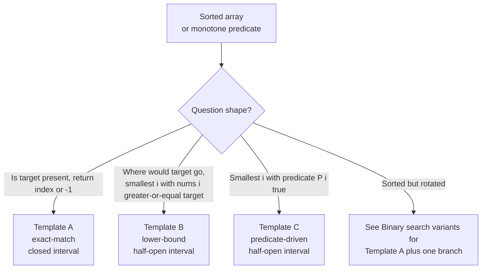

# Binary search: the canonical version

In June 2006, Joshua Bloch posted a notice on the Google Research blog with a long title: *Extra, Extra — Read All About It: Nearly All Binary Searches and Mergesorts are Broken.* The bug he described had been sitting in `java.util.Arrays.binarySearch` for nine years. Bentley's *Programming Pearls* had carried the same bug since 1986, in a chapter where the author had taught the algorithm and *proved it correct* in front of a CMU class. The proof was right. The implementation was wrong. The disagreement was one line:

```text
int mid = (low + high) / 2;
```

That line, on an array of more than 2^30 elements, overflows. `low + high` exceeds `Integer.MAX_VALUE`; the sum wraps to a negative integer; the division stays negative; the next array access throws `ArrayIndexOutOfBoundsException` in Java or returns garbage in C. The bug was invisible in 1986 because nobody had a billion-element array. It surfaced at Google twenty years later, when somebody did.[^1]

The fix is `lo + (hi - lo) / 2`. The harder lesson, the one that survives outside this chapter, is what Bentley took away from the incident: **carefully consider the invariants in your programs.** Halving the interval is the easy part of binary search. The reason published implementations stay broken for decades is that the boundary handling, `lo <= hi` versus `lo < hi`, `hi = mid` versus `hi = mid - 1`, what `lo` actually means at loop exit, is not natural. It has to be derived, every time, from a written-down invariant.

This chapter ships three templates, one per question shape. Each carries an invariant strong enough to derive every other line of code. Memorise the invariants and the templates write themselves. Memorise the templates without the invariants and you will ship the Bloch bug.

## Pick the template from the question, not the input

Three different questions look like the same problem from twenty feet away. Sorted array, target value, find something. Step closer and they're not the same problem at all:

- **LC 704 Binary Search.** *Is `target` in `nums`, and where?* Return the index, or `-1` if absent.
- **LC 35 Search Insert Position.** *Where does `target` go?* Return the smallest index `i` where inserting `target` keeps `nums` sorted. Always returns a valid index in `[0, len(nums)]`. Never returns `-1`.
- **LC 278 First Bad Version.** *Smallest version `v` with `isBadVersion(v) == true`.* No array. The sequence `1..n` is implicit; the predicate is the discriminator.

The three questions answer differently when the answer is "not present", and that single difference is enough to require three different templates. LC 704 returns `-1`; LC 35 returns the insertion point; LC 278 has no "absent" case because the predicate is guaranteed monotone false-then-true. A single template that tries to handle all three with one set of pointer updates produces the off-by-one bugs the chapter is trying to prevent.



*Three templates, one per question shape. Picking the template from the question, not the input shape, is what stops you from shipping LC 35's insertion-point semantics into LC 704's miss-returns-minus-one contract.*

The bridge from [Linear search and what it's good for](./00-linear-search.md) is a single specialisation. You had a sorted array there too as Knuth's Algorithm T, but you walked it one step at a time. Binary search jumps, and the price for that jump is paid up front in the sort. The next chapter, [Binary search variants](./02-binary-search-variants.md), takes these three invariants and reuses them on inputs that are no longer literal sorted arrays: rotated arrays, peak finding, parametric search across numeric domains. None of that works without the invariants this chapter teaches.

## Template A: exact-match on a closed interval

Use Template A when the question is *is `target` present, and where?* The return contract is the index on hit, `-1` on miss.

```python
def search(nums, target):
    lo, hi = 0, len(nums) - 1
    while lo <= hi:
        mid = lo + (hi - lo) // 2          # NEVER (lo + hi) // 2
        if nums[mid] == target:
            return mid
        if nums[mid] < target:
            lo = mid + 1
        else:
            hi = mid - 1
    return -1
```

The invariant is one line: **if `target` exists in `nums`, its index is in `[lo, hi]`.** Both endpoints are live. Both are candidates. The closed bracket is the only thing that matters for picking the rest of the code.

The loop guard follows from the invariant. When `lo == hi` the interval is non-empty and contains exactly one cell, `nums[lo]`, that has not been probed yet. Skipping it would let the algorithm declare "absent" without ever testing the candidate the invariant points at. The guard must therefore be `lo <= hi`, not `lo < hi`. The cost is one extra iteration on the singleton case, and that iteration is the entire point.

Pointer updates after a miss follow from the same invariant. `mid` was just compared and rejected, so it cannot stay in the closed interval. Both pointers move past it: `lo = mid + 1` to discard the left half, or `hi = mid - 1` to discard the right. Writing `lo = mid` or `hi = mid` instead is the third-most-common binary-search bug; see [The off-by-one death zone](#the-off-by-one-death-zone) below.

A single canonical run on `nums = [1, 3, 5, 7, 9, 11, 13]`, `target = 7`:

| Step | lo | hi | mid | nums[mid] | Decision |
|---|---|---|---|---|---|
| 0 | 0 | 6 | — | — | Closed `[0, 6]`. Target lives here if anywhere. |
| 1 | 0 | 6 | 3 | 7 | Hit. Return 3. |

One iteration on a seven-element array, because the median sits exactly on the answer. Switch the target to a value that isn't there to see the algorithm work. Try `target = 4`:

| Step | lo | hi | mid | nums[mid] | Decision |
|---|---|---|---|---|---|
| 0 | 0 | 6 | — | — | Closed `[0, 6]` |
| 1 | 0 | 6 | 3 | 7 | 7 > 4. Discard right half: `hi = 2`. |
| 2 | 0 | 2 | 1 | 3 | 3 < 4. Discard left half: `lo = 2`. |
| 3 | 2 | 2 | 2 | 5 | 5 > 4. Singleton: `hi = 1`. |
| 4 | 2 | 1 | — | — | `lo > hi`. Interval empty. Return -1. |

Three comparisons on `n = 7`. The bound is `ceil(log_2 8) = 3` comparisons, plus one iteration where the empty-interval guard fires. The widget below animates this exact trace; scrub through it with the absent preset selected.

> **Interactive widget:** [Binary search (exact-match + rotated)](../widgets/w-04-binary-search.yml) (panel `panel-a`) — rendered on the website; the YAML spec describes the keyframes.

*Static fallback: four keyframes drawn from the absent-target preset, showing the closed interval shrinking from `[0, 6]` to `[0, 2]` to `[2, 2]` to empty.*

## Template B: lower-bound on a half-open interval

Switch the question to *where does `target` go?* and almost every line of Template A has to change. The closed interval becomes half-open. The guard becomes strict. One pointer keeps `mid` instead of moving past it. The return is no longer the index of a hit but the position of the first cell that is at least the target.

```python
def search_insert(nums, target):
    lo, hi = 0, len(nums)                  # NOTE: one past the end
    while lo < hi:
        mid = lo + (hi - lo) // 2
        if nums[mid] < target:
            lo = mid + 1
        else:
            hi = mid                       # NOT mid - 1
    return lo
```

The invariant has two halves now, one per pointer:

> Every index `j` with `j < lo` satisfies `nums[j] < target`.
> Every index `k` with `k >= hi` satisfies `nums[k] >= target`.

Read it twice. `lo` walks behind the boundary; `hi` walks past it. The half-open `[lo, hi)` form is not a stylistic choice; it expresses the lower-bound contract directly. `hi = len(nums)` because the answer can legitimately be one past the last index, which is the case where every element is smaller than the target. The terminal state is `lo == hi`, and that common value is the answer by construction. Both halves of the invariant pin it.

The asymmetric pointer updates fall out. When `nums[mid] < target`, every index up to and including `mid` is too small, so `lo` advances past `mid` to `mid + 1`. When `nums[mid] >= target`, the cell `mid` is itself a valid upper-bound candidate, and the half-open interval *excludes* `hi`, so collapsing `hi` to `mid` keeps the invariant without retesting `mid` next iteration. Writing `hi = mid - 1` instead would lose the invariant: the cell at `mid - 1` could be the answer, but the loop would have just declared it can't.

Four runs on `nums = [1, 3, 5, 6]` cover every case the chapter cares about:

| target | trace | return | what it means |
|---|---|---|---|
| 5 | hi shrinks 4 → 2 → 2; lo advances 0 → 2 | 2 | hit; insert at the existing position |
| 2 | hi shrinks 4 → 2 → 1 | 1 | between 1 and 3 |
| 7 | lo advances 0 → 3 → 4 | 4 | past the end |
| 0 | hi shrinks 4 → 2 → 1 → 0 | 0 | before everything |

The "past the end" case is the reason `hi` starts at `len(nums)` and not `len(nums) - 1`. Template A would return `-1` here. Template B has nowhere else to put the answer; `len(nums)` is a perfectly valid insertion point and the algorithm terminates with `lo == hi == len(nums)`.

The C++ standard library's `std::lower_bound` is exactly this template. Java's `Collections.binarySearch` returns `-(insertionPoint + 1)` on miss, which is derived from the same lower-bound shape; the negative encoding lets the same return value carry "found at index" or "not found, would insert here", which `Arrays.binarySearch` callers decode with one subtraction. Go's `sort.Search` is closest to Template C below: it takes a predicate, not a value.

## Template C: predicate-driven leftmost

The third template is Template B with one substitution. Wherever Template B compares `nums[mid] < target`, Template C calls a black-box predicate `P(mid)` that flips from false to true exactly once across the search range. The loop and pointer logic are byte-identical:

```python
def first_true(lo, hi, P):
    while lo < hi:
        mid = lo + (hi - lo) // 2
        if P(mid):
            hi = mid
        else:
            lo = mid + 1
    return lo
```

The invariant is the same shape, with `nums[j] < target` replaced by `not P(j)`:

> Every index `j` with `j < lo` satisfies `not P(j)`.
> Every index `k` with `k >= hi` satisfies `P(k)`.

LC 278 First Bad Version is the canonical example. The predicate is `isBadVersion(v)`, an API the platform provides. Every version up to the broken commit returns false; every version from the broken commit onwards returns true. The function answers *which version broke things* with no array indexing at all, only black-box predicate calls.

```python
def first_bad_version(n, is_bad_version):
    lo, hi = 1, n
    while lo < hi:
        mid = lo + (hi - lo) // 2
        if is_bad_version(mid):
            hi = mid
        else:
            lo = mid + 1
    return lo
```

The constraint on LC 278 is `n <= 2,147,483,647`. That number is `INT_MAX` on a signed 32-bit integer, and it is the constraint Bloch's bug cares about. Computing `(lo + hi) / 2` with `lo == 0` and `hi == 2^31 - 1` overflows the signed int; the wrapped result is negative; the next predicate call passes a negative version number to an API that does not expect one. The fix `lo + (hi - lo) / 2` keeps every intermediate value bounded by `hi`, which fits in the signed type by construction. The two forms are mathematically equivalent on unbounded integers. They are not bit-equivalent on bounded ones.

Template C is the bridge from "binary search on a sorted array" to "binary search on the answer", which is where [Binary search variants](./02-binary-search-variants.md) lives. Once you realise the predicate doesn't need to be `nums[i] >= target`, the search space stops being an array and starts being any monotone-predicate-on-an-integer-range: minimum days to ship a cargo (LC 1011), minimum eating speed for a deadline (LC 875), the smallest divisor that fits inside a threshold (LC 1283). The next chapter walks all three.

## Idioms across four languages

**Solution** — Python ([Java](./01-binary-search-canonical/sol.java) · [C++](./01-binary-search-canonical/sol.cpp) · [Go](./01-binary-search-canonical/sol.go))

```python
# LC 704. Binary Search. Exact-match closed-interval template.
# LC 35. Search Insert Position. Lower-bound half-open template.
# LC 278. First Bad Version. Predicate-driven half-open template.
#   LC 704: ([-1,0,3,5,9,12], 9) -> 4; ([-1,0,3,5,9,12], 2) -> -1;
#           ([5], 5) -> 0; ([5], -5) -> -1; ([1,3,5,7,9,11,13], 7) -> 3; ([], 1) -> -1.
#   LC 35: ([1,3,5,6], 5) -> 2; ([1,3,5,6], 2) -> 1; ([1,3,5,6], 7) -> 4; ([1,3,5,6], 0) -> 0.
#   LC 278: n=5,bad=4 -> 4; n=1,bad=1 -> 1; n=INT_MAX,bad=1702766719 -> 1702766719.

from typing import Callable, List


def search(nums: List[int], target: int) -> int:
    """LC 704. Exact-match closed-interval template.

    Loop invariant: target, if it exists, is in nums[lo..hi] (both inclusive).
    Loop terminates when lo > hi (interval empty, target not present).
    """
    lo, hi = 0, len(nums) - 1
    while lo <= hi:
        mid = lo + (hi - lo) // 2  # overflow-safe vs (lo + hi) // 2
        if nums[mid] == target:
            return mid
        if nums[mid] < target:
            lo = mid + 1
        else:
            hi = mid - 1
    return -1


def search_insert(nums: List[int], target: int) -> int:
    """LC 35. Lower-bound (leftmost insertion point) template.

    Loop invariant: every index j with j < lo satisfies nums[j] < target;
    every index k with k >= hi satisfies nums[k] >= target.
    Terminates when lo == hi; lo is the insertion point.

    Uses half-open style: [lo, hi) with hi = len(nums) (one past the end).
    """
    lo, hi = 0, len(nums)
    while lo < hi:
        mid = lo + (hi - lo) // 2
        if nums[mid] < target:
            lo = mid + 1
        else:
            hi = mid
    return lo


def first_bad_version(n: int, is_bad_version: Callable[[int], bool]) -> int:
    """LC 278. Predicate-driven leftmost template on [1, n].

    Loop invariant: the answer (first bad version), which exists by problem
    guarantee, lies in [lo, hi]. At loop exit lo == hi == answer.
    """
    lo, hi = 1, n
    while lo < hi:
        mid = lo + (hi - lo) // 2
        if is_bad_version(mid):
            hi = mid
        else:
            lo = mid + 1
    return lo
```

The canonical test exercises the singleton, empty-array, hit, miss, and "past the end" cases on LC 704; the four insertion-point cases on LC 35; and the `n = INT_MAX` overflow boundary on LC 278. Stdlib equivalents exist in three of the four languages: `std::lower_bound` in C++, `Collections.binarySearch` in Java with the negative-encoding return, `sort.Search` in Go. Production code calls those directly. Interviewers ask you to write Template A from scratch, which is what the chapter teaches.

## What it actually costs

Worst case `Theta(log_2 n)` comparisons; tight by the decision-tree argument. The interval `[lo, hi]` shrinks by at least half on every iteration: after each comparison either `lo := mid + 1` discards the left half (including `mid`) or `hi := mid - 1` discards the right (including `mid`). The new length is at most `floor((hi - lo) / 2)` plus boundary adjustment, strictly less than half the previous length. After `k` iterations the interval has length at most `n / 2^k`; the loop terminates when length is zero, so `k <= ceil(log_2 n)`.[^2] Best case `Theta(1)` when the target lands at the first probed midpoint. Space `Theta(1)` for the iterative form; the recursive variant pays `Theta(log n)` for its call stack and gives nothing back.

The information-theoretic lower bound matches. A comparison-based search algorithm must distinguish `n + 1` outcomes (`n` possible hit indices plus one miss), so its decision tree has at least `n + 1` leaves; a binary tree with `n + 1` leaves has minimum height `ceil(log_2(n + 1))`.[^3] Binary search is therefore asymptotically optimal among comparison-based search algorithms on sorted arrays. Knuth's "uniform binary search" (precomputed mid offsets) shaves constants. It does not change the bound.[^3]

The bound also explains why faster alternatives exist on structured inputs. Hash tables answer in expected `O(1)` per query, paid for with `Theta(n)` preprocessing and `Theta(n)` extra space. B-trees and tries answer in `O(log n)` per query and support efficient inserts. Interpolation search on uniform-distribution numeric keys answers in expected `O(log log n)`, paid for with the assumption about the key distribution. Each pays a different price for the same query class. Binary search is what wins when the input is a static sorted array and you do not want to pay for additional structure.

## The off-by-one death zone

Three pointer-update bugs share a common shape: each is one line of code, each compiles, each passes a few sample tests, and each fails on the singleton boundary or the `INT_MAX` boundary or the empty-array boundary. The fix is mechanical once you write the invariant down. The reason the bugs are common is that engineers under interview pressure don't write the invariant down.

> [!CAUTION]
> **Never write `(lo + hi) / 2` as the midpoint.** The bug shipped in `java.util.Arrays.binarySearch` for nine years before Bloch caught it.[^1] On any array with more than 2^30 elements the sum overflows; the wrapped value is negative; the array access throws or returns garbage. The fix is `lo + (hi - lo) / 2`. The two forms are mathematically equivalent on unbounded integers and not equivalent on bounded ones. Use the safe form by reflex, in every language, every time. Java's faster alternative `(lo + hi) >>> 1` (unsigned right shift) is also safe and is what Bloch endorsed; the subtraction form ports cleanly across all four languages this chapter teaches.

> [!WARNING]
> **The loop guard is determined by the interval style, not by personal preference.** Closed `[lo, hi]` (Template A) requires `while lo <= hi`; the singleton case `lo == hi` is non-empty and must be probed. Half-open `[lo, hi)` (Templates B and C) requires `while lo < hi`; `lo == hi` is the empty terminal state and the answer. Mixing the two, closed interval with `lo < hi`, or half-open with `lo <= hi`, produces off-by-one misses on the singleton boundary, or infinite loops at the singleton, depending on which way you mismatched. The bug is silent on most random inputs and only fires when the answer happens to be at index 0, the last index, or in a single-element array. Interview screens hit those cases on purpose.

> [!WARNING]
> **In Template A, never write `lo = mid` or `hi = mid` after a miss.** The closed interval must shrink. `mid` was compared and rejected; if either pointer moves only to `mid` instead of past it, then on the next iteration where `lo + 1 == hi`, `mid` rounds down to `lo`, the pointer update is a no-op, and the loop spins forever. The rule is mechanical: closed interval, miss, advance past `mid`. Half-open is the opposite: Template B's `hi = mid` is correct because the half-open interval excludes `hi` by definition, and the cell at `mid` itself is still a valid candidate.

> [!WARNING]
> **Memorising "return `lo`" for every template breaks at the upper-bound twin.** Templates B and C return `lo` because their lower-bound invariant identifies `lo` as the answer at loop exit. The upper-bound variant covered in [Binary search variants](./02-binary-search-variants.md) returns `lo - 1` because its invariant identifies a different pointer. Derive the return statement from the invariant; never copy it from another template. The same warning applies to Template A's `return -1`: that constant is correct because Template A returns indices, never insertion points; using `-1` as Template B's return on miss would silently flip a perfectly-valid `0` insertion-point answer into a "not found" indicator.

> [!WARNING]
> **Binary search needs monotonicity, not sortedness.** The deeper precondition is that some predicate `P(i)` is monotone false-then-true in `i`. Sortedness is one way to get there (`P(i) := nums[i] >= target`); a feasibility predicate on a numeric domain is another (`P(c) := canShipInDays(c) <= D` for LC 1011's parametric search). If you cannot write down the monotone property the search relies on, binary search does not apply, and it will return wrong answers in `O(log n)` instead of right answers in `O(n)`.

## Where this leads

[Binary search variants](./02-binary-search-variants.md) reuses Template A's closed-interval invariant verbatim and adds one comparison per iteration to handle inputs that aren't literally sorted: rotated arrays (LC 33), peak finding on monotone-on-each-side input (LC 162), partition search across two arrays (LC 4), and binary search on the answer for optimisation problems (LC 875, LC 1011). Readers who finish this chapter with the invariant internalised read 2.2's rotated-array code as "Template A plus one branch." Readers who ship this chapter with the invariant fuzzy struggle there, because the branch decision *is* invariant-derived. The widget you just stepped through is shared with that chapter; panel B animates the rotated case on the same canvas.

## Problem ladder

The three CORE problems are all Easy on LeetCode, and that is structural rather than a curation choice. Canonical 3-template binary-search problems are LC-Easy by design; the templates *are* the lesson, and the inputs are deliberately minimal so the templates can stand in front. Adding a Hard candidate to CORE would mean teaching a different chapter (rotated arrays, partition search, parametric search), and those all live in [Binary search variants](./02-binary-search-variants.md). STRETCH carries the Medium and Hard rungs to satisfy the difficulty-span constraint at the combined-set level.

### CORE (solve all to claim chapter mastery)

- [LC 704 — Binary Search](https://leetcode.com/problems/binary-search/) [Easy] • binary-search-template-1 ★
- [LC 35 — Search Insert Position](https://leetcode.com/problems/search-insert-position/) [Easy] • binary-search-leftmost-insertion
- [LC 278 — First Bad Version](https://leetcode.com/problems/first-bad-version/) [Easy] • binary-search-on-monotone-predicate

### STRETCH (optional)

- [LC 540 — Single Element in a Sorted Array](https://leetcode.com/problems/single-element-in-a-sorted-array/) [Medium] • binary-search-template-1 with a clever monotone predicate on parity
- [LC 4 — Median of Two Sorted Arrays](https://leetcode.com/problems/median-of-two-sorted-arrays/) [Hard] • binary-search-on-partition-index *(reference: Python only)*

LC 540 is the cleanest extension of Template A inside this chapter's scope: the predicate is "at the leftmost unpaired index, even-indexed elements no longer have a duplicate on the right", and the same closed-interval invariant from §"Template A" carries the proof.[^4] LC 4 is the canonical Hard binary-search problem; despite the deceptively simple statement it requires `Theta(log(min(m, n)))` binary search on the partition position of one array, which uses Template A's invariant on a non-trivial comparison.[^5]

## References

[^1]: Joshua Bloch, "Extra, Extra — Read All About It: Nearly All Binary Searches and Mergesorts are Broken," *Google Research blog*, June 2, 2006. <https://blog.research.google/2006/06/extra-extra-read-all-about-it-nearly.html>.

[^2]: Cormen, Leiserson, Rivest, Stein, *Introduction to Algorithms*, 4th ed., MIT Press, 2022, exercise 2.

[^3]: Donald E. Knuth, *The Art of Computer Programming, Volume 3: Sorting and Searching*, 2nd ed., Addison-Wesley, 1998, §6.2.1 "Searching an Ordered Table"; decision-tree height bound for any comparison-based search.

[^4]: Robert Sedgewick and Kevin Wayne, *Algorithms*, 4th ed., Addison-Wesley, 2011, §1.1 "Basic programming model", `BinarySearch.java`. <https://algs4.cs.princeton.edu/code/edu/princeton/cs/algs4/BinarySearch.java.html>.

[^5]: dsaprep.dev, "Median of Two Sorted Arrays LeetCode Solution," <https://dsaprep.dev/blog/median-of-two-sorted-arrays-solution/>
