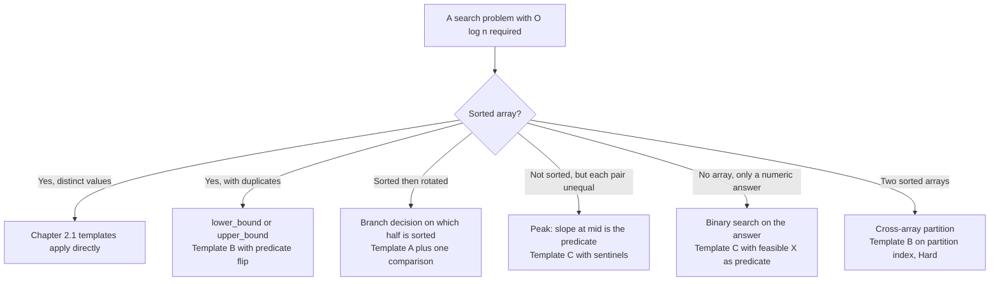

# Binary search variants: lower_bound, upper_bound, peaks, and rotated arrays

Take the array `[1, 2, 2, 2, 3]` and binary-search for `2`. Templates from the [previous chapter](./01-binary-search-canonical.md) return three different answers depending on which question you ask. `lower_bound` returns `1`, the leftmost `2`. `upper_bound` returns `4`, one past the rightmost `2`. The exact-match Template A returns *some* index in `{1, 2, 3}`, whichever happens to be probed first. Same input, three answers, all correct under their own contracts.

The differences live in one line each. `lower_bound` compares with `nums[mid] < target`. `upper_bound` flips the strict less-than to a non-strict less-than-or-equal: `nums[mid] <= target`. That is the entire delta. The skeleton, the loop guard, the pointer updates, the half-open invariant. Every other line is byte-identical to chapter 2.1's Template B. Memorise the templates without the invariants and you will swap a `<` for a `<=` somewhere by accident and ship a bug that passes 90% of tests. Memorise the invariants and the predicate writes itself.

This chapter does that swap five times. Each variant is a one-line predicate change against a 2.1 template, applied to a different shape of input: duplicates, rotated arrays, peaks, numeric domains, two arrays at once. The bound stays `O(log n)`. The teaching is the predicate.

## Locating the variant from the input shape



*Five questions, five predicates. The chapter walks them in order. The widget at the end animates the rotated-array case because that branch decision is the one readers most often get wrong.*

## Variant 1: lower_bound and upper_bound on duplicates

Chapter 2.1's Template B was for arrays with distinct keys. The contract was *return the smallest `i` with `nums[i] >= target`*, and on the canonical input that index also identified the unique hit when one existed. Once duplicates land in the array, the contract splits.

`lower_bound` returns the smallest `i` with `nums[i] >= target`. On `[1, 2, 2, 2, 3]` with target `2`, that's index `1`, the leftmost `2`.

`upper_bound` returns the smallest `i` with `nums[i] > target`. Same input, same target: index `4`, one past the rightmost `2`.

Both are insertion points. `lower_bound` inserts before the equal-key block; `upper_bound` inserts after. The count of cells equal to `target` is `upper_bound(target) - lower_bound(target)`, which is how LC 34 (Find First and Last Position of Element in Sorted Array) gets solved in two binary searches and a subtraction.

```python
def lower_bound(nums, target):
    lo, hi = 0, len(nums)
    while lo < hi:
        mid = lo + (hi - lo) // 2
        if nums[mid] < target:           # strict < keeps equality on the right
            lo = mid + 1
        else:
            hi = mid
    return lo

def upper_bound(nums, target):
    lo, hi = 0, len(nums)
    while lo < hi:
        mid = lo + (hi - lo) // 2
        if nums[mid] <= target:          # non-strict <= keeps equality on the left
            lo = mid + 1
        else:
            hi = mid
    return lo
```

**Solution** — Python ([Java](./02-binary-search-variants/sol.java) · [C++](./02-binary-search-variants/sol.cpp) · [Go](./02-binary-search-variants/sol.go))

```python
"""LC 33, LC 153, LC 162: binary-search variants on non-trivially-sorted input,
plus lower_bound / upper_bound on duplicate-bearing sorted arrays and the
parametric-search template (binary search on the answer).

The closed-interval and half-open invariants from chapter 2.1 carry through.
What changes per variant is which comparison drives the halving decision.
"""
from typing import Callable, List


def lower_bound(nums: List[int], target: int) -> int:
    """Smallest index i with nums[i] >= target, or len(nums) if none.

    Half-open [lo, hi). Invariant: every j < lo has nums[j] < target;
    every k >= hi has nums[k] >= target. Comparison: nums[mid] < target.
    On [1, 2, 2, 2, 3] target 2 returns 1 (leftmost 2).
    """
    lo, hi = 0, len(nums)
    while lo < hi:
        mid = lo + (hi - lo) // 2
        if nums[mid] < target:
            lo = mid + 1
        else:
            hi = mid
    return lo


def upper_bound(nums: List[int], target: int) -> int:
    """Smallest index i with nums[i] > target, or len(nums) if none.

    Same skeleton as lower_bound; the comparison is nums[mid] <= target,
    which flips equality to the left of the boundary instead of the right.
    On [1, 2, 2, 2, 3] target 2 returns 4 (one past the rightmost 2).
    The count of equal keys is upper_bound(t) - lower_bound(t).
    """
    lo, hi = 0, len(nums)
    while lo < hi:
        mid = lo + (hi - lo) // 2
        if nums[mid] <= target:
            lo = mid + 1
        else:
            hi = mid
    return lo


def search_rotated(nums: List[int], target: int) -> int:
    """LC 33. Exact match in a rotated sorted array (distinct values).

    Closed [lo, hi]. At each step exactly one of [lo..mid] and [mid..hi]
    is sorted; test target against the sorted half's endpoints and recurse
    into the half whose range contains target.
    """
    lo, hi = 0, len(nums) - 1
    while lo <= hi:
        mid = lo + (hi - lo) // 2  # overflow-safe per Bloch 2006
        if nums[mid] == target:
            return mid
        if nums[lo] <= nums[mid]:
            # Left half [lo..mid] is sorted.
            if nums[lo] <= target < nums[mid]:
                hi = mid - 1
            else:
                lo = mid + 1
        else:
            # Right half [mid..hi] is sorted.
            if nums[mid] < target <= nums[hi]:
                lo = mid + 1
            else:
                hi = mid - 1
    return -1


def find_min_rotated(nums: List[int]) -> int:
    """LC 153. Minimum in a rotated sorted array of unique elements.

    Compare nums[mid] with the right endpoint nums[hi]: if mid is larger,
    the rotation point is strictly right of mid; otherwise mid is itself
    a candidate, so keep it on the left.
    """
    lo, hi = 0, len(nums) - 1
    while lo < hi:
        mid = lo + (hi - lo) // 2
        if nums[mid] > nums[hi]:
            lo = mid + 1
        else:
            hi = mid
    return nums[lo]


def find_peak_element(nums: List[int]) -> int:
    """LC 162. Index of any strict peak (boundary sentinels -infinity).

    Slope at mid: nums[mid] > nums[mid+1] means a peak is in [lo..mid];
    nums[mid] < nums[mid+1] means a peak is in [mid+1..hi]. The boundary
    sentinels guarantee at least one peak exists in any half.
    """
    lo, hi = 0, len(nums) - 1
    while lo < hi:
        mid = lo + (hi - lo) // 2
        if nums[mid] > nums[mid + 1]:
            hi = mid
        else:
            lo = mid + 1
    return lo


def bs_on_answer_min(lo: int, hi: int, feasible: Callable[[int], bool]) -> int:
    """Binary search on the answer: smallest X in [lo, hi] with feasible(X)
    true. feasible must be monotone (once true at X, true for every X' >= X).
    Returns hi + 1 if no X in [lo, hi] is feasible.
    """
    while lo < hi:
        mid = lo + (hi - lo) // 2
        if feasible(mid):
            hi = mid
        else:
            lo = mid + 1
    return lo if feasible(lo) else hi + 1
```

The two functions look identical. Read them again: only the comparison operator differs. Lock that mapping in front of the invariant, not in front of the code.

> The strict comparison `nums[mid] < target` puts equality on the **right** of the boundary, so `lower_bound` returns where equality starts.
> The non-strict comparison `nums[mid] <= target` puts equality on the **left** of the boundary, so `upper_bound` returns where equality ends.

That sentence is the variant. Whichever side of the equal-key block the predicate calls "false" is the side `lo` ends up pointing past, so it's the side the return value identifies.

C++ ships both as `std::lower_bound` and `std::upper_bound` in `<algorithm>` since C++98. Python ships them as `bisect.bisect_left` and `bisect.bisect_right`. Java's `Collections.binarySearch` returns `-(insertionPoint + 1)` on a miss, which is the lower-bound shape with sign-flipped encoding for "not found"; there is no upper-bound built in. Go provides `sort.Search`, a Template-C-shaped predicate search; you supply the predicate, and you get whichever bound the predicate's flip-point identifies. The shape is universal. The function name varies.

## Variant 2: rotated sorted arrays

A sorted ascending array rotated at an unknown pivot, say `[4, 5, 6, 7, 0, 1, 2]`, is not sorted, but it is *almost* sorted. Two ascending runs joined at the rotation point. The naive `nums[mid] vs target` comparison is no longer enough on its own: the discriminator depends on which run `mid` lands on, and `mid` could land on either.

The fix is one extra comparison per iteration. Before the standard advance step, look at `nums[lo]` against `nums[mid]` to identify which half is the unbroken sorted run. Then ask whether `target` lies inside that run's value range. If yes, recurse into the run. If no, recurse into the other half. Target must be over there if it exists at all.

```python
def search_rotated(nums, target):
    lo, hi = 0, len(nums) - 1
    while lo <= hi:
        mid = lo + (hi - lo) // 2
        if nums[mid] == target:
            return mid
        if nums[lo] <= nums[mid]:           # left half [lo..mid] is the sorted run
            if nums[lo] <= target < nums[mid]:
                hi = mid - 1                # target lives in the sorted left
            else:
                lo = mid + 1                # target lives in the rotated right
        else:                                # right half [mid..hi] is the sorted run
            if nums[mid] < target <= nums[hi]:
                lo = mid + 1
            else:
                hi = mid - 1
    return -1
```

Chapter 2.1's closed-interval invariant carries through unchanged: *if `target` exists in `nums`, its index is in `[lo, hi]`*. The new branch decision narrows the search inside the sorted half; the old target-versus-endpoint comparison drives direction within it. The closed `lo <= hi` guard is the same. The overflow-safe midpoint is the same. The variant is one branch on top of Template A.

The inclusive `nums[lo] <= nums[mid]`, with the equality, matters more than it looks. On a size-2 input `lo == mid`, so `nums[lo] == nums[mid]` always, and a strict `<` would classify the size-2 array as "right half sorted" and misroute the search on inputs like `[3, 1]`. The first warning at the end of the chapter is exactly this bug.

LC 153 (Find Minimum in Rotated Sorted Array) uses a different discriminator on the same input shape. There is no `target`; the question is *what is the minimum?*. Compare `nums[mid]` to `nums[hi]` directly. The right boundary is the only cell guaranteed to sit on the higher of the two runs (by the definition of an ascending-then-rotated array), so it's a stable reference point. `nums[lo]`, by contrast, could be on either run depending on rotation amount, which makes it unstable as a reference.

```python
def find_min_rotated(nums):
    lo, hi = 0, len(nums) - 1
    while lo < hi:
        mid = lo + (hi - lo) // 2
        if nums[mid] > nums[hi]:
            lo = mid + 1                    # rotation point is strictly past mid
        else:
            hi = mid                        # mid itself may be the minimum; keep it
    return nums[lo]
```

The half-open form returns; the closed form would walk off the end on a slope read. The minimum lives in `nums[lo..hi]` at every step; the loop terminates with `lo == hi` and the answer at `nums[lo]`. On the un-rotated input `[11, 13, 15, 17]`, every iteration takes the `else` branch (`nums[mid] <= nums[hi]` always), `hi` collapses toward `0`, and the algorithm returns `nums[0] = 11`. The variant degrades cleanly.

## Worked example: LC 33 on `[4, 5, 6, 7, 0, 1, 2], target = 0`

Pivot is between indices 3 and 4. Target lives in the rotated right run. Three iterations:

| Step | lo | hi | mid | nums[mid] | Sorted half | Decision |
|---|---|---|---|---|---|---|
| 0 | 0 | 6 | — | — | — | Closed `[0, 6]`. |
| 1 | 0 | 6 | 3 | 7 | left `[0..3]` | `nums[lo]=4 <= nums[mid]=7`. Target 0 not in `[4, 7)`. Recurse right. |
| 2 | 4 | 6 | 5 | 1 | left `[4..5]` | `nums[lo]=0 <= nums[mid]=1`. Target 0 in `[0, 1)`. Recurse left. |
| 3 | 4 | 4 | 4 | 0 | — | Hit. Return 4. |

The branch decision flips between iterations. First time around, target is outside the sorted left, so the algorithm jumps to the rotated right. Second time around, target is inside the sorted left of the new range. The widget below scrubs through this trace step by step on panel B; panel A from chapter 2.1 sits beside it and animates the same template on a non-rotated input, so you can see the rotated branch decision as a *layer* on top of the same pointer dance.

> **Interactive widget:** [Binary search (exact-match + rotated)](../widgets/w-04-binary-search.yml) (panel `panel-b`) — rendered on the website; the YAML spec describes the keyframes.

*Static fallback: four keyframes drawn from the canonical trace at the initial state, the first branch decision (target not in sorted left), the second branch decision (target in sorted left of the new range), and the hit at index 4.*

## Variant 3: peak finding on monotone-on-each-side input

LC 162 (Find Peak Element) drops sortedness entirely. The only structural guarantee is `nums[i] != nums[i+1]` for every `i`, with implicit boundary sentinels `nums[-1] = nums[n] = -infinity`. A "peak" is any index `i` where `nums[i]` is strictly greater than both its neighbours under that sentinel convention. The problem asks for *any* peak in `O(log n)`. Linear scan is `O(n)` and trivial; the logarithmic bound is what makes the problem interesting.

The discriminator is the slope at `mid`:

```python
def find_peak_element(nums):
    lo, hi = 0, len(nums) - 1
    while lo < hi:
        mid = lo + (hi - lo) // 2
        if nums[mid] > nums[mid + 1]:        # descending: peak in [lo..mid]
            hi = mid
        else:                                 # ascending: peak in [mid+1..hi]
            lo = mid + 1
    return lo
```

Why does this work without sortedness anywhere? The boundary sentinels do the heavy lifting. If the slope at `mid` descends, then `[lo..mid]` ascended *to* `mid` from somewhere on the left. The climb has to terminate by the left sentinel `-infinity`, so a peak exists somewhere in `[lo..mid]`. Possibly `mid` itself, possibly earlier. Conversely, if the slope ascends, `[mid+1..hi]` climbs from `mid+1` rightward and must terminate at a peak before the right sentinel. Either branch preserves the invariant *a peak lives in `nums[lo..hi]`*, and the interval halves on every iteration.

The half-open `lo < hi` form is mandatory for one mechanical reason: the slope test reads `nums[mid + 1]`. The half-open guard ensures `mid != hi`, so `mid + 1 <= hi` is always in bounds. A closed-interval rewrite with `lo <= hi` lets `mid == hi` slip through on the final iteration and reads off the array. That is the third pitfall at the end of the chapter; readers who skip the half-open form by reflex walk into it.

The function returns *some* peak, not the global max. `[1, 2, 1, 3, 5, 6, 4]` has two peaks at indices 1 and 5; the algorithm returns whichever its midpoint trail leads to. Returning the global max would require `O(n)` work to inspect every element. The contract pays for the speedup with that ambiguity.

## Variant 4: binary search on the answer

Chapter 2.1's Template C took a predicate and returned the smallest index where the predicate flipped from false to true. The argument to the predicate was an array index. Nothing in the template's correctness proof actually depends on that. The proof needs only a monotone predicate over an integer range.

Replace the array with a numeric domain over the possible answers, and the same template solves a different class of problem. The search space is `[1, max_input]` or `[lo, hi]` for whatever bounds the problem gives. The predicate is a feasibility check that runs in poly-time and is monotone: once true at some `X`, true for every `X' >= X` (or the symmetric false-then-true direction).

```python
def bs_on_answer_min(lo, hi, feasible):
    while lo < hi:
        mid = lo + (hi - lo) // 2
        if feasible(mid):
            hi = mid                          # mid satisfies; can we go smaller?
        else:
            lo = mid + 1                      # mid does not satisfy; must go bigger
    return lo if feasible(lo) else hi + 1
```

Byte-identical to Template C. The change is what `feasible` does. A few examples:

- **LC 875 (Koko Eating Bananas).** `feasible(K)` checks whether eating speed `K` bananas-per-hour clears all piles within `H` hours. Predicate is `O(n)`. Answer domain is `[1, max(piles)]`. Faster eating only helps, so the predicate is monotone non-decreasing.
- **LC 1011 (Capacity to Ship Packages).** `feasible(C)` checks whether all packages can ship in `D` days at capacity `C`. Bigger capacity only helps. Monotone.
- **LC 410 (Split Array Largest Sum).** `feasible(S)` checks whether the array can be partitioned into `m` subarrays with no subarray sum exceeding `S`. Larger `S` only helps. Monotone.

The pattern signal is sharp: an optimisation problem with a numeric answer, where the *raw* problem looks DP-shaped or NP-hard, but the *checker* is tractable and monotone in the parameter. The instinct to reach for is binary search on the answer space, not search on the input. Tatsuhiro Tsukioka's 2025 survey of recent Google interview loops flags this as the most underprepared binary-search variant in current rotations[^1]. Readers know the classical templates and panic when the problem doesn't fit them.

The instinct is also dangerous if monotonicity is not actually there. Before reaching for the template, write the monotonicity sentence out loud: *"if I can ship in D days at capacity C, I can ship in D days at any capacity at least C."* If you can't complete that sentence with a clean justification, the predicate is not monotone, and binary search returns a wrong answer in `O(log n)` instead of a right answer in `O(n)`. The fourth pitfall at the end of the chapter is this trap.

The full treatment of binary search on the answer, including the parametric-search reduction Megiddo formalised in 1983[^2] and the Aliens-trick lineage, lives in [Dynamic programming: recursion to memoisation](../part-9-dynamic-programming/00-dp-recursion-to-memo.md). This chapter introduces the contract.

## Variant 5: cross-array partition (LC 4, the trophy)

LC 4 (Median of Two Sorted Arrays) is the chapter's hardest problem and the pattern's most surprising one. Two sorted arrays of (possibly different) lengths; find the median of the combined sorted array in `O(log min(m, n))`.

The naive merge is `O(m + n)`. Quickselect on a virtual merged array is also `O(m + n)`. Neither hits the required bound. The right answer searches a different space entirely: a *partition index* in the smaller array. Pick `i` cells from the left of the smaller array; pick `(m + n + 1) / 2 - i` cells from the left of the larger array; the combined left half has exactly `(m + n + 1) / 2` elements by construction. Check that the partition is valid (`max(left_partition) <= min(right_partition)` across both arrays) and binary-search on `i` to find the split that satisfies the check.

The search space size is `min(m, n)`, so depth is `log min(m, n)`. The check at each midpoint is four comparisons, `O(1)`. Total `O(log min(m, n))`. dsaprep.dev's 2025 frequency snapshot lists LC 4 in the top 20 most-asked LC problems, the hardest Hard in that band[^3].

The chapter does not unpack the partition proof in detail; the [LC 4 editorial](https://leetcode.com/problems/median-of-two-sorted-arrays/) is where to go for the full walkthrough. What this chapter teaches is the meta-lesson the editorial doesn't quite state: *"binary search" is whatever comparison you can keep monotonic*. The partition-index space is not literally sorted, not literally an input array, not literally values. It's a position whose validity is a monotone property. That is the most general statement of binary search the chapter offers.

## What it actually costs

| Variant | Time | Space | Notes |
|---|---|---|---|
| `lower_bound` / `upper_bound` | `Theta(log n)` | `O(1)` | Tight by 2.1's decision-tree bound. |
| LC 33 rotated exact match | `O(log n)` worst, `O(1)` best | `O(1)` | One extra comparison per iteration; recurrence unchanged. |
| LC 153 rotated minimum | `O(log n)` | `O(1)` | One comparison per iteration. |
| LC 162 peak finding | `O(log n)` | `O(1)` | Sentinels, not sortedness, drive the bound. |
| Binary search on the answer | `O((log W) * F)` | `O(1)` | `W = hi - lo` answer domain, `F` per-call feasibility cost. |
| LC 4 median of two arrays | `O(log min(m, n))` | `O(1)` | Search on partition index in the smaller array. |

The bound is the same `T(n) = T(n/2) + Theta(1) -> Theta(log n)` recurrence chapter 2.1 carried, by CLRS 4e §4.5's master method[^4]. Variants A, B, and C halve a literal interval `[lo, hi]`. Variant D halves a numeric domain. Variant E halves a partition-index space. Each iteration does `O(1)` work in the rotated case and `O(F)` in binary search on the answer; the iteration count is identical.

The Bloch overflow lesson from chapter 2.1 carries forward unchanged. Every midpoint in this chapter is `lo + (hi - lo) / 2`, never `(lo + hi) / 2`, in every language. For binary search on the answer the bound matters more than for array indexing because the answer domain frequently exceeds `INT_MAX / 2`. LC 1011's package weights and LC 410's array sums both reach 10^9. The unsafe form overflows. The safe form does not.[^5]

## Pitfalls

> [!WARNING]
> **In LC 33, the branch test must be `nums[lo] <= nums[mid]` with non-strict `<=`, not strict `<`.** On size-2 inputs `lo == mid`, so the comparison is `nums[lo] <= nums[lo]` which is trivially true; strict `<` would misclassify which half is sorted. Unit-test `[3, 1]` with target `1` (must return `1`) and target `3` (must return `0`); both must pass. The doocs editorial uses the non-strict form for exactly this reason.

> [!WARNING]
> **In LC 153, do not compare `nums[mid]` to `nums[lo]`.** The left endpoint can sit on either run depending on rotation amount; only `nums[hi]` is guaranteed to sit on the higher run. Comparing against `nums[lo]` produces wrong answers on un-rotated input or on inputs where `nums[mid] == nums[lo]`. Use `nums[mid] > nums[hi]` and unit-test the un-rotated case `[11, 13, 15, 17]` (must return `11`) and the size-2 case `[2, 1]` (must return `1`).

> [!WARNING]
> **In LC 162, use the half-open form `lo < hi`, not closed `lo <= hi`.** The slope test reads `nums[mid + 1]`. Half-open guarantees `mid != hi`, so `mid + 1 <= hi` always holds. The closed-interval form lets `mid == hi` slip through on the final iteration and reads past the end of the array. There is no fix that keeps the closed form; rewrite to half-open.

> [!WARNING]
> **Binary search on the answer requires a *monotone* feasibility predicate.** Once `feasible(X)` is true, every `X' >= X` must also be feasible (or the symmetric direction for max-answer problems). A non-monotone predicate produces wrong answers in `O(log n)`; the algorithm is fast and confident and incorrect. Before reaching for the template, write the monotonicity sentence out: *"if I can ship in D days at capacity C, I can ship in D days at any capacity at least C."* If you can't complete that sentence with a justification, binary search on the answer does not apply.

> [!WARNING]
> **Stdlib binary searches do not return what hand-rolled ones return.** `std::lower_bound` returns an iterator (which equals `end()` on miss, not a sentinel index). Java's `Collections.binarySearch` returns `-(insertionPoint) - 1` on miss, not `-1`. Go's `sort.Search` is a predicate search and behaves like Template C. In an interview, hand-roll the templates so the return convention matches what the problem asks for. Production code is a different story; production code calls the stdlib.

## Problem ladder

The CORE for this chapter is structurally three Mediums. Pure binary-search-variant problems (rotated arrays, peak finding, parametric search) tag as Medium or Hard on LeetCode by design; the Easy candidates that exist (LC 35, LC 704, LC 278) belong to chapter 2.1, where they teach the templates the variants build on. STRETCH carries the Hard rung with LC 4 and a parametric-search problem so the difficulty span clears the constraint at the combined-set level.

### CORE (solve all to claim chapter mastery)

- [LC 33 — Search in Rotated Sorted Array](https://leetcode.com/problems/search-in-rotated-sorted-array/) [Medium] • binary-search-rotated ★
- [LC 153 — Find Minimum in Rotated Sorted Array](https://leetcode.com/problems/find-minimum-in-rotated-sorted-array/) [Medium] • binary-search-rotation-pivot
- [LC 162 — Find Peak Element](https://leetcode.com/problems/find-peak-element/) [Medium] • binary-search-on-implicit-monotone

### STRETCH (optional)

- [LC 4 — Median of Two Sorted Arrays](https://leetcode.com/problems/median-of-two-sorted-arrays/) [Hard] • binary-search-on-two-sorted-arrays *(reference: Python only)*
- [LC 875 — Koko Eating Bananas](https://leetcode.com/problems/koko-eating-bananas/) [Medium] • binary-search-on-answer

LC 4 is the Hard the chapter spent space on; LC 875 is the cleanest exercise of binary search on the answer outside the Part 9 ladder. Both extend the chapter's premise (*"binary search is whatever comparison you can keep monotonic"*) into the two corners that surprise readers most.

## Where this leads

Binary search closes out here. The next chapters of Part 2 move to comparison sorting: [Comparison sorts I: merge sort](./03-comparison-sorts-1.md) introduces divide-and-conquer with the recurrence `T(n) = 2T(n/2) + Theta(n)` (same tree shape as binary search, more work per level) and the stable-merge invariant. [Comparison sorts II: quicksort and partition](./04-comparison-sorts-2.md) introduces the partition primitive that [Quickselect](./07-quickselect.md) reuses for linear-time selection, where the "binary search on the answer" intuition reappears in a different costume. Binary search on the answer itself returns in [Dynamic programming: recursion to memoisation](../part-9-dynamic-programming/00-dp-recursion-to-memo.md) under the parametric-search heading, with the Aliens trick and the LC 410 / 875 / 1011 ladder as worked applications.

## References

[^1]: Tatsuhiro Tsukioka, "Google Binary Search Interview: The Hidden Pattern," codeintuition.io, April 4, 2025. <https://www.codeintuition.io/blogs/google-binary-search-interview>.

[^2]: Nimrod Megiddo, "Applying parallel computation algorithms in the design of serial algorithms," *Journal of the ACM* 30(4):852-865, 1983. <https://doi.org/10.1145/2157.322410>.

[^3]: dsaprep.dev, "Median of Two Sorted Arrays LeetCode Solution," February 1, 2025. <https://dsaprep.dev/blog/median-of-two-sorted-arrays-solution/>.

[^4]: Cormen, Leiserson, Rivest, Stein, *Introduction to Algorithms*, 4th ed., MIT Press, 2022, §4.5 master theorem applied to `T(n) = T(n/2) + Theta(1)`, Case 2 with `a = 1`, `b = 2`, `f(n) = Theta(1)`.

[^5]: Joshua Bloch, "Extra, Extra — Read All About It: Nearly All Binary Searches and Mergesorts are Broken," *Google Research blog*, June 2, 2006. <https://research.google/blog/extra-extra-read-all-about-it-nearly-all-binary-searches-and-mergesorts-are-broken/>.
