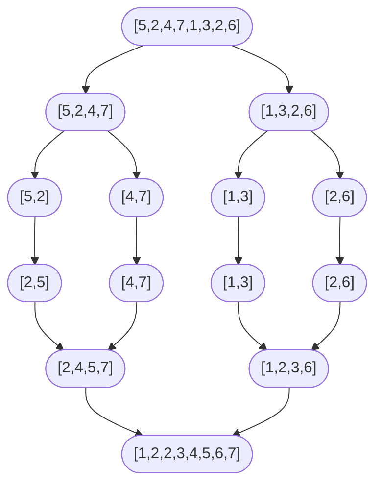

# Comparison sorts I: insertion sort and merge sort

A sorted array is the precondition that turns binary search into O(log n), prefix-sum scans into O(n), and the two-pointer arsenal of [the previous chapter](./02-binary-search-variants.md) into legitimate first reaches. Something has to produce that precondition. The next two chapters teach the algorithms that do.

This chapter covers two of them, picked because they sit at opposite ends of a spectrum you will reach for repeatedly. Insertion sort is in-place, stable, and runs in Theta(n) on already-sorted input; it loses to almost everything once n grows past a few dozen. Merge sort is allocation-heavy, stable, and runs in Theta(n log n) on every input; it wins almost everywhere except small n. The crossover is so reliable that production sort routines pin it at compile time. Java's Timsort and Python's `list.sort` both use insertion sort for runs shorter than a calibrated minimum (32 to 64 elements depending on input length) and switch to merge above. The two algorithms are not competitors. They are the two ends of a hybrid that ships in every standard library you will use.

## Algorithm A: insertion sort

Insertion sort is the algorithm CLRS teaches first, because the proof of correctness reads off the page.[^1]

```text
function insertion_sort(A):
    for i from 1 to length(A) - 1:
        key = A[i]
        j = i - 1
        while j >= 0 and A[j] > key:
            A[j + 1] = A[j]
            j = j - 1
        A[j + 1] = key
```

The invariant: at the start of each iteration of the outer loop, the prefix `A[0..i-1]` is sorted in non-decreasing order and contains the same elements as the original `A[0..i-1]`. Initialisation: at `i = 1`, the prefix is a single element, trivially sorted. Maintenance: the inner loop shifts elements greater than `key` one slot right, then drops `key` into the gap; after the loop, `A[0..i]` is sorted. Termination: at `i = n`, the entire array is sorted.

Worst case is Theta(n^2). A reverse-sorted input forces the inner loop to walk to the front of the prefix on every outer iteration. Best case is Theta(n): an already-sorted input never enters the inner loop, so total work is one outer-loop pass. Average case (uniform random input) is Theta(n^2). Auxiliary space is O(1); the algorithm sorts in place with one scalar register for `key`.

Insertion sort is **stable** because the inner loop's strict comparison `A[j] > key` shifts only elements strictly greater than `key`; equal keys never get displaced past `key`'s landing position. It is **adaptive**: pre-existing partial order shrinks the inner loop's average distance, dropping the constant. Those two properties are why production stable sorts use insertion sort as their inner loop on short already-sorted runs. They are also why several interview problems reach for insertion sort directly: LC 147 is the algorithm itself on a linked list, and LC 148's small-base-case branch can use it when the chunk under recursion shrinks below a threshold.

## Algorithm B: merge sort

Merge sort is the algorithm to reach for when **stability matters or when the input is a linked list**. Its defining commitment is the merge step: given two sorted halves, walk both with two pointers and emit the smaller front element, breaking ties left-first. That single decision makes the algorithm stable, makes it work on linked lists with O(1) auxiliary space per merge, and makes the recurrence `T(n) = 2T(n/2) + Theta(n)` drop straight out of the recursion tree.[^1]

```python
def sort_array(nums):
    if len(nums) <= 1:
        return list(nums)
    arr = list(nums)
    aux = [0] * len(arr)            # single shared scratch buffer
    _merge_sort(arr, aux, 0, len(arr) - 1)
    return arr


def _merge_sort(arr, aux, lo, hi):
    if lo >= hi:
        return
    mid = lo + (hi - lo) // 2       # Bloch 2006: avoid (lo + hi) // 2
    _merge_sort(arr, aux, lo, mid)
    _merge_sort(arr, aux, mid + 1, hi)
    if arr[mid] <= arr[mid + 1]:
        return                      # already in order; Sedgewick algs4 §2.2.2 short-circuit
    _merge(arr, aux, lo, mid, hi)


def _merge(arr, aux, lo, mid, hi):
    for k in range(lo, hi + 1):
        aux[k] = arr[k]
    i, j, k = lo, mid + 1, lo
    while i <= mid and j <= hi:
        if aux[i] <= aux[j]:        # `<=` keeps stability
            arr[k] = aux[i]; i += 1
        else:
            arr[k] = aux[j]; j += 1
        k += 1
    while i <= mid:
        arr[k] = aux[i]; i += 1; k += 1
    while j <= hi:
        arr[k] = aux[j]; j += 1; k += 1
```

**Solution** — Python ([Java](./03-comparison-sorts-1/lc-912/sol.java) · [C++](./03-comparison-sorts-1/lc-912/sol.cpp) · [Go](./03-comparison-sorts-1/lc-912/sol.go))

```python
# LC 912. Sort an Array (canonical merge sort, top-down with shared aux buffer)
"""Merge sort, top-down, stable.

The merge step uses `<=` (not `<`) when comparing left[i] vs right[j], which
guarantees stability: equal keys from the left half are emitted before equal
keys from the right half. CLRS 4th ed. §2.3.1 calls this the stable-merge
invariant; Sedgewick algs4 §2.2 makes the same observation.
"""
from __future__ import annotations
import sys
from typing import List

sys.setrecursionlimit(10**6)  # top-level once, not per-call.


def sort_array(nums: List[int]) -> List[int]:
    """Sort `nums` in non-decreasing order using merge sort. Returns a new list."""
    if len(nums) <= 1:
        return list(nums)
    arr = list(nums)
    aux = [0] * len(arr)  # single shared scratch buffer
    _merge_sort(arr, aux, 0, len(arr) - 1)
    return arr


def _merge_sort(arr: List[int], aux: List[int], lo: int, hi: int) -> None:
    if lo >= hi:
        return
    mid = lo + (hi - lo) // 2  # Bloch 2006: avoid (lo + hi) // 2 to dodge overflow.
    _merge_sort(arr, aux, lo, mid)
    _merge_sort(arr, aux, mid + 1, hi)
    if arr[mid] <= arr[mid + 1]:
        return  # already in order; Sedgewick algs4 §2.2.2 short-circuit
    _merge(arr, aux, lo, mid, hi)


def _merge(arr: List[int], aux: List[int], lo: int, mid: int, hi: int) -> None:
    # Copy the slice into aux so we can write back into arr in-place.
    for k in range(lo, hi + 1):
        aux[k] = arr[k]
    i, j, k = lo, mid + 1, lo
    while i <= mid and j <= hi:
        if aux[i] <= aux[j]:  # `<=` makes the merge stable.
            arr[k] = aux[i]
            i += 1
        else:
            arr[k] = aux[j]
            j += 1
        k += 1
    while i <= mid:
        arr[k] = aux[i]
        i += 1
        k += 1
    while j <= hi:
        arr[k] = aux[j]
        j += 1
        k += 1
```

Three implementation details are non-negotiable. Skip any of them and the algorithm is still recognisably merge sort, but each skipped detail produces a real bug.

First, **`mid = lo + (hi - lo) / 2`** dodges the integer-overflow bug Joshua Bloch documented in 2006 in `java.util.Arrays.binarySearch` and `mergeSort`, after the bug had lain undetected for nine years inside the JDK.[^2] The two forms are identical on unbounded integers; on signed 32-bit arithmetic, `lo + hi` overflows to negative once the array exceeds 2^30 elements, and the division stays negative, and the recursion runs off the end of the array.

Second, **`<=` (not strict `<`) in the merge** is the stability invariant. Equal keys from the left half emit before equal keys from the right. Replace `<=` with `<` and the sort still produces non-decreasingly-ordered output, but stability silently breaks; the bug is invisible on integer-only sorts and surfaces only when stability is required downstream (multi-key sort by secondary key after a primary-key sort has already ordered the major key).

Third, **`if arr[mid] <= arr[mid + 1]: return`** before the merge call. When the left half's largest element is already at most the right half's smallest, the two halves are already in correct relative order and the merge work is redundant. The check is one comparison; when it triggers, the merge is skipped entirely. Add this one line and merge sort runs in Theta(n) on already-sorted input instead of Theta(n log n). Sedgewick's `algs4` §2.2.2 calls it "Helping with small subarrays and ordered subarrays"; it is exactly the optimisation Timsort generalises across all natural runs in the input.[^3]

## Why the merge step gives you Theta(n log n)

The recurrence `T(n) = 2T(n/2) + Theta(n)` with `T(1) = Theta(1)` solves to `Theta(n log n)` by two equivalent arguments. The recursion-tree argument: the tree has `log_2 n` levels, and the merge work at each level totals exactly `n`, because the disjoint sub-merges partition the original `n` elements among themselves. Multiplying the two gives `n log_2 n`. The master-theorem argument (CLRS §4.5, Case 2 with `a=2`, `b=2`, `f(n)=Theta(n)`, critical exponent `log_b a = 1`) gives the same answer directly.[^1]

The work-per-level structure is what makes merge sort's bound stable across input distributions. Best, average, worst: all `Theta(n log n)`. Insertion sort can do better on already-sorted input (`Theta(n)`) but worse on reverse-sorted (`Theta(n^2)`); merge sort does the same `Theta(n log n)` on every input, with the short-circuit as the one exception that lets pre-sorted inputs sweep through in `Theta(n)`.

Auxiliary space `Theta(n)` comes from the single shared `aux` buffer of length `n`. The recursion stack adds `Theta(log n)`, dominated by the buffer in the array case. For the linked-list variant (LC 148), the auxiliary buffer is unnecessary because pointer rewiring suffices, so total auxiliary space drops to `Theta(log n)`.

The Omega(n log n) lower bound on comparison sorts comes from a decision-tree argument (CLRS §8.1, Theorem 8.1).[^1] Any comparison-based sorting algorithm must distinguish all `n!` permutations of its input; a binary decision tree with `n!` leaves has height at least `log_2(n!) = Omega(n log n)`. Merge sort matches this bound deterministically. Quicksort matches it in expectation only; without randomisation, the worst case is `O(n^2)`. Heap sort matches it deterministically with `O(1)` auxiliary space, which is why heap sort exists despite having lost the cache-locality contest to quicksort and the stability contest to merge sort.

## The stability table

| Algorithm | Time best | Time avg | Time worst | Space (aux) | Stable? | In-place? | Adaptive? |
|---|---|---|---|---|---|---|---|
| Insertion sort | Theta(n) | Theta(n^2) | Theta(n^2) | O(1) | yes | yes | yes |
| Merge sort (top-down) | Theta(n log n) | Theta(n log n) | Theta(n log n) | Theta(n) | yes | no | partial[^3] |
| Merge sort (bottom-up iterative) | Theta(n log n) | Theta(n log n) | Theta(n log n) | Theta(n) | yes | no | no |
| Merge sort on linked list (LC 148) | Theta(n log n) | Theta(n log n) | Theta(n log n) | Theta(log n) | yes | yes | partial |
| Quicksort (median-of-three) | Theta(n log n) | Theta(n log n) | Theta(n^2) | O(log n) | no | yes | no |
| Heap sort | Theta(n log n) | Theta(n log n) | Theta(n log n) | O(1) | no | yes | no |
| Timsort | Theta(n) | Theta(n log n) | Theta(n log n) | Theta(n) | yes | no | yes |

"Adaptive" means the algorithm runs faster on partially-ordered input. "Stable" means equal keys preserve their input order, which matters whenever you compose sorts: sort by department, then by name within department, and the second sort must not disturb the first. "In-place" means O(1) or O(log n) auxiliary space; merge sort fails this on arrays but passes it on linked lists, which is the load-bearing reason LC 148 is the canonical merge-sort interview question.

A concrete stability example. Take the records `[(2, "a"), (1, "b"), (2, "c")]`, sorting by the integer key. A stable sort produces `[(1, "b"), (2, "a"), (2, "c")]`: `"a"` came before `"c"` in the input, and the equal `2` keys preserve that order in the output. An unstable sort might produce `[(1, "b"), (2, "c"), (2, "a")]`, with `"a"` and `"c"` swapped. Both outputs are sorted by integer key. Only the stable one survives composition with a previous sort by string key. This is why every multi-key sort in a database engine, every `ORDER BY a, b` in SQL, and every Pandas `DataFrame.sort_values` call assumes the underlying engine is stable.

The cross-language stability story is sharper than most readers expect. Java's `Arrays.sort(int[])` is dual-pivot quicksort and is **not stable**; `Arrays.sort(Object[])` is Timsort and **is** stable. The split is the production-grade encoding of the trade-off: primitive keys carry no observable secondary key, so stability is irrelevant and quicksort wins on locality; object references may carry secondary keys, so stability is required. C++ `std::sort` is introsort (quicksort plus heap-sort fallback) and is **not stable**; the stable alternative is `std::stable_sort`. Go's `slices.Sort` is pdqsort and **not stable**; `slices.SortStableFunc` is stable. Python's `list.sort` is Timsort and is stable by default. Knowing which language gives you stability without asking is the difference between code that works and code that fails a hidden multi-key test.

## Worked example: merge sort on `[5, 2, 4, 7, 1, 3, 2, 6]`

The recursion tree splits the input into singletons, then merges back up:



*The recursion tree has log_2(8) = 3 levels of merge work, each level totalling exactly n = 8 cell visits.*

The top-level merge is the one that exposes stability. Left half is `[2, 4, 5, 7]`; right half is `[1, 2, 3, 6]`. The two `2`s collide at the second emission slot. Because the merge uses `<=`, the left-half `2` (originally at input index 1) emits before the right-half `2` (originally at input index 6). The output preserves their relative order from the input: `[1, 2_left, 2_right, 3, 4, 5, 6, 7]`. Replace `<=` with strict `<` and the order flips. Stability lost, silently.

> **Interactive widget:** [Sorting visualizer (merge sort + quicksort)](../widgets/w-05-sorting-visualizer.yml) (panel `panel-a`) — rendered on the website; the YAML spec describes the keyframes.

*Static fallback: the recursion tree above plus a freeze-frame at step 16 showing the duplicate-2 tie resolved left-first.*

## Pitfalls

> [!CAUTION]
> **Use `lo + (hi - lo) / 2` for the midpoint, not `(lo + hi) / 2`.** Bloch's 2006 Google Research blog post documents the bug in `java.util.Arrays.binarySearch` and `Arrays.sort`, undetected in the JDK for nine years.[^2] On arrays larger than 2^30 elements, the sum overflows; division by two stays negative; the array access throws `ArrayIndexOutOfBoundsException` (Java) or returns garbage (C). The two forms are equivalent on unbounded integers. They are not equivalent on bounded integer types.

> [!WARNING]
> **Use `<=` not `<` in the merge.** Strict `<` produces sorted output but breaks stability; on tie, the right half wins instead of the left. The bug is silent on integer-only sorts. It surfaces only when stability is required downstream, which is exactly when nobody is watching for it.

> [!WARNING]
> **Allocate the auxiliary array once, at the top.** The textbook CLRS pseudocode allocates fresh `left[]` and `right[]` arrays on every merge call, doing Theta(n log n) total allocations across the whole sort. One shared buffer of length n, allocated at the top and passed by reference, does exactly one allocation. Sedgewick's `algs4` §2.2.2 calls this "Reuse of an auxiliary array".[^3] Every production stable sort does it.

> [!WARNING]
> **C++ `std::sort` and Go `slices.Sort` are not stable.** When stability is required, call `std::stable_sort` (C++) or `slices.SortStableFunc` (Go) explicitly. Python's `list.sort` and Java's `Arrays.sort(Object[])` are stable by default (both Timsort), so the explicit-stable opt-in is unnecessary in those two languages. Knowing the default for your language is the prerequisite for trusting the standard library on multi-key sorts.

> [!WARNING]
> **The "already sorted" short-circuit is not in the textbook pseudocode.** The CLRS reference implementation does not include `if arr[mid] <= arr[mid+1]: return`; readers translating CLRS verbatim ship merge sort that runs in Theta(n log n) on already-sorted input rather than the achievable Theta(n). Add the one-liner. It pays for itself on any input that has even modest pre-existing order, and on inputs that arrive already sorted (a surprisingly common shape in production), it cuts wall-clock time by a factor proportional to log n.

## Problem ladder

Merge sort's canonical applications are intrinsically Medium or Hard once the trivial sort wrapper at LC 912 is taken. The Easy candidates that exist (LC 21 Merge Two Sorted Lists, LC 88 Merge Sorted Array) are owned by the linked-list and array chapters where the merge step is the topic and the surrounding sort is not. CORE here lands at M+M+H, which is the honest curation; STRETCH adds one more inversion-counting variant.

### CORE (solve all to claim chapter mastery)

- [LC 912 — Sort an Array](https://leetcode.com/problems/sort-an-array/) [Medium] • merge-sort ★
- [LC 148 — Sort List](https://leetcode.com/problems/sort-list/) [Medium] • merge-sort + linked-list-mid
- [LC 315 — Count of Smaller Numbers After Self](https://leetcode.com/problems/count-of-smaller-numbers-after-self/) [Hard] • merge-sort + inversion-counting

### STRETCH (optional)

- [LC 493 — Reverse Pairs](https://leetcode.com/problems/reverse-pairs/) [Hard] • merge-sort + inversion-counting

The inversion-counting payoff is the chapter's deepest reward. An *inversion* is a pair `(i, j)` with `i < j` and `nums[i] > nums[j]`; LC 315 asks for the count of such pairs ending at each index. The naive `O(n^2)` solution counts every pair directly. The merge-sort solution decorates the merge step: when an element from the right half emits before all left-half elements at the current cursor have emitted, every remaining left element is `>` than the right element and sits at a smaller index in the original input, so each remaining left element contributes one inversion against the emitted right element. The counter increments by `mid - i + 1` at that step. Total counter work across all merges is `O(n)` per level times `log n` levels, so the algorithm runs in `O(n log n)` overall. LC 493 changes the predicate to `nums[i] > 2 * nums[j]` and needs a separate pre-merge counting pass (the predicate is no longer monotone in the merge order alone), but the substrate is the same algorithm. Once the merge counter idiom clicks, the entire family of "count pairs satisfying a monotone predicate" problems collapses to one template.

## Where this leads

The next chapter, [Comparison sorts II: quicksort and partition](./04-comparison-sorts-2.md), pairs with this one in the dual-panel widget so you can scrub merge sort and quicksort side by side on the same input. Quicksort is the in-place average-case winner that gives up stability for cache locality. Merge sort is the stable worst-case winner that gives up locality for predictability. Watching both algorithms process the same eight elements is the fastest way to internalise the contrast.

The chapter after that, [Heap sort and the n log n lower bound](./05-heap-sort.md), proves why neither algorithm can do better than Theta(n log n) in the comparison-based model, and shows the third O(n log n) sort that achieves it in O(1) auxiliary space.

## References

[^1]: Cormen, Leiserson, Rivest, Stein, *Introduction to Algorithms*, 4th ed., MIT Press, 2022.

[^2]: Joshua Bloch, "Extra, Extra — Read All About It: Nearly All Binary Searches and Mergesorts are Broken," *Google Research blog*, June 2, 2006. <https://research.google/blog/extra-extra-read-all-about-it-nearly-all-binary-searches-and-mergesorts-are-broken/>.

[^3]: Robert Sedgewick and Kevin Wayne, *Algorithms*, 4th ed., Addison-Wesley, 2011, §2.2 "Mergesort". §2.2.2 covers the practical optimisations: shared auxiliary array, the already-sorted short-circuit, and the insertion-sort cutoff for small subarrays. Online at <https://algs4.cs.princeton.edu/22mergesort/>.
