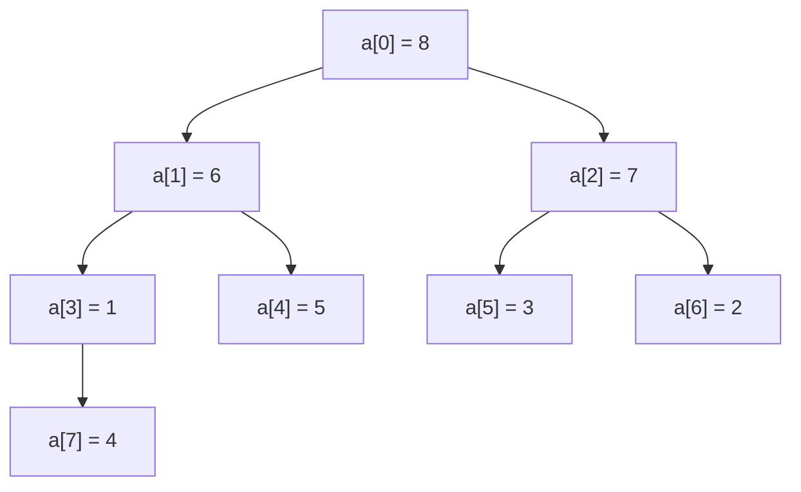
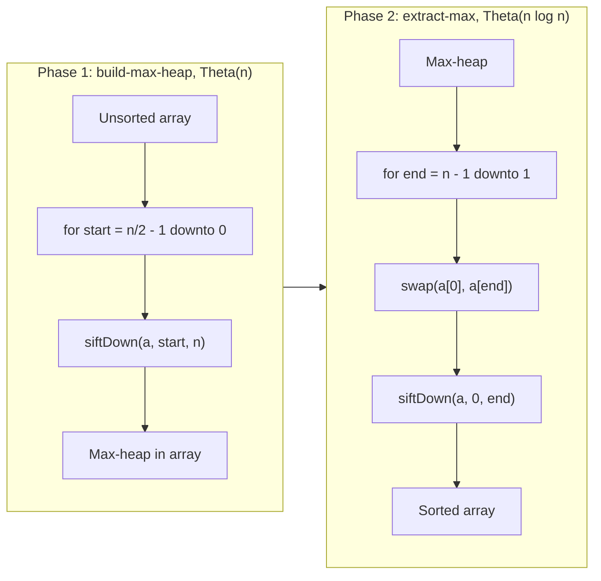

# Heap sort and the n log n lower bound

The Linux kernel's sort routine in `lib/sort.c` opens with a comment that justifies its choice of algorithm in two sentences. The kernel uses heap sort. Quicksort, the comment says, suffers from exploitable quadratic worst-case behaviour and extra memory requirements that make it unsuitable for kernel use. Most application code never hits that constraint. The kernel does. Adversarial input is real (kernel data structures are routed by user-controlled hash keys), and a Theta(n) auxiliary buffer inside an interrupt handler is not an option. Heap sort is what is left when both constraints bind.

This chapter teaches heap sort because of those two constraints, and because the build-max-heap analysis is the cleanest example of amortised reasoning on tree-shaped state in the book.[^1] The chapter also closes Part 2's argument about why [Comparison sorts I](./03-comparison-sorts-1.md), [Comparison sorts II](./04-comparison-sorts-2.md), and heap sort all converge on Theta(n log n): a decision-tree lower bound that no comparison-based sort can beat. After this chapter, [Linear-time sorts](./06-linear-sorts.md) shows the algorithms that escape the bound by leaving the comparison model entirely.

## What a binary heap is

A binary max-heap on n elements is a complete binary tree where every parent is at least as large as both children. The "complete" condition (every level full except possibly the last, which fills left-to-right) is what lets the tree live implicitly inside a flat array. For zero-based indices, the parent of index `i` sits at `(i - 1) // 2`, the left child at `2i + 1`, the right child at `2i + 2`. No pointers. No per-node allocation. The heap *is* the array.



*The array `[8, 6, 7, 1, 5, 3, 2, 4]` rendered as the tree it implicitly is. Index 0 is the root; index 3 is the left child of index 1; index 7 is the left child of index 3. Every parent dominates its children, so the heap property holds at every node.*

For n elements, indices `[n // 2, n)` are leaves and indices `[0, n // 2)` are internal. The last internal node sits at index `(n // 2) - 1`. Leaves are trivially valid one-node heaps. Every interesting question about a heap is a question about its internal nodes.

## The primitive: sift-down

Heap sort needs exactly one routine. Call it `siftDown(a, root, end)`. It takes a node `root` whose two child subtrees are *already valid max-heaps*, and it pushes `root`'s value down until the heap property holds at `root` too.

```text
function sift_down(a, root, end):
    while True:
        left = 2 * root + 1
        if left >= end: return                  # root is a leaf; nothing below
        right = left + 1
        child = left
        if right < end and a[right] > a[left]:
            child = right                       # pick the larger child
        if a[root] >= a[child]: return          # heap property holds; stop
        swap(a[root], a[child])
        root = child                            # follow the value down
```

Two details earn their lines. The choice of larger child matters: swapping with the smaller child can leave a parent that is still smaller than its other child, which violates the heap property at the next step. The `>=` short-circuit (not `>`) is what makes equal-key inputs cost Theta(n) instead of Theta(n log n) — the loop exits the first time it sees a non-strict violation, so an all-equal heap does no work after the first comparison.

The precondition is the part most readers skip and pay for. CLRS §6.2 names it explicitly: MAX-HEAPIFY assumes the binary trees rooted at LEFT(i) and RIGHT(i) are max-heaps, but A[i] may be smaller than its children.[^2] If you call `siftDown` on a node whose children are not yet heaps, the routine fixes the violation at `root` but ignores deeper violations; the resulting structure is not a heap. This is why phase 1 below visits internal nodes right-to-left, not left-to-right. The order is not stylistic.

There is a sibling primitive called `siftUp` that walks a value from a leaf up to the root. It is the operation a streaming priority queue uses on `push` ([Heaps and the top-K pattern](../part-6-trees-heaps/04-heaps-priority-queues.md) covers it). Heap sort does not need it. The whole-array build can be done more cheaply with `siftDown` going the other direction, and that fact is the chapter's payoff.

## Phase 1: Floyd's build-max-heap

Given an unsorted array of length n, turn it into a max-heap in place. The naive plan would be to insert the n elements one by one into a growing heap, sifting each new arrival up to its place: n calls, each costing up to O(log n), total Theta(n log n). Floyd's 1964 algorithm 245[^5] does it differently. Loop right-to-left from the last internal node. At each step, both child subtrees are already valid heaps (by induction; leaves are trivially valid and we visit nodes bottom-up). Call `siftDown` on the current node; the precondition holds; the heap property gets installed one node at a time, and after the loop the whole array is a heap.

```text
function build_max_heap(a):
    n = length(a)
    for start in (n // 2 - 1) down to 0:
        sift_down(a, start, n)
```

The loop bound is the half of the array readers most often get wrong. Indices `[n // 2, n)` are leaves; the last internal node is at `(n - 2) // 2`, which equals `n // 2 - 1` for both odd and even n (verify: n=6 gives `(6-2)//2 = 2 = 6//2 - 1`; n=7 gives `(7-2)//2 = 2 = 7//2 - 1`). Memorise the form `n // 2 - 1` and write a comment when you use it. Off-by-one errors here are silent: you waste work on a leaf, the algorithm still gets the right answer, so they survive a passing test suite.

### Why this phase costs Theta(n) and not Theta(n log n)

The naive expectation is Theta(n log n): n calls to a primitive that costs O(log n) each. That estimate is too generous, and the exactly-how-much-too-generous is the chapter's central insight.

A node at height h in the heap can be sifted down at most h levels. (Height 0 is a leaf, which can move zero levels; the root's height is `floor(log n)`.) A binary heap on n nodes has at most `ceil(n / 2^(h+1))` nodes at height h. Summing the cost across all heights:

```text
T(n) <= sum over h from 0 to floor(log n) of  ceil(n / 2^(h+1)) * h
     <= n * sum over h from 0 to infinity   of  h / 2^(h+1)
     == n * 1
     == O(n)
```

The infinite-series identity `sum_{h>=0} h / 2^(h+1) = 1` is the load-bearing fact.[^2] The series converges because each term shrinks geometrically; the sum equals 1 by direct telescoping.

Sedgewick's geometric phrasing makes the bound concrete without the formal series.[^3] The last n/2 array slots are leaves and need zero work. The next n/4 are at height 1 and need at most one swap. The next n/8 are at height 2 and need at most two swaps. The total is bounded above by `n/2 * 0 + n/4 * 1 + n/8 * 2 + ... < n`, with at most n exchanges and at most 2n comparisons across the whole build. Same answer, two derivations.

The contrast with sift-up insertion is the punchline. Williams' 1964 algorithm 232 builds the heap by repeatedly inserting elements at the bottom and sifting up to the root.[^6] Half the calls land on heaps of size at least n/2; three-quarters land on heaps of size at least n/4; and so on. The sum is `lg 1 + lg 2 + ... + lg n = lg(n!) ~ n lg n` by Stirling. Same outer-loop count, same primitive (one tree-height descent per call), opposite asymptotic bound. Floyd does most calls on small heaps; Williams does most calls on large heaps. Where the work concentrates is the whole story.

## Phase 2: extract-max into the suffix

After phase 1 the entire array is a max-heap, so `a[0]` is the maximum. Phase 2 walks that maximum to the end of the array, shrinks the heap by one cell, and repeats.

```text
function extract_phase(a):
    n = length(a)
    for end in (n - 1) down to 1:
        swap(a[0], a[end])         # move current max to its final slot
        sift_down(a, 0, end)        # restore heap on the shrunk prefix [0, end)
```

The accounting is straightforward. Each iteration swaps the root into the suffix (constant work) and calls `siftDown` on a heap of size at most n (O(log n) work). The loop runs n - 1 times. Total work: Theta(n log n).

The two phases together give the algorithm:

```python
def heap_sort(nums):
    n = len(nums)
    # Phase 1: Floyd's build-max-heap, right-to-left from last internal node.
    for start in range(n // 2 - 1, -1, -1):
        _sift_down(nums, start, n)
    # Phase 2: extract max repeatedly into the sorted suffix.
    for end in range(n - 1, 0, -1):
        nums[0], nums[end] = nums[end], nums[0]
        _sift_down(nums, 0, end)
    return nums


def _sift_down(a, root, end):
    while True:
        left = 2 * root + 1
        if left >= end:
            return
        right = left + 1
        child = left
        if right < end and a[right] > a[left]:
            child = right
        if a[root] >= a[child]:
            return
        a[root], a[child] = a[child], a[root]
        root = child
```

**Solution** — Python ([Java](./05-heap-sort/lc-912/sol.java) · [C++](./05-heap-sort/lc-912/sol.cpp) · [Go](./05-heap-sort/lc-912/sol.go))

```python
# LC 912. Sort an Array — heap-sort reference (in-place, O(n log n) worst case)
from typing import List


def heap_sort(nums: List[int]) -> List[int]:
    n = len(nums)
    # Phase 1: Floyd's build-max-heap, right-to-left from last internal node.
    for start in range(n // 2 - 1, -1, -1):
        _sift_down(nums, start, n)
    # Phase 2: extract max repeatedly into the sorted suffix.
    for end in range(n - 1, 0, -1):
        nums[0], nums[end] = nums[end], nums[0]
        _sift_down(nums, 0, end)
    return nums


def _sift_down(a: List[int], root: int, end: int) -> None:
    """Restore max-heap property at `root`, assuming both child subtrees
    are valid max-heaps and the heap occupies indices [0, end)."""
    while True:
        left = 2 * root + 1
        if left >= end:
            return
        right = left + 1
        child = left
        if right < end and a[right] > a[left]:
            child = right
        if a[root] >= a[child]:
            return
        a[root], a[child] = a[child], a[root]
        root = child
```

The four implementations are written without standard-library heap support: no `heapq`, no `PriorityQueue`, no `std::priority_queue`, no `container/heap`. Once `siftDown` is unboxed, swapping in language-stdlib heaps is a one-line refactor — Python's `heapify` *is* Floyd's build, and CPython's `heapq._siftup` and `_siftdown` are written iteratively for the same reason this chapter writes them iteratively.[^3]



*Both phases share the `siftDown` primitive but invert which end of the array is "live." Phase 1 builds the heap right-to-left across the internal nodes. Phase 2 swaps the root to the suffix, shrinks the heap, repairs at the root.*

## Worked example: heap sort on `[5, 2, 3, 1]`

Phase 1: build-max-heap. Last internal node at index `(4 // 2) - 1 = 1`. Iterate `start = 1, 0`.

| `start` | Before | After siftDown | Note |
|---|---|---|---|
| 1 | `[5, 2, 3, 1]` | `[5, 2, 3, 1]` | Node `a[1]=2` has left child `a[3]=1`; `2 >= 1`, no swap |
| 0 | `[5, 2, 3, 1]` | `[5, 2, 3, 1]` | Root `a[0]=5` has children `2, 3`; `5 >= 3`, no swap |

The input was already a max-heap. Total comparisons in phase 1: roughly three.

Phase 2: extract max repeatedly.

| `end` | Before | After swap | After siftDown on `[0, end)` |
|---|---|---|---|
| 3 | `[5, 2, 3, 1]` | `[1, 2, 3, 5]` | `[3, 2, 1, 5]` (1 swapped with larger child 3) |
| 2 | `[3, 2, 1, 5]` | `[1, 2, 3, 5]` | `[2, 1, 3, 5]` (1 swapped with larger child 2) |
| 1 | `[2, 1, 3, 5]` | `[1, 2, 3, 5]` | heap of size 1, base case |

Final array: `[1, 2, 3, 5]`. Three iterations, each doing O(log n) work; total phase-2 work fits inside the Theta(n log n) ceiling with room to spare on this small input.

## The n log n lower bound

CLRS §8.1 Theorem 8.1: any comparison-based sorting algorithm requires Omega(n log n) comparisons in the worst case.[^4] The proof is a decision-tree argument. Any deterministic comparison sort can be modelled as a binary tree where each internal node is a comparison and each leaf is a permutation of the input. To distinguish all n! input permutations the tree must have at least n! leaves. A binary tree with n! leaves has minimum height `ceil(lg(n!)) = Omega(n log n)` by Stirling's approximation `n! ~ sqrt(2 pi n) (n / e)^n`. The height of the decision tree equals the worst-case comparison count of the algorithm. Therefore Omega(n log n).

Heap sort matches this bound asymptotically and is therefore *asymptotically optimal* among comparison-based sorts. Merge sort and well-tuned quicksort match it too; heap sort is the only one of the three that achieves the bound *deterministically and in place*.[^4] [Linear-time sorts](./06-linear-sorts.md) covers the algorithms that escape this bound (counting sort, radix sort, bucket sort) and shows what they pay for the privilege: the input must be drawn from a domain that the comparison model does not permit them to assume.

## Why heap sort loses to quicksort in practice

Heap sort and quicksort have the same average-case asymptotic. On random integer arrays, well-tuned quicksort is two to three times faster. The reason is cache locality.[^7]

Quicksort's partition step is a linear scan over a contiguous range. The CPU prefetcher recognises the access pattern and pulls cache lines ahead of the read pointer; a modern x86 core can sustain near-DRAM-bandwidth throughput on this loop. Recursion narrows the working set, which keeps later passes inside L2 and then L1. The whole algorithm is friendly to every layer of the memory hierarchy.

Heap sort's `siftDown` step does the opposite. Following an index `i` to its child at `2i + 1` is a long jump in physical memory: for n = 10^6, the root's children are 4 bytes away, but at depth 20 the children are megabytes apart. The prefetcher cannot guess where the next read will land because the jumps follow data, not address arithmetic. Every level of the sift may miss the cache. A microbenchmark on random integer input from the Wikipedia "Heapsort" comparison-with-quicksort entry pegs the slowdown at the same two-to-three-times factor regardless of n, attributable almost entirely to the locality difference.[^7]

This is the honest answer about heap sort: it is rarely the right algorithm in practice. Quicksort wins on cache. Merge sort wins on stability and parallelism. Heap sort wins exactly where it must — when the worst case has to be `O(n log n)` deterministically and the memory budget is `O(1)`. Two contexts where both constraints bind, and heap sort ships:

| System | Use of heap sort | Why |
|---|---|---|
| Linux kernel `lib/sort.c` | Primary algorithm | Worst-case O(n log n) AND O(1) auxiliary, both binding[^1] |
| `std::sort` (libstdc++, libc++) | Fallback inside introsort | Triggered when quicksort recursion depth exceeds 2 lg n[^7] |

The introsort case is where most production code meets heap sort. David Musser's 1997 design runs median-of-three quicksort but tracks recursion depth; when the depth threshold trips, the algorithm aborts the recursive call and runs heap sort on the remaining sub-range. The hybrid combines quicksort's average-case constant factor with heap sort's worst-case guarantee. Most calls never hit the threshold; the few that would have gone quadratic get rescued. This is why `std::sort` advertises a guaranteed O(n log n) bound when its inner engine is quicksort, which on its own does not. The answer is that `std::sort` is not quicksort. It is introsort, and the back-up cabinet is full of heap sort. [Comparison sorts II](./04-comparison-sorts-2.md) develops introsort end-to-end.

## What it actually costs

| Variant | Time | Space (aux) | Notes |
|---|---|---|---|
| Build-max-heap (Floyd, sift-down) | Theta(n) | O(1) | Height-weighted summation, [^2] |
| Build-max-heap (Williams, sift-up insert) | Theta(n log n) | O(1) | `lg(n!) ~ n lg n` by Stirling, [^3] |
| Extract phase (n - 1 sift-downs) | Theta(n log n) | O(1) | n - 1 calls of O(log n) each |
| Heap sort overall, distinct keys | Theta(n log n) | O(1) | No fast case for distinct keys, [^4] |
| Heap sort overall, all equal | Theta(n) | O(1) | The `>=` short-circuit fires immediately |
| Lower bound for any comparison sort | Omega(n log n) | n/a | Decision-tree, CLRS Theorem 8.1, [^4] |

Auxiliary space is genuinely O(1). The heap lives inside the input array, the sorted suffix grows in place, and the iterative `siftDown` allocates no stack frames. Total space is Theta(n), which is the input itself; everything else is a handful of indices.

The build-vs-extract decomposition is worth keeping in mind even when the build-phase optimisation does not change the asymptotic. Phase 1 is Theta(n); phase 2 is Theta(n log n); the total is Theta(n log n) regardless. But the same height-weighted argument that buys us Theta(n) for the build returns in the analysis of [Union-Find](../part-8-graphs/08-union-find.md) with rank, in [Monotonic stack](../part-4-stack-queue-patterns/01-monotonic-deque.md) amortisation, and anywhere the work-per-call concentrates on small subproblems. It is the chapter's most transferable export.

## Pitfalls

> [!WARNING]
> **Do not call `siftDown` on a node whose child subtrees are not yet heapified.** The primitive's precondition is named explicitly in CLRS §6.2: MAX-HEAPIFY assumes the binary trees rooted at LEFT(i) and RIGHT(i) are already max-heaps, but A[i] may be smaller than its children.[^2] Floyd's right-to-left loop is the only order that maintains this precondition by induction. Call `siftDown` on the root before the children are heapified, and the routine fixes the root's violation while ignoring deeper ones; the resulting structure satisfies the heap property at the root but not below. Phase 2's extract then returns wrong answers.

> [!WARNING]
> **Build by sift-up, lose Theta(n) for free.** A reflexive `for i in range(n): siftUp(a, i)` is correct but Theta(n log n) instead of Theta(n). Use Floyd's sink-based build (right-to-left siftDown loop) when the input is already in memory. Sift-up is the right primitive for streaming insert into a priority queue, where the elements arrive one at a time and the heap must be valid after every push; that use case is [Heaps and the top-K pattern](../part-6-trees-heaps/04-heaps-priority-queues.md), not heap sort.

> [!WARNING]
> **Heap sort is not stable.** A swap during sift-down can reorder equal keys arbitrarily; phase 2's root-to-suffix swap also disregards input order. If your problem requires stable sorting on equal keys (multi-key sort, ranking with ties), use merge sort or Timsort instead. The Python `list.sort()` and Java `Arrays.sort(Object[])` defaults are both Timsort, both stable; switching silently to a heap-based or quicksort-based sort breaks code that relied on stability.

> [!WARNING]
> **Off-by-one on the last internal node is silent.** Writing `for start in range(n // 2, -1, -1)` runs one extra iteration on a leaf, harmless wasted work, but it survives every test. Writing `for start in range((n - 1) // 2, -1, -1)` happens to be correct only because of how integer division aligns; do not rely on the algebra. Memorise the form `n // 2 - 1` and write a comment when you use it.

> [!WARNING]
> **Recursive sift-down breaks on adversarial input in some languages.** Python's default recursion limit is 1000, and `log_2(10^5) ~ 17`, so a recursive port survives most LC inputs. But a port that recurses on every step (rather than iterating with `root = child`) builds a frame per swap, and a careless variant can blow the stack. Write `siftDown` iteratively as the four reference files do; CPython's stdlib `heapq` does the same.

## Problem ladder

This chapter teaches the heap-sort algorithm and the n log n decision-tree bound; it does not stake a claim on heap-as-data-structure problems. The interview-canonical heap problems (LC 215 Kth Largest, LC 23 Merge k Sorted Lists, LC 295 Find Median from Data Stream, LC 703 Kth Largest in a Stream) are owned by [Heaps and the top-K pattern](../part-6-trees-heaps/04-heaps-priority-queues.md) and [Quickselect](./07-quickselect.md), where heaps are framed as a priority-queue data structure rather than a sort. Two warm-ups below land the phase-2 mechanics (build a max-heap, repeatedly extract, modify, push back) on a smaller surface; both are optional.

- [LC 1962 — Remove Stones to Minimize the Total](https://leetcode.com/problems/remove-stones-to-minimize-the-total/) [Medium] • heap-extract
- [LC 1046 — Last Stone Weight](https://leetcode.com/problems/last-stone-weight/) [Easy] • heap-extract

## Where this leads

[Linear-time sorts](./06-linear-sorts.md) shows the algorithms that escape the n log n lower bound by leaving the comparison model. Counting sort exploits bounded integer keys; radix sort exploits fixed-width keys; bucket sort exploits uniform distribution. Each carries a precondition that fails the lower bound's premise, and each runs in Theta(n) when the precondition holds. After that, [Quickselect](./07-quickselect.md) presents the linear-time alternative to heap-based top-K when the input is offline and only the k-th element is wanted, not the full sorted order.

## References

[^1]: Linus Torvalds et al., Linux kernel source, `lib/sort.c`, file header comment "A fast, small, non-recursive O(n log n) sort for the Linux kernel" and `sort_r` doc comment. <https://github.com/torvalds/linux/blob/master/lib/sort.c>.

[^2]: Cormen, Leiserson, Rivest, Stein, *Introduction to Algorithms*, 4th ed., MIT Press, 2022.

[^3]: Robert Sedgewick and Kevin Wayne, *Algorithms*, 4th ed., Addison-Wesley, 2011, §2.4 "Priority Queues". Online at <https://algs4.cs.princeton.edu/24pq/>.

[^4]: CLRS 4e, §8.1 Theorem 8.1: "Any comparison sort algorithm requires Omega(n log n) comparisons in the worst case." Decision-tree proof. §6.4 Exercise 6.4-5: heapsort has no fast cases on distinct keys.

[^5]: Robert W. Floyd, "Algorithm 245: Treesort," *Communications of the ACM*, 7(12):701, December 1964.

[^6]: J. W. J. Williams, "Algorithm 232: Heapsort," *Communications of the ACM*, 7(6):347-348, June 1964.

[^7]: Wikipedia, "Heapsort," §"Comparison with other sorts." A well-implemented quicksort is typically two to three times faster than heapsort, attributable to "much better locality of reference: partitioning is a linear scan with good spatial locality, and the recursive subdivision has good temporal locality." Introsort fallback discussion in the same section. <https://en.wikipedia.org/wiki/Heapsort>.
