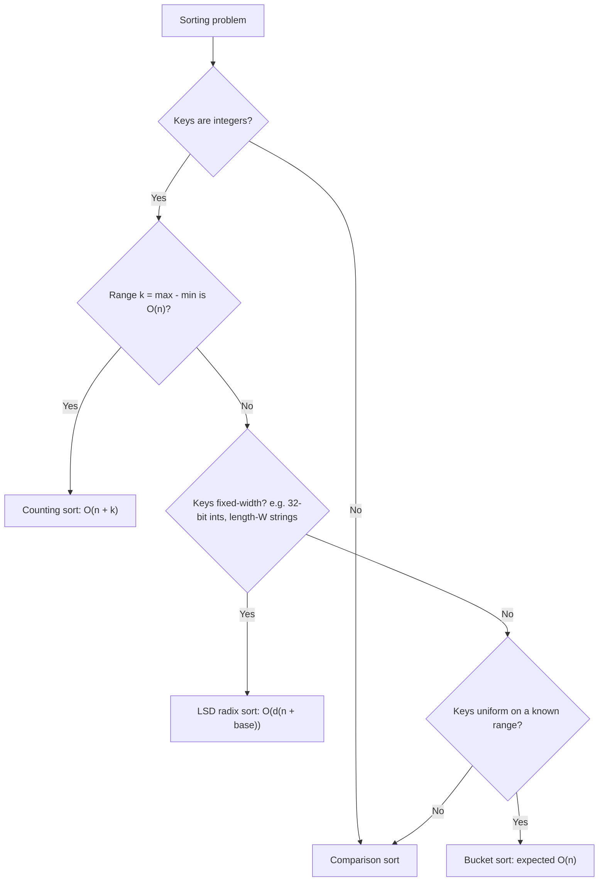

# Linear-time sorts: counting, radix, bucket

[Heap sort](./05-heap-sort.md) closed with a wall: any sort that decides output by comparing pairs of input elements does at least Omega(n log n) comparisons in the worst case. The proof is a decision tree with n! leaves whose minimum height is `lg(n!) = Omega(n log n)`. The wall is information-theoretic. No cleverness in the comparison model gets around it.

So how does Linux's `kfifo_alloc` sort 32-bit packet IDs in linear time? How does a Pandas histogram on a million integer values run faster than a `.sort()` call would? Three algorithms exit the comparison model entirely. None of them compares keys to each other. Counting sort indexes a count array directly by key value. Radix sort dispatches keys by digit. Bucket sort dispatches keys by interval. Each replaces a comparison (variable-time-per-pair) with an array index (constant-time-per-key), and the lower bound's premise no longer applies.

The catch is the same in every case: each algorithm carries a precondition the input must satisfy. Counting sort wants a bounded integer range. Radix sort wants fixed-width keys. Bucket sort wants uniform distribution. The precondition is what buys you sub-O(n log n). Sorting an arbitrary `int[]` cannot be done in linear time. Sorting an `int[]` where every value lives in `[0, 1000]` can, in `O(n + 1000) = O(n)` time. The chapter's spine is identifying which precondition each algorithm wants and matching it to a problem signal.

## Three preconditions, three algorithms



*Pick the linear-time sort whose precondition the input satisfies. When none does, fall back to comparison sort. The interview tell for each branch is a constraint stated in the problem: `0 <= nums[i] <= 1000` (counting), `nums[i] is a 32-bit unsigned int` (radix), `keys are uniform on [0, 1)` (bucket).*

The decisive cue, the one to leave with: **sub-O(n log n) sorting is on the table only when the input distribution allows.** The instant the precondition breaks, comparison sort retakes the chapter. CLRS Chapter 8 spends three sections making this point three different ways: §8.1 proves the lower bound for the comparison model, §8.2 to §8.4 introduce the three escapes.[^1]

## Counting sort

Counting sort over a bounded integer key range. Three linear passes: histogram, prefix sum, scatter.

```python
def counting_sort(nums):
    if not nums:
        return []
    lo = min(nums)
    hi = max(nums)
    k = hi - lo + 1
    count = [0] * k
    for x in nums:
        count[x - lo] += 1
    # Prefix sum: count[i] becomes the index AFTER the last slot for key (lo + i).
    for i in range(1, k):
        count[i] += count[i - 1]
    out = [0] * len(nums)
    # Walk input back-to-front to preserve stability.
    for x in reversed(nums):
        count[x - lo] -= 1
        out[count[x - lo]] = x
    return out
```

**Solution** — Python ([Java](./06-linear-sorts/sol.java) · [C++](./06-linear-sorts/sol.cpp) · [Go](./06-linear-sorts/sol.go))

```python
# LC 274. H-Index (Medium)
# LC 1122. Relative Sort Array (Easy)
# LC 164. Maximum Gap (Hard)
# LC 451. Sort Characters By Frequency (Medium)
from collections import Counter
from typing import List


def counting_sort(nums: List[int]) -> List[int]:
    """Stable counting sort over bounded integer keys.

    Time:  O(n + k) where k = max(nums) - min(nums) + 1.
    Space: O(n + k).
    Stability: equal keys keep their relative order. The back-to-front
    walk (with decrement-before-write) is what makes that hold; forward
    scatter would invert it.
    """
    if not nums:
        return []
    lo = min(nums)
    hi = max(nums)
    k = hi - lo + 1
    count = [0] * k
    for x in nums:
        count[x - lo] += 1
    # Prefix sum: count[i] becomes the index AFTER the last slot for key (lo + i).
    for i in range(1, k):
        count[i] += count[i - 1]
    out = [0] * len(nums)
    # Walk input back-to-front to preserve stability.
    for x in reversed(nums):
        count[x - lo] -= 1
        out[count[x - lo]] = x
    return out


def h_index(citations: List[int]) -> int:
    """LC 274 H-Index via counting sort with the cap-at-n trick.

    The answer is bounded by n by definition (you cannot have an h-index
    higher than the number of papers you have written), so any citation
    count above n is structurally equivalent to n. Capping collapses the
    universe from arbitrary integers to [0, n], so counting sort runs in
    O(n) time and space regardless of the raw input range.
    """
    n = len(citations)
    count = [0] * (n + 1)
    for c in citations:
        count[min(c, n)] += 1
    total = 0
    for h in range(n, -1, -1):
        total += count[h]
        if total >= h:
            return h
    return 0


def relative_sort_array(arr1: List[int], arr2: List[int]) -> List[int]:
    """LC 1122 Relative Sort Array. Constraints fix value range to [0, 1000],
    so a 1001-bucket count array always works. Once the count table exists,
    the emission order is a free design parameter: arr2's order first, then
    the remaining keys in ascending order.
    """
    count = [0] * 1001
    for x in arr1:
        count[x] += 1
    out: List[int] = []
    for x in arr2:
        out.extend([x] * count[x])
        count[x] = 0
    for v in range(1001):
        if count[v]:
            out.extend([v] * count[v])
    return out


def maximum_gap(nums: List[int]) -> int:
    """LC 164 Maximum Gap via pigeonhole bucket sort.

    Pigeonhole forces at least one of (n - 1) equal-width buckets to be
    empty, so the maximum gap MUST cross a bucket boundary. Each bucket
    only needs (min, max); the full sorted contents are not needed.
    Linear in n.
    """
    if len(nums) < 2:
        return 0
    lo, hi = min(nums), max(nums)
    if lo == hi:
        return 0
    n = len(nums)
    width = max(1, (hi - lo + n - 2) // (n - 1))
    n_buckets = (hi - lo) // width + 1
    INF = float("inf")
    bmin = [INF] * n_buckets
    bmax = [-INF] * n_buckets
    for x in nums:
        i = (x - lo) // width
        bmin[i] = min(bmin[i], x)
        bmax[i] = max(bmax[i], x)
    best = 0
    prev_max = lo
    for i in range(n_buckets):
        if bmin[i] == INF:
            continue
        best = max(best, int(bmin[i]) - prev_max)
        prev_max = int(bmax[i])
    return best


def frequency_sort(s: str) -> str:
    """LC 451 Sort Characters By Frequency via bucket sort indexed by
    occurrence count. The frequency of any character in a length-n string
    is in [1, n], so n + 1 frequency buckets cover every case; iterating
    buckets from n down to 1 emits in descending-frequency order.
    """
    freq = Counter(s)
    n = len(s)
    buckets: List[List[str]] = [[] for _ in range(n + 1)]
    for ch, f in freq.items():
        buckets[f].append(ch)
    out: List[str] = []
    for f in range(n, 0, -1):
        for ch in buckets[f]:
            out.append(ch * f)
    return "".join(out)


if __name__ == "__main__":
    cases = [
        ([4, 2, 2, 8, 3, 3, 1], [1, 2, 2, 3, 3, 4, 8]),
        ([], []),
        ([5, 5, 5], [5, 5, 5]),
        ([0, 1, 0, 2, 1, 0], [0, 0, 0, 1, 1, 2]),
        ([-3, -1, -2, 0, -1], [-3, -2, -1, -1, 0]),
    ]
    for nums, expected in cases:
        assert counting_sort(nums) == expected, (nums, expected)
    assert h_index([3, 0, 6, 1, 5]) == 3
    assert maximum_gap([3, 6, 9, 1]) == 3
    print("PASS")
```

No comparisons. Time `O(n + k)`. Space `O(n + k)`.

The back-to-front scatter is the stability invariant, and it is the one detail readers most often skip and pay for. When we place a key, we decrement its count *before* writing, so the LAST occurrence in the input lands at the HIGHEST position within its bucket. Equal keys keep their input order. Forward scatter (incrementing as you go) inverts that and produces a non-stable sort. CLRS §8.2 proves stability of exactly this back-to-front formulation; its inductive argument is on the loop iteration count, and the induction breaks the moment you walk forward.[^1]

Stability is not cosmetic. Radix sort calls counting sort once per digit, and the per-digit subroutine *must* be stable for radix sort to produce sorted output at all. The chapter's most painful debugging session is a radix sort that uses a forward-scatter counting sort as its inner loop: the output is correct on the high digit and arbitrary on the low.

The trap in calling counting sort "linear" is that O(n + k) is linear in n *only when k is O(n)*. At `n = 1000` and `k = 10^9`, counting sort allocates a billion-cell array and iterates it twice. The algorithm is O(k), not O(n), and worse than every comparison sort on the planet.[^2] The precondition is **bounded** integer keys, not just integer keys. The interview tell is an explicit constraint like `0 <= nums[i] <= 1000`.

### The cap-at-n trick

LC 274 H-Index is the cleanest application of the chapter's most teachable abstraction. The h-index of a citation array is the largest `h` such that `h` papers have at least `h` citations each. Naively, citation counts are unbounded; counting sort doesn't apply.

The fix: any citation count above `n` is structurally equivalent to `n` for the purpose of computing h, because the answer cannot exceed `n` by definition (you cannot have an h-index higher than the number of papers you have written). Cap each citation at `n` and the universe collapses to `[0, n]`. Counting sort applies in `O(n)` time and space regardless of the raw input range.

```python
def h_index(citations):
    n = len(citations)
    count = [0] * (n + 1)
    for c in citations:
        count[min(c, n)] += 1
    total = 0
    for h in range(n, -1, -1):
        total += count[h]
        if total >= h:
            return h
    return 0
```

The interview signal is "the answer is bounded by something derivable from `n`." When you see it, cap the inputs at the same ceiling and counting sort applies. The cap-at-n trick is the chapter's spine: arbitrary integers are unbounded; the problem's structure caps the answer; capping inputs to that ceiling collapses the universe; counting sort runs.

A second variant pushes on the *emission order* rather than the universe. LC 1122 Relative Sort Array fixes the value range at `[0, 1000]` by constraint, so a 1001-bucket count array always works. The output, however, is not ascending; it follows a custom order specified by a second array. Once the count table exists, what you do with it is a design parameter: emit in arr2's order first, then the remaining keys in ascending order. "Counting sort" is really "key-indexed counting"; the sort is the *typical* use of the count table, not the only one.

## LSD radix sort

When keys are integers but the range is too large for direct counting sort (k = 2^32 for 32-bit ints, n = 10^5), sort by digit instead of by value. LSD (least-significant digit) radix sort runs counting sort once per digit position, from lowest to highest:

```text
function lsd_radix_sort(nums, base):
    out = copy of nums
    max_val = max(out)
    exp = 1
    while max_val / exp > 0:
        out = stable_sort_by_digit(out, exp, base)  # counting sort on (x / exp) % base
        exp *= base
    return out
```

Time `O(d * (n + base))` where `d` is the digit count and `base` is the alphabet size. For 32-bit unsigned ints with `d = 4` and `base = 256`, total work is `O(n)`. Sedgewick's `algs4` `LSD.java` reports being two to three times faster than the system sort when n is large and keys are 32-bit ints.[^3]

Correctness depends critically on stability of the per-digit sort. CLRS §8.3 Lemma 8.3 names the precondition: given n d-digit numbers in which each digit can take on up to k possible values, RADIX-SORT sorts them in `Theta(d(n + k))` time *if the stable sort it uses takes `Theta(n + k)` time*.[^1] The induction is on digits: after pass i, the array is sorted lexicographically by the lowest i digits; pass i+1 sorts on digit i+1, and stability ensures that ties at digit i+1 retain the order pass i established. Drop stability and ties scramble; the high-digit pass is correct on the high digit and arbitrary on the low. The bug is silent if your test inputs have no digit-tie clusters.

LSD assumes fixed-width keys: every key has the same number of digits, with leading zeros if shorter. For variable-length string keys with shared prefixes, MSD (most-significant digit) radix sort is the right variant: process the highest character first, recurse into non-empty buckets, short-circuit on early disambiguation. Sedgewick `algs4` §5.1 covers MSD in depth; the chapter mentions it for completeness because real-world string sorting (lexicographic order on human-readable strings) is MSD's home.

Production systems use radix sort where you might not expect them. Kafka brokers sort segment files by 64-bit offsets to merge them; the offsets are dense and fixed-width, so radix sort is dramatically faster than `qsort` would be. Linux's `lib/sort.c` does *not* use radix (it uses heap sort, for the reasons the previous chapter covers), but the `prio_heap.c` for IRQ-time work and several network-packet classification routines do. Whenever the keys are fixed-width and the array is large, radix sort is the unboxed choice.

## Bucket sort

Bucket sort under uniform distribution on `[0, 1)`:

```text
function bucket_sort_uniform(values):
    n = length(values)
    buckets = array of n empty lists
    for x in values:
        i = floor(n * x)
        append x to buckets[i]
    for each bucket:
        insertion_sort(bucket)
    return concatenation of buckets
```

Time *expected* `O(n)`. The probability argument is in CLRS §8.4 Theorem 8.4: under uniform distribution, the load `n_i` of bucket i is binomially distributed with mean 1, and `E[sum_i (n_i)^2] <= 2n`, so the total cost of the per-bucket insertion sorts (which is `sum O(n_i^2)`) is expected `O(n)`. Concatenation is `O(n)`. Total: `O(n)`.[^1]

The "expected" qualifier carries the algorithm's whole risk. Worst case is `Theta(n^2)` when every key lands in one bucket. On Zipf-distributed input, which is what most real-world data looks like despite the textbook's polite uniform assumption, bucket sort degrades. Production code that wants a worst-case guarantee replaces the per-bucket insertion sort with a comparison sort, giving `O(n log(n / m))` where m is the number of buckets. No longer linear, but bounded.

Where bucket sort earns its keep is integer histograms with known distribution shape. Network packet classifiers bucket by destination subnet bits and assume the per-subnet distribution is approximately flat. Time-series databases bucket by timestamp and the per-bucket count is bounded by sample rate. In both cases, the uniform assumption isn't aspirational; it's enforced by how the data gets generated upstream.

### The pigeonhole variant: LC 164 Maximum Gap

LC 164 is the chapter's hardest problem and its most surprising payoff. Given an array of integers, find the maximum gap between successive elements *in sorted order*, in linear time. The naive answer sorts and scans in `O(n log n)`. The bucket-sort answer is `O(n)`, and the trick that buys it is the deepest idea in the chapter.

Distribute n elements into `n - 1` buckets of equal width spanning `[min, max]`. Pigeonhole forces at least one bucket to be empty. The maximum gap must therefore *cross a bucket boundary*: intra-bucket gaps cannot exceed bucket width, which is itself smaller than the average gap `(max - min) / (n - 1)`. Each bucket only needs `(min, max)` to determine the gap that starts at it; the full sorted contents are not needed. Total work: `O(n)` to distribute, `O(n)` to scan.[^4]

```python
def maximum_gap(nums):
    if len(nums) < 2:
        return 0
    lo, hi = min(nums), max(nums)
    if lo == hi:
        return 0
    n = len(nums)
    width = max(1, (hi - lo + n - 2) // (n - 1))
    n_buckets = (hi - lo) // width + 1
    INF = float("inf")
    bmin = [INF] * n_buckets
    bmax = [-INF] * n_buckets
    for x in nums:
        i = (x - lo) // width
        bmin[i] = min(bmin[i], x)
        bmax[i] = max(bmax[i], x)
    best = 0
    prev_max = lo
    for i in range(n_buckets):
        if bmin[i] == INF:
            continue
        best = max(best, bmin[i] - prev_max)
        prev_max = bmax[i]
    return best
```

The "bucket" here is a coarse-grained projection, not a sorted sub-array. The chapter's deepest payoff is recognising when a problem asks for a *property* of sorted order rather than the full sorted array, because the per-bucket payload collapses correspondingly. LC 451 Sort Characters By Frequency uses the same skeleton with a different per-bucket payload (buckets indexed by occurrence count, contents emitted in descending-frequency order) and falls out of the same insight.

## What it actually costs

| Algorithm | Best | Average | Worst | Space | Stable |
|---|---|---|---|---|---|
| Counting sort | O(n + k) | O(n + k) | O(n + k) | O(n + k) | yes |
| LSD radix sort | O(d(n + base)) | O(d(n + base)) | O(d(n + base)) | O(n + base) | yes (if subroutine is stable) |
| MSD radix sort (strings) | O(N + sum of distinct prefixes) | O(N log_R N) typical | O(N · W) | O(N + R · D) | yes |
| Bucket sort (uniform) | O(n) | O(n) expected | O(n^2) | O(n) | depends on inner sort |

`n` = key count; `k` = max - min + 1; `d` = digit count; `base` = digit alphabet; `N` = total characters in radix-string input; `W` = max string length; `R` = string alphabet radix; `D` = recursion depth. Source for every row: CLRS §8.2 to §8.4, plus Sedgewick §5.1 for the MSD numbers.[^1] [^3]

The break-even between counting sort and a comparison sort is roughly `k = c * log_2(n)` for some implementation-dependent constant `c`. At `n = 10^5` and `k = 1000`, counting sort does about `10^5` cell visits and a comparison sort does about `10^5 * 17 = 1.7 * 10^6` comparisons. Counting wins by an order of magnitude. At `n = 1000` and `k = 10^9`, counting does `10^9` cell visits and a comparison sort does about `10^4` comparisons. Counting loses by five orders of magnitude. The asymptotic notation hides the additive `k` term; the constraint statement reveals it.

## Pitfalls

> [!CAUTION]
> **Linear-time sorts are not faster comparison sorts.** Pick counting sort for a problem with `nums[i] <= 10^9` and a 1000-element array, and you get MLE (memory limit exceeded), not a faster sort. Counting sort is linear *in n + k*, not in n alone. Check the precondition before reaching for the algorithm; the asymptotic notation O(n) hides the additive k term that decides whether the choice is brilliant or catastrophic.[^2]

> [!WARNING]
> **Forward-scatter counting sort is not stable.** The natural-feeling `for x in nums: out[count[x]] = x; count[x] += 1` produces sorted output but breaks stability. Used as the inner subroutine in radix sort, it silently produces wrong final order on ties: the high-digit pass is correct, the low-digit pass is scrambled. The fix is back-to-front scatter with decrement-before-write, as in the reference code above. CLRS §8.2 proves stability of exactly that formulation.[^1]

> [!WARNING]
> **Radix sort with `std::sort` as the inner step is broken.** `std::sort` is introsort, not stable; substituting it for the per-digit counting sort produces almost-sorted output that survives most casual tests. Use `std::stable_sort` or a hand-written counting sort. The bug surfaces only on inputs with digit-tie clusters, which is exactly when nobody is watching for it.

> [!WARNING]
> **Bucket sort on Zipf-distributed input degrades to Theta(n^2).** Most real-world data is not uniform; bucket sort works on academic examples and on data whose distribution you have explicitly verified. If the precondition is "uniform" but the source is unknown, replace the per-bucket insertion sort with a comparison sort (bounded but no longer linear), or use a comparison sort outright.

> [!WARNING]
> **LC 164's pigeonhole logic does not generalise to LC 912.** Treating LC 164 as a generic linear-sort problem (fully sorting each bucket) is correct but wasteful. Trying the (min, max)-only collapse on a problem that wants the full sorted output is wrong: full sort needs full bucket contents. Same skeleton, different per-bucket payload. Internalise the rule: extrema-only when the problem asks for a property of sorted order; full sort when the problem asks for the sorted array itself.

## Problem ladder

The CORE three span Easy/Medium/Hard. LC 274 is the chapter's signature problem; the cap-at-n trick is the chapter's central abstraction, and the problem is a true counting-sort win over `O(n log n)` sort-then-scan. LC 1122 is the cleanest fixed-universe counting-sort exercise. LC 164 is the hardest variant and the place where bucket sort stops being about full sorted output.

### CORE (solve all to claim chapter mastery)

- [LC 1122 — Relative Sort Array](https://leetcode.com/problems/relative-sort-array/) [Easy] • counting-sort
- [LC 274 — H-Index](https://leetcode.com/problems/h-index/) [Medium] • counting-sort ★
- [LC 164 — Maximum Gap](https://leetcode.com/problems/maximum-gap/) [Hard] • bucket-sort

### STRETCH (optional)

- [LC 451 — Sort Characters By Frequency](https://leetcode.com/problems/sort-characters-by-frequency/) [Medium] • bucket-sort

## Where this leads

[Quickselect](./07-quickselect.md) closes Part 2 with the linear-time alternative when only the k-th element is wanted, not the full sorted array. After that, Part 3 opens with the two-pointer pattern; problems like LC 11 Container With Most Water and LC 15 3Sum lean on sorted-array invariants the same way LC 164's pigeonhole leans on bucketed-array invariants. For the unbounded-key case where counting sort's `O(k)` space is impractical, [Hash maps](../part-1-linear-data-structures/03-hash-maps.md) covers the hash-map-indexed counter that pays `O(n)` space for n distinct keys instead of `O(k)` for k possible keys: the natural successor to counting sort when the universe is too wide.

## References

[^1]: Cormen, Leiserson, Rivest, Stein, *Introduction to Algorithms*, 4th ed., MIT Press, 2022, Chapter 8: §8.

[^2]: Stack Overflow, "Sorting Array in O(n) run time," <https://stackoverflow.com/questions/12240997/sorting-array-in-on-run-time>.

[^3]: Robert Sedgewick and Kevin Wayne, *Algorithms*, 4th ed., Princeton University, §5.1 "String Sorts". LSD and MSD radix sort with full Java references; LSD reported as "2-3x faster than the system sort" when N is large. Online at <https://algs4.cs.princeton.edu/51radix/>.

[^4]: Algomaster, "Maximum Gap (LC 164)," <https://algomaster.io/learn/dsa/maximum-gap>.
