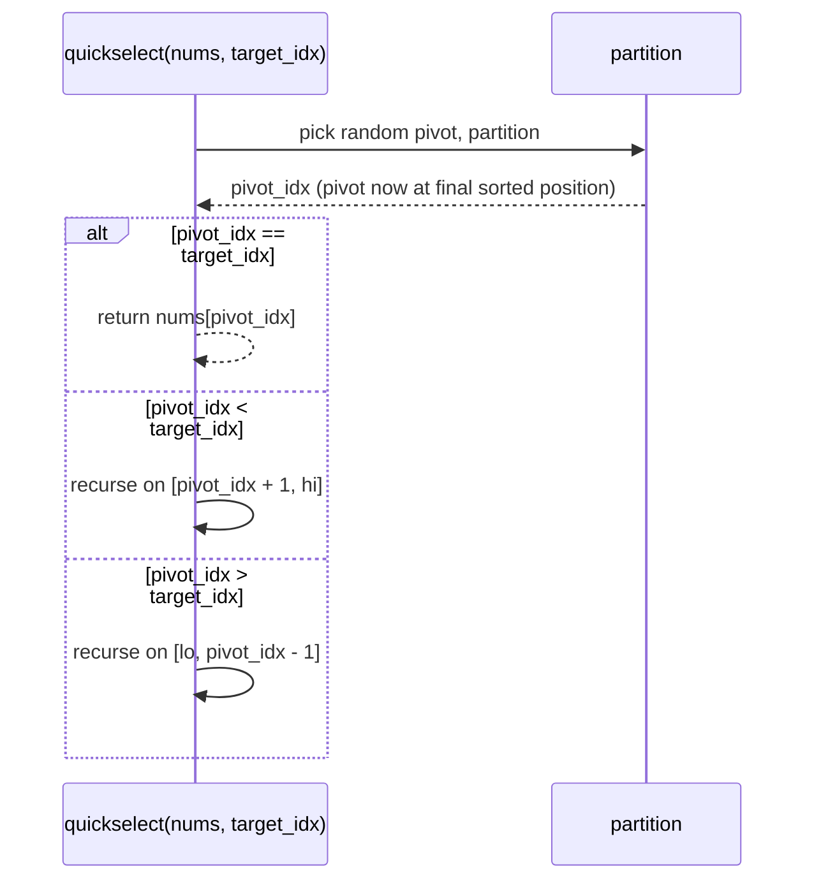

# Quickselect: linear-time selection

Hand a million random integers to the question "what's the 100,000th-largest?" and the lazy answer sorts the array in `n log n` and indexes. About `2 * 10^7` comparisons. The lazy answer is also asymptotically wrong. The interviewer wants `n`, and you can give them `n` for a constant factor that's about 3.4. The trick is six decades old: Hoare published it in 1961 as Algorithm 65, the same year and the same paper-pair as quicksort. He called it *Find*.

Quickselect is quicksort minus half the recursion. After a partition lands the pivot at its final sorted position, you don't recurse on both sides; you compare the pivot's index to the index you actually want, and recurse on whichever side contains it. The other side never gets sorted, never gets visited, never gets read. One side per level, linear work per level, expected total `Theta(n)`. Sort threw away the answer for every element other than the target; quickselect doesn't compute it in the first place.[^1]

## The primitive: partition

The chapter you read [a few pages back](./04-comparison-sorts-2.md) ratified the Lomuto partition. One pivot, one scan, two indices: a `store` cursor that marks the boundary of the "less than pivot" prefix, and an `i` cursor that scans every position from `lo` to `hi - 1`. After the scan, one final swap places the pivot at `arr[store]`. The post-condition is what makes the partition a useful primitive: the pivot sits at its final sorted index, the left band holds every element strictly less, the right band holds every element greater than or equal.

Quickselect uses the same partition. The single change is what happens after it returns.



*The three-way decision after every partition. The algorithm visits at most one side per level; this is the entire reason quickselect is expected linear rather than `n log n`.*

That is the algorithm. Two lines of comparison, one branch in three directions, one recursive call (in the textbook form) or one loop continuation (in the iterative form every reference implementation in this chapter uses).

## The trick: recurse on one side

Lay quicksort and quickselect side by side and the optimization is one block of code:

```text
quicksort(nums, lo, hi):
    if lo >= hi: return
    p = partition(nums, lo, hi)
    quicksort(nums, lo, p - 1)        # recurse left
    quicksort(nums, p + 1, hi)        # AND right

quickselect(nums, lo, hi, target):
    while lo <= hi:
        p = partition(nums, lo, hi)
        if p == target: return nums[p]
        if p < target: lo = p + 1     # advance into right band only
        else:          hi = p - 1     # OR retreat into left band only
```

Quicksort's recurrence is `T(n) = 2 * T(n/2) + Theta(n)`, which solves to `Theta(n log n)`. Quickselect's is `T(n) = T(n/2) + Theta(n)`, which solves to `Theta(n)` by the same master theorem case 3 or by direct geometric-series summation. The factor of two on the recursion is the entire log-factor; drop it and the bound collapses by a logarithm.

The intuition is sharper without the recurrence. Each partition pass costs work proportional to the active range. With a good pivot, the range halves at every level. The total work is `n + n/2 + n/4 + n/8 + ...`, a geometric series that sums to `2n` regardless of how deep the recursion runs. Sort pays linear work *at every level of a log-deep tree*; quickselect pays linear work *summed once across all levels*. Same partition, different accounting.

The "good pivot" condition is what random pivot selection buys. A uniformly random pivot lands in the middle 50% of the sorted order with probability one-half; in that case the recurse-side has at most `n/2` elements. The expected halving is enough; the formal CLRS argument gives `E[T(n)] <= E[T(3n/4)] + cn` and the same `Theta(n)` bound.[^2]

## Random pivot is non-negotiable

Pull random pivot out and the algorithm has a Theta(n²) worst case the input can trigger. Take `nums = [1, 2, 3, ..., n]` already sorted ascending and a textbook pivot rule that always picks `arr[hi]`. Every partition picks the largest remaining element; every partition's recurse-side is the entire active range minus the pivot's slot. The recurrence becomes `T(n) = T(n - 1) + Theta(n)`, summing to `Theta(n^2)`. Submit that to LC 215 and the hidden 50,000-element sorted-input test times out exactly the way naive Lomuto quicksort times out on the same shape.

The fix is one line. Before partition picks its pivot from `arr[hi]`, swap `arr[hi]` with `arr[uniform_random(lo, hi)]`. The adversary cannot construct a worst-case input without seeing your random coins; by symmetry of permutations, every input is equally bad in expectation, and Devroye's 1984 exponential-tail bound makes the probability of taking more than `Cn` comparisons super-exponentially small in `C` for sufficiently large `C`.[^3] This is what the chapter means by "expected linear time" — the expectation is over the algorithm's coin flips, not over input distributions.

Random pivot is not a performance optimization. It is the correctness fix that turns the algorithm from "works on benchmarks, breaks on adversarial input" into "works on every input with overwhelming probability." Production code uses it; production code that doesn't is broken.

```python
import random
from typing import List


def find_kth_largest(nums: List[int], k: int) -> int:
    """LC 215. Return the k-th largest element (1-indexed)."""
    target = len(nums) - k                          # k-th largest = (n - k)-th smallest
    lo, hi = 0, len(nums) - 1
    while lo <= hi:
        pivot_idx = _partition(nums, lo, hi)
        if pivot_idx == target:
            return nums[pivot_idx]
        if pivot_idx < target:
            lo = pivot_idx + 1                      # target lies strictly to the right
        else:
            hi = pivot_idx - 1                      # target lies strictly to the left
    return -1


def _partition(nums: List[int], lo: int, hi: int) -> int:
    """Lomuto partition with a uniformly random pivot."""
    rand_idx = random.randint(lo, hi)
    nums[rand_idx], nums[hi] = nums[hi], nums[rand_idx]
    pivot = nums[hi]
    store = lo
    for i in range(lo, hi):
        if nums[i] < pivot:
            nums[store], nums[i] = nums[i], nums[store]
            store += 1
    nums[store], nums[hi] = nums[hi], nums[store]
    return store
```

**Solution** — Python ([Java](./07-quickselect/lc-215/sol.java) · [C++](./07-quickselect/lc-215/sol.cpp) · [Go](./07-quickselect/lc-215/sol.go))

```python
# LC 215. Kth Largest Element in an Array
import random
from typing import List


def find_kth_largest(nums: List[int], k: int) -> int:
    """LC 215. Return the k-th largest element (1-indexed)."""
    target = len(nums) - k
    lo, hi = 0, len(nums) - 1
    while lo <= hi:
        pivot_idx = _partition(nums, lo, hi)
        if pivot_idx == target:
            return nums[pivot_idx]
        if pivot_idx < target:
            lo = pivot_idx + 1
        else:
            hi = pivot_idx - 1
    return -1  # unreachable for valid 1 <= k <= len(nums)


def _partition(nums: List[int], lo: int, hi: int) -> int:
    """Lomuto partition with a uniformly random pivot."""
    rand_idx = random.randint(lo, hi)
    nums[rand_idx], nums[hi] = nums[hi], nums[rand_idx]
    pivot = nums[hi]
    store = lo
    for i in range(lo, hi):
        if nums[i] < pivot:
            nums[store], nums[i] = nums[i], nums[store]
            store += 1
    nums[store], nums[hi] = nums[hi], nums[store]
    return store
```

The four implementations all use the iterative `while lo <= hi` form rather than explicit recursion. Random pivot's expected stack depth is `O(log n)`, but the worst-case stack depth (the same `O(n)` pathology random pivot defends against in the time bound) lurks in any recursive implementation. Iteration removes the worst-case stack risk and makes the auxiliary space bound a clean `O(1)`. Java's `-Xss` and Python's `sys.setrecursionlimit` mean recursive quickselect on adversarial 50,000-element inputs is one StackOverflow away from CI-failing on the same submissions iteration handles cleanly.

The `target = len(nums) - k` line is the chapter's most-bug-prone single line. For 1-indexed k-th largest (LC 215's framing), the position in the sorted-ascending array is `n - k`. For 1-indexed k-th smallest, it's `k - 1`. The two forms collide on every interview where the candidate hasn't worked out the conversion on a small example before writing the loop. Do `n = 6, k = 2` by hand: the 2nd-largest of `[3, 2, 1, 5, 6, 4]` is `5`; sorted ascending is `[1, 2, 3, 4, 5, 6]`; the 5 sits at index 4 = 6 - 2. Both forms agree only when written out.

## Worked example: LC 215 on `[3, 2, 1, 5, 6, 4], k = 2`

The widget freezes the pivot rule to `pivot = arr[lo]` so the trace is reproducible. Production code randomises; the freeze is a pedagogical compromise, not a correctness one. Two rounds of partition find the answer.

Round 1 picks pivot `3` (from index 0), moves it to `arr[hi] = arr[5]`, runs Lomuto. After the scan, the `store` cursor sits at index 2; the final swap lands `3` at index 2, with `[2, 1]` to the left (everything `< 3`) and `[5, 6, 4]` to the right (everything `>= 3`). Compare `pivot_idx = 2` to `target_idx = 4`: `2 < 4`, so the answer is to the right. Advance `lo` to 3; the left band is never visited again.

Round 2 operates on `arr[3..5] = [5, 6, 4]`. Pivot is `5` (from index 3); after Lomuto, `5` lands at index 4. Compare: `pivot_idx = 4 == target_idx = 4`. Return `arr[4] = 5`.

Total comparison work: 5 in round 1, 2 in round 2, 7 across 6 elements. Sort would have done about 16. The win compounds with `n`.

> **Interactive widget:** [Quickselect: partition and recurse on one side](../widgets/w-07-quickselect.yml) — rendered on the website; the YAML spec describes the keyframes.

*Static fallback: the deterministic `pivot=lo` trace through 14 steps showing pivot pick, partition scan, pivot placement, the recurse-right decision after round 1, and the terminating answer at index 4.*

## Why expected linear works

The complexity argument distilled to one paragraph: at every level, partition costs `Theta(active_range)` work; after partition, the algorithm recurses on only one side. With a uniformly random pivot, the expected size of the recurse-side is at most `3n/4` (the pivot lands in the middle half with probability one-half; in that case the larger side has size at most `3n/4`). The recurrence `E[T(n)] <= E[T(3n/4)] + cn` sums to `4cn = Theta(n)` by the geometric-series argument. The cleaner pedagogical form: each level halves the active range *in expectation*, so the total work is `n + n/2 + n/4 + ... = 2n = Theta(n)`. The constant hidden in the `Theta(n)` bound for finding the median is `n(2 + 2 ln 2 + o(1))`, about `3.4n + o(n)` per the Wikipedia "finer computations" entry.[^4]

Empirical numbers agree. In a published microbenchmark on top-K queries over 64-bit integers, quickselect ran roughly 20% faster than a binary-heap top-K implementation on the same input shape.[^4] Theoretical bounds and benchmark numbers point the same direction: when the input is offline and the caller doesn't need the top-K in sorted order, quickselect is the right tool.

## Quickselect or heap?

The Part 6 chapter on [Heaps and the top-K pattern](../part-6-trees-heaps/04-heaps-priority-queues.md) teaches a size-K min-heap that answers the same question in `Theta(n log k)` time and `Theta(k)` space. Its complexity is strictly worse than quickselect's expected `Theta(n)` for any `k > 1`, yet the heap is the right answer in two cases. Knowing which is the harder interview question than knowing either algorithm.

| Constraint | Reach for | Why |
|---|---|---|
| Single offline batch, `k` is moderate-to-large, no need for top-K sorted | Quickselect | `Theta(n)` expected beats `Theta(n log k)` whenever `k >> 1` |
| Input streams (you don't have the full array up front) | Heap | Quickselect requires the full array; the heap maintains the running top-K through arrivals |
| Caller will subsequently ask for k-th, (k-1)-th, ..., 1st in sorted order | Heap | Pop the heap k times for sorted output; quickselect only finds one boundary |
| `k` is `O(1)` (top 1, top 5, top 10) and `n` is huge | Heap, by constant factor | `n log k = O(n)` when `k` is constant; the heap's smaller working set wins on cache |
| Caller gives you the array and just wants one value back | Quickselect | Strictly fewer comparisons in expectation |

The streaming case is the one that sinks readers who memorise quickselect as the strictly-better top-K algorithm. Quickselect needs random access to the whole array; if you can't store all `n` items, you can't run it. The heap's `O(k)` space is what makes it the answer for log streams, leaderboards, and any "top-K over the last hour" question where elements arrive faster than you can sort them.

## What it actually costs

| Variant | Time | Space | Notes |
|---|---|---|---|
| Best case (uniform random pivot, balanced splits) | `Theta(n)` | `O(1)` | iterative form |
| Expected (uniform random pivot) | `Theta(n)` | `O(1)` | iterative; `O(log n)` for recursive |
| Worst case (pivot rule consistently picks min/max) | `Theta(n^2)` | `O(1)` iterative; `O(n)` recursive | random pivot makes this `O(1/n^c)` probability |
| BFPRT (median-of-medians) | `Theta(n)` deterministic worst | `O(log n)` | rarely used in practice; constants ~5x random pivot |
| Floyd-Rivest 1975 | `1.5n + O(sqrt(n))` average for median | `O(1)` | best constants for median; production median routines use it |

The iterative form's `O(1)` auxiliary space comes from tail-call elimination: the `while lo <= hi` loop reuses the same frame as the active range narrows, and Lomuto partition runs in place. The recursive form would carry the recursion stack explicitly, with expected depth `O(log n)` and worst-case depth `O(n)` on adversarial inputs that the random pivot defends in time but not in stack space.

## Why nobody ships median-of-medians

There is a deterministic `O(n)` worst-case algorithm: BFPRT, named for its 1973 authors Blum, Floyd, Pratt, Rivest, and Tarjan.[^5] The pivot rule sorts groups of 5 elements, takes the median of each group, and recursively selects the median of those medians as the overall pivot. The chosen pivot is provably between the 30th and 70th percentile of the active range, so each recursive call shrinks the problem to at most `7n/10` elements. The combined recurrence `T(n) <= T(n/5) + T(7n/10) + cn` solves to `T(n) = Theta(n)` because `1/5 + 7/10 = 9/10 < 1`. The original paper called the algorithm *PICK* and Hoare's quickselect *FIND*; the "BFPRT" acronym crystallised in the textbook tradition that followed.

Production code does not use BFPRT. Three reasons. The pivot computation itself runs an `O(n)` algorithm at every level; even with the favourable recurrence, the constant factor is roughly five times worse than random-pivot quickselect on real inputs. The 30/70 split is a guarantee, not a typical result; random pivot's expected halving is empirically tighter on non-adversarial data. And the worst case BFPRT defends against is so vanishingly rare under random pivot that paying constant factors in every call to defend against it is bad engineering. The C++ STL ships `std::sort` as introsort (Musser 1997) and `std::nth_element` as a quickselect variant with a heapsort or BFPRT fallback when recursion depth exceeds a threshold; the fallback fires on adversarial input, never on random.

The chapter teaches BFPRT for completeness and the citation that closes the complexity table. The honest framing is the production one: random-pivot quickselect with introselect-style depth-limited fallback. Pure BFPRT in interview code is the wrong answer.

## Pitfalls

> [!CAUTION]
> **Off-by-one in the index conversion.** For LC 215's 1-indexed k-th largest, `target_idx = n - k`. For 1-indexed k-th smallest, `target_idx = k - 1`. Wrong forms (`n - k - 1`, `k`) silently return the wrong element and pass the trivial test cases. Compute the conversion explicitly with a small worked example before writing the loop. Worked example: `n = 6, k = 2`, the 2nd-largest is `5`, sorted-ascending index 4. Both forms agree only when written out.

> [!WARNING]
> **Wrong recursion side after the comparison.** State the loop invariant before writing the branch: "after partition, `nums[pivot_idx]` is in its final sorted position; the answer lies strictly to the right iff `target_idx > pivot_idx`." Memorising "if pivot less than target, go right" without the invariant inverts the moment the comparison sense flips on a variant problem.

> [!WARNING]
> **Quickselect mutates the caller's array.** Lomuto partition is intrinsically destructive — that is the entire space-efficiency argument. If the caller assumes `nums` is unchanged after the call, copy at the boundary (`list(nums)` in Python, `nums.clone()` in Java, `slices.Clone(nums)` in Go). The four reference implementations document the side effect; production code that wraps quickselect should follow.

> [!WARNING]
> **Lomuto on all-equal input degenerates to `Theta(n^2)` even with random pivot.** Strict-`<` Lomuto puts every element in the "less than pivot" side, the pivot lands at `lo` every iteration, and recursion shrinks by exactly one each step. The fix is **3-way (Dutch national flag) partition**, which collapses the equal-key band in one pass and recurses only on the strictly-less and strictly-greater bands. Sedgewick's `Quick3way` is the canonical reference.[^6]

> [!WARNING]
> **Quickselect's post-condition is partitioned, not sorted.** After `find_kth_largest(nums, k)` returns, `nums[:target_idx]` are all `<=` the answer and `nums[target_idx+1:]` are all `>` the answer, but neither sub-range is sorted. To return the top-K as a sorted list, follow quickselect with `sort(nums[target_idx:])` for `O(k log k)` extra work. This is the partial-quicksort variant; treating quickselect's output as a sorted prefix is the most common LC 215 / LC 973 confusion.

## Problem ladder

CORE spans Medium three times because quickselect's natural problem space starts at Medium — Easy selection problems (LC 414 Third Maximum Number) are owned by [Linear search and the running-aggregate pattern](./00-linear-search.md), where three integer trackers solve them without quickselect at all. STRETCH supplies the Hard rung.

### CORE (solve all three to claim chapter mastery)

- [LC 215 — Kth Largest Element in an Array](https://leetcode.com/problems/kth-largest-element-in-an-array/) [Medium] • quickselect ★
- [LC 973 — K Closest Points to Origin](https://leetcode.com/problems/k-closest-points-to-origin/) [Medium] • quickselect-on-derived-key
- [LC 347 — Top K Frequent Elements](https://leetcode.com/problems/top-k-frequent-elements/) [Medium] • hash-counts-then-quickselect

### STRETCH (optional)

- [LC 4 — Median of Two Sorted Arrays](https://leetcode.com/problems/median-of-two-sorted-arrays/) [Hard] • quickselect-on-merged-virtual-array

LC 973 is the "quickselect on a derived key" variant: each cell is a point, the key is squared distance from origin, the comparator operates on the derived key while the swap moves the compound object. Same algorithm, one indirection. LC 347 is the two-stage variant: hash to `(value, count)` pairs in `O(n)`, then run quickselect on the count dimension; this is also where the heap solution from Part 6 competes most directly. LC 4's optimal solution is binary search on the partition index for `O(log min(m, n))`, not quickselect; the chapter teaches the quickselect-on-merged-virtual-array view as a clean `O(m + n)` lens on the problem before pointing readers at the binary-search optimum in [Binary search variants](./02-binary-search-variants.md).

## Where this leads

This is the last chapter in Part 2. The next part begins with [Two pointers, opposite direction](../part-3-pointers-window-prefix/00-two-pointers-opposite.md), where the partition mechanic returns in its `K = 3` specialisation as Dijkstra's Dutch national flag for LC 75 Sort Colors. [Heaps and the top-K pattern](../part-6-trees-heaps/04-heaps-priority-queues.md) carries the streaming and "top-K sorted" cases that quickselect cannot serve. And the worst-case-linear deterministic-pivot story continues in advanced data structures, where introselect-style hybrids extend the same "random by default, fallback on bad luck" design into `std::sort`, `Arrays.sort`, and Go's `slices.Sort`.

## References

[^1]: C. A. R. Hoare, "Algorithm 65: Find," *Communications of the ACM*, 4(7):321-322, July 1961.

[^2]: Cormen, Leiserson, Rivest, Stein, *Introduction to Algorithms*, 4th ed., MIT Press, 2022.

[^3]: Luc Devroye, "Exponential bounds for the running time of a selection algorithm," *Journal of Computer and System Sciences*, 29(1):1-7, 1984.

[^4]: Wikipedia, "Quickselect," <https://en.wikipedia.org/wiki/Quickselect>.

[^5]: Manuel Blum, Robert Floyd, Vaughan Pratt, Ronald Rivest, Robert Tarjan, "Time bounds for selection," *Journal of Computer and System Sciences*, 7(4):448-461, August 1973.

[^6]: Robert Sedgewick and Kevin Wayne, *Algorithms*, 4th ed., Addison-Wesley, 2011, §2.3 Quicksort. Online at <https://algs4.cs.princeton.edu/23quicksort/>.
