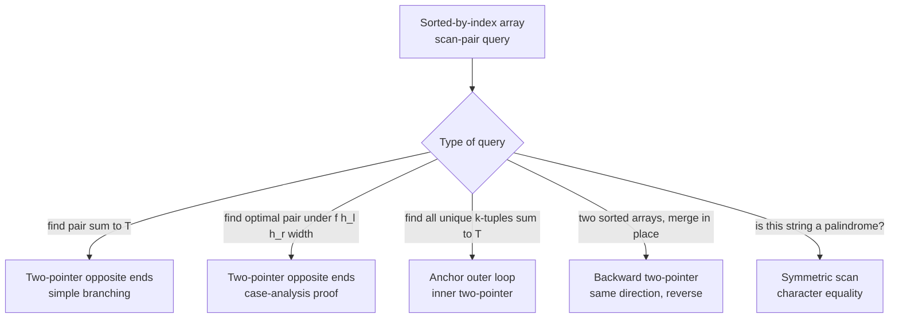

# Two pointers: opposite ends

A row of vertical lines, integer heights between 0 and 10,000, up to 100,000 of them. Pick two; the water held between them is `min(h[l], h[r]) * (r - l)`. Find the pair holding the most. The honest first attempt loops over every pair, computes the area, keeps the best. At n = 100,000 that's roughly 5 billion pairs. The right answer scans 100,000 indices.

That gap is the chapter. The trick that closes it shows up everywhere: 3Sum, trapping rain water, palindrome checks, the in-place merge of two sorted arrays. They all share one move. Place a pointer at each end of a sorted-by-index array and let them walk toward each other.

## Why brute force burns

LC 11 (Container With Most Water) is the signature problem here. Sample input `height = [1, 8, 6, 2, 5, 4, 8, 3, 7]`, expected answer `49`. Eyeball it: walls at indices 1 and 8, heights 8 and 7, distance 7, water held `min(8, 7) * 7 = 49`. Easy to see at n = 9. Useless to eyeball at n = 100,000.

The brute force is the loop you would write in an interview if you forgot what chapter you were in:

```python
def max_area_brute(height):
    n = len(height)
    best = 0
    for i in range(n):
        for j in range(i + 1, n):
            area = min(height[i], height[j]) * (j - i)
            if area > best:
                best = area
    return best
```

Correct. Also, on the n = 100,000 cases LC actually grades, dead. Roughly `n * (n - 1) / 2` pairs, one comparison each, on a 1-second time budget. Past about n = 10,000 the grader times out.

The bug is not in the loop body. The bug is that the loop body does redundant work the structure of the problem makes obvious. The area is bounded by `min(h[l], h[r])`. Whichever wall is shorter is the bottleneck. A short wall paired with another short wall is never going to win, regardless of distance. The brute force re-asks that question for every pair. Once you know the bottleneck is the shorter wall, the question simplifies: which pointer should advance?

Place pointers at both ends, `l = 0` and `r = n - 1`. Look at the walls. One is shorter. Now consider the alternatives:

- Advance the **taller** wall inward. Width drops by 1. The shorter wall is unchanged, so the bound is unchanged. Area cannot grow; it can only shrink.
- Advance the **shorter** wall inward. Width drops by 1. The new wall might be taller, so the bound has room to climb. This is the only direction in which area can grow.[^1]

So you always advance the shorter wall. That's the entire algorithm.

```python
def max_area(height):
    l, r = 0, len(height) - 1
    best = 0
    while l < r:
        h = min(height[l], height[r])
        if h * (r - l) > best:
            best = h * (r - l)
        if height[l] < height[r]:
            l += 1
        else:
            r -= 1
    return best
```

**Solution** — Python ([Java](./00-two-pointers-opposite/lc-11/sol.java) · [C++](./00-two-pointers-opposite/lc-11/sol.cpp) · [Go](./00-two-pointers-opposite/lc-11/sol.go))

```python
# LC 11. Container With Most Water
from typing import List


def max_area(height: List[int]) -> int:
    """LC 11 Container With Most Water."""
    left, right = 0, len(height) - 1
    best = 0
    while left < right:
        h_l, h_r = height[left], height[right]
        if h_l < h_r:
            best = max(best, h_l * (right - left))
            left += 1
        else:
            best = max(best, h_r * (right - left))
            right -= 1
    return best
```

Each iteration shrinks the gap by exactly 1. The loop runs at most `n - 1` times. Total work is O(n).[^2] On n = 100,000 that finishes in milliseconds.

> [!IMPORTANT]
> **The opposite-ends invariant.** On a sorted-by-index array with two pointers `(l, r)` and a pair-monotone candidate quantity, advancing the pointer on the smaller side is the only move that can improve the answer. Advancing the other side either keeps the bottleneck and shrinks the search space (worse), or revisits the same partner with a strictly worse companion. Every later sub-pattern in this chapter inherits this invariant; the next chapter, [Two pointers: same direction](./01-two-pointers-same-direction.md), explicitly contrasts against it.

## Why the proof actually works (and where it breaks)

The "advance the shorter wall" rule is one of those algorithmic moves that feels like a guess until you write the case analysis. So write it. At any state `(l, r)` with `h[l] <= h[r]`, the area is `h[l] * (r - l)`. Consider every move:

- Advance `r` (the taller wall) inward. New width is `r - 1 - l`, strictly smaller. New height bound is `min(h[l], h[r-1])`, which is at most `h[l]` because `h[l]` was already the shorter. New area is at most `h[l] * (r - 1 - l)`, strictly less than the current area.
- Advance `l` (the shorter wall) inward. New width is `r - l - 1`, strictly smaller. New height bound is `min(h[l+1], h[r])`. If `h[l+1] <= h[l]`, the bound is at most `h[l]` and area shrinks. If `h[l+1] > h[l]`, the bound climbs; whether area grows depends on whether the height gain offsets the width loss.

The first move can never improve the answer; the second might. So advancing the shorter wall dominates. Importantly, "might improve" is enough. The algorithm doesn't need to know which advance wins; it just needs to know the other advance loses, so we can discard the taller-wall side and keep going.[^3]

The CS Stack Exchange thread on LC 11 formalizes this as a loop invariant and proves it by induction.[^3] Every pair we *don't* visit is dominated by a pair we *do* visit, so the optimum we miss in the discarded half is no better than the optimum we keep. The proof is the chapter's most important paragraph; if it doesn't click yet, run the LC 11 widget below and watch which pairs the algorithm visits versus which it skips.

The proof breaks on unsorted-by-index input, which is what makes pair-sum problems different (and what makes LC 1 Two Sum a hash-map problem, not a two-pointer problem). More on that in the pitfalls.

## The four primitives

Every opposite-ends problem fills the same four slots: place pointers, observe the current pair, decide which pointer to advance, terminate. Same skeleton, different specializations.

| Problem | `init_pointers` | `observe(l, r)` | `advance_rule` | `terminate` |
|---|---|---|---|---|
| LC 167 — Two Sum II | `l = 0, r = n - 1` | sum vs target | sum < T → `l++`; sum > T → `r--`; hit → return | hit, or `l >= r` |
| LC 11 — Container | `l = 0, r = n - 1` | `min(h[l], h[r]) * (r - l)` vs best | shorter-wall side advances | `l >= r` |
| LC 15 — 3Sum | `l = i+1, r = n-1` (per anchor `i`) | sum vs `-nums[i]` | sum < T → `l++`; sum > T → `r--`; hit → record + skip dups | `l >= r` |
| LC 125 — Valid Palindrome | `l = 0, r = n - 1` | `s[l]` vs `s[r]` (case-folded) | mismatch → false; match → both inward | `l >= r` |

When you meet a new opposite-ends problem, the work is filling those four cells. The skeleton is identical across all of them. The widget below is the configurable demo for the simplest specialization (pair-sum on a sorted array); the two editorial widgets later in the chapter pin LC 11 and LC 15 to fixed inputs at full fidelity.

> **Interactive widget:** [Two pointers (sum-equals-target)](../widgets/w-08-two-pointers-3sum.yml) — rendered on the website; the YAML spec describes the keyframes.

*The chapter widget on the canonical input `nums = [-2, -1, 1, 4, 7, 12, 15], target = 6` walks the pair-sum specialization through three branch decisions before locking onto the hit at indices `[1, 4]`. Step through it once before reading on; the geometry of "advance the smaller side" is faster to feel than to read.*

## Worked example: LC 11 on `[1, 8, 6, 2, 5, 4, 8, 3, 7]`

Run the algorithm on LC's standard example. Two pointers, `l = 0` and `r = 8`. Heights `1` and `7`. Area `min(1, 7) * 8 = 8`. The left wall is the shorter, so `l` advances.

`l = 1, r = 8`. Heights `8` and `7`. Area `min(8, 7) * 7 = 49`. Best updates to `49`. **This is the answer.** The optimal pair is found on the second probe of a 9-cell array. Now the right wall is shorter, so `r` advances.

The remaining iterations confirm no later pair beats `49`. With `l` pinned at index 1, every subsequent `r` lands on a wall shorter than 8, and width is monotonically shrinking. So the bound is whatever `r` lands on, multiplied by an ever-smaller width. Walls of height 3, 8, 4, 5, 2, 6 at distances 6, 5, 4, 3, 2, 1 give areas 18, 40, 16, 15, 4, 6. None reaches 49. Pointers cross; the algorithm returns 49.

> **Interactive widget:** [Container With Most Water (LC 11) — greedy two-pointer shrink](../widgets/e-LC011-container.yml) — rendered on the website; the YAML spec describes the keyframes.

*The LC 11 editorial widget animates the same trace on the same input at full fidelity. Preset-only — the canonical input is the lesson. Step 2 is the answer; the rest is confirmation.*

A reader who watches steps 1-3 and then asks "why didn't the algorithm find a bigger answer hidden in the middle of the array?" has hit the proof. The middle pairs all involve at least one wall that's no taller than 7, and at distances strictly less than 7. So `min * width` for every middle pair is bounded above by `7 * 7 = 49`, which is what we already have. The algorithm doesn't need to check them.

## Locating this pattern

The five sub-patterns this chapter teaches are dialects of the same scaffold. Pick which dialect a problem speaks, then fill the four primitives.



*Decision tree readers run once to map a problem onto a sub-pattern in this chapter.*

## Worked example: LC 15 (3Sum) on `[-1, 0, 1, 2, -1, -4]`

3Sum is the chapter's second canonical problem. The reduction is one sentence: sort the array, fix one anchor at a time, and the remaining problem is "find all pairs summing to `-nums[i]` in the suffix" — exactly the simple opposite-ends scan from LC 167.[^4]

Sorted: `[-4, -1, -1, 0, 1, 2]`.

**Anchor i = 0 (value -4, target +4).** Set `l = 1, r = 5`. Sums on the suffix never reach 4 (max possible is `1 + 2 = 3`). Four left-advances exhaust the suffix without a hit.

**Anchor i = 1 (value -1, target +1).** Set `l = 2, r = 5`.

- `nums[2] + nums[5] = -1 + 2 = 1`. Hit. Record `[-1, -1, 2]`. Advance both pointers; check duplicates on each side; neither side has a duplicate to skip (`nums[3] != nums[2]`, `nums[4] != nums[5]`).
- `nums[3] + nums[4] = 0 + 1 = 1`. Hit. Record `[-1, 0, 1]`. Advance both; pointers cross.

**Anchor i = 2 (value -1).** Equal to `nums[i-1]`. The duplicate-anchor-skip line fires: `if i > 0 and nums[i] == nums[i-1]: continue`. Skip without running the inner sweep. Without this line, both triplets would be re-emitted.

**Anchor i = 3 (value 0, target 0).** Set `l = 4, r = 5`. Sum `1 + 2 = 3 > 0`. Advance `r`; pointers cross.

**Anchor i = 4 (value 1).** The early-exit `if nums[i] > 0: break` fires; no positive anchor can sum to zero with two larger positives.

Final: `[[-1, -1, 2], [-1, 0, 1]]`.

> **Interactive widget:** [3Sum (LC 15) — sort + anchor + opposite-ends with duplicate-skip](../widgets/e-LC015-3sum.yml) — rendered on the website; the YAML spec describes the keyframes.

*The LC 15 editorial widget animates this trace step-for-step, including the sort step (which forgetting is a recurring bug) and the anchor-duplicate-skip on step 10 (the highest-leverage moment in the trace).*

The duplicate-skip choreography is the entire reason 3Sum is harder than Two Sum II. After the first hit, advancing both pointers is not enough — if the new `nums[l]` equals the old, you'll find the same triplet twice with a different inner partner. The fix is three lines, not two.

### The three duplicate-skips that 3Sum requires

Three lines, in this order, none of them optional:

```python
# (a) Skip duplicate anchors.
if i > 0 and nums[i] == nums[i - 1]:
    continue

# After a hit, advance both pointers, then:
# (b) Skip duplicates on the left.
while l < r and nums[l] == nums[l - 1]:
    l += 1
# (c) Skip duplicates on the right.
while l < r and nums[r] == nums[r + 1]:
    r -= 1
```

Skipping any one breaks the algorithm on the right input. Skipping (a) re-emits triplets when the same anchor value appears twice (the `[-1, -1]` case in this chapter's worked example). Skipping (b) or (c) re-emits triplets when duplicates flank a hit on the left or right side. Inputs like `[-2, -2, 0, 0, 2, 2]` surface the bug fast: anchor `-2` finds `(0, 2)` at indices `(2, 5)`, advances both, and finds the same `(0, 2)` again at indices `(3, 4)` if the skips aren't there.[^5]

## What it actually costs

| Variant | Time | Space | Notes |
|---|---|---|---|
| LC 11 max area | O(n) | O(1) | Single pass; each step advances one pointer by 1. |
| LC 15 3Sum (post-sort) | O(n^2) | O(1) auxiliary | Outer anchor is O(n); inner pair sweep is O(n) per anchor. Output not counted. |
| LC 15 3Sum sort step | O(n log n) | O(log n) stack | Subsumed by O(n^2) since `n^2 >= n log n` for `n >= 1`. |
| LC 42 Trapping Rain Water | O(n) | O(1) | Same opposite-ends scaffold with running `left_max` and `right_max` invariants. |
| LC 125 palindrome scan | O(n) | O(1) | Symmetric scan, character comparison. |

The honest framing on 3Sum's complexity, for the interviewer who asks "is this optimal?": the two-pointer O(n^2) algorithm matches the linear-decision-tree lower bound established by Erickson 1999.[^2] Beating it requires the Grønlund-Pettie 2014 word-RAM trick that runs in `O(n^2 (log log n)^O(1) / log^2 n)` and is well outside any interview's scope.[^2] So for the comparison model, yes, you have to do `n^2` work. Whether the word-RAM model admits truly subquadratic 3Sum is still open — Pătrașcu's 3SUM-hardness conjecture from STOC 2010 is the load-bearing assumption underneath dozens of fine-grained complexity reductions.[^6]

## When the pattern bends

**Pair-sum on a sorted array (LC 167).** The simplest member. Comparison key is `nums[l] + nums[r]` against target T. Inner branching is the canonical "if sum < T: l++; elif sum > T: r--; else: hit". The right starting problem for a reader new to the pattern.

**Pair-extremum on a non-sorted array (LC 11, LC 42).** The array is not sorted by value, but the index axis is. Correctness depends on the case-analysis proof, not on `sum < T`-style branching. LC 42 (Trapping Rain Water) extends the same scaffold by maintaining `left_max` and `right_max` invariants while sweeping inward; the water above any cell is `min(left_max, right_max) - h[i]`. Same scaffold, harder bookkeeping.

**Triplet (or k-tuple) sum (LC 15, LC 16, LC 18).** Wraps an outer loop over an "anchor" index that fixes one element, then runs the standard pair-sum inner sweep on the suffix with target `T - nums[i]`. Generalizes to k-tuples in O(n^(k-1)) by nesting more anchors. The duplicate-skip choreography from LC 15 carries over to LC 18 and LC 259 verbatim.

**Palindrome-style symmetric scan (LC 125).** Pointers at `l = 0` and `r = n - 1` advance inward; the comparison is character equality (case-folded) instead of arithmetic. Same scaffold, different observe step.

**Backward merge (LC 88).** Two sorted arrays merged in place into the back of the larger one. The orientation flips: both pointers walk backward in parallel, and the larger element is written to a rear write-head. Lives in [Two pointers: same direction](./01-two-pointers-same-direction.md) because the orientation makes it a write-head problem rather than a converging problem, but the closest cousin lives here.

## Three pitfalls that bite

> [!WARNING]
> **Applying opposite-ends to an unsorted array.** A reader sees "two-pointer" in LC's tag list and reaches for `l = 0, r = n - 1` on an unsorted array, looking for a pair summing to T. The algorithm returns wrong answers. The "advance l rightward when sum is too small" rule depends on the next leftward cell being strictly larger, which is only true if the array is sorted. Fix: sort first when the problem allows it (cost O(n log n)). If the problem requires preserving original indices (LC 1 Two Sum), use a hash map instead. Opposite-ends is the wrong tool.

> [!WARNING]
> **Off-by-one on the LC 11 width.** Writing `width = right - left + 1` instead of `width = right - left` inflates every answer by one wall-height. The canonical test `[1, 1] → 1` catches this immediately; the wrong formula returns 2. Width is the geometric *gap* between the walls, not the inclusive *count* of cells. Walls one position apart hold a strip of water 1 unit wide, not 2.

> [!WARNING]
> **Treating LC 11 like a sliding window.** Both algorithms have two indices, so the syntactic similarity is tempting. The semantic difference is the entire chapter. Sliding window is single-direction (both pointers move forward) over subarray queries with predicates monotone in window expansion. Opposite-ends is two-direction (pointers converge) over pair queries with predicates monotone in the pair's algebraic combination. Different invariants, different termination conditions. The chapter on [Sliding window: fixed size](./02-sliding-window-fixed.md) carries the contrast in detail.

## Problem ladder

### CORE (solve all three to claim chapter mastery)

- [LC 167 — Two Sum II — Input Array Is Sorted](https://leetcode.com/problems/two-sum-ii-input-array-is-sorted/) [Easy] • two-pointers-opposite-ends-on-sorted
- [LC 11 — Container With Most Water](https://leetcode.com/problems/container-with-most-water/) [Medium] • two-pointers-greedy-shrink ★
- [LC 15 — 3Sum](https://leetcode.com/problems/3sum/) [Medium] • two-pointers-on-sorted-with-anchor

### STRETCH (optional)

- [LC 42 — Trapping Rain Water](https://leetcode.com/problems/trapping-rain-water/) [Hard] • two-pointers-with-running-max
- [LC 125 — Valid Palindrome](https://leetcode.com/problems/valid-palindrome/) [Easy] • two-pointers-symmetric-scan

LC 11 is the chapter's signature problem (★) and the case-analysis proof above is its masterclass moment. LC 42 is the natural Hard follow-up. It reuses the shorter-wall insight to maintain `left_max` and `right_max` invariants while sweeping inward, and the same correctness argument carries through with one extra term.

## Where this leads

The sibling chapter is [Two pointers: same direction](./01-two-pointers-same-direction.md). Different invariant: opposite-ends shrinks an interval and visits every pair-equivalence class once; same-direction holds a stable read/write split and visits every element once. The two patterns share a name and almost nothing else.

The window cousin is [Sliding window: fixed size](./02-sliding-window-fixed.md). Both pointers move forward; the window between them is the object of interest, not the search space. The cross-reference matters because LC 11 looks like a sliding-window problem to the wrong instinct, and the chapter that disambiguates is the next one over.

## References

[^1]: LeetCopilot Team, "Container With Most Water: Why Greedy Two Pointers Works (Proof)," 2025. <https://leetcopilot.dev/leetcode-pattern/two-pointers/container-water-proof>.

[^2]: Wikipedia contributors, "3SUM," last edited 2025-11-10. <https://en.wikipedia.org/wiki/3SUM>.

[^3]: scanny et al., "Proof for LeetCode: 11. Container With Most Water problem," Computer Science Stack Exchange, 2020. <https://cs.stackexchange.com/questions/121472/proof-for-leetcode-11-container-with-most-water-problem>.

[^4]: LeetCode, "15. 3Sum" (Medium). <https://leetcode.com/problems/3sum/>. Source for the canonical example `[-1, 0, 1, 2, -1, -4] → [[-1, -1, 2], [-1, 0, 1]]` used in the worked example.

[^5]: Stack Overflow, "Leetcode #15: 3sum, avoiding duplicate," 2018-onwards. <https://stackoverflow.com/questions/38909591/leetcode-15-3sum-avoiding-duplicate>.

[^6]: Mihai Pătrașcu, "Towards polynomial lower bounds for dynamic problems," *Proceedings of the 42nd ACM symposium on Theory of computing — STOC '10*, 2010, pp. 603-610. <https://doi.org/10.1145/1806689.1806772>.
