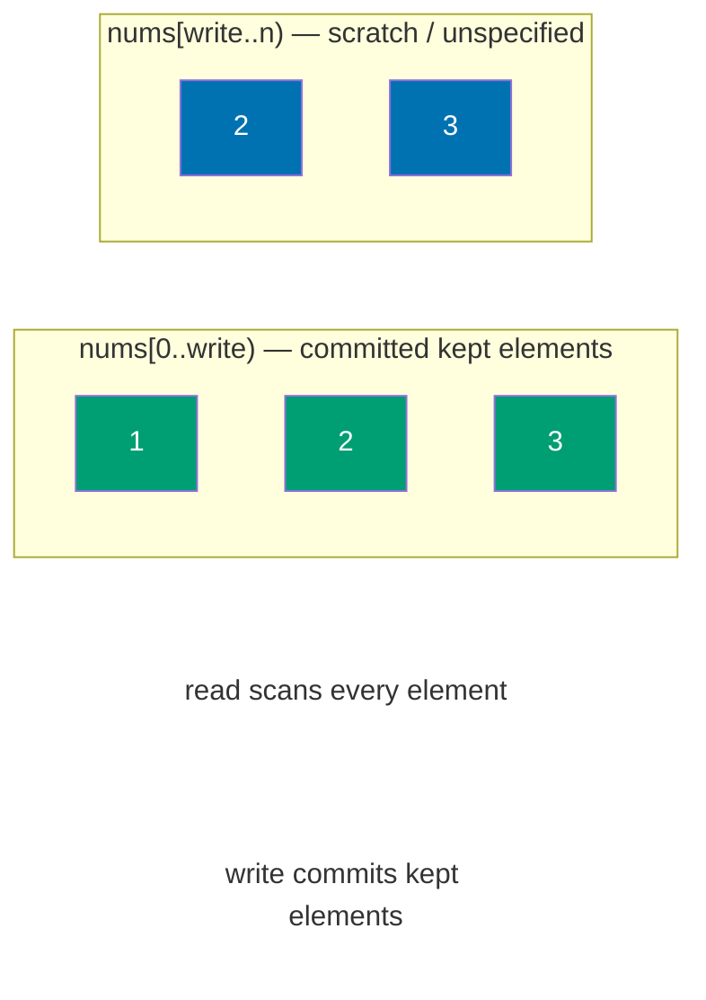
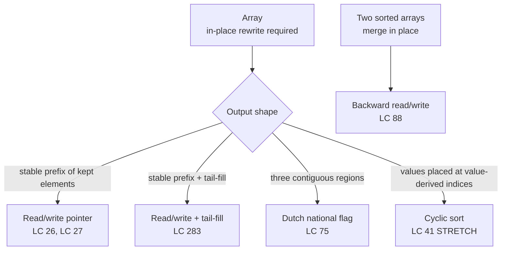

# Two pointers: same direction

A sorted array of up to 30,000 integers. Remove the duplicates in place, return the new length, and use no extra array. The wrong answer is the natural one: walk the input, append each new value to a fresh output, return its length. Correct, and explicitly forbidden. The prompt says no extra array.

That constraint is the chapter. The fix is one of the smallest tricks in algorithms with one of the widest reaches: a second index that walks left to right at a different speed than the first. One pointer reads. The other pointer writes. The answer is whatever the writer has committed to keep by the time the reader runs out of array.

## Why brute force burns memory, not time

LC 26 (Remove Duplicates from Sorted Array) is the chapter's signature problem. Sample input `[1, 1, 2, 2, 3]`, expected return `k = 3`, expected first three values `[1, 2, 3]`. The trailing slots are unspecified; the grader only inspects `nums[0..k)`.

The honest first attempt allocates an output array, walks the input, copies the first occurrence of each value, returns the output's length:

```python
def remove_duplicates_brute(nums):
    if not nums:
        return 0
    out = [nums[0]]                         # extra O(n) array — the rule says no
    for i in range(1, len(nums)):
        if nums[i] != nums[i - 1]:
            out.append(nums[i])
    nums[:len(out)] = out                   # copy back into nums[0..k)
    return len(out)
```

It works. It's also the wrong answer for the chapter: O(n) extra space when the prompt asked for O(1). The interesting fix is not a faster comparison; both approaches are O(n) time. The fix is the realization that the input array has room for the answer inside itself, because the answer is a strict prefix of what's already there.

Place a second index, call it `write`, at the slot where the next kept element should land. A `read` pointer scans every cell. When `read` finds something worth keeping, the algorithm copies it forward to `nums[write]` and bumps `write`. When `read` finds something to drop, `write` stays put and `read` moves on alone. The two pointers walk in the same direction, at different speeds, on the same array.

```python
def remove_duplicates(nums):
    if not nums:
        return 0
    write = 1                               # seed: the length-1 prefix is always distinct
    for read in range(1, len(nums)):
        if nums[read] != nums[write - 1]:   # predicate: not a duplicate of the last kept value
            nums[write] = nums[read]
            write += 1
    return write
```

**Solution** — Python ([Java](./01-two-pointers-same-direction/lc-26/sol.java) · [C++](./01-two-pointers-same-direction/lc-26/sol.cpp) · [Go](./01-two-pointers-same-direction/lc-26/sol.go))

```python
# LC 26. Remove Duplicates from Sorted Array
from typing import List


def remove_duplicates(nums: List[int]) -> int:
    """LC 26: Remove duplicates from a sorted array in-place; return new length k.

    Invariant: at any moment, nums[0..write) is a sorted prefix of distinct
    elements drawn from the values seen so far. Each new element either
    extends the prefix (if it differs from nums[write - 1]) or is dropped.
    """
    if not nums:
        return 0
    write = 1
    for read in range(1, len(nums)):
        if nums[read] != nums[write - 1]:
            nums[write] = nums[read]
            write += 1
    return write
```

The two versions have the same time complexity and read the input the same number of times. The in-place version overwrites the input as it goes; the original values past `write` are scratch. That's the entire algorithmic difference, and it's worth a chapter because the same trick recurs across maybe a dozen interview problems with no further generalization required.

> [!IMPORTANT]
> **The read/write invariant.** At any moment during the loop, `nums[0..write)` is the stable prefix of elements the algorithm has decided to keep, in their original order. Everything from `write` onward is scratch space the algorithm is still rewriting. The sibling chapter, [Two pointers: opposite ends](./00-two-pointers-opposite.md), maintains a different invariant: the answer lies *between* `left` and `right`, and the loop terminates when the window collapses. Same family name, different invariant. Opposite-ends shrinks an interval. Same-direction grows a stable prefix.

## The four primitives

The single-write-pointer template fills four slots: seed the prefix, scan, decide whether to keep, and (sometimes) clean up the tail. Different problems specialize the same four cells.

| Problem | `init` | `keep(read, write)` | `commit` | `tail-fixup` |
|---|---|---|---|---|
| LC 26 — drop adjacent duplicates | `write = 1` | `nums[read] != nums[write - 1]` | `nums[write] = nums[read]; write++` | none |
| LC 27 — drop a target value | `write = 0` | `nums[read] != val` | same | none |
| LC 283 — move zeros | `write = 0` | `nums[read] != 0` | same | tail-fill `nums[write..n) = 0` |
| LC 80 — at-most-twice dedup | `write = 0` | `write < 2 or nums[read] != nums[write - 2]` | same | none |

When you meet a new same-direction problem, the work is filling those four cells. The skeleton stays. The Dutch national flag (LC 75) is the genuine generalization to three regions, and it earns its own loop shape, covered below.[^1]

## Worked example: LC 26 on `[1, 1, 2, 2, 3]`

Five values is the smallest input that surfaces every branch of the algorithm. Run the trace.

| Step | `read` | `nums[read]` | `nums[write - 1]` | Decision | After: `write` | After: `nums` |
|---|---:|---:|---:|---|---:|---|
| init | n/a | n/a | 1 | seed `write = 1`; commit length-1 prefix without comparison | 1 | **[1,]** 1, 2, 2, 3 |
| 1 | 1 | 1 | 1 | duplicate; skip | 1 | **[1,]** 1, 2, 2, 3 |
| 2 | 2 | 2 | 1 | new value; commit | 2 | **[1, 2,]** 2, 2, 3 |
| 3 | 3 | 2 | 2 | duplicate; skip | 2 | **[1, 2,]** 2, 2, 3 |
| 4 | 4 | 3 | 2 | new value; commit | 3 | **[1, 2, 3,]** 2, 3 |
| end | n/a | n/a | 3 | return `write = 3` | 3 | **[1, 2, 3,]** ?, ? |

Three branches: seed, duplicate-skip, new-value-commit. Every iteration is one of those three. The answer is the bold prefix on the last row, length 3. The two trailing slots hold whatever the last writes left there; the LC grader ignores them.



*The committed prefix grows left to right. The read pointer scans every element; the write pointer advances only when the predicate accepts the read element.*

## What it actually costs

| Variant | Time | Space | Notes |
|---|---|---|---|
| LC 26 / 27 / 283 | O(n) | O(1) | One unconditional pass; constant work per index. |
| LC 75 Dutch flag | O(n) | O(1) | Each element examined at most twice (once when `mid` lands on it, once after a high-swap). |
| LC 80 (allow-twice) | O(n) | O(1) | Same template with parametric tolerance `k = 2`. |
| LC 41 cyclic sort | O(n) | O(1) | Each successful swap fixes one position; total swaps bounded by `n - 1`. |

For the single-write-pointer family, the algorithm reads each index exactly once and writes each at most once. CLRS Chapter 7's analysis of `Partition` is the textbook prototype.[^2] For Dutch flag, a one-line termination argument: the quantity `(j - i) + ((n - 1) - k)` is non-negative and strictly decreases on every iteration except the high-swap line, which decreases `k` instead. The loop must terminate in at most `n` total steps.

LC 41's complexity is the highest-leverage analysis sentence in the chapter, because the inner `while` loop makes the algorithm look quadratic. It isn't. Each successful swap places one value at its final position `nums[i] - 1`, and a value placed correctly is never moved again, so the total swap count over the whole loop is at most `n - 1`. Standard amortized argument; same shape as the proof that union-find with path compression is near-linear.[^3]

## Locating this pattern

The five sub-patterns this chapter teaches are dialects of the same scaffold. Pick which dialect a problem speaks, then fill the primitives.



*Decision tree the reader runs once to map an in-place-rewrite problem onto a sub-pattern.*

## When the pattern bends

### Tail-fill cleanup (LC 283)

Move Zeroes is the read/write template plus a second loop. Predicate: `nums[read] != 0`. After the read pass, `nums[0..write)` holds the non-zeros in order, and `nums[write..n)` holds garbage left over from the original array. A trivial loop overwrites that tail with zeros.

```python
def move_zeroes(nums):
    write = 0
    for read in range(len(nums)):
        if nums[read] != 0:
            nums[write] = nums[read]
            write += 1
    for i in range(write, len(nums)):
        nums[i] = 0
```

A single-pass swap variant exists: `if nums[read] != 0: swap(nums[write], nums[read]); write += 1`. It's slicker on a whiteboard and does extra writes when the input has no zeros, because every non-zero gets swapped with itself. Pick one variant and stick with it. The bug below in the pitfalls is what happens when a candidate mixes the two.

### Three-way partition / Dutch national flag (LC 75)

Sort Colors is the genuine generalization: input is a mix of three values (`0`, `1`, `2`), and the answer is three contiguous regions in a single pass with O(1) extra space. Three pointers `low`, `mid`, `high` partition the array into four regions: `nums[0..low)` is `0`s, `nums[low..mid)` is `1`s, `nums[mid..high]` is unsorted, `nums[high+1..n)` is `2`s. The loop terminates when `mid > high`.

```python
def sort_colors(nums):
    low, mid, high = 0, 0, len(nums) - 1
    while mid <= high:
        if nums[mid] == 0:
            nums[low], nums[mid] = nums[mid], nums[low]
            low += 1
            mid += 1
        elif nums[mid] == 2:
            nums[mid], nums[high] = nums[high], nums[mid]
            high -= 1
            # mid does NOT advance: the swapped-in value is unexamined.
        else:
            mid += 1
```

The original 1976 Dijkstra algorithm.[^4] The line readers reinvent incorrectly more than any other is the high-swap branch: `mid` does *not* advance because the value swapped in came from `nums[high]` and has never been examined. The low-swap branch advances `mid` because the value swapped in came from `nums[low]`, which has already been examined and committed. Asymmetry by construction; symmetry is the bug.

CLRS Problem 7-2 ("Quicksort with equal element values") and Sedgewick & Wayne's `Quick3way` implementation in `algs4` are the standard secondary references; both teach the algorithm under the three-way-partition heading.[^2] [^5]

### Backward merge (LC 88)

Two pre-sorted arrays merged in place into the back of the larger one. Same-direction in the sense that all three pointers march together; the orientation is reversed. The invariant flips: `nums1[write+1..n)` is the stable suffix of merged elements. Direction-of-travel is the only cosmetic difference; the read-and-write skeleton is identical.

### Cyclic sort (LC 41, adjacent-pattern STRETCH)

First Missing Positive lives in the same family ("in-place rearrangement, O(1) extra") but the specific mechanic differs. The outer pointer scans left to right and the partial answer grows as a stable prefix, but the algorithm uses *swaps* with value-derived targets (`nums[i] - 1`), not overwrites with a maintained `write`. Treat it as adjacent rather than identical. The chapter's STRETCH ladder includes it because the broader pattern signal ("in-place, integer constraints, O(1) extra space") pulls a reader who has internalized the read/write template toward LC 41 first, and the mechanical distinction is worth knowing before the reader writes the wrong skeleton on the whiteboard.[^3]

## Three pitfalls that bite

> [!WARNING]
> **Single-pass swap vs two-pass overwrite-then-fill (LC 283).** The swap variant maintains the post-condition by construction: zeros land in the back through the swap chain. The overwrite variant requires an explicit tail-fill. Mixing them produces silently-wrong output: on `[0, 1, 0, 3, 12]` the hybrid bug returns `[1, 3, 12, 3, 12]` instead of `[1, 3, 12, 0, 0]`, with leftover non-zeros parked in the trailing slots. Pick one variant, pick the matching post-loop step, and don't mix.

> [!WARNING]
> **`mid` advancing on a high-swap (LC 75).** Writing `if nums[mid] == 2: swap(nums[mid], nums[high]); --high; ++mid;` advances `mid` past a value that has never been examined. Adversarial inputs like `[2, 1, 0]` then output `[1, 0, 2]` instead of `[0, 1, 2]`. Treat the two swap branches asymmetrically: low-swap advances `mid`; high-swap does not. The Dijkstra 1976 pseudocode is precise on this point.[^4]

> [!WARNING]
> **Wrong empty-array seed for LC 26.** Writing `int write = 0; for (int read = 0; ...)` accesses `nums[write - 1] = nums[-1]` on the first iteration. Undefined in C++ and Go, `IndexError` in Python (with negative-index wrapping that produces wrong answers, not crashes), `ArrayIndexOutOfBoundsException` in Java. Seed `write = 1` and start the read loop at `read = 1`. The empty-prefix sentinel — *a length-1 prefix is always distinct, so commit it without comparison* — removes the edge case by construction.

## Problem ladder

### CORE (solve all three to claim chapter mastery)

- [LC 26 — Remove Duplicates from Sorted Array](https://leetcode.com/problems/remove-duplicates-from-sorted-array/) [Easy] • read-write-pointer-deduplication ★
- [LC 283 — Move Zeroes](https://leetcode.com/problems/move-zeroes/) [Easy] • read-write-pointer-stable-partition
- [LC 75 — Sort Colors](https://leetcode.com/problems/sort-colors/) [Medium] • dutch-national-flag-three-pointer

### STRETCH (optional)

- [LC 27 — Remove Element](https://leetcode.com/problems/remove-element/) [Easy] • read-write-pointer-drop-value
- [LC 41 — First Missing Positive](https://leetcode.com/problems/first-missing-positive/) [Hard] • cyclic-sort-index-as-hash

LC 26 is the chapter's signature problem (★) and the cleanest one-page demonstration of the read/write template. The CORE three span Easy/Easy/Medium; no Hard exists in the strict read/write family because the algorithmic core fits in one short loop. LC 41 fills the Hard rung in STRETCH via the adjacent cyclic-sort mechanic: same family ("in-place, O(1) extra"), different specific shape.[^6]

## Where this leads

The window cousin is [Sliding window: variable size](./03-sliding-window-variable.md). Both pointers move forward; the difference is what lives between them. In the read/write template, `nums[0..write)` is the stable answer prefix and `nums[write..read]` is scratch. In a variable window, `nums[left..right]` is the *current candidate*, expanding from the right when the predicate allows and contracting from the left when it doesn't. Same direction-of-travel, different role for the gap. A reader who can write LC 26 from blank has the prerequisite mental model for variable window; what changes is what the gap means.

The slow-and-fast variant lives in the linked-list chapters: Floyd's cycle detection, finding the middle of a list, removing the n-th node from the end. The mechanical analogy is identical (one pointer scans every element, another lags or leads by a controlled amount), but the data structure is a chain of nodes instead of an array.

## References

[^1]: LeetCode discussion, "The Two Pointers Cheat Sheet: Master 25+ Problems with Just ONE Pattern," post 7350824, 2024. <https://leetcode.com/discuss/post/7350824/>.

[^2]: Cormen, Leiserson, Rivest, Stein, *Introduction to Algorithms*, 4th ed., MIT Press, 2022, Chapter 7.

[^3]: Educative, "First Missing Positive (Grokking the Coding Interview, cyclic-sort module)," fetched 2026-05-19. <https://www.educative.io/courses/grokking-coding-interview-in-csharp/first-missing-positive>.

[^4]: Dijkstra, Edsger W., *A Discipline of Programming*, Prentice-Hall, 1976, Chapter 14. Original three-pointer pseudocode for the Dutch National Flag problem; cross-confirmed in NIST Dictionary of Algorithms and Data Structures, "Dutch national flag," <https://www.nist.gov/dads/HTML/DutchNationalFlag.html>

[^5]: Sedgewick, Robert and Kevin Wayne, *Algorithms*, 4th ed., Addison-Wesley, 2011, §2.3. The `Quick3way` implementation at <https://algs4.cs.princeton.edu/code/edu/princeton/cs/algs4/Quick3way.java.html>

[^6]: webcoderspeed, "Remove Duplicates from Sorted Array — Write Pointer Pattern Explained," fetched 2026-05-19. <https://webcoderspeed.com/blog/dsa-arrays-strings/08-remove-duplicates-sorted-array>.
