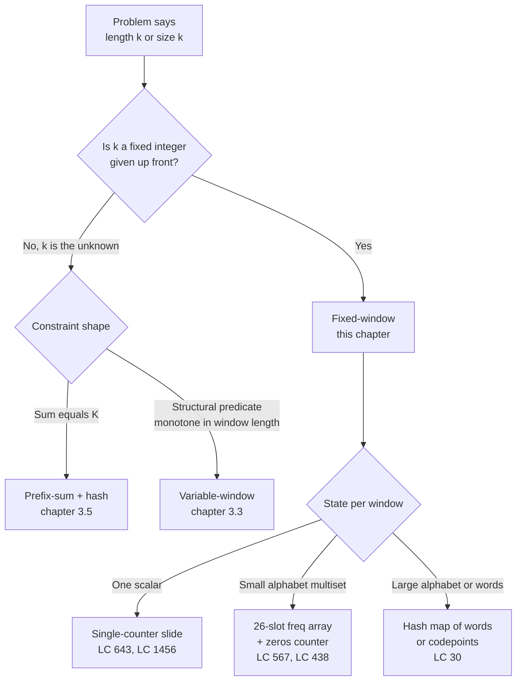

# Sliding window: fixed size

A length-100,000 array of integers. A window of length 4. The problem asks for the highest average across any contiguous 4-element slice. The honest first attempt loops over every starting index, sums the next four numbers, divides by four, keeps the best. It's correct. It's also doing 99,997 sums of four numbers each, about 400,000 additions when the right answer needs 100,003.

This chapter is the trick that takes the second number down to the first. The two preceding chapters, [Two pointers: opposite ends](./00-two-pointers-opposite.md) and [Two pointers: same direction](./01-two-pointers-same-direction.md), trained the muscle: two indices walking an array, each iteration doing O(1) work, the total bounded by the array's length. Fixed-window keeps the muscle and changes the question. The two pointers no longer converge or chase each other; they move in lockstep, exactly `k` apart, and the object of interest is the slice between them.

## Why the obvious approach wastes most of its work

Look at what brute force actually computes. The window starting at index 0 covers `nums[0..3]`. The window starting at index 1 covers `nums[1..4]`. Three of those four numbers are the same. Brute force re-adds them anyway.

```python
# Brute force: O(n*k) — what we're replacing
def find_max_average_brute(nums, k):
    best_avg = float('-inf')
    for i in range(len(nums) - k + 1):
        avg = sum(nums[i:i+k]) / k
        if avg > best_avg:
            best_avg = avg
    return best_avg
```

The bug is not the loop body. The bug is that each call to `sum(nums[i:i+k])` re-adds k-1 numbers it already added on the previous iteration. On a length-100,000 array with k=4, that's roughly 400,000 additions where 100,000 would do.

The fix writes itself once you stare at the redundancy. Compute the sum of the first window once, the slow way. To get the next window's sum, subtract the element falling off the left edge and add the element entering on the right. One subtract, one add, no matter how big k is. The loop runs n-k times, each iteration does O(1) work, the total is O(n) regardless of k.

There's a small reduction hiding inside LC 643 that makes the chapter's signature problem easier than its title suggests. **Because k is a positive constant, the window with the maximum average is the same window with the maximum sum; we solve the integer problem and divide once at the end.** The "average" in the problem name is decoration. Track the integer sum across the slide; defer the division to the return statement. This will turn out to matter for more than just speed.

## The pattern

Two phases. Build the first window over `nums[0..k-1]`. Then slide.

```python
def find_max_average(nums, k):
    window_sum = sum(nums[:k])     # build phase: one O(k) pass
    best_sum = window_sum
    for r in range(k, len(nums)):  # slide phase: one O(1) step per index
        window_sum += nums[r] - nums[r - k]
        if window_sum > best_sum:
            best_sum = window_sum
    return best_sum / k
```

**Solution** — Python ([Java](./02-sliding-window-fixed/lc-643/sol.java) · [C++](./02-sliding-window-fixed/lc-643/sol.cpp) · [Go](./02-sliding-window-fixed/lc-643/sol.go))

```python
# LC 643. Maximum Average Subarray I
from typing import List


def find_max_average(nums: List[int], k: int) -> float:
    """LC 643. Maximum average over all length-k subarrays.

    Track the running sum across the slide. Postpone the division by k
    until the end so the float division runs once on the maximum sum.
    """
    n = len(nums)
    window_sum = sum(nums[:k])
    best_sum = window_sum
    for r in range(k, n):
        window_sum += nums[r] - nums[r - k]
        if window_sum > best_sum:
            best_sum = window_sum
    return best_sum / k
```

Two things in the loop body deserve attention.

The slide is *one* expression: `window_sum += nums[r] - nums[r - k]`. Splitting it into "add the incoming, then subtract the outgoing" reads more clearly but does the same arithmetic. Either is fine. Don't write it as two statements with a temporary; you'll forget which side of the assignment is which.

The comparison is on the integer sum, not the float average. We never divide inside the loop. The reduction above is doing real work here: `argmax(sum / k)` and `argmax(sum)` agree because k > 0, so we keep the integer sum and compare integers. Float division is one operation at the end, on the winner.

> [!IMPORTANT]
> The signal that triggers this pattern is a problem statement saying *"of length k"*, *"of size k"*, or *"every contiguous subarray of length exactly k"*. Anything where a constant window width is given up front instead of discovered during the search.[^1] If k is the unknown, you want a different chapter: [Sliding window: variable size](./03-sliding-window-variable.md) when a predicate drives the resize, or the prefix-sum-plus-hash combo (chapter 3.5) when a sum target drives it.

## The four primitives

The whole pattern surface is four operations: build the initial state, add the entering element, drop the leaving element, observe whether the current window is the new best. Different problems specialise the same four slots. The names matter: chapters 3.3 and 3.5 reuse this vocabulary without re-explaining it.

| Problem | `init_state` | `slide_in(state, x)` | `slide_out(state, x)` | `observe(state)` |
|---|---|---|---|---|
| LC 643 — max average | `sum = 0` | `sum += x` | `sum -= x` | `sum` (divide by k once at end) |
| LC 1456 — max vowels | `cnt = 0` | `cnt += is_vowel(x)` | `cnt -= is_vowel(x)` | `cnt` |
| LC 567 — perm-in-string | `freq = [0]*26` | `freq[x] += 1` | `freq[x] -= 1` | `freq == target_freq` |
| LC 30 — substring concat | `wordCount = {}` | `wordCount[token] += 1` | `wordCount[token] -= 1` | `wordCount == words_freq` |

When you meet a fixed-window problem, the work is filling those four cells. The skeleton is identical.[^2] Three of the rows above deserve a closer look, because they're the three problems on the chapter's CORE ladder and they exercise progressively richer state.

**LC 643 (Maximum Average Subarray I)** is the simplest possible specialisation. State per window collapses to a single integer. `slide_in` is `+= x`. `slide_out` is `-= x`. `observe` reads the integer, with the once-at-the-end division wrapped around the final answer. Nothing about LC 643 needs more than that.

**LC 1456 (Maximum Number of Vowels in a Substring of Given Length)** is LC 643 with a predicate stuck in front of the addition. State is still a single counter. The only difference is `slide_in(s, x)` adds 1 if x is a vowel and 0 otherwise; `slide_out` is symmetric. The Java/C++/Go implementations move the `is_vowel` check to a static inline, so the slide compiles down to the same assembly as LC 643. Identical algorithm, different primitive.

**LC 567 (Permutation in String)** is the first row where state stops being a scalar. The window's "state" is a 26-slot frequency array, one count per lowercase letter. `slide_in` and `slide_out` mutate one slot each. The hard part is `observe`: naive answer is `Arrays.equals(freq, target_freq)`, which is O(26) per slide. The optimisation that matters here gets its own section below.

## Worked example: LC 643 on `[2, 1, 5, 1, 3, 2, 1, 4]` with `k = 3`

Build the first window over indices 0..2: `2 + 1 + 5 = 8`. So `window_sum = 8`, `best_sum = 8`. The window's average is 8 / 3 ≈ 2.67.

Slide. Drop `nums[0] = 2`, add `nums[3] = 1`. `8 - 2 + 1 = 7`. Smaller than 8; best stays at 8.

Slide again. Drop `nums[1] = 1`, add `nums[4] = 3`. `7 - 1 + 3 = 9`. Bigger than 8; best becomes 9. **This is the answer.** Average is 9 / 3 = 3.0; the winning window is `[5, 1, 3]` at indices 2..4.

The remaining three slides are confirmation. `[1, 3, 2]` sums to 6. `[3, 2, 1]` sums to 6. `[2, 1, 4]` sums to 7. None reaches 9. End of array; return `9 / 3 = 3.0`.

Six windows in total. Five slides, each one subtract and one add, plus three integer comparisons that don't update best. The build is three additions. Eleven additions and five comparisons across the whole run, on an eight-element array. The widget below animates each step.

> **Interactive widget:** [Sliding window (fixed + variable size)](../widgets/w-09-sliding-window-expansion.yml) (panel `panel-a`) — rendered on the website; the YAML spec describes the keyframes.

*Static fallback: window sums across the six windows are `[8, 7, 9, 6, 6, 7]`; the running max stays at 8 after the build, jumps to 9 on the second slide, and holds 9 to the end.*

## Locating this pattern



*The decision tree to run once before reaching for code: first locate fixed-window inside the broader window family, then pick which state shape fits the problem.*

## What it actually costs

| Variant | Time | Space | Notes |
|---|---|---|---|
| Single counter (LC 643, LC 1456) | O(n) | O(1) | One integer of state per window. The cleanest case. |
| Frequency map, small alphabet (LC 567, LC 438) | O(n) | O(σ) | σ = 26 for lowercase letters. Use a fixed array, not a hash map. |
| Frequency map, large alphabet (LC 30) | O(n × L) | O(m) | L = word length, m = distinct keys in target. The slide steps in chunks of L. |
| Brute force | O(n × k) | O(1) | The wrong answer; what we replaced. |

The amortisation argument is standard. Each input element is added to the running aggregate exactly once when it enters the window, and removed exactly once when it leaves. Two charges per element, summed over n elements, gives O(n) total. CLRS Chapter 16 (Amortised Analysis, §16.1) carries this argument verbatim for stack push/pop; the slide is the same shape with `add` and `subtract` in place of `push` and `pop`.[^3]

## Frequency-map slide: from O(σ) per slide to O(1)

LC 567 is where the four-primitives table starts paying off. State per window is a 26-slot integer array, one count per lowercase letter. `slide_in` increments one slot; `slide_out` decrements one slot. So far this is the LC 643 template with an array instead of a single integer.

The naive `observe` compares two 26-slot arrays slot by slot:

```python
# Naive: O(26) per slide, O(26n) total
def check_inclusion_naive(s1, s2):
    if len(s1) > len(s2):
        return False
    k = len(s1)
    target = [0] * 26
    window = [0] * 26
    for c in s1:
        target[ord(c) - ord('a')] += 1
    for i in range(k):
        window[ord(s2[i]) - ord('a')] += 1
    if window == target:
        return True
    for r in range(k, len(s2)):
        window[ord(s2[r]) - ord('a')] += 1
        window[ord(s2[r - k]) - ord('a')] -= 1
        if window == target:           # ← the O(26) comparison
            return True
    return False
```

Correct. Within LC 567's time limits. Asymptotically O(σ × n) where σ = 26, which is technically O(n) for fixed alphabets but breaks down the moment you reuse the template on Unicode or word multisets.

The optimisation is a `zeros` counter. Maintain a *difference* array `diff[c] = window_freq[c] - target_freq[c]`. Track how many slots are currently zero. The window matches iff `zeros == 26`. Every slot update is O(1): increment, decrement, sign-flip check that bumps `zeros` up or down by one. The per-slide check collapses to `if zeros == 26`. The full code lives in the sibling `sol.py` and uses an `update` helper that returns +1 (slot just became zero), -1 (slot just left zero), or 0 (no transition).[^4] Total cost across the slide is O(n) regardless of σ; the alphabet only shows up in the O(σ) space for the difference array.

The pattern recurs. Whenever `observe` is naively a multi-slot comparison and the slide only mutates a few slots per step, an incremental matches-counter collapses observe to O(1). LC 438 (the same algorithm, different output shape) inherits the trick verbatim.

## When the pattern bends

The single-counter and 26-slot-frequency variants cover most fixed-window problems in interview rotation. LC 30 stretches the template into harder territory.

**Word-multiset slide (LC 30).** The matching unit is whole words, not characters. The window slides in increments of `wordLen`, and you run `wordLen` parallel slide-state machines, one per starting offset. LC 30 is the Hard rung of this chapter for a reason: the surface looks like LC 567 (find a window in s whose contents match a target multiset), but the multiset key changes shape, and readers who blindly apply the 26-slot template to LC 30 double-count.[^5] The sibling files cover LC 643, LC 1456, and LC 567; LC 30's full implementation is left to the reader as part of the CORE ladder.

**Auxiliary structures (LC 239, LC 480).** When the per-window aggregate is "the maximum" or "the median", you need a monotonic deque or a two-heap structure. Those problems exist, but they're owned by the chapter on monotonic stacks and queues (Part 4) and the heaps chapter (Part 6) respectively. Mention them only so the boundary is clear; don't try to teach the deque inside a sliding-window chapter.

## Two pitfalls that bite

> [!WARNING]
> **Computing the average inside the loop.** The first instinct on LC 643 is to write `if window_sum / k > best_avg` inside the slide. In Java, C++, and Go, integer division on a non-divisible sum truncates toward zero, and the canonical LC sample input `[1, 12, -5, -6, 50, 3]` with `k = 4` returns `12` instead of `12.75`. Fix: track the integer sum, divide once on the return statement. A user reported this exact bug on Stack Overflow in 2023; the accepted answer's diagnosis was "you converted to a float too early."[^6] Even in Python, where `/` is float division, comparing floats inside the loop accumulates rounding error and runs slower than integer comparison. Same fix applies. This is the reduction from earlier doing real work: maximum sum and maximum average rank windows identically when k is a positive constant, so we only ever divide on the answer.

> [!WARNING]
> **Off-by-one at the build/slide boundary.** The build covers indices `0..k-1`. The first slide adds index `k` and removes index `0`. So the slide loop starts at `r = k`, and the body reads `window_sum += nums[r] - nums[r - k]`. Common mistake: starting the slide at `r = k + 1`, which silently skips the first slide window. The other common mistake is starting at `r = 0` and trying to handle the build phase as a special case inside an `if`, which works but obscures the two-phase structure and reliably introduces a different off-by-one. Walk the first iteration on the canonical input on paper before trusting any sliding-window code you wrote.

A third pitfall worth naming briefly: re-comparing the full frequency array every slide on LC 567 / LC 438. It's correct, it passes within time limits, but it's O(σ) per slide instead of O(1). Reach for the `zeros` counter on the second pass through the pattern, not the first.

## Problem ladder

### CORE (solve all three to claim chapter mastery)

- [LC 643 — Maximum Average Subarray I](https://leetcode.com/problems/maximum-average-subarray-i/) [Easy] • fixed-window ★
- [LC 567 — Permutation in String](https://leetcode.com/problems/permutation-in-string/) [Medium] • fixed-window + char-count
- [LC 30 — Substring with Concatenation of All Words](https://leetcode.com/problems/substring-with-concatenation-of-all-words/) [Hard] • fixed-window + word-multiset

### STRETCH (optional)

- [LC 1456 — Maximum Number of Vowels in a Substring of Given Length](https://leetcode.com/problems/maximum-number-of-vowels-in-a-substring-of-given-length/) [Medium] • fixed-window
- [LC 438 — Find All Anagrams in a String](https://leetcode.com/problems/find-all-anagrams-in-a-string/) [Medium] • fixed-window + char-count

LC 643 is the chapter's signature problem (★) and the one the worked example and widget animate. LC 1456 is the gentlest second pass: same template, different `slide_in` predicate. LC 438 is LC 567 with a different return type; the `zeros` counter optimisation transfers verbatim.

## Where this leads

The variable-size cousin is [Sliding window: variable size](./03-sliding-window-variable.md). It keeps the slide-amortisation trick and the four-primitive vocabulary; `init_state`, `slide_in`, `slide_out`, `observe` carry across, but the window now grows and shrinks based on a predicate (longest substring with at most K distinct characters; smallest window covering a target multiset). Fixed-k from this chapter is the easy half. The hard half is deciding *when* to shrink.

If the window length is the unknown but the constraint is a sum target, the prefix-sum-plus-hash chapter is the destination instead. Same O(n) bound, different state, and the same four primitives reused on a cumulative-sum array rather than a sliding window.

## References

[^1]: Pat Reynolds, "Sliding Window Technique: A Comprehensive Guide," LeetCode Discuss study guide, 2023. <https://leetcode.com/discuss/study-guide/3722472/Sliding-Window-Technique:-A-Comprehensive-Guide>.

[^2]: AlgoMap, "Sliding Window: Variable Length + Fixed Length," 2024. <https://algomap.io/lessons/sliding-window>.

[^3]: Cormen, Leiserson, Rivest, Stein, *Introduction to Algorithms*, 4th ed., MIT Press, 2022, Chapter 16 §16.1 (Aggregate analysis).

[^4]: Algomaster.io, "Find All Anagrams in a String" (LC 438 walk-through). <https://algomaster.io/learn/dsa/find-all-anagrams-in-a-string>.

[^5]: codinginterview.com, "30. Substring With Concatenation Of All Words," 2025. <https://www.codinginterview.com/problems/substring-with-concatenation-of-all-words/>.

[^6]: User question, "Why does my code return 12 instead of 12.75 for Leetcode problem #643?" Stack Overflow, July 2023. <https://stackoverflow.com/questions/76660197/leetcode-643-maximum-average-subarray-i>.
