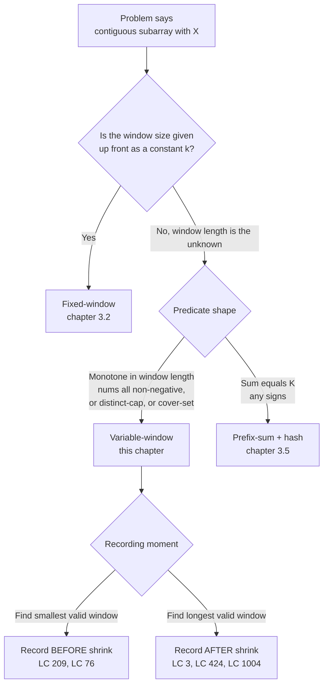

# Sliding window: variable size

Given the string `"pwwkew"`, find the length of the longest substring that contains no repeated character. The answer is 3, hit at `"wke"` (indices 2..4). The honest first attempt enumerates every `(l, r)` pair, walks the slice character by character, and keeps the longest one with no duplicate. At `n = 50,000`, that's somewhere around `10^9` slice-checks each costing up to `O(n)` to scan, comfortably past the time limit and well into the territory where you stare at the screen wondering what you missed.

What you missed is that most of those slices share characters with their neighbours, and that the right answer never grows by more than one character per step. [Sliding window: fixed size](./02-sliding-window-fixed.md) introduced the trick when `k` is part of the problem statement: build the first window in `O(k)`, then slide one element at a time in `O(1)`. This chapter is the harder half. The window length is the *unknown*; an inner shrink loop decides when the window has grown too far. Three classic problems, *longest substring without repeating characters*, *smallest subarray with sum at least target*, *minimum window containing all of t*, turn out to be the same algorithm with three different shrink conditions. That sentence is the chapter.

## Why the obvious approach burns most of its work

LC 3 (Longest Substring Without Repeating Characters) is the cleanest demonstration. Sample input `s = "pwwkew"`, expected answer `3`. The honest first attempt:

```python
# Brute force: O(n^2) worst case — what we're replacing
def length_of_longest_substring_brute(s):
    best = 0
    for i in range(len(s)):
        seen = set()
        for j in range(i, len(s)):
            if s[j] in seen:
                break
            seen.add(s[j])
            best = max(best, j - i + 1)
    return best
```

Outer loop fixes a starting index. Inner loop extends right until a duplicate appears, then bails out. Correct. On `"pwwkew"` it does roughly 18 comparisons; on a length-50,000 string of distinct characters it does roughly `n^2 / 2 = 1.25 × 10^9`, which is the LeetCode failure mode where your code passes the sample tests and dies on the boss case.

Stare at what brute force does on `"pwwkew"` starting from `i = 0`. It scans `p, w, w` and stops at the second `w`. For `i = 1`, it scans `w, w` and stops immediately. By `i = 2`, the inner loop scans `w, k, e, w` and stops at the second `w`. The inner loop *re-scans* characters it already proved were duplicate-free, three separate times. That's the redundancy. Brute force forgets between iterations of the outer loop.

The fix is to remember. One window, two pointers `l` and `r`, and a piece of state (a frequency counter, or a last-seen-index map) that records which characters are inside `nums[l..r]` right now. Extend `r` by one; if the new character violates the predicate, advance `l` until it doesn't. The window shrinks and grows asymmetrically, but each pointer only ever moves rightward and each pointer is bounded by `n`. Total work over all iterations is `O(n)`.

That collapse is correct only if the windowed quantity behaves predictably as the window changes. For LC 3, "no duplicate character" is monotone with respect to *shrinking*: removing a character can only fix a violation, never create one. For LC 209, "running sum" is monotone with respect to *growing*, but only when `nums[i] >= 0`. The instant any element can be negative, the technique breaks. We come back to that in the pitfalls.

## The pattern

Two pointers `l` and `r` defining the inclusive window over indices `[l, r]`. An outer for-loop advances `r` one step at a time, accumulating into the window state. An inner while-loop advances `l` while a *shrink condition* holds. The schematic:

```python
def variable_window(s):
    l = 0
    state = empty_state()
    answer = identity                                 # 0 for max-length, +inf for min-length
    for r in range(len(s)):
        state = expand_step(state, s[r])              # r always advances
        while shrink_condition(state):
            answer = record(answer, l, r, state)      # min-window: record BEFORE shrink
            state = shrink_step(state, s[l])
            l += 1
        answer = record(answer, l, r, state)          # max-window: record AFTER inner loop
    return answer
```

The outer loop runs `n` times. The inner while-loop's total iterations across all outer iterations is bounded by `n`, because `l` is monotonically non-decreasing and capped at `n`. CLRS Chapter 17 §17.1 calls this aggregate analysis; the `MULTIPOP`-on-a-stack worked example uses the same accounting, with each stack element pushed and popped at most once.[^1]

The signature instance is LC 3 written as the shrink-loop form, the obvious extension of the fixed-window template:

```python
def length_of_longest_substring(s):
    counts = {}
    l = 0
    best = 0
    for r, ch in enumerate(s):
        counts[ch] = counts.get(ch, 0) + 1
        while counts[ch] > 1:
            counts[s[l]] -= 1
            l += 1
        if r - l + 1 > best:
            best = r - l + 1
    return best
```

**Solution** — Python ([Java](./03-sliding-window-variable/lc-3/sol.java) · [C++](./03-sliding-window-variable/lc-3/sol.cpp) · [Go](./03-sliding-window-variable/lc-3/sol.go))

```python
# LC 3. Longest Substring Without Repeating Characters
from collections import Counter


def length_of_longest_substring(s: str) -> int:
    """LC 3 (last-index-jump form).

    For each new character, if it has been seen at index `prev` AND that
    `prev` lies inside the current window (`prev >= l`), jump l to prev + 1
    in O(1). Otherwise advance only r. The `last[ch] >= l` guard is what
    keeps stale entries from outside the window from causing a wrong jump.
    """
    last: dict[str, int] = {}
    l = 0
    best = 0
    for r, ch in enumerate(s):
        if ch in last and last[ch] >= l:
            l = last[ch] + 1
        last[ch] = r
        if r - l + 1 > best:
            best = r - l + 1
    return best


def length_of_longest_substring_shrink(s: str) -> int:
    """LC 3 (explicit shrink-loop form).

    The "obvious extension" of the fixed-window template: keep a frequency
    counter; when the new character's count exceeds 1, shrink l one step
    at a time until the duplicate is gone. Same O(n) amortized bound as
    the last-index-jump form, but with worse per-step worst case.
    """
    counts: Counter[str] = Counter()
    l = 0
    best = 0
    for r, ch in enumerate(s):
        counts[ch] += 1
        while counts[ch] > 1:
            counts[s[l]] -= 1
            l += 1
        if r - l + 1 > best:
            best = r - l + 1
    return best
```

> [!IMPORTANT]
> The shrink condition is the hinge. Across the three CORE problems, the outer expand step is the same shape; only the shrink condition changes. LC 3: *while the new character is a duplicate inside the window* (shrink until duplicate is gone). LC 209: *while sum >= target* (still satisfying the threshold; shrink to find a smaller window). LC 76: *while the window covers every character of t* (still covering; shrink to find a smaller cover). When you meet a contiguous-subarray problem with monotone state, the recipe is: pick the shrink condition, decide whether to record before or after the shrink, fill in the state.

## The four primitives, plus one new ingredient

[Sliding window: fixed size](./02-sliding-window-fixed.md) introduced the four-primitive vocabulary: `init_state`, `slide_in`, `slide_out`, `observe`. Variable-size windows use the same primitives plus one new ingredient: an **invariant** the window must satisfy, and a **shrink trigger** that fires when the invariant fails. The fifth column is what makes the pattern variable.

| Problem | `init_state` | `slide_in(state, x)` | `slide_out(state, x)` | `observe(state)` | invariant |
|---|---|---|---|---|---|
| LC 3 — longest distinct | `last_index = {}` | `last_index[x] = r` | (jump-based; no shrink loop) | `r - l + 1` | every char distinct in window |
| LC 209 — min sum ≥ target | `sum = 0` | `sum += x` | `sum -= x` | `sum`, length when met | `sum < target` until valid |
| LC 76 — min window cover | `freq = Counter()` | `freq[x] += 1` | `freq[x] -= 1` | length when matched | every needed char covered |
| LC 424 — replacement budget | `freq` map, `mx` | `freq[x] += 1`; bump `mx` | `freq[x] -= 1` | `r - l + 1` | `(r - l + 1) - mx <= k` |

The first column lists problems in difficulty order across the chapter, not LC numerical order. The skeleton is identical; the work is filling those five cells.

## Worked example: LC 3 on `"pwwkew"`

The window starts empty: `l = 0`, `last = {}`, `best = 0`. The shrink-loop form (closer to the four-primitive template, easier to teach) walks like this.

`r = 0, ch = 'p'`. Add to window: `counts['p'] = 1`. No duplicate; nothing to shrink. Record length 1; `best = 1`.

`r = 1, ch = 'w'`. `counts['w'] = 1`. No duplicate; record length 2; `best = 2`.

`r = 2, ch = 'w'`. `counts['w'] = 2`. *Predicate violated.* Shrink: drop `s[0] = 'p'`, `counts['p'] = 0`, `l = 1`. Still `counts['w'] = 2`; shrink again: drop `s[1] = 'w'`, `counts['w'] = 1`, `l = 2`. Predicate restored. Record length 1; `best` stays at 2.

`r = 3, ch = 'k'`. `counts['k'] = 1`. Record length 2; `best` stays.

`r = 4, ch = 'e'`. `counts['e'] = 1`. Record length 3; `best = 3`. **This is the answer.** The optimal substring is `"wke"`.

`r = 5, ch = 'w'`. `counts['w'] = 2`. Shrink: drop `s[2] = 'w'`, `counts['w'] = 1`, `l = 3`. Predicate restored. Record length 3; `best` stays.

End of string; return 3. The widget animates exactly this trace, with the shrink phases at `r = 2` and `r = 5` rendered as discrete steps so the work that the optimization will replace is visible.

> **Interactive widget:** [Sliding window (fixed + variable size)](../widgets/w-09-sliding-window-expansion.yml) (panel `panel-b`) — rendered on the website; the YAML spec describes the keyframes.

*Static fallback: window grows to length 2 (`"pw"`), then a shrink at `r = 2` collapses it to length 1; grows again to length 3 (`"wke"`) at `r = 4` setting the optimum; one more shrink-and-grow at `r = 5` produces `"kew"` of the same length. Three record events update `best`, climbing 1 → 2 → 3.*

## What it actually costs

| Variant | Time | Space | Notes |
|---|---|---|---|
| LC 3 (shrink-loop form) | O(n) amortized | O(min(n, σ)) | σ = alphabet size; per-step worst case O(n) on adversarial inputs |
| LC 3 (last-index-jump form) | O(n) amortized | O(min(n, σ)) | per-step worst case O(1) |
| LC 209 (sum ≥ target, non-negative) | O(n) | O(1) | aggregate analysis: `l` advances at most n times in total |
| LC 76 (min cover) | O(m + n) | O(σ) | `m = \|t\|`, `n = \|s\|`. The `have/required` counter keeps each step O(1). |
| LC 76, fixed alphabet | O(m + n) | O(1) | If keys are 128-byte ASCII, σ collapses to a constant. |

For LC 76 specifically, the integer counter is what pulls the algorithm down from `O(m × |t|)` (a full map equality check per step) to `O(m + n)`. Without it, the inner check would compare two hash maps every iteration; with it, each step does at most one map increment, one map decrement, and one integer compare.

LC 3's first row hides a wrinkle. The shrink-loop form is `O(n)` amortized but `O(n)` per step in the worst case, and the gap is real. A small change to the state collapses it.

### Last-index jump: from a shrink loop to a single assignment

The shrink-loop form is easy to teach because it mirrors the four-primitive template exactly. It is also wasteful. Look at what happens at `r = 2` on `"pwwkew"`: the inner loop drops `'p'`, then drops `'w'`, then exits. Two shrink steps to reach the single index `l = 2` where the duplicate stops being a duplicate. The destination was knowable in `O(1)`; we got there in two steps.

The fix is the chapter's highest-leverage trick. Instead of a frequency counter, keep a `last_index` map: each character maps to its most recent index inside `s`. When `r` reads a character that was seen before at index `prev`, advance `l` straight to `prev + 1`. One assignment. The shrink loop disappears.

```python
def length_of_longest_substring(s):
    last = {}
    l = 0
    best = 0
    for r, ch in enumerate(s):
        if ch in last and last[ch] >= l:
            l = last[ch] + 1
        last[ch] = r
        if r - l + 1 > best:
            best = r - l + 1
    return best
```

The guard `last[ch] >= l` is mandatory and is where most "almost right" submissions go wrong. After processing `"pwwkew"` through index 5, `last['p'] = 0`. That entry is *stale*. The character `'p'` is no longer inside the window, because `l` has moved past 0. If a later iteration finds `'p'` again, the unconditional jump `l = last['p'] + 1 = 1` would move `l` *backward* into territory the algorithm already discarded. The guard says: only jump when the previous index lies inside the *current* window. Without it, the algorithm corrupts the window on any string where a character recurs after a gap; with it, stale entries are silently ignored and overwritten on the next assignment.

The complexity argument doesn't change. Both forms are amortized `O(n)` by aggregate analysis: every character is read once and `l` advances at most `n` times in total. What changes is the per-step worst case. The shrink-loop form on a pathological input (say, a 50,000-character string of distinct letters followed by a single duplicate of the first letter) drains the entire window character by character, paying `O(n)` for one duplicate. The last-index-jump form pays `O(1)`. The LeetCode discussion thread for LC 3 documents this exact failure: the naive shrink-loop times out on the hidden adversarial test case; the jump form does not.[^2]

> **Interactive widget:** [Longest Substring Without Repeating Characters (LC 3) — last-index jump](../widgets/e-LC003-longest-substring.yml) — rendered on the website; the YAML spec describes the keyframes.

*The widget traces the last-index-jump form on the same `"pwwkew"`, showing the two jumps at `r = 2` and `r = 5` as single hops. Step 7 surfaces the now-stale `last['p'] = 0` entry the guard would protect against on a longer input.*

## Where variable-window sits in the broader window family



*Decision tree readers run once to map a contiguous-subarray problem onto a sub-pattern in this chapter.*

## When the pattern bends

The skeleton stays. The state, the shrink condition, and the recording moment vary. Four sub-patterns cover essentially every variable-window problem in interview rotation.

**Min-window with sum threshold (LC 209).** Numeric threshold, non-negative input. Shrink while still satisfying threshold; record length before each shrink. Apply on `target = 7, nums = [2, 3, 1, 2, 4, 3]` and the window expands four times to reach sum 8 ≥ 7, records length 4, then shrinks past threshold and re-grows twice more, ratcheting the answer down to 2. The trace structure is the same as LC 3 with "sum drops below target" replacing "duplicate gone."

**Max-window with cardinality cap (LC 3, LC 904, LC 340).** Predicate fails on expansion (a duplicate appears, or the distinct count exceeds `K`). Shrink while violated; record length after the inner loop, when the violation has been cleared. LC 904 (Fruit Into Baskets) is the `K = 2` instance of "longest with at most `K` distinct"; the `K`-parameterised LC 340 sits behind a paywall and is not in the ladder.

**Max-window with bounded fix budget (LC 424, LC 1004).** Window grows freely; the shrink condition is the budget being exceeded. LC 424 (Longest Repeating Character Replacement) has a clean monotone-tracking trick: `mx` (max character frequency seen *ever* across the run) is a non-decreasing scalar that the window-shrink does not need to update for correctness, because the answer of interest is `n - l`, not a per-step recomputed maximum.[^3] LC 1004 (Max Consecutive Ones III) is the binary-array variant of the same idea: flip at most `K` zeros to ones, find the longest run.

**Min-window with cover-set predicate (LC 76).** The hardest variant in this chapter. State is two character-count maps (`window` and `need`) plus an integer pair `(have, required)`. The predicate is "window covers every character of `t` with multiplicity"; shrink while still covered, record before each shrink. The `have == required` counter is what keeps the inner check `O(1)`, and the rest of this section explains why.

### `have == required`: from O(σ) coverage check to O(1)

LC 76 wants the smallest substring of `s` that contains every character of `t`, including duplicates. For `s = "ADOBECODEBANC", t = "ABC"`, the answer is `"BANC"`. For `t = "AABC"`, the answer requires *two* `A`'s; the window `"BAC"` does not qualify even though it has all three letter types.

The naive coverage check compares two hash maps slot by slot every iteration: O(|t|) per step, O(m × |t|) total. The optimisation is an integer counter `have` that tracks how many *distinct* characters of `t` are currently at-or-above their required count inside the window. The window covers `t` iff `have == required`, where `required = len(need)` is the count of distinct characters in `t`.

The increment and decrement guards are asymmetric, and getting them wrong is the most common LC 76 bug. **Increment `have` exactly when `window[c]` *becomes* equal to `need[c]`**, using `==`, not `>=`. **Decrement `have` exactly when `window[c]` falls *strictly below* `need[c]`**, using `<` *after* the in-place decrement, not `<=`. The asymmetry encodes the meaning of `have`: a needed character with count strictly above its requirement is covered just as much as one at exactly the requirement, so adding a fourth `'A'` when `need['A'] = 2` doesn't change coverage; only the moment we cross the boundary in either direction does.

Each step does at most one map increment, one map decrement, and one integer compare, all `O(1)`. The total cost is `O(m + n)` regardless of `t`'s length.[^4]

## Three pitfalls that bite

> [!WARNING]
> **Reaching for sliding window on a mixed-sign array.** The algorithm runs to completion but returns wrong answers on inputs with `nums[i] < 0`. Submission passes the sample tests (often only positive numbers) and dies on the hidden case. The trigger for switching: if the constraints don't state `nums[i] >= 0`, sliding window doesn't apply. The "sum >= target" invariant for LC 209 requires the running sum to be monotone in window length, which holds only for non-negative inputs. The most-linked Medium write-up of LC 560 carries a section titled "Why Does Sliding Window Not Work?" specifically because so many readers reach for it before noticing the predicate is non-monotone over mixed-sign input.[^5] Use [The prefix-sum + hash-map combo](./05-prefix-sum-hash.md) instead.

> [!WARNING]
> **LC 76: bumping `have` on `>=` instead of `==`.** For `t = "aab"`, the window `"a"` already satisfies `window['a'] = 1 >= need['a']`-treated-as-`== 1`, falsely claiming coverage. The output is missing one of the required `a`'s. Increment `have` exactly once, the moment `window[c]` *becomes* equal to `need[c]`. Mirror rule on the decrement: drop on strict `<` *after* the in-place decrement, not on `<=`. Transposing either operator silently breaks duplicate handling.

> [!WARNING]
> **LC 3 last-index-jump: forgetting the `last[ch] >= l` guard.** Without the guard, `l = last[ch] + 1` can jump *backward* into discarded territory whenever a character recurs after `l` has already moved past its previous index. On `"abba"`, processing `'a'` at index 3 with `last['a'] = 0` and `l = 2`, the unguarded jump sets `l = 1`, which is wrong; `l` should stay at 2. The bug is silent: the algorithm runs to completion and returns a too-large answer (length 3 instead of the correct 2). The guard is one extra term in the conditional and is the single line that separates a correct submission from a wrong-answer one.

## Problem ladder

### CORE (solve all three to claim chapter mastery)

- [LC 3 — Longest Substring Without Repeating Characters](https://leetcode.com/problems/longest-substring-without-repeating-characters/) [Medium] • variable-window-with-distinct-cap ★
- [LC 209 — Minimum Size Subarray Sum](https://leetcode.com/problems/minimum-size-subarray-sum/) [Medium] • variable-window-monotone-shrink
- [LC 76 — Minimum Window Substring](https://leetcode.com/problems/minimum-window-substring/) [Hard] • variable-window-with-counter-map

### STRETCH (optional)

- [LC 424 — Longest Repeating Character Replacement](https://leetcode.com/problems/longest-repeating-character-replacement/) [Medium] • variable-window-with-replacement-budget
- [LC 1004 — Max Consecutive Ones III](https://leetcode.com/problems/max-consecutive-ones-iii/) [Medium] • variable-window-with-flip-budget

LC 3 is the chapter's signature problem (★) and the one both widgets animate. LC 209 is the cleanest demonstration of the shrink-while-still-satisfied shape; LC 76 is the algorithmically hardest and the chapter's payoff. The CORE three span Medium, Medium, Hard. The variable-window pattern has no canonical Easy because the "easy" problems on LC's `sliding-window` tag (LC 219, LC 643, LC 1652) are all fixed-window and live in [Sliding window: fixed size](./02-sliding-window-fixed.md). The frontmatter's `no-easy-canonical` curation flag records this honestly; it is not a gap in the ladder, it is a property of the pattern.

## Where this leads

When the array contains negative numbers and the question is "subarrays with sum equal to K," the monotonicity that makes variable-window correct vanishes. The fix is [The prefix-sum + hash-map combo](./05-prefix-sum-hash.md): same `O(n)` bound, different state, different mechanic, and same four-primitive vocabulary applied to a cumulative-sum array rather than a sliding window.

When the per-window aggregate is "the maximum" or "the median" rather than a counter, the window state needs a monotonic deque or a two-heap structure. Those problems exist (LC 239, LC 480), and the data structures are owned by [Monotonic stacks and queues](../part-4-stack-queue-patterns/01-monotonic-deque.md) and the [Heaps](../part-6-trees-heaps/04-heaps-priority-queues.md) chapter; the variable-window scaffold is what they sit on top of.

## References

[^1]: Cormen, Leiserson, Rivest, Stein, *Introduction to Algorithms*, 4th ed., MIT Press, 2022, Chapter 17 §17.1 (Aggregate analysis).

[^2]: aadymanda, "Sliding Window Pattern," LeetCode discussion thread, 2024. <https://leetcode.com/discuss/post/6901308/sliding-window-pattern-by-aadymanda-jq9f/>.

[^3]: Top-voted solution thread for LC 424, LeetCode discussion. <https://leetcode.com/problems/longest-repeating-character-replacement/solutions/>.

[^4]: doocs/leetcode mirror, "76. Minimum Window Substring." <https://github.com/doocs/leetcode/blob/main/solution/0000-0099/0076.Minimum%20Window%20Substring/README_EN.md>.

[^5]: Yumin Lee, "LeetCode 560: Subarray Sum Equals K," Medium, 2022-10-10. <https://yuminlee2.medium.com/leetcode-560-subarray-sum-equals-k-9eb688e43534>.
