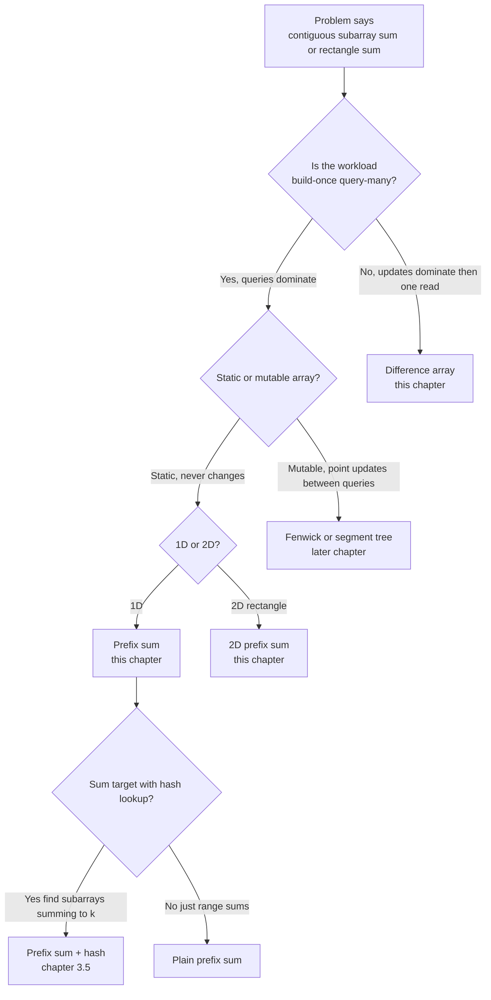
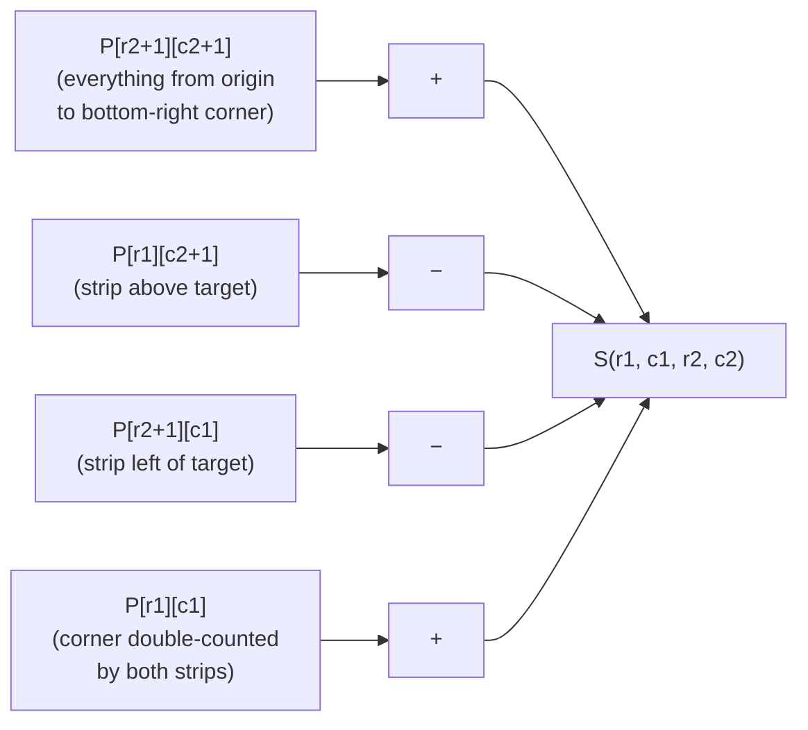
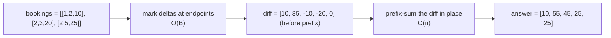

# Prefix sums and difference arrays

Ten thousand integers in an array, ten thousand range-sum queries against it. The honest first attempt loops the slice on every query. That's roughly `10^4 × 10^4 = 10^8` additions, slow enough to time out on LeetCode and slow enough that any production service that ships it has a bad weekend coming. The trick that takes the same workload down to about `2 × 10^4` operations is one extra array and one subtraction per query.

This chapter is that trick and its three close cousins. The 1D primitive (build once, query many times) is the headline. A 2D extension via inclusion-exclusion answers rectangle-sum queries with the same constant cost regardless of rectangle size; a 1984 SIGGRAPH paper called it the *summed-area table*, and Viola-Jones face detection runs on it. The inverse direction, many range *updates* followed by one final *read*, is the difference array. All three share the same one-pass build and the same arithmetic identity. Three sibling chapters have led here. [Two pointers: opposite ends](./00-two-pointers-opposite.md), [Sliding window: fixed size](./02-sliding-window-fixed.md), and [Sliding window: variable size](./03-sliding-window-variable.md) covered the techniques that work when the windowed quantity is monotone in window length. Prefix sums work when it isn't.

## Why the obvious approach wastes most of its work

The canonical introduction is LC 303 (Range Sum Query - Immutable). The shape: an `init(nums)` that builds whatever data structure you want, then a stream of `sumRange(left, right)` calls each returning the sum of `nums[left..right]` inclusive. The honest first attempt stores the array and recomputes:

```python
class NumArray:
    def __init__(self, nums):
        self.nums = nums

    def sumRange(self, left, right):
        return sum(self.nums[left:right + 1])      # O(r - l + 1) per query
```

Correct on every input. On the LC sample case `nums = [-2, 0, 3, -5, 2, -1]` with three queries it answers `[1, -1, -3]` instantly. Stress-test it with the constraint LC actually states (`n <= 10^4`, "at most `10^4` calls will be made to sumRange"), and it does about `n × Q = 10^8` additions in the worst case. That's the order of magnitude where a naive solution starts timing out on hidden test cases.

Stare at what brute force re-computes. Query 1 sums `nums[0..2]`. Query 3 sums `nums[0..5]`, which includes the same first three elements. Query 2 sums `nums[2..5]`, which shares four elements with query 3. The work being repeated is exactly the partial sums we keep walking past. Compute every partial sum *once* up front, store them, and a range sum collapses to one subtraction.

Here's the identity. If we define `prefix[i]` as the sum of the first `i` elements of `nums`,

```text
prefix[i] = nums[0] + nums[1] + ... + nums[i-1]
```

then the sum of `nums[l..r]` inclusive is `prefix[r+1] - prefix[l]`. Two reads, one subtract, regardless of `r - l + 1`. Build the table in `O(n)`, answer every query in `O(1)`. The total cost is `O(n + Q)` instead of `O(n × Q)`.

## The pattern

Two phases. Build the prefix array in one pass. Answer every query as a single subtraction.

```python
def build_prefix(nums):
    n = len(nums)
    prefix = [0] * (n + 1)              # length n+1; prefix[0] = 0 is the sentinel
    for i in range(n):
        prefix[i + 1] = prefix[i] + nums[i]
    return prefix


def range_sum(prefix, l, r):
    return prefix[r + 1] - prefix[l]    # nums[l..r] inclusive
```

**Solution** — Python ([Java](./04-prefix-sums/lc-303/sol.java) · [C++](./04-prefix-sums/lc-303/sol.cpp) · [Go](./04-prefix-sums/lc-303/sol.go))

```python
# LC 303. Range Sum Query - Immutable
from typing import List


class NumArray:
    """LC 303. Construct in O(n); answer sumRange in O(1).

    Invariant: prefix[i] = nums[0] + nums[1] + ... + nums[i-1] for i in [0, n].
    Range sum nums[l..r] inclusive = prefix[r+1] - prefix[l].
    """

    def __init__(self, nums: List[int]) -> None:
        n = len(nums)
        # prefix has length n + 1; prefix[0] = 0 is the empty-sum sentinel.
        self.prefix = [0] * (n + 1)
        for i in range(n):
            self.prefix[i + 1] = self.prefix[i] + nums[i]

    def sumRange(self, left: int, right: int) -> int:
        return self.prefix[right + 1] - self.prefix[left]
```

Three details on this code carry the rest of the chapter.

The prefix array has length `n + 1`, **not** `n`. The extra slot is `prefix[0] = 0`, the **empty-sum sentinel**. It's the load-bearing trick. Without it, the formula needs a special case for `l = 0` (`if l == 0: return prefix[r]`), and that special case is wrong half the time anyone writes it. With the sentinel, one identity covers every range. This is the same insight the next chapter will need when it stores `{0: 1}` as an initial entry in a hash map: the sentinel makes the boundary case work without a branch.

> [!IMPORTANT]
> **The off-by-one rule, written once.** `prefix[0] = 0`. `prefix[i]` is the sum of `nums[0..i)`, exclusive on the right (`i` elements counting from zero). The range sum of `nums[l..r]` inclusive is `prefix[r+1] - prefix[l]`, **not** `prefix[r] - prefix[l]` and **not** `prefix[r] - prefix[l-1]`. The `+1` shows up on the inclusive endpoint `r`; the lower endpoint `l` is the start of the slice we want to keep, so it's the subtrahend. Two conventions coexist in the public literature (1-indexed `prefix[R] - prefix[L-1]`; 0-indexed `prefix[r+1] - prefix[l]`). They're equivalent up to a shift; pick one and never mix them. This handbook uses the 0-indexed form throughout.[^1]

The build loop is `for i in range(n): prefix[i+1] = prefix[i] + nums[i]`. The write index is `i + 1`. The read index is `i`. Confusing the two writes the previous prefix back over itself and silently produces a left-shifted result.

The Java, C++, and Go reference implementations widen the prefix accumulator to `long` / `long long` / `int64`. LC 303's stated bounds let the worst-case sum fit in 32 bits, but the chapter contract is to defend against overflow on adversarial inputs without thinking about it case by case. Python has arbitrary-precision integers and doesn't need the cast.

## Locating this pattern

The decision tree to run before reaching for code:



*The four-way fork: 1D prefix, 2D prefix, difference array, or "you actually want the next chapter, or a tree." Static is the magic word. Every update invalidates the prefix array.*

## Worked example: LC 303 on the canonical sample

The widget canonical input is `nums = [3, -1, 4, 1, 5, -9, 2, 6]` with one query for `sumRange(2, 5)`. Build the prefix once, walking left to right. After the build, prefix = `[0, 3, 2, 6, 7, 12, 3, 5, 11]`, nine entries, one more than the input. The query then fires once and answers in two reads.

The arithmetic at the moment that matters: `prefix[r + 1] - prefix[l] = prefix[6] - prefix[2] = 3 - 2 = 1`. That's the sum of `nums[2..5] = [4, 1, 5, -9]`. The answer is `1`. The slice contains a `-9`, which is the kind of mixed-sign input where sliding window stops working. Prefix sums don't care.

> **Interactive widget:** [Prefix sum (cumulative + range query)](../widgets/w-10-prefix-sum-cumulative.yml) — rendered on the website; the YAML spec describes the keyframes.

*Static fallback: row 1 holds `nums = [3, -1, 4, 1, 5, -9, 2, 6]`; row 2 fills left to right with the prefix `[0, 3, 2, 6, 7, 12, 3, 5, 11]`; the highlighted query reads `prefix[6] - prefix[2] = 3 - 2 = 1`.*

## What it costs

| Variant | Time | Space | Notes |
|---|---|---|---|
| 1D prefix build | O(n) | O(n) | One pass, one addition per index |
| 1D range query (after build) | O(1) | O(1) per query | Two reads, one subtract |
| 2D prefix build | O(m × n) | O(m × n) | Three reads, one write per cell |
| 2D rectangle query (after build) | O(1) | O(1) per query | Four reads, three additions |
| Difference array, B updates + 1 read | O(B + n) | O(n) | Inverse of the prefix-sum primitive |
| Brute force range sum | O(n × Q) | O(n) | The wrong answer; what we replaced |

The 1D bound is one paragraph's worth of argument. `prefix[i+1] = prefix[i] + nums[i]` evaluated left to right does exactly `n` additions, so build is `O(n)`. Every range query is two array reads and one subtract, each constant time. The total over `Q` queries is `O(n + Q)`. Brute force is `O(n × Q)`, which at `n = Q = 10^4` is the difference between fast enough and timed out.[^2]

The 2D bound runs the same argument once per axis, with inclusion-exclusion in the recurrence and four corners in the query. The next two sections are 2D and difference arrays in that order.

## 2D prefix sums: inclusion-exclusion on four corners

LC 304 (Range Sum Query 2D - Immutable) lifts the same shape into a matrix. Given an `m × n` matrix and a stream of "sum over the rectangle with corners `(r1, c1)` and `(r2, c2)` inclusive" queries, build a prefix table once and answer each query with four reads.

The prefix table has dimensions `(m + 1) × (n + 1)`. Both the top row `P[0][*]` and the leftmost column `P[*][0]` are zero (the same empty-sum sentinel, now along two axes). `P[i+1][j+1]` stores the sum of every cell in the rectangle with top-left corner `(0, 0)` and bottom-right corner `(i, j)` inclusive.

The build recurrence:

```text
P[i+1][j+1] = matrix[i][j] + P[i+1][j] + P[i][j+1] - P[i][j]
```

Each cell adds itself, plus the strip directly above (`P[i][j+1]` covers everything in rows `0..i-1` and columns `0..j`), plus the strip directly to the left (`P[i+1][j]` covers rows `0..i` and columns `0..j-1`). Those two strips overlap in a sub-rectangle: the cells in rows `0..i-1` and columns `0..j-1`, which is exactly `P[i][j]`. Without the subtraction we'd double-count it. Inclusion-exclusion in three terms.

The rectangle query is the same four-corner identity:

```text
S(r1, c1, r2, c2) = P[r2+1][c2+1] - P[r1][c2+1] - P[r2+1][c1] + P[r1][c1]
```

The signs are easier to derive than to memorize. The big rectangle from origin to `(r2, c2)` is `P[r2+1][c2+1]`. We subtract the two strips above and to the left of the target: rows `0..r1-1` (which is `P[r1][c2+1]`) and columns `0..c1-1` (which is `P[r2+1][c1]`). Those two strips overlap in the corner sub-rectangle from origin to `(r1-1, c1-1)`, so we add it back: `P[r1][c1]`. Plus, minus, minus, plus.

A worked example fixes the signs. Take the 4×5 matrix:

```text
matrix = [[3, 0, 1, 4, 2],
          [5, 6, 3, 2, 1],
          [1, 2, 0, 1, 5],
          [4, 1, 0, 1, 7]]
```

Querying `S(1, 1, 2, 3)`, the 2×3 rectangle of cells `[[6, 3, 2], [2, 0, 1]]`, expects sum `14`. The four corners pulled from the built prefix table are `P[3][4] = 28`, `P[1][4] = 8`, `P[3][1] = 9`, `P[1][1] = 3`, giving `28 - 8 - 9 + 3 = 14`. The big rectangle from origin to `(2, 3)` covers `5 + 6 + 3 + 2 + 1 + 2 + 0 + 1 + 3 + 0 + 1 + 4 = 28`. Subtract the strip above (row 0 columns 0..3) which has sum `8`. Subtract the strip to the left (rows 0..2 column 0) which has sum `9`. Both subtractions removed the corner cell at `(0, 0)` with value `3`, so add it back. Plus, minus, minus, plus, and the four numbers carry the geometric meaning of the inclusion-exclusion.

The Mermaid below shows the four-corner pull:



*The four-corner formula written out: subtract the two "extra" strips, add back the corner that both strips claimed.*

The build's offset trap is the same one the 1D version warned about, doubled. The inclusive-corner indices in the query get the `+1` (because that's the sentinel-shifted side); the negative-subtractor corners do **not** get the `+1` on their own axis. Writing `P[r2][c2] - P[r1][c2] - P[r2][c1] + P[r1][c1]` and forgetting the four `+1` shifts on the inclusive corners is the second-most-common 2D bug.[^3] Crow's 1984 SIGGRAPH paper proved the headline result that drives the technique: "the sum over any rectangular area requires exactly four array references regardless of the area size."[^4] Computer vision later renamed the same table the *integral image*, and Viola-Jones face detection evaluates millions of Haar-like rectangle features per frame because each one is four reads.

## Difference arrays: the inverse direction

The same primitive runs backward. Suppose the workload isn't "build once, query many" but "many range updates, then read every cell once": apply `+10` to indices `0..2`, then `+20` to indices `1..2`, then `+25` to indices `1..4`, then ask for the final array. The eager approach loops the range on every update, paying `O(B × n)` for `B` updates over an array of length `n`. At `B = n = 10^4` that's the same `10^8` ops we were trying to escape.

The fix is to mark the *change* at the boundaries instead of touching every cell. Maintain a `diff` array. For each update `(l, r, delta)` write `diff[l] += delta` and `diff[r+1] -= delta`. After all updates, take the prefix sum of `diff` in place. The result *is* the final array.

```python
def apply_updates(updates, n):
    diff = [0] * n                          # length n; diff[i] is the change at index i
    for l, r, delta in updates:
        diff[l] += delta
        if r + 1 < n:                       # the guard for the rightmost-cell case
            diff[r + 1] -= delta
    for i in range(1, n):                   # the same prefix-sum primitive, in place
        diff[i] += diff[i - 1]
    return diff
```

Total cost: `O(B + n)`. Each update does two writes (or one, if the range covers the tail). The final pass is `O(n)`. Beats `O(B × n)` whenever `B` is comparable to `n`.

Why the inverse direction works: the cumulative sum of a vector `[0, ..., 0, +δ, 0, ..., 0, -δ, 0, ..., 0]` with the `+δ` at index `l` and the `-δ` at index `r+1` is exactly `[0, ..., 0, δ, δ, ..., δ, 0, ..., 0]` with the `δ`-block over `[l..r]` inclusive. Stack `B` such updates, and linearity gives back the right answer in one prefix-sum pass.

This is the chapter's headline reduction, named explicitly:

> Range queries on a static array become O(1) lookups once you precompute the cumulative sum. The inverse, range updates with one final read, collapses to O(1) per update by working on the difference array instead. Both rest on the duality `prefix(diff(arr)) = arr`. Static is the magic word: every update *between* queries invalidates the prefix array. For dynamic arrays where queries and updates interleave, use a Fenwick tree or segment tree (Part 11).

LC 1109 (Corporate Flight Bookings) is the textbook difference-array problem. Bookings come in 1-indexed inclusive ranges `[first, last, seats]`; for the input `bookings = [[1,2,10], [2,3,20], [2,5,25]]` with `n = 5`, the answer is `[10, 55, 45, 25, 25]`. The translation from 1-indexed inclusive to 0-indexed open-on-the-right is `l = first - 1`, `r + 1 = last`. The reference implementation in the sibling files keeps the `if last < n` guard so the `diff[last] -= seats` write is suppressed when the booking covers the array's last flight. That out-of-bounds case is the second-most-common LC 1109 bug, after the off-by-one in translating the indexing.[^5]



*The difference-array shape on LC 1109; the inverse direction of the prefix-sum primitive, with the same one-pass cost.*

## When the pattern bends

**Prefix XOR (LC 1310, LC 1734).** XOR is its own inverse, so `prefix[r+1] XOR prefix[l] = XOR(nums[l..r])`. The same shape, different operator. XOR forms an abelian group with every element its own inverse, exactly the algebraic property the technique needs to support range queries.

**Prefix product with a suffix scan (LC 238).** Multiplication has no clean inverse over integers when zeros appear, and LC 238 explicitly bans division. The fix is two complementary scans. Maintain prefix-product left-to-right *and* suffix-product right-to-left; the answer for index `i` is `prefix[i] * suffix[i+1]`, where each side excludes the element at `i`. Two scans, `O(n)` total. The "subtract the prefix before the slice" of the canonical pattern becomes "multiply the two halves" because the operator's inverse is unavailable.

### LC 363: 2D prefix sums + binary search (the Hard rung)

LC 363 (Max Sum of Rectangle No Larger Than K) is the chapter's Hard rung and a chapter-by-itself in disguise. The 2D prefix sum is one ingredient; the binary search is the punchline. The technique:

Fix the top row `r1` and the bottom row `r2`. For each fixed pair, the sum of any rectangle bounded by `(r1, c1, r2, c2)` becomes a 1D problem: define `colSum[c] = P[r2+1][c+1] - P[r1][c+1] - P[r2+1][c] + P[r1][c]`, and the rectangle sum is `Σ colSum[c1..c2]`, which is itself a prefix-sum subtract on the running cumulative `S[c]`. So now the question collapses to: across all `(c1, c2)` pairs in this row-band, find the maximum `S[c2+1] - S[c1]` that's `<= K`.

Without the `<= K` constraint, the answer is just Kadane. *With* the constraint, you maintain a sorted set of prefix sums seen so far; for each `S[c2+1]`, look up the smallest `S[c1] >= S[c2+1] - K` (a TreeSet `ceiling` in Java, `std::set::lower_bound` in C++, `SortedList.bisect_left` in Python via `sortedcontainers`). That's the binary search. Total cost: `O(m² × n × log n)`. The sibling files don't ship LC 363. The chapter teaches you the 2D prefix-sum half; the binary-search-on-sorted-prefix-sums half is non-trivial enough that LC 363 deserves its own editorial walkthrough.

**Forward-reference to Fenwick and segment trees.** When the array is mutable, with point updates interleaved with range queries, a static prefix array forces a rebuild per update. Fenwick (binary indexed) trees and segment trees store partial-prefix information in a tree structure for `O(log n)` update *and* query. Wikipedia documents Fenwick as the dynamic generalization of prefix sums.[^6] We don't implement either here; both belong to a later chapter.

## Three pitfalls that bite

> [!WARNING]
> **The prefix array is length `n + 1`, not `n`.** This is the silent bug. Allocating `prefix = [0] * n` instead of `[0] * (n + 1)` makes the loop `prefix[i+1] = prefix[i] + nums[i]` index-out-of-range on the last iteration. Worse, in C++ with `std::vector<int> prefix(n)` it's undefined behaviour and might appear to work in debug builds. The mental model: `prefix` has *one more* slot than `nums`, and that extra slot is the leading zero.

> [!WARNING]
> **The query is `prefix[r + 1] - prefix[l]`, not the variations.** Three off-by-one shapes show up in interview submissions, and exactly one is correct: `prefix[r+1] - prefix[l]` (right). `prefix[r] - prefix[l]` (drops the element at index `r`). `prefix[r] - prefix[l-1]` (the 1-indexed convention applied to a 0-indexed array; works on every input where `l > 0`, fails when `l = 0` because `prefix[-1]` is the wrong cell in Python and out of range elsewhere). Walk one canonical input on paper before trusting any prefix-sum code you wrote.

> [!WARNING]
> **2D inclusion-exclusion: the `+1` offset only applies to the inclusive corners.** The canonical formula is `P[r2+1][c2+1] - P[r1][c2+1] - P[r2+1][c1] + P[r1][c1]`. Both inclusive corners (the bottom-right `(r2, c2)`) get the `+1` shift on each axis. The negative-subtractor corners (the top-left `(r1, c1)`) do **not** get the `+1`, because they're the *exclusive* boundary, one row above and one column left of the target rectangle. Forgetting either `+1` is invisible on small inputs and fails on the boss test where rows or columns matter.

## Problem ladder

### CORE (solve all three to claim chapter mastery)

- [LC 303 — Range Sum Query Immutable](https://leetcode.com/problems/range-sum-query-immutable/) [Easy] • prefix-sum-1d-precompute ★
- [LC 304 — Range Sum Query 2D Immutable](https://leetcode.com/problems/range-sum-query-2d-immutable/) [Medium] • prefix-sum-2d-rectangle-query
- [LC 363 — Max Sum of Rectangle No Larger Than K](https://leetcode.com/problems/max-sum-of-rectangle-no-larger-than-k/) [Hard] • prefix-sum-2d-with-binary-search *(reference: Python only)*

### STRETCH (optional)

- [LC 1109 — Corporate Flight Bookings](https://leetcode.com/problems/corporate-flight-bookings/) [Medium] • difference-array-range-update
- [LC 238 — Product of Array Except Self](https://leetcode.com/problems/product-of-array-except-self/) [Medium] • prefix-product-and-suffix-product

LC 303 is the chapter's signature problem (★) and the cleanest demonstration of the build-once-query-many shape. LC 304 lifts the same identity to 2D rectangles and exercises the inclusion-exclusion offsets; if you can derive the four-corner formula on paper without looking it up, the chapter has done its job. LC 363 is genuinely hard. The 2D prefix sum is necessary but not sufficient; the binary-search-on-sorted-prefix-sums step is what makes it Hard, and it's the kind of problem worth solving once and revisiting later. LC 1109 is the chapter's cleanest demonstration of the inverse direction, and LC 238 is the prefix-and-suffix variant that comes up when the operator's inverse isn't available.

## Where this leads

The natural extension is [The prefix-sum + hash-map combo](./05-prefix-sum-hash.md). When the question is "count subarrays whose sum equals K" with mixed-sign input, pure prefix sum on its own can't enumerate `(l, r)` pairs in `O(n)`. The hash-map layer recovers the missing index in `O(1)` per step by storing every prefix value seen so far. Same primitive, richer state. The dummy `{0: 1}` initial entry that the next chapter starts with is the same empty-sum sentinel from this chapter, now living in a hash map.

When the array becomes mutable, when point updates interleave with range queries, the static prefix array stops being enough. Fenwick trees and segment trees take over; both live in a later chapter.

## References

[^1]: USACO Guide, "Introduction to Prefix Sums," Silver tier. <https://usaco.guide/silver/prefix-sums>.

[^2]: USACO Guide, "Introduction to Prefix Sums," same source as [^1].

[^3]: USACO Guide, "More on Prefix Sums," Silver tier. <https://usaco.guide/silver/more-prefix-sums>.

[^4]: Crow, Franklin C., "Summed-area tables for texture mapping," SIGGRAPH '84 Proceedings, ACM Digital Library. <https://dl.acm.org/doi/10.1145/800031.808600>.

[^5]: LeetCode (via leetcode.ca mirror), "1109 - Corporate Flight Bookings," posted 2018-12-13. <https://leetcode.ca/2018-12-13-1109-Corporate-Flight-Bookings/>.

[^6]: Wikipedia contributors, "Prefix sum," last edited 2026-03-04. <https://en.wikipedia.org/wiki/Prefix_sum>.
