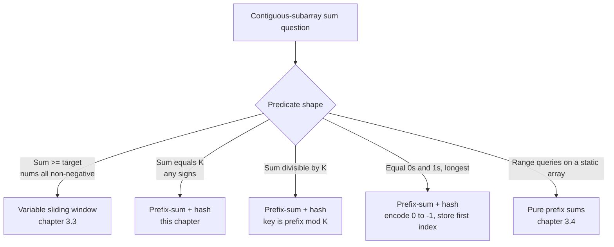

# The prefix-sum + hash-map combo

Three patterns ago, you were walking arrays with two indices, doing O(1) work per step. Now those indices have been replaced by something stranger: a hash map keyed on an *aggregate* of the array. Every running sum the algorithm has ever seen, all of them, all at once, with O(1) lookup. The pattern that absorbed this trick is the most-asked subarray-counting variant in interview rotation, and it lives at the exact bridge where two prior chapters fail.

[Sliding window: variable size](./03-sliding-window-variable.md) needs `nums[i] >= 0` to keep the running sum monotone in window length. The instant any element can be negative, the technique returns wrong answers. [Prefix sums and difference arrays](./04-prefix-sums.md) reduces a range sum to the subtraction `prefix[r+1] - prefix[l]`, but on its own it can only answer queries against a *fixed* `(l, r)` pair; counting how many `(l, r)` pairs satisfy `sum = k` still costs `O(n²)` if you enumerate them. This chapter is what happens when you put the two pieces together. The result is a single linear-time algorithm that handles mixed-sign inputs and counts pairs without enumerating them.

## Why brute force burns

The canonical problem is LC 560, *Subarray Sum Equals K*. Given an integer array `nums` and an integer `k`, return the number of contiguous subarrays whose sum equals `k`. Sample: `nums = [1, 1, 1]`, `k = 2`. Two subarrays sum to 2: `nums[0..1]` and `nums[1..2]`. Answer: 2.

The honest first attempt enumerates every `(l, r)` pair and accumulates the sum element by element. One counter increments on a match.

```python
# Brute force: O(n^2) — what we're replacing
def subarray_sum_brute(nums, k):
    count = 0
    for i in range(len(nums)):
        running = 0
        for j in range(i, len(nums)):
            running += nums[j]
            if running == k:
                count += 1
    return count
```

Correct on every input. At LC 560's stated bound `n <= 2 × 10^4`, the worst case does roughly `4 × 10^8` operations, comfortably past the time limit on the hidden test cases. A prefix-sum lookup brings the inner cost from O(n) to O(1) per pair, which trims the total to `O(n²)`. Same asymptotic, faster constant, still too slow when `n` grows.

The trick that gets to O(n) is the realisation that we don't need to enumerate the pairs. We just need to count them.

## Why sliding window fails on negatives, in one trace

Take `nums = [1, -1, 1, 1]`, `k = 2`. Brute-force enumerate every subarray:

| Subarray | Elements | Sum |
|---|---|---|
| `[0..0]` | `[1]` | 1 |
| `[0..1]` | `[1, -1]` | 0 |
| `[0..2]` | `[1, -1, 1]` | 1 |
| `[0..3]` | `[1, -1, 1, 1]` | 2 ✓ |
| `[1..1]` | `[-1]` | -1 |
| `[1..2]` | `[-1, 1]` | 0 |
| `[1..3]` | `[-1, 1, 1]` | 1 |
| `[2..2]` | `[1]` | 1 |
| `[2..3]` | `[1, 1]` | 2 ✓ |
| `[3..3]` | `[1]` | 1 |

Two hits: `[0..3]` and `[2..3]`. The correct answer is 2. Now run the naive variable sliding window: expand the right pointer, shrink the left while sum exceeds k.

```text
state = (l, r, sum, hits)
init: (0, -1, 0, 0)
r = 0: sum = 1.  not 2; do nothing.       state (0, 0, 1, 0)
r = 1: sum = 0.  not 2; do nothing.       state (0, 1, 0, 0)
r = 2: sum = 1.  not 2; do nothing.       state (0, 2, 1, 0)
r = 3: sum = 2.  HIT.                     state (0, 3, 2, 1)
       shrink l = 1, sum = 2 - 1 = 1.     state (1, 3, 1, 1)
       sum < 2; exit shrink.
done. reported = 1.
```

The window finds `[0..3]`, shrinks past the `-1` at index 1, and never recovers. `[2..3]` is invisible: by the time `r` reaches 3, the only window the algorithm tracks starts at `l = 0` (or `l = 1` after the shrink), and there is no mechanism to re-discover a subarray that starts at `l = 2`.[^1] The technique runs to completion and returns 1 instead of 2.

The fix is to stop maintaining a single window. Instead, accumulate every prefix sum the algorithm has ever seen, and at each step ask the hash whether any of those earlier prefixes is at distance `k` from the current one. Two distinct prefix values differ by `k`, the subarray between them sums to `k`, regardless of what happens in the middle.

## The reduction

[Prefix sums and difference arrays](./04-prefix-sums.md) gave you the identity that does the heavy lifting:

```text
range_sum(l, r) = prefix[r + 1] - prefix[l]
```

Setting `range_sum(l, r) = k` and solving for `prefix[l]`:

```text
prefix[r + 1] - prefix[l] = k    iff    prefix[l] = prefix[r + 1] - k
```

That's the chapter. As `r` walks left to right, for each new `r` the question "how many subarrays ending at `r` sum to `k`" becomes "how many earlier prefix values equal `prefix[r + 1] - k`". A hash map `{prefix_value: count}` of every prefix seen so far answers that in O(1). Total: O(n).

The shape of the algorithm follows immediately. One pass. One running sum. One hash map. The body of the loop is three lines: extend the running sum by the current element, look up `running - k` in the hash, increment the hash at the new running value.

## The pattern

```python
def subarray_sum(nums, k):
    counts = {0: 1}                    # empty-prefix seed; load-bearing
    prefix = 0
    answer = 0
    for x in nums:
        prefix += x
        answer += counts.get(prefix - k, 0)         # look up BEFORE inserting
        counts[prefix] = counts.get(prefix, 0) + 1
    return answer
```

**Solution** — Python ([Java](./05-prefix-sum-hash/lc-560/sol.java) · [C++](./05-prefix-sum-hash/lc-560/sol.cpp) · [Go](./05-prefix-sum-hash/lc-560/sol.go))

```python
# LC 560. Subarray Sum Equals K
from collections import defaultdict
from typing import List


def subarray_sum(nums: List[int], k: int) -> int:
    """LC 560. Count contiguous subarrays whose sum equals k.

    Invariant: at index i (inclusive), the number of subarrays ending at i
    whose sum is k equals counts[prefix - k], where prefix is the running
    sum through i. Sum that quantity over all i.
    """
    counts: defaultdict[int, int] = defaultdict(int)
    counts[0] = 1  # empty-prefix seed: lets a subarray starting at index 0 hit
    prefix = 0
    answer = 0
    for x in nums:
        prefix += x
        # Look up BEFORE inserting the current prefix; otherwise a k=0 input
        # would pair the current index with itself (an empty subarray).
        answer += counts[prefix - k]
        counts[prefix] += 1
    return answer
```

Two lines deserve attention before the worked example, because they are the two lines beginners get wrong.

The first is `counts = {0: 1}`. The hash map starts non-empty, with one entry: prefix value 0 mapped to count 1. The reason is the empty-prefix sentinel. From [Prefix sums and difference arrays](./04-prefix-sums.md), `prefix[0] = 0` represents the sum of zero elements, the empty prefix. When the running sum at index `r` first equals `k`, the matching subarray is `nums[0..r]`, and that corresponds to `prefix[r + 1] - prefix[0] = k`, which means the lookup is asking "have I seen a prefix of value 0?" The answer is yes; there is exactly one. The seed `{0: 1}` is the empty-prefix entry, identical in role to the `prefix[0] = 0` cell in the prefix-sum array. Drop the seed and the algorithm undercounts every subarray that starts at index 0.

The trace makes this visible. Run the algorithm on `nums = [1, 1, 1]`, `k = 2`, *without* the seed (`counts = {}`). At `i = 1`, `prefix = 2`, the lookup is for `2 - 2 = 0`. Counts is `{1: 1}`. The lookup misses. Answer stays at 0. The correct subarray `nums[0..1]` is silently dropped. Re-run with the seed: same step now finds `counts[0] = 1`, answer becomes 1, and by the end of the loop the algorithm reaches the correct answer of 2. One missing entry, one wrong answer.

The second line is the order: lookup *before* increment. We're counting subarrays `nums[l..r]` with `l <= r`. Earlier prefixes correspond to `l = 0, 1, ..., r`; the current prefix corresponds to `l = r + 1`, an empty subarray. Inserting first would let the algorithm pair the current index with itself when `k = 0`, double-counting. The order is not a stylistic choice; reversing it produces a wrong answer on any input where `k = 0`.

> [!IMPORTANT]
> The seed `{0: 1}` is not an optimisation. It is the empty-prefix sentinel from [Prefix sums and difference arrays](./04-prefix-sums.md), now living in a hash map. It is the difference between an answer of 1 and an answer of 2 on the canonical sample input. Walk a four-step trace on paper before trusting any prefix-sum-plus-hash code you wrote.[^2]

## The four primitives

[Sliding window: fixed size](./02-sliding-window-fixed.md) introduced the four-primitive vocabulary, which [Sliding window: variable size](./03-sliding-window-variable.md) extended with an invariant column. The same column names carry across to this chapter, with one shape change: the `slide_out` step has nothing to do, because the algorithm is one-pass append-only. Nothing ever leaves the running aggregate. Calling that out explicitly is the cleanest way to see what makes this pattern different from the two window patterns it sits next to.

| Problem | `init_state` | `slide_in(state, x)` | `slide_out(state, x)` | `observe(state)` |
|---|---|---|---|---|
| LC 560 sum equals k | `seen = {0: 1}; running = 0` | `running += x`; lookup `running - k`; `seen[running] += 1` | (no shrink — append-only) | running answer count |
| LC 974 sum mod k | `seen = {0: 1}; running = 0` | `running = (running + x) mod k`; lookup `running`; `seen[running] += 1` | (no shrink) | running answer count |
| LC 525 contiguous binary | `seen = {0: -1}; balance = 0` | `balance += (1 if x else -1)`; lookup `balance` to find earliest `l` | (no shrink) | longest length |

The `slide_out` column is "no shrink" across the family because prefix-sum-plus-hash is *not* a window. Windows have a left and a right edge that both advance; the left edge is what `slide_out` updates. This pattern has only the right edge. The running aggregate grows monotonically, and the hash absorbs every previous state without ever discarding one. That asymmetry is also why the space cost goes from O(1) (the two window patterns) to O(n) (this one). The map keeps everything.

LC 525 is the one row that doesn't quite look like the others. The hash maps prefix values to the *first* index each value appeared at, not to a count, because the question is "longest" rather than "how many". The four primitives still apply; only `seen` and `observe` change shape.

## Worked example: LC 560 on `nums = [1, 1, 1]`, `k = 2`

Seed: `counts = {0: 1}`, `prefix = 0`, `answer = 0`.

**Index 0, x = 1.** `prefix = 1`. Lookup `prefix - k = -1`. Not in counts. `answer` stays 0. Insert: `counts = {0: 1, 1: 1}`.

**Index 1, x = 1.** `prefix = 2`. Lookup `prefix - k = 0`. *Hit; the seeded entry.* `counts[0] = 1`, so `answer += 1 → 1`. The subarray `nums[0..1] = [1, 1]` sums to 2. Insert: `counts = {0: 1, 1: 1, 2: 1}`.

**Index 2, x = 1.** `prefix = 3`. Lookup `prefix - k = 1`. Hit; `counts[1] = 1`. `answer += 1 → 2`. The subarray `nums[1..2] = [1, 1]` sums to 2. Insert: `counts = {0: 1, 1: 1, 2: 1, 3: 1}`.

End of array. Return 2.

The widget animates this exact trace, holding step 9 (the moment the seeded `{0: 1}` entry produces the first hit) for emphasis. That step is where the dummy entry pays for itself.

> **Interactive widget:** [Prefix-sum + hash-map combo](../widgets/w-35-prefix-sum-hash-combo.yml) — rendered on the website; the YAML spec describes the keyframes.

*Static fallback: the running prefix tracks `[1, 2, 3]`; the lookup keys track `[-1, 0, 1]`; the answer ratchets `0 → 1 → 2`. Two hits, at the indices where a previous prefix value matches the current `prefix - k`. The first hit consumes the seeded `{0: 1}` entry; without it, the answer would stop at 1.*

## Where this combo sits in the broader subarray-sum family



*The decision tree to run once when a contiguous-subarray-sum problem lands in front of you. The mixed-sign branch is the trigger for this chapter; the others belong to neighbours.*

## What it actually costs

| Variant | Time | Space | Notes |
|---|---|---|---|
| Best case | O(n) | O(1) | one pass; the loop is unconditional |
| Average | O(n) expected | O(n) | hash insert and lookup are O(1) expected per CLRS 11.2[^3] |
| Worst case | O(n²) (theoretical) | O(n) | adversarial collisions; not observed on standard test inputs |
| Amortized | O(n) | O(n) | n insertions and n lookups, each O(1) amortized |
| Brute force | O(n²) | O(1) | the wrong answer; what we replaced |

Compare against pure variable sliding window on the same family:

| Approach | Time | Space | Works when |
|---|---|---|---|
| Variable sliding window | O(n) | O(1) | all `nums[i] >= 0` AND target predicate is monotone |
| Prefix sum + hash | O(n) expected | O(n) | array is mixed-sign OR target is "exact equality" / "divisible by" / "parity" |

Sliding window beats this combo on space (O(1) vs. O(n)) but only on the strictly narrower class of problems where window monotonicity holds. The combo is a strictly more general tool with a constant-factor space cost.

## When the pattern bends

The skeleton stays the same across the family. What changes is the hash key and what the hash maps to. Three named variants cover almost everything in interview rotation; a fourth shows up rarely.

### Modulo encoding: from sum-equals to sum-divisible-by-K (LC 974)

LC 974 asks how many subarrays have a sum divisible by `k`. The reduction is one line: two prefixes with the same residue `mod k` differ by a multiple of `k`. Replace the lookup key with the running prefix taken mod `k`, and the algorithm is otherwise identical.

```python
def subarrays_div_by_k(nums, k):
    counts = {0: 1}
    prefix = 0
    answer = 0
    for x in nums:
        prefix = (prefix + x) % k          # key = residue
        answer += counts.get(prefix, 0)
        counts[prefix] = counts.get(prefix, 0) + 1
    return answer
```

Python's `%` returns a non-negative residue even for negative dividends, which is what the algorithm wants. Java, C++, and Go all truncate toward zero, so the equivalent line in those languages reads `prefix = ((prefix + x) % k + k) % k`. The sibling files include the language-specific guard.

### First-seen-index instead of count: from "how many" to "longest" (LC 525)

LC 525 asks for the longest contiguous subarray with equal numbers of 0s and 1s. Encode `0 → -1`, then the question becomes "longest subarray with sum 0", which is "two indices with the same prefix value". The hash now stores the first-seen *index* per prefix value, not a count, and `observe` reports `i - first_seen[prefix]` whenever the lookup hits. Never overwrite once a prefix value has been recorded; the first occurrence is what maximises the gap.

The seeded entry survives the change in shape: `first_seen = {0: -1}`. Index `-1` is the virtual position before `nums[0]`, so a subarray covering all of `nums[0..i]` with prefix sum 0 reports length `i - (-1) = i + 1`, which is correct.

### Length-constrained: first-seen-index plus a gap check (LC 523)

LC 523 stacks two of the variants. The hash key is the residue mod `k` (the modulo-encoding variant), and the hash stores the first-seen index per residue (the longest-length variant), and the algorithm only registers a hit when the index gap is at least 2. The same scaffold; the change is in what the hash maps to and what the recording predicate checks.

### Parity encoding: count odd numbers (LC 1248)

LC 1248 asks how many subarrays contain exactly `k` odd numbers. Map each element to its parity (1 if odd, 0 if even), and the problem reduces to "count subarrays whose sum equals `k`" on the encoded array, which is the canonical LC 560 form. Worth flagging: LC 1248 also has a pure variable-sliding-window solution, because the encoded array is non-negative and "sum equals k" is monotone-shrinkable when all values are non-negative; see [Sliding window: variable size](./03-sliding-window-variable.md). Two correct algorithms, one Medium-rated problem. The prefix-sum framing is the cleaner reduction once the parity encoding is named.

## Two pitfalls that bite

> [!WARNING]
> **Forgetting `counts = {0: 1}`.** Drop the seed and the algorithm undercounts every subarray that starts at index 0. The canonical test `nums = [1, 1, 1], k = 2` returns 1 instead of 2. The bug is silent: the algorithm runs to completion and returns a number that's right *most* of the time, because most subarrays don't start at index 0. The hidden tests on LC 560 catch it.

> [!WARNING]
> **Reaching for sliding window when the input is mixed-sign.** The "Why sliding window fails" trace earlier in this chapter is the canonical demonstration. The trigger sentence: if the constraints don't state `nums[i] >= 0`, sliding window doesn't apply to a sum-equals-k question. Switch to this chapter's algorithm. Yumin Lee's LC 560 write-up carries an entire section titled "Why Does Sliding Window Not Work?" specifically because so many readers reach for it before noticing the predicate is non-monotone over mixed-sign input.[^4]

A third pitfall worth naming briefly: looking up *after* the increment instead of before. The bug surfaces only when `k = 0`; the algorithm pairs the current index with itself and double-counts every prefix-zero. Lookup first, increment second.

## Problem ladder

### CORE (solve all three to claim chapter mastery)

- [LC 560 — Subarray Sum Equals K](https://leetcode.com/problems/subarray-sum-equals-k/) [Medium] • prefix-sum-hashmap-equality ★
- [LC 974 — Subarray Sums Divisible by K](https://leetcode.com/problems/subarray-sums-divisible-by-k/) [Medium] • prefix-sum-hashmap-modulo
- [LC 525 — Contiguous Array](https://leetcode.com/problems/contiguous-array/) [Medium] • prefix-sum-hashmap-encoded

### STRETCH (optional)

- [LC 523 — Continuous Subarray Sum](https://leetcode.com/problems/continuous-subarray-sum/) [Medium] • prefix-sum-hashmap-modulo-with-index
- [LC 1248 — Count Number of Nice Subarrays](https://leetcode.com/problems/count-number-of-nice-subarrays/) [Medium] • prefix-sum-hashmap-parity

LC 560 is the chapter's signature problem (★) and the cleanest mixed-sign demonstration. The CORE three exercise the three load-bearing variations on the hash key: identity (LC 560), modulo (LC 974), and first-seen-index after a `+1/-1` encoding (LC 525). All five problems sit at Medium, which is honest: this pattern has no canonical Easy or Hard problem in interview rotation. The chapter's `single-difficulty-band` curation flag in the problem registry records that this is a property of the pattern, not a gap in the ladder.

## Where this leads

This chapter is the last stop in the pointers / window / prefix family. Five chapters back, [Two pointers: opposite ends](./00-two-pointers-opposite.md) introduced two indices walking an array, each iteration doing O(1) work. Through [Two pointers: same direction](./01-two-pointers-same-direction.md), [Sliding window: fixed size](./02-sliding-window-fixed.md), [Sliding window: variable size](./03-sliding-window-variable.md), and [Prefix sums and difference arrays](./04-prefix-sums.md), the indices stayed indices, but the state they tracked grew richer at each step: a single counter, a multiset, a cumulative array. The combo in this chapter is the moment the indices vanish entirely. The hash map keys on a derived value of the array, and the algorithm asks questions that no two-pointer formulation can answer.

Three branches lead away from here.

When the per-window aggregate is "the maximum" or "the minimum" of a window rather than its sum, the structure that absorbs the work is a monotonic deque; that's the next chapter, [Monotonic stacks and queues](../part-4-stack-queue-patterns/01-monotonic-deque.md). The principle is the same: accumulate a state cheap enough to query in O(1) per step. The data structure is what changes shape.

When the same prefix-plus-hash trick is run on a *tree* instead of an array, "running prefix" becomes "sum from root to current node", maintained on a DFS stack with a hash of all root-to-here sums. LC 437 (Path Sum III) is the tree analogue of LC 560, with the same `{0: 1}` seed for the root path, the same lookup-before-insert order, and the additional bookkeeping of removing the current node's contribution from the hash on the recursion's way back up. The shape of that algorithm is a perfect echo of this one; it lives in [Trees](../part-6-trees-heaps/00-binary-tree-fundamentals.md) and you'll recognise it on sight.

When the array becomes mutable, with point updates interleaved with range queries, the static prefix array stops being enough, because every update invalidates O(n) of the precomputed table. Fenwick (binary indexed) trees and segment trees take over with O(log n) update *and* query, at the cost of a tree structure to maintain. That chapter waits for you in Part 11.

## References

[^1]: Yumin Lee, "LeetCode 560: Subarray Sum Equals K," Medium, 2022-10-10. <https://yuminlee2.medium.com/leetcode-560-subarray-sum-equals-k-9eb688e43534>.

[^2]: LeetCode community discussion, "Prefix Sum Problems" study guide. <https://leetcode.com/discuss/study-guide/4023666/prefix-sum-questions-to-practice>.

[^3]: Cormen, Leiserson, Rivest, Stein, *Introduction to Algorithms*, 4th ed., MIT Press, 2022, Chapter 11 §11.2 (Hash Tables).

[^4]: Yumin Lee, "LeetCode 560: Subarray Sum Equals K," Medium, 2022-10-10, same source as [^1].
