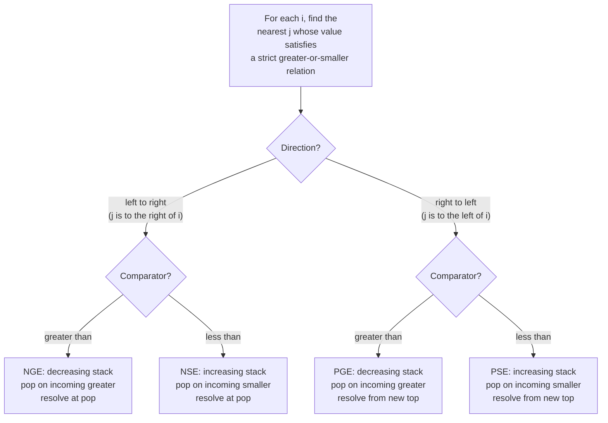

# Monotonic stack

A length-100,000 array of integer temperatures. For every day, find how many days you wait until a warmer one. The honest first try is two nested loops: for each day, scan forward until the temperature exceeds today's. It works on the chapter's eight-day example. On the real LeetCode test it dies, because the worst input is monotonically decreasing — every day scans to the end, ten billion comparisons total, and the judge cuts it off long before the answer prints.

This chapter is the one-line change that drops it to twenty thousand stack operations. The data structure that does it is a stack you've already seen, with a single new rule attached: the values at successive stack positions, read bottom to top, stay monotonic. Every push that would break the rule is preceded by zero or more pops that restore it. The popped elements are exactly the ones whose answer is now known.

## Locating this pattern

Two conditions have to hold together for monotonic stack to be the right answer.[^1] One: the problem asks, for each position `i` in an array, *what is the nearest position `j` whose value is greater than (or smaller than) `nums[i]`?* Two: the array is processed in linear position order from one end to the other. Either condition alone is not enough. Hash maps answer "nearest by value" without position order. Segment trees answer "range queries" without per-element nearest semantics. The intersection is what monotonic stack is designed for.



*The four-way framing: pick direction (left-to-right scan resolves "next" answers; right-to-left resolves "previous"), then pick comparator (decreasing stack for greater, increasing for smaller). All four variants share the same push-once-pop-at-most-once accounting; only the inequality and the resolution timing change.*

Three signal phrases flag the pattern on first read of the prompt. *"Next greater"*, *"next warmer"*, *"next bigger"* is the literal NGE shape; LC 496, LC 503, LC 739 all phrase it this way. *"Largest rectangle"* in a histogram is the previous-smaller-plus-next-smaller composition that gives this chapter its Hard signature problem. *"Stock span"* or anything framed as "for each day, count consecutive previous days satisfying X" is the previous-greater shape on a streaming feed. When any of these phrasings shows up paired with a one-pass-over-an-array constraint, monotonic stack is the optimization that drops the runtime from O(n²) to O(n).

The prerequisite is [Stacks and the call stack analogy](../part-1-linear-data-structures/05-stacks.md), which introduces the LIFO ADT with `push`, `pop`, `peek` in O(1). This chapter adds **one monotonicity invariant** on top: the values at successive stack positions form a monotonic sequence. The two chapters are a layered pair. Treat 1.5 as the substrate; treat 4.0 as the discipline imposed on it.

## Why the obvious approach times out

Brute force is the natural first attempt. For each index, scan right until you find a warmer day.

```python
# Brute force: O(n^2) — what we're replacing
def daily_temperatures_brute(temps):
    n = len(temps)
    answer = [0] * n
    for i in range(n):
        for j in range(i + 1, n):
            if temps[j] > temps[i]:
                answer[i] = j - i
                break
    return answer
```

Correct on small inputs. Catastrophic on a strictly decreasing array of size 100,000: every outer iteration runs the inner loop to the end, and the total comparison count lands near `n²/2`, around five billion. LC 739's time limit is two seconds.[^2] Four seconds of the wrong answer is still the wrong answer.

The redundancy is staring at you. When the inner loop sits at index `j` looking back at index `i`, it is recomputing work the previous outer iteration already started. There is no memory between iterations. The fix is to give the algorithm a memory.

Stand the array on its head. Walk left to right. The indices you've seen but not yet resolved — the ones still waiting for a warmer day — accumulate. Every time a new value arrives, you check whether it resolves any of the waiting ones. If it does, you pop them off, write their answers, and continue. The waiting list is a stack, and the values along that stack are monotonically decreasing by construction: any time an incoming value would break the order, the violating entries get popped first.

That's the whole pattern. Two lines of cognitive overhead beyond a regular stack: store **indices** (not values), and pop **while** the comparison fires (not just `if`).

## The pattern

The template is twelve lines. Initialize an empty stack and a zeroed answer array. For each new index, pop while the top of the stack has a smaller value, resolving each popped index against the index that caused the pop. Push the new index. When the loop ends, indices still on the stack have no warmer day; their answer slots stay zero by construction.

```python
def daily_temperatures(temperatures):
    n = len(temperatures)
    answer = [0] * n
    stack = []  # decreasing stack of indices
    for i, t in enumerate(temperatures):
        while stack and temperatures[stack[-1]] < t:
            j = stack.pop()
            answer[j] = i - j
        stack.append(i)
    return answer
```

**Solution** — Python ([Java](./00-monotonic-stack/lc-739/sol.java) · [C++](./00-monotonic-stack/lc-739/sol.cpp) · [Go](./00-monotonic-stack/lc-739/sol.go))

```python
# LC 739. Daily Temperatures
from typing import List


def daily_temperatures(temperatures: List[int]) -> List[int]:
    """LC 739. Returns days-until-warmer for each day; 0 if none."""
    n = len(temperatures)
    answer = [0] * n
    stack: List[int] = []  # decreasing stack of indices
    for i, t in enumerate(temperatures):
        while stack and temperatures[stack[-1]] < t:
            j = stack.pop()
            answer[j] = i - j
        stack.append(i)
    return answer
```

Three things in this loop body deserve attention.

The stack stores **indices**, not values. The value is one dereference away (`temperatures[stack[-1]]`). The index is irrecoverable from the value once it's been pushed, because two different days can share the same temperature. Storing values is the most common monotonic-stack bug; the leetcopilot.dev cheat sheet ranks it first of five.[^3]

The pop is a `while`, not an `if`. An incoming value of 76 might resolve five waiting days at once if all five had smaller temperatures. The inner loop runs zero or more times per outer iteration, then exactly one push fires. This is the structure that makes the next paragraph's amortization argument work.

The comparison is **strict** less-than. `temperatures[stack[-1]] < t` pops on a strictly smaller waiting value; an equal-valued waiting day is not warmer, so it stays on the stack. LC 739 says "warmer", which is strict. Other variants flip this: LC 901 Online Stock Span uses `<=` because its definition of span is non-strict. The inequality matches the problem's strict / non-strict definition; pick the wrong one and duplicates get popped too soon.

## Why the work stays linear

The inner `while` looks like it might make this O(n²). It doesn't. Each index is pushed onto the stack exactly once, by the outer loop's single push at the bottom of every iteration. Each index is popped at most once, because nothing re-enters the stack after a pop. Total stack operations are therefore bounded by 2n, and each is O(1). Outer-loop work that isn't stack-related is also O(1) per iteration. The total is O(n).

This is the canonical example *Programming Pearls* gives for amortized analysis: a linear-time scanning algorithm with amortized constant work per element, even though any single iteration can do up to k pops.[^4] CLRS Chapter 16 develops the same argument as the aggregate-analysis framework's worked example, and it's the same potential argument that justifies dynamic-array doubling.[^5] The space bound is O(n) too: the worst case is a strictly decreasing input where no pop ever fires and every index ends up on the stack. The output array contributes another O(n).

## Worked example

Input is the LC 739 canonical: `temperatures = [73, 74, 75, 71, 69, 72, 76, 73]`.[^6]

The first three days each pop their predecessor immediately. 73 gets pushed; 74 pops 73 with `answer[0] = 1`; 75 pops 74 with `answer[1] = 1`. The stack now holds `[2]` and the answer array reads `[1, 1, 0, 0, 0, 0, 0, 0]`.

The next two days don't trigger any pops. 71 is smaller than 75; it joins the stack. 69 is smaller than 71; it joins too. Stack becomes `[2, 3, 4]`. No answer slot moves.

Day 5 is where the work happens. Value 72 pops index 4 (value 69) with `answer[4] = 1`, then pops index 3 (value 71) with `answer[3] = 2`, then stops because index 2 has value 75 which is larger. Push 5. Stack is `[2, 5]`.

Day 6 is the dramatic moment. Value 76 pops index 5 with `answer[5] = 1`, then pops index 2 with `answer[2] = 4`. Index 2 had been waiting on the stack across four days for a value larger than 75, and 76 finally delivers. The four-day distance is the number you could not have recovered if the stack had stored values instead of indices. Push 6. Stack is `[6]`.

Day 7 is value 73, smaller than 76. No pop, just a push. Stack is `[6, 7]`. Loop ends. Indices 6 and 7 keep their `answer[i] = 0` defaults; neither has a warmer day in the array.

> **Interactive widget:** [Monotonic stack (next-greater scan)](../widgets/w-11-monotonic-stack.yml) (panel `default`) — rendered on the website; the YAML spec describes the keyframes.

*Static fallback: the stack grows to `[2, 3, 4]` after day 4 and reaches its peak just before day 5 fires the first pop chain; the dramatic resolution at day 6 sees `answer[2] = 4` printed after a four-day wait.*

Final answer: `[1, 1, 4, 2, 1, 1, 0, 0]`. Eight pushes, six pops, two indices left on the stack. The total stack-operation count is 14, comfortably within the 2n = 16 amortization bound.

## Largest rectangle: the sentinel-pop trick

LC 84 Largest Rectangle in Histogram is the chapter's signature problem.[^7] The histogram is a row of bars of equal width and integer heights; the answer is the area of the biggest axis-aligned rectangle that fits inside the silhouette. On `heights = [2, 1, 5, 6, 2, 3]`, the answer is 10. The rectangle spans the bars at indices 2 and 3, height 5, width 2.[^8]

The algorithm is monotonic stack with two changes from LC 739. The stack is **non-decreasing** instead of decreasing: a new bar pops while the top of the stack is *taller*, because each popped bar's rectangle is now bounded on the right (by the incoming shorter bar) and on the left (by the new stack top, or by the array's left edge if the stack went empty). Resolution computes area `h * w` where `w = i - newTop - 1`, the width of the open interval bounded by the new top on the left and the incoming index on the right.

```python
def largest_rectangle_area(heights):
    ans = 0
    stack = []  # non-decreasing stack of indices
    n = len(heights)
    for i in range(n + 1):
        cur = 0 if i == n else heights[i]
        while stack and heights[stack[-1]] > cur:
            h = heights[stack.pop()]
            w = i if not stack else i - stack[-1] - 1
            if h * w > ans:
                ans = h * w
        stack.append(i)
    return ans
```

**Solution** — Python ([Java](./00-monotonic-stack/lc-84/sol.java) · [C++](./00-monotonic-stack/lc-84/sol.cpp) · [Go](./00-monotonic-stack/lc-84/sol.go))

```python
# LC 84. Largest Rectangle in Histogram
from typing import List


def largest_rectangle_area(heights: List[int]) -> int:
    """LC 84. Returns max rectangle area in histogram."""
    ans = 0
    stack: List[int] = []  # non-decreasing stack of indices
    n = len(heights)
    for i in range(n + 1):
        cur = 0 if i == n else heights[i]
        while stack and heights[stack[-1]] > cur:
            h = heights[stack.pop()]
            w = i if not stack else i - stack[-1] - 1
            if h * w > ans:
                ans = h * w
        stack.append(i)
    return ans
```

The new piece is the loop range. It runs to `n` inclusive, with `cur = 0` at the final step. That phantom zero-height bar at index `n` is the **sentinel**. Without it, a strictly increasing input like `[1, 2, 3, 4, 5]` never triggers a pop during the main loop. Every bar is taller than the last, so the stack just grows, and the function returns `ans = 0` instead of the correct 9. The sentinel guarantees every remaining bar gets popped before the function returns, because the phantom 0 is shorter than every possible bar height.

The width formula deserves slowing down. After popping the bar at index `j`, the rectangle of height `heights[j]` is bounded on the right by `i` (exclusive: `i` is what caused the pop, so it's strictly shorter and not part of the rectangle) and on the left by the new stack top (also exclusive, since the new top is strictly shorter — the stack maintained the non-decreasing invariant up to but not including `j`). The rectangle occupies the open interval `(newTop, i)`, which contains `i - newTop - 1` indices. If the stack is empty after the pop, the left bound is the array's left edge at index `-1`, so `w = i - (-1) - 1 = i`. Writing this as `i - newTop` instead of `i - newTop - 1` is the canonical off-by-one bug; the LC 84 official editorial documents it as a recurring submission failure.[^8]

The amortization argument carries over verbatim. Each bar is pushed once and popped at most once. The total work is O(n), exactly as for LC 739, even though the resolution function is meatier.

## What it actually costs

| Variant | Time | Space | Notes |
|---|---|---|---|
| Next-greater scan (LC 496, LC 739) | O(n) | O(n) | Each index pushed once, popped at most once. Output array is O(n). |
| Next-greater on circular array (LC 503) | O(n) | O(n) | Iterate to 2n with `i mod n` indexing; push only on the first pass. |
| Largest rectangle with sentinel (LC 84) | O(n) | O(n) | The sentinel at `i == n` flushes leftover bars. Constants are 2x of LC 739 due to the area arithmetic; asymptotics are identical. |
| Maximal rectangle on m × n binary matrix (LC 85) | O(m × n) | O(n) | Build per-row histograms; run LC 84 on each. |
| Brute force | O(n²) | O(1) | The wrong answer; what we replaced. |

The amortization argument is the same one CLRS uses for stack push/pop: aggregate the bounded inner-loop work across the entire run, charge each push and pop once, conclude that the total operation count cannot exceed 2n no matter how the input is shaped.[^5] *Programming Pearls* Column 8 frames this as the canonical illustration of why aggregate analysis is non-optional reasoning for sequence algorithms.[^4]

For LC 84, the bound is also tight in the integer-overflow sense. Heights up to 10⁴ and array length up to 10⁵ give a maximum rectangle area of 10⁹, which fits in a signed 32-bit integer (`2^31 - 1 ≈ 2.15 × 10⁹`). No `long` promotion needed; `int` is correct in Java, C++, and Go.

## Two pitfalls that bite

> [!WARNING]
> **Storing values instead of indices.** The stack holds `temperatures[i]` instead of `i`. On LC 739 the answer becomes "the warmer temperature value" rather than "the days until warmer", and there is no way to recover the index from the value alone, because different days can share the same temperature. The fix: always store indices. The value is one dereference away (`temperatures[stack[-1]]`); the index is irrecoverable. CP-Algorithms' canonical formulation and the leetcopilot.dev pattern guide both flag this as the most-frequent monotonic-stack bug.[^3]

> [!WARNING]
> **Off-by-one in LC 84's width.** Writing `w = i - stack[-1]` after a pop computes a width one larger than reality, because the new stack top is itself a smaller-valued bar that is *not* part of the popped rectangle. Submissions get close-to-correct outputs that are off by one column on every test case. The rectangle spans the open interval `(newTop, i)`, which contains `i - newTop - 1` indices; that's the formula. The walkccc reference implementation makes it explicit: `w = stack.empty() ? i : i - stack.top() - 1`.[^7]

A third bug worth naming briefly: confusing the four directions. NGE, PGE, NSE, PSE all share the same template structure with the inequality and the scan direction flipped. A coder who memorized one template often misapplies it because the axis labels live in the writer's head, not in the code. Fix: write the four-way framing as a comment at the top of the function. Direction is "left-to-right scan resolves next answers; right-to-left scan resolves previous answers." Comparator is "decreasing stack pops on incoming greater; increasing stack pops on incoming smaller."

## Two cousins worth seeing

LC 84 generalizes one dimension up to LC 85 Maximal Rectangle: a binary matrix where the answer is the largest all-1s rectangle. The reduction is to treat each row as the base of a histogram, where the column-height at column `c` for row `r` is the number of consecutive 1s ending at `(r, c)`. Run LC 84 on each row's histogram and track the global max. Total cost O(m × n), which is provably optimal because every cell of the input must be examined at least once.

LC 503 Next Greater Element II is LC 739 with a circular twist. The array wraps; the next greater element of `nums[n-1]` may be `nums[0]`. The standard trick is to iterate to `2n - 1` with `i mod n` for index lookups, but only push real indices in `[0, n)`. The second pass exists to resolve waiting indices, not to add new ones. This keeps each real index on the stack at most once and preserves the O(n) bound.

Both problems sit on the chapter's STRETCH ladder. They reuse this chapter's template verbatim with one small change each; nothing new to learn beyond what the worked examples installed.

LC 42 Trapping Rain Water deserves a brief mention here even though [Two pointers: opposite ends](../part-3-pointers-window-prefix/00-two-pointers-opposite.md) owns it. The monotonic-stack solution to LC 42 pops bars whose water layer is now bounded on both sides; it's one of two textbook approaches and a useful cross-check. If you've internalized the four-way framing above, working out LC 42 from the stack angle takes ten minutes. Keep the two-pointer solution as your primary, and treat the stack solution as confirmation that the same problem yields to multiple lenses.

## Problem ladder

### CORE (solve all three to claim chapter mastery)

- [LC 496 — Next Greater Element I](https://leetcode.com/problems/next-greater-element-i/) [Easy] • monotonic-stack-next-greater
- [LC 739 — Daily Temperatures](https://leetcode.com/problems/daily-temperatures/) [Medium] • monotonic-stack-next-greater
- [LC 84 — Largest Rectangle in Histogram](https://leetcode.com/problems/largest-rectangle-in-histogram/) [Hard] • monotonic-stack-rectangle ★

### STRETCH (optional)

- [LC 503 — Next Greater Element II](https://leetcode.com/problems/next-greater-element-ii/) [Medium] • monotonic-stack-next-greater-circular
- [LC 85 — Maximal Rectangle](https://leetcode.com/problems/maximal-rectangle/) [Hard] • monotonic-stack-rectangle-2d

LC 84 is the chapter's signature problem (★) and gets the dedicated editorial widget at Appendix C. LC 739 is the gentlest second pass after LC 496: same template, the resolution function changes from "the value at the cause-of-pop index" to "the distance to the cause-of-pop index." LC 503 forces the doubling trick and the "push only on first pass" subtlety; LC 85 forces the per-row histogram reduction.

## Where this leads

The next chapter, [Monotonic deque](./01-monotonic-deque.md), takes the monotonicity invariant and stretches it from "monotonic at one end of a stack" to "monotonic at both ends of a deque inside a sliding window." LC 239 Sliding Window Maximum is its canonical problem; the data-structure invariant is the same one this chapter installed, applied to a different access shape. If 4.0 felt clean, 4.1 will feel like the same trick you already know with two more pointers to keep track of.

Sum-of-subarray-minimums problems (LC 907) extend the previous-smaller-plus-next-smaller composition from this chapter into contribution counting. They live in Part 9 dynamic programming because the closed-form summation is the harder half. The data structure is yours already.

## References

[^1]: software.land, "Monotonic Stack: Equality Nuances and Pattern Templates," <https://software.land/monotonic-stack/>.

[^2]: LeetCode, "739. Daily Temperatures," <https://leetcode.com/problems/daily-temperatures/>.

[^3]: leetcopilot.dev, "Monotonic Stack Cheat Sheet for Beginners," <https://leetcopilot.dev/blog/monotonic-stack-cheat-sheet-for-beginners>.

[^4]: Jon Bentley, *Programming Pearls*, 2nd ed., Addison-Wesley, 2000, Column 8 ("Algorithm Design Techniques").

[^5]: Cormen, Leiserson, Rivest, Stein, *Introduction to Algorithms*, 4th ed., MIT Press, 2022, Chapter 16 §16.1 (Aggregate analysis) and §16.3 (The potential method).

[^6]: CP-Algorithms, "Stack: Applications" (translated from e-maxx.ru), <https://cp-algorithms.com/data_structures/stack_queue_modification.html>.

[^7]: walkccc, "84. Largest Rectangle in Histogram," LeetCode Solutions, <https://walkccc.me/LeetCode/problems/84/>.

[^8]: LeetCode official editorial, "84. Largest Rectangle in Histogram," <https://leetcode.com/problems/largest-rectangle-in-histogram/editorial/>.
