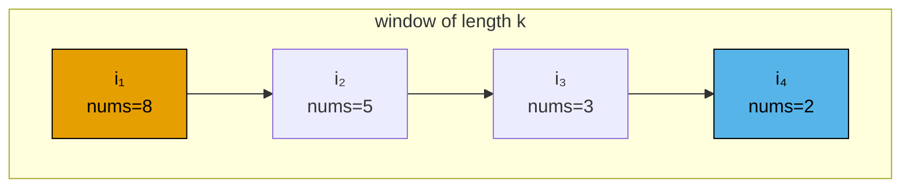
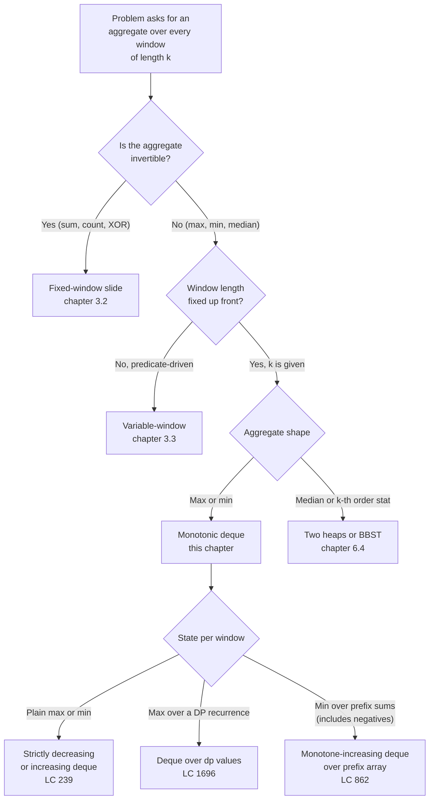

# Monotonic deque

A length-100,000 array of integers. A window of length 3. The problem asks for the maximum value across every contiguous 3-element slice as the window walks the array, which works out to 99,998 answers. The honest first attempt loops over every starting index and scans three numbers for the largest. It works. On a 10⁵-element input it does roughly 3 × 10⁵ comparisons; bump the window to length k = 50,000 and it does 5 × 10⁹, which finishes in about half an hour.

LC 239 (Sliding Window Maximum, Hard) ships with constraints `1 <= nums.length <= 10^5` and `1 <= k <= nums.length`. Those constraints are picked to break the brute force. They also break the obvious second attempt, a heap, which saves you only a logarithmic factor and dies on the bookkeeping needed to delete stale elements. The fix is a data structure built specifically for this question: a deque kept in monotone-decreasing order, where the front is always the answer and stale candidates evict themselves.

## Why the obvious approach gets killed by the constraints

Brute force first.

```python
# Brute force: O(n*k) — what we're replacing
def max_sliding_window_brute(nums, k):
    out = []
    for i in range(len(nums) - k + 1):
        out.append(max(nums[i:i+k]))
    return out
```

Correct on every input. Times out at LC 239's upper bound. The bug isn't the loop; the bug is that each `max(nums[i:i+k])` rescans k-1 numbers it already scanned on the previous iteration. The window slid by one element. Two of every three numbers stayed put. Brute force re-examined them anyway.

The instinct trained by the previous chapter is to amortise: keep a running aggregate, update it in O(1) per slide. That worked for [Sliding window: fixed size](../part-3-pointers-window-prefix/02-sliding-window-fixed.md) because the aggregate was a sum, and a sum is invertible. To remove the leaving element, subtract it. Try the same trick on a maximum and the wheels come off. When the current window's max slides off the left edge, you have no record of the second-largest value. You know the answer is gone but not what replaced it. Maximum isn't invertible.

A heap fixes the lookup but not the bookkeeping. Push every entering element into a max-heap, peek for the answer, pop when the top is stale. The peek is O(1). The pop is O(log k). The trouble is *staleness detection*: when the heap's top has an index outside the current window, you discard and peek again, which is fine, but you also have to keep the heap from growing unbounded as elements that will never be the max sit at the bottom forever. Standard practice is to store `(value, index)` pairs and lazily pop on peek. Total time: O(n log k). For n = 10⁵ and k = 5 × 10⁴ that's about 1.7 million heap operations. It passes LC 239. It also costs a logarithmic factor we don't have to pay.

The monotonic deque costs zero. Each index enters the deque once and leaves once across the whole run; per-shift cost is O(1) amortised, total O(n) regardless of k. This is a problem-shape where the right data structure beats the right algorithm.

## The invariant

Store indices, not values. Keep the deque in *strictly decreasing* order of `nums[idx]`. Then three things hold at every step:

1. The front index is the argmax of the current window.
2. Every index in the deque is younger than `i - k`, so the front is always inside the window.
3. The number of indices is at most k.

The first claim is the load-bearing one. Why is the front the max? Because of the strict ordering: every other index in the deque has a smaller `nums[idx]`. Any index *not* in the deque was popped from the back by a later, larger value, meaning some still-alive index dominates it. So the maximum lives in the deque, and within the deque it lives at the front by construction.



*The deque holds candidate indices in strictly decreasing order of value. The front (orange) is the current window's maximum. The back (blue) is whichever new arrival has not yet been dominated. Every index between is a future maximum: it becomes the front once everyone older is dropped.*

The invariant is what 4.1 teaches that the prerequisite chapters deliberately don't. [Queues and deques](../part-1-linear-data-structures/06-queues-deques.md) covers the data structure: push and pop on both ends in O(1). [Sliding window: fixed size](../part-3-pointers-window-prefix/02-sliding-window-fixed.md) covers the windowed-aggregate pattern for invertible aggregates. Monotonic deque is the bridge: a windowed aggregate that *isn't* invertible (max), made cheap by maintaining a witness structure rather than a single value.

## The pattern

Four operations per index, run in this order:

1. **Drop-front.** If the front index has aged out of the window (`dq.front() <= i - k`), pop it.
2. **Pop-tail.** While the back's value is `<=` the new element, pop it. The back can never be the window-max while the new element is alive.
3. **Push.** Append the new index. The deque is again strictly decreasing.
4. **Emit.** Once the first window is full (`i >= k - 1`), append `nums[dq.front()]` to the output.

```python
from collections import deque

def max_sliding_window(nums, k):
    dq = deque()  # holds indices; nums[dq[0]..dq[-1]] strictly decreasing
    out = []
    for i, x in enumerate(nums):
        if dq and dq[0] <= i - k:
            dq.popleft()
        while dq and nums[dq[-1]] <= x:
            dq.pop()
        dq.append(i)
        if i >= k - 1:
            out.append(nums[dq[0]])
    return out
```

**Solution** — Python ([Java](./01-monotonic-deque/lc-239/sol.java) · [C++](./01-monotonic-deque/lc-239/sol.cpp) · [Go](./01-monotonic-deque/lc-239/sol.go))

```python
# LC 239. Sliding Window Maximum
from collections import deque
from typing import List


def max_sliding_window(nums: List[int], k: int) -> List[int]:
    """Return the maximum of every contiguous window of size k.

    Invariant: dq stores indices in strictly decreasing order of nums[index].
    The front index is therefore always the argmax of the current window.
    Indices, not values, so the head's age is checkable against i - k.
    """
    dq: deque[int] = deque()
    out: List[int] = []
    for i, x in enumerate(nums):
        # Drop indices that fell out of the left edge of the window.
        if dq and dq[0] <= i - k:
            dq.popleft()
        # Maintain decreasing monotonicity: any tail value <= x is dominated.
        while dq and nums[dq[-1]] <= x:
            dq.pop()
        dq.append(i)
        if i >= k - 1:
            out.append(nums[dq[0]])
    return out
```

Two subtleties bite first-time writers.

The deque holds *indices*, not values. Two reasons. The first is staleness: comparing `dq[0] <= i - k` requires the index to be visible. Storing `(value, index)` pairs works but doubles memory; storing values alone makes staleness detection impossible because you can't tell which copy of a repeated value is the old one. The second is that values can repeat. `nums = [5, 5, 5, 5, 5]` is a legal input, and the strict-inequality pop rule (`<=`) ensures only the most recent copy survives, which is the one whose age you want to track.

The pop rule is `<=`, not `<`. With `<`, two equal values both stay in the deque, which is correct but wasteful. With `<=`, the older copy is evicted the moment a tie arrives, because it can never beat the newer copy and it ages out first. On the all-equal preset the deque oscillates between length 1 and length 0; on a strictly decreasing input it grows to length k and then drop-front does all the eviction. Both extremes exercise different parts of the same machine.

## Worked example: LC 239 on `[1, 3, -1, -3, 5, 3, 6, 7]` with `k = 3`

The expected output is `[3, 3, 5, 5, 6, 7]`, six windows on an 8-element array.

The build phase fills the first window. By the time `i = 2`, the deque holds the indices of the still-relevant candidates from `nums[0..2] = [1, 3, -1]`. The 1 was popped at `i = 1` when 3 arrived and dominated it. So the deque is `[1, 2]`, values `[3, -1]`, and the first emit returns `nums[1] = 3`.

The interesting moment is the third emit, at `i = 4`, value `5`. Three things have to happen in order. The witness, index 1 with value 3, has aged out, so drop-front fires once. Then the new value 5 dominates everything still in the deque (the `-1` at index 2, the `-3` at index 3), so pop-tail fires twice and the deque empties. Push the new index. Emit. The output goes from `[3, 3]` to `[3, 3, 5]`. One step did all four operations on the same iteration.

Across the eight iterations: 8 pushes, 6 pops from the back, 2 drops from the front, 6 emits. Sixteen O(1) operations total. The widget below replays each step.

> **Interactive widget:** [Monotonic deque (sliding window maximum)](../widgets/w-12-monotonic-deque.yml) (panel `default`) — rendered on the website; the YAML spec describes the keyframes.

*Static fallback: the deque trajectory across the run is `[1] → [3] → [3,-1] → [3,-1,-3] → [-1,-3] → [-1] → [] → [5] → [5,3] → [3] → [] → [6] → [] → [7]`, with emits at i = 2, 3, 4, 5, 6, 7 producing `[3, 3, 5, 5, 6, 7]`. Each index appears in the deque exactly once.*

## Locating this pattern

The monotonic-deque trigger is narrow and specific. Three conditions have to all hold.



*The decision tree separating monotonic deque from its neighbours. The dividing line between this chapter and chapter 3.2 is invertibility; the dividing line between this chapter and chapter 6.4 is whether the aggregate is order-statistic-shaped.*

The pattern generalises past LC 239 in one direction worth knowing. Any DP recurrence of the shape `dp[i] = nums[i] + max(dp[j] for j in [i-k, i-1])` is a sliding-window-maximum on the `dp` array, which means the deque turns it from O(nk) into O(n). LC 1696 (Jump Game VI) is the canonical instance. The trick to spotting it is to write the recurrence first, then notice the inner `max` is taken over a length-k window of values you've already computed. At that point the same machine applies, with `dp[i]` taking the place of `nums[i]`.

## What it actually costs

| Approach | Time | Space | Notes |
|---|---|---|---|
| Monotonic deque | O(n) | O(k) | Each index pushed once, popped once across the whole run. |
| Max-heap with lazy deletion | O(n log k) | O(n) | Stores stale entries; pop until heap top is in-window. Simpler to write, slower. |
| Two pointers + scan | O(nk) | O(1) | The brute force. Times out at the LC 239 constraint upper bound. |
| Sparse table (precomputed RMQ) | O(n log n) preprocess, O(1) query | O(n log n) | Wins on offline, fixed-array max-queries; loses to the deque on streaming windows. |

The amortised bound is the textbook charging argument and the chapter's central proof.[^1] Charge each iteration with two units: one for the unconditional push, one for the at-most-one drop-front. The pop-tail loop is unbounded per iteration in the worst case (a strictly decreasing input followed by a single large value pops k-1 elements in one shot), but every popped index was previously pushed exactly once. The total number of pop-tails summed across all iterations therefore can't exceed the total number of pushes, which is n. So: n pushes, at most n pop-tails, at most n - k + 1 drop-fronts, all O(1) each. Total work is O(n).

This is the same argument CLRS Chapter 16 §16.1 uses for the dynamic-array doubling cost and for stack push/pop, sometimes called the *aggregate method*.[^2] The per-iteration *worst case* is Θ(k), drop-front plus k-1 pop-tails on the rare iteration where everything in the deque dies at once, but that iteration is preceded by k-1 cheap iterations that did the pushing. Sum across all n and you get O(n).

The space bound is independent of n. Every index in the deque satisfies `i - dq.front() < k`, so the deque holds at most k indices at any point. The output array contributes a separate O(n - k + 1) = O(n) space; the O(k) figure in the table is the deque alone.

## When the pattern bends

### Window minimum: flip the inequality

Sliding window minimum is the same algorithm with the comparison flipped to `>=`. The deque becomes strictly *increasing* instead of strictly decreasing; the front still holds the answer. Don't write a separate function. Parameterise on `cmp` if your language supports it, or write a `min_sliding_window` that copies the structure and inverts the one comparison. LC 1438 (Longest Continuous Subarray With Absolute Diff Less Than or Equal to Limit) needs both directions running in parallel: one deque tracking the window max, another tracking the window min, with the predicate `max - min <= limit`.

### Monotone-increasing deque over prefix sums (LC 862)

When the question is "shortest subarray with sum at least K including negatives", the running sum isn't monotone, so binary search over prefix sums doesn't apply. The deque trick survives, but applied to the prefix-sum array rather than the input directly. Maintain a monotone-increasing deque of prefix-sum indices. For each `r`, pop the back while `prefix[r] <= prefix[dq.back()]` (those entries can never be the optimal left endpoint), then pop the front while `prefix[r] - prefix[dq.front()] >= K` (a valid subarray; record its length and advance because no shorter one starts here). The amortisation argument has the same shape as LC 239: each index enters and leaves the deque at most once.[^3] Twist: prefix sums of an array containing negatives aren't monotone, so the back-pop has to compare prefix-sum values, not indices.

### When the deque is the wrong tool

Sliding-window *median* (LC 480) needs a different structure entirely: typically two heaps, balanced by size, or a sorted multiset. The deque depends on the ability to discard dominated candidates; under maximum, the *currently larger* value dominates the smaller. Under median, no value dominates any other. Every value might become the median once enough elements join or leave. Reach for [Heaps](../part-6-trees-heaps/04-heaps-priority-queues.md) when the aggregate is order-statistic-shaped.

## Two pitfalls that bite

> [!WARNING]
> **Storing values instead of indices.** The instinct on a first attempt is to store `nums[i]` in the deque rather than `i`. The push-and-pop logic still works, but staleness detection breaks. Given `nums = [5, 5, 5, 5, 5]` and `k = 3`, every entry is the same value; you can't tell which `5` is the oldest, so you can't tell when to drop-front. The fix is to store indices throughout and read `nums[dq[0]]` only at emit time. The Java sample in `Deque<Integer>` form makes this obvious; in Python, where deque elements are typed loosely, a beginner can write `dq.append(x)` instead of `dq.append(i)` and pass several test cases before failing on a duplicate-heavy one.

> [!WARNING]
> **Comparing with `<` instead of `<=` on the pop-tail.** Both work for distinct inputs. On inputs with ties, `<` keeps duplicates in the deque while `<=` evicts the older copy. The bug surfaces as a stale front: an older index whose value equals the current one stays on the front, ages out, and gets dropped *while a still-alive copy of the same value is sitting behind it*. The current emit is correct, but on the next iteration the front index is the live copy with the *wrong* effective age, and a later drop-front fires when it shouldn't. The fix is the strict-inequality pop rule on the way in; the chapter's reference uses `<=` for that reason.

A third pitfall worth naming briefly: in C++, indexing the deque with an unsigned size type and computing `dq.front() <= i - k` on `size_t i` underflows when `i < k` and silently turns the front-drop check into "front is always stale." The reference C++ keeps `i` as `int` for exactly this reason. Languages that signed-integer-by-default, such as Python, Java, and Go, sidestep the issue.

## Problem ladder

### CORE (solve to claim chapter mastery)

- [LC 239 — Sliding Window Maximum](https://leetcode.com/problems/sliding-window-maximum/) [Hard] • monotonic-deque-window-extremum ★

### STRETCH (optional)

- [LC 1696 — Jump Game VI](https://leetcode.com/problems/jump-game-vi/) [Medium] • monotonic-deque-over-dp
- [LC 862 — Shortest Subarray with Sum at Least K](https://leetcode.com/problems/shortest-subarray-with-sum-at-least-k/) [Hard] • monotonic-deque-over-prefix-sums

LC 239 is the chapter's signature problem (★) and the one the worked example and widget animate; the pattern admits no canonical Easy instance, so the CORE rung is solo by design (`ladder_curation_flag: no-easy-canonical`). LC 1696 is the cleanest second pass: write the DP recurrence, recognise the inner `max` is a sliding-window-maximum on the `dp` array, drop in this chapter's algorithm. LC 862 is the prefix-sum twist: same machine, different array, plus the monotone-increasing variant for window minimum.

## Where this leads

The next pattern in the part is [Min/max stack](./02-min-max-stack.md), which solves the related but distinct problem of "track the running min over an unbounded stream of pushes and pops." Same monotonicity instinct, different shape: a stack instead of a windowed array, and the monotone structure lives in a parallel stack rather than as the data structure itself. The deeper bridge is to [Heaps](../part-6-trees-heaps/04-heaps-priority-queues.md), which generalise the order-statistic question past max-and-min and into k-th-largest, median, and weighted variants, the territory the monotonic deque cannot reach.

## References

[^1]: cp-algorithms, "Minimum stack / Minimum queue — Queue modification (method 2)." <https://cp-algorithms.com/data_structures/stack_queue_modification.html>.

[^2]: Cormen, Leiserson, Rivest, Stein, *Introduction to Algorithms*, 4th ed., MIT Press, 2022, Chapter 16 §16.1 (Aggregate analysis).

[^3]: Project Nayuki, "Sliding window minimum/maximum algorithm." <https://www.nayuki.io/page/sliding-window-minimum-maximum-algorithm>.
